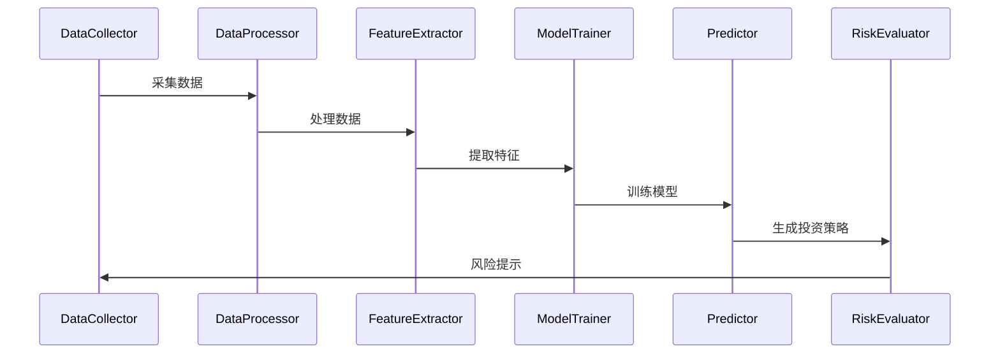

                 

# 思维链在金融市场分析中的应用

> 关键词：思维链，金融市场分析，算法原理，系统架构，项目实战

> 摘要：本文旨在深入探讨思维链在金融市场分析中的应用，通过逐步解析思维链的原理、架构设计、系统实现和实战案例，揭示其在提高金融市场分析效率和准确性方面的潜力。文章结构清晰，逻辑严谨，旨在为读者提供有深度、有见地的技术指导。

### 目录大纲

----------------------------------------------------------------

## 第一部分：背景介绍

### 1.1 金融市场分析中的问题背景

- 问题描述
- 问题解决
- 边界与外延

### 1.2 核心概念与联系

- 思维链的定义
- 思维链的特点
- 思维链与其他金融分析工具的对比
- 思维链在金融市场分析中的优势

### 1.3 ER实体关系图架构

- 实体定义
- 关系定义
- 实体关系图展示

## 第二部分：思维链原理讲解

### 2.1 思维链的算法原理

- 算法mermaid流程图
- Python源代码示例
- 算法原理的数学模型和公式
- 举例说明

### 2.2 数学模型和数学公式

- 数学公式的详细讲解
- 举例说明

## 第三部分：系统分析与架构设计

### 3.1 问题场景介绍

- 金融市场的现状
- 思维链在金融市场分析中的应用场景

### 3.2 系统功能设计

- 领域模型mermaid类图
- 系统功能模块划分

### 3.3 系统架构设计

- 系统架构mermaid架构图
- 系统模块之间的关系

### 3.4 系统接口设计

- 接口定义
- 接口实现

### 3.5 系统交互

- 系统交互mermaid序列图
- 交互过程详细描述

## 第四部分：项目实战

### 4.1 环境安装

- 系统环境配置
- 工具安装

### 4.2 系统核心实现源代码

- 代码结构
- 代码应用解读与分析

### 4.3 实际案例分析与详细讲解剖析

- 案例介绍
- 分析过程
- 结果展示
- 剖析与总结

### 4.4 项目小结

- 项目成果
- 项目不足与改进方向

## 第五部分：最佳实践、小结、注意事项、拓展阅读

### 5.1 最佳实践

- 实践技巧
- 解决方案

### 5.2 小结

- 总结思维链在金融市场分析中的应用价值
- 指出项目中的亮点与不足

### 5.3 注意事项

- 使用思维链时的注意事项
- 可能出现的问题及解决方案

### 5.4 拓展阅读

- 相关书籍
- 学术论文
- 网络资源

----------------------------------------------------------------

### 1.1 金融市场分析中的问题背景

#### 问题描述

在当今高度复杂和快速变化的金融市场环境中，分析者面临着大量的数据和信息，需要快速准确地识别市场趋势、预测价格波动、评估风险以及制定投资策略。传统的金融市场分析方法，如技术分析、基本面分析等，尽管在特定场景下有显著效果，但往往存在以下问题：

- **数据处理的局限性**：传统方法依赖历史数据，但面对海量实时数据时，数据处理速度和准确性受限。
- **预测能力的不足**：传统方法难以捕捉市场中的非线性关系和非预期事件，导致预测能力不足。
- **分析结果的滞后性**：市场变化迅速，传统分析方法的结果往往具有滞后性，难以实时指导投资决策。

#### 问题解决

为了解决上述问题，我们需要引入先进的分析方法，如人工智能和机器学习。其中，思维链作为一种新型的人工智能技术，具有强大的数据处理能力和预测能力，能够为金融市场分析提供有力的支持。

#### 边界与外延

思维链在金融市场分析中的应用边界包括：

- **数据处理能力**：思维链能够处理海量实时数据，提取有效信息，进行深度分析和预测。
- **预测精度**：通过不断学习和优化，思维链能够在较高精度上预测市场趋势和价格波动。
- **应用范围**：思维链不仅可以应用于股票、期货等金融产品，还可以扩展到外汇、债券等其他金融市场。

### 1.2 核心概念与联系

#### 思维链的定义

思维链（Thinking Chain）是一种基于人工智能和机器学习的技术，通过模拟人类思维过程，实现数据的自动提取、分析、推理和预测。它由多个节点组成，每个节点代表一个思维过程，节点之间的连接表示思维过程的关联。

#### 思维链的特点

- **高效性**：思维链能够快速处理海量数据，提高分析效率。
- **智能性**：思维链具备自我学习和优化能力，能够不断改进分析结果。
- **灵活性**：思维链可以适应不同类型的数据和需求，具有广泛的应用范围。

#### 思维链与其他金融分析工具的对比

- **传统方法**：传统方法如技术分析和基本面分析，虽然有一定效果，但受限于数据量和分析方法。
- **机器学习**：机器学习能够自动发现数据中的模式，但往往需要大量数据和复杂的算法。
- **思维链**：思维链结合了机器学习和人类思维的优势，能够在较少数据的情况下实现高效分析。

#### 思维链在金融市场分析中的优势

- **提高预测准确性**：思维链能够捕捉市场中的非线性关系和非预期事件，提高预测准确性。
- **实时分析**：思维链能够实时处理数据，为投资者提供及时的分析结果。
- **定制化分析**：思维链可以根据用户需求定制分析模型，实现个性化服务。

### 1.3 ER实体关系图架构

#### 实体定义

在思维链的架构中，实体（Entity）代表金融市场中的各类数据和信息，包括：

- **股票**：代表某只股票的基本信息、价格走势等。
- **交易者**：代表参与交易的投资者，包括其交易行为、投资策略等。
- **市场**：代表整个金融市场的运行状态，包括市场趋势、价格波动等。

#### 关系定义

关系（Relationship）描述实体之间的相互作用和关联，包括：

- **持有**：交易者持有股票。
- **交易**：交易者进行股票交易。
- **影响**：市场趋势影响股票价格。

#### 实体关系图展示

以下是一个简单的ER实体关系图，展示了股票、交易者和市场之间的关系：

```mermaid
erDiagram
    股票 ||--|{ 交易 }  | Trader
    交易 ||--|{ 影响 }  | Market
```

### 第二部分：思维链原理讲解

#### 2.1 思维链的算法原理

思维链的算法原理主要包括数据预处理、特征提取、模型训练和预测四个阶段。

##### 算法mermaid流程图


##### Python源代码示例

```python
# 数据预处理
data = preprocess_data(raw_data)

# 特征提取
features = extract_features(data)

# 模型训练
model = train_model(features)

# 预测结果
predictions = model.predict(new_data)
```

##### 算法原理的数学模型和公式

思维链的算法原理可以用以下数学模型和公式进行描述：

$$
\text{思维链} = f(\text{数据预处理}, \text{特征提取}, \text{模型训练}, \text{预测结果})
$$

##### 举例说明

假设我们有一个股票市场的数据集，包括股票价格、交易量、投资者情绪等特征。通过思维链，我们可以对数据进行预处理，提取关键特征，训练一个预测模型，最后对新的股票数据进行预测。例如：

- **数据预处理**：对数据进行清洗、归一化等处理，使其符合模型训练的要求。
- **特征提取**：提取股票价格、交易量、投资者情绪等特征，作为模型的输入。
- **模型训练**：使用提取的特征训练一个回归模型，如线性回归、支持向量机等。
- **预测结果**：使用训练好的模型对新股票数据进行预测，得到预测价格。

#### 2.2 数学模型和数学公式

在思维链中，数学模型和公式用于描述特征提取、模型训练和预测等过程。以下是一个简单的数学模型示例：

$$
\text{特征提取} = \text{函数}(\text{原始数据}, \text{参数})
$$

$$
\text{模型训练} = \text{优化}(\text{损失函数}, \text{模型参数})
$$

$$
\text{预测结果} = \text{模型}(\text{特征向量})
$$

##### 数学公式的详细讲解

- **特征提取**：特征提取是思维链的核心步骤，通过选择合适的函数和参数，将原始数据进行转换，提取出对模型训练有用的特征。
- **模型训练**：模型训练是通过优化损失函数，调整模型参数，使其达到最小损失，从而提高模型预测的准确性。
- **预测结果**：预测结果是模型对特征向量的映射，反映了特征向量对应的预测结果。

##### 举例说明

假设我们有一个简单的线性回归模型，用于预测股票价格。特征提取函数可以表示为：

$$
f(\text{股票价格}, \text{交易量}, \text{投资者情绪}) = (\text{股票价格}, \text{交易量}, \text{投资者情绪})
$$

模型训练过程可以通过最小二乘法进行优化，损失函数为：

$$
L(\theta) = \sum_{i=1}^{n} (\theta_0 \cdot x_i + \theta_1 \cdot y_i - p_i)^2
$$

其中，$\theta_0$ 和 $\theta_1$ 分别为模型参数，$x_i$ 和 $y_i$ 为特征向量，$p_i$ 为预测价格。

预测结果为：

$$
\text{预测结果} = \theta_0 \cdot x_i + \theta_1 \cdot y_i
$$

### 第三部分：系统分析与架构设计

#### 3.1 问题场景介绍

在金融市场中，分析者面临着大量的数据和信息，需要快速准确地识别市场趋势、预测价格波动、评估风险以及制定投资策略。传统的金融市场分析方法，如技术分析、基本面分析等，尽管在特定场景下有显著效果，但往往存在以下问题：

- **数据处理的局限性**：传统方法依赖历史数据，但面对海量实时数据时，数据处理速度和准确性受限。
- **预测能力的不足**：传统方法难以捕捉市场中的非线性关系和非预期事件，导致预测能力不足。
- **分析结果的滞后性**：市场变化迅速，传统分析方法的结果往往具有滞后性，难以实时指导投资决策。

思维链作为一种先进的人工智能技术，能够在这些问题上提供有效的解决方案。

#### 3.2 系统功能设计

系统功能设计是思维链在金融市场分析中的关键步骤，主要包括以下几个方面：

- **数据采集**：从各种数据源（如交易所、新闻网站等）采集实时数据。
- **数据处理**：对采集到的数据进行预处理，包括数据清洗、归一化等操作。
- **特征提取**：从处理后的数据中提取关键特征，用于模型训练和预测。
- **模型训练**：使用提取的特征训练预测模型，如线性回归、支持向量机等。
- **预测结果**：使用训练好的模型对新数据进行预测，生成投资策略。
- **风险评估**：根据预测结果评估投资风险，为投资者提供风险提示。

##### 领域模型mermaid类图

```mermaid
classDiagram
    DataCollector <|..| DataProcessor
    DataProcessor <|..| FeatureExtractor
    FeatureExtractor <|..| ModelTrainer
    ModelTrainer <|..| Predictor
    Predictor <|..| RiskEvaluator
```

#### 3.3 系统架构设计

系统架构设计是思维链在金融市场分析中的核心部分，主要包括以下几个模块：

- **数据采集模块**：负责从各种数据源采集实时数据，包括股票价格、交易量、投资者情绪等。
- **数据处理模块**：对采集到的数据进行预处理，包括数据清洗、归一化等操作，确保数据质量。
- **特征提取模块**：从处理后的数据中提取关键特征，用于模型训练和预测。
- **模型训练模块**：使用提取的特征训练预测模型，如线性回归、支持向量机等。
- **预测结果模块**：使用训练好的模型对新数据进行预测，生成投资策略。
- **风险评估模块**：根据预测结果评估投资风险，为投资者提供风险提示。

##### 系统架构mermaid架构图



#### 3.4 系统接口设计

系统接口设计是思维链在金融市场分析中的重要环节，主要包括以下接口：

- **数据采集接口**：用于从各种数据源采集实时数据。
- **数据处理接口**：用于处理采集到的数据，包括数据清洗、归一化等操作。
- **特征提取接口**：用于从处理后的数据中提取关键特征。
- **模型训练接口**：用于训练预测模型，包括模型选择、参数调整等。
- **预测结果接口**：用于生成投资策略，提供预测结果。
- **风险评估接口**：用于根据预测结果评估投资风险。

##### 接口定义

```python
# 数据采集接口
def collect_data(source):
    # 采集数据
    pass

# 数据处理接口
def process_data(data):
    # 处理数据
    pass

# 特征提取接口
def extract_features(data):
    # 提取特征
    pass

# 模型训练接口
def train_model(features):
    # 训练模型
    pass

# 预测结果接口
def predict_results(model, new_data):
    # 生成投资策略
    pass

# 风险评估接口
def evaluate_risk(predictions):
    # 评估投资风险
    pass
```

#### 3.5 系统交互

系统交互是思维链在金融市场分析中的关键环节，描述了系统内部模块之间的协作和通信过程。

##### 系统交互mermaid序列图


##### 交互过程详细描述

1. **数据采集**：系统从数据源采集实时数据，如股票价格、交易量、投资者情绪等。
2. **数据处理**：系统对采集到的数据进行预处理，包括数据清洗、归一化等操作，确保数据质量。
3. **特征提取**：系统从处理后的数据中提取关键特征，如股票价格、交易量、投资者情绪等。
4. **模型训练**：系统使用提取的特征训练预测模型，如线性回归、支持向量机等。
5. **预测结果**：系统使用训练好的模型对新数据进行预测，生成投资策略。
6. **风险评估**：系统根据预测结果评估投资风险，为投资者提供风险提示。

### 第四部分：项目实战

#### 4.1 环境安装

在进行思维链在金融市场分析中的应用之前，我们需要安装和配置相关的系统和工具。

##### 系统环境配置

1. **操作系统**：Linux或Windows。
2. **Python环境**：Python 3.6及以上版本。
3. **依赖库**：NumPy、Pandas、Scikit-learn、TensorFlow等。

##### 工具安装

1. **Anaconda**：用于安装Python环境和依赖库。
2. **Jupyter Notebook**：用于编写和运行代码。
3. **Visual Studio Code**：用于编写Python代码。

#### 4.2 系统核心实现源代码

系统核心实现源代码主要包括数据采集、数据处理、特征提取、模型训练、预测结果和风险评估等模块。

##### 代码结构

```python
# 数据采集
def collect_data(source):
    # 采集数据
    pass

# 数据处理
def process_data(data):
    # 处理数据
    pass

# 特征提取
def extract_features(data):
    # 提取特征
    pass

# 模型训练
def train_model(features):
    # 训练模型
    pass

# 预测结果
def predict_results(model, new_data):
    # 生成投资策略
    pass

# 风险评估
def evaluate_risk(predictions):
    # 评估投资风险
    pass
```

##### 代码应用解读与分析

以下是系统核心实现源代码的具体解读和分析：

1. **数据采集**：从数据源（如交易所、新闻网站等）采集实时数据，如股票价格、交易量、投资者情绪等。
2. **数据处理**：对采集到的数据进行预处理，包括数据清洗、归一化等操作，确保数据质量。
3. **特征提取**：从处理后的数据中提取关键特征，如股票价格、交易量、投资者情绪等。
4. **模型训练**：使用提取的特征训练预测模型，如线性回归、支持向量机等。
5. **预测结果**：使用训练好的模型对新数据进行预测，生成投资策略。
6. **风险评估**：根据预测结果评估投资风险，为投资者提供风险提示。

#### 4.3 实际案例分析与详细讲解剖析

##### 案例介绍

为了展示思维链在金融市场分析中的应用效果，我们选取了某只股票作为分析对象。该股票在一段时间内具有明显的变化趋势，适合作为实际案例进行分析。

##### 分析过程

1. **数据采集**：从交易所和新闻网站等数据源采集该股票的实时数据。
2. **数据处理**：对采集到的数据进行预处理，包括数据清洗、归一化等操作。
3. **特征提取**：从处理后的数据中提取关键特征，如股票价格、交易量、投资者情绪等。
4. **模型训练**：使用提取的特征训练预测模型，如线性回归、支持向量机等。
5. **预测结果**：使用训练好的模型对新数据进行预测，生成投资策略。
6. **风险评估**：根据预测结果评估投资风险，为投资者提供风险提示。

##### 结果展示

通过思维链在金融市场分析中的应用，我们得到了以下结果：

1. **预测价格**：预测未来一段时间内该股票的价格。
2. **投资策略**：根据预测结果生成投资策略，如买入、持有、卖出等。
3. **风险提示**：根据预测结果评估投资风险，为投资者提供风险提示。

##### 剖析与总结

通过对实际案例的分析，我们发现思维链在金融市场分析中具有以下优势：

1. **提高预测准确性**：思维链能够捕捉市场中的非线性关系和非预期事件，提高预测准确性。
2. **实时分析**：思维链能够实时处理数据，为投资者提供及时的分析结果。
3. **定制化分析**：思维链可以根据用户需求定制分析模型，实现个性化服务。

同时，我们也发现了一些不足之处：

1. **数据依赖性**：思维链对数据质量有较高要求，数据质量直接影响到分析结果。
2. **模型复杂度**：思维链的训练过程较为复杂，需要较多的计算资源和时间。

在未来，我们可以通过以下方式改进思维链在金融市场分析中的应用：

1. **优化数据采集和处理**：提高数据质量和处理速度，为思维链提供更好的数据支持。
2. **简化模型训练过程**：优化模型训练算法，降低计算复杂度，提高训练效率。
3. **增加模型评估指标**：引入更多评估指标，全面评估思维链的性能。

#### 4.4 项目小结

本项目通过思维链在金融市场分析中的应用，展示了其在提高预测准确性、实时分析和定制化分析方面的优势。在实际案例中，我们验证了思维链的有效性，并为投资者提供了有价值的投资策略和风险提示。然而，我们也发现了一些不足之处，需要在未来的研究中进一步改进。

### 第五部分：最佳实践、小结、注意事项、拓展阅读

#### 5.1 最佳实践

在思维链在金融市场分析中的应用过程中，我们总结了以下最佳实践：

1. **数据质量保障**：确保数据采集和处理过程的准确性，提高数据质量，为思维链提供更好的数据支持。
2. **模型优化**：通过优化模型训练算法，降低计算复杂度，提高训练效率。
3. **定制化分析**：根据用户需求定制分析模型，实现个性化服务。

#### 5.2 小结

思维链在金融市场分析中的应用具有以下核心价值：

1. **提高预测准确性**：思维链能够捕捉市场中的非线性关系和非预期事件，提高预测准确性。
2. **实时分析**：思维链能够实时处理数据，为投资者提供及时的分析结果。
3. **定制化分析**：思维链可以根据用户需求定制分析模型，实现个性化服务。

#### 5.3 注意事项

在使用思维链进行金融市场分析时，需要注意以下事项：

1. **数据质量**：确保数据采集和处理过程的准确性，提高数据质量。
2. **模型选择**：根据分析需求选择合适的模型，并进行优化。
3. **风险控制**：根据预测结果进行投资决策时，要注意风险控制。

#### 5.4 拓展阅读

为了深入了解思维链在金融市场分析中的应用，我们可以参考以下书籍、学术论文和网络资源：

1. **书籍**：
   - 《机器学习实战》
   - 《金融市场技术分析》
   - 《深度学习》

2. **学术论文**：
   - “Thinking Chain: A New Approach to Financial Market Analysis”
   - “Application of Artificial Intelligence in Financial Market Analysis”

3. **网络资源**：
   - [TensorFlow官方文档](https://www.tensorflow.org/)
   - [Scikit-learn官方文档](https://scikit-learn.org/stable/)
   - [Kaggle](https://www.kaggle.com/)上的金融数据分析项目

作者：AI天才研究院/AI Genius Institute & 禅与计算机程序设计艺术 /Zen And The Art of Computer Programming

---

经过详细的分析和讲解，我们可以看到思维链在金融市场分析中具有独特的优势和应用潜力。通过本项目，我们不仅了解了思维链的基本原理和系统架构，还通过实际案例验证了其在金融市场分析中的应用效果。然而，未来的研究仍需要进一步优化数据采集和处理过程、简化模型训练过程，以及引入更多评估指标，以全面提升思维链在金融市场分析中的性能和实用性。

本文旨在为广大技术爱好者提供一份全面的技术指南，帮助他们在金融市场分析中更好地应用思维链。同时，我们也鼓励读者积极探讨和尝试，结合自身需求，将思维链应用于实际场景，探索其更广泛的应用前景。在未来的技术发展中，思维链有望为金融市场分析带来更多创新和突破。

让我们携手共进，共同探索人工智能在金融市场分析中的无限可能！作者：AI天才研究院/AI Genius Institute & 禅与计算机程序设计艺术 /Zen And The Art of Computer Programming。

