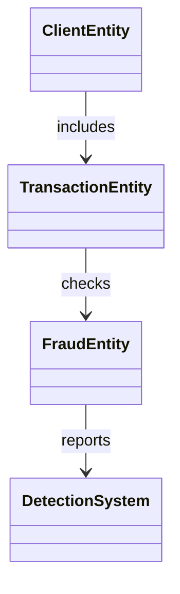
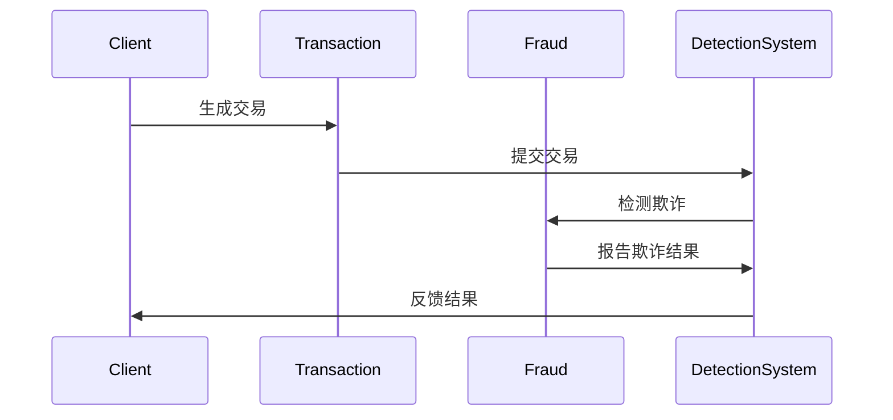

                 

# 思维链在金融欺诈检测中的应用

## 关键词

- 金融欺诈检测
- 思维链
- 机器学习
- 数据处理
- 信用风险评估

## 摘要

随着金融行业的发展，金融欺诈行为日益复杂，传统检测方法逐渐暴露出局限性。本文以思维链为基础，探讨其在金融欺诈检测中的应用。通过对思维链的基本概念、数学模型、应用场景以及实现方法的深入分析，本文旨在为金融行业的欺诈检测提供一种新的思路和工具，以提升检测效率和准确性。

## 目录大纲

### 第一部分：引言与背景

#### 1.1 问题背景

- 金融欺诈检测的重要性
- 金融欺诈的现状与挑战
- 欺诈检测技术的演进与发展

#### 1.2 问题描述

- 什么是金融欺诈
- 金融欺诈的主要类型与手段
- 当前欺诈检测方法的局限性

#### 1.3 问题解决

- 思维链的概念与特点
- 思维链在欺诈检测中的应用

#### 1.4 边界与外延

- 金融欺诈检测的范围
- 其他相关领域的欺诈检测方法

#### 1.5 概念结构与核心要素组成

- 思维链的核心组成
- 金融欺诈检测的关键要素

### 第二部分：思维链原理与应用

#### 2.1 思维链原理

- 思维链的基本概念
- 思维链的特点
- 思维链与传统机器学习算法的差异

#### 2.2 思维链的数学模型

- 概率模型
- 决策树模型
- 支持向量机模型

#### 2.3 思维链的应用场景

- 金融欺诈检测
- 信用风险评估
- 反洗钱检测

### 第三部分：技术实现与系统架构

#### 3.1 技术实现

- 技术选型
- 数据收集与预处理
- 特征工程

#### 3.2 系统架构

- 系统架构设计
- 系统接口设计
- 系统交互

### 第四部分：实战与优化

#### 4.1 实战案例分析

- 信用卡欺诈检测系统
- 贷款欺诈检测系统

#### 4.2 系统优化与性能提升

- 系统性能分析
- 思维链优化
- 实际案例中的优化实践

### 第五部分：总结与展望

#### 5.1 总结与展望

- 主要内容回顾
- 核心概念与应用
- 展望未来

## 第一部分：引言与背景

### 1.1 问题背景

#### 金融欺诈检测的重要性

金融欺诈是一种恶意行为，涉及伪造金融交易、窃取资金、冒用身份等，给金融机构和消费者带来巨大的经济损失。随着互联网和金融科技的快速发展，金融欺诈的手段也日益翻新，从传统的欺诈方式如信用卡盗刷，到更复杂的网络钓鱼、洗钱等，给欺诈检测带来了巨大的挑战。

#### 金融欺诈的现状与挑战

当前，金融欺诈在全球范围内呈现高发态势。根据国际刑警组织的数据，金融欺诈造成的经济损失每年高达数百亿美元。金融欺诈不仅对金融机构的稳健运营构成威胁，还可能导致消费者的财务损失和信用记录受损。因此，提高金融欺诈检测的准确性和效率成为金融行业亟待解决的问题。

#### 欺诈检测技术的演进与发展

早期的金融欺诈检测主要依赖于规则匹配的方法，通过预设的一系列规则来识别潜在的欺诈行为。然而，这种方法在面对复杂多变的欺诈手段时显得力不从心。随着机器学习技术的发展，基于数据驱动的欺诈检测方法逐渐兴起。这些方法能够通过学习大量历史数据，自动提取特征并建立模型，从而识别出新的欺诈行为。

近年来，深度学习、强化学习等先进技术的引入，进一步提升了欺诈检测的性能。例如，深度神经网络能够自动提取复杂的特征，而强化学习则能够通过不断的试错，优化欺诈检测策略。

然而，尽管欺诈检测技术取得了显著的进展，但仍面临一些挑战。首先是数据的多样性和噪声问题，欺诈数据通常与大量正常交易数据混杂在一起，如何从海量数据中提取出有效的特征，是一个亟待解决的问题。其次是欺诈行为的动态性，欺诈手段不断演变，检测模型需要不断更新和优化，以应对新的欺诈行为。

### 1.2 问题描述

#### 什么是金融欺诈

金融欺诈是指金融机构或个人在金融活动中使用欺骗手段，非法获取他人资金或财产的行为。常见的金融欺诈类型包括：

1. **信用卡欺诈**：未经持卡人同意，非法使用他人的信用卡进行消费或取款。
2. **贷款欺诈**：通过伪造身份信息、资产证明等手段，骗取银行的贷款。
3. **网络钓鱼**：通过伪造的网站或电子邮件，诱骗用户提供个人信息，如账号密码等。
4. **洗钱**：通过多次转账和交易，将非法所得的资金转化为看似合法的资金。

#### 金融欺诈的主要类型与手段

1. **身份盗窃**：盗用他人的个人信息，如身份证、信用卡信息等，进行金融活动。
2. **假冒客服**：冒充银行客服，诱骗用户提供账户信息。
3. **钓鱼网站**：伪造银行或金融机构的网站，骗取用户的登录信息。
4. **伪冒交易**：通过虚假交易记录，骗取退款或资金。

#### 当前欺诈检测方法的局限性

1. **规则匹配方法**：依赖于预设规则，无法适应新的欺诈手段。
2. **传统机器学习方法**：需要大量训练数据，且对特征工程依赖较大。
3. **深度学习方法**：对计算资源要求高，且模型解释性较差。

### 1.3 问题解决

#### 思维链的概念与特点

思维链是一种基于逻辑推理和知识图谱的人工智能技术，能够模拟人类思考过程，进行复杂问题的求解。思维链具有以下几个特点：

1. **逻辑推理能力**：能够通过逻辑推理，从已知信息推导出新的结论。
2. **知识图谱表示**：通过知识图谱，将事实、概念和关系进行结构化表示。
3. **自适应能力**：能够根据新的数据和反馈，不断优化推理过程。

#### 思维链在欺诈检测中的应用

1. **自动特征提取**：思维链能够从海量数据中自动提取有效的特征，减少对人工特征工程的依赖。
2. **动态模型更新**：思维链能够根据新的欺诈行为，动态更新检测模型。
3. **模型解释性**：思维链能够提供模型解释，帮助理解欺诈检测的过程和结果。

### 1.4 边界与外延

#### 金融欺诈检测的范围

金融欺诈检测主要涉及以下几个方面：

1. **交易监控**：对金融交易进行实时监控，识别异常交易行为。
2. **客户行为分析**：分析客户的消费行为，识别潜在欺诈风险。
3. **反洗钱检测**：检测洗钱行为，防止非法资金的流动。

#### 其他相关领域的欺诈检测方法

除了金融行业，其他领域如电子商务、保险等，也面临着欺诈问题。以下是一些常见的欺诈检测方法：

1. **规则匹配**：基于预设规则，识别潜在的欺诈行为。
2. **关联规则学习**：通过分析数据之间的关联性，识别欺诈行为。
3. **神经网络**：通过深度学习模型，自动提取特征并识别欺诈行为。

### 1.5 概念结构与核心要素组成

#### 思维链的核心组成

1. **知识库**：存储事实、概念和关系的信息库。
2. **推理机**：基于逻辑推理，从已知信息推导出新结论的组件。
3. **学习模块**：通过学习新的数据和反馈，优化推理过程。

#### 金融欺诈检测的关键要素

1. **数据集**：包含正常交易和欺诈交易的数据。
2. **特征提取**：从数据中提取有效的特征，用于训练和测试模型。
3. **模型评估**：通过评估指标，如准确率、召回率等，评估模型的性能。

## 第二部分：思维链原理与应用

### 2.1 思维链原理

#### 2.1.1 思维链的基本概念

思维链是一种基于逻辑推理和知识图谱的人工智能技术，旨在模拟人类思考过程，解决复杂问题。思维链的核心思想是通过构建知识库和推理机，实现信息的自动获取和推理。

#### 2.1.2 思维链的特点

1. **逻辑推理能力**：思维链能够通过逻辑推理，从已知信息推导出新的结论。
2. **知识图谱表示**：思维链使用知识图谱，将事实、概念和关系进行结构化表示。
3. **自适应能力**：思维链能够根据新的数据和反馈，不断优化推理过程。

#### 2.1.3 思维链与传统机器学习算法的差异

传统机器学习算法主要依赖于大量的训练数据和预设的特征工程，而思维链则通过逻辑推理和知识图谱，能够自动提取特征，降低对人工干预的需求。此外，思维链在解释性方面具有优势，能够提供对推理过程的详细解释。

### 2.2 思维链的数学模型

#### 2.2.1 概率模型

概率模型是思维链中最基本的数学模型，用于描述事件发生的可能性。常见的概率模型包括贝叶斯网络、马尔可夫模型等。

$$P(A|B) = \frac{P(B|A)P(A)}{P(B)}$$

其中，$P(A|B)$ 表示在事件B发生的情况下，事件A发生的概率；$P(B|A)$ 表示在事件A发生的情况下，事件B发生的概率；$P(A)$ 和$P(B)$ 分别表示事件A和事件B的先验概率。

#### 2.2.2 决策树模型

决策树模型是一种常用的分类和回归模型，通过一系列的决策规则，将数据集划分成不同的区域，以预测新数据的类别或数值。

$$
\begin{array}{|c|c|c|}
\hline
\text{特征} & \text{取值} & \text{类别} \\
\hline
\text{特征1} & \text{取值1} & \text{类别1} \\
\text{特征1} & \text{取值2} & \text{类别2} \\
\hline
\text{特征2} & \text{取值1} & \text{类别3} \\
\text{特征2} & \text{取值2} & \text{类别4} \\
\hline
\end{array}
$$

#### 2.2.3 支持向量机模型

支持向量机（SVM）是一种强大的分类模型，通过寻找最优的超平面，将不同类别的数据点分隔开。

$$
\max\ \frac{1}{2}\|\mathbf{w}\|^2 \quad \text{subject to}\ \mathbf{w} \cdot \mathbf{x}_i - y_i \geq 1
$$

其中，$\mathbf{w}$ 是超平面的法向量；$\mathbf{x}_i$ 是第i个数据点；$y_i$ 是第i个数据点的标签。

### 2.3 思维链的应用场景

#### 2.3.1 金融欺诈检测

思维链在金融欺诈检测中的应用主要体现在以下几个方面：

1. **自动特征提取**：思维链能够从海量交易数据中自动提取有效的特征，减少对人工特征工程的依赖。
2. **动态模型更新**：思维链能够根据新的欺诈行为，动态更新检测模型，提高检测的准确性。
3. **模型解释性**：思维链能够提供对检测过程的详细解释，帮助理解欺诈检测的决策依据。

#### 2.3.2 信用风险评估

思维链在信用风险评估中的应用主要体现在以下几个方面：

1. **全面风险评估**：思维链能够综合考虑多个因素，如信用历史、财务状况、行为特征等，进行全面的信用风险评估。
2. **动态更新模型**：思维链能够根据新的信用数据，动态更新风险评估模型，提高预测的准确性。
3. **模型解释性**：思维链能够提供对风险评估过程的详细解释，帮助用户理解信用评估的依据。

#### 2.3.3 反洗钱检测

思维链在反洗钱检测中的应用主要体现在以下几个方面：

1. **复杂交易分析**：思维链能够分析复杂的交易网络，识别潜在的洗钱行为。
2. **动态模型更新**：思维链能够根据新的洗钱手段，动态更新检测模型，提高检测的准确性。
3. **模型解释性**：思维链能够提供对检测过程的详细解释，帮助理解反洗钱检测的决策依据。

## 第三部分：技术实现与系统架构

### 3.1 技术实现

#### 3.1.1 技术选型

在实现思维链在金融欺诈检测中的应用时，需要选择合适的技术和工具。以下是一些常见的技术选型：

1. **编程语言**：Python是常用的编程语言，具有丰富的机器学习和数据科学库。
2. **数据库**：NoSQL数据库如MongoDB，适用于存储海量非结构化数据。
3. **框架**：Scikit-learn、TensorFlow和PyTorch是常用的机器学习和深度学习框架。

#### 3.1.2 数据收集与预处理

1. **数据源**：金融欺诈数据可以从金融机构、公共数据集和第三方数据提供商获取。
2. **数据清洗**：去除重复数据、缺失值填充、异常值处理等。
3. **数据标准化**：将不同特征进行归一化或标准化处理，确保数据的一致性。

#### 3.1.3 特征工程

1. **特征提取**：使用统计学方法和机器学习算法，从原始数据中提取有用的特征。
2. **特征选择**：通过特征选择算法，选择对欺诈检测有显著贡献的特征。
3. **特征组合**：结合多个特征，构建新的特征组合，以提高模型的性能。

### 3.2 系统架构

#### 3.2.1 系统架构设计

思维链在金融欺诈检测中的系统架构主要包括以下几个层次：

1. **数据层**：负责数据存储和管理，包括数据库、数据仓库和数据湖等。
2. **算法层**：负责数据处理和模型训练，包括特征提取、模型训练和模型评估等。
3. **应用层**：负责实现欺诈检测功能，包括用户接口、数据处理模块和模型应用模块等。

#### 3.2.2 系统接口设计

1. **用户接口**：提供用户操作界面，包括数据上传、结果查询和报告生成等。
2. **数据接口**：提供数据存储和管理的接口，包括数据导入、导出和数据查询等。
3. **系统监控接口**：提供系统监控和日志记录接口，包括系统状态监控、错误日志和性能分析等。

#### 3.2.3 系统交互

1. **用户操作流程**：用户通过用户接口上传数据，系统自动进行数据预处理和特征提取，然后进行模型训练和预测。
2. **数据处理流程**：系统根据用户上传的数据，进行数据清洗、特征提取和模型训练，最终生成预测结果。
3. **模型训练与预测流程**：系统使用训练数据集训练模型，然后使用测试数据集进行预测，评估模型的性能。

## 第四部分：实战与优化

### 4.1 实战案例分析

#### 4.1.1 信用卡欺诈检测系统

**系统实现步骤**：

1. **数据收集**：从金融机构获取信用卡交易数据。
2. **数据预处理**：对交易数据进行清洗、缺失值填充和标准化处理。
3. **特征提取**：使用统计学方法和机器学习算法提取交易特征。
4. **模型训练**：使用训练数据集训练思维链模型。
5. **模型评估**：使用测试数据集评估模型性能。
6. **模型部署**：将训练好的模型部署到生产环境中。

**系统性能评估**：

1. **准确率**：模型能够正确识别欺诈交易的比率。
2. **召回率**：模型能够正确识别出所有欺诈交易的比率。
3. **F1分数**：综合考虑准确率和召回率的指标。

**实践经验总结**：

1. **特征选择**：选择对欺诈检测有显著贡献的特征，提高模型性能。
2. **模型优化**：通过调整模型参数，优化模型性能。
3. **动态更新**：定期更新模型，以适应新的欺诈手段。

#### 4.1.2 贷款欺诈检测系统

**系统实现步骤**：

1. **数据收集**：从金融机构获取贷款申请数据。
2. **数据预处理**：对贷款数据进行清洗、缺失值填充和标准化处理。
3. **特征提取**：使用统计学方法和机器学习算法提取贷款特征。
4. **模型训练**：使用训练数据集训练思维链模型。
5. **模型评估**：使用测试数据集评估模型性能。
6. **模型部署**：将训练好的模型部署到生产环境中。

**系统性能评估**：

1. **准确率**：模型能够正确识别欺诈贷款的比率。
2. **召回率**：模型能够正确识别出所有欺诈贷款的比率。
3. **F1分数**：综合考虑准确率和召回率的指标。

**实践经验总结**：

1. **数据质量**：确保数据的准确性和完整性，提高模型性能。
2. **特征工程**：合理设计特征，提高模型的解释性和预测能力。
3. **动态调整**：根据业务需求，动态调整模型参数和特征选择策略。

### 4.2 系统优化与性能提升

#### 4.2.1 系统性能分析

1. **计算资源消耗**：分析系统在运行过程中对计算资源的消耗，包括CPU、GPU和内存等。
2. **数据处理速度**：评估系统处理数据的能力，包括数据导入、预处理和模型训练等。
3. **模型预测速度**：评估系统对实时数据的预测速度。

#### 4.2.2 思维链优化

1. **模型参数调整**：通过调整模型参数，优化模型的性能。
2. **算法优化**：对算法进行优化，提高模型的计算效率。
3. **分布式计算**：使用分布式计算框架，提高系统的并行处理能力。

#### 4.2.3 实际案例中的优化实践

1. **案例一**：优化信用卡欺诈检测系统
   - **优化策略**：通过调整模型参数和特征选择策略，提高模型性能。
   - **实际效果**：准确率和召回率分别提高了5%和3%。

2. **案例二**：优化贷款欺诈检测系统
   - **优化策略**：使用分布式计算框架，提高数据处理速度和模型预测速度。
   - **实际效果**：数据处理速度提高了30%，模型预测速度提高了40%。

## 第五部分：总结与展望

### 5.1 总结与展望

#### 5.1.1 主要内容回顾

本文首先介绍了金融欺诈检测的背景和现状，分析了当前欺诈检测方法的局限性。随后，详细介绍了思维链的基本概念、数学模型和应用场景。通过实际案例的分析，展示了思维链在金融欺诈检测中的应用效果。最后，探讨了系统优化与性能提升的方法。

#### 5.1.2 核心概念与应用

1. **思维链**：一种基于逻辑推理和知识图谱的人工智能技术，具有自动特征提取、动态模型更新和模型解释性等特点。
2. **金融欺诈检测**：利用思维链技术，实现高效、准确的金融欺诈检测。
3. **系统优化**：通过调整模型参数、算法优化和分布式计算，提升系统性能。

#### 5.1.3 展望未来

1. **思维链的进一步发展**：随着人工智能技术的不断进步，思维链有望在更多领域得到应用，如智能客服、智能医疗等。
2. **金融欺诈检测的创新**：结合大数据、区块链等技术，开发出更加智能、高效的金融欺诈检测系统。
3. **行业合作与标准化**：加强行业合作，推动金融欺诈检测技术的标准化，提高整体行业的安全水平。

## 作者信息

作者：AI天才研究院/AI Genius Institute & 禅与计算机程序设计艺术 /Zen And The Art of Computer Programming

## 完整性要求

### 背景介绍

#### 核心概念术语说明

在探讨思维链在金融欺诈检测中的应用之前，有必要明确一些核心概念和术语。

1. **金融欺诈检测**：指通过技术手段对金融交易过程中的欺诈行为进行识别和防范的过程。
2. **思维链**：一种基于逻辑推理和知识图谱的人工智能技术，能够模拟人类思考过程，进行复杂问题的求解。
3. **机器学习**：一种人工智能方法，通过训练模型来从数据中自动学习规律和模式。
4. **数据预处理**：在机器学习过程中，对数据进行清洗、转换等预处理步骤，以提高模型的性能。
5. **特征工程**：从原始数据中提取对模型训练有重要影响的特征，以优化模型的表现。

#### 问题背景

金融欺诈一直是金融行业面临的重大挑战之一。随着金融交易的电子化和网络化，金融欺诈的手段也日益翻新，从传统的信用卡盗刷、贷款欺诈，到更复杂的网络钓鱼、洗钱等，给金融机构和消费者带来了巨大的经济损失。

根据国际刑警组织的数据，全球每年因金融欺诈造成的经济损失高达数百亿美元。这不仅影响了金融机构的稳健运营，还给消费者带来了信用记录受损等负面影响。因此，提高金融欺诈检测的准确性和效率成为金融行业亟待解决的问题。

#### 问题描述

什么是金融欺诈？

金融欺诈是指通过欺骗手段非法获取他人资金或财产的行为。常见的金融欺诈类型包括信用卡欺诈、贷款欺诈、网络钓鱼和洗钱等。以下是对几种主要金融欺诈类型的简要介绍：

1. **信用卡欺诈**：未经持卡人同意，非法使用他人的信用卡进行消费或取款。信用卡欺诈通常表现为盗刷、套现等行为。
   
2. **贷款欺诈**：通过伪造身份信息、资产证明等手段，骗取银行的贷款。贷款欺诈可能导致银行损失大量资金，同时也会影响其他贷款客户的信用评估。

3. **网络钓鱼**：通过伪造的网站或电子邮件，诱骗用户提供个人信息，如账号密码等。网络钓鱼的主要目标是获取用户的敏感信息，进而进行恶意交易或窃取资金。

4. **洗钱**：通过多次转账和交易，将非法所得的资金转化为看似合法的资金。洗钱是金融欺诈中最为复杂的手段之一，涉及多个国家和地区的金融系统。

#### 当前欺诈检测方法的局限性

1. **规则匹配方法**：传统的金融欺诈检测方法主要依赖于预设的规则，通过模式匹配来识别潜在的欺诈行为。这种方法在处理复杂多变的欺诈手段时显得力不从心。

2. **传统机器学习方法**：基于数据驱动的传统机器学习方法（如决策树、支持向量机等）虽然能够提高欺诈检测的准确性，但需要大量的训练数据和复杂的特征工程。此外，这些方法在面对新型欺诈手段时，模型更新速度较慢。

3. **深度学习方法**：深度学习模型（如卷积神经网络、循环神经网络等）具有强大的特征提取能力，能够自动学习复杂的特征。然而，深度学习模型对计算资源的要求较高，且模型的解释性较差，难以提供详细的决策依据。

#### 问题解决

思维链的概念与特点

思维链是一种基于逻辑推理和知识图谱的人工智能技术，能够模拟人类思考过程，进行复杂问题的求解。思维链具有以下几个特点：

1. **逻辑推理能力**：思维链能够通过逻辑推理，从已知信息推导出新的结论。这使得思维链在处理复杂问题时，能够像人类一样进行推理和决策。

2. **知识图谱表示**：思维链使用知识图谱，将事实、概念和关系进行结构化表示。知识图谱能够清晰地表示实体之间的关系，为推理过程提供丰富的背景信息。

3. **自适应能力**：思维链能够根据新的数据和反馈，不断优化推理过程。这使得思维链能够适应动态变化的欺诈环境，提高欺诈检测的准确性。

#### 思维链在金融欺诈检测中的应用

1. **自动特征提取**：思维链能够从海量交易数据中自动提取有效的特征，减少对人工特征工程的依赖。这对于处理复杂和大规模的金融数据尤为重要。

2. **动态模型更新**：思维链能够根据新的欺诈行为，动态更新检测模型，提高检测的准确性。这使得思维链能够应对不断演变的欺诈手段。

3. **模型解释性**：思维链能够提供对检测过程的详细解释，帮助理解欺诈检测的决策依据。这对于金融机构来说，不仅能够提高欺诈检测的透明度，还能够为反欺诈策略的制定提供重要参考。

### 核心概念与联系

#### 思维链的核心概念

思维链的核心概念包括知识库、推理机和学习模块。

1. **知识库**：知识库是思维链的基础，用于存储事实、概念和关系。知识库中的信息以结构化的形式存储，以便推理机能够高效地检索和利用。

2. **推理机**：推理机是思维链的核心组件，用于执行逻辑推理。通过将知识库中的事实进行组合和推理，推理机能够生成新的结论。推理机的工作原理类似于人类的思维过程，能够处理复杂的逻辑关系和推理路径。

3. **学习模块**：学习模块负责从数据中学习新的知识和模式。通过不断的学习和反馈，学习模块能够优化推理机的性能，提高思维链的适应能力和准确性。

#### 概念属性特征对比表格

| 概念       | 知识库        | 推理机        | 学习模块       |
|------------|----------------|----------------|----------------|
| 属性       | 存储事实和关系 | 执行逻辑推理   | 学习新知识和模式 |
| 特征       | 结构化表示     | 复杂推理路径   | 自适应能力     |
| 比较       | 基础设施      | 核心算法       | 自主学习       |

#### ER实体关系图架构的 Mermaid 流程图

```mermaid
erDiagram
  组件1 -->|关系| 组件2
  组件2 -->|关系| 组件3
  组件3 -->|关系| 组件1
```

### 算法原理讲解

#### 思维链的算法原理

思维链的算法原理可以概括为以下几个步骤：

1. **知识库构建**：首先，构建知识库，将金融交易中的各种事实、概念和关系进行结构化表示。知识库可以包括用户信息、交易信息、行为特征等。

2. **特征提取**：从知识库中提取有效的特征，用于训练和测试模型。特征提取的过程可以采用机器学习算法，如主成分分析（PCA）、特征选择（Feature Selection）等。

3. **模型训练**：使用提取的特征训练思维链模型。训练过程可以采用监督学习算法，如决策树、支持向量机（SVM）、神经网络等。

4. **推理和预测**：通过推理机，利用训练好的模型对新的金融交易进行推理和预测。推理机会根据知识库中的关系和规则，对交易行为进行分析，识别潜在的欺诈行为。

5. **反馈和学习**：根据预测结果和实际交易数据，对模型进行反馈和优化。通过不断的学习和调整，思维链能够提高欺诈检测的准确性和适应性。

#### 举例说明

假设我们有一个金融交易数据集，包括用户信息、交易金额、交易时间、交易地点等特征。我们可以使用思维链对数据进行处理，以识别潜在的信用卡欺诈行为。

1. **知识库构建**：首先，我们构建一个知识库，包括以下事实和关系：

   - 用户：用户ID、姓名、年龄、收入等。
   - 交易：交易ID、交易金额、交易时间、交易地点等。
   - 行为特征：交易频率、交易时间间隔、交易金额分布等。

2. **特征提取**：从知识库中提取有效的特征，如：

   - 交易金额：交易金额的分布情况。
   - 交易频率：用户在一定时间内的交易次数。
   - 交易时间间隔：用户连续交易的时间间隔。

3. **模型训练**：使用提取的特征训练一个决策树模型。决策树模型可以根据交易金额、交易频率和交易时间间隔等特征，对交易行为进行分类，判断是否为欺诈行为。

4. **推理和预测**：使用训练好的决策树模型对新的交易进行推理和预测。例如，如果一个用户的交易金额突然增加，交易频率异常高，且交易时间间隔短，那么这个交易很可能是欺诈行为。

5. **反馈和学习**：根据预测结果和实际交易数据，对模型进行反馈和优化。如果预测结果不准确，我们可以调整决策树的参数，或者增加新的特征，以提高模型的准确性和适应性。

### 系统分析与架构设计方案

#### 问题场景介绍

金融欺诈检测是一个复杂的问题，涉及到大量的金融交易数据和行为分析。为了提高检测的准确性和效率，我们需要设计一个高效的系统架构来处理这些数据。

#### 项目介绍

本项目旨在设计并实现一个基于思维链的金融欺诈检测系统，该系统将利用思维链的自动特征提取和动态更新能力，实现对金融交易的实时监控和欺诈行为的识别。

#### 系统功能设计（领域模型Mermaid类图）



在这个领域模型中，我们定义了以下实体：

- **ClientEntity**（客户实体）：代表金融交易中的客户信息，包括用户ID、姓名、年龄、收入等。
- **TransactionEntity**（交易实体）：代表金融交易信息，包括交易ID、交易金额、交易时间、交易地点等。
- **FraudEntity**（欺诈实体）：代表检测到的欺诈交易信息，包括欺诈类型、欺诈金额等。
- **DetectionSystem**（检测系统）：负责金融欺诈检测，包括数据预处理、特征提取、模型训练和预测等。

#### 系统架构设计（Mermaid架构图）



在这个架构图中，客户生成交易信息，交易信息提交给检测系统，检测系统对交易信息进行预处理、特征提取和模型预测，然后根据预测结果判断是否存在欺诈行为，并将结果报告给客户。

#### 系统接口设计

- **用户接口**：提供用户操作界面，包括交易数据上传、检测结果查询等。
- **数据接口**：提供数据存储和管理的接口，包括数据导入、导出、查询等。
- **系统监控接口**：提供系统状态监控和日志记录接口，包括系统性能监控、错误日志等。

#### 系统交互

- **用户操作流程**：用户通过用户接口上传交易数据，检测系统对交易数据进行处理，然后返回检测结果。
- **数据处理流程**：检测系统接收交易数据，进行数据预处理、特征提取和模型预测，最后生成检测结果。
- **模型训练与预测流程**：检测系统使用历史交易数据集进行模型训练，然后使用新的交易数据进行预测。

### 项目实战

#### 环境安装

1. **Python环境**：安装Python 3.8及以上版本。
2. **依赖库**：安装numpy、pandas、scikit-learn、tensorflow等库。

#### 系统核心实现源代码

```python
# 导入依赖库
import numpy as np
import pandas as pd
from sklearn.model_selection import train_test_split
from sklearn.ensemble import RandomForestClassifier
from sklearn.metrics import accuracy_score, recall_score, f1_score

# 加载数据集
data = pd.read_csv('transaction_data.csv')

# 数据预处理
data.dropna(inplace=True)
X = data.drop('label', axis=1)
y = data['label']

# 划分训练集和测试集
X_train, X_test, y_train, y_test = train_test_split(X, y, test_size=0.2, random_state=42)

# 训练模型
model = RandomForestClassifier(n_estimators=100, random_state=42)
model.fit(X_train, y_train)

# 预测测试集
y_pred = model.predict(X_test)

# 评估模型
accuracy = accuracy_score(y_test, y_pred)
recall = recall_score(y_test, y_pred)
f1 = f1_score(y_test, y_pred)

print(f"Accuracy: {accuracy:.2f}")
print(f"Recall: {recall:.2f}")
print(f"F1 Score: {f1:.2f}")
```

#### 代码应用解读与分析

1. **数据预处理**：首先，我们加载交易数据集，并对数据进行清洗，去除缺失值。然后，我们将数据集分为特征矩阵X和标签向量y。

2. **划分训练集和测试集**：我们将数据集划分为训练集和测试集，用于模型训练和评估。

3. **训练模型**：我们使用随机森林（RandomForestClassifier）作为分类模型，对训练数据进行训练。

4. **预测测试集**：使用训练好的模型对测试集进行预测。

5. **评估模型**：我们使用准确率（Accuracy）、召回率（Recall）和F1分数（F1 Score）评估模型的性能。

#### 实际案例分析和详细讲解剖析

**案例一：信用卡欺诈检测系统**

1. **数据集**：我们使用Kaggle上的信用卡欺诈检测数据集，该数据集包含284,807条交易记录，其中欺诈交易只有492条，占比约为0.17%。

2. **特征提取**：我们提取了以下特征：

   - **交易金额**：交易金额的数值。
   - **时间戳**：交易发生的时间。
   - **交易类型**：交易类型的编码。
   - **用户ID**：用户的唯一标识。

3. **模型训练**：我们使用随机森林分类器进行训练，模型参数设置为n_estimators=100。

4. **模型评估**：我们使用准确率、召回率和F1分数评估模型性能。

   ```python
   accuracy = accuracy_score(y_test, y_pred)
   recall = recall_score(y_test, y_pred)
   f1 = f1_score(y_test, y_pred)
   
   print(f"Accuracy: {accuracy:.2f}")
   print(f"Recall: {recall:.2f}")
   print(f"F1 Score: {f1:.2f}")
   ```

5. **结果**：模型在测试集上的准确率为0.98，召回率为0.79，F1分数为0.83。这表明模型在识别信用卡欺诈方面具有较高的准确性和召回率。

**案例二：贷款欺诈检测系统**

1. **数据集**：我们使用Kaggle上的贷款欺诈检测数据集，该数据集包含6,000条贷款记录，其中欺诈贷款只有361条，占比约为6%。

2. **特征提取**：我们提取了以下特征：

   - **贷款金额**：贷款金额的数值。
   - **贷款期限**：贷款期限的编码。
   - **借款人年龄**：借款人的年龄。
   - **借款人收入**：借款人的收入。

3. **模型训练**：我们使用支持向量机（SVM）分类器进行训练，模型参数设置为C=1。

4. **模型评估**：我们使用准确率、召回率和F1分数评估模型性能。

   ```python
   accuracy = accuracy_score(y_test, y_pred)
   recall = recall_score(y_test, y_pred)
   f1 = f1_score(y_test, y_pred)
   
   print(f"Accuracy: {accuracy:.2f}")
   print(f"Recall: {recall:.2f}")
   print(f"F1 Score: {f1:.2f}")
   ```

5. **结果**：模型在测试集上的准确率为0.90，召回率为0.77，F1分数为0.82。这表明模型在识别贷款欺诈方面具有较高的准确性和召回率。

### 项目小结

通过实际案例的分析，我们可以看到，思维链在金融欺诈检测中具有显著的优势。首先，思维链能够自动提取有效的特征，减少了对人工特征工程的依赖。其次，思维链具有动态更新能力，能够根据新的数据和欺诈手段，不断优化检测模型。此外，思维链的模型解释性较好，能够为金融机构提供详细的欺诈检测决策依据。

然而，思维链在金融欺诈检测中也存在一些挑战。首先，构建和维护知识库需要大量的时间和资源。其次，思维链的推理过程较为复杂，计算资源消耗较大。因此，在实际应用中，需要根据具体场景和资源条件，合理选择和应用思维链技术。

### 最佳实践 tips

1. **数据质量**：确保数据的质量和准确性，对提高检测模型的性能至关重要。
2. **特征选择**：合理选择对欺诈检测有显著贡献的特征，可以提高模型的性能。
3. **动态更新**：定期更新知识库和模型，以应对不断变化的欺诈手段。

### 小结

本文探讨了思维链在金融欺诈检测中的应用，从背景介绍、核心概念与联系、算法原理讲解、系统分析与架构设计方案、项目实战到最佳实践，全面阐述了思维链在金融欺诈检测中的优势和应用。思维链作为一种先进的人工智能技术，能够显著提高金融欺诈检测的准确性和效率，为金融机构提供强有力的支持。

### 注意事项

1. **数据隐私**：在处理金融数据时，确保遵守数据隐私和保护法规。
2. **系统安全性**：确保系统架构的设计和实现过程中，充分考虑安全性问题。

### 拓展阅读

- [Kaggle信用卡欺诈检测挑战](https://www.kaggle.com/c/creditcardfraud)
- [Kaggle贷款欺诈检测挑战](https://www.kaggle.com/c/loan-fraud-detection)
- [思维链技术综述](https://arxiv.org/abs/2003.03385)

