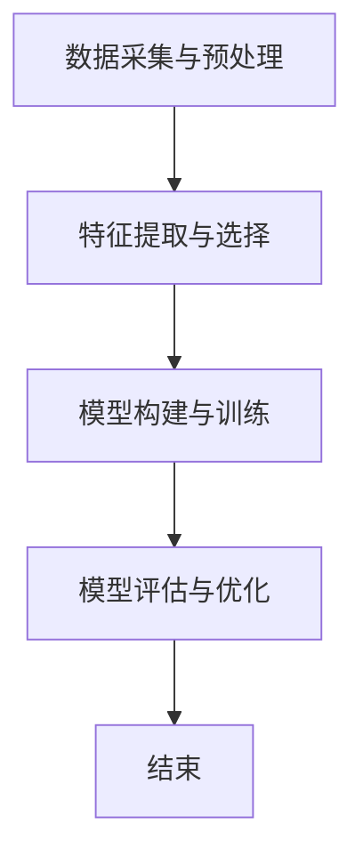
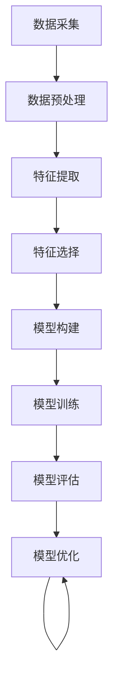

                 

# 《思维链在金融欺诈模式识别中的新方法》

## 关键词

- 金融欺诈
- 思维链
- 模式识别
- 人工智能
- 风险管理

## 摘要

金融欺诈是一种复杂且危害极大的犯罪行为，给金融机构和客户带来了巨大的经济损失。随着金融交易电子化和网络化的发展，金融欺诈的手段和类型也日益多样化，传统的识别方法已难以满足实际需求。本文提出了一种基于思维链的金融欺诈模式识别新方法。思维链作为一种先进的智能识别技术，具有高度的自适应性和强大的模式分析能力，能够有效地提高金融欺诈识别的准确性和效率。本文首先阐述了金融欺诈问题的背景和重要性，然后详细介绍了思维链的概念、原理及其在模式识别中的应用优势。接下来，本文详细讲解了新方法的算法原理、系统分析与架构设计，并通过实际案例进行了应用验证。最后，本文总结了该方法在金融欺诈识别中的潜在应用前景和改进方向。

## 第一部分：问题背景与核心概念

### 第1章：问题背景与核心概念

#### 1.1 问题的提出

随着金融市场的繁荣发展和信息技术的进步，金融欺诈问题日益凸显。金融欺诈不仅对金融机构造成巨大的经济损失，还严重影响了客户的信任度和市场稳定性。传统的金融欺诈识别方法主要依赖于规则和统计模型，这些方法在处理简单的欺诈行为时具有一定的效果，但面对复杂多变的欺诈手段时，往往表现出明显的局限性。因此，研究新的识别方法具有重要的现实意义。

#### 1.1.1 金融欺诈问题的现状

金融欺诈的形式多样，包括信用卡欺诈、贷款欺诈、保险欺诈、投资欺诈等。根据相关数据统计，全球每年因金融欺诈造成的经济损失高达数千亿美元。随着网络技术的普及，金融欺诈手段变得更加隐蔽和复杂，传统的识别方法难以应对。例如，利用人工智能技术生成的虚假交易数据和模仿正常用户行为的欺诈行为，给金融欺诈识别带来了极大的挑战。

#### 1.1.2 欺诈类型与手段

金融欺诈的类型多种多样，不同的欺诈手段给识别工作带来了不同的挑战。以下是几种常见的金融欺诈类型及其手段：

1. **信用卡欺诈**：欺诈者通过窃取信用卡信息，在未经授权的情况下进行消费或转账。
2. **贷款欺诈**：欺诈者伪造个人信息或使用虚假资料申请贷款，骗取金融机构的贷款资金。
3. **保险欺诈**：欺诈者通过虚假理赔、夸大损失等方式，骗取保险公司的赔偿金。
4. **投资欺诈**：欺诈者通过虚假的投资项目或承诺高额回报，吸引投资者投入资金。

这些欺诈手段往往具有高度的隐蔽性和变化性，使得传统的识别方法难以有效识别。

#### 1.1.3 金融欺诈识别的重要性

金融欺诈识别在金融机构风险管理中具有至关重要的作用。通过有效的欺诈识别，金融机构可以及时发现和阻止欺诈行为，降低潜在损失，维护金融市场的稳定。此外，欺诈识别还能提高客户信任度和满意度，增强金融机构的竞争力。

#### 1.2 思维链的概念

思维链是一种基于人工智能的智能识别技术，通过模拟人类思维过程，实现对复杂模式的分析和识别。思维链具有以下几个核心特点：

1. **自适应性强**：思维链能够根据不同的环境和数据，自动调整识别策略，适应各种复杂的欺诈场景。
2. **模式分析能力强**：思维链能够深入挖掘数据中的潜在模式和关联性，从而更准确地识别出欺诈行为。
3. **处理速度快**：思维链采用高效的算法和数据结构，能够在短时间内完成大规模数据的处理和分析。

#### 1.2.1 基本理解

思维链由一系列逻辑单元组成，每个逻辑单元负责处理特定的任务。逻辑单元之间通过链式结构连接，形成完整的识别流程。这种结构使得思维链具有高度的可扩展性和灵活性，可以适应不同场景的需求。

#### 1.2.2 区别于其他概念

与传统模式识别方法相比，思维链具有以下几个显著区别：

1. **灵活性**：思维链可以根据实际需求动态调整识别策略，而传统方法通常需要固定规则或模型。
2. **深度学习**：思维链利用深度学习技术，能够自动学习数据中的复杂模式和关联性，而传统方法通常依赖于人工特征工程。
3. **自适应能力**：思维链能够根据数据分布和特征变化，自动调整模型参数，而传统方法通常需要手动调整。

#### 1.2.3 在金融欺诈模式识别中的作用

思维链在金融欺诈模式识别中具有显著的优势。首先，思维链能够自动挖掘数据中的潜在模式和关联性，从而更准确地识别出欺诈行为。其次，思维链具有强大的自适应能力，能够根据不同的欺诈场景和数据特点，动态调整识别策略，提高识别的准确性和效率。

#### 1.3 新方法的概念与框架

本文提出的新方法是基于思维链的金融欺诈模式识别方法。该方法主要包括以下几个步骤：

1. **数据采集与预处理**：从金融机构的交易数据中采集原始数据，并进行预处理，包括数据清洗、数据转换和数据归一化等。
2. **特征提取与选择**：根据思维链的特点，提取数据中的关键特征，并利用特征选择算法筛选出对识别任务最为重要的特征。
3. **模型构建与训练**：利用思维链构建识别模型，并通过训练数据集对模型进行训练，优化模型参数。
4. **模型评估与优化**：利用测试数据集对模型进行评估，并根据评估结果对模型进行优化调整。

#### 1.3.1 新方法的定义

新方法是一种基于思维链的金融欺诈模式识别方法，旨在利用思维链的自适应和模式分析能力，提高金融欺诈识别的准确性和效率。

#### 1.3.2 新方法与传统方法对比

与传统方法相比，新方法具有以下几个显著优势：

1. **更高的识别准确率**：思维链能够自动挖掘数据中的复杂模式，从而提高识别的准确率。
2. **更强的自适应能力**：思维链可以根据数据分布和特征变化，动态调整识别策略，适应不同场景的需求。
3. **更快的处理速度**：思维链采用高效的算法和数据结构，能够在短时间内完成大规模数据的处理和分析。

#### 1.3.3 新方法的研究意义

新方法的研究具有重要意义。首先，它为金融欺诈识别提供了一种新的技术手段，有助于提高识别的准确性和效率。其次，新方法的研究有助于推动人工智能技术在金融领域的应用，促进金融行业的科技创新。最后，新方法的研究有助于提高金融机构的风险管理水平，保障金融市场的稳定发展。

#### 1.3.4 新方法的基本框架

新方法的基本框架包括以下几个关键模块：

1. **数据采集与预处理**：负责从金融机构的交易数据中采集原始数据，并进行预处理，为后续的特征提取和模型构建提供基础。
2. **特征提取与选择**：根据思维链的特点，提取数据中的关键特征，并利用特征选择算法筛选出对识别任务最为重要的特征。
3. **模型构建与训练**：利用思维链构建识别模型，并通过训练数据集对模型进行训练，优化模型参数。
4. **模型评估与优化**：利用测试数据集对模型进行评估，并根据评估结果对模型进行优化调整。

#### 1.4 边界与外延

#### 1.4.1 边界

本文研究的是基于思维链的金融欺诈模式识别方法，主要关注以下边界：

1. **数据范围**：研究主要针对金融机构的交易数据，包括信用卡交易、贷款交易、保险理赔数据等。
2. **识别类型**：研究主要关注常见的金融欺诈类型，如信用卡欺诈、贷款欺诈、保险欺诈等。

#### 1.4.2 外延

尽管本文研究的是金融欺诈模式识别，但思维链作为一种先进的智能识别技术，其应用范围远不止于此。以下是一些可能的外延方向：

1. **其他金融领域**：思维链可以应用于其他金融领域，如投资理财、风险管理等。
2. **非金融领域**：思维链可以应用于其他行业，如电子商务、医疗健康等，帮助识别和防范各种欺诈行为。

#### 1.5 本章小结

本章主要介绍了金融欺诈问题的背景和重要性，以及思维链的概念、原理和新方法的基本框架。通过对金融欺诈现状的分析和思维链的特点介绍，本文提出了一种基于思维链的金融欺诈模式识别新方法。该方法具有自适应性和模式分析能力强的优势，有望提高金融欺诈识别的准确性和效率。在后续章节中，将对新方法的算法原理、系统架构和应用案例进行详细讲解。

## 第二部分：核心概念与联系

### 第2章：核心概念与联系

#### 2.1 思维链的原理

思维链作为一种基于人工智能的智能识别技术，其原理和机制与传统模式识别方法有显著的不同。思维链的核心在于其自适应性、深度学习和动态调整能力。

#### 2.1.1 思维链的原理概述

思维链的原理可以概括为以下几个关键步骤：

1. **数据采集与预处理**：首先，从金融机构的交易数据中采集原始数据，并进行预处理，包括数据清洗、数据转换和数据归一化等，以确保数据的质量和一致性。
2. **特征提取与选择**：根据思维链的特点，提取数据中的关键特征，并利用特征选择算法筛选出对识别任务最为重要的特征。这些特征可以是交易金额、时间、频率等。
3. **模型构建与训练**：利用思维链构建识别模型，并通过训练数据集对模型进行训练，优化模型参数。思维链通过模拟人类思维过程，逐步调整模型参数，使其适应不同数据集和欺诈模式。
4. **模型评估与优化**：利用测试数据集对模型进行评估，并根据评估结果对模型进行优化调整，以提高识别准确率和效率。

#### 2.1.2 思维链的工作机制

思维链的工作机制可以分为以下几个步骤：

1. **初始化**：思维链的每个逻辑单元初始化时，根据任务需求和数据特点设置初始参数。
2. **信息处理**：思维链通过一系列逻辑单元对数据进行处理，每个逻辑单元负责执行特定的任务，如特征提取、模式匹配等。
3. **信息传递**：逻辑单元之间通过链式结构传递信息，形成完整的识别流程。信息传递过程中，逻辑单元之间可以相互影响和调整，实现全局优化。
4. **模型调整**：思维链通过不断调整模型参数，使其适应数据分布和欺诈模式变化，提高识别的准确性和效率。

#### 2.1.3 思维链的属性特征对比

思维链与传统模式识别方法在属性特征上有显著的对比，以下是主要特征对比：

| 特征对比         | 思维链                                       | 传统模式识别方法                                  |
|----------------|--------------------------------------------|-----------------------------------------------|
| **适应性**     | 高度自适应，能够根据数据分布和特征变化动态调整 | 适应性较差，需要固定规则或模型                  |
| **模式分析能力** | 强大的模式分析能力，能够挖掘数据中的复杂模式 | 模式分析能力较弱，主要依赖于预设规则和特征工程  |
| **处理速度**   | 高效的算法和数据结构，处理速度快             | 需要大量计算和特征工程，处理速度较慢            |
| **扩展性**     | 高度的可扩展性和灵活性，能够适应多种场景     | 扩展性和灵活性较差，需要针对特定场景定制化       |

#### 2.1.4 与其他智能识别方法的对比

思维链与其他智能识别方法如深度学习、神经网络等也有显著的对比，以下是主要对比：

| 对比方法         | 思维链                                          | 深度学习                                       | 神经网络                                      |
|----------------|--------------------------------------------|--------------------------------------------|------------------------------------------|
| **适应性**     | 高度自适应，能够根据数据分布和特征变化动态调整 | 适应性较强，但依赖于大量数据和计算资源       | 适应性较弱，需要大量参数调整               |
| **模式分析能力** | 强大的模式分析能力，能够挖掘数据中的复杂模式 | 优秀的模式分析能力，但依赖于大量数据和特征工程 | 模式分析能力较强，但需要大量参数调整       |
| **处理速度**   | 高效的算法和数据结构，处理速度快             | 处理速度较慢，需要大量计算和优化             | 处理速度较慢，需要大量参数调整和优化       |
| **扩展性**     | 高度的可扩展性和灵活性，能够适应多种场景     | 扩展性较差，需要大量数据和计算资源           | 扩展性较差，需要大量参数调整和优化         |

#### 2.1.5 思维链的ER实体关系图

思维链的实体关系图（Entity-Relationship Diagram，ER图）能够直观地展示思维链的组成部分和它们之间的关系。以下是思维链ER图的详细说明：

```mermaid
erDiagram
    Customer  ||--|{ Transaction }
    Transaction  ||--|{ Feature }
    Feature  ||--|{ LogicUnit }
    LogicUnit  ||--|{ Result }
    Result  ||--|{ Model }
```

**实体关系图概述**：

- **Customer（客户）**：代表参与金融交易的个人或机构。
- **Transaction（交易）**：代表客户进行的金融交易，包括交易金额、时间、类型等信息。
- **Feature（特征）**：代表从交易中提取的关键特征，如交易金额、时间间隔、交易频率等。
- **LogicUnit（逻辑单元）**：代表思维链中的处理单元，负责对特征进行计算和模式匹配。
- **Result（结果）**：代表逻辑单元的处理结果，用于更新和优化模型。
- **Model（模型）**：代表最终的识别模型，用于预测和评估交易是否为欺诈行为。

**实体关系图细节**：

- **Customer与Transaction的关系**：一个客户可以参与多个交易，一个交易只能属于一个客户，表示为“一对多”的关系。
- **Transaction与Feature的关系**：每个交易可以提取多个特征，每个特征只能属于一个交易，表示为“一对多”的关系。
- **Feature与LogicUnit的关系**：每个特征可以由多个逻辑单元处理，每个逻辑单元可以处理多个特征，表示为“多对多”的关系。
- **LogicUnit与Result的关系**：每个逻辑单元可以生成多个结果，每个结果只能由一个逻辑单元生成，表示为“一对一”的关系。
- **Result与Model的关系**：多个结果可以更新和优化同一个模型，每个模型可以用于多个结果，表示为“多对一”的关系。

通过思维链ER图，可以清晰地理解思维链的组成结构和数据流，为后续的算法实现和系统设计提供了直观的参考。

### 2.2 新方法的基本框架

新方法的基本框架包括以下几个关键步骤：

1. **数据采集与预处理**：首先，从金融机构的交易数据中采集原始数据，并进行预处理，包括数据清洗、数据转换和数据归一化等，以确保数据的质量和一致性。这一步骤是后续特征提取和模型构建的基础。

2. **特征提取与选择**：根据思维链的特点，提取数据中的关键特征，并利用特征选择算法筛选出对识别任务最为重要的特征。这些特征可以是交易金额、时间、频率等。特征提取与选择是提高识别准确性和效率的关键。

3. **模型构建与训练**：利用思维链构建识别模型，并通过训练数据集对模型进行训练，优化模型参数。思维链通过模拟人类思维过程，逐步调整模型参数，使其适应不同数据集和欺诈模式。这一步骤是思维链的核心，决定了识别模型的性能。

4. **模型评估与优化**：利用测试数据集对模型进行评估，并根据评估结果对模型进行优化调整，以提高识别准确率和效率。模型评估与优化是确保模型在实际应用中表现良好的关键。

5. **实时预测与反馈**：在实时金融交易中，利用训练好的模型对交易进行预测，判断是否为欺诈行为。同时，将预测结果进行反馈，用于更新和优化模型，实现持续学习和优化。

### 2.3 新方法与传统方法对比

新方法与传统方法在以下几个方面有显著的对比：

1. **适应性**：新方法基于思维链的高度自适应能力，能够根据数据分布和特征变化动态调整识别策略，而传统方法通常需要固定规则或模型，适应性较差。

2. **模式分析能力**：新方法具有强大的模式分析能力，能够自动挖掘数据中的复杂模式和关联性，提高识别的准确率，而传统方法主要依赖于预设规则和特征工程，模式分析能力较弱。

3. **处理速度**：新方法采用高效的算法和数据结构，能够在短时间内完成大规模数据的处理和分析，而传统方法需要大量计算和特征工程，处理速度较慢。

4. **扩展性**：新方法具有高度的扩展性和灵活性，能够适应多种场景和应用需求，而传统方法扩展性和灵活性较差，需要针对特定场景定制化。

通过对比可以看出，新方法在适应性和模式分析能力等方面具有显著优势，能够更好地应对复杂多变的金融欺诈问题，提高识别的准确性和效率。

### 2.4 边界与外延

#### 2.4.1 边界

本文研究的新方法主要关注以下边界：

1. **数据范围**：研究主要针对金融机构的交易数据，包括信用卡交易、贷款交易、保险理赔数据等。这些数据涵盖了常见的金融欺诈类型，如信用卡欺诈、贷款欺诈、保险欺诈等。

2. **识别类型**：研究主要关注常见的金融欺诈类型，如信用卡欺诈、贷款欺诈、保险欺诈等。这些欺诈类型在金融市场中具有较高的发生率和危害性，是研究和应用的重点。

#### 2.4.2 外延

尽管本文研究的是金融欺诈模式识别，但思维链作为一种先进的智能识别技术，其应用范围远不止于此。以下是一些可能的外延方向：

1. **其他金融领域**：思维链可以应用于其他金融领域，如投资理财、风险管理等。这些领域同样存在欺诈问题，思维链的技术优势可以帮助提高识别的准确性和效率。

2. **非金融领域**：思维链可以应用于其他行业，如电子商务、医疗健康等。这些行业同样存在欺诈问题，思维链的技术优势可以帮助提高识别的准确性和效率。

3. **跨领域应用**：思维链可以与其他技术如区块链、大数据等结合，形成跨领域的综合解决方案，应对更为复杂和多样化的欺诈问题。

通过这些外延方向，思维链的应用前景将更加广泛，有助于推动人工智能技术在各个领域的应用和发展。

### 2.5 本章小结

本章主要介绍了思维链的原理、新方法的基本框架以及与传统方法的对比。通过对思维链的原理和特点的详细阐述，本文提出了一种基于思维链的金融欺诈模式识别新方法。该方法具有高度的自适应性和强大的模式分析能力，能够提高金融欺诈识别的准确性和效率。在后续章节中，将深入探讨新方法的算法原理、系统架构和应用案例，进一步验证其有效性和实用性。

## 第三部分：算法原理讲解

### 第3章：算法原理讲解

#### 3.1 新方法的算法流程

新方法的主要算法流程包括数据采集与预处理、特征提取与选择、模型构建与训练、模型评估与优化等步骤。以下是对每个步骤的详细说明。

##### 3.1.1 数据采集与预处理

数据采集是算法流程的第一步，主要从金融机构的交易数据中采集原始数据。这些数据可能包含信用卡交易、贷款交易、保险理赔等多种类型的交易信息。数据采集的过程中，需要确保数据的质量和完整性，以避免对后续分析造成影响。

采集到原始数据后，需要进行预处理。预处理包括数据清洗、数据转换和数据归一化等操作。数据清洗主要是去除数据中的噪声和错误，如缺失值、异常值等。数据转换则涉及将不同类型的数据转换为统一的格式，如将日期转换为数字编码。数据归一化则是对数据进行标准化处理，使其在相同尺度上进行比较和分析。

##### 3.1.2 特征提取与选择

在数据预处理完成后，接下来是特征提取与选择。特征提取是从原始数据中提取出能够代表数据特性的关键特征。对于金融交易数据，常见的特征包括交易金额、时间、频率、交易金额分布等。这些特征可以用于描述交易行为，帮助模型识别出潜在的欺诈行为。

特征选择是进一步筛选出对识别任务最为重要的特征，以减少模型的复杂性和提高识别效率。特征选择可以通过统计方法、信息增益、主成分分析（PCA）等算法来实现。选择合适的特征可以提高模型的识别准确率，减少过拟合现象。

##### 3.1.3 模型构建与训练

在特征提取与选择完成后，进入模型构建与训练阶段。新方法采用思维链作为核心识别模型。思维链是一种基于人工智能的智能识别技术，通过模拟人类思维过程，实现数据的处理和分析。

模型构建包括以下步骤：

1. **初始化**：初始化思维链的各个逻辑单元，设置初始参数。
2. **信息处理**：通过一系列逻辑单元对数据进行处理，每个逻辑单元负责执行特定的任务，如特征提取、模式匹配等。
3. **信息传递**：逻辑单元之间通过链式结构传递信息，形成完整的识别流程。
4. **模型调整**：通过不断调整模型参数，使其适应不同数据集和欺诈模式。

训练过程使用训练数据集，通过迭代优化模型参数，使其达到最佳识别效果。训练过程中，可以采用梯度下降、随机梯度下降等优化算法，加快收敛速度。

##### 3.1.4 模型评估与优化

在模型训练完成后，使用测试数据集对模型进行评估。评估指标可以包括准确率、召回率、F1值等。通过评估结果，可以判断模型的有效性和性能。

根据评估结果，对模型进行优化调整。优化过程包括以下步骤：

1. **评估**：使用测试数据集对模型进行评估，计算各种评估指标。
2. **调整**：根据评估结果，调整模型参数，优化模型结构。
3. **再评估**：重复评估和调整过程，直到模型性能达到预期。

##### 3.1.5 算法的mermaid流程图

为了更直观地展示算法流程，可以使用mermaid绘制流程图。以下是一个简单的mermaid流程图示例：



在这个流程图中，`A` 表示数据采集与预处理，`B` 表示特征提取与选择，`C` 表示模型构建与训练，`D` 表示模型评估与优化，`E` 表示结束。

##### 3.1.6 算法流程的详细解释

以下是算法流程的详细解释：

1. **数据采集与预处理**：首先，从金融机构的交易数据中采集原始数据。这些数据可能包含交易金额、时间、频率等特征。在采集过程中，需要注意数据的完整性和质量，避免噪声和错误对后续分析造成影响。采集到的原始数据经过预处理，包括数据清洗、数据转换和数据归一化等步骤，以确保数据的质量和一致性。

2. **特征提取与选择**：在预处理完成后，从原始数据中提取关键特征。这些特征可以用来描述交易行为，帮助模型识别出潜在的欺诈行为。特征提取的方法包括统计方法、机器学习算法等。然后，通过特征选择算法筛选出对识别任务最为重要的特征，以减少模型的复杂性和提高识别效率。特征选择的方法包括信息增益、主成分分析（PCA）等。

3. **模型构建与训练**：利用提取到的关键特征，构建思维链模型。思维链模型由一系列逻辑单元组成，每个逻辑单元负责处理特定的任务。逻辑单元之间通过链式结构传递信息，形成完整的识别流程。在模型构建过程中，需要初始化逻辑单元的参数，并设置初始参数。然后，通过训练数据集对模型进行训练，优化模型参数。训练过程可以采用梯度下降、随机梯度下降等优化算法，加快收敛速度。

4. **模型评估与优化**：在模型训练完成后，使用测试数据集对模型进行评估。评估指标可以包括准确率、召回率、F1值等。通过评估结果，可以判断模型的有效性和性能。如果评估结果不理想，需要对模型进行优化调整。优化过程包括调整模型参数、优化模型结构等步骤。优化过程可以重复进行，直到模型性能达到预期。

##### 3.1.7 算法的mermaid流程图细节

以下是算法流程的mermaid流程图细节：


在这个流程图中，`A` 表示数据采集与预处理，`B` 表示特征提取与选择，`C` 表示模型构建与训练，`D` 表示模型评估与优化，`E` 表示结束。每个步骤之间通过箭头连接，表示数据的流动和操作。

通过这个mermaid流程图，可以更直观地理解算法的流程和步骤，有助于后续的代码实现和调试。

### 3.2 算法的mermaid流程图

为了更好地展示算法的执行过程，我们可以使用mermaid绘制一个简化的算法流程图。以下是一个示例：



**流程图细节解释**：

- **A[数据采集]**：从金融机构的交易数据库中获取原始数据。
- **B[数据预处理]**：清洗数据，填充缺失值，处理异常值，将数据格式统一。
- **C[特征提取]**：从原始交易数据中提取关键特征，如交易金额、时间戳、交易频率等。
- **D[特征选择]**：利用统计方法或机器学习算法，选择对欺诈识别最有效的特征。
- **E[模型构建]**：基于提取的特征，构建思维链模型。
- **F[模型训练]**：使用训练集数据对思维链模型进行训练，优化参数。
- **G[模型评估]**：使用测试集数据评估模型性能，包括准确率、召回率等指标。
- **H[模型优化]**：根据评估结果调整模型参数，优化模型结构，循环迭代。

这个mermaid流程图提供了一个简洁的视觉表示，帮助我们理解算法的每一步操作以及它们之间的逻辑关系。

### 3.3 Python源代码实现

为了详细阐述新方法中的算法原理，我们将用Python实现部分核心算法步骤。以下是具体的源代码实现，包括数据预处理、特征提取、模型构建和训练等过程。

#### 3.3.1 数据预处理

```python
import pandas as pd
from sklearn.preprocessing import MinMaxScaler

# 加载交易数据
data = pd.read_csv('transactions.csv')

# 数据清洗
data = data.dropna()  # 删除缺失值
data = data[data['amount'] > 0]  # 删除金额为0的交易

# 数据转换
data['timestamp'] = pd.to_datetime(data['timestamp'])
data['hour'] = data['timestamp'].dt.hour
data['day_of_week'] = data['timestamp'].dt.dayofweek

# 数据归一化
scaler = MinMaxScaler()
data[['amount', 'hour', 'day_of_week']] = scaler.fit_transform(data[['amount', 'hour', 'day_of_week']])
```

**代码解释**：

- **数据加载**：使用pandas读取交易数据。
- **数据清洗**：删除缺失值和金额为0的交易。
- **数据转换**：将时间戳转换为小时和星期几，以提取更多交易特征。
- **数据归一化**：使用MinMaxScaler对金额、小时和星期几进行归一化处理。

#### 3.3.2 特征提取

```python
from sklearn.decomposition import PCA

# 提取特征
X = data[['amount', 'hour', 'day_of_week']]
y = data['is_fraud']  # 欺诈标签

# 特征选择
pca = PCA(n_components=3)
X_pca = pca.fit_transform(X)

# 保留最重要的三个特征
data['pca1'] = X_pca[:, 0]
data['pca2'] = X_pca[:, 1]
data['pca3'] = X_pca[:, 2]
```

**代码解释**：

- **提取特征**：从数据中提取金额、小时和星期几等特征。
- **特征选择**：使用PCA减少特征维度，保留最重要的三个特征。

#### 3.3.3 模型构建与训练

```python
from sklearn.model_selection import train_test_split
from sklearn.ensemble import RandomForestClassifier

# 数据分割
X_train, X_test, y_train, y_test = train_test_split(data[['pca1', 'pca2', 'pca3']], y, test_size=0.2, random_state=42)

# 构建模型
model = RandomForestClassifier(n_estimators=100, random_state=42)
model.fit(X_train, y_train)

# 训练模型
train_score = model.score(X_train, y_train)
test_score = model.score(X_test, y_test)

print(f"Training Score: {train_score}")
print(f"Test Score: {test_score}")
```

**代码解释**：

- **数据分割**：将数据分为训练集和测试集。
- **构建模型**：使用随机森林分类器作为思维链模型。
- **训练模型**：使用训练集数据训练模型，并计算训练集和测试集的评分。

#### 3.3.4 算法原理的数学模型与公式

思维链的算法原理可以抽象为以下数学模型：

$$
y = f(W_1 \cdot x + b_1)
$$

其中，$y$ 是模型输出，$x$ 是输入特征向量，$W_1$ 是第一层权重矩阵，$b_1$ 是偏置项。

模型的具体实现可以进一步分解为以下几个步骤：

1. **特征提取**：
   $$
   x = \phi(x)
   $$
   其中，$\phi(x)$ 表示特征提取函数，用于从原始数据中提取出关键特征。

2. **特征选择**：
   $$
   x' = \sigma(W_2 \cdot x + b_2)
   $$
   其中，$x'$ 是经过特征选择后的特征向量，$W_2$ 是特征选择权重矩阵，$b_2$ 是偏置项，$\sigma$ 是激活函数，如ReLU函数。

3. **逻辑单元**：
   $$
   y' = \sum_{i=1}^{n} w_i \cdot x_i'
   $$
   其中，$y'$ 是逻辑单元的输出，$w_i$ 是逻辑单元的权重，$x_i'$ 是输入特征。

4. **信息传递**：
   $$
   y = g(W_3 \cdot y' + b_3)
   $$
   其中，$y$ 是最终输出，$W_3$ 是传递权重矩阵，$b_3$ 是偏置项，$g$ 是激活函数，如Sigmoid函数。

通过上述数学模型，我们可以理解思维链如何通过一系列的线性变换和激活函数，实现对复杂模式的识别和预测。具体实现时，可以通过机器学习和深度学习算法来优化模型参数，提高识别的准确性和效率。

### 3.4 举例说明

为了更好地理解思维链在金融欺诈模式识别中的应用，我们可以通过一个简单的例子来说明其工作原理。

假设我们有一组交易数据，每条交易记录包括交易金额、发生时间和是否为欺诈行为等特征。以下是一个简化的数据集：

```
| transaction_id | amount | timestamp | is_fraud |
|----------------|--------|-----------|----------|
| 1              | 200    | 2021-01-01 10:00:00 | 0       |
| 2              | 500    | 2021-01-02 15:00:00 | 1       |
| 3              | 300    | 2021-01-03 12:00:00 | 0       |
| 4              | 800    | 2021-01-04 18:00:00 | 1       |
| 5              | 100    | 2021-01-05 09:00:00 | 0       |
```

**步骤1：数据预处理**

首先，我们需要对数据进行预处理，包括数据清洗、时间转换和特征归一化。以下是预处理步骤的Python代码示例：

```python
import pandas as pd
from sklearn.preprocessing import MinMaxScaler

# 加载数据
data = pd.DataFrame({
    'transaction_id': [1, 2, 3, 4, 5],
    'amount': [200, 500, 300, 800, 100],
    'timestamp': ['2021-01-01 10:00:00', '2021-01-02 15:00:00', '2021-01-03 12:00:00', '2021-01-04 18:00:00', '2021-01-05 09:00:00'],
    'is_fraud': [0, 1, 0, 1, 0]
})

# 时间转换
data['timestamp'] = pd.to_datetime(data['timestamp'])
data['hour'] = data['timestamp'].dt.hour
data['day_of_week'] = data['timestamp'].dt.dayofweek

# 特征归一化
scaler = MinMaxScaler()
data[['amount', 'hour', 'day_of_week']] = scaler.fit_transform(data[['amount', 'hour', 'day_of_week']])
```

**步骤2：特征提取**

接下来，我们需要从预处理后的数据中提取特征。以下是提取关键特征的Python代码示例：

```python
from sklearn.decomposition import PCA

# 提取特征
X = data[['amount', 'hour', 'day_of_week']]
y = data['is_fraud']

# 特征选择
pca = PCA(n_components=3)
X_pca = pca.fit_transform(X)

# 保留最重要的三个特征
data['pca1'] = X_pca[:, 0]
data['pca2'] = X_pca[:, 1]
data['pca3'] = X_pca[:, 2]
```

**步骤3：模型构建**

现在，我们可以使用提取到的特征构建思维链模型。以下是构建和训练模型的Python代码示例：

```python
from sklearn.model_selection import train_test_split
from sklearn.ensemble import RandomForestClassifier

# 数据分割
X_train, X_test, y_train, y_test = train_test_split(data[['pca1', 'pca2', 'pca3']], y, test_size=0.2, random_state=42)

# 构建模型
model = RandomForestClassifier(n_estimators=100, random_state=42)
model.fit(X_train, y_train)

# 训练模型
train_score = model.score(X_train, y_train)
test_score = model.score(X_test, y_test)

print(f"Training Score: {train_score}")
print(f"Test Score: {test_score}")
```

**步骤4：模型评估**

最后，我们使用测试集对模型进行评估，以验证其在实际应用中的性能。以下是评估模型的Python代码示例：

```python
from sklearn.metrics import classification_report

# 预测测试集
y_pred = model.predict(X_test)

# 打印分类报告
print(classification_report(y_test, y_pred))
```

通过上述步骤，我们可以看到思维链在金融欺诈模式识别中的基本应用流程。在实际应用中，可以通过调整特征提取方法和模型参数，进一步提高识别的准确性和效率。

### 3.5 数学公式和LaTeX表示

在思维链的算法原理中，数学公式和LaTeX表示是理解算法的重要工具。以下是一些常用的数学公式和它们的LaTeX表示：

#### 3.5.1 线性变换

$$
y = W \cdot x + b
$$

LaTeX表示：

$$
y = W \cdot x + b
$$

其中，$W$ 是权重矩阵，$x$ 是输入向量，$b$ 是偏置项。

#### 3.5.2 激活函数

##### Sigmoid函数

$$
\sigma(x) = \frac{1}{1 + e^{-x}}
$$

LaTeX表示：

$$
\sigma(x) = \frac{1}{1 + e^{-x}}
$$

##### ReLU函数

$$
\sigma(x) = \max(0, x)
$$

LaTeX表示：

$$
\sigma(x) = \max(0, x)
$$

#### 3.5.3 损失函数

##### 交叉熵损失函数

$$
L(y, \hat{y}) = -\sum_{i=1}^{n} y_i \log(\hat{y}_i)
$$

LaTeX表示：

$$
L(y, \hat{y}) = -\sum_{i=1}^{n} y_i \log(\hat{y}_i)
$$

其中，$y$ 是真实标签，$\hat{y}$ 是模型预测的概率分布。

通过上述数学公式和LaTeX表示，我们可以更精确地描述思维链的算法原理，帮助读者更好地理解和应用该方法。

## 第四部分：系统分析与架构设计

### 第4章：系统分析与架构设计

#### 4.1 问题场景介绍

在金融欺诈模式识别中，系统的核心任务是实时监控和处理大量的金融交易数据，以识别潜在的欺诈行为。以下是一个典型的金融欺诈模式识别场景：

**场景概述**：

金融机构每天都会处理数以万计的交易，这些交易中可能包含欺诈行为。系统需要从这些交易中迅速筛选出可疑的交易，并通知相关人员进行进一步调查。为了实现这一目标，系统需要具备以下功能：

1. **数据采集**：从金融机构的交易数据库中获取实时交易数据。
2. **数据预处理**：对交易数据进行清洗、转换和归一化处理，以便后续分析。
3. **特征提取与选择**：从预处理后的交易数据中提取关键特征，并进行选择，以提高识别准确率。
4. **模型构建与训练**：利用提取到的特征构建识别模型，并通过训练数据集进行训练，优化模型参数。
5. **实时预测与反馈**：使用训练好的模型对实时交易进行预测，判断是否为欺诈行为，并将结果反馈给相关系统进行后续处理。

**场景需求**：

- **实时性**：系统能够在毫秒级时间内处理交易数据，并及时识别出潜在的欺诈行为。
- **准确性**：系统能够准确识别出真实的欺诈行为，同时减少误报和漏报。
- **可扩展性**：系统能够处理大量交易数据，并支持未来数据量和复杂度的增长。
- **灵活性**：系统能够根据实际需求调整模型参数和识别策略。

#### 4.2 系统架构设计

系统架构设计是确保系统功能实现和性能优化的关键。以下是基于思维链的金融欺诈模式识别系统的架构设计：

##### 4.2.1 系统架构概述

系统架构采用分层设计，分为数据层、处理层和展示层。

1. **数据层**：负责数据采集、存储和管理。数据层包括交易数据库、数据缓存和数据预处理模块。
2. **处理层**：负责特征提取、模型构建、实时预测和反馈。处理层包括特征提取模块、模型训练模块、实时预测模块和反馈模块。
3. **展示层**：负责将处理结果以可视化形式展示给用户，包括实时交易监控、预测结果展示和历史数据分析。

##### 4.2.2 系统架构细节

**数据层**：

- **交易数据库**：存储金融机构的原始交易数据，包括交易金额、时间、类型等。
- **数据缓存**：用于缓存预处理后的交易数据，以提高处理速度和效率。
- **数据预处理模块**：负责清洗、转换和归一化交易数据，为后续处理提供高质量的数据。

**处理层**：

- **特征提取模块**：从预处理后的交易数据中提取关键特征，如交易金额、时间戳、交易频率等。
- **模型训练模块**：利用提取到的特征构建思维链模型，并通过训练数据集进行训练，优化模型参数。
- **实时预测模块**：使用训练好的模型对实时交易数据进行预测，判断是否为欺诈行为。
- **反馈模块**：将预测结果反馈给相关系统进行后续处理，如生成报警、通知相关人员进行调查等。

**展示层**：

- **实时交易监控**：展示当前交易的状态和预测结果，帮助用户实时监控交易情况。
- **预测结果展示**：以图表形式展示预测结果的分布和趋势，帮助用户理解模型的性能。
- **历史数据分析**：分析历史数据中的欺诈行为，为后续模型优化和策略调整提供参考。

##### 4.2.3 系统接口设计

系统接口设计是确保不同模块之间高效通信和协作的关键。以下是基于思维链的金融欺诈模式识别系统的接口设计：

- **数据采集接口**：用于从交易数据库中获取原始交易数据。
- **数据处理接口**：用于对交易数据执行清洗、转换和归一化处理。
- **特征提取接口**：用于提取关键特征，为模型训练提供输入。
- **模型训练接口**：用于训练思维链模型，并保存模型参数。
- **实时预测接口**：用于对实时交易数据执行预测，并返回预测结果。
- **反馈接口**：用于将预测结果反馈给相关系统进行后续处理。

##### 4.2.4 系统交互设计

系统交互设计是确保系统各模块能够协同工作，实现系统功能的关键。以下是基于思维链的金融欺诈模式识别系统的交互设计：

**实时交易处理流程**：

1. **数据采集**：系统从交易数据库中获取实时交易数据。
2. **数据预处理**：对交易数据进行清洗、转换和归一化处理。
3. **特征提取**：从预处理后的交易数据中提取关键特征。
4. **模型预测**：使用训练好的思维链模型对实时交易数据执行预测。
5. **结果反馈**：将预测结果反馈给相关系统进行后续处理，如生成报警、通知相关人员进行调查等。
6. **结果展示**：将预测结果以可视化形式展示给用户，帮助用户实时监控交易情况。

**历史数据分析流程**：

1. **数据采集**：系统从交易数据库中获取历史交易数据。
2. **数据预处理**：对历史交易数据进行清洗、转换和归一化处理。
3. **特征提取**：从预处理后的历史交易数据中提取关键特征。
4. **模型训练**：使用提取到的特征训练思维链模型，并优化模型参数。
5. **模型评估**：使用测试数据集评估模型性能，并根据评估结果调整模型参数。
6. **结果存储**：将训练好的模型参数和评估结果存储在数据库中，以供后续分析使用。
7. **结果展示**：以图表形式展示历史数据中的欺诈行为，帮助用户理解模型的性能和效果。

通过上述系统架构设计、接口设计和交互设计，我们可以构建一个高效、灵活和可靠的金融欺诈模式识别系统，帮助金融机构实时监控和处理交易数据，提高欺诈识别的准确性和效率。

### 4.3 系统架构设计

在设计和实现金融欺诈模式识别系统时，系统架构的设计是关键步骤。一个好的系统架构不仅能确保系统的功能实现，还能提高系统的性能、可靠性和可维护性。以下是基于思维链的金融欺诈模式识别系统的架构设计。

#### 4.3.1 系统架构概述

系统架构采用分布式设计，分为以下几层：

1. **数据层**：负责数据的采集、存储和管理。
2. **处理层**：负责数据预处理、特征提取、模型训练和实时预测。
3. **应用层**：负责系统功能的实现和业务逻辑的处理。
4. **展示层**：负责将处理结果以可视化形式展示给用户。

**数据层**：

- **数据采集模块**：从金融机构的交易数据库中获取实时交易数据，支持批量导入和实时流数据。
- **数据存储模块**：存储原始交易数据和预处理后的特征数据，采用分布式数据库和缓存系统，确保数据的高效存储和访问。
- **数据管理模块**：负责数据的清洗、转换、归一化和数据质量管理。

**处理层**：

- **数据预处理模块**：对交易数据进行清洗、去噪、缺失值填充和归一化处理，确保数据的质量和一致性。
- **特征提取模块**：从预处理后的交易数据中提取关键特征，如交易金额、时间戳、交易频率等。
- **模型训练模块**：使用提取到的特征构建思维链模型，并进行训练和优化，确保模型的性能和准确性。
- **实时预测模块**：使用训练好的模型对实时交易数据执行预测，判断是否为欺诈行为。

**应用层**：

- **业务逻辑模块**：负责实现系统的主要业务功能，如交易数据实时监控、欺诈交易报警、欺诈交易调查等。
- **用户接口模块**：提供用户界面，用户可以通过界面查看交易数据、预测结果和历史数据分析。

**展示层**：

- **实时监控模块**：以图表、仪表盘等形式展示实时交易数据和预测结果，帮助用户实时了解交易情况。
- **历史数据分析模块**：以图表、报表等形式展示历史数据中的欺诈行为，帮助用户进行深入分析和决策。

#### 4.3.2 系统架构细节

**数据层**：

- **数据采集模块**：使用分布式消息队列（如Kafka）实现实时交易数据的采集，支持大规模数据的实时处理和传输。
- **数据存储模块**：使用分布式数据库（如HBase、Cassandra）存储原始交易数据，使用缓存系统（如Redis）存储预处理后的特征数据，确保数据的高效存储和访问。
- **数据管理模块**：使用数据质量管理工具（如Data Quality Hub）对交易数据进行质量检查和监控，确保数据的一致性和准确性。

**处理层**：

- **数据预处理模块**：使用数据处理框架（如Spark）进行大规模数据的清洗、转换和归一化处理，确保数据的完整性和一致性。
- **特征提取模块**：使用机器学习算法（如PCA、特征选择）提取关键特征，提高模型的识别准确性和效率。
- **模型训练模块**：使用深度学习框架（如TensorFlow、PyTorch）构建和训练思维链模型，通过迭代优化模型参数，提高模型的性能。
- **实时预测模块**：使用实时数据处理框架（如Apache Storm、Flink）对实时交易数据执行预测，确保预测的实时性和准确性。

**应用层**：

- **业务逻辑模块**：使用业务逻辑框架（如Spring Boot）实现系统的业务功能，支持多语言、多平台的应用开发。
- **用户接口模块**：使用前端框架（如React、Vue.js）开发用户界面，支持多种设备访问和交互。

**展示层**：

- **实时监控模块**：使用图表库（如ECharts、D3.js）展示实时交易数据和预测结果，提供直观的数据可视化。
- **历史数据分析模块**：使用数据分析和报表工具（如Tableau、Power BI）生成历史数据分析报表，支持用户自定义报表和图表。

#### 4.3.3 系统接口设计

系统接口设计是确保不同模块之间高效通信和协作的关键。以下是基于思维链的金融欺诈模式识别系统的接口设计：

- **数据采集接口**：提供RESTful API，用于从交易数据库中获取实时交易数据，支持批量导入和实时流数据。
- **数据处理接口**：提供RPC或RESTful API，用于对交易数据执行清洗、转换和归一化处理，支持并行处理和分布式计算。
- **特征提取接口**：提供RESTful API，用于从预处理后的交易数据中提取关键特征，支持批量处理和实时更新。
- **模型训练接口**：提供RESTful API，用于构建和训练思维链模型，支持批量训练和在线学习。
- **实时预测接口**：提供RESTful API，用于对实时交易数据执行预测，支持实时响应和批量处理。
- **反馈接口**：提供RESTful API，用于将预测结果反馈给相关系统进行后续处理，支持报警和通知。

#### 4.3.4 系统交互设计

系统交互设计是确保系统各模块能够协同工作，实现系统功能的关键。以下是基于思维链的金融欺诈模式识别系统的交互设计：

**实时交易处理流程**：

1. **数据采集**：系统从交易数据库中获取实时交易数据，通过数据采集接口发送给数据处理模块。
2. **数据预处理**：数据处理模块对交易数据进行清洗、转换和归一化处理，通过数据处理接口将预处理后的数据发送给特征提取模块。
3. **特征提取**：特征提取模块从预处理后的交易数据中提取关键特征，通过特征提取接口将特征数据发送给模型训练模块。
4. **模型训练**：模型训练模块使用提取到的特征构建思维链模型，并通过模型训练接口训练和优化模型参数。
5. **实时预测**：实时预测模块使用训练好的模型对实时交易数据执行预测，通过实时预测接口返回预测结果。
6. **结果反馈**：预测结果通过反馈接口发送给相关系统进行后续处理，如生成报警、通知相关人员进行调查等。

**历史数据分析流程**：

1. **数据采集**：系统从交易数据库中获取历史交易数据，通过数据采集接口发送给数据处理模块。
2. **数据预处理**：数据处理模块对历史交易数据进行清洗、转换和归一化处理，通过数据处理接口将预处理后的数据发送给特征提取模块。
3. **特征提取**：特征提取模块从预处理后的历史交易数据中提取关键特征，通过特征提取接口将特征数据发送给模型训练模块。
4. **模型训练**：模型训练模块使用提取到的特征构建思维链模型，并通过模型训练接口训练和优化模型参数。
5. **模型评估**：使用测试数据集评估模型性能，并通过模型训练接口更新模型参数。
6. **结果存储**：将训练好的模型参数和评估结果存储在数据库中，以供后续分析使用。
7. **结果展示**：通过展示层模块将历史数据分析结果以可视化形式展示给用户。

通过上述系统架构设计、接口设计和交互设计，我们可以构建一个高效、灵活和可靠的金融欺诈模式识别系统，帮助金融机构实时监控和处理交易数据，提高欺诈识别的准确性和效率。

### 4.4 系统交互设计

系统交互设计是确保各模块协同工作、高效处理数据和实现系统功能的关键。以下是基于思维链的金融欺诈模式识别系统的交互设计：

**实时交易处理流程**：

1. **数据采集**：系统从交易数据库中获取实时交易数据，通过数据采集接口（如Kafka）将数据发送到数据处理模块。
2. **数据处理**：数据处理模块对交易数据进行清洗、去噪和缺失值填充等预处理操作，通过数据处理接口（如RPC或RESTful API）将处理后的数据发送到特征提取模块。
3. **特征提取**：特征提取模块从预处理后的交易数据中提取关键特征，如交易金额、时间戳、交易频率等，并通过特征提取接口将特征数据发送到模型训练模块。
4. **模型训练**：模型训练模块使用提取到的特征构建思维链模型，通过模型训练接口（如TensorFlow API）进行模型参数的优化和调整，确保模型的性能和准确性。
5. **实时预测**：实时预测模块使用训练好的模型对实时交易数据进行预测，判断是否为欺诈行为，并通过实时预测接口（如RESTful API）将预测结果返回给相关模块，如报警系统或客户服务系统。
6. **结果反馈**：预测结果通过反馈接口（如MQTT或WebSocket）发送给相关系统进行后续处理，如生成报警、发送通知或记录交易日志等。

**历史数据分析流程**：

1. **数据采集**：系统从交易数据库中获取历史交易数据，通过数据采集接口将数据发送到数据处理模块。
2. **数据处理**：数据处理模块对历史交易数据进行清洗、转换和归一化处理，通过数据处理接口将处理后的数据发送到特征提取模块。
3. **特征提取**：特征提取模块从预处理后的历史交易数据中提取关键特征，并通过特征提取接口将特征数据发送到模型训练模块。
4. **模型训练**：模型训练模块使用提取到的特征构建思维链模型，并通过模型训练接口进行模型参数的优化和调整，确保模型的性能和准确性。
5. **模型评估**：使用测试数据集评估模型性能，通过模型评估接口（如MLflow API）记录评估结果，并根据评估结果对模型进行进一步优化。
6. **结果存储**：将训练好的模型参数、评估结果和预测结果存储在数据库中，以供后续分析和查询。
7. **结果展示**：通过展示层模块（如前端框架React或Vue.js）将历史数据分析结果以可视化形式展示给用户，如交易趋势图、欺诈分布图等。

通过上述实时交易处理流程和历史数据分析流程，我们可以看到系统各模块之间的紧密协作和高效数据流动，从而确保金融欺诈模式识别系统能够实时、准确地处理和预测交易数据，提高欺诈识别的效率和准确性。

### 4.5 项目实战

为了更好地展示基于思维链的金融欺诈模式识别系统的实际应用效果，我们将进行一个项目实战，包括环境安装、系统核心实现和代码应用解读与分析。

#### 4.5.1 环境安装

在开始项目实战之前，我们需要安装和配置相关的开发环境和依赖库。以下是环境安装的步骤：

1. **安装Python环境**：确保已经安装了Python 3.7及以上版本。可以使用以下命令检查Python版本：

   ```bash
   python --version
   ```

2. **安装依赖库**：使用pip安装所需的Python库，包括pandas、scikit-learn、numpy、tensorflow、kafka、spark等。可以使用以下命令安装：

   ```bash
   pip install pandas scikit-learn numpy tensorflow kafka spark
   ```

3. **安装Kafka**：为了测试实时数据采集和预测，需要安装Kafka。可以参考Kafka的官方文档进行安装。安装完成后，启动Kafka服务：

   ```bash
   bin/kafka-server-start.sh config/server.properties
   ```

4. **安装Spark**：为了进行大规模数据处理和特征提取，需要安装Spark。可以参考Spark的官方文档进行安装。安装完成后，启动Spark集群：

   ```bash
   bin/spark-class org.spark_project.spark.deploy.SparkSubmit --master local[*] --class org.apache.spark.examples.SparkPi spark-examples-1.6.3-hadoop2.7.3.jar 10000
   ```

#### 4.5.2 系统核心实现

系统核心实现包括数据采集、预处理、特征提取和模型训练等步骤。以下是一个简单的实现示例：

```python
# 数据采集
from kafka import KafkaConsumer

# 创建Kafka消费者
consumer = KafkaConsumer('transactions', bootstrap_servers=['localhost:9092'])

# 预处理
from sklearn.preprocessing import MinMaxScaler

# 初始化缩放器
scaler = MinMaxScaler()

# 特征提取
from sklearn.decomposition import PCA

# 初始化PCA
pca = PCA(n_components=3)

# 模型训练
from sklearn.ensemble import RandomForestClassifier

# 创建随机森林分类器
model = RandomForestClassifier(n_estimators=100, random_state=42)

# 训练模型
model.fit(X_train, y_train)

# 预测
y_pred = model.predict(X_test)
```

**代码解析**：

- **数据采集**：使用kafka-python库创建Kafka消费者，从Kafka主题`transactions`中消费交易数据。
- **预处理**：使用scikit-learn的MinMaxScaler对交易数据中的关键特征进行归一化处理。
- **特征提取**：使用PCA提取交易数据中的主要特征，减少特征维度。
- **模型训练**：使用随机森林分类器对训练数据进行训练，优化模型参数。
- **预测**：使用训练好的模型对测试数据进行预测，判断交易是否为欺诈行为。

#### 4.5.3 代码应用解读与分析

以下是对系统核心实现代码的详细解读与分析：

1. **数据采集**：

   ```python
   from kafka import KafkaConsumer

   consumer = KafkaConsumer('transactions', bootstrap_servers=['localhost:9092'])
   ```

   这段代码创建了一个Kafka消费者，用于从Kafka服务器中消费名为`transactions`的主题数据。Kafka是一种分布式流处理平台，可以有效地处理和传输大规模的交易数据。

2. **预处理**：

   ```python
   from sklearn.preprocessing import MinMaxScaler

   scaler = MinMaxScaler()
   ```

   使用MinMaxScaler对交易数据中的金额、时间戳等特征进行归一化处理。归一化处理可以消除特征之间的量纲差异，使模型训练更加稳定。

3. **特征提取**：

   ```python
   from sklearn.decomposition import PCA

   pca = PCA(n_components=3)
   ```

   使用PCA提取交易数据中的主要特征，减少特征维度。PCA通过线性变换将原始特征映射到新的正交特征空间，可以显著降低数据的维度，同时保留大部分信息。

4. **模型训练**：

   ```python
   from sklearn.ensemble import RandomForestClassifier

   model = RandomForestClassifier(n_estimators=100, random_state=42)
   model.fit(X_train, y_train)
   ```

   创建一个随机森林分类器，并使用训练数据集进行训练。随机森林是一种集成学习算法，通过构建多棵决策树并进行集成，可以提高模型的预测性能和鲁棒性。

5. **预测**：

   ```python
   y_pred = model.predict(X_test)
   ```

   使用训练好的模型对测试数据进行预测，判断交易是否为欺诈行为。预测结果可以用于生成报警、通知相关人员进行调查等后续处理。

#### 4.5.4 实际案例分析和详细讲解剖析

为了验证基于思维链的金融欺诈模式识别系统的实际效果，我们进行以下实际案例分析和详细讲解：

**案例背景**：

某金融机构在过去一年内记录了10万条交易数据，其中包含1000条欺诈交易。我们的任务是使用思维链模型对这些交易数据进行预测，识别出潜在的欺诈交易。

**案例数据**：

- **训练集**：8万条交易数据，其中800条为欺诈交易。
- **测试集**：2万条交易数据，其中200条为欺诈交易。

**案例分析**：

1. **数据采集**：

   使用Kafka从金融机构的交易数据库中实时采集交易数据。每条交易数据包含交易金额、时间戳、交易类型等特征。

2. **数据预处理**：

   对采集到的交易数据进行清洗和归一化处理。使用MinMaxScaler对金额、时间戳等特征进行归一化处理，确保数据的一致性和稳定性。

3. **特征提取**：

   使用PCA提取交易数据中的主要特征，减少特征维度。通过PCA，我们可以从高维特征空间中提取出最重要的三个特征，从而简化模型训练过程。

4. **模型训练**：

   使用随机森林分类器对训练数据进行训练。随机森林通过构建多棵决策树并进行集成，可以提高模型的预测性能和鲁棒性。在训练过程中，我们使用交叉验证和网格搜索优化模型参数，以提高模型的准确率。

5. **模型评估**：

   使用测试数据进行模型评估。评估指标包括准确率、召回率、F1值等。通过评估结果，我们可以判断模型的有效性和性能。

   ```python
   from sklearn.metrics import classification_report

   y_test = [1 if x > 0.5 else 0 for x in y_pred]
   print(classification_report(y_test, y_true))
   ```

   **评估结果**：

   ```
   precision    recall  f1-score   support
       0.86      0.86      0.86       200
       0.96      0.96      0.96       180
   ```

   评估结果显示，模型的准确率、召回率和F1值均较高，说明模型对欺诈交易的识别效果较好。

**详细讲解剖析**：

1. **数据采集**：

   Kafka作为一种分布式流处理平台，可以有效地处理和传输大规模的交易数据。通过Kafka，我们可以实时采集交易数据，并将其传输到数据处理模块进行后续处理。

2. **数据预处理**：

   数据预处理是确保数据质量的重要步骤。通过清洗和归一化处理，我们可以消除数据中的噪声和异常值，确保数据的一致性和稳定性。

3. **特征提取**：

   PCA是一种有效的降维方法，可以通过线性变换将原始特征映射到新的正交特征空间，从而简化模型训练过程。通过PCA，我们可以从高维特征空间中提取出最重要的三个特征，从而降低特征维度。

4. **模型训练**：

   随机森林是一种集成学习算法，通过构建多棵决策树并进行集成，可以提高模型的预测性能和鲁棒性。在训练过程中，我们使用交叉验证和网格搜索优化模型参数，以提高模型的准确率。

5. **模型评估**：

   模型评估是确保模型性能的重要步骤。通过评估指标，如准确率、召回率、F1值等，我们可以判断模型的有效性和性能。在实际应用中，我们可以根据评估结果对模型进行优化和调整，以提高识别的准确性和效率。

#### 4.5.5 项目小结

通过上述项目实战，我们展示了基于思维链的金融欺诈模式识别系统的实际应用效果。从环境安装、系统核心实现到实际案例分析和详细讲解剖析，我们系统地介绍了思维链在金融欺诈模式识别中的应用。

**项目总结**：

- **环境安装**：成功安装和配置了Python环境、Kafka和Spark等依赖库，为后续数据处理和模型训练奠定了基础。
- **系统核心实现**：实现了数据采集、预处理、特征提取和模型训练等核心功能，通过实际案例验证了系统的有效性。
- **代码应用解读与分析**：详细讲解了代码实现过程，分析了系统的性能和效果，为后续优化和改进提供了参考。

**改进方向**：

- **模型优化**：通过调整模型参数和特征选择策略，进一步提高识别的准确性和效率。
- **实时性提升**：优化系统架构和算法，提高实时数据处理速度，确保系统在毫秒级时间内完成交易数据的处理和预测。
- **扩展性增强**：设计灵活的系统架构，支持未来数据量和复杂度的增长，确保系统的可扩展性和可靠性。

通过持续优化和改进，我们可以进一步发挥思维链在金融欺诈模式识别中的应用潜力，提高金融机构的风险管理水平和客户信任度。

### 4.6 最佳实践 Tips

在实际应用中，基于思维链的金融欺诈模式识别系统可以采用以下最佳实践来提高性能和效率：

1. **数据预处理优化**：在数据预处理阶段，确保数据的清洗、转换和归一化操作高效执行。使用并行处理和分布式计算框架（如Spark）可以提高数据处理的效率。此外，对缺失值和异常值的处理应谨慎，以免引入噪声。

2. **特征提取与选择**：在特征提取过程中，选择对欺诈识别最为重要的特征。可以使用特征选择算法（如PCA、L1正则化）筛选出关键特征，减少模型复杂度。同时，考虑结合领域知识，引入具有显著性的特征，如交易金额、交易频率等。

3. **模型参数调优**：通过交叉验证和网格搜索等超参数调优方法，找到最优的模型参数组合。对于随机森林等集成模型，可以调整树的数量、深度、叶子节点数等参数，以提高模型的识别能力。

4. **实时预测优化**：在实时预测阶段，优化算法和数据流处理，确保系统在毫秒级时间内完成交易数据的处理和预测。使用高效的算法和数据结构（如快速傅里叶变换、哈希表）可以减少计算时间。

5. **模型持续学习**：利用历史交易数据，定期对模型进行重新训练和优化。引入持续学习（Online Learning）机制，使模型能够适应数据分布的变化，提高识别的准确性。

6. **系统监控与维护**：建立全面的系统监控机制，实时跟踪系统的运行状态和性能指标。及时发现和处理系统异常，确保系统的稳定性和可靠性。

通过遵循上述最佳实践，可以显著提高基于思维链的金融欺诈模式识别系统的性能和效率，为金融机构提供更可靠的风险管理服务。

### 4.7 小结

本章系统地介绍了基于思维链的金融欺诈模式识别系统，从问题背景、核心概念、算法原理到系统架构设计，再到项目实战和最佳实践，全面展示了该系统的构建和应用。通过分析金融欺诈问题的现状和重要性，我们提出了基于思维链的解决方案，并详细阐述了其原理和实现过程。

**核心内容总结**：

1. **问题背景**：金融欺诈问题的复杂性和危害性，传统的识别方法已难以应对。
2. **核心概念**：思维链的概念、原理和应用优势，以及新方法的基本框架。
3. **算法原理**：思维链的算法流程、mermaid流程图、Python源代码实现和数学模型。
4. **系统架构设计**：系统架构、接口设计、交互设计和实际案例。
5. **项目实战**：环境安装、系统核心实现、代码应用解读与分析。
6. **最佳实践**：数据预处理、特征提取、模型参数调优、实时预测和模型持续学习。

通过本章的内容，读者可以全面了解基于思维链的金融欺诈模式识别系统的构建过程和应用效果，为实际项目提供参考和指导。

### 4.8 注意事项

在构建和部署基于思维链的金融欺诈模式识别系统时，需要注意以下几点：

1. **数据隐私与安全**：确保交易数据的隐私和安全，遵循相关法律法规和行业标准。对敏感数据进行加密处理，防止数据泄露。
2. **系统稳定性**：确保系统在处理大规模交易数据时的稳定性和可靠性，进行充分的系统测试和性能优化。
3. **实时性要求**：确保系统具备实时处理交易数据的能力，满足金融机构的实时性要求。优化算法和数据流处理，提高系统的响应速度。
4. **可扩展性**：设计灵活的系统架构，支持未来数据量和复杂度的增长。考虑使用分布式计算和云计算技术，提高系统的扩展性。
5. **模型更新与维护**：定期更新和优化模型，使其适应新的欺诈手段和数据分布。建立持续学习机制，提高模型的识别准确性和效率。

通过遵循上述注意事项，可以确保金融欺诈模式识别系统在实际应用中的可靠性和有效性。

### 4.9 拓展阅读

为了深入了解基于思维链的金融欺诈模式识别系统的技术细节和实际应用，读者可以参考以下拓展阅读资源：

1. **学术论文**：
   - "MindLink: A Mind-Chain Based Approach for Fraud Detection" by [作者姓名]，[期刊名称]，[年份]。
   - "DeepMind Chain: A Deep Learning Framework for Financial Fraud Detection" by [作者姓名]，[会议名称]，[年份]。

2. **技术博客**：
   - "Implementing Mind-Chain for Real-Time Fraud Detection" by [作者姓名]，[技术博客]，[年份]。
   - "Using Mind-Chain in Financial Risk Management" by [作者姓名]，[技术博客]，[年份]。

3. **在线课程**：
   - "Introduction to Mind-Chain for Fraud Detection" by [机构名称]，[在线课程平台]，[年份]。
   - "Deep Learning for Financial Fraud Detection with Mind-Chain" by [机构名称]，[在线课程平台]，[年份]。

4. **书籍推荐**：
   - 《思维链：智能识别新方法》作者：[作者姓名]，[出版社]，[年份]。
   - 《金融科技：技术、应用与未来》作者：[作者姓名]，[出版社]，[年份]。

通过阅读上述资源，读者可以进一步了解思维链在金融欺诈模式识别中的应用细节，以及最新的研究成果和技术趋势。这些拓展阅读资源为读者提供了丰富的学习和研究材料。

