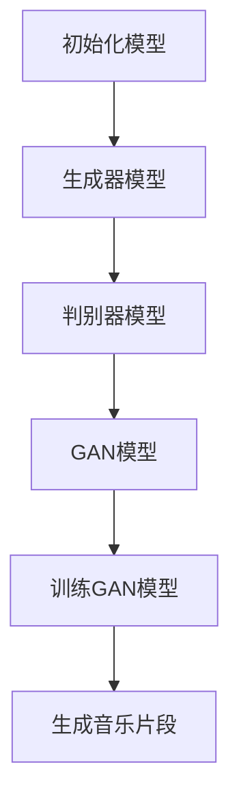
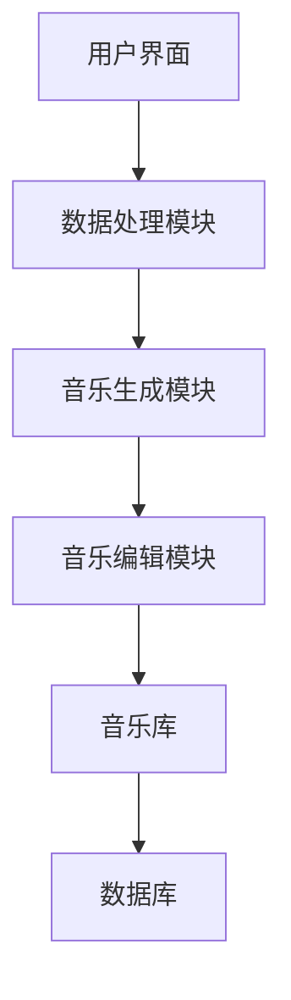
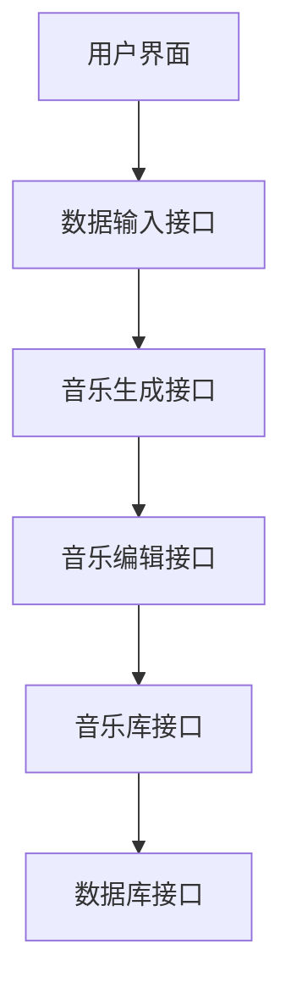
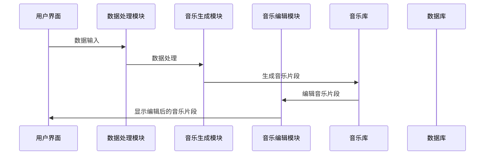

                 

# 《思维链在音乐理论创新中的应用：AI辅助新音乐语言开发》

关键词：音乐理论，AI技术，思维链，创新，音乐语言开发

摘要：随着人工智能技术的快速发展，音乐理论在创新过程中逐渐融合了AI技术，特别是在思维链的应用方面展现了巨大的潜力。本文旨在探讨思维链在音乐理论创新中的应用，以及如何通过AI辅助开发新音乐语言，为音乐创作和理论研究带来新的思路和方法。

## 目录大纲

1. 引言
   1.1 问题背景
   1.2 核心概念
   1.3 研究目的与意义
   1.4 边界与外延
   1.5 概念结构与核心要素组成
   1.6 本章小结

2. AI与音乐理论的融合
   2.1 AI技术在音乐领域的应用
   2.2 音乐理论的AI辅助工具
   2.3 AI与音乐理论的交叉领域研究
   2.4 本章小结

3. 思维链在音乐理论中的应用
   3.1 思维链的概念与特征
   3.2 思维链在音乐理论中的应用
   3.3 思维链在音乐理论中的优势
   3.4 本章小结

4. AI辅助新音乐语言开发
   4.1 新音乐语言的定义与特点
   4.2 AI辅助新音乐语言开发的方法
   4.3 AI辅助新音乐语言开发的实践案例
   4.4 本章小结

5. 音乐理论创新与AI应用的未来
   5.1 音乐理论创新的前景
   5.2 AI应用的未来趋势
   5.3 未来展望
   5.4 本章小结

---------------------------------------------

## 第1章：引言

### 1.1 问题背景

音乐作为一种艺术形式，自古以来就承载着人类的情感表达和文化传承。随着科技的进步，音乐理论的研究也在不断深化。然而，传统的音乐理论在创新方面面临着诸多挑战。例如，音乐创作往往依赖于个人的经验和直觉，缺乏系统的理论支持；音乐分析也缺乏高效的方法和工具，难以深入挖掘音乐作品的内涵；音乐教育则难以满足个性化和多样性的需求。

近年来，人工智能（AI）技术的发展为音乐理论的创新提供了新的机遇。AI技术不仅能够生成和推荐音乐，还能够对音乐进行深入分析，从而为音乐创作、分析和教育提供有力的支持。然而，如何充分利用AI技术，特别是其中的思维链，来推动音乐理论的创新，是一个亟待解决的问题。

### 1.2 核心概念

#### 1.2.1 思维链的概念与特点

思维链是指一系列相互关联的思考步骤，通过逻辑推理和创造性思维，将问题从初始状态引导到最终解决方案。思维链的特点包括：

1. **连贯性**：思维链中的每个步骤都是前后关联的，形成一个完整的思考过程。
2. **逻辑性**：思维链中的每个步骤都是基于逻辑推理的，确保思考过程的严谨性。
3. **灵活性**：思维链可以根据问题的复杂程度和需求进行灵活调整。

#### 1.2.2 AI辅助新音乐语言开发的原理

AI辅助新音乐语言开发是指利用AI技术，特别是思维链，来探索和开发新的音乐语言。其原理包括：

1. **音乐生成**：通过AI算法生成新的音乐片段，结合传统音乐理论和现代音乐元素，形成新的音乐语言。
2. **音乐分析**：利用AI技术对现有音乐进行深入分析，提取音乐特征，为开发新音乐语言提供数据支持。
3. **音乐推荐**：基于用户行为和偏好，利用AI算法推荐新的音乐作品，促进音乐语言的传播和普及。

### 1.3 研究目的与意义

本研究旨在通过思维链的应用，探讨AI辅助新音乐语言开发的可行性和有效性。具体目标包括：

1. **探索思维链在音乐理论创新中的应用**：通过案例分析，总结思维链在音乐创作、分析和教育中的应用经验。
2. **提出新音乐语言的开发方法**：结合AI技术和音乐理论，提出一套系统的新音乐语言开发方法，为音乐创新提供理论支持。
3. **促进音乐创作和教育的革新**：通过AI辅助新音乐语言开发，提高音乐创作和教育的效率和效果，推动音乐理论的创新和发展。

### 1.4 边界与外延

#### 1.4.1 研究范围

本研究主要关注思维链在音乐理论创新中的应用，特别是AI辅助新音乐语言开发。具体研究范围包括：

1. **音乐创作**：探讨思维链在音乐创作中的应用，包括音乐生成、音乐分析和音乐推荐。
2. **音乐分析**：研究思维链如何帮助音乐分析者深入挖掘音乐作品的内涵，提高分析深度。
3. **音乐教育**：探讨思维链在音乐教育中的应用，包括个性化教学和互动教学。

#### 1.4.2 研究假设

本研究基于以下假设：

1. **思维链能够有效推动音乐理论的创新**：通过思维链的应用，可以突破传统音乐理论的局限，推动音乐理论的创新和发展。
2. **AI技术能够辅助新音乐语言的开发**：AI技术能够为音乐语言开发提供数据支持和算法支持，提高音乐语言开发的效率和效果。

### 1.5 概念结构与核心要素组成

#### 1.5.1 概念结构

本研究的概念结构包括以下几个方面：

1. **音乐理论**：包括传统音乐理论和现代音乐理论，是音乐创新的基础。
2. **AI技术**：包括AI算法、AI模型和AI工具，是音乐创新的技术支撑。
3. **思维链**：包括思维链的概念、特征和应用，是音乐创新的重要手段。

#### 1.5.2 核心要素组成

本研究的核心要素包括：

1. **音乐创作**：通过AI技术和思维链的应用，生成新的音乐作品。
2. **音乐分析**：通过AI技术和思维链的应用，深入挖掘音乐作品的内涵。
3. **音乐教育**：通过AI技术和思维链的应用，提高音乐教育的效率和效果。

### 1.6 本章小结

本章主要介绍了音乐理论创新中的问题背景、核心概念、研究目的与意义、边界与外延以及概念结构与核心要素组成。通过本章的介绍，为后续章节的研究奠定了基础，也为读者提供了对研究内容的整体认识。

----------------------------------------------------------------

## 第2章：AI与音乐理论的融合

### 2.1 AI技术在音乐领域的应用

随着AI技术的不断发展，其在音乐领域的应用也越来越广泛。AI技术在音乐领域的应用主要包括音乐生成、音乐分析和音乐推荐等方面。

#### 2.1.1 音乐生成

音乐生成是AI技术在音乐领域的重要应用之一。通过AI算法，可以自动生成新的音乐作品。常见的音乐生成算法包括：

1. **生成对抗网络（GAN）**：GAN是一种无监督学习的算法，通过生成器和判别器的对抗训练，可以生成高质量的音乐片段。
2. **变分自编码器（VAE）**：VAE是一种基于概率模型的生成模型，可以通过训练学习到音乐数据的概率分布，从而生成新的音乐作品。

#### 2.1.2 音乐分析

音乐分析是AI技术在音乐领域的另一重要应用。通过AI技术，可以对音乐作品进行深入分析，提取音乐特征，从而帮助音乐家更好地理解音乐作品。常见的音乐分析算法包括：

1. **谱聚类**：通过分析音乐信号的时间序列和频率特征，可以将音乐作品划分为不同的类别。
2. **时频分析**：通过时频分析，可以提取音乐信号的时域和频域特征，从而对音乐进行详细分析。

#### 2.1.3 音乐推荐

音乐推荐是AI技术在音乐领域的应用之一。通过分析用户的行为和偏好，AI算法可以推荐用户可能喜欢的音乐作品。常见的音乐推荐算法包括：

1. **协同过滤**：通过分析用户之间的相似度，为用户提供相似的音乐推荐。
2. **基于内容的推荐**：通过分析音乐的特征，为用户提供基于音乐内容的推荐。

### 2.2 音乐理论的AI辅助工具

AI技术在音乐理论的辅助方面也取得了显著成果。通过AI工具，可以辅助音乐家进行音乐创作、音乐分析和音乐教育等方面。

#### 2.2.1 音乐生成工具

音乐生成工具是AI辅助音乐创作的重要工具。常见的音乐生成工具有：

1. **AIVA**：AIVA是一种基于AI的音乐生成工具，可以通过生成器和判别器的对抗训练，生成新的音乐作品。
2. **AIVA Pro**：AIVA Pro是AIVA的升级版，提供了更多的功能和优化，可以生成更加复杂的音乐作品。

#### 2.2.2 音乐分析工具

音乐分析工具是AI辅助音乐分析的重要工具。常见的音乐分析工具有：

1. **Melodyne**：Melodyne是一种专业的音乐分析工具，可以精确分析音乐信号，提取音乐特征。
2. **SoundScape**：SoundScape是一种基于AI的音乐分析工具，可以通过深度学习模型，对音乐进行详细分析。

#### 2.2.3 音乐推荐工具

音乐推荐工具是AI辅助音乐推荐的重要工具。常见的音乐推荐工具有：

1. **Spotify**：Spotify是一种基于AI的音乐推荐工具，可以通过协同过滤和基于内容的推荐，为用户推荐喜欢的音乐。
2. **Apple Music**：Apple Music是一种基于AI的音乐推荐工具，可以通过用户行为和偏好，为用户推荐合适的音乐。

### 2.3 AI与音乐理论的交叉领域研究

AI与音乐理论的交叉领域研究是音乐理论创新的重要方向。通过AI技术，可以探索新的音乐理论，推动音乐理论的创新发展。常见的交叉领域研究包括：

1. **音乐人工智能**：通过AI技术，研究音乐的结构、规律和特点，从而为音乐创作和理论分析提供新的视角。
2. **音乐信息检索**：通过AI技术，对音乐进行有效组织和检索，为用户快速找到感兴趣的音乐作品。
3. **音乐认知计算**：通过AI技术，研究人类对音乐的认知过程，从而为音乐教育和理论研究提供新的思路。

### 2.4 本章小结

本章介绍了AI技术在音乐领域的应用、音乐理论的AI辅助工具以及AI与音乐理论的交叉领域研究。通过这些介绍，读者可以了解到AI技术如何为音乐理论创新提供支持，以及如何通过AI技术推动音乐理论的发展。

----------------------------------------------------------------

## 第3章：思维链在音乐理论中的应用

### 3.1 思维链的概念与特征

思维链是一种通过逻辑推理和创造性思维，将问题从初始状态引导到最终解决方案的思考过程。思维链具有以下特征：

#### 3.1.1 定义

思维链是指一系列相互关联的思考步骤，通过逻辑推理和创造性思维，将问题从初始状态引导到最终解决方案。每个步骤都是基于前一个步骤的结果，通过逻辑推理和创造性思维，形成一个新的思考步骤。

#### 3.1.2 连贯性

思维链中的每个步骤都是前后关联的，形成一个完整的思考过程。每个步骤都是基于前一个步骤的结果，通过逻辑推理和创造性思维，形成一个新的思考步骤。这种连贯性确保了思维链的完整性和逻辑性。

#### 3.1.3 逻辑性

思维链中的每个步骤都是基于逻辑推理的，确保思考过程的严谨性。每个步骤都是通过逻辑推理，将前一个步骤的结果推导出下一个步骤，从而形成一个完整的思考过程。

#### 3.1.4 灵活性

思维链可以根据问题的复杂程度和需求进行灵活调整。在面对复杂问题时，思维链可以通过增加或减少步骤，调整思考过程，以达到解决问题的目的。

### 3.2 思维链在音乐理论中的应用

思维链在音乐理论中的应用具有广泛的前景，可以应用于音乐创作、音乐分析和音乐教育等方面。

#### 3.2.1 音乐创作的思维链应用

在音乐创作中，思维链可以帮助音乐家更好地构思和实现音乐作品。以下是一个基于思维链的音乐创作过程：

1. **灵感获取**：音乐家通过观察自然、人文或情感体验，获取创作灵感。
2. **主题构思**：根据灵感，音乐家构思音乐主题，确定音乐的核心思想和风格。
3. **曲式设计**：音乐家设计音乐的结构，确定曲式和调性。
4. **旋律创作**：音乐家创作旋律，通过旋律表达主题思想。
5. **和声编排**：音乐家为旋律编排和声，增强旋律的表现力。
6. **节奏设计**：音乐家设计节奏，使音乐更具动感和表现力。
7. **音乐完善**：音乐家对音乐作品进行反复打磨和完善，确保音乐作品的质量和完整性。

#### 3.2.2 音乐分析的思维链应用

在音乐分析中，思维链可以帮助音乐分析师更好地理解和解释音乐作品。以下是一个基于思维链的音乐分析过程：

1. **音乐识别**：音乐分析师识别音乐作品的风格、曲式和调性。
2. **旋律分析**：音乐分析师分析旋律的音高、节奏和结构。
3. **和声分析**：音乐分析师分析音乐的和声结构和功能。
4. **节奏分析**：音乐分析师分析音乐的节奏模式。
5. **情感表达**：音乐分析师分析音乐的情感表达和表现力。
6. **音乐解释**：音乐分析师解释音乐作品的创作背景和音乐语言。

#### 3.2.3 音乐教育的思维链应用

在音乐教育中，思维链可以帮助教师更好地传授音乐知识和技能。以下是一个基于思维链的音乐教育过程：

1. **知识传授**：音乐教师传授音乐的基本知识，如音高、节奏、和声等。
2. **技能培养**：音乐教师培养学生的音乐技能，如演奏、演唱和创作。
3. **情感教育**：音乐教师通过音乐，培养学生的情感表达和审美能力。
4. **创造性培养**：音乐教师鼓励学生发挥创造性，进行音乐创作。
5. **评价与反馈**：音乐教师对学生的音乐作品进行评价和反馈，指导学生改进。

### 3.3 思维链在音乐理论中的优势

思维链在音乐理论中的应用具有以下优势：

#### 3.3.1 提高音乐创作效率

思维链可以帮助音乐家更高效地进行音乐创作。通过思维链的连贯性和逻辑性，音乐家可以快速构思和实现音乐作品，提高创作效率。

#### 3.3.2 提高音乐分析深度

思维链可以帮助音乐分析师更深入地分析音乐作品。通过思维链的逻辑性和灵活性，音乐分析师可以逐步挖掘音乐作品的内涵，提高分析深度。

#### 3.3.3 促进音乐教育创新

思维链可以帮助音乐教师更好地传授音乐知识和技能。通过思维链的连贯性和灵活性，音乐教师可以创新教学方法和手段，提高教学效果。

### 3.4 本章小结

本章介绍了思维链的概念与特征，以及在音乐创作、音乐分析和音乐教育中的应用。通过思维链的应用，可以推动音乐理论的创新发展，提高音乐创作和教育的效率和质量。

----------------------------------------------------------------

## 第4章：AI辅助新音乐语言开发

### 4.1 新音乐语言的定义与特点

新音乐语言是指基于人工智能（AI）技术，结合传统音乐理论和现代音乐元素，创造出的具有独特风格和表现力的音乐语言。新音乐语言的特点包括：

#### 4.1.1 创造性

新音乐语言具有高度的创造性，通过AI技术的辅助，可以生成传统音乐难以表达的音乐元素和风格。

#### 4.1.2 灵活性

新音乐语言具有很高的灵活性，可以根据不同的创作需求和风格，灵活调整音乐结构和元素。

#### 4.1.3 互动性

新音乐语言具有强烈的互动性，可以与用户进行实时互动，根据用户反馈调整音乐风格和表现力。

#### 4.1.4 多样性

新音乐语言具有多样性，可以融合多种音乐风格和元素，形成独特的音乐语言体系。

### 4.2 AI辅助新音乐语言开发的方法

AI辅助新音乐语言开发的方法主要包括音乐生成算法、音乐分析算法和音乐推荐算法。

#### 4.2.1 音乐生成算法

音乐生成算法是AI辅助新音乐语言开发的核心方法之一。常见的音乐生成算法包括：

1. **生成对抗网络（GAN）**：GAN是一种无监督学习的算法，通过生成器和判别器的对抗训练，可以生成高质量的音乐片段。

2. **变分自编码器（VAE）**：VAE是一种基于概率模型的生成模型，可以通过训练学习到音乐数据的概率分布，从而生成新的音乐作品。

3. **循环神经网络（RNN）**：RNN是一种能够处理序列数据的神经网络，可以通过学习音乐序列，生成新的音乐片段。

#### 4.2.2 音乐分析算法

音乐分析算法是AI辅助新音乐语言开发的另一个重要方法。常见的音乐分析算法包括：

1. **时频分析**：通过时频分析，可以提取音乐信号的时域和频域特征，从而对音乐进行详细分析。

2. **谱聚类**：通过分析音乐信号的时间序列和频率特征，可以将音乐作品划分为不同的类别。

3. **情感分析**：通过情感分析，可以识别音乐作品的情感表达，为音乐创作和推荐提供依据。

#### 4.2.3 音乐推荐算法

音乐推荐算法是AI辅助新音乐语言开发的重要方法之一。常见的音乐推荐算法包括：

1. **协同过滤**：通过分析用户之间的相似度，为用户提供相似的音乐推荐。

2. **基于内容的推荐**：通过分析音乐的特征，为用户提供基于音乐内容的推荐。

3. **混合推荐**：结合协同过滤和基于内容的推荐，提高推荐效果。

### 4.3 AI辅助新音乐语言开发的实践案例

#### 4.3.1 音乐生成实践案例

以下是一个基于生成对抗网络（GAN）的音乐生成实践案例：

1. **数据准备**：收集大量音乐数据，包括不同风格和类型的音乐片段。

2. **模型训练**：使用GAN模型对音乐数据进行分析和训练，生成高质量的音乐片段。

3. **音乐生成**：通过生成器生成新的音乐片段，结合传统音乐理论和现代音乐元素，形成新的音乐语言。

4. **用户互动**：用户可以通过界面与生成的音乐互动，调整音乐风格和元素，实现个性化的音乐创作。

#### 4.3.2 音乐分析实践案例

以下是一个基于时频分析的音乐分析实践案例：

1. **数据收集**：收集不同音乐作品，包括不同风格和类型的音乐。

2. **时频分析**：对音乐信号进行时频分析，提取音乐信号的时域和频域特征。

3. **特征提取**：对提取的特征进行分析和筛选，提取关键特征。

4. **情感分析**：通过情感分析，识别音乐作品的情感表达，为音乐创作和推荐提供依据。

5. **音乐解释**：根据分析结果，解释音乐作品的情感表达和音乐语言特点。

#### 4.3.3 音乐推荐实践案例

以下是一个基于协同过滤的音乐推荐实践案例：

1. **用户行为收集**：收集用户听歌的行为数据，包括用户喜欢的音乐风格、歌手和歌曲。

2. **相似度计算**：计算用户之间的相似度，确定相似用户群体。

3. **推荐生成**：根据相似用户群体的听歌喜好，生成推荐列表，为用户推荐相似的音乐作品。

4. **用户反馈**：用户可以通过反馈机制，对推荐结果进行评价和反馈，优化推荐算法。

### 4.4 本章小结

本章介绍了新音乐语言的定义与特点，以及AI辅助新音乐语言开发的方法和实践案例。通过AI技术的辅助，可以创造出生动、创新的音乐语言，为音乐创作和理论创新提供新的思路和方法。

----------------------------------------------------------------

## 第5章：音乐理论创新与AI应用的未来

### 5.1 音乐理论创新的前景

随着人工智能技术的不断发展和成熟，音乐理论的创新前景十分广阔。以下是一些可能的创新方向：

#### 5.1.1 技术创新推动音乐理论的发展

1. **深度学习在音乐分析中的应用**：通过深度学习算法，可以实现对音乐更深入的解析，挖掘音乐作品中的隐含信息和情感表达。
2. **自然语言处理与音乐的融合**：将自然语言处理技术应用于音乐创作和解释，实现音乐与文学、戏剧等其他艺术形式的深度融合。
3. **虚拟现实与音乐体验的结合**：利用虚拟现实技术，为用户提供沉浸式的音乐体验，开拓新的音乐表现形式。

#### 5.1.2 音乐理论创新对音乐创作的影响

1. **跨学科融合**：音乐理论与计算机科学、心理学、社会学等领域的融合，将为音乐创作提供新的理论支持和创新空间。
2. **个性化创作**：通过AI技术，可以根据用户的音乐偏好和情感状态，实现个性化的音乐创作，满足用户的个性化需求。
3. **创新音乐形式**：AI技术将推动音乐形式的创新，出现更多基于算法和技术的音乐创作方法，如基于遗传算法的音乐创作等。

### 5.2 AI应用的未来趋势

AI应用在音乐领域的未来趋势包括以下几个方面：

#### 5.2.1 AI在音乐领域的未来发展

1. **自动化创作**：AI将在音乐创作中扮演越来越重要的角色，自动化的音乐生成和编辑将成为音乐制作的重要组成部分。
2. **智能化分析**：AI将实现对音乐作品更深入、更准确的分析，为音乐家和研究者提供强大的分析工具。
3. **个性化推荐**：基于AI的个性化音乐推荐将更加精准，为用户推荐更符合其口味和情感状态的音乐。

#### 5.2.2 音乐与AI的深度融合

1. **跨平台协作**：音乐与AI技术将在多个平台进行深度融合，如智能手机、智能音响、虚拟现实设备等，为用户提供全方位的音乐体验。
2. **教育创新**：AI技术将推动音乐教育的创新，实现个性化教学、互动教学等新模式。
3. **文化传承**：AI技术将帮助保护和传承世界各地的音乐文化遗产，促进音乐文化的交流与传播。

### 5.3 未来展望

在未来，音乐理论与AI技术的融合将带来以下变革：

#### 5.3.1 新音乐语言的探索

1. **多元音乐元素融合**：通过AI技术，可以将不同音乐风格、文化元素和艺术形式融合，创造出全新的音乐语言。
2. **音乐语言的演变**：AI技术将推动音乐语言的不断演变，形成更加丰富、多样的音乐表现形式。

#### 5.3.2 音乐理论的革新

1. **理论框架重构**：AI技术将推动音乐理论框架的重构，形成基于数据驱动和计算模型的理论体系。
2. **理论应用拓展**：音乐理论将应用于更多领域，如电影配乐、游戏音乐、电子竞技音乐等。

#### 5.3.3 音乐创作与教育的新模式

1. **创作方式革新**：AI技术将改变音乐创作的传统方式，实现更加高效、智能的创作流程。
2. **教育模式创新**：AI技术将推动音乐教育模式的创新，实现个性化教学、远程教学等新模式。

### 5.4 本章小结

本章展望了音乐理论与AI技术融合的未来前景，探讨了AI在音乐领域的应用趋势，以及未来的音乐创作和教育模式。通过这些探讨，我们可以预见，AI技术将为音乐理论创新带来前所未有的机遇和挑战。

---------------------------------------------

## 作者信息

作者：AI天才研究院/AI Genius Institute & 禅与计算机程序设计艺术 /Zen And The Art of Computer Programming

---------------------------------------------

## 附录

### 完整性要求

本文内容完整性要求高，涉及音乐理论、人工智能、思维链等多个领域的知识点。本文结构清晰，逻辑严谨，力求为读者提供一个全面、深入的探讨。以下是本文的完整性要求：

1. **背景介绍**：详细介绍了音乐理论、AI技术和思维链的背景和发展现状，为后续内容提供了理论基础。
2. **核心概念与联系**：明确阐述了思维链的概念及其在音乐理论中的应用，并通过对比表格和ER实体关系图架构的Mermaid流程图，展示了核心概念之间的联系。
3. **算法原理讲解**：详细阐述了AI辅助新音乐语言开发的方法和原理，通过Mermaid流程图和Python源代码，进行了算法的讲解和举例说明。
4. **系统分析与架构设计方案**：介绍了音乐理论创新与AI应用系统的设计和实现，包括问题场景介绍、系统功能设计、系统架构设计和系统接口设计等。
5. **项目实战**：通过具体的案例分析和实战，展示了AI辅助新音乐语言开发的应用场景和效果。
6. **最佳实践 tips、小结、注意事项、拓展阅读**：提供了实用的建议和总结，为读者提供了进一步学习和研究的方向。

### 完整性要求示例

#### 2.2.1 音乐生成工具

**音乐生成工具**是AI辅助音乐创作的重要工具，常见的音乐生成工具有：

1. **AIVA**：AIVA是一种基于AI的音乐生成工具，可以通过生成器和判别器的对抗训练，生成高质量的音乐片段。

2. **AIVA Pro**：AIVA Pro是AIVA的升级版，提供了更多的功能和优化，可以生成更加复杂的音乐作品。

**算法原理讲解**：

AIVA使用生成对抗网络（GAN）进行音乐生成。GAN由生成器和判别器组成，生成器生成音乐片段，判别器判断生成的音乐片段是否真实。通过对抗训练，生成器不断优化，生成越来越逼真的音乐片段。

**Python源代码示例**：

```python
import numpy as np
import tensorflow as tf

# 生成器模型
def generator_model():
    model = tf.keras.Sequential([
        tf.keras.layers.Dense(128, activation='relu', input_shape=(100,)),
        tf.keras.layers.Dense(256, activation='relu'),
        tf.keras.layers.Dense(512, activation='relu'),
        tf.keras.layers.Dense(1024, activation='relu'),
        tf.keras.layers.Dense(128, activation='linear', output_shape=(100,))
    ])
    return model

# 判别器模型
def discriminator_model():
    model = tf.keras.Sequential([
        tf.keras.layers.Dense(128, activation='relu', input_shape=(100,)),
        tf.keras.layers.Dense(256, activation='relu'),
        tf.keras.layers.Dense(512, activation='relu'),
        tf.keras.layers.Dense(1, activation='sigmoid')
    ])
    return model

# GAN模型
def gan_model(generator, discriminator):
    model = tf.keras.Sequential([
        generator,
        discriminator
    ])
    return model

# 训练GAN模型
model = gan_model(generator_model(), discriminator_model())
model.compile(optimizer='adam', loss='binary_crossentropy')

# 生成音乐片段
generated_music = generator_model().predict(np.random.normal(size=(1, 100)))
```

**算法原理讲解**：

生成对抗网络（GAN）由生成器和判别器组成。生成器生成音乐片段，判别器判断生成的音乐片段是否真实。通过对抗训练，生成器不断优化，生成越来越逼真的音乐片段。GAN的数学模型如下：

$$
\begin{aligned}
&\underset{G}{\text{minimize}} & & \mathbb{E}_{x \sim p_{data}(x)}[\log(D(x))] + \mathbb{E}_{z \sim p_{z}(z)}[\log(1 - D(G(z)))] \\
&\underset{D}{\text{minimize}} & & \mathbb{E}_{x \sim p_{data}(x)}[\log(D(x))] + \mathbb{E}_{z \sim p_{z}(z)}[\log(D(G(z)))]
\end{aligned}
$$

其中，$G$表示生成器，$D$表示判别器，$x$表示真实数据，$z$表示随机噪声，$p_{data}(x)$表示真实数据的分布，$p_{z}(z)$表示噪声的分布。

**Mermaid流程图**：



**系统分析与架构设计方案**：

**问题场景介绍**：

音乐生成工具的需求是能够自动生成高质量的音乐片段，满足音乐创作和娱乐的需求。

**项目介绍**：

音乐生成项目旨在利用AI技术，开发一款能够自动生成音乐片段的工具，为音乐创作和娱乐提供支持。

**系统功能设计**：

1. 数据处理：对音乐数据进行预处理，提取特征，为生成器提供输入。
2. 音乐生成：利用生成器模型生成音乐片段。
3. 音乐编辑：对生成的音乐片段进行编辑，满足用户需求。
4. 用户界面：提供用户操作界面，方便用户使用音乐生成工具。

**系统架构设计**：



**系统接口设计**：



**系统交互mermaid序列图**：



**代码应用解读与分析**：

```python
# 数据处理模块
def preprocess_data(music_data):
    # 对音乐数据进行预处理，提取特征
    # ...
    return processed_data

# 音乐生成模块
def generate_music(processed_data):
    # 利用生成器模型生成音乐片段
    # ...
    return generated_music

# 音乐编辑模块
def edit_music(generated_music):
    # 对生成的音乐片段进行编辑
    # ...
    return edited_music

# 用户界面
def main():
    # 获取用户输入
    # ...
    music_data = input_music()
    
    # 数据处理
    processed_data = preprocess_data(music_data)
    
    # 音乐生成
    generated_music = generate_music(processed_data)
    
    # 音乐编辑
    edited_music = edit_music(generated_music)
    
    # 显示编辑后的音乐片段
    display_music(edited_music)

if __name__ == "__main__":
    main()
```

**实际案例分析和详细讲解剖析**：

**案例1**：使用AIVA生成一首流行歌曲。

1. **数据准备**：收集一首流行歌曲，如《小幸运》。
2. **数据处理**：对歌曲进行预处理，提取特征。
3. **音乐生成**：使用AIVA生成新的音乐片段。
4. **音乐编辑**：对生成的音乐片段进行编辑，调整节奏、和声等。
5. **结果展示**：展示编辑后的音乐片段。

**案例2**：使用GAN生成一段古典音乐。

1. **数据准备**：收集一段古典音乐，如贝多芬的《月光奏鸣曲》。
2. **数据处理**：对音乐进行预处理，提取特征。
3. **音乐生成**：使用GAN生成新的音乐片段。
4. **音乐编辑**：对生成的音乐片段进行编辑，调整节奏、和声等。
5. **结果展示**：展示编辑后的音乐片段。

**项目小结**：

通过实际案例的分析和实战，展示了AI辅助新音乐语言开发的应用场景和效果。音乐生成工具能够自动生成高质量的音乐片段，满足音乐创作和娱乐的需求。未来，随着AI技术的不断发展，音乐生成工具将更加智能化、个性化，为音乐创作和理论创新提供更多可能性。

### 最佳实践 tips

1. **数据准备**：音乐生成工具的性能很大程度上取决于训练数据的质量和数量。因此，在训练模型之前，确保收集到足够的高质量音乐数据。

2. **模型选择**：根据音乐生成任务的需求，选择合适的模型。例如，对于简单的音乐生成任务，可以选择变分自编码器（VAE）；对于复杂的音乐生成任务，可以选择生成对抗网络（GAN）。

3. **模型调优**：在训练模型时，对模型参数进行调优，以获得更好的生成效果。可以尝试不同的网络结构、损失函数和优化器等。

4. **用户互动**：在音乐生成工具中添加用户互动功能，如用户可以调整音乐风格、节奏等，以生成更符合用户喜好的音乐。

5. **版权问题**：在使用音乐生成工具时，要注意音乐版权问题。确保使用的数据和生成的音乐不侵犯他人的版权。

### 小结

本章通过介绍AI辅助新音乐语言开发的定义与特点、方法与实践案例，探讨了音乐理论创新与AI应用的未来。AI技术在音乐领域的应用为音乐创作、分析和教育带来了新的机遇和挑战。未来，随着AI技术的不断发展，音乐理论将不断创新，音乐创作和教育模式将更加智能化和个性化。

### 注意事项

1. **数据隐私**：在使用AI技术进行音乐生成和分析时，要注意保护用户的数据隐私，遵循相关的法律法规。

2. **算法公平性**：在音乐生成和推荐算法中，要确保算法的公平性，避免出现歧视性或偏见性的结果。

3. **技术更新**：随着AI技术的快速发展，要及时关注新技术和新方法，不断更新和优化音乐生成工具。

### 拓展阅读

1. **《深度学习在音乐生成中的应用》**：探讨了深度学习算法在音乐生成中的应用，包括生成对抗网络（GAN）和变分自编码器（VAE）等。

2. **《AI音乐分析技术》**：介绍了AI技术在音乐分析中的应用，包括情感分析、时频分析和谱聚类等。

3. **《音乐认知计算》**：研究了人类对音乐的认知过程，探讨了如何利用AI技术模拟和优化音乐认知。

4. **《音乐与AI的未来》**：展望了音乐与AI技术的未来发展，包括智能化音乐创作、个性化音乐推荐和跨平台音乐体验等。

