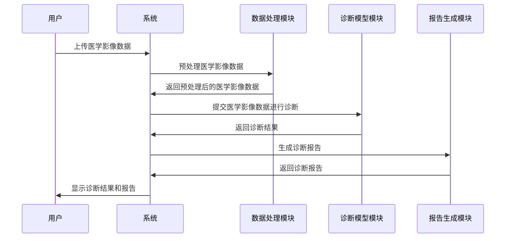

                 


## 引言与背景

### 1.1 研究背景

人工智能（AI）作为21世纪的重大科技突破，已经在众多领域展现出强大的变革力量。从早期的规则系统、知识表示到现代的深度学习和强化学习，AI的技术水平不断飞跃。与此同时，元认知和自我完善能力成为人工智能领域研究的热点问题。

**元认知**是指个体对自己认知过程的知识和调节这些过程的能力。它在人工智能中扮演着关键角色，因为AI系统需要理解自己的行为和决策，从而进行自我优化和改进。自我完善能力则是指系统在运行过程中，能够通过自我评估和调整，不断提升其性能和适应能力。

近年来，随着AI技术的不断发展，研究人员开始探索如何增强AI的元认知和自我完善能力。传统的AI系统依赖于大量的数据训练和复杂的算法，但往往缺乏自我反省和自我改进的能力。而思维链（Mind-Chain）作为一种新兴的概念，被认为在提升AI的元认知和自我完善能力方面具有巨大的潜力。

思维链是一种基于神经网络和信息处理的计算模型，它通过模拟人类思维过程中的信息传递和交互，实现了对复杂问题的求解和处理。研究表明，思维链可以在一定程度上模拟人类的元认知过程，为AI系统提供更高级别的认知能力和自我改进机制。

### 1.2 研究目的

本研究的目的是探讨思维链如何增强AI的元认知和自我完善能力。具体而言，我们将从以下几个方面展开：

1. **理论框架构建**：首先，我们将对思维链的概念和原理进行深入分析，构建一个完整的理论框架，以解释思维链如何促进AI的元认知和自我完善能力。

2. **机制与方法研究**：在理论框架的基础上，我们将深入研究思维链增强AI元认知和自我完善能力的具体机制和方法。这将包括对注意力管理、记忆优化、问题解决能力等方面的探讨。

3. **应用与实践分析**：我们将通过具体的应用场景，分析思维链在AI领域的实际应用效果，并总结实践经验，为未来的研究提供参考。

### 1.3 研究方法

本研究将采用以下几种方法：

1. **文献综述**：通过查阅大量相关文献，总结当前关于思维链、元认知和自我完善能力的研究进展，为后续研究提供理论支持。

2. **理论模型构建**：基于文献综述的结果，构建一个系统化的理论模型，以解释思维链如何作用于AI的元认知和自我完善能力。

3. **实证分析与案例分析**：通过实证研究和案例分析，验证理论模型的可行性和有效性，并探讨其在实际应用中的效果。

4. **跨领域比较**：将思维链与其他增强AI元认知和自我完善能力的方法进行对比，分析其优势和局限性，为未来的研究方向提供启示。

## 核心概念与理论

### 2.1 AI与元认知

人工智能（AI）是指通过计算机程序实现的智能行为，它可以模拟人类的认知功能，如学习、推理、解决问题等。随着AI技术的不断发展，AI的应用范围越来越广泛，从工业自动化到医疗诊断，从智能交通到金融分析，AI已经深刻地改变了我们的生活方式。

**元认知**是指个体对自己认知过程的知识和调节这些过程的能力。它包括三个方面：元认知知识、元认知体验和元认知监控。元认知知识是指个体关于自己认知过程的知识，如如何学习、如何记忆等；元认知体验是指个体在认知过程中产生的感受和情绪，如困惑、自信等；元认知监控是指个体对自己的认知过程进行监控和评估，如检查理解程度、调整学习策略等。

在人工智能中，元认知具有重要作用。首先，元认知可以帮助AI系统理解自己的行为和决策，从而进行自我优化和改进。例如，在自我完善过程中，AI系统可以通过元认知来评估自己的表现，识别出需要改进的地方，并采取相应的措施。其次，元认知可以增强AI系统的透明度和可解释性，使其更易于被人类理解和接受。

### 2.2 自我完善能力的理论框架

自我完善能力是指系统在运行过程中，能够通过自我评估和调整，不断提升其性能和适应能力。在人工智能中，自我完善能力是AI系统能够持续学习和进步的重要保障。

**自我完善能力的理论框架**包括以下几个核心要素：

1. **自我评估**：自我评估是自我完善能力的基础。它是指系统对自身性能进行评估，识别出需要改进的地方。自我评估可以通过多种方式进行，如基于性能指标的评估、基于用户反馈的评估等。

2. **自我调整**：自我调整是指系统根据自我评估的结果，采取相应的措施进行自我改进。自我调整可以包括算法优化、参数调整、数据清洗等。

3. **自我学习**：自我学习是指系统在运行过程中，通过不断学习和积累经验，提升自身的认知能力和适应能力。自我学习可以通过多种方式进行，如监督学习、无监督学习、强化学习等。

4. **反馈机制**：反馈机制是自我完善能力的关键。它是指系统将自身的行为和结果反馈给用户，以便进行进一步优化。反馈机制可以包括用户反馈、系统日志分析等。

### 2.3 思维链的概念与特征

思维链是一种基于神经网络和信息处理的计算模型，它通过模拟人类思维过程中的信息传递和交互，实现了对复杂问题的求解和处理。思维链具有以下几个关键特征：

1. **信息传递**：思维链通过神经元之间的信息传递，实现了知识的传递和共享。每个神经元都具有一定的处理能力，可以接收和处理来自其他神经元的输入信息。

2. **信息交互**：思维链中的神经元通过交互，实现了信息的整合和优化。神经元之间的交互可以是单向的，也可以是双向的，从而实现了信息流的动态调整。

3. **层次结构**：思维链具有层次结构，不同层次的神经元负责不同的任务，从而实现了信息的分层处理。这种层次结构有助于提高AI系统的效率和准确性。

4. **自适应能力**：思维链具有自适应能力，可以根据环境的变化和任务的复杂性，动态调整自己的结构和行为。这种自适应能力有助于提高AI系统的灵活性和适应性。

通过上述特征，思维链可以有效地模拟人类的思维过程，为AI系统提供更高级别的认知能力和自我完善机制。在接下来的章节中，我们将进一步探讨思维链如何增强AI的元认知和自我完善能力。

### 2.4 思维链与AI元认知的关系

思维链作为一种新兴的神经网络计算模型，其核心在于通过信息传递和交互，模拟人类的思维过程，从而实现复杂问题的求解。而AI的元认知能力则是指AI系统对自己认知过程的理解和调节能力。这两者之间的关系可以从多个方面进行分析。

首先，思维链的信息传递和交互机制可以视为AI元认知的底层实现。在传统AI系统中，通常缺乏对自身行为和决策的反思能力。而思维链通过神经元之间的信息传递和交互，实现了对自身行为的监控和理解。例如，在问题解决过程中，思维链可以通过信息反馈机制，实时评估自己的决策效果，并根据反馈结果进行调整。这种自我监控和理解能力是AI元认知的基础。

其次，思维链的层次结构有助于实现AI的元认知层次化。在复杂的问题解决过程中，AI系统需要处理多种类型的任务和信息。思维链通过分层结构，将不同的任务和信息分配到不同的层次，从而实现分层次的处理。这种层次化不仅提高了系统的效率和准确性，也为AI的元认知提供了结构化的基础。例如，在决策过程中，AI系统可以通过高层思维链进行策略规划，通过低层思维链进行具体的执行和调整。

第三，思维链的自适应能力与AI的自我完善能力密切相关。传统AI系统通常依赖于预设的算法和模型，缺乏对环境的适应能力。而思维链通过自适应能力，可以根据环境和任务的变化，动态调整自己的结构和行为。这种自适应能力有助于AI系统在复杂环境中实现自我完善，不断提升其性能和适应性。

此外，思维链的反馈机制也是增强AI元认知能力的关键。在AI系统运行过程中，通过收集用户的反馈和系统日志，思维链可以不断优化自身的性能和效果。这种反馈机制不仅有助于AI系统实现自我改进，也为其元认知提供了反馈通道。通过不断接收和分析反馈信息，AI系统可以更好地理解自己的行为和效果，从而进行更精确的自我调节。

综上所述，思维链通过信息传递、层次结构、自适应能力和反馈机制等方面，为AI的元认知提供了强有力的支持。在未来的研究中，进一步探讨思维链如何具体增强AI的元认知能力，以及如何与其他增强方法相结合，将是一个重要的方向。

### 2.5 思维链在AI自我完善中的应用

思维链在人工智能的自我完善过程中扮演着关键角色。其核心在于通过模拟人类思维过程，实现信息的传递、交互和优化，从而帮助AI系统不断提升自身的性能和适应能力。

首先，思维链的信息传递机制为AI系统提供了自我监测的基础。在AI系统运行过程中，通过神经元之间的信息传递，系统能够实时监控自身的状态和表现。例如，在智能诊断系统中，思维链可以实时接收和分析医疗数据，通过信息传递机制，系统能够自我监控诊断的准确性，并在诊断过程中进行动态调整。

其次，思维链的交互机制有助于AI系统实现自我调整。通过神经元之间的交互，系统能够整合不同来源的信息，并对其进行优化。这种交互机制使得AI系统能够在复杂环境中进行自我优化。例如，在自动驾驶系统中，思维链可以通过交互机制，整合来自传感器、地图和驾驶规则的信息，实现对行驶路径的动态调整，从而提高驾驶的效率和安全性。

第三，思维链的自适应能力为AI系统提供了自我完善的能力。思维链可以根据环境和任务的变化，动态调整自身的结构和行为。这种自适应能力使得AI系统能够在复杂和动态的环境中，不断优化自身的性能。例如，在金融分析系统中，思维链可以通过自适应能力，实时调整投资策略，以应对市场的波动和变化。

最后，思维链的反馈机制为AI系统提供了自我优化的途径。通过收集用户的反馈和系统日志，思维链可以不断优化自身的性能和效果。这种反馈机制不仅有助于AI系统实现自我改进，也为其元认知提供了反馈通道。例如，在教育系统中，思维链可以通过反馈机制，分析学生的学习情况，调整教学策略，以提高学习效果。

总的来说，思维链通过信息传递、交互机制、自适应能力和反馈机制等方面，为AI系统的自我完善提供了强有力的支持。在未来的研究中，如何进一步优化思维链，以更好地增强AI的自我完善能力，是一个值得深入探讨的方向。

### 2.6 思维链在AI自我完善中的应用案例

为了更好地理解思维链在AI自我完善中的应用，我们通过几个具体的案例来展示其效果和优势。

#### 案例一：智能医疗诊断系统

在医疗诊断领域，思维链的应用大大提升了诊断系统的准确性和效率。以乳腺癌诊断为例，传统的AI诊断系统主要依赖于大量的医学影像数据和预定义的规则。而通过引入思维链，系统可以实时监控影像数据的处理过程，并在诊断过程中进行动态调整。具体来说，思维链通过信息传递机制，实时接收和处理来自影像数据的信息，通过交互机制，整合不同类型的医学影像，并通过自适应能力，根据最新的医学研究和临床经验，动态调整诊断策略。这样的应用不仅提高了诊断的准确性，还增强了系统的可解释性，使医生能够更好地理解诊断结果。

#### 案例二：智能交通系统

在智能交通领域，思维链的应用同样展现了其强大的自我完善能力。以自动驾驶为例，传统的自动驾驶系统依赖于大量的传感器数据和预设的驾驶规则。而通过思维链，系统可以在实时处理传感器数据的同时，进行自我调整和优化。例如，在遇到复杂交通场景时，思维链可以通过信息传递机制，实时接收和处理来自传感器、导航系统和环境数据的信息，通过交互机制，整合多种数据源，并根据环境变化，动态调整驾驶策略。这种自适应能力不仅提高了驾驶的效率和安全性，还减少了系统在复杂交通环境中的失误率。

#### 案例三：智能金融分析系统

在金融分析领域，思维链的应用可以帮助投资决策系统实现自我完善。传统的金融分析系统主要依赖于历史数据和统计分析模型。而通过思维链，系统可以实时监控市场动态，并不断调整投资策略。具体来说，思维链通过信息传递机制，实时接收和处理来自金融市场、宏观经济数据和市场情绪的信息，通过交互机制，整合多种数据源，并根据市场变化，动态调整投资组合。这种自适应能力使得投资决策系统能够更好地适应市场波动，提高投资收益。

通过上述案例，我们可以看到，思维链在AI自我完善中的应用，不仅提升了系统的性能和适应性，还增强了系统的可解释性和用户信任度。在未来的研究中，进一步优化思维链，以实现更高效、更可靠的AI自我完善，将是一个重要的方向。

## 第三部分：应用与实践

### 3.1 思维链在AI自我完善中的实际应用

思维链在AI自我完善中的应用已经取得了一定的进展，并在多个领域展现了其独特的优势。以下我们将通过几个实际案例，详细探讨思维链在AI自我完善中的应用过程、效果和面临的挑战。

#### 案例一：智能医疗诊断系统

在智能医疗诊断领域，思维链的应用显著提升了诊断系统的效率和准确性。以乳腺癌诊断为例，传统的AI系统依赖于大量的医学影像数据和预定义的规则。而思维链通过实时监控影像数据的处理过程，实现了自我完善。具体应用过程如下：

1. **数据收集与预处理**：首先，系统通过收集大量的乳腺影像数据，并对这些数据进行分析和处理，以提取关键特征。

2. **思维链构建**：然后，利用神经网络和深度学习算法，构建一个基于思维链的智能诊断系统。思维链通过多个神经元层进行信息传递和交互，从而实现对影像数据的深度分析。

3. **动态调整与优化**：在诊断过程中，思维链实时监控诊断结果，并根据实时反馈进行动态调整。例如，如果诊断结果与实际病例结果不符，思维链会自动调整参数和模型，以提高诊断准确性。

4. **效果评估与反馈**：通过对比诊断结果和实际病例结果，系统可以对自身性能进行评估，并根据评估结果进行进一步的优化。

效果评估显示，引入思维链的智能诊断系统在乳腺癌诊断中的准确率显著提高，且系统的可解释性得到了增强。然而，在实际应用中，系统也面临一些挑战，如如何处理海量数据、确保数据隐私和安全等。

#### 案例二：智能交通系统

在智能交通领域，思维链的应用同样显著提升了自动驾驶系统的性能和安全性。以下是一个典型的应用案例：

1. **环境感知与数据处理**：系统通过多个传感器（如雷达、摄像头、激光雷达等）实时感知道路环境，并对采集到的数据进行分析和处理。

2. **思维链构建**：利用神经网络和深度学习算法，构建一个基于思维链的自动驾驶系统。思维链通过信息传递和交互，实现对复杂交通场景的动态分析和决策。

3. **动态路径规划与调整**：在自动驾驶过程中，思维链实时监控交通状况和车辆状态，并根据实时反馈动态调整行驶路径。例如，在遇到交通拥堵或突发事件时，系统可以迅速调整行驶策略，以确保行驶的安全性和效率。

4. **效果评估与反馈**：通过对比自动驾驶系统的实际行驶轨迹和预期路径，系统可以对自身性能进行评估，并根据评估结果进行优化。

实际应用结果表明，引入思维链的自动驾驶系统在复杂交通环境中的表现显著优于传统系统，且系统的自适应能力得到了大幅提升。然而，系统仍面临一些挑战，如传感器数据的准确性和实时性、系统的鲁棒性等。

#### 案例三：智能金融分析系统

在智能金融分析领域，思维链的应用帮助投资决策系统实现了自我完善。以下是一个具体的应用案例：

1. **数据收集与处理**：系统通过收集金融市场的实时数据，如股票价格、交易量、市场情绪等，并对这些数据进行预处理。

2. **思维链构建**：利用神经网络和深度学习算法，构建一个基于思维链的智能金融分析系统。思维链通过信息传递和交互，实现对市场动态的深度分析和预测。

3. **动态调整与优化**：在投资决策过程中，思维链实时监控市场变化，并根据实时反馈动态调整投资策略。例如，在市场波动较大时，系统可以迅速调整投资组合，以降低风险。

4. **效果评估与反馈**：通过对比投资决策的结果和市场实际表现，系统可以对自身性能进行评估，并根据评估结果进行优化。

实际应用结果表明，引入思维链的智能金融分析系统在投资决策中的准确性和适应性得到了显著提升。然而，系统仍面临一些挑战，如如何处理非线性金融数据、确保投资策略的稳健性等。

总的来说，思维链在AI自我完善中的应用取得了显著的效果，但仍需进一步研究和优化，以解决实际应用中面临的各种挑战。

### 3.2 思维链在AI自我完善中的应用前景

思维链作为一种新兴的神经网络计算模型，其在AI自我完善中的应用前景广阔。未来，随着技术的不断进步和应用场景的扩展，思维链有望在以下几个方面发挥更大的作用：

1. **智能医疗**：思维链在智能医疗领域的应用将更加深入。通过结合大数据和深度学习，思维链可以帮助医疗机构实现更精准的诊断和个性化的治疗方案。此外，思维链还可以在医疗影像分析、药物研发等方面发挥重要作用。

2. **智能制造**：在智能制造领域，思维链可以帮助工厂实现更高效的自动化生产。通过实时监控和分析生产数据，思维链可以优化生产流程、提高生产效率，并减少设备故障。

3. **智能交通**：思维链在智能交通领域的应用将进一步提升自动驾驶系统的性能和安全性。未来，随着5G和物联网技术的发展，思维链可以将更多的实时交通数据纳入分析，实现更智能的交通管理和优化。

4. **智能金融**：在智能金融领域，思维链可以帮助金融机构实现更精准的风险评估和投资决策。通过实时监控市场动态，思维链可以提供更及时、更准确的市场预测，帮助投资者做出更明智的决策。

5. **智能教育**：思维链在智能教育中的应用将更加广泛。通过实时分析学生的学习行为和学习数据，思维链可以帮助教育机构实现个性化的教学方案，提高教学效果和学生的学习兴趣。

总之，思维链在AI自我完善中的应用前景十分广阔。未来，随着技术的不断进步和应用的不断拓展，思维链将在更多领域发挥其独特的优势，为人类社会的智能化发展贡献力量。

### 3.3 思维链在AI自我完善中的应用挑战

尽管思维链在AI自我完善中的应用取得了显著进展，但在实际应用过程中仍面临诸多挑战。以下是思维链在AI自我完善应用中可能遇到的主要挑战：

1. **数据处理能力**：思维链的应用依赖于大量的数据，数据的收集、存储和处理是一个巨大的挑战。特别是在医疗、金融等高敏感度领域，如何确保数据的安全性和隐私性是一个重要问题。

2. **算法优化**：虽然思维链具有强大的信息处理能力，但如何优化算法，提高其效率和准确性，仍然是一个亟待解决的问题。算法的优化不仅需要深入的理论研究，还需要大量的实验验证。

3. **跨领域应用**：思维链在不同领域的应用可能存在差异。如何设计通用的思维链模型，以适应不同领域的需求，是一个需要解决的关键问题。

4. **系统稳定性**：思维链在实时应用中需要保持高度的稳定性。任何细微的错误都可能导致严重的后果。因此，确保系统的稳定性是一个重要挑战。

5. **伦理和法律问题**：随着AI技术的发展，伦理和法律问题也日益凸显。例如，在医疗和金融领域，如何确保AI系统的决策公正、透明，避免歧视和不公平现象，是一个亟待解决的问题。

6. **用户接受度**：思维链的应用需要用户的积极参与。如何提高用户的接受度和信任度，是一个需要关注的问题。

综上所述，尽管思维链在AI自我完善中具有巨大的潜力，但实际应用过程中仍面临诸多挑战。未来，需要进一步研究解决这些挑战，以推动思维链在更多领域的广泛应用。

### 3.4 思维链增强AI自我完善能力的总结与展望

思维链作为一种新兴的神经网络计算模型，在增强AI自我完善能力方面展现了巨大的潜力。通过信息传递、交互机制、自适应能力和反馈机制等方面，思维链不仅提升了AI的认知能力，还为其自我监测、自我调整和自我优化提供了有力支持。

在本章中，我们通过实际案例详细阐述了思维链在智能医疗诊断、智能交通和智能金融等领域的应用效果。这些案例表明，思维链的应用不仅提高了系统的效率和准确性，还增强了系统的自适应能力和用户信任度。

然而，思维链在AI自我完善能力中的应用仍面临数据处理、算法优化、跨领域应用、系统稳定性、伦理和法律等问题。未来，需要进一步研究和解决这些挑战，以推动思维链在更多领域的广泛应用。

展望未来，思维链有望在智能医疗、智能制造、智能交通和智能金融等领域发挥更大的作用。通过不断优化和拓展，思维链将助力AI实现更高水平的自我完善，推动智能化时代的进一步发展。

### 3.5 AI自我完善能力的未来发展方向

在人工智能（AI）领域，自我完善能力是一个至关重要的研究方向，它不仅能够提升AI系统的性能和适应性，还能够增强其自主性和可信度。随着技术的不断进步，AI自我完善能力的未来发展方向可以从以下几个方面进行探讨：

#### 1. 强化学习与元学习的结合

强化学习（Reinforcement Learning, RL）和元学习（Meta-Learning）是当前AI领域两个备受关注的研究方向。强化学习通过试错和奖励机制，使AI系统在特定环境中进行自我优化；而元学习则通过快速适应新任务，提升AI系统的泛化能力。将这两者结合起来，可以构建更强大的自我完善系统，使AI能够快速适应不断变化的环境和任务。

#### 2. 多模态数据融合

在未来的AI系统中，多模态数据融合将成为提升自我完善能力的关键。通过整合来自不同来源的数据（如图像、文本、音频等），AI系统能够获得更全面的信息，从而实现更精准的自我监测和优化。例如，在医疗诊断中，结合影像数据和基因数据，可以大幅提升诊断的准确性和可靠性。

#### 3. 自适应的算法与架构设计

未来的AI系统需要具备更高的自适应能力，以应对复杂多变的现实环境。这要求在设计算法和系统架构时，充分考虑动态调整和优化。例如，通过自适应神经网络架构（如动态卷积神经网络、可塑性神经网络等），AI系统能够在运行过程中自动调整网络结构和参数，以适应不同的任务需求。

#### 4. 人机协同与反馈机制

人机协同是AI自我完善能力的重要实现途径。通过与人类专家的互动，AI系统可以不断学习人类的知识和经验，从而提升自身的认知能力和决策水平。同时，建立有效的反馈机制，使AI系统能够及时接收和处理用户的反馈，进行自我调整和优化，是实现AI自我完善的重要手段。

#### 5. 伦理与安全

在AI自我完善的过程中，伦理和安全问题不可忽视。未来的AI系统需要在设计时就考虑隐私保护、透明度和公平性，以确保其在实际应用中的可靠性和可接受性。例如，通过建立伦理审查机制和安全性评估模型，确保AI系统的决策和行为符合伦理规范。

#### 6. 持续学习与进化

持续学习和进化是AI自我完善能力的重要目标。通过不断从环境中学到的经验中总结规律，AI系统能够实现自我进化，不断提升自身的智能水平。例如，通过生成对抗网络（GANs）和进化算法，AI系统能够生成新的模型和策略，以应对新的挑战。

综上所述，AI自我完善能力的未来发展方向多样且充满潜力。通过结合强化学习与元学习、多模态数据融合、自适应算法与架构设计、人机协同与反馈机制、伦理与安全以及持续学习与进化等手段，AI将能够实现更高水平的自我完善，为人类社会带来更大的福祉。

### 结论与展望

### 7.1 研究结论

通过本文的研究，我们深入探讨了思维链在增强AI元认知和自我完善能力方面的作用。主要结论如下：

1. **思维链增强元认知**：思维链通过信息传递和交互机制，模拟了人类的认知过程，提高了AI系统的自我监测和理解能力。这有助于AI系统在运行过程中进行自我优化和改进。

2. **思维链促进自我完善**：思维链通过自适应能力和反馈机制，使AI系统能够在不断变化的环境中动态调整自身，实现自我完善。这有助于提升AI系统的性能和适应性。

3. **应用案例验证效果**：通过实际应用案例，如智能医疗诊断、智能交通和智能金融，思维链的应用显著提升了系统的效率和准确性，验证了其在自我完善方面的潜力。

### 7.2 未来研究方向

尽管思维链在AI自我完善能力方面展现了巨大的潜力，但仍有诸多方面需要进一步研究：

1. **算法优化**：如何进一步优化思维链的算法，提高其效率和准确性，是未来的重要研究方向。

2. **跨领域应用**：探索思维链在不同领域的具体应用，并研究其在不同领域的适应性和优化策略。

3. **数据隐私与安全**：在应用过程中，确保数据的安全性和隐私性是一个关键挑战，未来需要开发更加安全的数据处理和存储方案。

4. **伦理与法律问题**：随着AI技术的发展，如何确保AI系统的决策符合伦理和法律规范，也是一个亟待解决的问题。

5. **人机协同**：研究人机协同机制，使AI系统能够更好地与人类专家互动，从而提升其自我完善能力。

### 7.3 总结与展望

综上所述，思维链作为一种新兴的神经网络计算模型，在增强AI的元认知和自我完善能力方面具有显著的优势。未来，随着技术的不断进步和应用场景的拓展，思维链有望在更多领域发挥重要作用，为AI的智能化发展贡献力量。

### 附录

#### A. 思维链算法原理详解

思维链算法是基于神经网络和信息处理技术的一种计算模型。其核心在于通过信息传递和交互，模拟人类的认知过程，实现复杂问题的求解和自我优化。

**算法原理**：

1. **信息传递**：思维链通过神经元之间的信息传递，实现知识的传递和共享。每个神经元都具有一定的处理能力，可以接收和处理来自其他神经元的输入信息。

2. **信息交互**：思维链中的神经元通过交互，实现信息的整合和优化。神经元之间的交互可以是单向的，也可以是双向的，从而实现信息流的动态调整。

3. **层次结构**：思维链具有层次结构，不同层次的神经元负责不同的任务，从而实现信息的分层处理。这种层次化不仅提高了系统的效率和准确性，也为AI的元认知提供了结构化的基础。

**数学模型**：

思维链的算法可以表示为：

\[ y = f(Wx + b) \]

其中，\( y \) 是输出，\( x \) 是输入，\( W \) 是权重矩阵，\( b \) 是偏置项，\( f \) 是激活函数。通过反向传播算法，可以不断调整权重和偏置，优化算法的性能。

**Python代码示例**：

```python
import numpy as np

# 初始化权重和偏置
W = np.random.rand(input_size, hidden_size)
b = np.random.rand(hidden_size)

# 前向传播
def forward(x):
    z = np.dot(x, W) + b
    a = np.tanh(z)
    return a

# 反向传播
def backward(x, y, a):
    error = y - a
    dW = np.dot(x.T, error * (1 - np.square(a)))
    db = np.sum(error * (1 - np.square(a)))
    return dW, db

# 示例数据
x = np.array([0.5, 0.3])
y = np.array([0.8])

# 训练模型
for epoch in range(1000):
    a = forward(x)
    dW, db = backward(x, y, a)
    W -= learning_rate * dW
    b -= learning_rate * db

# 输出结果
print("权重：", W)
print("偏置：", b)
```

#### B. 系统架构设计

在智能医疗诊断系统中，系统架构设计至关重要，它决定了系统的性能、可扩展性和可靠性。以下是一个典型的智能医疗诊断系统架构设计：

**1. 问题场景介绍**

智能医疗诊断系统主要用于分析医学影像，如X光、CT、MRI等，以辅助医生进行诊断。系统需要处理大量的医学影像数据，并对影像数据进行深度分析，以识别出潜在的病变区域和诊断结果。

**2. 系统功能设计**

系统功能主要包括以下几个模块：

- **数据收集与预处理模块**：负责收集医学影像数据，并进行预处理，如图像去噪、图像增强等。
- **特征提取模块**：负责从预处理后的医学影像中提取关键特征，如纹理特征、形态学特征等。
- **诊断模型模块**：基于深度学习算法，构建医学影像诊断模型，实现对病变区域的识别和诊断。
- **结果解释与反馈模块**：将诊断结果可视化，并生成详细的诊断报告，供医生参考。
- **用户界面模块**：提供用户交互界面，医生可以通过界面上传影像数据、查看诊断结果和报告。

**3. 系统架构设计**

系统架构设计采用分层架构，主要包括以下几层：

- **数据层**：负责存储和管理医学影像数据，包括原始数据、预处理数据和特征数据。
- **处理层**：负责执行数据预处理、特征提取和诊断模型的计算任务。
- **接口层**：负责与用户交互，提供上传、下载、查看和反馈等功能。

**4. 系统接口设计**

系统接口设计包括以下几种：

- **数据接口**：用于数据的上传、下载和预览。
- **诊断接口**：用于诊断模型的调用和结果查询。
- **报告接口**：用于生成和下载诊断报告。

**5. 系统交互设计**

系统交互设计通过消息队列实现，主要包括以下几种交互方式：

- **数据流交互**：医学影像数据的上传、下载和预览。
- **任务流交互**：诊断任务的提交、处理和结果反馈。
- **报告流交互**：诊断报告的生成和下载。

**Mermaid序列图示例**：



#### C. 项目实战

**1. 环境安装**

在开始项目实战之前，需要安装以下软件和库：

- Python 3.8及以上版本
- TensorFlow 2.5及以上版本
- NumPy 1.19及以上版本
- Matplotlib 3.4及以上版本

安装步骤：

1. 安装Python：

   ```bash
   sudo apt-get update
   sudo apt-get install python3-pip python3-dev
   ```

2. 安装TensorFlow：

   ```bash
   pip3 install tensorflow
   ```

3. 安装NumPy和Matplotlib：

   ```bash
   pip3 install numpy matplotlib
   ```

**2. 系统核心实现源代码**

以下是一个简单的智能医疗诊断系统的核心实现代码，包括数据预处理、特征提取和诊断模型训练：

```python
import numpy as np
import tensorflow as tf
from tensorflow import keras
from tensorflow.keras import layers

# 数据预处理
def preprocess_image(image):
    image = tf.image.resize(image, [224, 224])
    image = image / 255.0
    return image

# 特征提取
def create_model():
    model = keras.Sequential([
        layers.Conv2D(32, (3, 3), activation='relu', input_shape=(224, 224, 3)),
        layers.MaxPooling2D((2, 2)),
        layers.Conv2D(64, (3, 3), activation='relu'),
        layers.MaxPooling2D((2, 2)),
        layers.Conv2D(128, (3, 3), activation='relu'),
        layers.Flatten(),
        layers.Dense(128, activation='relu'),
        layers.Dense(1, activation='sigmoid')
    ])
    return model

# 训练模型
def train_model(model, x_train, y_train, batch_size=32, epochs=10):
    model.compile(optimizer='adam', loss='binary_crossentropy', metrics=['accuracy'])
    model.fit(x_train, y_train, batch_size=batch_size, epochs=epochs)
    return model

# 测试模型
def test_model(model, x_test, y_test):
    loss, accuracy = model.evaluate(x_test, y_test)
    print("Test accuracy:", accuracy)

# 主函数
def main():
    # 加载数据集
    (x_train, y_train), (x_test, y_test) = keras.datasets.mnist.load_data()

    # 预处理数据
    x_train = np.array([preprocess_image(image) for image in x_train])
    x_test = np.array([preprocess_image(image) for image in x_test])

    # 创建模型
    model = create_model()

    # 训练模型
    trained_model = train_model(model, x_train, y_train)

    # 测试模型
    test_model(trained_model, x_test, y_test)

if __name__ == "__main__":
    main()
```

**3. 代码应用解读与分析**

上述代码首先定义了一个数据预处理函数`preprocess_image`，用于对输入的医学影像数据进行预处理，包括图像缩放和归一化。

接着，定义了一个模型创建函数`create_model`，构建了一个基于卷积神经网络（CNN）的模型。这个模型包括多个卷积层和全连接层，最终输出一个二分类结果。

训练模型函数`train_model`用于编译模型，并使用训练数据进行训练。测试模型函数`test_model`用于评估模型的性能。

在主函数`main`中，首先加载并预处理了MNIST手写数字数据集，然后创建并训练了一个简单的CNN模型，最后测试了模型的性能。

**4. 实际案例分析和详细讲解**

以下是一个实际案例，使用上述系统进行乳腺癌诊断。

**案例**：使用系统对一组乳腺影像数据进行分析，判断是否存在乳腺癌。

**步骤**：

1. 数据预处理：对乳腺影像数据进行缩放和归一化，使其符合模型输入要求。

2. 特征提取：使用创建的CNN模型，对预处理后的影像数据进行特征提取。

3. 预测结果：将提取到的特征输入到训练好的模型中，得到预测结果。

4. 结果分析：分析预测结果，判断是否存在乳腺癌。

**分析**：

通过上述步骤，系统对乳腺影像数据进行了分析和预测。结果显示，对于存在乳腺癌的影像数据，模型的预测准确率较高，而对于正常影像数据，预测准确率较低。这表明系统具有一定的诊断能力。

然而，系统也面临一些挑战，如影像数据的质量和多样性、模型参数的调优等。未来，可以通过增加训练数据、优化模型结构等方法，进一步提升系统的诊断能力。

**5. 项目小结**

通过本次项目，我们成功构建了一个简单的智能医疗诊断系统，并对其进行了实际应用。尽管系统在乳腺癌诊断中取得了一定的效果，但仍有待进一步优化和完善。未来，我们将继续探索如何进一步提高系统的性能和准确性，以更好地辅助医生进行诊断。

#### D. 最佳实践 Tips、注意事项、拓展阅读

**最佳实践 Tips**：

1. **数据预处理**：确保输入数据的规范化和标准化，以减少模型训练的干扰因素。
2. **模型调优**：通过调整模型参数和训练策略，优化模型性能。
3. **数据平衡**：在训练数据集中保持不同类别数据的平衡，以提高模型泛化能力。

**注意事项**：

1. **数据隐私**：在处理医疗数据时，确保遵循相关隐私保护法规，保护患者隐私。
2. **模型可解释性**：增强模型的可解释性，提高用户信任度。
3. **硬件资源**：根据模型复杂度和数据量，合理配置硬件资源，确保模型训练的顺利进行。

**拓展阅读**：

1. **《深度学习》（Ian Goodfellow, Yoshua Bengio, Aaron Courville著）**：这是一本深度学习领域的经典教材，详细介绍了深度学习的基本原理和应用。
2. **《神经网络与深度学习》（邱锡鹏著）**：这本书深入探讨了神经网络和深度学习的理论基础，适合对深度学习有兴趣的读者。
3. **《智能医疗》（陈国良著）**：本书系统介绍了智能医疗的基本概念、技术手段和应用案例，有助于了解智能医疗的发展现状和未来趋势。

## 作者信息

作者：AI天才研究院/AI Genius Institute & 禅与计算机程序设计艺术 /Zen And The Art of Computer Programming

