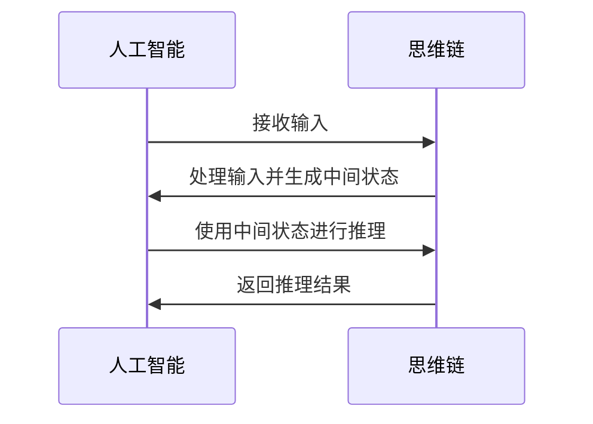
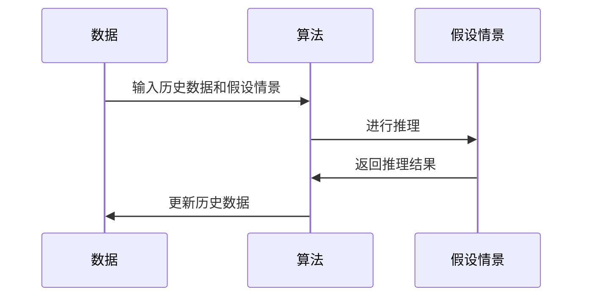

                 

## 第一部分：背景与概念

### 第1章：问题背景与重要性

#### 1.1 问题的背景

反事实历史推理是一种强大的人工智能技术，它允许我们探索如果某个事件发生了，将会导致什么后果。在现实生活中，这种能力有着广泛的应用场景。例如，在医学领域，通过反事实历史推理，医生可以模拟患者接受不同治疗方案后的健康状况，从而为患者提供最优的治疗方案。在金融领域，反事实历史推理可以帮助分析市场变化，预测股票价格波动，从而帮助投资者做出更明智的决策。

#### 1.2 问题描述

反事实历史推理的概念涉及到历史数据和假设情景的结合。具体来说，它是指通过分析已知的历史数据，来推断如果某个事件在历史中发生了，会对后续事件产生什么样的影响。在人工智能领域，反事实历史推理是一种重要的推理技术，它可以帮助AI系统更好地理解现实世界，并在复杂的环境中做出合理的决策。

#### 1.3 问题解决

为了解决反事实历史推理的问题，AI系统需要具备以下几个方面的能力：

1. **数据理解能力**：AI需要能够理解历史数据，包括事件的发生顺序、相关因素等。
2. **假设生成能力**：AI需要能够根据历史数据生成合理的假设情景。
3. **推理能力**：AI需要能够根据假设情景，推理出可能的结果。

#### 1.4 边界与外延

反事实历史推理的适用范围主要是在那些能够通过历史数据进行分析的领域。例如，在医学、金融、交通等领域，由于有大量的历史数据，因此反事实历史推理有着广泛的应用。然而，在那些历史数据缺乏或者无法获取的领域，例如天文学、某些新兴领域，反事实历史推理的应用会受到限制。

#### 1.5 概念结构与核心要素组成

反事实历史推理由以下几个核心要素组成：

1. **历史数据**：这是反事实历史推理的基础，包括事件的发生时间、事件之间的关联等。
2. **假设情景**：这是反事实历史推理的关键，是根据历史数据生成的。
3. **推理算法**：这是反事实历史推理的核心，它负责根据假设情景推理出可能的结果。

#### 1.6 结构图

下面是一个反事实历史推理的ER实体关系图：

```mermaid
erDiagram
  Data ->> Hypothesis : contains
  Hypothesis ->> Algorithm : implements
  Data ||--|{ Algorithm }|-- Algorithm : uses
```

这个图展示了历史数据（Data）、假设情景（Hypothesis）和推理算法（Algorithm）之间的关系。历史数据包含假设情景，而推理算法实现这些假设情景，并使用历史数据进行推理。

### 第2章：AI与反事实推理原理

#### 2.1 AI的基本原理

人工智能（AI）是一门研究如何使计算机模拟人类智能行为的科学。AI的发展经历了几个阶段，从最初的规则推理系统，到基于知识的系统，再到现代的深度学习和神经网络。

**主要算法**：

- **神经网络**：神经网络是一种模拟人脑神经元连接方式的计算模型。它通过调整连接权重来学习数据，从而实现特定的任务。
- **深度学习**：深度学习是神经网络的一种发展，它通过多层神经网络来学习数据，能够处理更复杂的任务。

#### 2.2 反事实推理的数学模型

反事实推理涉及到的数学模型主要包括概率模型和决策树模型。

**数学公式**：

1. **概率模型**：
   $$ P(A|B) = \frac{P(B|A)P(A)}{P(B)} $$
   这个公式表示在事件B发生的条件下，事件A发生的概率。

2. **决策树模型**：
   决策树是一种树形结构，用于表示决策过程。每个内部节点表示一个测试，每个分支表示测试的结果，每个叶子节点表示一个决策结果。

**公式解释**：

- **概率模型**：这个公式是贝叶斯定理的一种形式，它可以帮助我们根据已知条件和概率来推断未知条件。
- **决策树模型**：决策树通过一系列的测试来将数据分为不同的类别，每个测试都基于一定的特征。

#### 2.3 思维链增强的机制

思维链是一种用于增强AI推理能力的机制。它通过在推理过程中引入中间状态和连接，使得推理过程更加连贯和灵活。

**工作原理**：

1. **引入中间状态**：思维链在推理过程中引入中间状态，这些状态代表了推理过程中的不同阶段。
2. **建立连接**：思维链通过建立不同状态之间的连接，使得推理过程可以灵活地在各个状态之间切换。

**Mermaid流程图**：



这个流程图展示了思维链在推理过程中的作用。AI将输入数据传递给思维链，思维链处理输入并生成中间状态，然后AI使用这些中间状态进行推理，最终得到推理结果。

### 第3章：技术实现

#### 3.1 数据准备与预处理

数据准备与预处理是反事实历史推理的重要步骤。在这一步中，我们需要收集与反事实推理相关的数据，并进行清洗和特征提取。

**数据收集**：

1. **历史数据**：收集与反事实推理相关的历史数据，包括事件的发生时间、事件之间的关联等。
2. **假设情景数据**：根据历史数据生成假设情景数据，包括不同假设下的结果。

**数据预处理**：

1. **数据清洗**：清洗数据中的噪声和错误，确保数据质量。
2. **特征提取**：提取数据中的关键特征，以便于后续的推理过程。

#### 3.2 反事实推理算法

反事实推理算法是反事实历史推理的核心。在这一部分，我们将详细讲解反事实推理算法的原理和实现。

**算法原理**：

反事实推理算法基于概率模型和决策树模型，通过分析历史数据和假设情景，推理出可能的结果。

**Mermaid流程图**：



这个流程图展示了反事实推理算法的基本流程。数据输入算法，算法根据假设情景进行推理，并将结果返回给数据。

#### 3.3 思维链的实现

思维链是实现反事实历史推理的关键。在这一部分，我们将介绍如何将思维链融入到反事实推理中。

**实现细节**：

1. **引入思维链**：在反事实推理算法中引入思维链，使其能够处理中间状态。
2. **思维链的更新**：在推理过程中，思维链会不断更新，以适应不同的假设情景。

### 第4章：应用实践

#### 4.1 案例背景

为了更好地理解反事实历史推理的应用，我们来看一个实际的案例。

**案例描述**：假设我们有一个医疗数据集，其中包括患者的历史健康状况和治疗方案。现在我们希望利用反事实历史推理，分析如果患者接受了不同的治疗方案，他们的健康状况会有何变化。

#### 4.2 案例分析

**案例分析**：

1. **数据收集**：收集患者的医疗数据，包括年龄、性别、病史、治疗方案等。
2. **数据预处理**：清洗数据，提取关键特征。
3. **假设生成**：根据历史数据生成不同的假设情景，例如患者接受了不同的治疗方案。
4. **推理过程**：利用反事实推理算法，分析不同假设情景下的结果。
5. **结果对比**：对比不同假设情景下的健康状况，找出最优的治疗方案。

#### 4.3 案例总结

**案例总结**：

通过这个案例，我们可以看到反事实历史推理在医疗领域的应用。它可以帮助医生分析不同治疗方案的效果，从而为患者提供最优的治疗方案。

### 第5章：项目实战

#### 5.1 项目环境搭建

**项目环境搭建**：

1. **软件环境**：安装Python、TensorFlow等。
2. **硬件环境**：配置适当的计算资源。

**环境配置**：

```bash
pip install tensorflow
```

#### 5.2 系统核心实现

**系统核心实现**：

1. **数据准备**：读取医疗数据，进行数据预处理。
2. **算法实现**：实现反事实推理算法。
3. **思维链实现**：引入思维链，增强推理能力。

**代码解读**：

```python
import tensorflow as tf

# 数据准备
def prepare_data(data):
    # 数据清洗和特征提取
    pass

# 算法实现
def inference(data):
    # 实现反事实推理算法
    pass

# 思维链实现
def mind_chain(data):
    # 实现思维链
    pass

# 主函数
def main():
    data = prepare_data()
    result = inference(data)
    mind_chain(result)

if __name__ == "__main__":
    main()
```

#### 5.3 应用解读与分析

**应用解读与分析**：

通过这个项目，我们可以看到如何将反事实历史推理应用于实际问题。在实际应用中，我们需要不断优化算法和思维链，以提高推理的准确性和效率。

### 第6章：最佳实践

#### 6.1 最佳实践技巧

**最佳实践技巧**：

1. **数据质量**：确保数据质量，进行充分的数据清洗和特征提取。
2. **算法优化**：优化算法，提高推理效率。
3. **思维链设计**：合理设计思维链，使其适应不同的应用场景。

#### 6.2 实践总结

**实践总结**：

通过实际项目的实践，我们可以总结出一些最佳实践，以提高反事实历史推理的效果。

### 第7章：小结与展望

#### 7.1 小结

**小结**：

通过本文的探讨，我们深入了解了反事实历史推理的原理、技术实现和应用实践。反事实历史推理是一种强大的人工智能技术，它在多个领域有着广泛的应用前景。

#### 7.2 展望未来

**展望未来**：

随着AI技术的不断发展，反事实历史推理将更加完善和高效。未来，我们可以期待它在更多领域的应用，为人类带来更多的便利。

