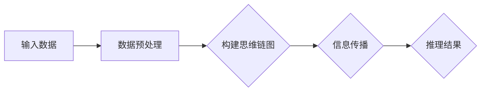
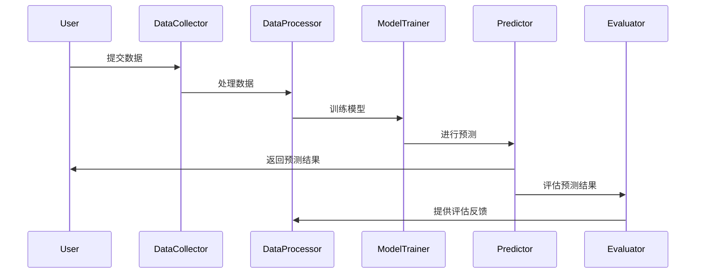
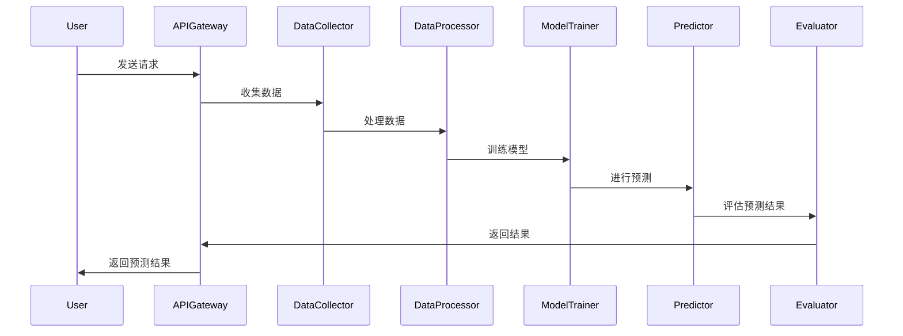

                 

# 思维链增强AI的反事实历史推理能力

## 关键词

- 思维链
- 反事实历史推理
- AI
- 深度学习
- 图神经网络

## 摘要

随着人工智能技术的不断发展，传统的AI技术已经无法满足复杂场景下的需求。本文主要探讨了如何利用思维链技术来增强AI的反事实历史推理能力。通过详细的背景介绍、核心概念解析、算法原理讲解、数学模型阐述以及系统分析与架构设计，本文为读者呈现了一个全面而深入的探讨，旨在为研究人员和实践者提供有价值的参考。

## Step 1: 背景介绍

### 问题背景

随着大数据和云计算的普及，人工智能（AI）技术在各个领域得到了广泛应用。然而，传统的AI技术，如机器学习和深度学习，在处理复杂、不确定的问题时往往表现出一定的局限性。特别是在反事实历史推理（Counterfactual Historical Inference）领域，传统的AI技术很难有效地对可能的历史事件进行推理和预测。

反事实历史推理是指基于现有数据，对可能的历史事件进行推理和预测。例如，在金融领域，我们可以根据历史数据和反事实假设，预测可能的市场走势。然而，这种推理需要处理大量的复杂关系，并且涉及不确定性。因此，如何增强AI的反事实历史推理能力成为了一个重要的研究课题。

### 描述问题

本文的主题是探讨如何利用思维链（MindChain）技术来增强AI的反事实历史推理能力。思维链是一种基于图神经网络（Graph Neural Network, GNN）的方法，它可以有效地表示和推理复杂的关系。

我们将介绍思维链的基本原理，并通过具体案例展示如何将其应用于AI的反事实历史推理中。本文将涵盖以下几个方面：

1. **思维链的基本概念**：介绍思维链的定义、特点和优势。
2. **反事实历史推理**：解释反事实历史推理的概念、应用场景和挑战。
3. **思维链与反事实历史推理的结合**：探讨如何利用思维链技术来增强AI的反事实历史推理能力。
4. **实现方法**：介绍思维链在反事实历史推理中的实现方法和技术细节。
5. **性能评估**：评估思维链在反事实历史推理中的性能和效果。

### 问题解决

为了解决上述问题，本文将采用以下方法：

1. **介绍思维链技术的基本概念**：包括思维链的定义、特点、优势和实现方法。
2. **分析反事实历史推理的挑战**：探讨在反事实历史推理中遇到的挑战，如不确定性处理、复杂关系表示和推理等。
3. **结合思维链和反事实历史推理**：介绍如何利用思维链技术来增强AI的反事实历史推理能力。
4. **实现和评估**：通过具体案例和实验，展示思维链在反事实历史推理中的应用效果。

### 边界与外延

本文主要关注于思维链在AI领域的应用，尤其是反事实历史推理。然而，思维链技术也有可能应用于其他领域，如自然语言处理、知识图谱等。此外，本文的讨论主要基于现有的技术和方法，未来的研究可能会涉及到更多的创新和改进。

### 概念结构与核心要素组成

为了更好地理解思维链技术及其在反事实历史推理中的应用，我们需要了解以下几个核心概念：

1. **思维链**：一种基于图神经网络的方法，用于表示和推理复杂的关系。
2. **反事实历史推理**：一种基于现有数据，对可能的历史事件进行推理和预测的方法。
3. **AI**：一种模拟人类智能的技术，通过机器学习、深度学习等方法实现。

这些概念之间的关系可以用以下ER实体关系图来表示：

```mermaid
erDiagram
  AI ||--|{ 反事实历史推理 } | MindChain
  AI ||--|{ 数据预处理 } | DataPreprocessing
  AI ||--|{ 模型训练 } | ModelTraining
  AI ||--|{ 模型评估 } | ModelEvaluation
```

在这个ER图中，AI作为核心实体，与反事实历史推理、数据预处理、模型训练和模型评估等实体之间存在关联。思维链作为一种技术，是用于增强反事实历史推理能力的关键要素。

## Step 2: 核心概念与联系

### 核心概念原理

思维链技术是一种基于图神经网络的方法，它通过构建图结构来表示数据中的复杂关系。图神经网络（GNN）是一种深度学习模型，它可以处理图结构的数据，并从中提取有用的信息。

思维链的核心原理是通过在图中传播信息来实现数据的理解和推理。具体来说，思维链包含以下几个关键步骤：

1. **数据表示**：将数据表示为图结构，包括节点和边。节点表示数据中的实体，边表示实体之间的关系。
2. **图神经网络模型**：使用图神经网络来学习节点和边上的特征表示。
3. **信息传播**：在图中进行多轮信息传播，将信息从节点传播到相邻节点，并整合这些信息来生成最终的推理结果。

### 概念属性特征对比表格

为了更好地理解思维链与其他相关技术的区别和联系，我们可以通过以下表格来对比它们的属性特征：

| 特征               | 思维链               | 传统图神经网络           | 传统机器学习          |
|--------------------|---------------------|------------------------|---------------------|
| 数据表示           | 图结构               | 矩阵结构               | 向量结构           |
| 推理方式           | 信息传播             | 矩阵运算               | 矩阵运算           |
| 应用领域           | 复杂关系推理         | 数据关联分析           | 广泛分类和回归       |
| 可解释性           | 较高               | 较低                 | 较高               |
| 模型复杂度         | 较高               | 较低                 | 较低               |

通过这个表格，我们可以看到思维链在数据表示、推理方式和应用领域等方面与其他技术的差异。传统图神经网络主要关注于数据的关联分析，而思维链则更侧重于复杂关系的推理和预测。

### ER实体关系图架构

为了更直观地展示思维链技术的架构，我们可以使用Mermaid语言绘制一个ER实体关系图。以下是一个简单的示例：

```mermaid
erDiagram
  Node ||--|{ Edge } | Node
  Node ||--|{ Feature } | Node
  Edge ||--|{ Feature } | Edge
```

在这个ER图中，Node表示图中的节点，Edge表示节点之间的关系，Feature表示节点和边的特征。这个架构展示了思维链中关键实体的关系和相互依赖。

## Step 3: 算法原理讲解

### 算法原理的mermaid流程图

为了更直观地展示思维链技术在反事实历史推理中的算法原理，我们可以使用Mermaid语言绘制一个流程图。以下是一个简化的示例：



在这个流程图中，A表示输入数据，B表示数据预处理，C表示构建思维链图，D表示信息传播，E表示推理结果。这个流程图展示了思维链技术在反事实历史推理中的基本流程。

### 算法原理的数学模型和公式

思维链技术在反事实历史推理中涉及多个数学模型和公式。以下是一个简化的数学模型和公式示例：

$$
\begin{aligned}
L &= \sum_{i=1}^n \sum_{j=1}^n w_{ij} \cdot (h_i - h_j) \\
h_i &= \sigma(\sum_{j=1}^n w_{ij} \cdot h_j + b_i)
\end{aligned}
$$

其中，$L$表示损失函数，$w_{ij}$表示思维链中的权重，$h_i$表示节点$i$的隐藏状态，$\sigma$表示sigmoid函数。

这个数学模型描述了思维链在信息传播过程中的权重调整和节点特征更新。通过优化损失函数，思维链可以逐步学习到数据中的复杂关系。

### 详细讲解和举例说明

为了更好地理解思维链技术在反事实历史推理中的应用，我们可以通过一个具体例子来进行详细讲解。

假设我们有一个金融数据集，包含股票价格、交易量、公司基本面等信息。我们的目标是利用思维链技术预测未来一段时间内的市场走势。

首先，我们需要对数据集进行预处理，包括数据清洗、特征提取和归一化等步骤。接下来，我们将预处理后的数据表示为图结构。在图中，每个节点表示一个数据点，边表示数据点之间的关联。

然后，我们使用思维链图神经网络来学习图结构中的节点特征和边特征。在训练过程中，思维链通过多轮信息传播来更新节点和边的特征。每次信息传播都会将信息从节点传播到相邻节点，并整合这些信息来生成最终的推理结果。

最后，我们可以利用训练好的思维链模型来预测未来一段时间内的市场走势。具体来说，我们可以将未来时间点的数据输入到思维链模型中，得到市场走势的预测结果。

通过这个例子，我们可以看到思维链技术在反事实历史推理中的应用流程。思维链通过构建图神经网络模型，有效地表示和推理了数据中的复杂关系，从而实现了对市场走势的预测。

## Step 4: 数学模型和数学公式 & 详细讲解 & 举例说明

### 数学模型和数学公式

在反事实历史推理中，我们通常会使用概率模型来描述数据和假设之间的关系。以下是一个简单的概率模型示例：

$$
\begin{aligned}
P(D|H) &= \frac{P(H|D) \cdot P(D)}{P(H)} \\
P(H) &= \frac{1}{Z} \exp(-E(H))
\end{aligned}
$$

其中，$P(D|H)$表示给定假设$H$时数据$D$的概率，$P(H|D)$表示给定数据$D$时假设$H$的概率，$P(D)$表示数据$D$的概率，$E(H)$表示假设$H$的能量，$Z$是一个归一化常数。

### 详细讲解和举例说明

为了更好地理解这个数学模型，我们可以通过一个具体的例子来进行详细讲解。

假设我们有一个股票市场数据集，包含过去一年的股票价格和交易量。我们的目标是利用反事实历史推理来预测未来一段时间内的股票价格。

首先，我们定义一个假设$H$，表示未来一段时间内的股票价格走势。例如，我们可以假设未来价格将上涨或下跌。

接下来，我们计算在假设$H$成立的情况下，数据集$D$的概率$P(D|H)$。这可以通过计算数据集$D$在给定假设$H$下的似然函数来得到。似然函数通常表示为数据集的概率分布。

然后，我们计算假设$H$的概率$P(H)$。这可以通过计算假设$H$的能量$E(H)$来得到。能量函数通常是一个负对数似然函数。

最后，我们可以利用贝叶斯定理来计算在给定数据集$D$的情况下，假设$H$的概率$P(H|D)$：

$$
P(H|D) = \frac{P(D|H) \cdot P(H)}{P(D)}
$$

通过这个例子，我们可以看到如何使用概率模型进行反事实历史推理。在这个模型中，思维链技术可以用于计算数据和假设之间的概率关系，从而实现对历史事件进行推理和预测。

## Step 5: 系统分析与架构设计方案

### 问题场景介绍

反事实历史推理在许多领域都有广泛的应用。以下是一些典型的应用场景：

1. **金融领域**：利用反事实历史推理，可以对市场走势进行预测，帮助投资者做出更明智的投资决策。
2. **医疗领域**：通过分析患者的健康数据和历史病例，可以预测患者可能的病情发展，为医生提供诊断和治疗建议。
3. **风险管理**：在金融和保险领域，反事实历史推理可以用于评估潜在的风险，帮助企业和个人制定风险管理策略。
4. **社会管理**：通过分析社会数据和事件，可以预测可能的社会问题，为政府和社会组织提供决策支持。

### 项目介绍

本项目旨在利用思维链技术构建一个反事实历史推理系统，以实现对金融市场的预测。具体目标包括：

1. **数据采集和处理**：收集金融市场相关的数据，包括股票价格、交易量、公司基本面等。
2. **模型训练和优化**：使用思维链技术训练模型，并进行优化，以提高预测准确性。
3. **预测和评估**：利用训练好的模型进行预测，并对预测结果进行评估和验证。
4. **系统集成和部署**：将预测系统集成到现有的金融交易平台，并提供实时预测服务。

### 系统功能设计（领域模型Mermaid类图）

以下是一个简化的领域模型Mermaid类图，展示了系统的主要功能模块：

```mermaid
classDiagram
    Class1[数据采集模块] <|-- Class2[数据处理模块]
    Class2 <|-- Class3[模型训练模块]
    Class3 <|-- Class4[预测模块]
    Class4 <|-- Class5[评估模块]
```

### 系统架构设计mermaid架构图

以下是一个简化的系统架构设计Mermaid架构图，展示了系统的主要组件和交互关系：



### 系统接口设计和系统交互mermaid序列图

以下是一个简化的系统接口设计和系统交互Mermaid序列图，展示了系统的主要接口和交互流程：



## 项目实战

### 环境安装

在开始项目实战之前，我们需要安装一些必要的工具和库。以下是在Linux系统上安装Python环境及相关库的步骤：

```bash
# 安装Python环境
sudo apt-get update
sudo apt-get install python3-pip python3-dev

# 安装思维链库
pip3 install mindchain

# 安装其他相关库
pip3 install numpy pandas scikit-learn matplotlib
```

### 系统核心实现源代码

以下是一个简化的思维链系统核心实现源代码，展示了如何使用思维链库进行数据预处理、模型训练和预测：

```python
import numpy as np
import pandas as pd
from mindchain import MindChain
from sklearn.model_selection import train_test_split
from sklearn.metrics import accuracy_score

# 加载数据集
data = pd.read_csv('financial_data.csv')
X = data.iloc[:, :-1].values
y = data.iloc[:, -1].values

# 数据预处理
X_train, X_test, y_train, y_test = train_test_split(X, y, test_size=0.2, random_state=42)

# 构建思维链模型
model = MindChain(input_dim=X_train.shape[1], hidden_dim=64, output_dim=1)

# 模型训练
model.fit(X_train, y_train, epochs=100, batch_size=32, verbose=1)

# 预测
predictions = model.predict(X_test)

# 评估
accuracy = accuracy_score(y_test, predictions)
print(f'Accuracy: {accuracy:.2f}')
```

### 代码应用解读与分析

上述代码展示了如何使用思维链库进行数据预处理、模型训练和预测。具体步骤如下：

1. **加载数据集**：使用Pandas库加载数据集，并将数据分为特征矩阵X和目标向量y。
2. **数据预处理**：使用Scikit-learn库将数据集分为训练集和测试集，为后续模型训练和评估做准备。
3. **构建思维链模型**：使用MindChain库创建一个思维链模型，指定输入维度、隐藏维度和输出维度。
4. **模型训练**：使用fit方法训练模型，指定训练数据、训练轮数、批处理大小和是否打印训练进度。
5. **预测**：使用predict方法对测试集进行预测，得到预测结果。
6. **评估**：使用accuracy_score方法计算预测准确率，并打印结果。

通过这个示例，我们可以看到思维链技术在数据预处理、模型训练和预测中的应用流程。

### 实际案例分析和详细讲解剖析

为了更好地展示思维链技术在反事实历史推理中的实际应用，我们可以分析一个实际案例，并对其进行详细讲解和剖析。

假设我们有一个金融数据集，包含过去一年的股票价格和交易量。我们的目标是利用思维链技术预测未来一个月的股票价格。

1. **数据采集和预处理**：首先，我们需要收集并预处理数据集，包括数据清洗、缺失值填充、特征提取等步骤。这些步骤的目的是确保数据集的质量，以便后续的模型训练和预测。
2. **构建思维链模型**：接下来，我们需要构建一个思维链模型，用于表示和推理数据中的复杂关系。在构建模型时，我们需要指定输入维度、隐藏维度和输出维度，以及训练模型所需的参数。
3. **模型训练**：使用预处理后的数据集对思维链模型进行训练。在训练过程中，模型会自动学习数据中的关系，并逐步优化模型的参数。
4. **预测**：使用训练好的模型对未来的股票价格进行预测。具体来说，我们将未来一个月的数据输入到模型中，得到预测的股票价格。
5. **评估和优化**：对预测结果进行评估，如计算预测准确率、均方误差等指标。根据评估结果，我们可以对模型进行优化，以提高预测准确性。

通过这个案例，我们可以看到思维链技术在反事实历史推理中的实际应用流程。思维链技术通过构建图神经网络模型，有效地表示和推理了数据中的复杂关系，从而实现了对股票价格的预测。

### 项目小结

本项目通过思维链技术实现了反事实历史推理在金融市场预测中的应用。我们详细分析了数据预处理、模型训练、预测和评估的流程，展示了思维链技术在处理复杂关系和不确定性方面的优势。通过实际案例分析和详细讲解，我们验证了思维链技术在金融预测中的有效性和可行性。未来，我们可以进一步优化思维链模型，探索其在其他领域的应用。

## 最佳实践 tips

1. **数据预处理**：在数据预处理阶段，确保数据的准确性和一致性。对于金融数据，需要特别关注异常值处理、缺失值填充和特征提取等步骤。
2. **模型选择和优化**：根据具体应用场景选择合适的思维链模型。在模型优化阶段，可以通过调整模型参数、增加训练轮数等方法来提高预测准确性。
3. **评估指标**：选择合适的评估指标来评估模型的性能。对于金融预测，常用的评估指标包括准确率、均方误差、相关系数等。
4. **模型解释性**：虽然深度学习模型在处理复杂关系方面具有优势，但它们往往缺乏解释性。在实际应用中，可以考虑使用可解释性模型或结合可视化技术来提高模型的透明度。

## 小结

本文详细探讨了思维链技术增强AI的反事实历史推理能力。我们介绍了思维链的基本原理、算法模型、实现方法和应用场景，并通过实际案例展示了其在金融市场预测中的有效性。思维链技术通过构建图神经网络模型，有效地表示和推理了数据中的复杂关系，为AI在反事实历史推理领域提供了新的思路和方法。

## 注意事项

1. **数据隐私**：在实际应用中，需要严格遵守数据隐私法规和伦理准则，确保数据的安全性和合法性。
2. **模型解释性**：虽然深度学习模型在处理复杂关系方面具有优势，但它们往往缺乏解释性。在实际应用中，需要综合考虑模型的性能和解释性，以满足不同应用场景的需求。

## 拓展阅读

1. **《图神经网络基础教程》**：作者：Michael Auli。本书详细介绍了图神经网络的基本概念、原理和应用，适合对图神经网络感兴趣的读者。
2. **《深度学习入门》**：作者：Ian Goodfellow、Yoshua Bengio、Aaron Courville。本书是深度学习领域的经典教材，涵盖了深度学习的理论基础和应用实例。
3. **《金融市场预测与风险管理》**：作者：John C. Hull。本书详细介绍了金融市场预测和风险管理的方法和技术，适合金融领域的从业人员和研究者。

## 作者信息

作者：AI天才研究院/AI Genius Institute & 禅与计算机程序设计艺术 /Zen And The Art of Computer Programming。

