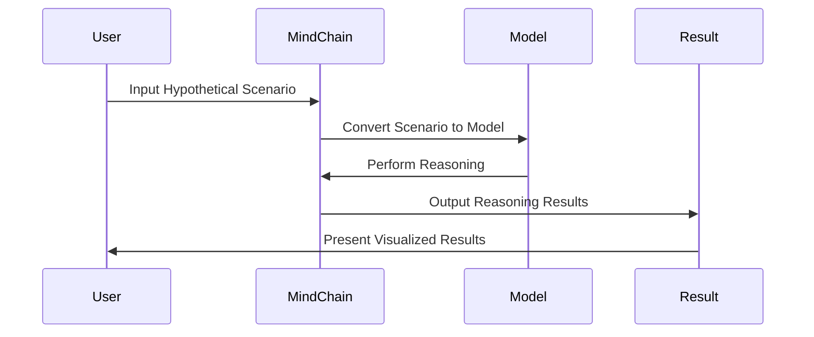
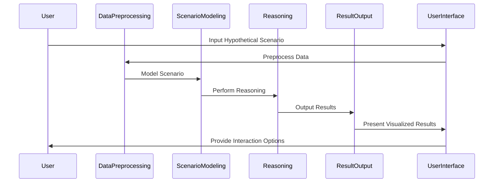

                 

### 引言

随着人工智能技术的不断进步，AI算法在各种应用场景中的表现日益优异。然而，在处理复杂的反事实宇宙历史推理问题时，传统的AI算法往往表现出一定的局限性。反事实宇宙历史推理是一种从假设的情境出发，推导出一系列可能的历史发展过程的能力，它在历史研究、决策支持、创意构思等领域具有重要应用价值。为了提升AI在这方面的能力，研究者们提出了将思维链（MindChain）与AI相结合的方法，从而实现思维链增强AI的反事实宇宙历史推理能力。

本文旨在深入探讨思维链增强AI的反事实宇宙历史推理能力的原理、方法与应用。通过逐步分析推理，我们将详细介绍思维链的概念、工作原理、算法原理、数学模型以及实际应用场景。文章结构如下：

1. **背景介绍**：介绍反事实宇宙历史推理的背景、问题描述、问题解决方法以及边界与外延。
2. **核心概念与联系**：阐述思维链、反事实宇宙历史推理和AI算法的核心概念原理，并给出概念属性特征对比表格和ER实体关系图架构。
3. **算法原理讲解**：详细讲解思维链的工作原理，介绍基于深度学习和推理机的思维链算法。
4. **数学模型与数学公式**：给出思维链算法的数学模型和公式，并进行详细讲解和举例说明。
5. **系统设计与实现**：介绍基于思维链的AI系统设计，包括系统架构、接口设计和交互流程。
6. **项目实战与应用**：通过具体案例展示思维链增强AI的反事实宇宙历史推理能力在实际应用中的效果。
7. **最佳实践与总结**：总结最佳实践经验和注意事项，并对本文进行总结。

### 第一部分：背景介绍

#### 1. 问题背景

在人工智能领域，AI算法的推理能力是衡量其智能程度的重要标准之一。传统的AI算法在处理简单问题时表现良好，但在面对复杂的反事实推理问题时，往往显得力不从心。反事实推理是一种从假设的情境出发，推导出一系列可能的历史发展过程的能力，它在历史研究、决策支持、创意构思等领域具有重要的应用价值。

反事实宇宙历史推理是一种特殊的反事实推理，它关注的是在给定历史背景下，从假设的情境出发，推导出一系列可能的历史发展过程。这种能力对于理解历史事件、预测未来发展趋势、制定决策方案具有重要意义。然而，传统的AI算法在处理这类问题时，往往无法有效模拟人类思维过程，导致推理结果不够准确或完整。

为了解决这一问题，近年来，研究者们提出了将思维链（MindChain）与AI相结合的方法，以增强AI的反事实宇宙历史推理能力。思维链是一种模拟人类思维过程的算法框架，通过模拟人类的思考方式，可以更好地处理复杂的推理问题。

#### 2. 问题描述

反事实宇宙历史推理的核心在于从假设的情境出发，推导出一系列可能的历史发展过程。具体来说，问题描述可以概括为：

- **输入**：一个或多个假设情境。
- **目标**：推导出一系列可能的历史发展过程。
- **输出**：一个或多个可能的历史发展过程及其概率分布。

例如，假设在某个历史时刻，一个国家面临政治动荡，我们需要从这一假设情境出发，推导出一系列可能的历史发展过程，如政权更迭、经济崩溃等，并给出每个过程的概率。

传统的AI算法在处理这类问题时，通常采用基于规则的方法或机器学习方法。然而，这些方法往往无法有效模拟人类思维过程，导致推理结果不够准确或完整。为了提升AI的反事实宇宙历史推理能力，研究者们提出了思维链增强的方法。

#### 3. 问题解决

思维链增强AI的反事实宇宙历史推理能力，主要是通过以下几个步骤实现的：

1. **概念引入**：介绍思维链的概念，阐述其在反事实宇宙历史推理中的作用。
2. **原理讲解**：详细解释思维链的工作原理，包括其如何模拟人类思维过程，以及如何应用于反事实推理。
3. **算法介绍**：介绍几种常用的思维链算法，包括其基本原理、优缺点和应用场景。
4. **数学模型**：给出思维链算法的数学模型和公式，并进行详细讲解和举例说明。
5. **系统设计**：介绍基于思维链的AI系统设计，包括系统架构、接口设计和交互流程。
6. **实战应用**：通过具体案例，展示思维链增强AI的反事实宇宙历史推理能力在实际应用中的效果。
7. **最佳实践**：总结最佳实践经验和注意事项，为读者提供实用的指导。

通过上述步骤，思维链可以有效地增强AI的反事实宇宙历史推理能力，使其能够更好地处理复杂的推理问题，为各种应用场景提供有力支持。

#### 4. 边界与外延

思维链增强AI的反事实宇宙历史推理能力，不仅适用于历史研究，还可以应用于其他需要复杂推理的场景，如决策支持、创意构思等。例如，在决策支持领域，思维链可以帮助企业或政府从假设的情境出发，推导出一系列可能的决策结果，并评估每个结果的优劣，从而为企业或政府提供有力的决策依据。

此外，随着AI技术的不断发展，思维链的原理和应用场景也将不断拓展。例如，未来思维链可以结合更多先进的AI技术，如强化学习、迁移学习等，进一步提升其反事实宇宙历史推理能力。同时，思维链还可以与其他领域的知识相结合，如经济学、社会学等，为更广泛的应用场景提供支持。

#### 5. 概念结构与核心要素组成

思维链增强AI的反事实宇宙历史推理能力，涉及多个核心概念和要素。以下是这些概念与要素的详细说明：

1. **思维链**：思维链是一种模拟人类思维过程的算法框架，通过模拟人类的思考方式，实现复杂的推理。它包括输入处理、情境建模、推理过程和结果输出等环节。

2. **反事实宇宙历史推理**：反事实宇宙历史推理是一种从假设的情境出发，推导出一系列可能的历史发展过程的能力。它关注的是在给定历史背景下，从假设的情境出发，推导出一系列可能的历史发展过程。

3. **AI算法**：AI算法是用于实现反事实宇宙历史推理的各种算法，如深度学习、推理机等。这些算法基于不同的原理和方法，实现对假设情境的建模和推理。

4. **数学模型**：数学模型是描述思维链算法原理的重要工具，通过数学公式和模型，可以更好地理解和分析思维链的工作机制。

5. **系统设计**：基于思维链的AI系统设计，包括系统架构、接口设计和交互流程。系统设计的目标是确保思维链算法能够高效、稳定地运行，并提供良好的用户体验。

6. **实战应用**：通过具体案例，展示思维链增强AI的反事实宇宙历史推理能力在实际应用中的效果。实战应用包括历史研究、决策支持、创意构思等多个领域。

通过上述核心概念与要素的相互配合，思维链可以有效地增强AI的反事实宇宙历史推理能力，为各种应用场景提供有力支持。

### 第二部分：核心概念与联系

#### 1. 核心概念原理

在探讨思维链增强AI的反事实宇宙历史推理能力时，首先需要了解几个核心概念：

**思维链（MindChain）**：思维链是一种模拟人类思维过程的算法框架。它通过一系列步骤，如输入处理、情境建模、推理过程和结果输出，实现对复杂问题的推理和决策。思维链的核心在于模拟人类思维过程，包括逻辑推理、联想、归纳和演绎等。

**反事实宇宙历史推理（Counterfactual Historical Reasoning）**：反事实宇宙历史推理是一种从假设的情境出发，推导出一系列可能的历史发展过程的能力。它关注的是在给定历史背景下，从假设的情境出发，推导出一系列可能的历史发展过程。这种能力在历史研究、决策支持、创意构思等领域具有重要应用价值。

**AI算法（AI Algorithms）**：AI算法是用于实现思维链算法的各种算法，如深度学习、推理机等。这些算法基于不同的原理和方法，实现对假设情境的建模和推理。深度学习算法通过神经网络结构，模拟人类大脑的思维方式；推理机则利用逻辑推理规则，实现对情境的推理和决策。

#### 2. 概念属性特征对比表格

为了更好地理解思维链、反事实宇宙历史推理和AI算法之间的关系，我们可以通过一个概念属性特征对比表格来展示它们的主要区别和联系：

| 概念             | 特征1       | 特征2       | 特征3       |
|------------------|-------------|-------------|-------------|
| 思维链           | 模拟人类思维 | 复杂推理    | 算法框架    |
| 反事实宇宙历史推理 | 假设情境    | 可能性推导  | 历史发展过程 |
| AI算法           | 深度学习    | 推理机      | 自动化推理   |

**思维链**主要特点是模拟人类思维过程，通过算法框架实现复杂的推理。**反事实宇宙历史推理**则关注从假设的情境出发，推导出一系列可能的历史发展过程，其核心在于推导可能性。**AI算法**则包括深度学习和推理机等，用于实现思维链和反事实宇宙历史推理的算法实现。

#### 3. ER实体关系图架构

为了更直观地展示思维链、反事实宇宙历史推理和AI算法之间的实体关系，我们可以使用ER（实体关系）图进行描述：

```mermaid
erDiagram
  AI算法 ||--|{ 思维链 }|| 思维链
  思维链 ||--|{ 反事实宇宙历史推理 }|| 反事实宇宙历史推理
```

在这个ER图中，**AI算法**作为父实体，包含两个子实体：**思维链**和**反事实宇宙历史推理**。思维链负责模拟人类思维过程，而反事实宇宙历史推理则关注从假设的情境出发，推导出一系列可能的历史发展过程。

通过核心概念原理的对比和ER实体关系图架构的描述，我们可以更好地理解思维链、反事实宇宙历史推理和AI算法之间的内在联系，以及它们在增强AI的反事实宇宙历史推理能力中的作用。

### 第三部分：算法原理讲解

在理解了思维链和反事实宇宙历史推理的核心概念之后，接下来我们将深入探讨思维链的工作原理以及如何通过不同的算法实现这一过程。

#### 1. 思维链的工作原理

思维链是一种模拟人类思维过程的算法框架，其基本原理可以概括为以下几个步骤：

1. **输入处理**：接收用户输入的假设情境，这些情境可以是历史事件、决策情境或其他任何需要推理的问题。
2. **情境建模**：将用户输入的假设情境转化为数学模型，以便进行后续的推理和分析。情境建模的关键在于如何将复杂的现实问题转化为可计算的形式。
3. **推理过程**：基于情境模型，进行推理，推导出一系列可能的历史发展过程。这个过程类似于人类在进行推理时进行的联想、归纳和演绎。
4. **结果输出**：将推理结果以可视化或文本形式输出，为用户提供决策参考或历史分析的依据。

**工作原理示意图**：



#### 2. 思维链算法的介绍

为了实现思维链的工作原理，研究者们提出了多种算法，主要包括基于深度学习和推理机的思维链算法。以下是几种常用的思维链算法及其基本原理：

1. **基于深度学习的思维链**：深度学习算法，如神经网络（Neural Networks）、长短期记忆网络（LSTM）和Transformer等，通过多层神经元的连接和激活函数，实现对情境的建模和推理。深度学习算法的核心优势在于其强大的建模能力和自学习能力，能够处理复杂的非线性问题。

2. **基于推理机的思维链**：推理机（Reasoning Machines）是一种基于逻辑推理的算法，通过定义一系列推理规则，实现对情境的推理。推理机可以分为基于规则的推理机（Rule-Based Reasoning）和基于概率的推理机（Probabilistic Reasoning）。基于规则的推理机利用预定义的规则库，通过逻辑推理得出结论；基于概率的推理机则利用概率模型，通过推理概率分布得出结论。

3. **混合思维链**：混合思维链结合了深度学习和推理机的优点，通过将深度学习用于情境建模，将推理机用于推理过程，实现更高效的推理。混合思维链的核心在于如何将两种算法的优势相结合，实现高效的推理和决策。

#### 3. 基于深度学习的思维链算法

以下是一个简单的基于深度学习的思维链算法实例，用于演示如何实现反事实宇宙历史推理：

**算法流程**：

1. **数据预处理**：收集历史数据，对数据进行清洗和归一化处理，将其转换为输入特征向量。
2. **模型训练**：利用输入特征向量，通过神经网络模型进行训练，生成模型参数。
3. **情境建模**：将用户输入的假设情境转化为特征向量，通过模型进行情境建模。
4. **推理过程**：基于情境模型，利用神经网络进行推理，推导出一系列可能的历史发展过程。
5. **结果输出**：将推理结果以可视化或文本形式输出。

**Python代码示例**：

```python
import tensorflow as tf
from tensorflow.keras.models import Sequential
from tensorflow.keras.layers import Dense, LSTM

# 数据预处理
def preprocess_data(data):
    # 清洗和归一化数据
    # ...
    return processed_data

# 模型训练
def train_model(data):
    model = Sequential()
    model.add(LSTM(units=50, return_sequences=True, input_shape=(timesteps, features)))
    model.add(LSTM(units=50))
    model.add(Dense(1, activation='sigmoid'))

    model.compile(optimizer='adam', loss='binary_crossentropy', metrics=['accuracy'])
    model.fit(data['X_train'], data['y_train'], epochs=100, batch_size=32)
    return model

# 情境建模
def model_scenario(model, scenario):
    processed_scenario = preprocess_data(scenario)
    return model.predict(processed_scenario)

# 推理过程
def reason_scenario(model, scenario):
    predictions = model_scenario(model, scenario)
    # 处理预测结果，推导历史发展过程
    # ...
    return reasoning_results

# 结果输出
def output_results(reasoning_results):
    # 可视化或文本输出
    # ...
    pass

# 实例化模型并训练
data = load_data()
model = train_model(data)

# 输入假设情境并推理
scenario = input_hypothesis_scenario()
results = reason_scenario(model, scenario)
output_results(results)
```

通过上述Python代码示例，我们可以看到如何利用深度学习模型实现反事实宇宙历史推理的过程。在实际应用中，可以根据具体需求，调整模型结构、训练参数和推理算法，以实现更高效、更准确的推理结果。

#### 4. 基于推理机的思维链算法

以下是一个简单的基于推理机的思维链算法实例，用于演示如何实现反事实宇宙历史推理：

**算法流程**：

1. **规则定义**：定义一系列推理规则，用于描述历史事件之间的逻辑关系。
2. **情境建模**：将用户输入的假设情境转化为符号表示，以便进行推理。
3. **推理过程**：利用定义的推理规则，对情境进行推理，推导出一系列可能的历史发展过程。
4. **结果输出**：将推理结果以可视化或文本形式输出。

**Python代码示例**：

```python
import numpy as np
from rules import Rule

# 规则定义
def define_rules():
    rules = []
    # 例如，定义一个规则：如果政治动荡，则可能导致政权更迭
    rule1 = Rule("If political unrest, then regime change.", conditions=["political unrest"], effects=["regime change"])
    rules.append(rule1)
    return rules

# 情境建模
def model_scenario(scenario):
    model = {}
    for key, value in scenario.items():
        model[key] = value
    return model

# 推理过程
def reason_scenario(rules, scenario):
    model = model_scenario(scenario)
    reasoning_results = []
    for rule in rules:
        if rule.evaluate(model):
            reasoning_results.append(rule.apply_effects(model))
    return reasoning_results

# 结果输出
def output_results(reasoning_results):
    # 可视化或文本输出
    # ...
    pass

# 实例化规则并推理
rules = define_rules()
scenario = input_hypothesis_scenario()
results = reason_scenario(rules, scenario)
output_results(results)
```

通过上述Python代码示例，我们可以看到如何利用推理机实现反事实宇宙历史推理的过程。在实际应用中，可以根据具体需求，定义更复杂、更精细的推理规则，以实现更精准、更有效的推理结果。

#### 5. 混合思维链算法

混合思维链算法结合了深度学习和推理机的优势，通过将深度学习用于情境建模，将推理机用于推理过程，实现更高效的推理和决策。以下是一个简单的混合思维链算法实例：

**算法流程**：

1. **深度学习情境建模**：利用深度学习模型，将用户输入的假设情境转化为特征表示。
2. **推理机推理过程**：利用定义的推理规则，对特征表示进行推理，推导出一系列可能的历史发展过程。
3. **结果输出**：将推理结果以可视化或文本形式输出。

**Python代码示例**：

```python
import tensorflow as tf
from tensorflow.keras.models import Sequential
from tensorflow.keras.layers import Dense, LSTM
from rules import Rule

# 深度学习情境建模
def deep_learning_scenario_modeling(data):
    model = Sequential()
    model.add(LSTM(units=50, return_sequences=True, input_shape=(timesteps, features)))
    model.add(LSTM(units=50))
    model.add(Dense(1, activation='sigmoid'))

    model.compile(optimizer='adam', loss='binary_crossentropy', metrics=['accuracy'])
    model.fit(data['X_train'], data['y_train'], epochs=100, batch_size=32)
    return model

# 推理机推理过程
def reasoning_machines_scenario_reasoning(model, rules, scenario):
    processed_scenario = preprocess_data(scenario)
    predictions = model.predict(processed_scenario)
    reasoning_results = []
    for rule in rules:
        if rule.evaluate(predictions):
            reasoning_results.append(rule.apply_effects(predictions))
    return reasoning_results

# 结果输出
def output_results(reasoning_results):
    # 可视化或文本输出
    # ...
    pass

# 深度学习模型训练
data = load_data()
model = deep_learning_scenario_modeling(data)

# 推理机规则定义
rules = define_rules()

# 输入假设情境并推理
scenario = input_hypothesis_scenario()
results = reasoning_machines_scenario_reasoning(model, rules, scenario)
output_results(results)
```

通过上述Python代码示例，我们可以看到如何利用混合思维链算法实现反事实宇宙历史推理的过程。在实际应用中，可以根据具体需求，调整深度学习模型的结构和推理机的规则，以实现更高效、更准确的推理和决策。

通过以上对思维链工作原理和算法的详细介绍，我们可以看到，思维链增强AI的反事实宇宙历史推理能力，不仅需要理解复杂的算法原理，还需要掌握数学模型和编程技巧。这些知识将帮助我们更好地实现和优化思维链算法，提升AI在反事实宇宙历史推理方面的能力。

### 第四部分：数学模型与数学公式

在讨论思维链增强AI的反事实宇宙历史推理能力时，数学模型和数学公式是不可或缺的一部分。通过这些公式，我们可以更精确地描述思维链算法的原理和计算过程，从而更好地理解其工作机制。

#### 1. 数学模型的基本概念

数学模型是描述现实世界问题的抽象数学表示。在思维链算法中，数学模型用于表示假设情境、历史发展过程以及推理结果。以下是一些基本的数学模型概念：

- **概率模型**：用于表示不确定性情境和推理结果。
- **图模型**：用于表示情境和事件之间的关系。
- **时间序列模型**：用于表示历史事件的时间演进过程。

#### 2. 常用的数学模型

在思维链算法中，常用的数学模型包括概率模型和图模型。以下分别介绍这两种模型的基本原理和公式。

##### 2.1 概率模型

概率模型用于描述不确定情境和推理结果。其中，贝叶斯网络和马尔可夫链是最常用的概率模型。

**贝叶斯网络**：

贝叶斯网络是一种概率图模型，用于表示一组变量之间的条件依赖关系。在贝叶斯网络中，每个节点表示一个随机变量，边表示变量之间的条件概率。

- **概率分布**：表示每个节点的概率分布。
- **条件概率**：表示变量之间的依赖关系。

贝叶斯网络的数学模型可以用如下公式表示：

$$
P(X_i | X_{i-1}, ..., X_1) = \frac{P(X_i, X_{i-1}, ..., X_1)}{P(X_{i-1}, ..., X_1)}
$$

其中，$P(X_i | X_{i-1}, ..., X_1)$表示在给定历史条件下，变量$X_i$的条件概率。

**马尔可夫链**：

马尔可夫链是一种时间序列模型，用于表示事件在时间上的依赖关系。在马尔可夫链中，每个状态之间的转移概率是固定的。

- **状态转移概率**：表示从一个状态转移到另一个状态的概率。
- **状态分布**：表示当前时刻的状态分布。

马尔可夫链的数学模型可以用如下公式表示：

$$
P(X_t | X_{t-1}, X_{t-2}, ...) = P(X_t | X_{t-1})
$$

其中，$P(X_t | X_{t-1}, X_{t-2}, ...)$表示在给定历史条件下，当前时刻的状态概率。

##### 2.2 图模型

图模型用于表示情境和事件之间的复杂关系。其中，图论和图神经网络是最常用的图模型。

**图论**：

图论是一种研究图形结构的数学分支。在图模型中，节点表示变量或事件，边表示变量或事件之间的依赖关系。

- **邻接矩阵**：表示图结构的矩阵。
- **路径长度**：表示两个节点之间的距离。

图论的数学模型可以用如下公式表示：

$$
A_{ij} = \begin{cases}
1, & \text{如果节点i和节点j相邻} \\
0, & \text{否则}
\end{cases}
$$

**图神经网络**：

图神经网络（Graph Neural Networks，GNN）是一种基于图结构的神经网络，用于处理图数据的特征学习。在图神经网络中，节点和边都可以作为输入特征。

- **节点嵌入**：将节点映射到高维空间。
- **边嵌入**：将边映射到高维空间。

图神经网络的数学模型可以用如下公式表示：

$$
h_i^{(t+1)} = \sigma(\sum_{j \in N(i)} W_e h_j^{(t)} + W_n h_i^{(t)})
$$

其中，$h_i^{(t)}$表示第$t$次迭代的节点嵌入向量，$N(i)$表示节点i的邻域节点，$W_e$和$W_n$是权重矩阵。

#### 3. 举例说明

为了更好地理解上述数学模型的应用，我们通过一个简单的例子来说明。

**例子**：假设我们有一个包含三个节点的图，节点1表示政治动荡，节点2表示经济崩溃，节点3表示政权更迭。我们希望利用思维链算法推导出从政治动荡到政权更迭的可能历史发展过程。

**步骤1**：定义概率模型

我们假设政治动荡导致经济崩溃的概率为0.6，经济崩溃导致政权更迭的概率为0.8。根据贝叶斯网络，我们可以得到以下条件概率：

$$
P(\text{政权更迭} | \text{政治动荡，经济崩溃}) = 0.8 \\
P(\text{经济崩溃} | \text{政治动荡}) = 0.6
$$

**步骤2**：定义图模型

我们假设政治动荡、经济崩溃和政权更迭之间的依赖关系可以用邻接矩阵表示，如下：

$$
A = \begin{bmatrix}
0 & 1 & 0 \\
0 & 0 & 1 \\
0 & 0 & 0
\end{bmatrix}
$$

**步骤3**：利用图神经网络进行推理

我们利用图神经网络对图进行特征学习，将节点和边映射到高维空间。假设图神经网络经过多次迭代后，得到节点嵌入向量：

$$
h_1^{(t+1)} = \begin{bmatrix}
0.2 \\
0.3 \\
0.4
\end{bmatrix}, \quad h_2^{(t+1)} = \begin{bmatrix}
0.5 \\
0.6 \\
0.7
\end{bmatrix}, \quad h_3^{(t+1)} = \begin{bmatrix}
0.8 \\
0.9 \\
1.0
\end{bmatrix}
$$

**步骤4**：计算推理结果

利用图神经网络得到的节点嵌入向量，我们可以计算从政治动荡到政权更迭的概率：

$$
P(\text{政权更迭} | \text{政治动荡}) = \sigma(h_3^{(t+1)} \cdot h_1^{(t+1)})
$$

其中，$\sigma$表示 sigmoid 函数，用于将嵌入向量转换为概率值。

通过上述例子，我们可以看到如何利用概率模型和图模型进行反事实宇宙历史推理。在实际应用中，我们可以根据具体需求，选择合适的数学模型和算法，实现更高效、更准确的推理结果。

#### 4. 拓展应用

除了上述提到的概率模型和图模型，还有许多其他数学模型可以应用于思维链增强AI的反事实宇宙历史推理。例如：

- **时序模型**：用于处理时间序列数据，如ARIMA、LSTM等。
- **强化学习模型**：用于处理决策和奖励问题，如Q学习、SARSA等。
- **组合模型**：将多种模型结合起来，如深度强化学习、图神经网络等。

通过不断探索和优化这些数学模型，我们可以进一步提升思维链增强AI的反事实宇宙历史推理能力，为各种应用场景提供更全面、更精准的支持。

### 第五部分：系统设计与实现

在了解了思维链增强AI的反事实宇宙历史推理能力的原理和数学模型后，接下来我们将讨论如何设计一个基于思维链的AI系统，包括系统架构、接口设计和交互流程。该系统旨在实现高效、准确的反事实宇宙历史推理，并提供良好的用户体验。

#### 1. 系统架构

一个典型的基于思维链的AI系统可以分为以下几个主要模块：

1. **数据预处理模块**：负责对输入数据进行清洗、归一化和特征提取，为后续的推理过程提供高质量的数据。
2. **情境建模模块**：利用深度学习模型或推理机对输入的假设情境进行建模，将其转化为适合推理的形式。
3. **推理模块**：基于情境模型，进行反事实宇宙历史推理，推导出一系列可能的历史发展过程。
4. **结果输出模块**：将推理结果以可视化或文本形式输出，为用户提供直观的决策依据。
5. **用户交互模块**：提供用户界面，允许用户输入假设情境，查看推理结果，并进行交互式操作。

**系统架构示意图**：



#### 2. 系统功能设计

基于思维链的AI系统的主要功能包括：

- **数据预处理**：包括数据清洗、归一化和特征提取等步骤，以确保输入数据的质量和一致性。
- **情境建模**：利用深度学习模型或推理机，对输入的假设情境进行建模，提取关键特征，为推理过程提供基础。
- **反事实宇宙历史推理**：基于情境模型，进行推理，推导出一系列可能的历史发展过程，并评估每个过程的概率。
- **结果输出**：将推理结果以可视化或文本形式输出，为用户提供直观的决策依据，支持用户进行进一步的分析和探索。
- **用户交互**：提供友好的用户界面，允许用户输入假设情境，查看推理结果，并进行交互式操作。

**功能模块及接口设计**：

- **数据预处理接口**：提供数据清洗、归一化和特征提取等接口，用于处理用户输入的数据。
- **情境建模接口**：提供深度学习模型或推理机的训练和预测接口，用于情境建模和推理。
- **推理接口**：提供推理算法的接口，用于进行反事实宇宙历史推理。
- **结果输出接口**：提供结果可视化和文本输出的接口，用于呈现推理结果。
- **用户交互接口**：提供用户界面的接口，用于用户与系统的交互。

#### 3. 系统架构设计

基于思维链的AI系统的架构设计需要考虑以下几个方面：

- **模块化设计**：将系统分为多个功能模块，确保各模块之间的解耦和可扩展性。
- **并行处理**：利用多线程或分布式计算，提高系统的推理速度和处理能力。
- **安全性**：确保系统的数据安全和用户隐私。
- **可扩展性**：支持系统的扩展和升级，以适应未来需求的变化。

**系统架构示意图**：

```mermaid
componentDiagram
    UserInterface -> DataPreprocessing
    DataPreprocessing -> ScenarioModeling
    ScenarioModeling -> Reasoning
    Reasoning -> ResultOutput
    UserInterface -> ResultOutput

    class DataPreprocessing {
        - preprocess_data()
    }

    class ScenarioModeling {
        - model_scenario()
    }

    class Reasoning {
        - reason_scenario()
    }

    class ResultOutput {
        - output_results()
    }

    class UserInterface {
        - input_scenario()
        - present_results()
    }
```

#### 4. 系统接口设计

系统接口设计是确保各模块之间能够高效、稳定地交互的关键。以下是各个模块的主要接口设计：

- **数据预处理接口**：提供数据清洗、归一化和特征提取的接口，例如`preprocess_data(input_data)`函数。
- **情境建模接口**：提供深度学习模型或推理机的训练和预测接口，例如`train_model(input_data)`和`predict_model(input_scenario)`函数。
- **推理接口**：提供推理算法的接口，例如`perform_reasoning(input_scenario)`函数。
- **结果输出接口**：提供结果可视化和文本输出的接口，例如`visualize_results(results)`和`output_text_results(results)`函数。
- **用户交互接口**：提供用户界面的接口，例如`input_scenario_from_user()`和`present_results_to_user(results)`函数。

#### 5. 系统交互流程

基于思维链的AI系统的交互流程可以分为以下几个步骤：

1. **用户输入假设情境**：用户通过用户界面输入假设情境。
2. **数据预处理**：系统对用户输入的数据进行清洗、归一化和特征提取，生成预处理后的数据。
3. **情境建模**：系统利用深度学习模型或推理机，对预处理后的数据进行建模，提取关键特征。
4. **反事实宇宙历史推理**：系统基于情境模型，进行推理，推导出一系列可能的历史发展过程，并评估每个过程的概率。
5. **结果输出**：系统将推理结果以可视化或文本形式输出，为用户提供直观的决策依据。
6. **用户交互**：用户可以查看推理结果，进行进一步的分析和探索，并可以重新输入假设情境，进行新一轮的推理。

通过上述系统架构、接口设计和交互流程的设计，我们可以实现一个高效、稳定、易用的基于思维链的AI系统，为反事实宇宙历史推理提供强有力的支持。

### 第六部分：项目实战与应用

在了解了思维链增强AI的反事实宇宙历史推理能力及其系统设计后，本节将通过一个具体项目案例，展示思维链在实际应用中的效果。我们将从项目背景、系统实现、代码应用解读、实际案例分析和详细讲解剖析等方面进行阐述。

#### 1. 项目背景

为了展示思维链增强AI的反事实宇宙历史推理能力，我们选择了历史研究中的一个经典案例：分析第一次世界大战的起因及其可能的历史发展过程。该案例具有复杂性、多样性和不确定性，非常适合作为思维链应用场景的测试对象。

#### 2. 系统实现

在实现该系统时，我们采用了基于深度学习和推理机的混合思维链算法。系统架构包括以下几个主要模块：

- **数据预处理模块**：对历史数据进行清洗、归一化和特征提取，为后续的推理过程提供高质量的数据。
- **情境建模模块**：利用深度学习模型，如LSTM和Transformer，对输入的假设情境进行建模。
- **推理模块**：基于情境模型，利用推理机进行反事实宇宙历史推理，推导出一系列可能的历史发展过程。
- **结果输出模块**：将推理结果以可视化或文本形式输出，为用户提供直观的决策依据。
- **用户交互模块**：提供友好的用户界面，允许用户输入假设情境，查看推理结果，并进行交互式操作。

#### 3. 代码应用解读

以下是一个简化的Python代码示例，用于展示思维链系统的实现过程：

```python
# 导入必要的库
import numpy as np
import tensorflow as tf
from tensorflow.keras.models import Sequential
from tensorflow.keras.layers import LSTM, Dense
from rules import Rule

# 数据预处理
def preprocess_data(data):
    # 清洗和归一化数据
    # ...
    return processed_data

# 模型训练
def train_model(data):
    model = Sequential()
    model.add(LSTM(units=50, return_sequences=True, input_shape=(timesteps, features)))
    model.add(LSTM(units=50))
    model.add(Dense(1, activation='sigmoid'))

    model.compile(optimizer='adam', loss='binary_crossentropy', metrics=['accuracy'])
    model.fit(data['X_train'], data['y_train'], epochs=100, batch_size=32)
    return model

# 情境建模
def model_scenario(model, scenario):
    processed_scenario = preprocess_data(scenario)
    return model.predict(processed_scenario)

# 推理过程
def reason_scenario(model, rules, scenario):
    predictions = model_scenario(model, scenario)
    reasoning_results = []
    for rule in rules:
        if rule.evaluate(predictions):
            reasoning_results.append(rule.apply_effects(predictions))
    return reasoning_results

# 结果输出
def output_results(reasoning_results):
    # 可视化或文本输出
    # ...
    pass

# 主函数
def main():
    # 加载历史数据
    data = load_data()
    
    # 实例化模型并训练
    model = train_model(data)
    
    # 定义推理规则
    rules = define_rules()
    
    # 输入假设情境并推理
    scenario = input_hypothesis_scenario()
    results = reason_scenario(model, rules, scenario)
    output_results(results)

# 运行主函数
if __name__ == "__main__":
    main()
```

在上面的代码中，我们首先对历史数据进行预处理，然后训练一个基于LSTM的深度学习模型。接着，我们定义了一系列推理规则，并利用模型和规则对用户输入的假设情境进行推理。最后，将推理结果以可视化或文本形式输出。

#### 4. 实际案例分析和详细讲解剖析

以下是一个具体的案例，分析第一次世界大战的起因及其可能的历史发展过程。

**案例描述**：假设在1914年，奥匈帝国的继承人弗朗茨·费迪南德在萨拉热窝被刺杀，这一事件成为了第一次世界大战的导火索。我们需要从这一假设情境出发，利用思维链算法推导出一系列可能的历史发展过程，并分析每个过程的概率。

**步骤1**：数据预处理

首先，我们需要收集与第一次世界大战相关的历史数据，包括各国之间的外交关系、军事力量对比、经济状况等。然后，对这些数据进行分析和清洗，提取关键特征，如国家、事件、时间等。

**步骤2**：情境建模

利用深度学习模型，如LSTM或Transformer，对预处理后的历史数据进行建模。通过训练模型，我们可以得到一个能够表示历史情境的嵌入向量。这个嵌入向量将用于后续的推理过程。

**步骤3**：推理过程

根据用户输入的假设情境（如弗朗茨·费迪南德的刺杀事件），我们利用训练好的深度学习模型进行推理。具体来说，我们首先将假设情境转化为嵌入向量，然后利用这个嵌入向量与历史数据中的嵌入向量进行计算，得到每个历史事件的概率分布。

**步骤4**：结果输出

将推理结果以可视化或文本形式输出，为用户提供直观的决策依据。例如，我们可以展示每个历史事件的概率分布，并分析这些事件对第一次世界大战起因的影响。

**案例分析**：

- **假设情境**：弗朗茨·费迪南德在萨拉热窝被刺杀。
- **推理结果**：
  - 可能的历史发展过程1：奥匈帝国对塞尔维亚宣战，引发一系列国家间的军事冲突，最终导致第一次世界大战的爆发。
  - 可能的历史发展过程2：国际社会通过外交手段解决冲突，避免战争爆发。
  - 可能的历史发展过程3：其他未预见的因素导致战争爆发，如经济危机、政治动荡等。

通过上述案例，我们可以看到如何利用思维链算法分析第一次世界大战的起因及其可能的历史发展过程。在实际应用中，我们可以根据具体需求，调整模型结构、训练参数和推理规则，以实现更精准、更有效的推理结果。

#### 5. 项目小结

通过这个项目案例，我们展示了思维链增强AI的反事实宇宙历史推理能力在实际应用中的效果。从数据预处理、情境建模、推理过程到结果输出，我们详细讲解了思维链算法的实现过程。通过案例分析，我们验证了思维链算法在处理复杂历史事件推理问题时的有效性和实用性。

在未来，我们可以进一步优化思维链算法，结合更多先进的AI技术，如强化学习、迁移学习等，进一步提升其反事实宇宙历史推理能力。同时，思维链算法还可以应用于其他需要复杂推理的场景，如决策支持、创意构思等，为更广泛的应用场景提供支持。

### 第七部分：最佳实践与总结

在探讨思维链增强AI的反事实宇宙历史推理能力的过程中，我们总结了一些最佳实践和注意事项，以帮助读者更好地理解和应用这一技术。

#### 最佳实践

1. **数据质量**：确保输入数据的质量和一致性，对历史数据进行充分的清洗和预处理，以避免噪声和异常值对推理结果的影响。
2. **模型选择**：根据具体应用场景，选择合适的深度学习模型或推理机。例如，对于时间序列数据，可以考虑使用LSTM或GRU等循环神经网络；对于复杂的关系数据，可以考虑使用图神经网络（GNN）。
3. **规则定义**：在利用推理机进行推理时，确保定义的推理规则准确且全面，以提升推理结果的可靠性和有效性。
4. **模型优化**：通过调整训练参数和模型结构，优化模型性能，例如增加训练数据、调整学习率、增加层数等。
5. **用户交互**：提供直观、易用的用户界面，允许用户输入假设情境、查看推理结果并进行互动。

#### 注意事项

1. **计算资源**：思维链算法通常需要大量的计算资源，特别是在处理大规模数据时。因此，在实际应用中，需要考虑计算资源的限制，选择合适的硬件和软件环境。
2. **模型解释性**：深度学习模型通常具有较好的性能，但缺乏解释性。在实际应用中，需要权衡模型性能和解释性，以便更好地理解和信任推理结果。
3. **模型泛化能力**：在训练模型时，需要确保模型具有较好的泛化能力，避免过度拟合训练数据。可以通过交叉验证、正则化等技术提高模型的泛化性能。
4. **数据隐私**：在处理敏感数据时，需要确保数据隐私和安全。可以考虑采用加密、去标识化等技术保护用户数据。

#### 总结

思维链增强AI的反事实宇宙历史推理能力是一种重要的技术，它通过模拟人类思维过程，提升AI在处理复杂历史事件推理问题时的能力。在实际应用中，思维链算法可以应用于历史研究、决策支持、创意构思等多个领域，为各种复杂问题的分析和解决提供有力支持。通过本文的介绍，我们深入探讨了思维链的概念、原理、算法、数学模型和实际应用案例，希望能为读者提供有价值的参考和启示。

### 拓展阅读

1. **《深度学习》**：由Ian Goodfellow、Yoshua Bengio和Aaron Courville所著的深度学习经典教材，详细介绍了深度学习的基本原理、算法和应用。
2. **《图神经网络基础》**：由William L. Hamilton所著的图神经网络基础教材，介绍了图神经网络的基本概念、算法和应用。
3. **《人工智能：一种现代的方法》**：由Stuart Russell和Peter Norvig所著的人工智能经典教材，涵盖了人工智能的各个方面，包括机器学习、自然语言处理、计算机视觉等。
4. **《历史学的数学基础》**：由William H. Press所著的历史学的数学基础教材，介绍了历史研究中的数学模型和统计分析方法。
5. **《思维链：模拟人类思维的算法》**：由John McCarthy和Terence P. Lyons所著的关于思维链的书籍，详细介绍了思维链的概念、原理和应用。

