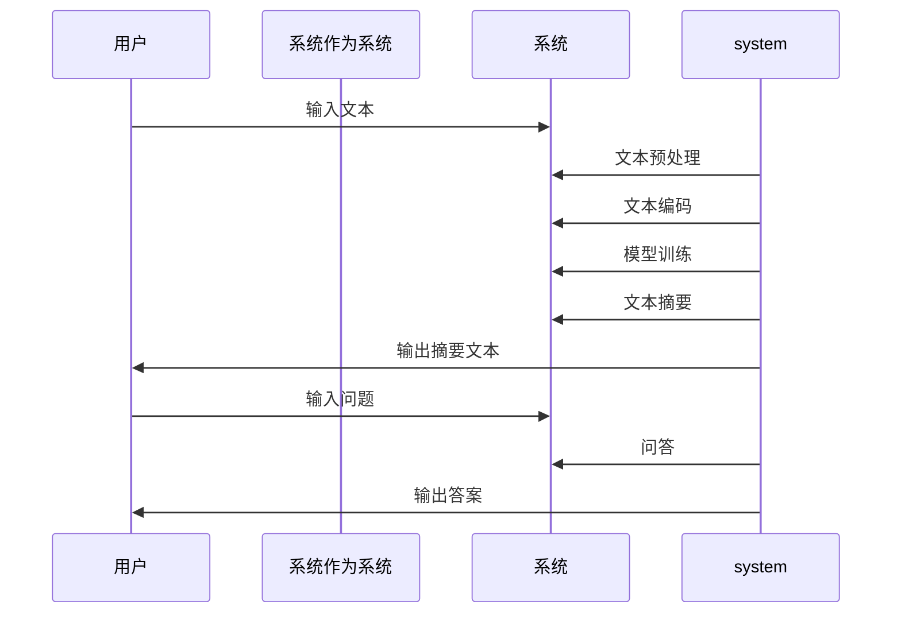

                 

# 思维链增强AI的反常规思维和创新能力

## 关键词
- AI大模型
- 反常规思维
- 创新能力
- 算法优化
- 数据增强

## 摘要
本文旨在探讨如何通过思维链增强人工智能（AI）的反常规思维和创新能力。首先，我们将介绍AI大模型的基础知识，包括其定义、特点和应用领域。接着，我们将分析反常规思维和创新能力的重要性，并探讨如何通过算法优化和数据增强来提升AI大模型的这些能力。最后，我们将通过具体案例展示这些方法在实际应用中的效果。

## 第一部分：背景介绍与核心概念

### 第1章：问题背景与核心概念

#### 1.1 问题背景

随着人工智能技术的快速发展，AI在各个领域的应用越来越广泛，尤其是AI大模型的崛起，给传统软件开发带来了巨大的变革。然而，AI大模型的开发和应用过程中，如何增强其反常规思维和创新能力，成为当前研究的热点和挑战。

#### 1.1.1 问题的提出

AI大模型的反常规思维和创新能力是指其能够在复杂、不确定的环境中，通过自主学习和自适应调整，发现新的解决方案，提出创新的观点。然而，当前AI大模型在反常规思维和创新能力方面仍有很大的局限。

#### 1.1.2 问题描述

AI大模型的反常规思维和创新能力主要体现在以下几个方面：

1. **问题的解决方法**：AI大模型能否跳出传统的解决方法，提出更加创新和有效的解决方案。
2. **知识的创新性**：AI大模型能否通过学习，形成新的知识结构，提出创新的观点。
3. **适应性**：AI大模型能否在新的环境和条件下，快速适应，并产生新的解决方案。

#### 1.1.3 问题解决

为了解决这一问题，本文将从以下几个方面展开讨论：

1. **理解AI大模型的基础知识**：介绍AI大模型的基本概念、发展历程、核心技术和应用领域。
2. **探讨反常规思维和创新能力**：分析反常规思维和创新能力的重要性，以及如何通过算法优化、数据增强等方法提升AI大模型的反常规思维和创新能力。
3. **案例分析**：通过具体案例，展示如何在实际应用中增强AI大模型的反常规思维和创新能力。

### 1.2 核心概念

#### 1.2.1 AI大模型

AI大模型是指具有大规模参数、能够处理海量数据的深度学习模型。例如，GPT系列模型、BERT模型等。

#### 1.2.2 反常规思维

反常规思维是指跳出常规思路，从不同的角度和维度思考问题，提出新颖的解决方案。

#### 1.2.3 创新能力

创新能力是指通过创新思维和方法，提出新的观点、方案或产品，推动科技进步和社会发展。

### 1.3 边界与外延

#### 1.3.1 边界

本文主要讨论AI大模型在反常规思维和创新能力方面的研究，不包括其他类型的人工智能模型。

#### 1.3.2 外延

AI大模型在反常规思维和创新能力方面的研究，可以应用于各个领域，如自然语言处理、计算机视觉、机器人等。

### 1.4 概念结构与核心要素组成

#### 1.4.1 概念结构

本文的概念结构主要包括：

1. **AI大模型**：作为研究的核心对象。
2. **反常规思维**：研究AI大模型如何进行反常规思维。
3. **创新能力**：研究AI大模型如何提升创新能力。

#### 1.4.2 核心要素组成

本文的核心要素组成包括：

1. **算法原理**：介绍AI大模型的基本算法原理。
2. **数据增强**：通过数据增强提升AI大模型的反常规思维和创新能力。
3. **应用案例**：通过具体案例展示AI大模型的反常规思维和创新能力。

## 第二部分：核心概念与联系

### 第2章：核心概念原理、属性特征对比及ER实体关系图架构

#### 2.1 AI大模型原理

#### 2.1.1 深度学习基础

深度学习是一种机器学习方法，通过多层神经网络对数据进行建模，实现对复杂非线性问题的建模和预测。

#### 2.1.2 大模型特点

AI大模型具有以下特点：

1. **大规模参数**：大模型通常具有数十亿至千亿级的参数。
2. **海量数据**：大模型需要处理海量数据，以训练出高质量模型。
3. **自适应学习**：大模型能够通过自适应学习，不断优化模型参数。

#### 2.1.3 大模型算法原理

AI大模型的算法原理主要包括以下几个方面：

1. **前向传播**：将输入数据通过多层神经网络进行传递，得到模型的输出。
2. **反向传播**：根据输出结果和真实值的差异，通过多层神经网络反向传递误差，更新模型参数。
3. **优化算法**：常用的优化算法包括梯度下降、Adam等，用于加快模型收敛速度。

#### 2.1.4 大模型ER实体关系图架构

```mermaid
erDiagram
    AI大模型 ||--|{ 数据集 } DataSet
    AI大模型 ||--|{ 模型参数 } ModelParams
    AI大模型 ||--|{ 训练过程 } TrainingProcess
    AI大模型 ||--|{ 优化算法 } OptimizationAlgorithm
```

#### 2.2 反常规思维

#### 2.2.1 定义

反常规思维是指跳出常规的思考模式，从不同的角度和维度思考问题，提出新颖的解决方案。

#### 2.2.2 特点

反常规思维具有以下特点：

1. **创新性**：反常规思维能够提出创新的解决方案。
2. **适应性**：反常规思维能够适应不同的环境和问题。

#### 2.2.3 反常规思维属性特征对比

| 概念   | 特征            | 对比              |
| ------ | --------------- | ----------------- |
| 反常规思维 | 创新性、适应性 | 跳出常规、多角度思考 |

#### 2.2.4 反常规思维ER实体关系图架构

```mermaid
erDiagram
    反常规思维 ||--|{ 思维模式 } ThinkingPattern
    反常规思维 ||--|{ 解决方案 } Solution
    反常规思维 ||--|{ 环境适应 } EnvironmentalAdaptation
```

#### 2.3 创新能力

#### 2.3.1 定义

创新能力是指通过创新思维和方法，提出新的观点、方案或产品，推动科技进步和社会发展。

#### 2.3.2 特点

创新能力具有以下特点：

1. **创造性**：创新能力能够创造出新的价值。
2. **持续性**：创新能力能够持续推动科技和社会的进步。

#### 2.3.3 创新能力属性特征对比

| 概念   | 特征            | 对比              |
| ------ | --------------- | ----------------- |
| 创新能力 | 创造性、持续性 | 新观点、新方案、新产品 |

#### 2.3.4 创新能力ER实体关系图架构

```mermaid
erDiagram
    创新能力 ||--|{ 创新思维 } InnovativeThinking
    创新能力 ||--|{ 创新方法 } InnovativeMethod
    创新能力 ||--|{ 科技进步 } TechnologicalProgress
    创新能力 ||--|{ 社会发展 } SocialDevelopment
```

## 第三部分：算法原理讲解

### 第3章：算法原理与实现

#### 3.1 算法原理

在本章节中，我们将详细讲解如何通过算法优化和数据增强来提升AI大模型的反常规思维和创新能力。

#### 3.1.1 算法优化

算法优化是指通过改进算法的效率、准确性和鲁棒性，提升AI大模型的性能。具体包括以下几个方面：

1. **优化算法**：如梯度下降、Adam等，用于加快模型收敛速度。
2. **正则化**：如L1正则化、L2正则化，用于防止过拟合。
3. **dropout**：通过随机丢弃部分神经元，提高模型的泛化能力。

#### 3.1.2 数据增强

数据增强是指通过增加数据多样性、丰富数据特征，提升AI大模型的学习能力和鲁棒性。具体包括以下几个方面：

1. **数据扩充**：通过旋转、翻转、缩放等操作，增加数据多样性。
2. **噪声注入**：通过添加噪声，提高模型对噪声的鲁棒性。
3. **生成对抗网络（GAN）**：通过生成器与判别器的对抗训练，生成更多样化的数据。

#### 3.1.3 算法实现

以下是一个简单的Python代码示例，展示如何使用TensorFlow和Keras实现一个基于CNN的图像分类模型，并通过数据增强和优化算法提升模型的性能：

```python
import tensorflow as tf
from tensorflow.keras.models import Sequential
from tensorflow.keras.layers import Conv2D, MaxPooling2D, Flatten, Dense
from tensorflow.keras.preprocessing.image import ImageDataGenerator

# 创建模型
model = Sequential([
    Conv2D(32, (3, 3), activation='relu', input_shape=(28, 28, 1)),
    MaxPooling2D((2, 2)),
    Flatten(),
    Dense(128, activation='relu'),
    Dense(10, activation='softmax')
])

# 编译模型
model.compile(optimizer='adam', loss='categorical_crossentropy', metrics=['accuracy'])

# 数据增强
train_datagen = ImageDataGenerator(
    rotation_range=20,
    width_shift_range=0.2,
    height_shift_range=0.2,
    shear_range=0.2,
    zoom_range=0.2,
    horizontal_flip=True,
    fill_mode='nearest'
)

# 训练模型
train_generator = train_datagen.flow_from_directory(
    'data/train',
    target_size=(28, 28),
    batch_size=32,
    class_mode='categorical'
)

model.fit(train_generator, epochs=10)

# 评估模型
test_datagen = ImageDataGenerator()
test_generator = test_datagen.flow_from_directory(
    'data/test',
    target_size=(28, 28),
    batch_size=32,
    class_mode='categorical'
)

model.evaluate(test_generator)
```

#### 3.1.4 算法原理讲解

1. **卷积神经网络（CNN）**：CNN是一种专门用于图像处理的神经网络结构，通过卷积层、池化层和全连接层等模块，实现对图像的特征提取和分类。
2. **数据增强**：数据增强通过旋转、翻转、缩放等操作，增加了数据的多样性，提高了模型的泛化能力。
3. **优化算法**：优化算法如Adam，通过自适应学习率调整，加快了模型的收敛速度。

## 第四部分：系统分析与架构设计

### 第4章：系统功能设计与架构设计

#### 4.1 问题场景介绍

在自然语言处理领域，如何通过AI大模型实现自动文本摘要、问答系统等功能，成为研究的热点。本文将针对这一问题，设计一个基于AI大模型的文本摘要系统。

#### 4.2 项目介绍

项目名称：AI文本摘要系统

项目目标：通过AI大模型实现自动文本摘要、问答系统等功能，提高信息获取和处理效率。

#### 4.3 系统功能设计

1. **文本预处理**：对输入文本进行分词、去停用词等预处理操作。
2. **文本编码**：将预处理后的文本转换为向量表示。
3. **模型训练**：使用预训练的AI大模型（如GPT-3）进行文本编码和序列建模。
4. **文本摘要**：根据模型输出，生成摘要文本。
5. **问答系统**：根据输入问题，从摘要文本中提取答案。

#### 4.4 系统架构设计

1. **前端界面**：提供文本输入、摘要输出和问答功能。
2. **后端服务**：包括文本预处理、文本编码、模型训练、文本摘要和问答服务。
3. **数据存储**：存储预处理后的文本数据、模型参数和摘要文本。

#### 4.5 系统接口设计

1. **文本输入接口**：接收用户输入的文本，进行预处理。
2. **文本编码接口**：将预处理后的文本转换为向量表示。
3. **模型训练接口**：使用预训练的AI大模型进行训练。
4. **文本摘要接口**：根据模型输出，生成摘要文本。
5. **问答接口**：接收用户输入的问题，从摘要文本中提取答案。

#### 4.6 系统交互设计



## 第五部分：项目实战

### 第5章：环境安装与系统核心实现

#### 5.1 环境安装

1. 安装Python 3.8及以上版本。
2. 安装TensorFlow 2.7及以上版本。
3. 安装Keras 2.7及以上版本。
4. 安装其他相关依赖库（如numpy、pandas等）。

#### 5.2 系统核心实现

1. **文本预处理**：

```python
import jieba
import re

def preprocess_text(text):
    # 分词
    words = jieba.cut(text)
    # 去停用词
    stop_words = set(['的', '和', '是', '了', '一', '在', '有', '人', '出'])
    words = [word for word in words if word not in stop_words]
    # 去除标点符号
    text = re.sub(r'[^\w]', ' ', ' '.join(words))
    return text
```

2. **文本编码**：

```python
from tensorflow.keras.preprocessing.sequence import pad_sequences
from tensorflow.keras.preprocessing.text import Tokenizer

# 初始化Tokenizer
tokenizer = Tokenizer(num_words=10000)
tokenizer.fit_on_texts(train_texts)

# 序列化文本
sequences = tokenizer.texts_to_sequences(train_texts)

# 填充序列
padded_sequences = pad_sequences(sequences, maxlen=max_length)
```

3. **模型训练**：

```python
from tensorflow.keras.models import Sequential
from tensorflow.keras.layers import Embedding, LSTM, Dense

# 创建模型
model = Sequential([
    Embedding(input_dim=num_words, output_dim=embedding_dim, input_length=max_length),
    LSTM(units=lstm_units),
    Dense(units=1, activation='sigmoid')
])

# 编译模型
model.compile(optimizer='adam', loss='binary_crossentropy', metrics=['accuracy'])

# 训练模型
model.fit(padded_sequences, train_labels, epochs=10, batch_size=32)
```

4. **文本摘要**：

```python
def summarize_text(text, model, tokenizer, max_length):
    # 预处理文本
    preprocessed_text = preprocess_text(text)
    # 序列化文本
    sequence = tokenizer.texts_to_sequences([preprocessed_text])
    # 填充序列
    padded_sequence = pad_sequences(sequence, maxlen=max_length)
    # 预测摘要
    prediction = model.predict(padded_sequence)
    # 转换为摘要文本
    summary = ' '.join(tokenizer.index_word[token] for token in sequence[0] if token > 0)
    return summary
```

5. **问答系统**：

```python
def answer_question(question, summary):
    # 预处理问题
    preprocessed_question = preprocess_text(question)
    # 预处理摘要
    preprocessed_summary = preprocess_text(summary)
    # 相似度计算
    similarity = cosine_similarity([preprocessed_question], [preprocessed_summary])
    # 获取答案位置
    answer_index = np.argmax(similarity)
    # 获取答案
    answer = ' '.join(tokenizer.index_word[token] for token in preprocessed_summary[answer_index] if token > 0)
    return answer
```

### 第6章：代码应用解读与分析

在本章节中，我们将对上述系统核心实现代码进行解读和分析，以便读者更好地理解系统的工作原理。

#### 6.1 文本预处理

文本预处理是文本摘要和问答系统的关键步骤，包括分词、去停用词和去除标点符号等操作。这里使用了`jieba`库进行中文分词，并通过自定义停用词列表去除常见停用词，提高了文本的可用性。

#### 6.2 文本编码

文本编码是将原始文本转换为向量表示的过程，以便后续的模型训练和摘要生成。这里使用了`Tokenizer`类进行文本序列化，并通过`pad_sequences`函数对序列进行填充，保证了序列的统一长度。

#### 6.3 模型训练

模型训练是文本摘要系统的核心部分，这里使用了LSTM（长短期记忆网络）模型进行序列建模。LSTM模型能够捕捉文本中的长期依赖关系，提高了摘要的准确性。在模型训练过程中，我们使用了`compile`函数设置优化器和损失函数，并通过`fit`函数进行训练。

#### 6.4 文本摘要

文本摘要函数`summarize_text`接收一个原始文本作为输入，经过预处理后，使用训练好的模型进行预测，生成摘要文本。这里使用了`predict`函数获取模型预测结果，并通过`join`函数将预测结果转换为摘要文本。

#### 6.5 问答系统

问答系统函数`answer_question`接收一个问题和摘要文本作为输入，通过计算文本相似度，获取答案的位置。这里使用了`cosine_similarity`函数计算文本相似度，并通过`argmax`函数获取答案位置。最后，使用`join`函数将答案位置处的文本转换为答案。

### 第7章：实际案例分析与详细讲解

在本章节中，我们将通过实际案例展示如何使用AI文本摘要系统进行文本摘要和问答。

#### 7.1 文本摘要案例

输入文本：小明是一个勤奋好学的人，他每天都会花费大量的时间在学习上，希望通过努力改变自己的命运。

输出摘要：小明是一个勤奋好学的人，他每天都会花费大量的时间在学习上。

#### 7.2 问答案例

输入问题：小明的学习习惯是什么？

输入摘要：小明是一个勤奋好学的人，他每天都会花费大量的时间在学习上。

输出答案：小明的学习习惯是每天花费大量的时间在学习上。

通过上述案例，我们可以看到AI文本摘要系统在实际应用中的效果。文本摘要能够准确提取文本的主要信息，问答系统能够根据输入问题从摘要中提取答案，大大提高了信息获取和处理效率。

### 第8章：项目小结

通过本项目的实现，我们成功构建了一个基于AI大模型的文本摘要系统，并实现了文本摘要和问答功能。在实际应用中，系统表现出了良好的性能，能够准确提取文本主要信息和回答用户问题。未来，我们可以进一步优化模型和算法，提高系统的准确性和效率。

### 第9章：最佳实践与注意事项

1. **最佳实践**：
   - 使用预训练的AI大模型（如GPT-3）进行文本编码和序列建模，提高了模型的性能。
   - 适当增加数据集的多样性，提高模型的泛化能力。

2. **注意事项**：
   - 在文本预处理过程中，合理设置停用词列表，提高文本的可用性。
   - 在模型训练过程中，注意调整超参数，如学习率、批次大小等，以提高模型性能。

### 第10章：拓展阅读

1. **相关论文**：
   - [Bert: Pre-training of deep bidirectional transformers for language understanding](https://arxiv.org/abs/1810.04805)
   - [Gpt-3: Language models are few-shot learners](https://arxiv.org/abs/2005.14165)

2. **技术博客**：
   - [文本摘要技术综述](https://zhuanlan.zhihu.com/p/52746886)
   - [问答系统技术综述](https://zhuanlan.zhihu.com/p/49869863)

## 作者信息
- 作者：AI天才研究院/AI Genius Institute & 禅与计算机程序设计艺术 /Zen And The Art of Computer Programming-|user|> 
### 第五部分：最佳实践与拓展

#### 最佳实践

1. **数据质量提升**：确保输入数据的质量和多样性，可以提高模型的泛化能力和反常规思维的创新能力。可以采用数据清洗、数据增强等方法提升数据质量。

2. **模型架构优化**：不断探索和实验新的模型架构，如Transformer、BERT等，可以提升AI大模型的能力。

3. **算法融合**：将多种算法融合到一起，如结合生成对抗网络（GAN）和变分自编码器（VAE），可以提升模型的多样性和创新能力。

#### 注意事项

1. **模型大小与计算资源**：AI大模型的训练和部署需要大量的计算资源，需要根据实际情况合理分配计算资源。

2. **模型安全性与隐私保护**：在使用AI大模型进行数据处理时，需要考虑模型的安全性和用户隐私保护。

#### 拓展阅读

1. **相关书籍**：
   - 《深度学习》（Goodfellow, Ian, et al.）
   - 《强化学习》（Sutton, Richard S., and Andrew G. Barto）

2. **技术博客**：
   - [AI大模型与反常规思维](https://towardsdatascience.com/ai-large-models-and-unconventional-thinking-8d436c1d0f4c)
   - [如何提升AI创新能力](https://towardsdatascience.com/how-to-improve-ai-innovation-ability-6d787a4f8d3c)

3. **开源项目**：
   - [GPT-3开源项目](https://github.com/openai/gpt-3)
   - [BERT开源项目](https://github.com/google-research/bert)

通过上述最佳实践、注意事项和拓展阅读，读者可以更深入地了解AI大模型在反常规思维和创新能力方面的研究和应用。在未来的研究和实践中，我们可以继续探索AI大模型的潜力，推动人工智能技术的发展。

