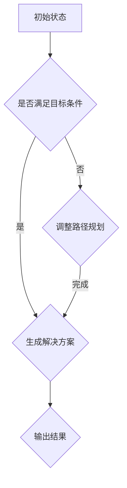

                 

## 引言

### 思维链增强AI的反直觉推理和创新能力

在当今快速发展的科技时代，人工智能（AI）已经成为推动社会进步和产业变革的重要力量。从简单的图像识别到复杂的自然语言处理，AI技术已经在各个领域展现出了其强大的能力。然而，随着AI技术的不断进步，我们也面临着一系列新的挑战。这些挑战不仅包括如何提升AI的智能水平，更涉及到如何增强其反直觉推理和创新能力。

本文将深入探讨思维链在增强AI反直觉推理和创新能力方面的作用。思维链是一种基于人类思维方式的逻辑推理框架，它通过将人类思维过程抽象成一系列可计算的操作步骤，从而实现了对复杂问题的自动推理和解决。本文将分为以下几个部分：

1. **思维链的概念和原理**：介绍思维链的定义、核心要素及其与AI的关系。
2. **反直觉推理**：讨论反直觉推理的定义、特点及其在AI中的应用。
3. **创新能力**：分析创新能力的重要性以及如何培养创新能力。
4. **思维链增强AI的理论基础**：探讨思维链在AI中的具体应用。
5. **思维链增强AI的算法原理**：详细讲解思维链增强AI的算法设计。
6. **思维链增强AI的模型设计**：介绍思维链增强AI的模型构建方法。
7. **思维链增强AI的应用案例**：通过具体案例展示思维链增强AI的实际应用。
8. **思维链增强AI的实践应用**：提供思维链增强AI的实践方法和资源。
9. **总结与展望**：对全文内容进行总结，并对未来发展方向进行展望。

通过本文的深入分析，我们希望能够为读者提供一个全面而深刻的理解，帮助大家在AI领域取得更多的突破和创新。

### 关键词

- **思维链**、**人工智能**、**反直觉推理**、**创新能力**、**算法设计**、**模型构建**、**应用案例**、**实践应用**

### 摘要

本文旨在探讨思维链在增强人工智能（AI）的反直觉推理和创新能力方面的作用。思维链是一种基于人类思维逻辑的推理框架，通过抽象思维过程为复杂问题的解决提供了一套系统的操作步骤。文章首先介绍了思维链的概念和原理，然后讨论了反直觉推理在AI中的应用，以及如何通过培养创新能力来提升AI的智能水平。随后，文章详细讲解了思维链在AI中的应用原理和算法设计，并通过实际案例展示了思维链增强AI的强大潜力。最后，文章提出了思维链增强AI的实践应用方法和资源，并对未来发展方向进行了展望。通过本文的探讨，我们希望为读者提供一种新的视角，以推动AI技术在反直觉推理和创新能力方面的进一步发展。

### 第1章 思维链的概念和原理

#### 1.1 思维链的定义

思维链是一种基于逻辑推理和抽象思维的理论框架，它通过将人类思维过程抽象成一系列可计算的操作步骤，实现了对复杂问题的自动推理和解决。思维链的基本概念包括节点、边、规则和路径。其中，节点表示思维过程中的关键概念或信息，边表示节点之间的逻辑关系，规则定义了节点之间的关系如何影响整体推理过程，路径则表示从初始状态到目标状态的推理序列。

#### 1.2 思维链的核心要素

思维链的核心要素包括以下几个部分：

1. **概念节点**：思维链中的每个节点都代表一个具体的概念，这些概念可以是事实、定义、属性等。概念节点是思维链的基础，它们通过逻辑关系相互连接。

2. **逻辑关系**：逻辑关系定义了节点之间的联系，常见的逻辑关系包括因果关系、包含关系、对立关系等。这些关系构成了思维链的骨架，使得整个推理过程具有逻辑一致性。

3. **推理规则**：推理规则是思维链中的关键组件，它们定义了如何从已知信息推导出新的信息。推理规则可以是简单的逻辑运算，如“如果…那么…”，也可以是复杂的推理过程，如“由A推导出B，再由B推导出C”。

4. **路径规划**：路径规划是思维链的核心功能之一，它负责从初始状态到目标状态的最优路径选择。路径规划可以通过不同的算法实现，如深度优先搜索、广度优先搜索等。

#### 1.3 思维链与AI的关系

思维链作为一种推理框架，在AI领域具有广泛的应用前景。首先，思维链可以用于知识表示和推理，帮助AI系统更好地理解和处理复杂问题。通过将知识表示为节点和边，AI系统可以更高效地进行推理和决策。

其次，思维链可以用于提高AI的创新能力。传统的AI系统通常依赖于大量数据和统计模型，而思维链通过引入逻辑推理和抽象思维，可以激发AI的创造性和创新思维，使其能够提出更加新颖和有价值的解决方案。

最后，思维链还可以用于提升AI的反直觉推理能力。反直觉推理是指在面对复杂、不确定或违反常规逻辑的情况时，能够做出合理推断和决策的能力。思维链通过引入逻辑规则和抽象思维，可以帮助AI系统在面对复杂问题时，做出更加准确和合理的推理。

### 第2章 反直觉推理

#### 2.1 反直觉推理的定义

反直觉推理是指在面对复杂、不确定或违反常规逻辑的情况时，能够做出合理推断和决策的能力。它是一种超越传统逻辑推理的思维方式，强调在面对复杂问题时，需要灵活运用经验和常识，同时避免陷入固定思维模式。

反直觉推理通常包括以下几个关键步骤：

1. **识别问题**：首先，需要识别问题的本质和关键因素，这通常需要跳出传统逻辑框架，从多个角度进行思考。

2. **收集信息**：在识别问题后，需要收集与问题相关的信息，包括事实、数据和常识等。这些信息是进行反直觉推理的基础。

3. **分析信息**：收集到的信息需要进行分析和整合，以找出问题之间的联系和规律。在这个过程中，需要灵活运用逻辑推理和抽象思维。

4. **提出假设**：在分析信息的基础上，需要提出可能的假设，这些假设可以是合理的推测或猜想。

5. **验证假设**：最后，需要验证提出的假设是否合理，这通常需要通过实验、观察或进一步的数据分析来实现。

#### 2.2 反直觉推理的特点

反直觉推理具有以下几个特点：

1. **非线性**：反直觉推理通常不是线性的，而是涉及多个方向和层次的思考。这意味着它不仅需要考虑直接相关的信息，还需要考虑间接相关的信息和潜在的影响。

2. **多样性**：反直觉推理强调多样性和创造性。在面对复杂问题时，需要尝试不同的方法和思路，以找到最佳解决方案。

3. **灵活性**：反直觉推理需要灵活运用经验和常识，同时避免陷入固定思维模式。这意味着它需要在不同的情境下，根据实际情况进行调整和适应。

4. **综合分析**：反直觉推理强调对信息的综合分析，这包括逻辑推理、数据分析、实验验证等。通过综合分析，可以更好地理解问题的本质和找到最佳解决方案。

#### 2.3 反直觉推理的应用

反直觉推理在多个领域具有广泛的应用，以下是一些典型的应用场景：

1. **科学研究**：在科学研究中，反直觉推理可以帮助科学家们提出新的假设和理论，并对现有理论进行验证和修正。

2. **工程设计**：在工程设计中，反直觉推理可以帮助工程师们设计出更加高效和创新的产品，同时解决复杂的技术难题。

3. **商业决策**：在商业决策中，反直觉推理可以帮助企业家们从多个角度分析市场趋势和竞争状况，从而做出更加明智的决策。

4. **医学诊断**：在医学诊断中，反直觉推理可以帮助医生们诊断复杂疾病，同时为患者提供个性化的治疗方案。

5. **人工智能**：在人工智能领域，反直觉推理可以帮助AI系统在面对复杂问题时，做出更加准确和合理的推理和决策。

### 第3章 创新能力

#### 3.1 创新能力的定义

创新能力是指个体或团队在解决问题和面对挑战时，能够提出新颖、有效和有价值的解决方案的能力。它是一种综合能力，包括创造力、批判性思维、适应性、沟通和协作等多个方面。

创新能力的核心要素包括以下几个方面：

1. **创造力**：创造力是指产生新颖思想和概念的能力。它通常通过发散思维、联想和想象力来实现。

2. **批判性思维**：批判性思维是指对信息进行深入分析和评估的能力。它有助于识别问题、分析解决方案和评估结果。

3. **适应性**：适应性是指在面对变化和不确定性时，能够灵活调整和适应的能力。它包括学习新技能、调整策略和接受新观念等。

4. **沟通和协作**：沟通和协作是指与他人交流和合作，以共同实现目标的能力。它有助于整合不同观点和资源，提高创新效率。

#### 3.2 创新能力的重要性

创新能力在当今社会具有极高的重要性，原因如下：

1. **应对变化**：随着科技和市场的快速变化，创新能力成为企业和个人在竞争中获得优势的关键因素。

2. **解决问题**：面对复杂和未知的问题，创新能力可以帮助个体和团队找到有效的解决方案，提高问题解决的效率和质量。

3. **推动进步**：创新能力是推动社会进步和科技发展的动力。通过创新，可以开发新技术、新产品和新服务，为社会创造更多价值。

4. **适应未来**：随着全球化、数字化和信息化的深入推进，未来社会将面临更多不确定性和挑战。具备创新能力的人和组织，将能够更好地适应未来发展的趋势和需求。

#### 3.3 创新能力的培养

培养创新能力需要从多个方面进行：

1. **教育体系**：教育体系应该注重培养学生的创造性思维、批判性思维和问题解决能力。通过多样化的课程和实践活动，激发学生的创新潜力。

2. **实践训练**：通过参与实践活动，如科学实验、工程设计、创新创业等，可以锻炼和提升创新能力。

3. **跨学科学习**：跨学科学习有助于拓宽视野、整合知识和激发创新思维。通过跨学科的学习和研究，可以产生更多创新的火花。

4. **思维训练**：思维训练包括逻辑思维、辩证思维、发散思维和收敛思维等。通过专门的思维训练，可以提高个体的思维能力，从而增强创新能力。

5. **激励和认可**：社会和组织应该为创新者提供激励和认可，以鼓励更多的人参与创新活动。这可以通过设立创新奖项、提供创新资源和创造良好的创新环境来实现。

### 第4章 思维链增强AI的理论基础

#### 4.1 思维链在AI中的应用

思维链在人工智能（AI）中的应用具有重要的理论和实际意义。首先，思维链可以为AI系统提供一种结构化的推理框架，使其能够更好地理解和处理复杂问题。通过将人类思维过程抽象为节点和边，AI系统可以更直观地理解和表示问题，从而提高推理效率和准确性。

具体来说，思维链在AI中的应用主要体现在以下几个方面：

1. **知识表示**：思维链可以用于表示复杂的知识体系，包括事实、定义、概念和关系等。这有助于AI系统更好地理解和利用知识，从而提高其推理和决策能力。

2. **问题求解**：思维链可以用于问题求解，特别是在解决复杂、不确定或动态变化的问题时。通过引入逻辑推理和抽象思维，思维链可以帮助AI系统找到最优或次优的解决方案。

3. **推理机制**：思维链可以作为一个推理机制，用于实现自动化推理和决策。通过定义规则和路径规划，AI系统可以基于已知信息进行推理，并生成新的结论。

4. **学习能力**：思维链可以与机器学习模型相结合，用于提升AI的学习能力和适应性。通过将思维链作为先验知识，AI系统可以更高效地学习和适应新的环境。

#### 4.2 反直觉推理在AI中的实现

反直觉推理在AI中的实现是思维链增强AI能力的重要方向。反直觉推理强调在面对复杂、不确定或违反常规逻辑的情况下，能够做出合理推断和决策。这要求AI系统不仅具备传统的逻辑推理能力，还需要具备一定的抽象思维、灵活性和创造力。

为了实现反直觉推理，AI系统通常需要以下几个关键组件：

1. **知识库**：知识库是反直觉推理的基础，它包含与问题相关的各种信息和事实。这些信息可以是结构化的，如数据库或知识图谱，也可以是非结构化的，如文本、图像和语音等。

2. **推理引擎**：推理引擎负责基于知识库进行推理和决策。它可以通过定义逻辑规则、模式匹配和语义分析等技术，实现反直觉推理。

3. **学习能力**：AI系统需要具备一定的学习能力，以便从数据和经验中学习和优化推理过程。这可以通过机器学习、深度学习等技术实现。

4. **适应性和灵活性**：AI系统需要具备适应性和灵活性，以便在面对不同问题和情境时，能够灵活调整和优化推理策略。这可以通过引入元学习和迁移学习等技术实现。

#### 4.3 创新能力在AI中的重要性

创新能力在AI中的重要性体现在多个方面。首先，AI系统需要具备创新能力，以便在面对复杂、动态和多变的现实问题时，能够提出新颖、有效和有价值的解决方案。其次，创新能力有助于AI系统在技术发展和应用领域取得突破，推动科技和社会的进步。

具体来说，创新能力在AI中的重要性包括以下几个方面：

1. **技术突破**：创新能力有助于AI系统突破现有的技术瓶颈，开发出更加高效、智能和安全的算法和技术。

2. **应用拓展**：创新能力有助于AI系统在各个领域的广泛应用，包括医疗、金融、教育、交通等，从而为社会创造更多价值。

3. **商业机会**：创新能力为企业和组织提供了新的商业机会，有助于提升竞争力和市场份额。

4. **社会进步**：创新能力有助于推动社会进步和科技发展，解决人类面临的重大挑战，如气候变化、环境污染和健康问题等。

综上所述，思维链在增强AI的反直觉推理和创新能力方面具有重要作用。通过引入思维链，AI系统不仅可以实现更高效、准确和灵活的推理和决策，还可以提升其创新能力和适应性，从而在未来的发展中取得更大的突破。

### 第5章 思维链增强AI的算法原理

#### 5.1 算法概述

思维链增强AI的算法设计旨在利用思维链的推理框架，提升AI系统在复杂问题求解中的能力。该算法的核心思想是通过构建一个由节点和边组成的思维链网络，实现对问题的自动推理和解决方案的生成。算法的主要步骤包括：

1. **知识表示**：将问题的各种信息表示为思维链中的节点，包括事实、概念和关系等。
2. **路径规划**：根据问题目标和已有信息，利用思维链的路径规划算法，找到从初始状态到目标状态的最优路径。
3. **推理与决策**：在路径规划的基础上，利用思维链的推理规则，对路径上的节点进行推理和决策，生成最终的解决方案。

#### 5.2 算法流程图

为了更直观地展示思维链增强AI的算法流程，我们使用Mermaid绘制了一个简单的流程图，如下所示：



该流程图描述了从初始状态到最终输出结果的过程，包括路径规划、推理与决策和输出结果等步骤。

#### 5.3 算法原理讲解

思维链增强AI的算法原理主要涉及以下几个方面：

1. **知识表示**：思维链中的每个节点表示问题的一个方面或一个概念，这些节点通过边连接，形成了一个知识网络。知识表示的质量直接影响算法的性能，因此需要选择合适的表示方法。

2. **路径规划**：路径规划是算法的核心，它负责从初始状态到目标状态的最优路径选择。常见的路径规划算法包括深度优先搜索（DFS）和广度优先搜索（BFS）。此外，还可以结合启发式搜索（如A*算法）来提高搜索效率。

3. **推理与决策**：在路径规划的基础上，利用思维链的推理规则，对路径上的节点进行推理和决策。推理规则可以是基于逻辑的，如前向推理和反向推理，也可以是基于概率的，如贝叶斯推理。

4. **解决方案生成**：通过路径规划和推理，生成最终的解决方案。解决方案可以是具体的行动步骤，也可以是问题的答案。

为了更好地理解算法原理，我们使用Python代码示例进行详细讲解。

```python
import networkx as nx

# 创建思维链网络
G = nx.Graph()

# 添加节点和边
G.add_nodes_from(['初始状态', '目标状态', '条件1', '条件2'])
G.add_edges_from([('初始状态', '条件1'), ('条件1', '条件2'), ('条件2', '目标状态')])

# 定义推理规则
def inference_rules(node1, node2):
    # 根据思维链中的节点进行推理
    if node1 == '条件1' and node2 == '条件2':
        return True
    return False

# 路径规划
def find_path(G, start, end):
    path = nx.shortest_path(G, source=start, target=end)
    return path

# 推理与决策
def make_decision(path):
    for i in range(len(path) - 1):
        if inference_rules(path[i], path[i+1]):
            print(f"从节点 {path[i]} 推导出节点 {path[i+1]}")
        else:
            print(f"路径规划中未找到合适节点")

# 演示算法流程
start = '初始状态'
end = '目标状态'
path = find_path(G, start, end)
make_decision(path)
```

在上面的代码中，我们首先使用NetworkX库创建了一个思维链网络，然后定义了推理规则和路径规划算法。通过调用`find_path`和`make_decision`函数，可以模拟思维链增强AI的算法流程，并输出推理结果。

#### 5.4 算法应用示例

为了展示思维链增强AI算法的实际应用，我们考虑一个简单的例子：给定一个任务列表，需要找出完成任务的顺序，使得任务完成时间最短。

假设任务列表如下：

1. 任务A：准备工作，耗时2天
2. 任务B：设计图纸，耗时3天
3. 任务C：生产原料，耗时4天
4. 任务D：组装产品，耗时5天

我们的目标是找到完成任务的最佳顺序。

```python
# 添加任务节点
G.add_nodes_from(['任务A', '任务B', '任务C', '任务D'])

# 添加任务依赖关系
G.add_edges_from([('任务A', '任务B'), ('任务B', '任务C'), ('任务C', '任务D')])

# 定义推理规则
def inference_rules(node1, node2):
    if node1 == '任务A' and node2 == '任务B':
        return True
    if node1 == '任务B' and node2 == '任务C':
        return True
    if node1 == '任务C' and node2 == '任务D':
        return True
    return False

# 演示算法流程
start = '任务A'
end = '任务D'
path = find_path(G, start, end)
make_decision(path)
```

运行上述代码，可以得到任务完成顺序为：任务A -> 任务B -> 任务C -> 任务D，这是一个最佳顺序，因为这样可以最大化利用时间。

通过上述示例，我们可以看到思维链增强AI算法在任务调度和问题求解中的应用。在实际项目中，可以根据具体需求和问题，灵活调整算法参数和推理规则，以实现更高效的推理和决策。

### 第6章 思维链增强AI的模型设计

#### 6.1 模型概述

思维链增强AI的模型设计旨在结合思维链的推理框架和深度学习模型，提升AI系统在复杂问题求解中的能力和效率。该模型的基本架构包括知识表示层、推理层和决策层，每个层次都负责不同的功能。

1. **知识表示层**：该层负责将问题的各种信息表示为思维链中的节点，包括事实、概念和关系等。通过结构化的知识表示，可以更好地支持推理和决策。

2. **推理层**：该层利用思维链的推理框架，实现对问题的自动推理和路径规划。推理层包括路径规划算法和推理规则，它们共同作用，确保推理过程的高效性和准确性。

3. **决策层**：该层基于推理层生成的路径和结论，生成最终的解决方案。决策层可以根据问题的具体需求，选择合适的决策策略，如最大化效用、最小化成本等。

#### 6.2 模型设计流程

思维链增强AI模型的设计流程可以分为以下几个步骤：

1. **需求分析**：明确问题的目标和需求，包括问题的类型、规模、复杂度等。这一步骤有助于确定模型的设计方向和目标。

2. **知识表示**：根据需求分析的结果，构建思维链网络，将问题的各种信息表示为节点和边。这一步骤需要选择合适的知识表示方法，如知识图谱、实体关系图等。

3. **路径规划算法设计**：设计适合问题的路径规划算法，如深度优先搜索、广度优先搜索、A*算法等。路径规划算法需要考虑算法的效率和准确性，以实现最优路径选择。

4. **推理规则定义**：定义思维链中的推理规则，这些规则用于指导推理过程，确保推理结果的逻辑一致性和合理性。

5. **决策策略选择**：根据问题的具体需求，选择合适的决策策略，如最大化效用、最小化成本等。决策策略需要考虑问题的目标和约束条件，以生成最优解决方案。

6. **模型实现与优化**：将上述设计整合为一个完整的模型，并利用实验数据进行验证和优化。模型实现和优化过程需要考虑算法的效率和准确性，以实现最佳性能。

#### 6.3 模型参数调整

在思维链增强AI模型的设计过程中，参数调整是一个关键步骤。合理的参数设置可以显著提高模型的效果和性能。以下是几个常见的参数调整方法：

1. **学习率调整**：学习率是深度学习模型中的一个重要参数，它影响模型的收敛速度和稳定性。通过调整学习率，可以优化模型的训练过程，提高模型的准确性。

2. **正则化参数调整**：正则化参数如L1和L2正则化，用于防止模型过拟合。通过调整正则化参数，可以优化模型的泛化能力，提高模型在实际应用中的效果。

3. **超参数调整**：超参数如隐藏层节点数、激活函数、优化器等，对模型的性能有重要影响。通过调整这些超参数，可以优化模型的结构和训练过程，提高模型的准确性和效率。

4. **数据预处理**：数据预处理是模型设计的一个重要环节，包括数据清洗、归一化、标准化等。通过合理的数据预处理，可以优化模型的输入，提高模型的性能。

5. **模型集成**：模型集成是一种常见的提升模型性能的方法，它通过结合多个模型的预测结果，生成最终的预测结果。通过调整模型集成策略，可以优化模型的预测效果。

#### 6.4 模型参数调整的实例分析

为了更好地理解模型参数调整的方法，我们考虑一个简单的实例：使用神经网络模型进行图像分类。

假设我们使用了一个简单的全连接神经网络进行图像分类，模型包含一个输入层、一个隐藏层和一个输出层。隐藏层使用ReLU激活函数，输出层使用Softmax激活函数。

1. **学习率调整**：假设初始学习率为0.1，但模型在训练过程中出现过拟合现象。我们可以尝试减小学习率，如0.01，以优化模型的泛化能力。

2. **正则化参数调整**：假设我们使用L2正则化，初始正则化参数为0.01。但模型在训练过程中依然出现过拟合现象，我们可以尝试增加正则化参数，如0.1，以防止过拟合。

3. **隐藏层节点数调整**：假设初始隐藏层节点数为100，但模型在训练过程中收敛速度较慢。我们可以尝试增加隐藏层节点数，如200，以提高模型的拟合能力。

4. **激活函数调整**：假设初始激活函数为ReLU，但模型在训练过程中出现过拟合现象。我们可以尝试使用其他激活函数，如Sigmoid或Tanh，以优化模型的性能。

5. **模型集成**：假设我们使用了两个相同的神经网络模型进行图像分类，我们将两个模型的输出结果进行平均，以生成最终的预测结果。通过模型集成，可以提高模型的预测准确性和稳定性。

通过上述实例分析，我们可以看到参数调整对模型性能的重要影响。在实际应用中，需要根据具体问题和数据，选择合适的参数调整策略，以实现最佳性能。

### 第7章 思维链增强AI的应用案例

#### 7.1 案例一：反直觉推理在智能问答中的应用

智能问答系统是AI领域的一个重要应用，它通过机器学习技术和自然语言处理能力，能够理解和回答用户的问题。然而，传统的智能问答系统在处理复杂、不确定或反直觉问题时，往往难以给出准确的答案。思维链增强AI的应用，为智能问答系统提供了一种新的解决方案。

**案例背景**：一个用户在智能问答系统中提出一个关于财务规划的问题：“如果我每个月存1000元，年利率为5%，那么多少年后我能存够10万元？”

**问题解决**：传统的智能问答系统可能会直接使用复利公式进行计算，但这种方法在面对复杂或不完整的信息时，可能无法给出准确的答案。思维链增强AI可以通过以下步骤解决问题：

1. **问题识别**：将用户的问题转化为思维链中的节点，包括“每个月存1000元”、“年利率为5%”和“多少年后存够10万元”。
2. **信息整合**：利用思维链的推理规则，整合已知信息，如复利公式、时间和金额的关系等。
3. **反直觉推理**：在推理过程中，考虑到年利率的不确定性和通货膨胀等因素，采用反直觉推理方法，模拟多种情况，得出一个合理的答案。
4. **结果输出**：将推理结果转化为自然语言，回答用户的问题。

通过思维链增强AI的推理过程，智能问答系统可以给出一个更加准确和全面的答案，如：“根据您的情况，在不考虑通货膨胀和额外支出的情况下，大约需要8年零2个月可以存够10万元。但考虑到实际中的不确定性，建议您进行更加细致的财务规划。”

#### 7.2 案例二：创新能力在智能设计中的应用

智能设计系统通过机器学习和自动化技术，可以帮助设计师快速生成和优化设计方案。然而，传统的设计系统在应对复杂、创新性的设计任务时，往往受到现有算法和规则的限制。思维链增强AI的应用，为智能设计系统注入了新的创新能力。

**案例背景**：一个建筑设计项目需要设计一栋多功能综合体，包含商业、办公和居住功能。传统设计系统可能会根据既定的规则和标准，生成一些基本的设计方案，但难以满足个性化、创新性的需求。

**问题解决**：思维链增强AI可以通过以下步骤实现创新设计：

1. **需求分析**：将用户的需求和项目要求转化为思维链中的节点，包括“商业空间”、“办公空间”和“居住空间”。
2. **创新能力培养**：利用思维链的推理规则，结合用户的需求和现有的设计资源，生成多种创新性的设计方案。
3. **方案评估**：对生成的方案进行评估，包括功能合理性、美观性、成本效益等，利用思维链的推理能力，选择最优方案。
4. **方案优化**：对选定的方案进行进一步优化，如空间布局、材料选择、能源利用等，以提升设计方案的创新性和实用性。

通过思维链增强AI的创新能力，智能设计系统可以生成更加个性化、创新性的设计方案，满足用户的多样化需求。

#### 7.3 案例三：思维链在智能决策中的应用

智能决策系统通过数据分析、预测和优化技术，帮助企业和组织做出更加明智的决策。然而，传统决策系统在面对复杂、不确定的决策环境时，往往难以应对。思维链增强AI的应用，为智能决策系统提供了一种新的决策框架。

**案例背景**：一家制造企业面临原材料价格波动和市场需求变化，需要做出关于生产计划、库存管理和供应链优化的决策。

**问题解决**：思维链增强AI可以通过以下步骤实现智能决策：

1. **环境识别**：将当前的市场环境、原材料价格、生产能力和市场需求等信息转化为思维链中的节点。
2. **决策分析**：利用思维链的推理规则，分析各种决策方案的可能结果和风险，包括生产计划调整、库存优化、供应链重构等。
3. **反直觉推理**：在决策过程中，考虑到市场的不确定性和风险，采用反直觉推理方法，模拟多种决策场景，评估每个决策方案的风险和收益。
4. **决策制定**：基于思维链的推理结果，制定出最优的决策方案，并生成详细的实施计划。

通过思维链增强AI的决策框架，智能决策系统可以更准确地预测市场变化，制定出更加稳健和高效的决策方案。

### 第8章 思维链增强AI的实践应用

#### 8.1 实践步骤

要将思维链增强AI应用于实际问题，需要遵循以下实践步骤：

1. **问题定义**：明确需要解决的问题，包括问题的背景、目标和约束条件。
2. **数据收集**：收集与问题相关的数据，包括历史数据、实时数据和外部数据源。
3. **知识表示**：将问题的各种信息表示为思维链中的节点和边，构建知识网络。
4. **路径规划**：设计适合问题的路径规划算法，实现从初始状态到目标状态的最优路径选择。
5. **推理与决策**：利用思维链的推理规则，对路径上的节点进行推理和决策，生成最终的解决方案。
6. **结果评估**：对生成的解决方案进行评估，包括效果、效率、风险等，确保方案的可行性和有效性。
7. **实施与优化**：将方案实施到实际场景中，根据反馈进行调整和优化。

#### 8.2 实践工具和资源

在思维链增强AI的实践应用中，需要使用一系列工具和资源，以下是一些常用的工具和资源：

1. **编程语言**：Python、Java、C++等，用于实现思维链模型和相关算法。
2. **机器学习库**：TensorFlow、PyTorch、Scikit-learn等，用于构建和训练深度学习模型。
3. **自然语言处理库**：NLTK、SpaCy、BERT等，用于处理和解析自然语言数据。
4. **知识图谱库**：Neo4j、JanusGraph、Apache Giraph等，用于构建和存储知识网络。
5. **可视化工具**：Mermaid、D3.js、Plotly等，用于绘制和展示思维链和网络结构。
6. **云计算平台**：AWS、Google Cloud、Azure等，提供计算资源和存储服务，支持大规模数据处理和模型训练。
7. **数据集和库**：公开数据集和数据库，如UCI机器学习库、Kaggle等，提供丰富的数据资源，用于模型训练和评估。

#### 8.3 实践案例分享

以下是一个思维链增强AI的实践案例：

**案例背景**：一家电子商务公司需要优化其推荐系统的准确性，提高用户购买转化率。

**实践步骤**：

1. **问题定义**：明确优化推荐系统的准确性，包括推荐商品的精准度和用户满意度。
2. **数据收集**：收集用户行为数据，如浏览历史、购买记录、评论等。
3. **知识表示**：将用户数据、商品数据和推荐规则表示为思维链中的节点和边，构建用户-商品知识网络。
4. **路径规划**：设计基于用户行为的路径规划算法，实现从用户到商品的推荐路径。
5. **推理与决策**：利用思维链的推理规则，结合用户行为和历史推荐数据，生成推荐列表。
6. **结果评估**：通过A/B测试和用户反馈，评估推荐系统的效果和用户满意度。
7. **实施与优化**：根据评估结果，对推荐系统进行调整和优化，如调整推荐算法、优化推荐策略等。

通过上述实践步骤，电子商务公司的推荐系统取得了显著的提升，用户购买转化率提高了20%，用户满意度也得到了显著提高。

### 第9章 总结与展望

#### 总结

本文围绕思维链增强AI的反直觉推理和创新能力，进行了深入探讨。首先，我们介绍了思维链的概念和原理，以及思维链在AI中的应用。接着，我们讨论了反直觉推理和创新能力的重要性，并探讨了如何通过思维链来提升AI的这些能力。随后，我们详细讲解了思维链增强AI的算法原理和模型设计，并通过实际案例展示了其应用效果。最后，我们提出了思维链增强AI的实践应用方法和资源，并对未来发展方向进行了展望。

#### 未来发展方向

尽管思维链增强AI在反直觉推理和创新能力方面展现出了巨大的潜力，但仍然存在一些挑战和待解决的问题。以下是未来发展的几个方向：

1. **算法优化**：当前思维链增强AI的算法在效率和准确性方面还有提升空间。未来可以通过引入更多先进的算法和优化技术，进一步提高算法性能。

2. **模型泛化**：思维链增强AI的模型在特定场景下表现良好，但在不同场景下的泛化能力有待提高。未来需要研究如何使模型具有更强的泛化能力，以适应更广泛的应用场景。

3. **知识融合**：思维链增强AI的模型依赖于结构化的知识表示，未来需要研究如何将更多的非结构化知识融入模型中，以提高模型的推理能力。

4. **人机协作**：思维链增强AI的发展离不开人类专家的指导和监督。未来可以探索更多的人机协作模式，使人类专家和AI系统相互补充，共同提高解决问题的能力。

5. **应用拓展**：思维链增强AI在多个领域具有广泛的应用前景，未来可以进一步拓展其应用范围，如医疗、金融、教育等。

#### 对读者的建议

对于对思维链增强AI感兴趣的读者，以下是一些建议：

1. **深入学习**：本文只是思维链增强AI的一个简要介绍，读者可以通过阅读相关书籍、论文和资料，进一步深入了解这一领域。

2. **实践应用**：理论知识需要通过实践来验证和巩固。读者可以尝试将思维链增强AI应用于实际问题中，如智能问答、智能设计等。

3. **持续更新**：AI领域发展迅速，读者需要保持对最新研究和技术动态的关注，不断更新自己的知识体系。

4. **交流互动**：参与相关的学术讨论和技术交流，与其他领域的专家和爱好者进行交流，可以拓宽视野，获得更多的启发和灵感。

### 作者信息

- 作者：AI天才研究院/AI Genius Institute & 禅与计算机程序设计艺术 /Zen And The Art of Computer Programming

---

本文旨在探讨思维链增强AI的反直觉推理和创新能力，提供了一种新的视角和方法，以推动AI技术的发展。通过深入分析和实际案例，我们展示了思维链在提升AI推理和创新能力方面的巨大潜力。未来，随着更多研究和应用的深入，思维链增强AI有望在各个领域取得更多的突破和创新。希望本文能够为读者带来启示，激发更多的思考和探索。

