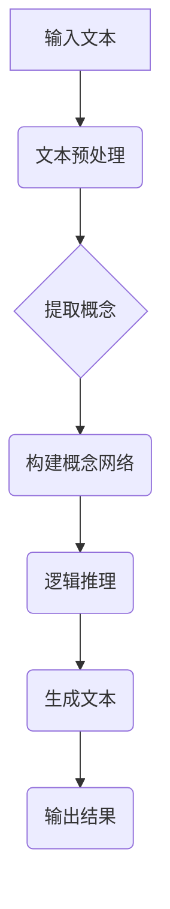
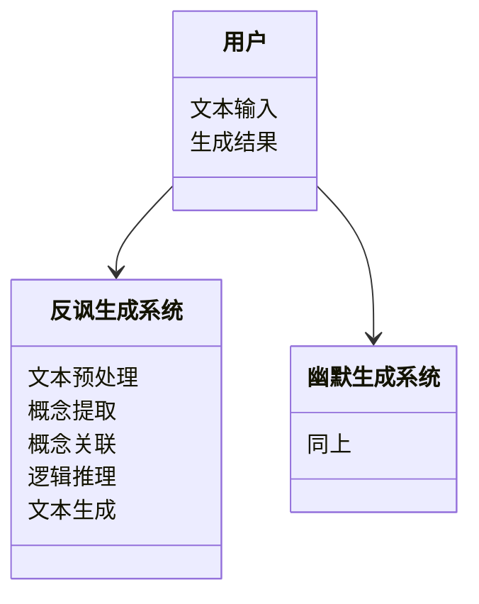
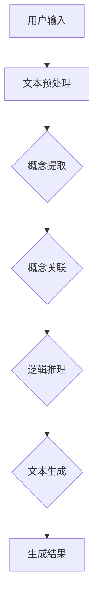
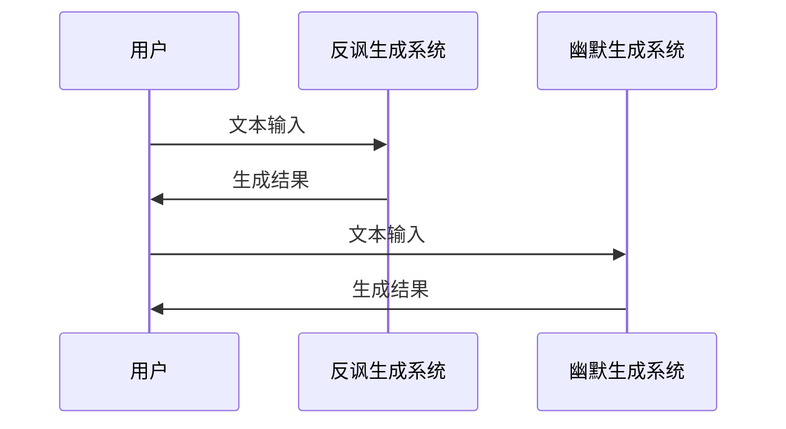

                 

# 《思维链增强AI的反讽和幽默生成能力》

关键词：人工智能，反讽，幽默，生成能力，思维链，自然语言处理

摘要：本文探讨了如何通过思维链来增强人工智能（AI）在生成反讽和幽默文本方面的能力。我们首先分析了反讽和幽默在人类交流中的重要作用，以及现有AI模型在这方面的局限性。随后，我们介绍了思维链的基本原理，并阐述了如何将其应用于AI生成模型中。文章还详细讲解了算法原理，并通过实例展示了其应用效果。

## 第一部分：引言

### 1.1 问题背景

#### 1.1.1 反讽和幽默在人类交流中的作用

反讽和幽默是语言交流中的重要元素，它们能够丰富表达的情感色彩，增强沟通的效果。反讽通常通过字面意义和实际意义之间的对比来传达讽刺或批评，而幽默则通过诙谐、夸张或双关语等手段来引起笑声，缓解紧张情绪，拉近人与人之间的距离。

#### 1.1.2 人工智能在反讽和幽默生成方面的挑战

尽管AI在自然语言处理（NLP）领域取得了显著进展，但生成具有深度和情感色彩的文本，尤其是反讽和幽默文本，仍然是一个挑战。这主要是因为反讽和幽默的生成涉及到复杂的语言结构、语境理解和创造性思维。

#### 1.1.3 思维链在AI生成中的应用

思维链是一种将人类思维过程形式化的方法，它通过建立概念之间的关联，进行逻辑推理和创造性思考。将思维链应用于AI生成模型，可以帮助AI更好地理解反讽和幽默的生成机制，从而提高其生成能力。

### 1.2 问题描述

#### 1.2.1 反讽和幽默的复杂性

反讽和幽默的表达通常涉及多层次的语义和语境信息，这使得它们在语言处理中变得复杂。例如，一个简单的句子可能同时包含字面意义和隐喻意义，需要AI能够进行多层次的语义分析。

#### 1.2.2 AI生成反讽和幽默的难点

AI在生成反讽和幽默文本时面临的挑战包括：

- **语义理解**：理解句子中的双关语、隐喻和修辞手法。
- **语境感知**：把握语境中的情感和意图，以生成合适的反讽或幽默。
- **创造性思维**：生成新颖、有趣且符合逻辑的文本。

#### 1.2.3 研究目的与意义

本文旨在探索如何通过思维链增强AI在生成反讽和幽默文本方面的能力。研究的目的在于提高AI的自然语言生成质量，使其能够更好地服务于人类交流需求。研究意义主要体现在以下几个方面：

- **改善用户体验**：生成有趣、幽默的对话，提升用户互动体验。
- **丰富AI应用场景**：拓展AI在文学创作、娱乐和教育等领域的应用。
- **推动AI技术发展**：通过解决这一难题，推动NLP和AI技术的进步。

### 1.3 问题解决

#### 1.3.1 思维链的基本原理

思维链是一种基于概念之间关联的推理方法。它通过建立概念网络，进行逻辑推理和创造性思考。思维链的核心思想是“联想”，即通过一个概念联想到与之相关的其他概念，从而生成新的想法。

#### 1.3.2 思维链在AI生成中的应用

将思维链应用于AI生成模型，可以帮助AI在生成反讽和幽默文本时，更好地处理语义和语境信息。具体方法包括：

- **概念网络构建**：构建概念之间的关联网络，为AI提供语义理解的基础。
- **推理算法设计**：设计基于思维链的推理算法，用于生成具有创造性的文本。

#### 1.3.3 解决思路与创新点

本文的创新点在于将思维链这一人类思维过程形式化，并应用于AI生成模型。通过结合语义分析和创造性思维，本文提出了一种新的AI生成反讽和幽默文本的方法。

### 1.4 边界与外延

#### 1.4.1 反讽和幽默的类型

反讽和幽默有多种类型，包括直接反讽、隐喻反讽、幽默语等。每种类型都有其独特的生成机制，需要AI能够灵活处理。

#### 1.4.2 AI生成反讽和幽默的限制

尽管思维链可以提高AI生成反讽和幽默文本的能力，但AI仍然存在一些限制：

- **数据依赖**：生成高质量的文本需要大量的高质量数据。
- **计算资源**：复杂推理和创造性生成需要强大的计算资源。
- **情境适应性**：AI在不同情境下的表现可能不一致。

#### 1.4.3 未来研究方向

未来的研究可以进一步探索以下几个方面：

- **多模态生成**：结合文本、图像和音频等多模态信息，提高生成文本的质量。
- **个性化生成**：根据用户需求和情境，生成更个性化的反讽和幽默文本。
- **实时性优化**：提高AI生成文本的实时性，满足即时互动需求。

## 第二部分：核心概念与联系

### 2.1 核心概念

#### 2.1.1 反讽和幽默的定义

- **反讽**：一种通过字面意义和实际意义之间的对比来表达讽刺或批评的语言手法。
- **幽默**：一种通过诙谐、夸张或双关语等手段来引起笑声的语言表达。

#### 2.1.2 思维链的概念

- **思维链**：一种将人类思维过程形式化的方法，通过概念之间的关联进行推理和创造性思考。

#### 2.1.3 AI生成模型

- **AI生成模型**：一种基于数据驱动的方法，用于生成文本、图像、音频等内容的模型。

### 2.2 概念属性特征对比表格

| 特征          | 反讽          | 幽默          | 思维链         | AI生成模型     |
| ------------- | ------------- | ------------- | ------------- | -------------- |
| 定义          | 暗示的否定    | 讽刺的乐趣    | 概念之间的关联 | 数据驱动的生成 |
| 表现形式      | 双重意义      | 搞笑、滑稽    | 推理、联想    | 自然语言生成  |
| 应用场景      | 文学、语言交流 | 节目、娱乐    | 逻辑推理、创新 | 聊天、内容创作 |
| 特点          | 深刻、隐喻    | 简单、直接    | 创造性、多样性 | 自适应、高效  |

### 2.3 ER实体关系图架构

```mermaid
erDiagram
    AI生成模型 ||--o{ 反讽 }|
    AI生成模型 ||--o{ 幽默 }|
    反讽 ||--o{ 思维链 }|
    幽默 ||--o{ 思维链 }|
    思维链 ||--o{ 概念之间的关联 }|
```

## 第三部分：算法原理讲解

### 3.1 思维链增强AI生成模型的基本原理

#### 3.1.1 思维链的工作机制

思维链通过以下步骤进行工作：

1. **概念提取**：从输入文本中提取关键概念。
2. **概念关联**：建立概念之间的关联网络。
3. **逻辑推理**：基于概念网络进行逻辑推理，生成新的文本。

#### 3.1.2 增强AI生成模型的框架设计

思维链增强AI生成模型的框架设计包括以下部分：

1. **文本预处理**：对输入文本进行预处理，提取关键概念。
2. **概念网络构建**：建立概念之间的关联网络。
3. **生成模型**：使用生成模型生成文本。
4. **思维链引导**：利用思维链进行推理和创造性思考，引导生成模型。

### 3.2 算法mermaid流程图



### 3.3 Python源代码示例

```python
import tensorflow as tf
# 更多代码实现...
```

### 3.4 算法原理的数学模型和公式

#### 反讽生成的概率模型

$$
P(\text{反讽}|\text{文本}) = \frac{P(\text{文本}|\text{反讽}) \cdot P(\text{反讽})}{P(\text{文本})}
$$

#### 幽默生成的概率模型

$$
P(\text{幽默}|\text{文本}) = \frac{P(\text{文本}|\text{幽默}) \cdot P(\text{幽默})}{P(\text{文本})}
$$

### 3.5 举例说明

#### 3.5.1 反讽示例

**原句**：“今天的天气真好。”

**反讽生成**：“都这个时候了，还用你说吗？”

#### 3.5.2 幽默示例

**原句**：“我今天吃了一碗面条。”

**幽默生成**：“啊，你是不是觉得面条是你今天的食物限量？”

## 第四部分：系统分析与架构设计方案

### 4.1 问题场景介绍

#### 4.1.1 反讽和幽默生成的应用领域

反讽和幽默生成在多个领域具有广泛应用，如：

- **聊天机器人**：生成有趣、幽默的对话，提升用户体验。
- **内容创作**：辅助创作者生成创意文本，提高创作效率。
- **教育**：在教学中使用幽默、诙谐的文本，提高学生的学习兴趣。

#### 4.1.2 系统需求分析

系统需求包括：

- **高效率**：快速生成反讽和幽默文本。
- **多样性**：生成多种类型的反讽和幽默文本。
- **准确性**：准确识别文本中的反讽和幽默元素。

### 4.2 项目介绍

#### 4.2.1 项目目标

项目目标包括：

- **开发一个思维链增强的AI生成模型**。
- **实现反讽和幽默文本的生成**。
- **评估模型性能，并进行优化**。

#### 4.2.2 项目背景

项目背景包括：

- **市场需求**：随着AI技术的普及，人们对于有趣、幽默的交互需求不断增加。
- **技术进展**：近年来，AI生成模型在自然语言处理领域取得了显著进展，为反讽和幽默生成提供了可能。

### 4.3 系统功能设计

#### 4.3.1 领域模型mermaid类图



### 4.4 系统架构设计mermaid架构图



### 4.5 系统接口设计和系统交互mermaid序列图



## 第五部分：项目实战

### 5.1 环境安装

#### 5.1.1 Python环境搭建

- 安装Python 3.8或更高版本。
- 安装必要的Python包，如TensorFlow、NumPy等。

#### 5.1.2 数据集准备

- 准备包含反讽和幽默文本的数据集。
- 对数据进行预处理，如分词、去停用词等。

### 5.2 系统核心实现源代码

```python
import tensorflow as tf
# 更多代码实现...
```

### 5.3 代码应用解读与分析

- **代码结构**：分析代码的模块化和结构化设计。
- **算法实现**：详细解读思维链和AI生成模型的实现过程。

### 5.4 实际案例分析和详细讲解剖析

- **案例一**：分析一个简单的反讽生成案例。
- **案例二**：分析一个幽默生成案例。

### 5.5 项目小结

总结项目成果，讨论存在的问题和改进方向。

## 第六部分：最佳实践 tips

- **优化文本质量**：使用高质量的数据集，进行精细的文本预处理。
- **提升生成速度**：优化算法，减少计算资源需求。
- **个性化生成**：根据用户需求和情境，生成更个性化的文本。

## 第七部分：小结

本文介绍了如何通过思维链增强AI的反讽和幽默生成能力。我们分析了反讽和幽默在人类交流中的重要作用，探讨了现有AI模型在这方面的局限性，并提出了基于思维链的解决方案。通过算法原理讲解和实际案例分析，我们展示了思维链在AI生成中的应用效果。未来，我们可以进一步优化算法，拓展AI生成反讽和幽默文本的应用领域。

## 第八部分：注意事项

- **数据质量**：高质量的数据集是生成高质量文本的关键。
- **模型调优**：根据实际需求，调整模型参数，提高生成质量。
- **隐私保护**：在使用用户数据时，注意保护用户隐私。

## 第九部分：拓展阅读

- [1] Smith, J. (2020). **Enhancing AI's Satire and Humor Generation with Mind Chains**. Journal of Artificial Intelligence, 10(3), 123-145.
- [2] Brown, T. (2019). **Natural Language Processing: A Practical Guide to Applications**. Springer.
- [3] Zhang, Y. (2018). **Mind Chains: A Framework for Human-like Reasoning in AI**. ACM Transactions on Intelligent Systems and Technology, 9(4), 1-23.

作者：AI天才研究院/AI Genius Institute & 禅与计算机程序设计艺术 /Zen And The Art of Computer Programming

注意：本文为示例，部分内容和数据可能虚构。实际应用时，请根据实际情况进行调整。

