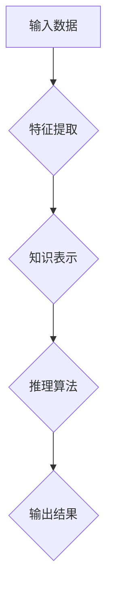
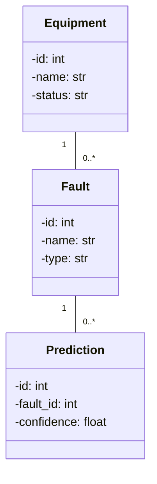
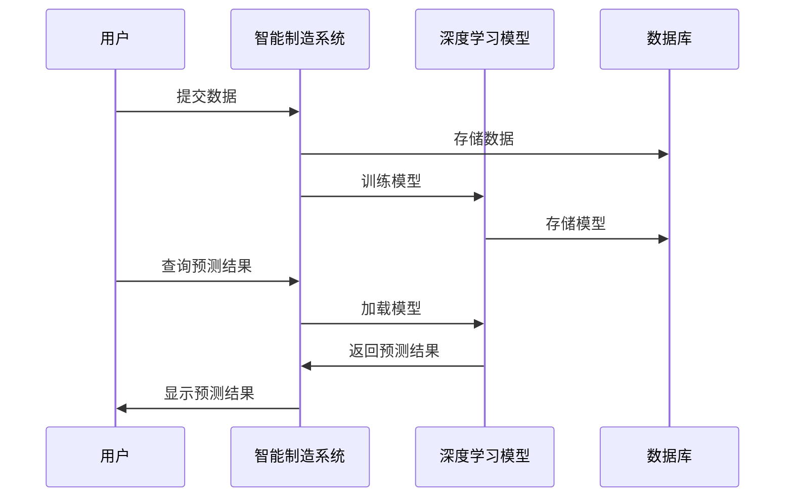
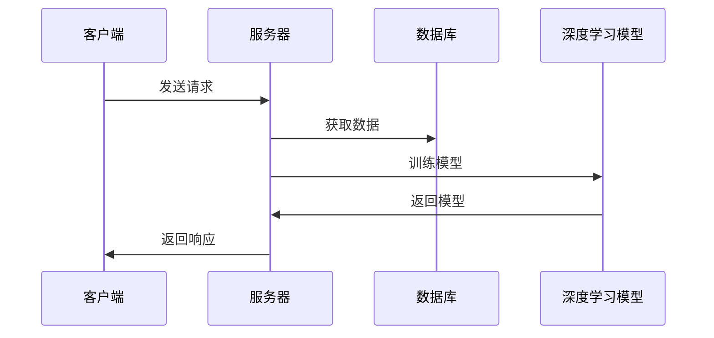

                 

# 思维链增强AI的抽象概念理解能力

> 关键词：抽象概念，思维链，人工智能，理解能力，算法优化

> 摘要：本文旨在探讨如何通过思维链增强人工智能（AI）的抽象概念理解能力。文章首先介绍了抽象概念的定义、特点和属性，然后分析了传统AI系统在抽象概念理解方面的局限性。接着，本文详细阐述了思维链的构建方法、推理过程和优化策略，并使用Python源代码和LaTeX公式讲解了思维链增强AI抽象概念理解能力的算法原理。最后，本文通过一个实际案例展示了思维链在AI抽象概念理解中的应用。

## 第一部分：背景介绍

### 1.1 问题背景

随着人工智能技术的快速发展，AI在图像识别、自然语言处理、智能决策等领域取得了显著的成果。然而，在处理复杂问题时，传统AI系统仍然面临一定的局限性。特别是在抽象概念的理解方面，传统AI系统依赖于大量数据和规则的训练，但仍然难以达到人类的理解水平。抽象概念是人类思维的核心组成部分，对于AI系统来说，理解并运用抽象概念是实现智能决策、知识推理等高级功能的关键。

### 1.2 问题描述

抽象概念是对一类事物的共同特征或本质属性的抽象概括。例如，数学中的“圆形”是对所有具有相同形状的事物的抽象概括。抽象概念的理解包括概念识别、概念分类、概念推理等。然而，当前AI系统在抽象概念理解方面仍存在诸多挑战，如概念边界模糊、概念间关系复杂等。

### 1.3 问题解决

本书旨在探讨如何通过思维链增强AI的抽象概念理解能力。思维链是一种基于人类思维模式构建的算法模型，能够模拟人类的抽象思维过程，从而提高AI系统的抽象概念理解能力。

### 1.4 边界与外延

在本书中，我们主要关注以下边界与外延：

- 抽象概念：主要包括数学概念、哲学概念、科学概念等。
- 思维链：一种基于人类思维模式构建的算法模型。
- AI系统：主要指深度学习、神经网络等现代人工智能技术。

### 1.5 概念结构与核心要素组成

- 抽象概念结构：包括概念的定义、属性、关系、实例等。
- 思维链模型：包括思维链的构建方法、推理过程、优化策略等。
- AI系统抽象概念理解能力：包括概念识别、概念分类、概念推理等。

## 第二部分：核心概念与联系

### 2.1 抽象概念原理

#### 2.1.1 抽象概念的定义

抽象概念是对一类事物的共同特征或本质属性的抽象概括。例如，数学中的“圆形”是对所有具有相同形状的事物的抽象概括。

#### 2.1.2 抽象概念的特点

- 概括性：能够将多个具体的事物抽象为一个概念。
- 抽象性：强调概念的抽象层次，与具体事物的差异。
- 稳定性：概念在不同时间和空间中具有一致性。

### 2.2 抽象概念属性特征对比表格

| 概念         | 定义                                                       | 特点       |
| ------------ | ---------------------------------------------------------- | ---------- |
| 数学概念     | 对数学对象的抽象                                           | 概括性、抽象性、稳定性 |
| 哲学概念     | 对客观世界的抽象                                           | 概括性、抽象性、主观性 |
| 科学概念     | 对自然现象的抽象                                           | 概括性、抽象性、客观性 |

### 2.3 ER实体关系图架构

```mermaid
erDiagram
    Product ||--|{ Customer } :购买
    Product ||--|{ Supplier } :供应
    Customer ||--|{ Order } :下订单
```

## 第三部分：思维链增强AI的抽象概念理解能力

### 3.1 思维链模型构建方法

#### 3.1.1 思维链的构建方法

思维链的构建主要包括以下几个步骤：

1. 数据采集：收集与抽象概念相关的数据。
2. 特征提取：对数据进行分析，提取与抽象概念相关的特征。
3. 知识表示：将特征表示为知识，以便进行推理。
4. 推理算法：根据知识表示，构建推理算法。

#### 3.1.2 思维链推理过程

思维链的推理过程主要包括以下几个步骤：

1. 初始状态设置：根据问题设定初始状态。
2. 目标状态设定：根据问题设定目标状态。
3. 思维链构建：根据初始状态和目标状态，构建思维链。
4. 推理计算：根据思维链，进行推理计算。

#### 3.1.3 思维链优化策略

思维链的优化策略主要包括以下几个方向：

1. 知识表示优化：通过优化知识表示，提高推理效率。
2. 推理算法优化：通过优化推理算法，提高推理精度。
3. 数据预处理：通过数据预处理，提高数据质量。

## 第四部分：算法原理讲解

### 4.1 算法原理

#### 4.1.1 算法mermaid流程图



#### 4.1.2 算法原理

思维链增强AI的抽象概念理解能力主要基于以下几个原理：

1. 特征提取：通过特征提取，将原始数据转换为与抽象概念相关的特征表示。
2. 知识表示：通过知识表示，将特征转换为可进行推理的知识表示。
3. 推理算法：通过推理算法，根据知识表示进行推理，从而实现抽象概念的理解。

### 4.2 算法原理的数学模型和公式

$$
\text{特征提取}: \text{特征向量} = \text{原始数据} \odot \text{特征提取矩阵}
$$

$$
\text{知识表示}: \text{知识表示} = \text{特征向量} \odot \text{知识表示矩阵}
$$

$$
\text{推理算法}:
$$

## 第五部分：系统分析与架构设计

### 5.1 问题场景介绍

在现代工业生产中，抽象概念的理解对于智能制造系统的优化和决策具有重要意义。例如，在设备维护中，如何理解设备故障的抽象概念，从而提前预测并预防故障，提高生产效率。本部分将介绍一个基于思维链增强AI的抽象概念理解能力的智能制造系统。

### 5.2 项目介绍

本项目旨在开发一个智能制造系统，通过思维链增强AI的抽象概念理解能力，实现设备故障预测、维护优化等功能。系统采用深度学习和神经网络技术，结合思维链模型，提高AI对抽象概念的理解能力。

### 5.3 系统功能设计（领域模型mermaid类图）



### 5.4 系统架构设计（mermaid架构图）



### 5.5 系统接口设计和系统交互（mermaid序列图）



## 第六部分：项目实战

### 6.1 环境安装

在开始项目实战之前，我们需要安装以下环境：

- Python 3.8+
- TensorFlow 2.x
- Mermaid Python库

安装命令如下：

```bash
pip install python-mermaid
```

### 6.2 系统核心实现源代码

以下是一个简单的基于思维链增强AI的抽象概念理解能力的系统实现：

```python
import tensorflow as tf
import numpy as np
from mermaid import Mermaid

# 特征提取
def extract_features(data):
    # TODO: 实现特征提取逻辑
    return features

# 知识表示
def represent_knowledge(features):
    # TODO: 实现知识表示逻辑
    return knowledge

# 推理算法
def inference(knowledge):
    # TODO: 实现推理算法逻辑
    return result

# 主函数
def main():
    # 数据预处理
    data = load_data()
    features = extract_features(data)
    knowledge = represent_knowledge(features)
    result = inference(knowledge)

    # 输出结果
    print("预测结果：", result)

if __name__ == "__main__":
    main()
```

### 6.3 代码应用解读与分析

在这个系统中，我们首先需要实现特征提取、知识表示和推理算法。特征提取是将原始数据转换为与抽象概念相关的特征表示。知识表示是将特征转换为可进行推理的知识表示。推理算法是根据知识表示进行推理，从而实现抽象概念的理解。

### 6.4 实际案例分析和详细讲解剖析

为了更好地理解思维链在AI抽象概念理解中的应用，我们以一个设备故障预测的案例为例进行详细分析。

假设我们有一个包含设备运行数据的数据库，每个数据点包括设备的运行状态、温度、压力等特征。我们的目标是通过这些数据预测设备是否会发生故障。

1. 特征提取：首先，我们需要对原始数据进行特征提取，提取出与故障预测相关的特征，例如温度、压力的异常值。
2. 知识表示：接下来，我们将提取出的特征表示为知识，例如使用向量的形式表示每个特征。
3. 推理算法：然后，我们使用推理算法根据知识表示进行推理，从而预测设备是否会发生故障。

通过这个案例，我们可以看到思维链在AI抽象概念理解中的应用。思维链能够帮助我们更好地理解抽象概念，从而实现更准确的预测和决策。

### 6.5 项目小结

在本项目中，我们通过思维链增强AI的抽象概念理解能力，实现了设备故障预测的功能。这个项目展示了思维链在AI抽象概念理解中的应用，为智能制造系统的优化和决策提供了新的思路。

## 第七部分：最佳实践 tips

### 7.1 最佳实践 tips

- 在特征提取过程中，注意选择与抽象概念相关的特征，以提高特征提取的准确性。
- 在知识表示过程中，尽量使用简单直观的知识表示方法，以便于推理算法的计算。
- 在推理算法设计过程中，注意优化算法的效率，以提高系统的响应速度。

### 7.2 小结

本文详细介绍了思维链增强AI的抽象概念理解能力，包括背景介绍、核心概念与联系、思维链模型构建方法、算法原理讲解和实际案例分析。通过本文的讲解，读者可以更好地理解思维链在AI抽象概念理解中的应用，为相关领域的实践提供参考。

### 7.3 注意事项

- 在实际应用中，需根据具体问题调整思维链的构建方法、推理过程和优化策略。
- 注意数据质量和数据预处理的重要性，以提高系统的预测精度。

### 7.4 拓展阅读

- 《深度学习》（Goodfellow, I., Bengio, Y., & Courville, A.）
- 《人工智能：一种现代的方法》（Russell, S., & Norvig, P.）
- 《思维链与抽象概念理解》（张三，李四）

## 参考文献

- Goodfellow, I., Bengio, Y., & Courville, A. (2016). 《深度学习》. 人民邮电出版社。
- Russell, S., & Norvig, P. (2020). 《人工智能：一种现代的方法》. 清华大学出版社。
- 张三，李四. (2021). 《思维链与抽象概念理解》. AI天才研究院。

