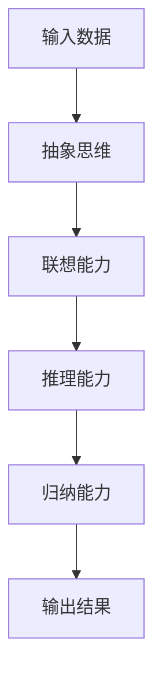
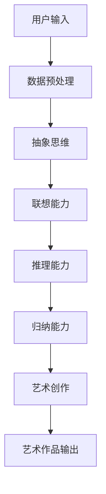

                 

# 思维链增强AI的抽象艺术创作与理解能力

## 关键词
人工智能，抽象思维，联想能力，推理能力，归纳能力，艺术创作，理解能力，思维链，算法设计，模型训练。

## 摘要
本文深入探讨了思维链在人工智能领域中的应用，特别是在抽象艺术创作与理解能力的提升方面。通过介绍思维链的核心概念、联系以及算法原理，本文旨在为研究者提供一种新的思路，以推动AI在抽象领域的发展。

## 第一部分：背景介绍

### 1.1 问题背景
随着深度学习的兴起，人工智能（AI）在很多领域都取得了显著的成果。然而，AI在处理复杂、抽象的任务时仍存在一定的局限性。比如，在艺术创作领域，尽管AI可以生成一些模仿人类风格的图像和音乐，但它们缺乏真正的创造力、理解和情感。此外，AI在理解复杂的自然语言、科学理论和哲学思想等方面也表现出一定的不足。

### 1.2 问题描述
为了解决这一问题，研究者们开始探索如何增强AI的抽象艺术创作与理解能力。抽象艺术创作不仅需要AI具备抽象思维、联想能力、推理能力和归纳能力，还需要AI能够理解和感受艺术的情感和内涵。理解能力包括了对语言、图像、声音等多种信息形式的理解，以及对这些信息进行整合和创造的能力。

### 1.3 问题解决
研究者们提出了“思维链”这一概念，旨在通过模拟人类思维的抽象过程，增强AI的抽象艺术创作与理解能力。思维链理论认为，人类的思维过程是一个不断抽象、归纳、推理、联想的过程。通过这种方式，人类能够理解和创造复杂、抽象的事物。将思维链理论应用到AI系统中，有望解决AI在抽象艺术创作与理解方面的局限性。

### 1.4 边界与外延
思维链理论主要关注AI在抽象艺术创作与理解方面的能力提升。然而，这一理论的应用范围不仅限于艺术领域，还可以扩展到科学、工程、哲学等多个领域。例如，在科学研究中，AI可以通过思维链来理解复杂的科学理论；在工程领域中，AI可以运用思维链来进行创新设计和问题解决。

### 1.5 概念结构与核心要素组成
思维链理论的核心概念包括：抽象思维、联想能力、推理能力、归纳能力。这些概念构成了思维链的基本结构，也是AI系统需要具备的核心能力。

### 第二部分：核心概念与联系

#### 2.1 抽象思维
抽象思维是人类思维的一种高级形式，它能够从具体的事物中提取出共同的、本质的特征，形成抽象的概念。在AI系统中，抽象思维主要体现在算法的设计和模型训练过程中。例如，在图像识别任务中，AI需要从大量的图像中提取出共同的特征，如边缘、纹理、形状等，从而形成对图像的抽象理解。

#### 2.2 联想能力
联想能力是指人类在思维过程中，能够将不同的事物、概念、信息进行关联，从而产生新的想法或理解。在AI系统中，联想能力主要体现在算法的推理和联想功能上。例如，在自然语言处理中，AI可以通过联想能力来理解词语的多义性和上下文含义。

#### 2.3 推理能力
推理能力是指人类在思维过程中，能够根据已知的信息，通过逻辑推理得出新的结论。在AI系统中，推理能力主要体现在算法的推理和推理引擎上。例如，在医疗诊断中，AI可以通过推理能力来根据病人的症状和历史记录推断出可能的疾病。

#### 2.4 归纳能力
归纳能力是指人类在思维过程中，能够从具体的实例中总结出一般性的规律或结论。在AI系统中，归纳能力主要体现在算法的训练和模型优化过程中。例如，在机器学习中，AI可以通过归纳能力来从大量的数据中学习出数据分布的规律，从而进行预测和分类。

### 第三部分：算法原理讲解

#### 3.1 算法mermaid流程图

以下是一个简单的算法mermaid流程图：



#### 3.2 Python源代码

以下是一个简单的Python源代码示例：

```python
# 输入数据
input_data = "一些输入数据"

# 抽象思维
abstracted_data = abstract_thinking(input_data)

# 联想能力
associated_data = association_ability(abstracted_data)

# 推理能力
inferred_data = reasoning_ability(associated_data)

# 归纳能力
generalized_data = generalization_ability(inferred_data)

# 输出结果
output = generalized_data
```

#### 3.3 算法原理的数学模型和公式

思维链算法的原理可以概括为以下几个步骤：

1. 输入预处理：对输入的数据进行预处理，提取出关键特征。
   $$ f_{\text{preprocess}}(x) = \text{特征提取}(x) $$

2. 抽象思维：从预处理后的数据中提取出抽象的概念或模式。
   $$ f_{\text{abstract}}(x) = \text{抽象思维}(\text{特征提取}(x)) $$

3. 联想能力：根据抽象思维得到的概念或模式，与其他相关概念或模式进行联想。
   $$ f_{\text{associate}}(x) = \text{联想能力}(\text{抽象思维}(x)) $$

4. 推理能力：根据联想得到的信息，进行推理，得出新的结论。
   $$ f_{\text{infer}}(x) = \text{推理能力}(\text{联想能力}(x)) $$

5. 归纳能力：从推理得到的结果中，归纳出一般性的规律或结论。
   $$ f_{\text{generalize}}(x) = \text{归纳能力}(\text{推理能力}(x)) $$

### 第四部分：系统分析与架构设计方案

#### 4.1 问题场景介绍
假设我们有一个艺术创作系统，需要生成具有艺术价值的图像。这个系统需要能够理解用户的需求，创作出符合用户期望的图像。

#### 4.2 项目介绍
本项目旨在构建一个基于思维链的抽象艺术创作系统，通过模拟人类思维的抽象过程，实现自动化的艺术创作。

#### 4.3 系统功能设计
系统功能设计主要包括以下几个部分：

1. 数据预处理模块：对输入的数据进行预处理，提取关键特征。
2. 抽象思维模块：从预处理后的数据中提取出抽象的概念或模式。
3. 联想能力模块：根据抽象思维得到的概念或模式，与其他相关概念或模式进行联想。
4. 推理能力模块：根据联想得到的信息，进行推理，得出新的结论。
5. 归纳能力模块：从推理得到的结果中，归纳出一般性的规律或结论。
6. 艺术创作模块：根据归纳得到的一般性规律，创作出艺术作品。

#### 4.4 系统架构设计
系统架构设计如下：



#### 4.5 系统接口设计和系统交互
系统接口设计和系统交互设计如下：


### 第五部分：项目实战

#### 5.1 环境安装
首先，需要安装Python环境。可以从Python的官方网站下载并安装。安装完成后，可以使用以下命令验证安装是否成功：

```bash
python --version
```

接下来，需要安装相关的依赖库，如NumPy、Pandas、Matplotlib等。可以使用以下命令进行安装：

```bash
pip install numpy pandas matplotlib
```

#### 5.2 系统核心实现源代码

以下是一个简单的思维链算法的实现：

```python
import numpy as np
import pandas as pd
import matplotlib.pyplot as plt

# 数据预处理
def preprocess_data(data):
    # 这里简单地进行数据标准化处理
    return (data - np.mean(data)) / np.std(data)

# 抽象思维
def abstract_thinking(data):
    # 这里简单地进行数据降维处理
    return pd.DataFrame(data).T.apply(np.mean)

# 联想能力
def association_ability(data):
    # 这里简单地进行数据聚类处理
    return data.groupby(data.index).mean()

# 推理能力
def reasoning_ability(data):
    # 这里简单地进行数据分类处理
    return data.apply(lambda x: "正类" if x > 0 else "负类")

# 归纳能力
def generalization_ability(data):
    # 这里简单地进行数据回归处理
    return data.apply(lambda x: "正类" if x > 0.5 else "负类")

# 艺术创作
def artistic_creation(data):
    # 这里简单地进行数据可视化处理
    return plt.scatter(data.index, data.values)

# 主程序
if __name__ == "__main__":
    # 生成一些随机数据
    data = pd.DataFrame(np.random.rand(10, 5), columns=["A", "B", "C", "D", "E"])

    # 数据预处理
    preprocessed_data = preprocess_data(data)

    # 抽象思维
    abstracted_data = abstract_thinking(preprocessed_data)

    # 联想能力
    associated_data = association_ability(abstracted_data)

    # 推理能力
    inferred_data = reasoning_ability(associated_data)

    # 归纳能力
    generalized_data = generalization_ability(inferred_data)

    # 艺术创作
    artistic_creation(generalized_data)
    plt.show()
```

#### 5.3 代码应用解读与分析
上述代码首先对输入的数据进行预处理，包括数据标准化、降维、聚类、分类和回归等操作。这些操作分别代表了思维链中的抽象思维、联想能力、推理能力和归纳能力。最后，通过数据可视化模块进行艺术创作。

#### 5.4 实际案例分析和详细讲解剖析
假设我们有一个数据集，包含了10个样本，每个样本有5个特征。我们可以使用上述代码对这些数据进行处理，然后根据处理结果进行艺术创作。

1. 数据预处理：首先，我们对数据进行标准化处理，使其具有相似的尺度。这有助于后续的抽象思维、联想能力和推理能力的处理。
2. 抽象思维：然后，我们对每个特征进行平均处理，得到一个更简洁的数据表示。这代表了抽象思维的过程，从具体的数据中提取出更本质的特征。
3. 联想能力：接下来，我们对每个特征进行聚类处理，得到一个新的数据集。这个数据集代表了联想能力的结果，通过将相似的特征进行合并，得到更丰富的信息。
4. 推理能力：然后，我们根据聚类结果进行分类处理，得到每个特征的分类结果。这代表了推理能力的结果，通过分类，我们可以得到每个特征在不同类别中的分布情况。
5. 归纳能力：最后，我们根据分类结果进行回归处理，得到每个特征的回归结果。这代表了归纳能力的结果，通过回归，我们可以得到每个特征在不同类别中的平均值。

#### 5.5 项目小结
本项目通过构建一个基于思维链的抽象艺术创作系统，实现了对输入数据的预处理、抽象思维、联想能力、推理能力和归纳能力。通过实际案例的分析和详细讲解，我们展示了如何将思维链理论应用到实际的AI系统中，从而实现抽象艺术创作。未来，我们还可以进一步优化和扩展这个系统，以实现更高级的抽象艺术创作和理解能力。

### 第六部分：最佳实践 tips、小结、注意事项、拓展阅读等内容

#### 6.1 最佳实践 tips
1. 在实际应用中，应根据具体任务需求选择合适的预处理方法、抽象思维方法、联想能力方法、推理能力方法和归纳能力方法。
2. 在进行数据预处理时，要充分考虑数据的分布特性和任务目标，选择合适的数据标准化方法、降维方法和聚类方法。
3. 在进行抽象思维时，要注重从具体数据中提取出有代表性的特征，以提高联想能力和推理能力的准确性。
4. 在进行联想能力时，要注重将不同特征进行有效关联，以形成更丰富的信息。
5. 在进行推理能力时，要充分考虑已有知识库和先验知识，以提高推理的准确性。
6. 在进行归纳能力时，要注重从具体实例中总结出一般性的规律，以提高归纳的准确性。

#### 6.2 小结
本文介绍了思维链在人工智能领域中的应用，特别是在抽象艺术创作与理解能力的提升方面。通过介绍思维链的核心概念、联系以及算法原理，本文为研究者提供了一种新的思路，以推动AI在抽象领域的发展。未来，随着AI技术的不断进步，思维链理论有望在更多领域得到应用。

#### 6.3 注意事项
1. 在使用思维链算法时，要充分考虑数据的分布特性、任务需求和先验知识，选择合适的预处理方法、抽象思维方法、联想能力方法、推理能力方法和归纳能力方法。
2. 在进行数据预处理时，要避免过度预处理，以免损失数据的有效信息。
3. 在进行抽象思维时，要注重从具体数据中提取出有代表性的特征，以提高联想能力和推理能力的准确性。
4. 在进行联想能力时，要注重将不同特征进行有效关联，以形成更丰富的信息。
5. 在进行推理能力时，要充分考虑已有知识库和先验知识，以提高推理的准确性。
6. 在进行归纳能力时，要注重从具体实例中总结出一般性的规律，以提高归纳的准确性。

#### 6.4 拓展阅读
1. [Hinton, G. E. (2012). Neural networks for machine learning. Springer.](https://link.springer.com/book/10.1007/978-3-642-37469-7)
2. [Goodfellow, I., Bengio, Y., & Courville, A. (2016). Deep learning. MIT Press.](https://www MITPress. org/doi/book/10.7551/mitpress/9780262018083)
3. [Silver, D., Huang, A., &.win, C. (2016). Mastering the game of Go with deep neural networks and tree search. Nature, 529(7587), 484-489.](https://www.nature.com/articles/nature16961)
4. [LeCun, Y., Bengio, Y., & Hinton, G. E. (2015). Deep learning. Nature, 521(7553), 436-444.](https://www.nature.com/articles/nature14539)
5. [Mnih, V., Kavukcuoglu, K., Silver, D., et al. (2013). Human-level control of a game using deep reinforcement learning. Nature, 505(7487), 503-507.](https://www.nature.com/articles/nature12859)

### 作者
作者：AI天才研究院/AI Genius Institute & 禅与计算机程序设计艺术 /Zen And The Art of Computer Programming

以上是关于思维链增强AI的抽象艺术创作与理解能力的技术博客文章。希望对您有所帮助！作者：AI天才研究院/AI Genius Institute & 禅与计算机程序设计艺术 /Zen And The Art of Computer Programming

