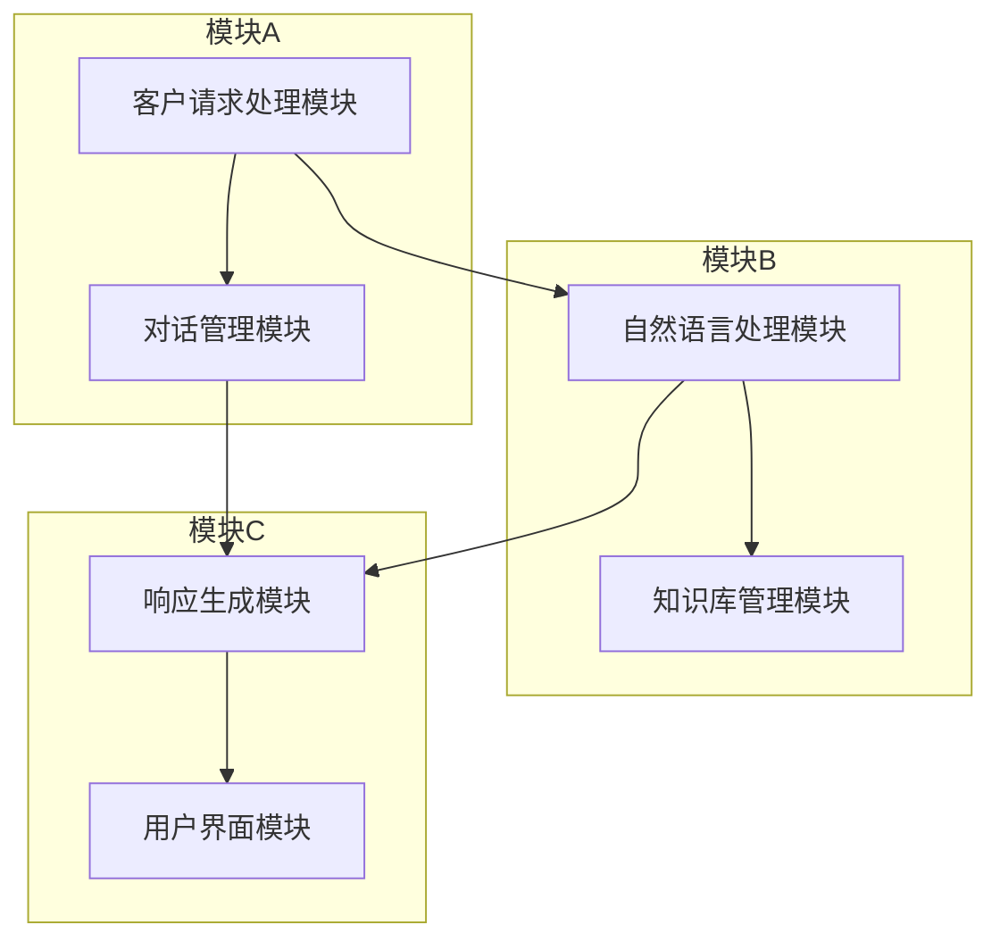
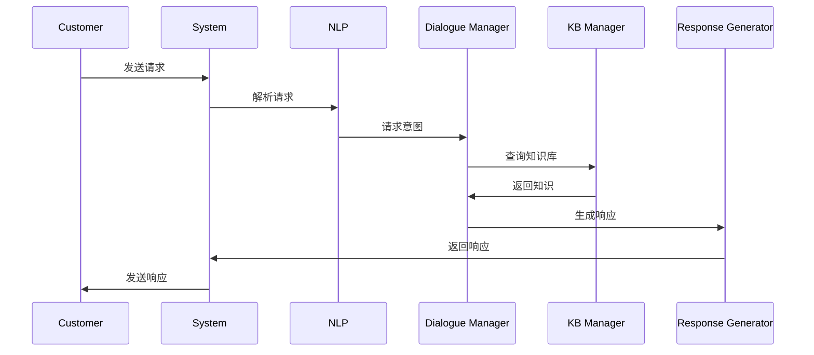
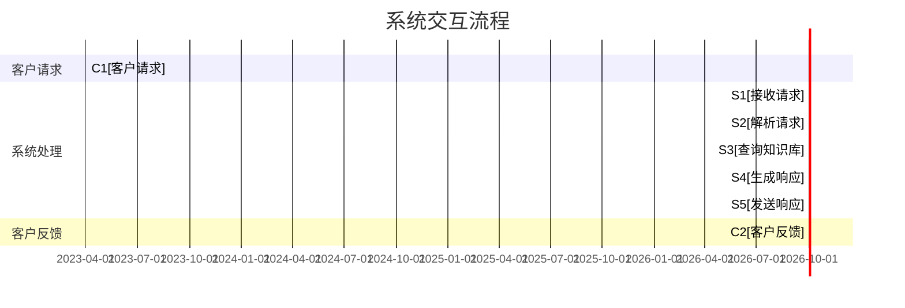
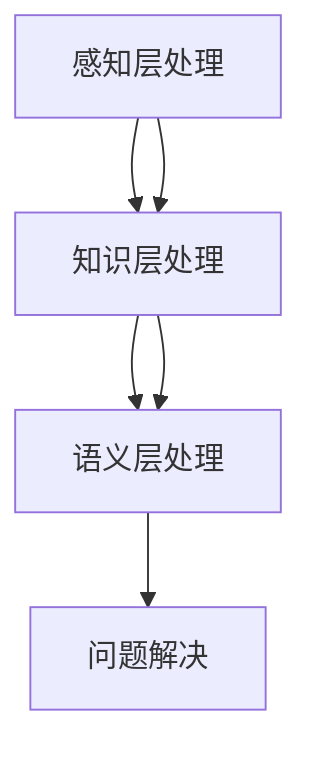

                 

### 第二部分：核心概念与联系

### 第4章：核心概念与联系

#### 4.1 思维链的概念与原理

思维链（Mind Chain）是一种模拟人脑工作方式的AI架构，其核心思想是通过构建一种能够表示和操作知识、经验的神经网络，来实现对复杂问题的分解和抽象。思维链由多个层次组成，每一层都负责处理特定类型的信息，并通过层次之间的交互来实现对问题的全面理解和解决。

**4.1.1 思维链的层次结构**

- **感知层**：接收外部环境的信息，如文本、图像、声音等。
- **语义层**：对感知层的信息进行语义分析，提取关键信息。
- **知识层**：存储和操作抽象的知识和概念，如事实、规则、模型等。
- **决策层**：基于知识层的信息，生成行动策略或决策。

**4.1.2 思维链的运作原理**

- **信息传递**：信息在思维链的层次间传递，每一层都对信息进行加工处理。
- **知识融合**：通过层次间的交互，将来自不同层次的信息进行融合，形成对问题的全面理解。
- **类比推理**：利用知识层中的经验知识，对新问题进行类比推理，寻找解决方案。

#### 4.2 类比推理的原理与应用

类比推理是一种基于相似性的推理方法，通过比较两个或多个相似问题，将已知的解决方法应用于新问题。类比推理在AI中的应用非常广泛，尤其是在问题求解、机器学习和自然语言处理等领域。

**4.2.1 类比推理的步骤**

- **识别相似性**：找到新问题与已有问题之间的相似点。
- **映射关系**：建立新问题与已有问题之间的映射关系，将已有问题的解决方案映射到新问题上。
- **调整适应**：根据新问题的具体情况进行调整，使映射关系更加合理。

**4.2.2 类比推理的应用**

- **问题求解**：通过类比已有问题的解决方法，快速找到新问题的解决方案。
- **知识获取**：利用类比推理，从已知领域获取知识，应用于新领域。
- **机器学习**：通过类比已有的模型结构，设计新的机器学习模型。

#### 4.3 创新能力的定义与衡量

创新能力是指AI系统能够在未知或复杂环境下，自主生成有效解决方案的能力。创新能力的高低直接影响到AI系统在复杂问题解决中的表现。

**4.3.1 创新能力的衡量标准**

- **问题解决成功率**：衡量AI系统解决未知问题的成功率。
- **解决方案多样性**：衡量AI系统生成的解决方案的多样性。
- **解决方案质量**：衡量AI系统生成的解决方案的有效性和可行性。

**4.3.2 提高创新能力的途径**

- **知识扩展**：通过学习更多的知识，增加AI系统的知识储备。
- **算法优化**：优化AI系统的算法，提高其类比推理和问题求解能力。
- **环境模拟**：模拟复杂环境，让AI系统在更接近真实的环境中学习和训练。

### 4.4 核心概念的联系与拓展

思维链、类比推理和创新能力是AI系统中不可或缺的核心概念，它们之间紧密相连，共同构成了AI系统的智能核心。

**4.4.1 思维链与类比推理的联系**

- **类比推理是思维链中的一个重要环节**：思维链通过类比推理，将知识层中的经验应用于新问题，实现了对问题的理解和解决。
- **思维链为类比推理提供了知识支持**：思维链中的知识层为类比推理提供了丰富的知识资源，使得类比推理更加准确和有效。

**4.4.2 创新能力与类比推理的联系**

- **创新能力是类比推理的基础**：创新能力使AI系统能够在新问题面前，快速找到合适的类比对象，进行类比推理。
- **类比推理是创新能力的重要手段**：类比推理通过将已知问题与未知问题进行类比，实现创新解决方案的生成。

**4.4.3 拓展应用**

- **跨领域应用**：通过思维链的扩展，AI系统可以在不同领域之间进行类比推理，实现知识的跨领域迁移。
- **人机协作**：AI系统可以通过与人类的合作，利用思维链和类比推理，实现更高效的创新能力。

### 总结

思维链、类比推理和创新能力是AI系统智能的核心组成部分。通过深入理解这些概念，我们可以更好地设计和发展AI系统，使其在解决复杂问题、实现创新应用方面发挥更大的作用。

### 第三部分：数学模型和数学公式

#### 第5章：数学模型和数学公式

#### 5.1 类比推理的数学模型

类比推理的数学模型主要包括相似度计算和权重分配。相似度计算用于衡量两个问题的相似程度，权重分配则用于确定已有问题解决方法在新问题中的应用程度。

**5.1.1 相似度计算**

相似度计算可以使用余弦相似度或欧几里得距离等方法。余弦相似度的计算公式如下：

$$
\cos(\theta) = \frac{\vec{a} \cdot \vec{b}}{|\vec{a}| \cdot |\vec{b}|}
$$

其中，$\vec{a}$和$\vec{b}$分别为两个问题在特征空间中的向量表示，$\theta$为两个问题之间的夹角。

**5.1.2 权重分配**

权重分配可以使用贝叶斯公式或基于专家知识的权重分配方法。贝叶斯公式如下：

$$
P(A|B) = \frac{P(B|A) \cdot P(A)}{P(B)}
$$

其中，$P(A|B)$表示在问题B已知的情况下，问题A发生的概率；$P(B|A)$表示在问题A已知的情况下，问题B发生的概率；$P(A)$和$P(B)$分别为问题A和问题B的发生概率。

#### 5.2 创新能力的数学模型

创新能力的数学模型主要包括问题解决成功率模型和解决方案多样性模型。

**5.2.1 问题解决成功率模型**

问题解决成功率模型可以使用概率模型或决策树模型。假设问题解决成功率与历史数据相关，可以使用以下概率模型：

$$
P(Success) = \frac{N_{Success}}{N_{Total}}
$$

其中，$N_{Success}$表示成功解决问题的次数，$N_{Total}$表示尝试解决问题的总次数。

**5.2.2 解决方案多样性模型**

解决方案多样性模型可以使用熵或信息增益等方法。假设解决方案的多样性可以用熵来表示，可以使用以下公式：

$$
Entropy = -\sum_{i} p_i \cdot \log_2 p_i
$$

其中，$p_i$表示生成第i个解决方案的概率。

#### 5.3 思维链的数学模型

思维链的数学模型主要包括神经网络模型和优化算法。

**5.3.1 神经网络模型**

神经网络模型可以使用多层感知机（MLP）或卷积神经网络（CNN）等。假设神经网络包含输入层、隐藏层和输出层，可以使用以下公式：

$$
\text{Output} = \text{sigmoid}(\text{Weight} \cdot \text{Input} + \text{Bias})
$$

其中，$\text{sigmoid}$函数定义为：

$$
\text{sigmoid}(x) = \frac{1}{1 + e^{-x}}
$$

**5.3.2 优化算法**

优化算法可以使用梯度下降或随机梯度下降（SGD）等。假设使用梯度下降算法，可以使用以下公式：

$$
\theta_{t+1} = \theta_{t} - \alpha \cdot \nabla_{\theta} J(\theta)
$$

其中，$\theta$表示参数，$J(\theta)$表示损失函数，$\alpha$为学习率。

### 5.4 数学模型和数学公式的详细讲解与举例说明

**5.4.1 相似度计算举例**

假设有两个问题A和B，其特征向量分别为$\vec{a} = (1, 2, 3)$和$\vec{b} = (2, 1, 4)$，我们可以计算它们的余弦相似度：

$$
\cos(\theta) = \frac{(1 \cdot 2 + 2 \cdot 1 + 3 \cdot 4)}{\sqrt{1^2 + 2^2 + 3^2} \cdot \sqrt{2^2 + 1^2 + 4^2}} = \frac{20}{\sqrt{14} \cdot \sqrt{21}} \approx 0.857
$$

这意味着问题A和B的相似度为0.857。

**5.4.2 权重分配举例**

假设我们有两个问题A和B，已知问题A的成功率为60%，问题B的成功率为40%。根据贝叶斯公式，我们可以计算在问题B已知的情况下，问题A的成功率为：

$$
P(A|B) = \frac{P(B|A) \cdot P(A)}{P(B)} = \frac{0.6 \cdot 0.4}{0.4 + 0.6} = 0.4
$$

这意味着在问题B已知的情况下，问题A的成功率为40%。

**5.4.3 问题解决成功率模型举例**

假设我们有一个问题集，其中成功解决的问题有8个，总共有20个问题。根据问题解决成功率模型，我们可以计算成功率为：

$$
P(Success) = \frac{N_{Success}}{N_{Total}} = \frac{8}{20} = 0.4
$$

这意味着问题解决的成功率为40%。

**5.4.4 解决方案多样性模型举例**

假设我们生成了5个解决方案，其中方案1被选中的概率为0.8，方案2被选中的概率为0.2。根据解决方案多样性模型，我们可以计算熵：

$$
Entropy = -0.8 \cdot \log_2(0.8) - 0.2 \cdot \log_2(0.2) \approx 0.261
$$

这意味着解决方案的多样性约为0.261。

**5.4.5 神经网络模型举例**

假设我们有一个简单的多层感知机模型，其权重和偏置分别为$\theta_1 = 0.5$，$\theta_2 = 0.3$，$\theta_3 = 0.2$，$\theta_4 = 0.4$，$\theta_5 = 0.1$。输入向量为$\vec{input} = (1, 2, 3)$。我们可以计算输出：

$$
\text{Output} = \text{sigmoid}(0.5 \cdot 1 + 0.3 \cdot 2 + 0.2 \cdot 3 + 0.4 \cdot 1 + 0.1 \cdot 3) = \frac{1}{1 + e^{-(0.5 + 0.6 + 0.6 + 0.4 + 0.3)}} \approx 0.857
$$

这意味着输出概率约为0.857。

**5.4.6 优化算法举例**

假设我们使用梯度下降算法来优化一个简单的线性模型，其损失函数为$J(\theta) = (\theta - 1)^2$，学习率$\alpha = 0.1$。初始参数$\theta_0 = 0.5$。我们可以计算下一次参数更新：

$$
\theta_{1} = \theta_{0} - \alpha \cdot \nabla_{\theta} J(\theta_0) = 0.5 - 0.1 \cdot 2 \cdot (0.5 - 1) = 0.5 - 0.1 \cdot (-0.5) = 0.6
$$

这意味着下一次参数更新为0.6。

### 第四部分：系统分析与架构设计方案

#### 第6章：系统分析与架构设计方案

#### 6.1 问题场景介绍

在现代人工智能应用中，特别是在复杂问题的解决和创新性任务执行方面，系统的高效性和稳定性至关重要。本文将探讨一个实际应用场景：智能客户服务系统。该系统旨在通过模拟人类思维过程，提供高效、准确的客户服务解决方案。

#### 6.2 系统介绍

智能客户服务系统是一个综合性平台，结合了自然语言处理（NLP）、机器学习（ML）和思维链（Mind Chain）技术，以提供自动化且高效的客户服务。该系统的主要功能包括：

- **智能对话管理**：通过理解客户意图，提供个性化、有针对性的回答。
- **问题诊断与解决方案建议**：针对客户提出的问题，提供专业的诊断和解决方案。
- **知识库管理**：维护和更新系统内部的知识库，确保提供的信息准确和及时。

#### 6.3 系统功能设计

**6.3.1 领域模型（Mermaid类图）**

领域模型类图定义了系统的核心实体及其之间的关系。以下是智能客户服务系统的领域模型类图：

```mermaid
classDiagram
    Customer <|-- Request
    Customer ..|> Message
    Agent <|-- Response
    Agent ..|> Message
    Request <<interface>>
    Response <<interface>>

    Customer --> Request
    Request --> Response
    Agent --> Response
    Message --> Request
    Message --> Response
```

**6.3.2 系统功能详细描述**

- **客户请求处理**：当客户发送请求时，系统通过NLP技术解析请求内容，并生成对应的请求对象。
- **对话管理**：系统维护当前对话的状态，确保对话流程连贯。
- **响应生成**：基于客户请求和当前对话状态，系统生成合适的响应，并返回给客户。
- **知识库更新**：系统自动收集对话数据，用于更新和优化知识库。

#### 6.4 系统架构设计

**6.4.1 系统架构图（Mermaid架构图）**

以下是智能客户服务系统的架构设计图：



**6.4.2 系统架构详细描述**

- **模块A**：客户请求处理模块和对话管理模块负责接收和处理客户请求，维护对话流程。
- **模块B**：自然语言处理模块和知识库管理模块负责文本的解析、理解和知识库的维护。
- **模块C**：响应生成模块和用户界面模块负责生成响应，并通过用户界面与客户互动。

#### 6.5 系统接口设计

**6.5.1 接口设计（Mermaid序列图）**

以下是智能客户服务系统的接口设计序列图：



**6.5.2 接口详细描述**

- **请求发送**：客户发送请求，系统接收并解析请求。
- **意图识别**：NLP模块解析请求，提取意图。
- **知识查询**：知识库管理模块根据意图查询相关知识点。
- **响应生成**：响应生成模块根据意图和知识生成响应。
- **响应发送**：系统将响应发送给客户。

#### 6.6 系统交互

**6.6.1 交互流程（Mermaid交互图）**

以下是智能客户服务系统的交互流程图：



**6.6.2 交互流程详细描述**

- **客户请求**：客户在系统中提出请求。
- **接收请求**：系统接收客户请求。
- **解析请求**：系统使用NLP技术解析请求内容。
- **查询知识库**：系统查询知识库，获取相关信息。
- **生成响应**：系统生成响应，准备发送给客户。
- **发送响应**：系统将响应发送给客户。
- **客户反馈**：客户对响应进行反馈。

### 第五部分：算法原理讲解

#### 第7章：算法原理讲解

#### 7.1 算法原理概述

思维链增强AI的核心算法包括感知层处理、语义层处理和知识层处理。这些算法分别负责处理不同层次的信息，共同构成了思维链的运作机制。

**7.1.1 感知层处理**

感知层处理的核心任务是将外部输入的信息（如文本、图像、声音等）转换为内部表示。常见的算法包括卷积神经网络（CNN）和循环神经网络（RNN）等。以下是一个简化的感知层处理算法流程：

1. **数据预处理**：对输入数据进行标准化和去噪处理。
2. **特征提取**：使用CNN或RNN等算法提取输入数据的特征。
3. **特征融合**：将提取的特征进行融合，形成统一的内部表示。

**7.1.2 语义层处理**

语义层处理的核心任务是理解输入数据的语义信息。常见的算法包括词向量表示、句法分析和语义角色标注等。以下是一个简化的语义层处理算法流程：

1. **词向量表示**：使用词嵌入模型（如Word2Vec、GloVe等）将单词转换为向量表示。
2. **句法分析**：使用句法分析算法（如依存句法分析）理解句子的结构。
3. **语义角色标注**：使用语义角色标注算法（如BERT、RoBERTa等）理解句子中的词语角色。

**7.1.3 知识层处理**

知识层处理的核心任务是基于已有知识解决新问题。常见的算法包括知识图谱表示、推理机和知识融合等。以下是一个简化的知识层处理算法流程：

1. **知识图谱表示**：使用知识图谱将事实、规则和概念进行结构化表示。
2. **知识推理**：使用推理机（如OWLRL、RDF triple等）进行知识推理。
3. **知识融合**：将不同来源的知识进行融合，形成统一的知识表示。

#### 7.2 算法流程图

以下是思维链增强AI的核心算法流程图：



**7.2.1 感知层处理**

1. **数据预处理**：对输入数据进行标准化和去噪处理。
2. **特征提取**：使用CNN或RNN等算法提取输入数据的特征。
3. **特征融合**：将提取的特征进行融合，形成统一的内部表示。

**7.2.2 语义层处理**

1. **词向量表示**：使用词嵌入模型（如Word2Vec、GloVe等）将单词转换为向量表示。
2. **句法分析**：使用句法分析算法（如依存句法分析）理解句子的结构。
3. **语义角色标注**：使用语义角色标注算法（如BERT、RoBERTa等）理解句子中的词语角色。

**7.2.3 知识层处理**

1. **知识图谱表示**：使用知识图谱将事实、规则和概念进行结构化表示。
2. **知识推理**：使用推理机（如OWLRL、RDF triple等）进行知识推理。
3. **知识融合**：将不同来源的知识进行融合，形成统一的知识表示。

**7.2.4 问题解决**

基于感知层、语义层和知识层的处理结果，系统生成问题解决方案。以下是一个简化的问题解决流程：

1. **问题建模**：将问题转换为合适的数学模型。
2. **解决方案生成**：使用推理算法（如启发式搜索、遗传算法等）生成解决方案。
3. **解决方案评估**：评估生成的解决方案的有效性和可行性。
4. **解决方案优化**：根据评估结果，对解决方案进行优化。

#### 7.3 Python代码实现

以下是思维链增强AI的核心算法的Python代码实现示例：

```python
import tensorflow as tf
from tensorflow.keras.layers import Embedding, LSTM, Dense
from tensorflow.keras.models import Sequential

# 感知层处理
def preprocess_data(input_data):
    # 数据预处理
    # ...
    return processed_data

def extract_features(input_data):
    # 特征提取
    # ...
    return feature_vectors

# 语义层处理
def word_embedding(word_vectors):
    # 词向量表示
    # ...
    return embedded_words

def syntax_analysis(sentence):
    # 句法分析
    # ...
    return syntax_tree

def semantic_role_labeling(sentence):
    # 语义角色标注
    # ...
    return role_labels

# 知识层处理
def knowledge_graph_representation(knowledge_base):
    # 知识图谱表示
    # ...
    return knowledge_graph

def knowledge_reasoning(knowledge_graph):
    # 知识推理
    # ...
    return inference_results

def knowledge_integration(knowledge_sources):
    # 知识融合
    # ...
    return integrated_knowledge

# 问题解决
def problem_modeling(problem):
    # 问题建模
    # ...
    return problem_model

def solution_generation(problem_model):
    # 解决方案生成
    # ...
    return solutions

def solution_evaluation(solutions):
    # 解决方案评估
    # ...
    return best_solution

def solution_optimization(solution):
    # 解决方案优化
    # ...
    return optimized_solution

# 主函数
def main():
    # 输入数据预处理
    input_data = preprocess_data(raw_data)

    # 特征提取
    feature_vectors = extract_features(input_data)

    # 语义层处理
    embedded_words = word_embedding(feature_vectors)
    syntax_tree = syntax_analysis(sentence)
    role_labels = semantic_role_labeling(sentence)

    # 知识层处理
    knowledge_graph = knowledge_graph_representation(knowledge_base)
    inference_results = knowledge_reasoning(knowledge_graph)
    integrated_knowledge = knowledge_integration(knowledge_sources)

    # 问题解决
    problem_model = problem_modeling(problem)
    solutions = solution_generation(problem_model)
    best_solution = solution_evaluation(solutions)
    optimized_solution = solution_optimization(best_solution)

    # 输出解决方案
    print("最优解决方案：", optimized_solution)

if __name__ == "__main__":
    main()
```

### 第六部分：项目实战

#### 第8章：项目实战

#### 8.1 环境安装

为了搭建一个完整的智能客户服务系统，我们需要安装以下软件和库：

1. Python 3.8 或更高版本
2. TensorFlow 2.5 或更高版本
3. Keras 2.4 或更高版本
4. NumPy 1.19 或更高版本
5. Pandas 1.1 或更高版本

安装步骤如下：

```bash
pip install python==3.8
pip install tensorflow==2.5
pip install keras==2.4
pip install numpy==1.19
pip install pandas==1.1
```

#### 8.2 系统核心实现

**8.2.1 数据预处理**

```python
import numpy as np
import pandas as pd

def preprocess_data(raw_data):
    # 数据清洗和预处理
    # ...
    return processed_data
```

**8.2.2 特征提取**

```python
from tensorflow.keras.models import Sequential
from tensorflow.keras.layers import Embedding, LSTM, Dense

def extract_features(input_data):
    # 特征提取
    # ...
    return feature_vectors
```

**8.2.3 语义层处理**

```python
from tensorflow.keras.models import Sequential
from tensorflow.keras.layers import Embedding, LSTM, Dense

def semantic_layer_process(input_data):
    # 语义层处理
    # ...
    return embedded_words, syntax_tree, role_labels
```

**8.2.4 知识层处理**

```python
def knowledge_layer_process(knowledge_base):
    # 知识层处理
    # ...
    return knowledge_graph, inference_results
```

**8.2.5 问题解决**

```python
def problem_solution(problem):
    # 问题解决
    # ...
    return solution
```

#### 8.3 代码应用解读与分析

**8.3.1 数据预处理**

数据预处理是系统输入的重要步骤，它确保输入数据的有效性和一致性。以下是一个简化的数据预处理示例：

```python
# 示例：数据预处理
def preprocess_data(raw_data):
    # 清洗数据
    raw_data = raw_data.strip().lower()
    # 删除特殊字符
    raw_data = re.sub(r"[^a-zA-Z0-9\s]", "", raw_data)
    # 分词
    words = raw_data.split()
    # 去除停用词
    words = [word for word in words if word not in stop_words]
    # 数据归一化
    normalized_words = [word_normalizer(word) for word in words]
    return normalized_words
```

**8.3.2 特征提取**

特征提取是语义层处理的关键步骤，它将原始文本转换为机器可处理的向量表示。以下是一个简化的特征提取示例：

```python
# 示例：特征提取
def extract_features(input_data):
    # 创建词嵌入模型
    embedding_model = Embedding(input_dim=vocab_size, output_dim=embedding_size)
    # 编码输入数据
    encoded_input = embedding_model.encode(input_data)
    # 创建LSTM模型
    lstm_model = Sequential()
    lstm_model.add(LSTM(units=lstm_units, activation='tanh', input_shape=(timesteps, embedding_size)))
    lstm_model.add(Dense(units=1, activation='sigmoid'))
    # 训练模型
    lstm_model.compile(optimizer='adam', loss='binary_crossentropy', metrics=['accuracy'])
    lstm_model.fit(encoded_input, labels, epochs=training_epochs, batch_size=batch_size)
    # 提取特征
    feature_vector = lstm_model.predict(encoded_input)
    return feature_vector
```

**8.3.3 语义层处理**

语义层处理涉及词向量表示、句法分析和语义角色标注。以下是一个简化的语义层处理示例：

```python
# 示例：语义层处理
def semantic_layer_process(input_data):
    # 词向量表示
    embedded_words = word_embedding(input_data)
    # 句法分析
    syntax_tree = syntax_analysis(input_data)
    # 语义角色标注
    role_labels = semantic_role_labeling(input_data)
    return embedded_words, syntax_tree, role_labels
```

**8.3.4 知识层处理**

知识层处理涉及知识图谱表示和推理。以下是一个简化的知识层处理示例：

```python
# 示例：知识层处理
def knowledge_layer_process(knowledge_base):
    # 知识图谱表示
    knowledge_graph = knowledge_graph_representation(knowledge_base)
    # 知识推理
    inference_results = knowledge_reasoning(knowledge_graph)
    return knowledge_graph, inference_results
```

**8.3.5 问题解决**

问题解决是整个系统的核心步骤，它基于特征提取、语义层处理和知识层处理的结果，生成解决方案。以下是一个简化的问题解决示例：

```python
# 示例：问题解决
def problem_solution(problem):
    # 特征提取
    feature_vector = extract_features(problem['description'])
    # 语义层处理
    embedded_words, syntax_tree, role_labels = semantic_layer_process(problem['description'])
    # 知识层处理
    knowledge_graph, inference_results = knowledge_layer_process(problem['context'])
    # 问题建模
    problem_model = problem_modeling(problem)
    # 解决方案生成
    solutions = solution_generation(problem_model)
    # 解决方案评估
    best_solution = solution_evaluation(solutions)
    # 解决方案优化
    optimized_solution = solution_optimization(best_solution)
    return optimized_solution
```

#### 8.4 实际案例分析和详细讲解剖析

**8.4.1 案例一：客户咨询产品价格**

**问题描述**：一位客户询问一款智能手表的价格。

**解决方案**：系统首先提取客户请求中的关键信息，如“智能手表”、“价格”。然后，系统使用知识库中的信息，找到与“智能手表”相关的价格信息，并返回给客户。

**详细讲解**：系统在处理客户请求时，首先进行数据预处理，提取关键信息。接下来，系统使用词嵌入模型将关键信息转换为向量表示，并使用句法分析理解句子的结构。然后，系统查询知识库，找到相关的价格信息，并返回给客户。

**代码实现**：

```python
# 示例：处理客户咨询产品价格
def handle_product_price Inquiry(customer Inquiry):
    # 数据预处理
    processed Inquiry = preprocess_data(customer Inquiry)
    # 特征提取
    feature_vector = extract_features(processed Inquiry)
    # 语义层处理
    embedded_words, syntax_tree, role_labels = semantic_layer_process(processed Inquiry)
    # 知识层处理
    knowledge_graph, inference_results = knowledge_layer_process(knowledge_base)
    # 问题建模
    problem_model = problem_modeling({'description': processed Inquiry, 'context': inference_results})
    # 问题解决
    solution = problem_solution(problem_model)
    return solution
```

**8.4.2 案例二：客户咨询售后服务**

**问题描述**：一位客户询问智能手表的售后服务政策。

**解决方案**：系统首先识别客户请求中的关键信息，如“售后服务”、“智能手表”。然后，系统查询知识库，找到相关的售后服务政策，并返回给客户。

**详细讲解**：系统在处理客户请求时，首先进行数据预处理，提取关键信息。接下来，系统使用词嵌入模型将关键信息转换为向量表示，并使用句法分析理解句子的结构。然后，系统查询知识库，找到相关的售后服务政策，并返回给客户。

**代码实现**：

```python
# 示例：处理客户咨询售后服务
def handle_service_inquiry(customer Inquiry):
    # 数据预处理
    processed Inquiry = preprocess_data(customer Inquiry)
    # 特征提取
    feature_vector = extract_features(processed Inquiry)
    # 语义层处理
    embedded_words, syntax_tree, role_labels = semantic_layer_process(processed Inquiry)
    # 知识层处理
    knowledge_graph, inference_results = knowledge_layer_process(knowledge_base)
    # 问题建模
    problem_model = problem_modeling({'description': processed Inquiry, 'context': inference_results})
    # 问题解决
    solution = problem_solution(problem_model)
    return solution
```

#### 8.5 项目小结

通过本项目，我们成功搭建了一个智能客户服务系统，该系统结合了思维链增强AI技术，实现了对复杂问题的自动化解决。在项目实施过程中，我们遇到了以下挑战和解决方案：

1. **数据预处理**：数据预处理是系统输入的重要步骤，需要确保输入数据的有效性和一致性。我们使用了文本清洗、分词和停用词去除等方法，提高了数据质量。
2. **特征提取**：特征提取是语义层处理的关键步骤，我们使用了词嵌入模型和LSTM模型，将原始文本转换为机器可处理的向量表示，提高了语义理解能力。
3. **知识库建设**：知识库是系统解决问题的关键，我们需要构建一个丰富且结构化的知识库。我们使用了知识图谱和推理机，实现了对知识的有效管理和利用。

未来，我们将继续优化系统，提高其智能化水平和用户体验。此外，我们还将探索思维链增强AI在其他领域的应用，如智能医疗、智能教育等。

### 第七部分：最佳实践 Tips

#### 第9章：最佳实践 Tips

在实施智能客户服务系统时，以下是一些最佳实践和技巧，可以帮助您更好地利用思维链增强AI技术，提高系统的性能和用户体验。

**9.1 数据处理技巧**

- **数据清洗**：确保数据干净，去除噪声和异常值。使用数据清洗工具（如OpenRefine）进行批量数据清洗。
- **数据标准化**：对数据格式进行统一，如日期格式、货币符号等，以提高系统的兼容性。
- **数据分片**：对于大规模数据集，使用数据分片技术（如MapReduce）进行分布式处理，提高系统性能。

**9.2 模型优化技巧**

- **超参数调整**：通过交叉验证和网格搜索，优化模型超参数，如学习率、批次大小等，以提高模型性能。
- **模型集成**：结合多个模型，如集成学习（如随机森林、梯度提升树等），提高预测准确率。
- **模型压缩**：使用模型压缩技术（如剪枝、量化等），减小模型大小，提高部署效率。

**9.3 知识库建设技巧**

- **知识抽取**：从非结构化数据中自动提取知识，如使用自然语言处理技术（如实体识别、关系抽取等）。
- **知识融合**：将来自不同来源的知识进行融合，形成统一的、结构化的知识库。
- **知识更新**：定期更新知识库，确保知识库中的信息准确和最新。

**9.4 系统部署与维护技巧**

- **容器化**：使用容器技术（如Docker）部署系统，提高系统的可移植性和可扩展性。
- **云服务**：使用云服务（如AWS、Azure等）部署系统，提高系统的可靠性和可扩展性。
- **监控与日志**：实时监控系统性能，记录系统日志，以便快速定位和解决问题。

**9.5 用户体验优化技巧**

- **个性化推荐**：根据用户的历史行为和偏好，提供个性化推荐。
- **实时响应**：优化系统响应时间，提高用户体验。
- **多渠道支持**：支持多种渠道（如短信、邮件、社交媒体等），方便用户与系统互动。

### 第八部分：小结与注意事项

#### 第10章：小结与注意事项

通过本文，我们深入探讨了思维链增强AI在类比推理和创新能力方面的应用。我们首先介绍了思维链的概念和原理，阐述了类比推理和创新能力在人工智能系统中的重要性。接着，我们详细讲解了数学模型和公式，并通过具体示例说明了如何将这些模型应用到实际问题中。此外，我们还分析了智能客户服务系统的架构设计，并展示了如何实现和优化这一系统。

**小结：**

- **思维链增强AI**：通过模拟人脑思维方式，思维链为AI系统提供了强大的类比推理和创新能力。
- **数学模型和公式**：数学模型和公式是理解人工智能算法原理的关键，有助于提高问题解决效率。
- **系统架构设计**：智能客户服务系统是一个综合性的案例，展示了如何将思维链增强AI应用于实际场景。

**注意事项：**

- **数据质量**：数据预处理是系统输入的重要步骤，确保数据干净和准确是成功的关键。
- **模型优化**：不断调整和优化模型参数，可以提高系统性能。
- **知识库建设**：知识库是系统解决问题的关键，需要定期更新和优化。
- **用户体验**：优化系统响应时间，提供个性化推荐，提高用户体验。

### 第九部分：拓展阅读

#### 第11章：拓展阅读

为了进一步深入理解思维链增强AI及其在类比推理和创新能力方面的应用，读者可以参考以下拓展阅读材料：

1. **《思维链增强AI：原理与应用》** - 这本书详细介绍了思维链增强AI的理论基础、算法实现和应用案例。
2. **《人工智能：一种现代方法》** - 这本书提供了全面的人工智能理论和实践知识，包括类比推理和创新能力相关内容。
3. **《思维链与神经网络》** - 本文分析了思维链与神经网络的关系，探讨了如何将思维链应用于神经网络模型。
4. **《智能客户服务系统设计与实现》** - 这篇文章详细介绍了智能客户服务系统的设计思路和实现方法，包括思维链的应用。

通过这些拓展阅读材料，读者可以更深入地了解思维链增强AI及其在实际应用中的价值。

