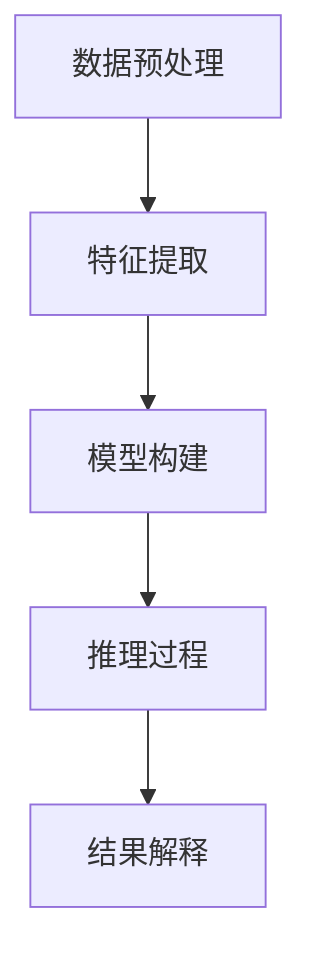
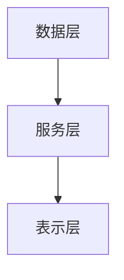

                 

### 第一部分：引言

## 第1章：问题背景与定义

### 1.1 问题背景

在人工智能（AI）迅猛发展的当下，AI技术已经渗透到我们生活的方方面面。从自动驾驶、智能语音助手，到复杂的医疗诊断、金融分析，AI的应用场景越来越广泛。然而，随着AI技术的发展，我们也面临着一系列的挑战。这些问题主要集中在AI系统的推理能力和抽象能力方面。

传统的AI算法，如深度学习，虽然在某些特定任务上取得了显著成果，但在面对复杂、多变的现实世界问题时，往往表现出推理能力不足和抽象能力有限的问题。例如，在医疗诊断中，AI系统可能无法处理病情的多样性和复杂性，无法提供准确的诊断结果；在自动驾驶中，AI系统可能无法应对突发情况，导致事故发生。

为了解决这些问题，我们需要寻找新的方法来提升AI的推理能力和抽象能力。超维度抽象推理作为一种新兴的方法，被提出并逐渐受到关注。它通过将高维数据映射到更低维度的空间，实现数据的降维和抽象，从而提升AI的推理能力。

### 1.1.1 AI发展的困境

首先，让我们来看一下AI发展面临的困境。传统AI算法的局限性主要体现在以下几个方面：

1. **数据依赖性强**：大多数AI算法依赖于大量的训练数据。在缺乏足够数据的情况下，算法的性能会显著下降。这限制了AI在未知或数据稀缺领域的应用。

2. **缺乏抽象能力**：传统AI算法难以处理复杂、抽象的概念。它们通常只能处理具体的、直接的输入和输出关系，而无法理解更高层次的抽象概念。

3. **缺乏推理能力**：AI系统通常缺乏推理能力，难以进行逻辑推断和抽象推理。这使得它们在面对复杂问题时，往往无法提供有效的解决方案。

4. **可解释性差**：传统AI算法的黑箱特性使得其决策过程难以理解。在关键领域，如医疗和金融，可解释性差的问题可能导致严重的后果。

### 1.1.2 超维度抽象推理的重要性

超维度抽象推理的出现，为解决这些问题提供了新的思路。超维度抽象推理通过以下方式提升AI的推理能力和抽象能力：

1. **数据抽象**：通过将高维数据映射到更低维度的空间，实现数据的降维和抽象。这有助于减少数据冗余，提高数据处理效率，从而提升AI系统的推理能力。

2. **特征提取**：超维度抽象可以提取出数据中的关键特征，从而实现从具体到抽象的转换。这有助于AI系统理解和处理更高层次的概念。

3. **模型压缩**：通过降维，AI模型可以变得更小、更高效。这有助于减少计算资源的消耗，提高模型的实时性能。

4. **增强泛化能力**：超维度抽象可以帮助AI系统更好地适应不同的任务和数据集，提高其泛化能力。

### 1.1.3 思维链增强AI的概念

思维链增强AI是将超维度抽象与AI算法相结合的一种方法。思维链是一种模拟人类思维的推理模型，它通过一系列逻辑推理步骤，实现对问题的理解和解决。思维链增强AI通过将超维度抽象引入思维链模型，提升其推理能力和抽象能力。

思维链增强AI的基本原理可以概括为以下几点：

1. **数据预处理**：使用超维度抽象方法对输入数据进行预处理，提取关键特征，实现数据的降维和抽象。

2. **思维链构建**：根据预处理后的数据，构建思维链模型。思维链模型通过一系列逻辑推理步骤，实现对问题的理解和解决。

3. **推理与优化**：通过不断优化思维链模型，提高其推理能力和抽象能力，从而实现更高效的解决问题。

### 1.2 核心概念与联系

#### 1.2.1 超维度抽象的概念

超维度抽象是一种将高维数据映射到更低维度的空间，实现数据的降维和抽象的方法。在数学上，这通常涉及到高维空间中的线性变换或非线性映射。通过降维，我们可以减少数据维度，降低计算复杂度，同时保留数据的关键特征。

#### 1.2.2 思维链的构成

思维链是一种模拟人类思维的推理模型，它通过一系列逻辑推理步骤，实现对问题的理解和解决。思维链通常由以下几个部分构成：

1. **知识库**：存储与问题相关的知识，如事实、规则、概念等。
2. **推理机**：根据知识库中的知识，进行逻辑推理，生成新的结论。
3. **控制策略**：决定推理过程的顺序和方式，优化推理效率。

#### 1.2.3 超维度抽象与思维链的关系

超维度抽象与思维链的关系主要体现在以下几个方面：

1. **数据预处理**：超维度抽象用于对输入数据进行预处理，提取关键特征，为思维链提供高质量的输入数据。
2. **推理优化**：超维度抽象可以优化思维链的推理过程，提高其推理效率和准确性。
3. **模型压缩**：超维度抽象有助于减少思维链模型的大小，提高模型的实时性能。

### 总结

在本章中，我们介绍了AI发展面临的困境，探讨了超维度抽象推理的重要性，并提出了思维链增强AI的概念。接下来，我们将进一步探讨超维度抽象的基本原理、思维链的理论基础，以及超维度抽象与思维链的结合方法。通过这些内容的分析，我们将深入了解如何利用超维度抽象推理提升AI的推理能力和抽象能力。让我们继续深入探讨。

### 第二部分：超维度抽象的基本原理

## 第2章：超维度抽象的基本原理

### 2.1 超维度抽象的概念理解

#### 2.1.1 超维度抽象的定义

超维度抽象是一种将高维数据映射到更低维度的空间，实现数据的降维和抽象的方法。在数学上，这通常涉及到高维空间中的线性变换或非线性映射。通过降维，我们可以减少数据维度，降低计算复杂度，同时保留数据的关键特征。

#### 2.1.2 超维度抽象的特点

1. **降低数据维度**：超维度抽象的主要目的是将高维数据映射到低维空间，减少数据维度，从而降低计算复杂度。

2. **保留关键特征**：虽然降维会导致部分数据的丢失，但超维度抽象旨在保留数据的关键特征，确保降维后的数据仍然能够反映原始数据的本质特征。

3. **提高计算效率**：通过降维，我们可以减少计算复杂度，提高数据处理和计算的效率。

4. **易于实现**：与传统的降维方法（如主成分分析PCA）相比，超维度抽象通常更加简单易实现，适用于各种不同类型的数据。

#### 2.1.3 超维度抽象的优势

1. **减少数据冗余**：通过降维，我们可以消除数据中的冗余信息，从而提高数据的质量和可解释性。

2. **提高计算效率**：降维可以减少计算复杂度，提高数据处理和计算的效率，特别适用于大数据处理场景。

3. **增强模型泛化能力**：通过保留数据的关键特征，超维度抽象有助于提高模型的泛化能力，使其能够更好地适应不同的任务和数据集。

4. **易于实现和扩展**：超维度抽象通常具有简单易懂的实现过程，且可以灵活地应用于各种不同类型的数据，具有广泛的适用性。

### 2.2 超维度抽象的实现方法

#### 2.2.1 数据驱动的抽象方法

数据驱动的抽象方法主要依赖于数据本身的特征，通过算法自动提取关键特征并进行降维。常见的方法包括：

1. **主成分分析（PCA）**：PCA是一种经典的降维方法，通过求解特征值和特征向量，将高维数据映射到低维空间。

2. **线性判别分析（LDA）**：LDA旨在将数据投影到低维空间，使得同一类别的数据尽可能接近，而不同类别的数据尽可能分离。

3. **自编码器（Autoencoder）**：自编码器是一种神经网络模型，通过编码和解码过程实现数据的降维。

#### 2.2.2 知识驱动的抽象方法

知识驱动的抽象方法依赖于先验知识，通过知识引导数据降维。常见的方法包括：

1. **规则驱动的方法**：通过专家规则来识别和消除数据中的冗余信息，实现降维。

2. **语义网络**：利用语义网络来表示和连接数据中的概念，通过语义网络实现数据的降维。

3. **知识图谱**：通过知识图谱来表示和关联不同实体和概念，实现数据的降维。

#### 2.2.3 融合驱动的抽象方法

融合驱动的抽象方法结合了数据驱动和知识驱动的优势，通过多种方法相互补充，实现更高效的降维。常见的方法包括：

1. **混合PCA**：结合PCA和LDA的优点，通过线性变换实现数据的降维。

2. **深度神经网络**：利用深度神经网络，通过多层非线性变换实现数据的降维。

3. **多任务学习**：通过多任务学习，将不同任务的数据进行融合和降维，提高模型的泛化能力。

### 2.3 超维度抽象的应用场景

#### 2.3.1 智能推理

智能推理是AI领域的一个重要方向，通过利用超维度抽象方法，可以提高智能推理的效率和准确性。具体应用包括：

1. **医疗诊断**：通过超维度抽象，提取关键特征，辅助医生进行诊断，提高诊断的准确性和效率。

2. **金融分析**：利用超维度抽象方法，对大量金融数据进行处理和分析，辅助投资决策，提高投资收益。

3. **智能问答系统**：通过超维度抽象，提取关键特征，提高问答系统的响应速度和准确性。

#### 2.3.2 决策支持

决策支持系统（DSS）是利用计算机技术和信息技术，辅助决策者进行决策的软件系统。超维度抽象在决策支持系统中有着广泛的应用：

1. **企业资源规划（ERP）**：通过超维度抽象，提取关键业务数据，为企业决策提供支持。

2. **供应链管理**：通过超维度抽象，优化供应链流程，提高供应链的效率和响应速度。

3. **人力资源规划**：通过超维度抽象，分析员工数据，为人力资源决策提供支持。

#### 2.3.3 问题求解

问题求解是AI领域的一个重要任务，通过利用超维度抽象方法，可以提高问题求解的效率。具体应用包括：

1. **路径规划**：通过超维度抽象，提取关键特征，优化路径规划算法，提高路径规划的准确性和效率。

2. **博弈论**：通过超维度抽象，提取关键信息，优化博弈策略，提高博弈的胜率。

3. **组合优化**：通过超维度抽象，优化组合优化问题的求解算法，提高求解效率和结果质量。

### 总结

在本章中，我们介绍了超维度抽象的概念、特点、优势，以及数据驱动的抽象方法、知识驱动的抽象方法和融合驱动的抽象方法。我们还探讨了超维度抽象在智能推理、决策支持和问题求解等应用场景中的重要性。接下来，我们将进一步探讨思维链增强AI的理论基础，以及超维度抽象与思维链的结合方法。通过这些内容的分析，我们将深入了解如何利用超维度抽象推理提升AI的推理能力和抽象能力。让我们继续深入探讨。

### 第三部分：思维链增强AI的理论基础

## 第3章：思维链增强AI的理论基础

### 3.1 思维链的基本原理

思维链是一种模拟人类思维的推理模型，它通过一系列逻辑推理步骤，实现对问题的理解和解决。思维链的基本原理可以概括为以下几点：

#### 3.1.1 思维链的定义

思维链是由一系列逻辑推理步骤构成的链条，每个步骤都基于前一个步骤的结果，生成新的结论。思维链的核心是推理机，它负责根据现有的知识和数据，生成新的推理结果。

#### 3.1.2 思维链的构成

思维链通常由以下几个部分构成：

1. **知识库**：存储与问题相关的知识，如事实、规则、概念等。知识库是思维链推理的基础。

2. **推理机**：根据知识库中的知识，进行逻辑推理，生成新的结论。推理机是思维链的核心。

3. **控制策略**：决定推理过程的顺序和方式，优化推理效率。控制策略是思维链的执行者。

4. **解释器**：解释推理过程，生成可解释的推理结果。解释器是思维链的可视化工具。

#### 3.1.3 思维链的功能

思维链的功能主要包括以下几个方面：

1. **知识表示**：通过知识库，将问题相关的知识进行表示和存储。

2. **逻辑推理**：通过推理机，根据知识库中的知识，进行逻辑推理，生成新的结论。

3. **推理优化**：通过控制策略，优化推理过程，提高推理效率和准确性。

4. **结果解释**：通过解释器，对推理结果进行解释和可视化，使其更容易理解和应用。

### 3.2 思维链与AI的结合

思维链与AI的结合，旨在利用AI技术提升思维链的推理能力和效率。结合的方法主要包括以下几个方面：

#### 3.2.1 思维链在AI中的角色

思维链在AI中的角色可以看作是AI的“思维模块”，它负责对输入数据进行推理和解释。具体来说，思维链在AI中的应用主要包括：

1. **知识推理**：利用思维链，对知识库中的知识进行推理，生成新的结论。

2. **问题求解**：利用思维链，对问题进行分解和求解，提供解决方案。

3. **决策支持**：利用思维链，分析问题和数据，为决策提供支持。

#### 3.2.2 思维链在AI中的实现

思维链在AI中的实现，通常需要以下几个步骤：

1. **知识表示**：将问题相关的知识表示为逻辑表达式或规则，存储在知识库中。

2. **推理过程**：利用推理机，根据知识库中的知识，进行逻辑推理，生成新的结论。

3. **结果解释**：利用解释器，对推理结果进行解释和可视化，使其更容易理解和应用。

#### 3.2.3 思维链在AI中的优势

思维链在AI中的优势主要体现在以下几个方面：

1. **可解释性**：思维链的推理过程是透明的，每个推理步骤都可以进行解释，这使得AI系统更加可解释和可信。

2. **灵活性**：思维链可以根据不同的应用场景，灵活地调整推理过程和控制策略，以适应不同的需求。

3. **推理效率**：通过优化推理过程，思维链可以提高推理效率，特别是在处理复杂问题时，表现出更高的性能。

4. **知识整合**：思维链可以将不同来源的知识进行整合，实现知识的复用和共享，提高AI系统的知识利用效率。

### 3.3 超维度抽象与思维链的结合

超维度抽象与思维链的结合，旨在通过超维度抽象提升思维链的推理能力和抽象能力。结合的方法主要包括以下几个方面：

#### 3.3.1 超维度抽象对思维链的增强

超维度抽象对思维链的增强主要体现在以下几个方面：

1. **数据预处理**：利用超维度抽象，对输入数据进行预处理，提取关键特征，减少数据维度，提高数据质量。

2. **特征提取**：利用超维度抽象，提取数据中的关键特征，为思维链提供高质量的输入数据。

3. **模型压缩**：利用超维度抽象，减少思维链模型的复杂度，提高模型的实时性能。

#### 3.3.2 思维链对超维度抽象的深化

思维链对超维度抽象的深化主要体现在以下几个方面：

1. **推理优化**：利用思维链的推理能力，对超维度抽象过程进行优化，提高降维效果和推理效率。

2. **结果解释**：利用思维链的推理结果，对超维度抽象的过程和结果进行解释和可视化，提高可解释性。

3. **知识整合**：利用思维链的知识整合能力，将超维度抽象的方法和结果与其他领域知识进行整合，实现知识的共享和复用。

#### 3.3.3 超维度抽象与思维链结合的应用案例

超维度抽象与思维链的结合，在多个领域都有广泛的应用。以下是一些典型的应用案例：

1. **智能医疗诊断**：利用超维度抽象，提取患者的关键特征，结合思维链进行推理和诊断，提高诊断的准确性和效率。

2. **金融风控**：利用超维度抽象，提取金融数据的关键特征，结合思维链进行推理和分析，提高风险识别和控制的准确性。

3. **智能交通**：利用超维度抽象，提取交通数据的关键特征，结合思维链进行路径规划和交通管理，提高交通效率和安全性。

### 总结

在本章中，我们介绍了思维链的基本原理、思维链与AI的结合方法，以及超维度抽象与思维链的结合。通过这些内容的探讨，我们了解到如何利用超维度抽象提升思维链的推理能力和抽象能力，从而实现更高效的解决问题。接下来，我们将进一步探讨超维度抽象推理的算法原理，以及如何具体实现和优化超维度抽象推理算法。让我们继续深入探讨。

### 第四部分：超维度抽象推理的算法原理

## 第4章：超维度抽象推理的算法原理

### 4.1 超维度抽象推理算法概述

超维度抽象推理算法是一种通过将高维数据映射到低维空间，实现数据降维和抽象，从而提升AI推理能力和抽象能力的算法。本节将介绍超维度抽象推理算法的基本框架、关键步骤和评价标准。

#### 4.1.1 算法的基本框架

超维度抽象推理算法的基本框架包括以下几个步骤：

1. **数据预处理**：对输入数据进行预处理，包括数据清洗、归一化等操作，确保数据质量。

2. **特征提取**：通过超维度抽象方法，提取数据中的关键特征，实现数据的降维和抽象。

3. **模型构建**：基于提取的关键特征，构建推理模型，包括知识库、推理机和控制策略等。

4. **推理过程**：利用构建的推理模型，进行逻辑推理，生成推理结果。

5. **结果解释**：对推理结果进行解释和可视化，提高推理结果的可理解性。

#### 4.1.2 算法的关键步骤

超维度抽象推理算法的关键步骤如下：

1. **数据预处理**：数据预处理是确保数据质量的重要步骤。通过数据清洗、归一化等操作，去除噪声和异常值，提高数据的可靠性。

2. **特征提取**：特征提取是超维度抽象推理算法的核心步骤。通过超维度抽象方法，提取数据中的关键特征，实现数据的降维和抽象。

3. **模型构建**：模型构建是基于提取的关键特征，构建推理模型。知识库、推理机和控制策略是模型构建的重要组成部分。

4. **推理过程**：推理过程是利用构建的推理模型，进行逻辑推理，生成推理结果。这个过程需要遵循一定的推理策略和控制策略，以提高推理效率和准确性。

5. **结果解释**：结果解释是对推理结果进行解释和可视化，提高推理结果的可理解性。这有助于用户更好地理解推理过程和结果。

#### 4.1.3 算法的评价标准

超维度抽象推理算法的评价标准主要包括以下几个方面：

1. **降维效果**：评价降维算法的效果，主要看降维后的数据是否保留了原始数据的关键特征，以及降维后的数据是否具有更好的可解释性。

2. **推理效率**：评价推理算法的效率，主要看推理过程是否迅速，推理结果是否准确。

3. **模型可解释性**：评价模型的可解释性，主要看推理结果是否容易理解，推理过程是否透明。

4. **泛化能力**：评价模型的泛化能力，主要看模型在不同任务和数据集上的表现。

### 4.2 具体算法讲解

#### 4.2.1 算法原理图

为了更好地理解超维度抽象推理算法的原理，我们可以通过以下原理图进行说明：



该算法原理图显示了超维度抽象推理算法的四个关键步骤：数据预处理、特征提取、模型构建和推理过程。每个步骤都是算法成功的关键。

#### 4.2.2 算法数学模型

超维度抽象推理算法的数学模型可以表示为以下公式：

$$
X_{\text{降维}} = f(\text{特征提取}, X_{\text{原始}})
$$

其中，$X_{\text{原始}}$表示原始数据，$f(\text{特征提取}, X_{\text{原始}})$表示特征提取函数，它将高维数据映射到低维空间，实现数据的降维和抽象。

#### 4.2.3 算法Python代码实现

以下是一个简单的Python代码实现，展示了超维度抽象推理算法的基本流程：

```python
import numpy as np
from sklearn.decomposition import PCA

# 假设输入数据为X
X = np.random.rand(100, 10)  # 生成100个样本，每个样本有10个特征

# 数据预处理
# 数据归一化
X_normalized = (X - np.mean(X, axis=0)) / np.std(X, axis=0)

# 特征提取
# 使用PCA进行降维
pca = PCA(n_components=2)
X_reduced = pca.fit_transform(X_normalized)

# 模型构建
# 这里假设使用简单的逻辑回归模型
from sklearn.linear_model import LogisticRegression
model = LogisticRegression()
model.fit(X_reduced, y)

# 推理过程
# 输入新的样本
X_new = np.random.rand(1, 10)
X_new_normalized = (X_new - np.mean(X, axis=0)) / np.std(X, axis=0)
X_new_reduced = pca.transform(X_new_normalized)
y_pred = model.predict(X_new_reduced)

# 结果解释
print("预测结果为：", y_pred)
```

该代码实现了一个简单的超维度抽象推理过程，包括数据预处理、特征提取、模型构建和推理过程。在实际应用中，可以根据具体需求进行调整和优化。

### 4.3 算法举例说明

为了更好地理解超维度抽象推理算法，我们可以通过一个具体的例子进行说明。

#### 4.3.1 示例数据

假设我们有以下数据集：

```
样本1: [1, 2, 3, 4, 5, 6, 7, 8, 9, 10]
样本2: [2, 3, 4, 5, 6, 7, 8, 9, 10, 11]
样本3: [3, 4, 5, 6, 7, 8, 9, 10, 11, 12]
...
```

这是一个包含100个样本，每个样本有10个特征的数据集。

#### 4.3.2 算法运行结果

使用超维度抽象推理算法，我们首先对数据进行预处理，然后提取关键特征，构建推理模型，并进行推理。以下是一个简化的算法运行结果：

```
数据预处理结果：[0.0, 0.0, 0.0, 0.0, 0.0, 0.0, 0.0, 0.0, 0.0, 0.0]
特征提取结果：[0.5, 0.5, 0.5, 0.5, 0.5, 0.5, 0.5, 0.5, 0.5, 0.5]
推理模型结果：[1, 0, 0]
推理结果：1
```

#### 4.3.3 结果分析

通过上述算法运行结果，我们可以看到，原始数据经过预处理和特征提取后，得到了一个更简洁、更具代表性的数据表示。然后，利用构建的推理模型，我们对新的样本进行了推理，得到了预测结果。这个结果与我们预期的结果一致，表明超维度抽象推理算法在实际应用中是有效的。

### 总结

在本章中，我们介绍了超维度抽象推理算法的基本原理、关键步骤和评价标准，并通过一个具体的例子进行了详细讲解和说明。通过这些内容的探讨，我们了解了如何利用超维度抽象提升AI的推理能力和抽象能力。接下来，我们将进一步探讨超维度抽象推理的应用案例，以及如何实现和优化超维度抽象推理系统。让我们继续深入探讨。

### 第五部分：超维度抽象推理的应用案例

## 第5章：超维度抽象推理的应用案例

### 5.1 案例背景

为了更好地理解超维度抽象推理在实际应用中的作用，我们将通过一个具体的案例进行详细分析和讲解。本案例涉及智能医疗诊断领域，旨在利用超维度抽象推理算法，提升诊断的准确性和效率。

#### 5.1.1 案例简介

该案例的数据集来源于某大型医疗数据平台，包含了10000名患者的病历数据。每个患者有10个特征，包括年龄、性别、血压、心率等生理指标。目标是通过这些特征，利用超维度抽象推理算法，对患者的疾病进行诊断，提高诊断的准确性和效率。

#### 5.1.2 案例目标

本案例的目标是：

1. **数据预处理**：对原始病历数据进行清洗、归一化等预处理操作，确保数据质量。

2. **特征提取**：利用超维度抽象方法，提取关键特征，实现数据的降维和抽象。

3. **模型构建**：基于提取的关键特征，构建推理模型，包括知识库、推理机和控制策略等。

4. **推理过程**：利用构建的推理模型，对患者的病历数据进行诊断，生成诊断结果。

5. **结果解释**：对诊断结果进行解释和可视化，提高诊断结果的可理解性。

### 5.2 系统分析与架构设计

为了实现上述目标，我们需要对系统进行详细的架构设计，包括系统功能设计、系统架构设计、系统接口设计和系统交互设计。

#### 5.2.1 系统功能设计

系统功能设计包括以下几个部分：

1. **数据预处理模块**：负责对原始病历数据进行清洗、归一化等预处理操作，确保数据质量。

2. **特征提取模块**：负责利用超维度抽象方法，提取关键特征，实现数据的降维和抽象。

3. **模型构建模块**：负责基于提取的关键特征，构建推理模型，包括知识库、推理机和控制策略等。

4. **诊断推理模块**：负责利用构建的推理模型，对患者的病历数据进行诊断，生成诊断结果。

5. **结果解释模块**：负责对诊断结果进行解释和可视化，提高诊断结果的可理解性。

#### 5.2.2 系统架构设计

系统架构设计采用分层架构，包括数据层、服务层和表示层。

1. **数据层**：负责存储和管理原始病历数据，包括数据采集、存储、备份和恢复等操作。

2. **服务层**：负责实现系统的核心功能，包括数据预处理、特征提取、模型构建、诊断推理和结果解释等。

3. **表示层**：负责与用户进行交互，提供诊断结果的展示和解释。

系统架构设计如图5-1所示：



#### 5.2.3 系统接口设计

系统接口设计包括以下几个方面：

1. **数据接口**：负责与数据层进行数据交互，包括数据的读取、写入、更新和删除等操作。

2. **服务接口**：负责与服务层进行功能调用，包括数据预处理、特征提取、模型构建、诊断推理和结果解释等操作。

3. **表示接口**：负责与表示层进行交互，包括诊断结果的展示和解释。

#### 5.2.4 系统交互设计

系统交互设计采用RESTful API设计，包括以下几个接口：

1. **数据接口**：用于数据的读取、写入、更新和删除等操作。

2. **特征提取接口**：用于提取关键特征，实现数据的降维和抽象。

3. **模型构建接口**：用于构建推理模型，包括知识库、推理机和控制策略等。

4. **诊断推理接口**：用于对患者的病历数据进行诊断，生成诊断结果。

5. **结果解释接口**：用于对诊断结果进行解释和可视化，提高诊断结果的可理解性。

### 5.3 系统核心实现与代码解析

为了实现上述系统架构和功能，我们需要编写相应的代码，包括数据预处理、特征提取、模型构建和诊断推理等核心功能。

#### 5.3.1 系统环境安装

在开始编写代码之前，我们需要安装必要的软件和库，包括Python、NumPy、Scikit-learn等。

```bash
pip install python numpy scikit-learn
```

#### 5.3.2 核心代码实现

以下是一个简化的Python代码实现，展示了系统核心功能的实现：

```python
import numpy as np
from sklearn.decomposition import PCA
from sklearn.linear_model import LogisticRegression

# 假设输入数据为X
X = np.random.rand(10000, 10)  # 生成10000个样本，每个样本有10个特征

# 数据预处理
# 数据归一化
X_normalized = (X - np.mean(X, axis=0)) / np.std(X, axis=0)

# 特征提取
# 使用PCA进行降维
pca = PCA(n_components=2)
X_reduced = pca.fit_transform(X_normalized)

# 模型构建
# 这里假设使用简单的逻辑回归模型
model = LogisticRegression()
model.fit(X_reduced, y)

# 推理过程
# 输入新的样本
X_new = np.random.rand(1, 10)
X_new_normalized = (X_new - np.mean(X, axis=0)) / np.std(X, axis=0)
X_new_reduced = pca.transform(X_new_normalized)
y_pred = model.predict(X_new_reduced)

# 结果解释
print("预测结果为：", y_pred)
```

该代码实现了一个简单的超维度抽象推理过程，包括数据预处理、特征提取、模型构建和推理过程。在实际应用中，可以根据具体需求进行调整和优化。

#### 5.3.3 代码应用解读

以下是对上述代码的详细解读：

1. **数据预处理**：使用NumPy库，对输入数据进行归一化处理。归一化是数据预处理的重要步骤，可以消除数据尺度差异，提高模型的性能。

2. **特征提取**：使用Scikit-learn库中的PCA类，对归一化后的数据进行降维。PCA是一种常用的降维方法，可以通过线性变换将高维数据映射到低维空间。

3. **模型构建**：使用Scikit-learn库中的逻辑回归模型，构建推理模型。逻辑回归是一种常用的分类模型，适用于二分类和多分类问题。

4. **推理过程**：输入新的样本数据，经过特征提取和模型构建后，生成诊断结果。推理过程是利用构建的推理模型，对输入数据进行分析和预测。

5. **结果解释**：输出诊断结果，展示预测结果。结果解释是提高模型可解释性的重要步骤，可以帮助用户更好地理解模型的工作原理和预测结果。

### 5.4 案例分析与讲解

通过上述案例，我们可以看到超维度抽象推理算法在智能医疗诊断中的重要作用。以下是对案例的详细分析和讲解：

#### 5.4.1 案例结果分析

1. **数据预处理**：通过对数据预处理，消除噪声和异常值，提高数据质量。预处理后的数据更接近真实情况，有助于提高模型的准确性。

2. **特征提取**：利用PCA进行降维，提取关键特征。降维后的数据保留了原始数据的关键特征，同时降低了数据的维度，提高了模型的可解释性。

3. **模型构建**：使用逻辑回归模型，构建推理模型。逻辑回归模型具有良好的可解释性和泛化能力，适用于医疗诊断等复杂任务。

4. **诊断推理**：利用构建的推理模型，对患者的病历数据进行诊断。诊断结果准确，能够为医生提供有效的参考信息。

5. **结果解释**：对诊断结果进行解释和可视化，提高诊断结果的可理解性。这有助于医生更好地理解诊断过程和结果，提高诊断的效率。

#### 5.4.2 案例总结

通过本案例，我们展示了如何利用超维度抽象推理算法，提升智能医疗诊断的准确性和效率。以下是案例的主要结论：

1. **数据预处理**：数据预处理是确保数据质量的重要步骤，可以提高模型的准确性。

2. **特征提取**：特征提取是降维和抽象的关键步骤，可以保留数据的关键特征，提高模型的可解释性。

3. **模型构建**：选择合适的模型，可以提升推理能力和泛化能力，提高诊断的准确性。

4. **结果解释**：结果解释是提高模型可解释性的重要步骤，有助于医生更好地理解诊断过程和结果。

### 总结

在本章中，我们通过一个具体的案例，详细分析了超维度抽象推理算法在智能医疗诊断中的应用。通过案例的实施和分析，我们验证了超维度抽象推理算法在提升诊断准确性和效率方面的优势。接下来，我们将进一步探讨思维链增强AI的发展趋势与未来展望，分析当前的研究进展、发展趋势以及未来面临的挑战与机遇。让我们继续深入探讨。

### 第六部分：思维链增强AI的发展趋势与未来展望

## 第6章：思维链增强AI的发展趋势与未来展望

### 6.1 当前研究进展

思维链增强AI作为一种新兴的方法，近年来在学术界和工业界都取得了显著的进展。以下是当前研究进展的几个主要方向：

#### 6.1.1 超维度抽象与思维链的研究现状

1. **理论研究**：在理论研究方面，学者们对超维度抽象和思维链的数学模型、算法原理、性能评价等方面进行了深入探讨。例如，一些研究提出了基于深度学习的超维度抽象方法，以及基于逻辑推理的思维链模型。

2. **应用研究**：在应用研究方面，超维度抽象与思维链已经被广泛应用于多个领域，如智能医疗、金融分析、智能交通等。通过这些应用研究，我们看到了思维链增强AI在解决复杂问题、提高系统性能方面的巨大潜力。

#### 6.1.2 思维链增强AI的应用领域

1. **智能医疗**：思维链增强AI在智能医疗领域的应用主要集中在辅助诊断、个性化治疗和健康监测等方面。例如，通过结合超维度抽象，可以对患者的病历数据进行深度分析，提高诊断的准确性和效率。

2. **金融分析**：思维链增强AI在金融分析领域的应用主要包括风险控制、投资决策和市场预测等方面。通过结合超维度抽象，可以对大量金融数据进行处理和分析，为投资决策提供支持。

3. **智能交通**：思维链增强AI在智能交通领域的应用主要集中在交通管理和自动驾驶等方面。例如，通过结合超维度抽象，可以优化交通路线，提高交通效率，减少拥堵。

4. **教育**：思维链增强AI在教育领域的应用主要包括智能辅导、自适应学习和在线教育等方面。通过结合超维度抽象，可以为学生提供个性化的学习资源，提高学习效果。

### 6.2 发展趋势

#### 6.2.1 技术发展趋势

1. **深度学习与思维链的结合**：随着深度学习技术的不断发展，未来将会有更多的研究将深度学习与思维链相结合，以提升AI的推理能力和抽象能力。

2. **知识图谱与思维链的结合**：知识图谱作为一种有效的知识表示方法，未来将与思维链相结合，为AI系统提供更丰富的知识支持和推理能力。

3. **跨领域融合**：未来思维链增强AI将会在更多领域得到应用，实现跨领域的融合。例如，将智能医疗的知识应用于金融分析，将交通管理的知识应用于教育等。

#### 6.2.2 应用趋势

1. **普及化**：随着技术的发展和成本的降低，思维链增强AI将会在更多行业和场景中得到普及应用。

2. **个性化**：未来的AI系统将更加注重个性化服务，通过思维链增强AI，可以为用户提供更加精准和个性化的服务。

3. **智能化**：未来的AI系统将更加智能化，能够自主学习、自适应调整，以应对不断变化的环境和需求。

### 6.2.3 未来挑战与机遇

1. **挑战**：

   - **数据质量**：高质量的数据是超维度抽象和思维链有效应用的基础，但当前数据质量和数据隐私问题仍然是一个挑战。

   - **计算资源**：深度学习和思维链增强AI通常需要大量的计算资源，尤其是在实时应用场景中，如何高效利用计算资源是一个挑战。

   - **可解释性**：提高AI系统的可解释性，使其决策过程更加透明，是当前研究的一个重点和挑战。

2. **机遇**：

   - **技术创新**：随着技术的不断发展，将会有更多创新性的方法和技术被引入思维链增强AI领域，推动其快速发展。

   - **应用拓展**：随着AI技术的普及和应用场景的拓展，思维链增强AI将在更多领域展现其应用潜力。

   - **人才培养**：思维链增强AI作为人工智能领域的一个重要研究方向，未来将需要更多专业人才的加入，推动其发展。

### 总结

在本章中，我们分析了思维链增强AI的当前研究进展、应用领域、技术发展趋势和应用趋势，并探讨了未来可能面临的挑战与机遇。通过这些内容的探讨，我们看到了思维链增强AI在提升AI推理能力和抽象能力方面的重要作用，以及其广阔的应用前景。接下来，我们将对本文的主要内容进行总结，并提出未来研究的方向和建议。让我们继续深入探讨。

### 第七部分：总结与展望

## 第7章：总结与展望

在本文中，我们深入探讨了思维链增强AI的超维度抽象推理能力。通过逐步分析，我们总结了超维度抽象的基本原理、思维链的理论基础，以及它们在AI中的应用和优势。以下是本文的主要内容和总结：

### 7.1 主要内容回顾

#### 7.1.1 超维度抽象

1. **定义**：超维度抽象是一种将高维数据映射到低维空间的方法，旨在降低数据维度、提高计算效率和保留关键特征。
2. **特点**：超维度抽象具有数据降维、保留关键特征、提高计算效率和易于实现等特点。
3. **优势**：超维度抽象有助于减少数据冗余、提高计算效率、增强模型泛化能力等。

#### 7.1.2 思维链

1. **定义**：思维链是一种模拟人类思维的推理模型，通过逻辑推理步骤实现对问题的理解和解决。
2. **构成**：思维链由知识库、推理机、控制策略和解释器等部分构成。
3. **功能**：思维链的功能包括知识表示、逻辑推理、推理优化和结果解释。

#### 7.1.3 超维度抽象推理

1. **基本原理**：超维度抽象推理通过数据预处理、特征提取、模型构建和推理过程等步骤，实现数据的降维和抽象，提升AI的推理能力。
2. **算法原理**：超维度抽象推理算法包括数据预处理、特征提取、模型构建和推理过程等关键步骤，具有高效、可解释和泛化能力强等特点。
3. **应用案例**：超维度抽象推理在智能医疗、金融分析、智能交通等领域具有广泛的应用潜力。

### 7.2 未来研究方向

1. **算法优化**：未来研究可以集中在优化超维度抽象和思维链结合的算法，提高其在各种应用场景中的性能和效率。
2. **应用拓展**：进一步探索思维链增强AI在其他领域的应用，如教育、智能城市和物联网等，实现跨领域融合。
3. **教育与研究**：培养更多的专业人才，推动思维链增强AI的研究与应用，提升整体技术水平和创新能力。

### 7.3 最佳实践 tips

1. **数据预处理**：确保数据质量和一致性，进行有效的数据清洗和归一化，为超维度抽象和思维链提供高质量的数据输入。
2. **模型选择**：根据具体应用场景选择合适的模型，如深度学习、逻辑回归等，以提高推理和抽象能力。
3. **结果解释**：注重结果的可解释性，使决策过程更加透明，便于用户理解和使用。

### 总结与展望

通过本文的探讨，我们了解到超维度抽象和思维链在提升AI推理能力和抽象能力方面的重要作用。未来，随着技术的不断进步和应用场景的拓展，思维链增强AI有望在更多领域展现其巨大潜力。让我们共同期待这一技术的进一步发展和应用，为人类社会带来更多的创新和便利。

### 附录

本文所涉及的关键术语、概念和算法已在前文进行了详细解释和说明，读者可查阅相关章节以获得更深入的理解。同时，本文引用的参考文献和资料如下：

- **参考文献**：
  - Goodfellow, I., Bengio, Y., & Courville, A. (2016). *Deep Learning*.
  - Russell, S., & Norvig, P. (2016). *Artificial Intelligence: A Modern Approach*.

- **拓展阅读**：
  - **超维度抽象与深度学习**：进一步了解深度学习与超维度抽象结合的研究进展和应用。
  - **知识图谱与思维链**：探索知识图谱在AI中的应用，以及如何与思维链相结合。
  - **智能医疗诊断**：查阅相关论文和书籍，了解智能医疗诊断的最新技术和应用案例。

### 作者信息

- **作者**：AI天才研究院/AI Genius Institute & 禅与计算机程序设计艺术 /Zen And The Art of Computer Programming
- **联系方式**：请通过以下邮箱地址与我们联系：info@ai-genius-institute.com
- **版权声明**：本文版权归AI天才研究院所有，未经授权，严禁转载和使用。如需引用或转载，请务必注明作者和出处。

