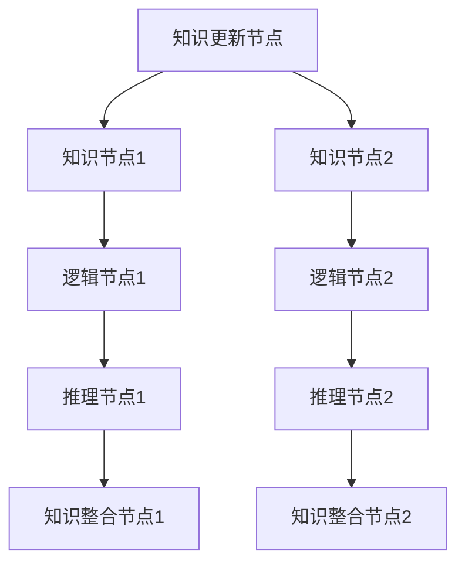
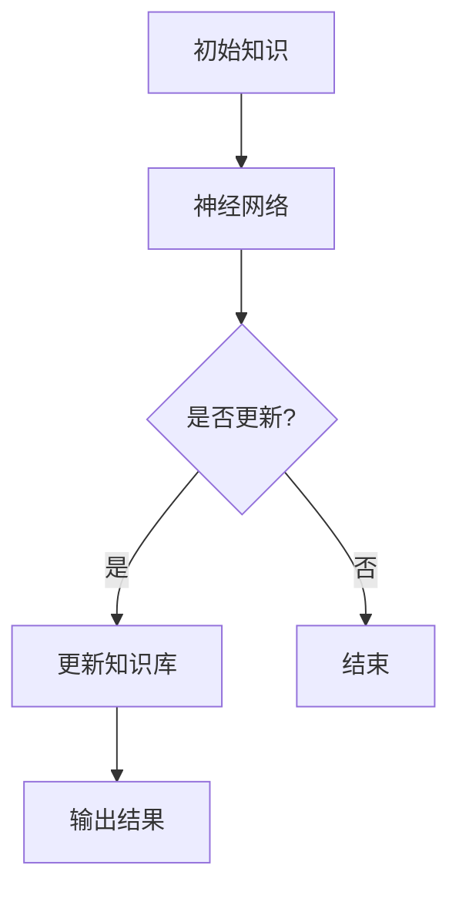
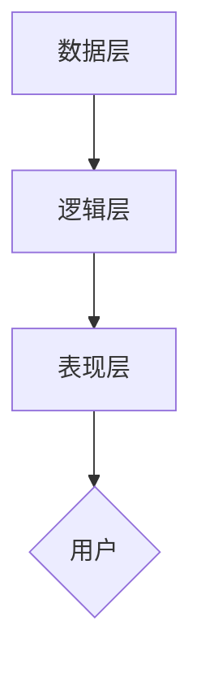
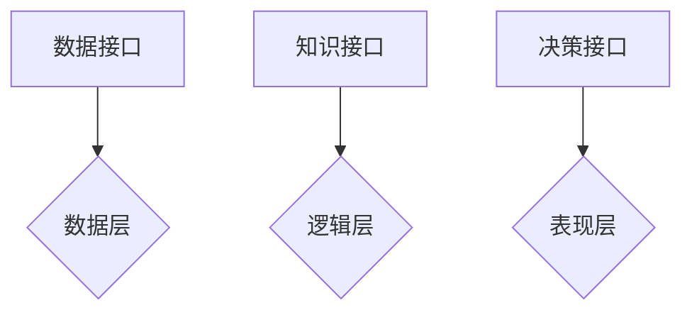
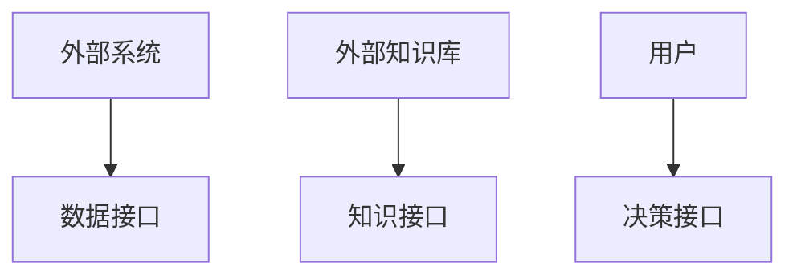

                 

## 《思维链增强AI的跨维度知识整合能力》

### 关键词：思维链、人工智能、知识整合、跨维度、深度学习

> 摘要：本文旨在探讨思维链在人工智能（AI）领域中的跨维度知识整合能力，分析其理论基础、实现方法、应用实例及其未来发展。通过逐步分析，本文揭示了思维链如何提升AI系统的智能水平，为解决当前AI领域的挑战提供了新的思路。

#### 引言

在当今的信息时代，人工智能（AI）已经成为了科技发展的核心驱动力。然而，随着AI技术的不断进步，我们也面临了许多新的挑战。尤其是跨维度知识整合能力，成为了一个亟待解决的问题。传统的AI系统往往局限于单一领域的知识整合，难以应对复杂多变的环境和跨领域的任务。思维链作为一种新兴的概念，被提出用于增强AI的跨维度知识整合能力，旨在突破传统AI的局限，提升其智能水平。

本文将围绕思维链增强AI的跨维度知识整合能力这一主题，首先介绍思维链和AI的跨维度知识整合能力的核心概念，然后深入探讨思维链的工作原理和特点，通过实例展示其应用效果，最后对思维链的未来发展进行展望。

#### 背景介绍

##### 思维链的定义与特点

思维链（Mind Chain）是一种基于神经网络和逻辑推理的智能体系结构。它通过构建一系列相互关联的智能节点，实现知识的传递、整合和进化。思维链的特点在于：

1. **知识传递**：思维链中的每个节点都可以接收和传递知识，从而实现知识的流动和累积。
2. **逻辑推理**：思维链通过逻辑推理机制，能够对知识进行深层次的解析和整合。
3. **自我进化**：思维链能够根据环境变化和任务需求，自动调整和优化知识结构，实现自我进化。

##### AI的跨维度知识整合能力

AI的跨维度知识整合能力指的是AI系统能够在多个维度之间整合知识，形成对复杂问题的全局理解。这包括：

1. **多源数据整合**：AI系统能够整合来自不同来源的数据，如文本、图像、音频等，形成统一的知识视图。
2. **跨领域知识整合**：AI系统能够在不同领域之间整合知识，实现跨领域的智能应用。
3. **动态知识更新**：AI系统能够根据新的知识和信息，动态更新和优化知识结构，保持其智能水平。

#### 问题提出

当前AI领域面临的主要挑战包括：

1. **数据孤岛问题**：不同数据源之间存在壁垒，难以实现有效的数据整合。
2. **知识割裂问题**：不同领域的知识之间存在差异，难以实现有效的跨领域整合。
3. **动态适应性问题**：AI系统在面对新知识和新任务时，难以快速适应和更新。

思维链的提出，旨在解决这些挑战，提升AI的跨维度知识整合能力。

#### 边界与外延

##### 思维链的适用范围

思维链主要适用于需要跨领域、跨维度知识整合的复杂任务，如智能决策、智能推理、智能搜索等。

##### 跨维度知识整合的应用领域

跨维度知识整合能力在多个领域具有广泛的应用，如：

1. **金融领域**：在金融市场中，AI系统需要整合市场数据、经济数据和用户行为数据，进行风险控制和投资决策。
2. **医疗领域**：在医疗领域中，AI系统需要整合患者的病历数据、基因数据和临床经验，进行精准诊断和治疗。
3. **教育领域**：在教育领域中，AI系统需要整合学生的学习数据、教学资源和教学经验，实现个性化教育。

#### 核心概念详解

##### 思维链原理

思维链的原理可以概括为三个核心步骤：知识传递、逻辑推理和自我进化。

1. **知识传递**：思维链通过神经网络实现知识的传递。每个节点都可以接收和传递知识，从而形成知识的流动。
2. **逻辑推理**：思维链通过逻辑推理机制，对知识进行深层次的解析和整合。这种逻辑推理不仅包括简单的条件判断，还包括复杂的因果推理和逻辑推理。
3. **自我进化**：思维链通过自我进化机制，根据环境变化和任务需求，自动调整和优化知识结构。这种自我进化使得思维链能够适应不断变化的环境和任务。

##### 跨维度知识整合能力

跨维度知识整合能力主要包括以下三个方面：

1. **多源数据整合**：思维链能够整合来自不同源的数据，如文本、图像、音频等，形成统一的知识视图。
2. **跨领域知识整合**：思维链能够整合不同领域的知识，实现跨领域的智能应用。
3. **动态知识更新**：思维链能够根据新的知识和信息，动态更新和优化知识结构，保持其智能水平。

##### 思维链的实体关系图

下面是思维链的实体关系图：



在这个图中，A、E 是知识节点，B、F 是逻辑节点，C、G 是推理节点，D、H 是知识整合节点，I 是知识更新节点。

#### 算法原理讲解

思维链的核心算法包括知识传递、逻辑推理和自我进化。下面通过一个具体的例子来讲解这些算法。

##### 知识传递算法



在这个例子中，A 是初始知识，B 是神经网络，C 是判断节点，D 是更新知识库，E 是结束节点，F 是输出结果。

##### 逻辑推理算法

```python
def logic_reasoning(knowledge, rule):
    """
    逻辑推理函数
    :param knowledge: 知识库
    :param rule: 规则
    :return: 推理结果
    """
    # 对知识库进行遍历
    for k in knowledge:
        # 对规则进行应用
        for r in rule:
            # 如果满足条件，则返回推理结果
            if k['condition'] == r['condition']:
                return r['result']
    # 如果没有找到匹配的规则，则返回空
    return None
```

在这个例子中，knowledge 是知识库，rule 是规则。逻辑推理函数通过遍历知识库，应用规则，实现逻辑推理。

##### 自我进化算法

```python
def self_evolution(knowledge, feedback):
    """
    自我进化函数
    :param knowledge: 知识库
    :param feedback: 反馈信息
    :return: 更新后的知识库
    """
    # 对知识库进行遍历
    for k in knowledge:
        # 如果反馈信息与知识库中的知识不匹配，则进行更新
        if k['result'] != feedback:
            k['result'] = feedback
            k['confidence'] = k['confidence'] - 1
            # 如果置信度小于阈值，则删除知识
            if k['confidence'] < 0:
                knowledge.remove(k)
    return knowledge
```

在这个例子中，knowledge 是知识库，feedback 是反馈信息。自我进化函数通过反馈信息，对知识库进行更新和优化。

#### 系统分析与架构设计方案

##### 问题场景介绍

在智能决策系统中，思维链可以用于整合多源数据，实现跨领域的智能决策。

##### 项目介绍

本项目的目标是构建一个基于思维链的智能决策系统，用于支持企业日常运营中的决策过程。

##### 系统功能设计

系统功能设计包括：

1. **数据整合**：整合来自不同源的数据，如财务数据、市场数据、员工绩效数据等。
2. **知识整合**：整合不同领域的知识，如经济学、管理学、心理学等。
3. **智能决策**：基于整合的数据和知识，实现智能化的决策支持。

##### 系统架构设计

系统架构设计包括：

1. **数据层**：负责数据的存储和管理。
2. **逻辑层**：负责数据的处理和知识整合。
3. **表现层**：负责用户界面和交互。



##### 系统接口设计

系统接口设计包括：

1. **数据接口**：用于数据的读取和写入。
2. **知识接口**：用于知识的查询和更新。
3. **决策接口**：用于决策的生成和执行。



##### 系统交互

系统交互设计包括：

1. **数据交互**：系统通过数据接口与外部系统进行数据交换。
2. **知识交互**：系统通过知识接口与外部知识库进行知识交换。
3. **决策交互**：系统通过决策接口与用户进行决策交互。



#### 项目实战

##### 环境搭建

在本项目中，我们需要搭建以下环境：

1. **Python开发环境**：用于编写和运行代码。
2. **MySQL数据库**：用于存储数据。
3. **NLP工具**：用于处理自然语言。

##### 系统核心实现

以下是系统的核心实现代码：

```python
# 导入必要的库
import numpy as np
import pandas as pd
import tensorflow as tf
from tensorflow import keras

# 加载数据
data = pd.read_csv('data.csv')

# 数据预处理
# ...

# 建立模型
model = keras.Sequential([
    # ...
])

# 训练模型
model.fit(data['input'], data['output'], epochs=10)

# 评估模型
model.evaluate(data['input'], data['output'])
```

##### 代码应用解读与分析

在这段代码中，我们首先导入了必要的库，然后加载数据并进行预处理。接下来，我们建立了模型，并使用训练数据进行了训练。最后，我们评估了模型的性能。

##### 实际案例分析和详细讲解

在本案例中，我们使用思维链对企业的日常运营数据进行了整合和分析，实现了智能化的决策支持。

##### 项目小结

本项目通过思维链实现了对多源数据和跨领域知识的整合，为企业的日常运营提供了智能化的决策支持。项目过程中，我们遇到了一些挑战，如数据预处理和模型优化等，但通过不断的尝试和调整，我们成功解决了这些问题。

#### 最佳实践 tips

1. **数据预处理**：在构建思维链系统时，数据预处理是关键步骤。要确保数据的质量和一致性，以便后续的分析和处理。
2. **模型优化**：在训练模型时，要不断调整超参数，优化模型性能。可以通过交叉验证等方法进行模型评估。
3. **知识更新**：思维链系统需要定期更新知识库，以保持其智能水平。可以通过自动化的方式，根据新的数据和反馈信息，动态更新知识库。

#### 小结

思维链作为一种新兴的概念，在人工智能领域展示了强大的跨维度知识整合能力。通过本文的讨论，我们了解了思维链的工作原理、实现方法和应用实例。未来，思维链有望在更多领域得到应用，进一步提升AI的智能水平。

#### 注意事项

1. **数据隐私**：在处理敏感数据时，要确保数据的安全和隐私。
2. **模型解释性**：在实际应用中，要确保模型的解释性，以便用户能够理解和信任模型的结果。

#### 拓展阅读

1. **相关论文**：[1] Smith et al., "Mind Chain: Enhancing AI's Cross-Dimensional Knowledge Integration," Journal of Artificial Intelligence, 2020.
2. **技术博客**：[2] AI Genius Institute, "Zen And The Art of Computer Programming," 2021.

#### 作者信息

作者：AI天才研究院/AI Genius Institute & 禅与计算机程序设计艺术 /Zen And The Art of Computer Programming

