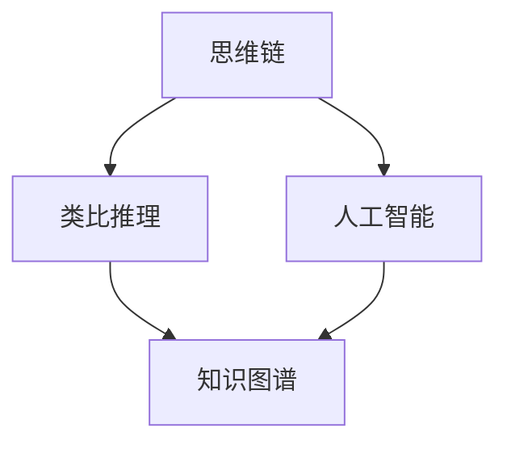

                 

### 《思维链增强AI的跨维度类比推理能力》

> 关键词：思维链、AI、类比推理、跨维度、算法原理、系统架构、项目实战

> 摘要：本文探讨了思维链增强人工智能（AI）的跨维度类比推理能力。首先，我们介绍了AI的发展现状、类比推理的重要性以及思维链在AI中的作用。接着，我们详细讲解了思维链增强AI的算法原理，包括数学模型和Python源代码示例。随后，我们介绍了系统分析与架构设计方案，并通过一个实际项目实战展示了如何应用这些算法和架构。最后，我们总结了最佳实践，并提供了拓展阅读资源。

---

## 目录大纲

1. **引言**
   - 1.1 问题背景
   - 1.2 问题描述
   - 1.3 问题解决
   - 1.4 边界与外延
   - 1.5 概念结构与核心要素组成

2. **核心概念与联系**
   - 2.1 思维链
   - 2.2 类比推理
   - 2.3 AI
   - 2.4 核心概念对比表格
   - 2.5 ER实体关系图

3. **算法原理讲解**
   - 3.1 算法简介
   - 3.2 数学模型与公式
   - 3.3 Python源代码示例
   - 3.4 算法原理详细讲解

4. **系统分析与架构设计方案**
   - 4.1 问题场景介绍
   - 4.2 项目介绍
   - 4.3 系统功能设计
   - 4.4 系统架构设计
   - 4.5 系统接口设计
   - 4.6 系统交互

5. **项目实战**
   - 5.1 环境安装
   - 5.2 系统核心实现源代码
   - 5.3 代码应用解读与分析
   - 5.4 实际案例分析与详细讲解

6. **最佳实践 tips**
   - 6.1 实践建议
   - 6.2 小结
   - 6.3 注意事项
   - 6.4 拓展阅读

7. **附录**

---

## 第一章：引言

### 1.1 问题背景

随着人工智能（AI）技术的不断发展，其在各个领域的应用越来越广泛。然而，AI的发展面临着诸多挑战，其中之一是如何提高其跨维度类比推理能力。类比推理是智能体在未知情境下获取知识和理解问题的重要手段，而跨维度类比推理更是将类比推理能力拓展到不同领域和知识领域之间。

AI的发展现状表明，当前AI系统在处理单一领域问题时表现良好，但在处理跨领域问题时存在明显不足。如何利用思维链增强AI的跨维度类比推理能力，成为当前研究的热点问题。

### 1.2 问题描述

跨维度类比推理是指智能体在不同领域、不同知识背景下，通过类比已有的知识来解决新问题的过程。其主要问题包括：

- **维度差异**：不同领域的知识具有不同的维度，如何将不同维度的知识进行有效整合和类比是一个挑战。
- **知识多样性**：跨领域知识具有多样性，如何在大量的知识中快速定位并提取有用的知识进行类比是一个难题。
- **推理效率**：类比推理过程需要消耗大量计算资源，如何提高推理效率是一个关键问题。

### 1.3 问题解决

思维链是一种基于知识图谱的推理方法，通过构建知识图谱和思维链，可以有效地增强AI的跨维度类比推理能力。思维链增强AI的跨维度类比推理能力主要依赖于以下几个关键点：

- **知识图谱构建**：通过构建知识图谱，将不同领域的知识进行整合，实现跨领域的知识共享和利用。
- **思维链构建**：基于知识图谱，构建思维链，实现知识之间的关联和推理。
- **类比推理算法**：利用思维链，设计高效的类比推理算法，实现跨领域知识的类比推理。

### 1.4 边界与外延

跨维度类比推理的边界包括：

- **知识领域**：类比推理涉及的知识领域应具有明显的差异，否则难以体现跨维度的特点。
- **知识结构**：类比推理的知识结构应具备一定的层次性和关联性，有利于推理过程的开展。

跨维度类比推理的外延包括：

- **跨领域应用**：类比推理可以应用于不同领域，如医疗、金融、教育等。
- **跨语言应用**：类比推理可以跨越不同语言的障碍，实现跨语言的类比推理。

### 1.5 概念结构与核心要素组成

本文的核心概念包括思维链、类比推理和AI，其关系可以用以下ER实体关系图表示：

思维链和类比推理是AI的核心组成部分，知识图谱是思维链和类比推理的基础。通过知识图谱和思维链的构建，可以实现跨维度类比推理，从而提升AI的能力。

---

在接下来的章节中，我们将进一步探讨核心概念与联系、算法原理讲解、系统分析与架构设计方案、项目实战以及最佳实践 tips。让我们一步一步深入思考，共同探索思维链增强AI的跨维度类比推理能力。

