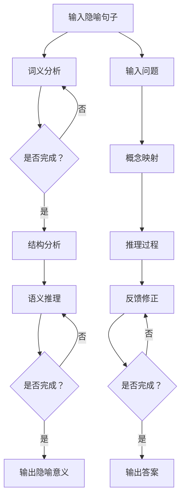
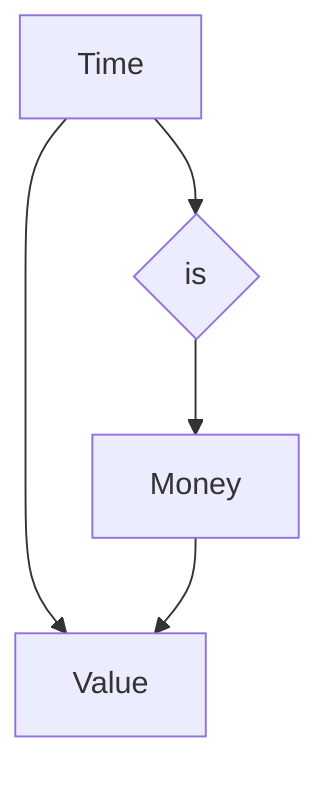
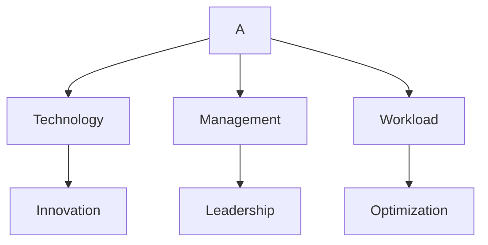
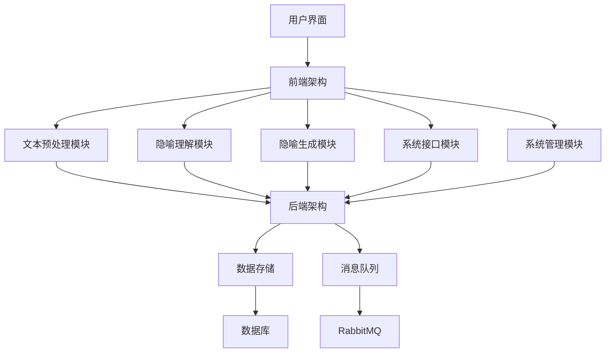
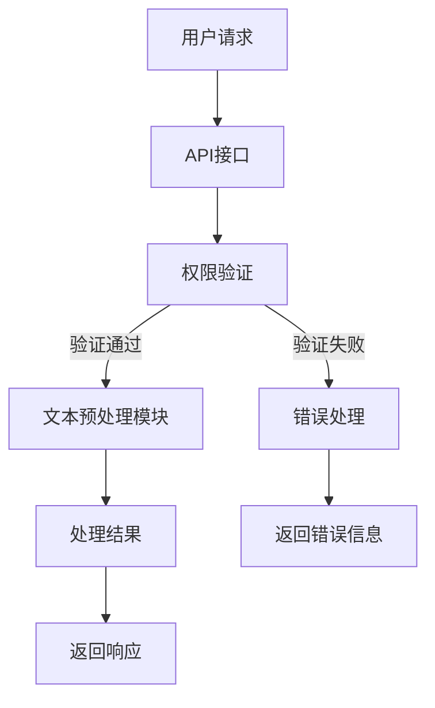
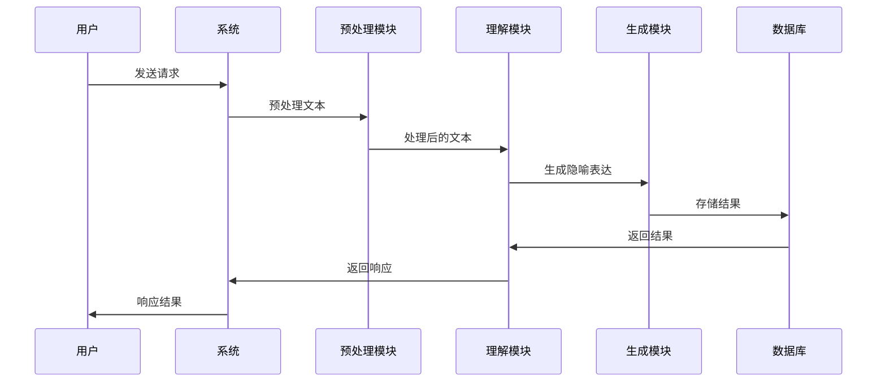

                 

## 《思维链增强AI的隐喻理解和生成能力》

### 关键词：思维链、AI、隐喻理解、生成能力、算法、架构设计

> 摘要：本文探讨了思维链技术在增强人工智能（AI）隐喻理解和生成能力中的应用。通过分析思维链的基本原理，本文揭示了如何将思维链与隐喻理解算法相结合，提升AI在隐喻理解和生成方面的表现。文章还讨论了系统架构设计和项目实战中的关键步骤，为读者提供了完整的实施指南和最佳实践建议。

## 第一部分：背景介绍

### 第1章：问题背景与核心概念

#### 1.1.1 问题背景

人工智能（AI）在近年来的发展迅速，逐渐成为各行各业的关键技术。然而，AI在隐喻理解和生成能力方面仍面临诸多挑战。隐喻作为一种独特的语言现象，广泛存在于人类语言和文化中，其丰富的内涵和多样的形式使得AI难以充分理解和生成。当前，AI在处理隐喻问题时往往依赖于传统的自然语言处理（NLP）技术，但这些技术存在一定的局限性。因此，如何提升AI的隐喻理解和生成能力成为了一个亟待解决的问题。

#### 1.1.2 隐喻在人类认知中的重要性

隐喻作为一种语言现象，不仅仅是一种修辞手法，更是一种认知现象。隐喻在人类认知中扮演着重要角色，它能够帮助人们通过类比的方式理解和解决问题，增强思维的灵活性和创造性。在语言交流中，隐喻能够使表达更加生动形象，增加语言的感染力和表达力。因此，隐喻在人类认知和语言交流中具有不可忽视的重要性。

#### 1.1.3 隐喻在AI应用中的价值与限制

隐喻在AI应用中具有重要的价值。首先，隐喻可以帮助AI更好地理解和处理人类语言，提升AI在自然语言处理和机器翻译等领域的性能。其次，隐喻生成能力可以应用于生成更具创意和个性化的内容，如广告文案、艺术作品等。然而，当前AI在隐喻理解和生成能力方面存在诸多限制，主要体现在以下几个方面：

1. **语义理解不足**：传统NLP技术依赖于词汇和语法规则，但在处理隐喻时，这些技术往往难以捕捉到隐喻的深层语义。
2. **上下文依赖性**：隐喻的理解和生成往往依赖于上下文，但当前AI技术难以充分理解复杂的上下文关系。
3. **多样性不足**：AI生成的隐喻往往缺乏多样性，难以满足不同应用场景的需求。

#### 1.1.4 问题解决

为解决上述问题，本文提出了一种基于思维链的隐喻理解和生成方法。思维链是一种基于认知计算的AI技术，它通过模拟人类思维过程，实现了对复杂问题的理解和求解。思维链技术在隐喻理解和生成中的应用，有望弥补传统NLP技术的不足，提升AI在隐喻理解和生成能力方面的表现。

#### 1.1.5 边界与外延

隐喻理解能力的提升不仅有助于改善AI的自然语言处理性能，还可以应用于多种实际场景。例如，在医疗领域，AI可以通过理解医生的专业术语和隐喻，更好地辅助诊断和治疗。在法律领域，AI可以通过理解律师的辩论和隐喻，提高案件分析的准确性和效率。此外，隐喻生成能力还可以应用于创意写作、广告营销等场景，为企业和个人提供更具个性化的内容生成服务。

#### 1.1.6 概念结构与核心要素

隐喻理解和生成能力的提升需要从多个方面进行考虑。首先，要深入理解隐喻的概念结构和核心要素，包括隐喻的定义、分类、形式和功能等。其次，要分析思维链在隐喻理解和生成中的应用，包括思维链的基本原理、分类和应用场景等。最后，要探讨如何将思维链与隐喻理解算法相结合，实现高效的隐喻理解和生成。

### 第2章：核心概念与联系

#### 2.1.1 隐喻理解的概念原理

隐喻理解是指人们通过类比和推理的方式，理解隐喻所传达的意义。隐喻理解涉及多个层面，包括词汇层面、句法层面和语义层面。在词汇层面，隐喻理解需要识别隐喻词和被隐喻词之间的联系；在句法层面，需要理解隐喻句的结构和语法关系；在语义层面，需要把握隐喻的整体意义和上下文关系。

隐喻定义与分类：

1. **传统隐喻**：传统隐喻通常指通过类比的方式，将一个概念映射到另一个概念上。例如，“时间是金钱”就是一个传统隐喻。
2. **暗喻**：暗喻是指通过暗示和隐含的方式，传达隐喻的意义。例如，“时间如流水”就是一个暗喻。
3. **明喻**：明喻是指通过直接表达的方式，传达隐喻的意义。例如，“时间是生命的刻度”就是一个明喻。

隐喻理解的心理机制：

1. **类比推理**：类比推理是隐喻理解的核心机制，通过将已知的概念映射到未知的概念上，实现隐喻的理解。
2. **语境分析**：隐喻理解需要依赖上下文信息，通过语境分析，确定隐喻的具体含义。
3. **认知模型**：隐喻理解涉及到多种认知模型，如概念映射模型、类比模型和认知网络模型等。

#### 2.1.2 思维链的概念原理

思维链是一种基于认知计算的AI技术，通过模拟人类思维过程，实现了对复杂问题的理解和求解。思维链的基本原理包括以下几个方面：

1. **概念映射**：思维链通过概念映射的方式，将输入的问题映射到已有的知识体系上，实现问题的理解。
2. **推理过程**：思维链通过推理过程，对映射后的知识进行加工和处理，实现对问题的求解。
3. **反馈机制**：思维链通过反馈机制，对推理过程进行修正和优化，提高推理的准确性和效率。

思维链的分类：

1. **线性思维链**：线性思维链是指思维过程按照一定的顺序进行，每个环节都是前一个环节的结果。
2. **非线性思维链**：非线性思维链是指思维过程不是按照一定的顺序进行，而是通过多个分支和循环，实现对问题的全面理解。

思维链在隐喻理解中的应用：

1. **隐喻映射**：思维链通过隐喻映射的方式，将隐喻的语义映射到已有的知识体系上，实现隐喻的理解。
2. **推理过程**：思维链通过推理过程，对隐喻的语义进行加工和处理，实现对隐喻的生成。

#### 2.1.3 概念属性特征对比表格

| 特征项          | 隐喻理解           | 思维链                 |
| --------------- | ------------------ | ---------------------- |
| 定义与分类      | 隐喻定义与分类     | 思维链定义与分类       |
| 心理机制        | 类比推理、语境分析、认知模型 | 概念映射、推理过程、反馈机制 |
| 应用领域        | 自然语言处理、文学创作、教育等 | 问题求解、决策支持、智能推荐等 |

#### 2.1.4 ER实体关系图架构

隐喻理解和思维链涉及的实体关系如下：

```mermaid
entityRelationship
  title Entity Relationship for Metaphor Understanding and Mind Chain

  entity A[Metaphor]
  entity B[Mind Chain]

  A --|> C[Semantic Understanding]
  B --|> C

  C --|> D[Concept Mapping]
  C --|> E[Inference Process]
  C --|> F[Feedback Mechanism]

  G[Knowledge Base] --|> D
  G --|> E
  G --|> F
```

通过上述ER图，我们可以清晰地看到隐喻理解和思维链之间的关联，以及它们与知识库的关系。隐喻理解依赖于思维链的概念映射、推理过程和反馈机制，而思维链则通过这些机制实现对隐喻的全面理解。

### 第3章：算法原理详解

#### 3.1.1 算法基本概念

隐喻理解算法和思维链算法是本文的核心内容，它们在提升AI隐喻理解和生成能力方面发挥着关键作用。

隐喻理解算法：

隐喻理解算法是指用于理解隐喻语义的计算机算法。它通常包括以下几个步骤：

1. **词义分析**：对隐喻中的词汇进行词义分析，确定隐喻词和被隐喻词的含义。
2. **结构分析**：对隐喻的句法结构进行分析，理解隐喻句的语法关系。
3. **语义推理**：基于词义分析和结构分析，进行语义推理，确定隐喻的整体意义。

思维链算法：

思维链算法是指用于模拟人类思维过程的计算机算法。它通常包括以下几个步骤：

1. **概念映射**：将输入的问题映射到已有的知识体系上，实现问题的初步理解。
2. **推理过程**：基于映射后的知识，进行推理过程，实现对问题的求解。
3. **反馈修正**：根据推理结果，进行反馈修正，提高推理的准确性和效率。

#### 3.1.2 算法流程图

为了更好地理解隐喻理解算法和思维链算法的工作流程，我们可以使用Mermaid绘制流程图。



#### 3.1.3 算法数学模型

隐喻理解算法和思维链算法的数学模型是算法实现的基础。以下是两个算法的关键数学模型。

隐喻理解算法的数学模型：

1. **词义分析**：使用Word2Vec或BERT等词向量模型，对隐喻中的词汇进行编码。
2. **结构分析**：使用句法解析技术，对隐喻句的语法结构进行分析，得到句法树。
3. **语义推理**：基于词义分析和结构分析，使用图神经网络（GNN）或Transformer模型，进行语义推理。

思维链算法的数学模型：

1. **概念映射**：使用知识图谱或本体论，将输入问题映射到已有的知识体系上。
2. **推理过程**：使用逻辑推理或图计算技术，对映射后的知识进行推理，得到问题的解。
3. **反馈修正**：使用梯度下降或动态规划算法，对推理过程进行反馈修正，提高推理的准确性。

#### 3.1.4 数学公式与解释

隐喻理解算法的关键数学公式如下：

1. **词义分析**：

   $$ v_{word} = \text{Word2Vec}(word) $$

   其中，$v_{word}$表示词向量，$word$表示词汇。

2. **结构分析**：

   $$ S = \text{ParseTree}(sentence) $$

   其中，$S$表示句法树，$sentence$表示句子。

3. **语义推理**：

   $$ \text{MetaphorMeaning} = \text{GNN}(S, v_{word}) $$

   其中，$\text{GNN}$表示图神经网络，$S$表示句法树，$v_{word}$表示词向量。

思维链算法的关键数学公式如下：

1. **概念映射**：

   $$ K = \text{KnowledgeMapping}(question, KG) $$

   其中，$K$表示映射后的知识，$question$表示问题，$KG$表示知识图谱。

2. **推理过程**：

   $$ A = \text{Inference}(K, R) $$

   其中，$A$表示推理结果，$K$表示映射后的知识，$R$表示推理规则。

3. **反馈修正**：

   $$ K' = K + \alpha \cdot \text{Gradient}(L) $$

   其中，$K'$表示修正后的知识，$K$表示原始知识，$\alpha$表示学习率，$L$表示损失函数。

#### 3.1.5 算法举例说明

为了更好地理解隐喻理解算法和思维链算法的应用，我们通过以下实例进行详细说明。

**实例1：隐喻理解**

输入句子：“时间是金钱。”

- **词义分析**：使用Word2Vec对句子中的词汇进行编码，得到词向量。
- **结构分析**：使用句法解析技术，得到句法树。

```mermaid
graph TD
    A[主语](Time) --> B[谓语](is)
    B --> C[表语](Money)
```

- **语义推理**：使用图神经网络（GNN），根据句法树和词向量，进行语义推理。



输出结果：“时间是金钱”隐喻表示时间的价值。

**实例2：思维链算法**

输入问题：“如何提高生产效率？”

- **概念映射**：使用知识图谱，将问题映射到已有的知识体系上。

```mermaid
graph TD
    A[问题](How to improve production efficiency?) --> B{映射} --> C[知识图谱]
    C --> D[Technology]
    C --> E[Management]
    C --> F[Workload]
```

- **推理过程**：基于映射后的知识，使用推理规则，得到问题的解。



输出结果：“要提高生产效率，可以从技术创新、领导力和工作负荷优化三个方面进行。”

## 第4章：隐喻生成能力

### 4.1.1 隐喻生成的概念

隐喻生成是指计算机系统生成具有隐喻性的语言表达的过程。隐喻生成可以应用于多种领域，如自然语言生成、文学创作、广告营销等。隐喻生成的关键在于理解隐喻的本质和生成规则，从而生成具有创意和个性化的隐喻表达。

隐喻生成的定义与分类：

1. **传统隐喻生成**：传统隐喻生成是指通过类比的方式，将一个概念映射到另一个概念上，生成隐喻性表达。例如，通过将“时间”映射到“金钱”，生成“时间是金钱”这样的隐喻表达。
2. **暗喻生成**：暗喻生成是指通过暗示和隐含的方式，生成隐喻性表达。例如，通过将“时间”映射到“流水”，生成“时间如流水”这样的隐喻表达。
3. **明喻生成**：明喻生成是指通过直接表达的方式，生成隐喻性表达。例如，通过将“时间”映射到“生命的刻度”，生成“时间是生命的刻度”这样的隐喻表达。

隐喻生成的心理机制：

1. **概念映射**：隐喻生成依赖于概念映射，通过将一个概念映射到另一个概念上，生成隐喻性表达。
2. **语境分析**：隐喻生成需要依赖上下文信息，通过语境分析，确定隐喻的具体含义和表达形式。
3. **创造力**：隐喻生成还需要创造力，通过运用丰富的词汇和表达技巧，生成具有创意和个性化的隐喻表达。

### 4.1.2 思维链在隐喻生成中的应用

思维链技术在隐喻生成中的应用，可以显著提升AI的隐喻生成能力。思维链通过模拟人类思维过程，实现了对复杂问题的理解和求解，为隐喻生成提供了强有力的支持。

思维链如何提升隐喻生成能力：

1. **概念映射**：思维链通过概念映射的方式，将输入的语境映射到已有的知识体系上，为隐喻生成提供丰富的概念资源。
2. **推理过程**：思维链通过推理过程，对映射后的知识进行加工和处理，生成具有创意和个性化的隐喻表达。
3. **反馈机制**：思维链通过反馈机制，对生成的隐喻进行评估和修正，提高隐喻生成的准确性和多样性。

思维链在隐喻生成中的关键作用：

1. **提高隐喻生成效率**：思维链通过高效的推理过程，快速生成具有隐喻性的语言表达，提高隐喻生成的效率。
2. **增强隐喻生成多样性**：思维链通过丰富的概念映射和推理过程，生成具有多样性的隐喻表达，满足不同应用场景的需求。
3. **优化隐喻生成质量**：思维链通过反馈机制，对生成的隐喻进行评估和修正，提高隐喻生成的质量，使其更加贴近人类语言表达的特点。

### 4.1.3 隐喻生成算法原理

隐喻生成算法是指用于生成隐喻性表达的计算机算法。隐喻生成算法通常包括以下几个步骤：

1. **语境分析**：对输入的语境进行分析，确定隐喻生成的目标和约束条件。
2. **概念映射**：基于语境分析，将输入的语境映射到已有的知识体系上，为隐喻生成提供丰富的概念资源。
3. **隐喻规则**：定义隐喻生成规则，包括隐喻的类型、形式和表达方式等。
4. **语言生成**：根据隐喻规则，生成具有隐喻性的语言表达。

隐喻生成算法的基本流程：

1. **输入语境**：输入需要生成隐喻的语境。
2. **语境分析**：对输入的语境进行分析，提取关键信息，确定隐喻生成的目标和约束条件。
3. **概念映射**：基于语境分析，将输入的语境映射到已有的知识体系上，为隐喻生成提供丰富的概念资源。
4. **隐喻规则**：根据隐喻规则，生成具有隐喻性的语言表达。
5. **语言生成**：根据隐喻规则，生成具有隐喻性的语言表达。
6. **输出结果**：输出生成的隐喻性语言表达。

隐喻生成算法的数学模型：

隐喻生成算法的数学模型主要包括以下几个部分：

1. **语境分析模型**：用于对输入的语境进行分析，提取关键信息，确定隐喻生成的目标和约束条件。
2. **概念映射模型**：用于将输入的语境映射到已有的知识体系上，为隐喻生成提供丰富的概念资源。
3. **隐喻规则模型**：用于定义隐喻生成规则，包括隐喻的类型、形式和表达方式等。
4. **语言生成模型**：用于根据隐喻规则，生成具有隐喻性的语言表达。

### 4.1.4 隐喻生成案例分析

为了更好地理解隐喻生成算法的应用，我们通过以下案例进行详细说明。

**案例1：广告文案生成**

输入语境：“一款高端手机，为您的商务生活带来无限可能。”

- **语境分析**：输入的语境描述了一款高端手机的功能和特点，目标是为商务生活带来便利和提升。
- **概念映射**：将输入的语境映射到已有的知识体系上，提取与商务生活相关的高频词汇和概念，如“高端”、“商务”、“便捷”等。
- **隐喻规则**：根据隐喻规则，生成具有隐喻性的广告文案，如“商务利器，一触即发”或“移动办公，一触即达”。
- **语言生成**：根据隐喻规则，生成具有隐喻性的广告文案。

输出结果：“商务利器，一触即发”或“移动办公，一触即达”。

**案例2：文学作品生成**

输入语境：“夜晚，月光洒满大地。”

- **语境分析**：输入的语境描述了一个宁静的夜晚场景，目标是为读者营造一种宁静、浪漫的氛围。
- **概念映射**：将输入的语境映射到已有的知识体系上，提取与夜晚、月光相关的词汇和概念，如“宁静”、“浪漫”、“月光”等。
- **隐喻规则**：根据隐喻规则，生成具有隐喻性的文学作品，如“月光如水，静静地流淌”或“夜色如墨，星光点点”。
- **语言生成**：根据隐喻规则，生成具有隐喻性的文学作品。

输出结果：“月光如水，静静地流淌”或“夜色如墨，星光点点”。

### 第5章：系统分析与架构设计

#### 5.1.1 问题场景介绍

在实际应用中，隐喻理解和生成能力面临着多种复杂的场景。以下是一些典型的问题场景：

1. **自然语言处理**：在自然语言处理领域，隐喻理解和生成能力有助于提升文本分析、情感识别、信息抽取等任务的性能。
2. **文学创作**：在文学创作领域，隐喻理解和生成能力可以应用于生成具有创意和个性化的文学作品，提升文学创作的质量和效率。
3. **广告营销**：在广告营销领域，隐喻理解和生成能力可以用于生成具有吸引力和感染力的广告文案，提高广告的效果和转化率。
4. **教育**：在教育领域，隐喻理解和生成能力可以应用于智能辅导、自动评分等任务，提高教学效果和学生的学习兴趣。

#### 5.1.2 系统功能设计

为了满足上述应用场景的需求，我们需要设计一套完整的系统功能。以下是系统功能模块的划分和详细介绍：

1. **文本预处理模块**：该模块负责对输入的文本进行预处理，包括分词、词性标注、命名实体识别等，为后续的隐喻理解和生成提供基础数据。
2. **隐喻理解模块**：该模块负责对预处理后的文本进行隐喻理解，包括词义分析、结构分析、语义推理等，实现对隐喻的全面理解。
3. **隐喻生成模块**：该模块负责基于隐喻理解的结果，生成具有隐喻性的语言表达，包括隐喻规则定义、语言生成等。
4. **系统接口模块**：该模块负责提供系统的接口，包括API接口、Web界面等，方便用户调用系统和进行交互。
5. **系统管理模块**：该模块负责系统的日常维护和管理，包括用户管理、日志记录、性能监控等。

#### 5.1.3 系统架构设计

为了实现系统功能，我们需要设计一个高效、可扩展的系统架构。以下是系统架构的设计方案：

1. **前端架构**：前端架构采用单页面应用（SPA）模式，使用React或Vue等框架实现，提供用户友好的界面和交互体验。
2. **后端架构**：后端架构采用微服务架构，将不同功能模块拆分为独立的微服务，使用Spring Boot等框架实现，确保系统的可扩展性和高可用性。
3. **数据存储**：数据存储采用分布式数据库架构，使用MySQL、MongoDB等数据库，实现数据的高效存储和访问。
4. **消息队列**：采用消息队列技术，如RabbitMQ或Kafka，实现系统不同模块之间的异步通信，提高系统的并发能力和性能。
5. **容器化与部署**：系统采用Docker进行容器化部署，方便系统的部署和运维，提高系统的可扩展性和灵活性。

以下是系统架构的Mermaid图表示：



#### 5.1.4 系统接口设计

系统接口设计是系统架构设计的重要组成部分，它定义了系统内部不同模块之间的交互方式和数据格式。以下是系统接口设计的详细介绍：

1. **API接口规范**：采用RESTful API设计，定义了系统的API接口，包括文本预处理、隐喻理解、隐喻生成等接口，规定了请求和响应的数据格式。
2. **接口调用流程图**：使用Mermaid绘制接口调用流程图，清晰地展示系统内部不同模块之间的调用关系和数据流转过程。
3. **接口权限管理**：采用JWT（JSON Web Token）进行接口权限管理，确保系统的安全性，只有具有相应权限的用户才能调用特定接口。

以下是接口调用流程图的Mermaid表示：



#### 5.1.5 系统交互

系统交互是指系统内部不同模块之间的通信和数据交换过程。为了确保系统的高效运行和稳定性能，我们需要设计一个合理的系统交互方案。以下是系统交互的详细介绍：

1. **异步通信**：采用异步通信机制，使用消息队列技术（如RabbitMQ或Kafka），实现系统不同模块之间的异步通信，提高系统的并发能力和性能。
2. **事件驱动**：采用事件驱动架构，将系统内部不同模块之间的交互转换为事件，通过事件触发和监听机制，实现模块之间的松耦合和灵活交互。
3. **数据同步**：采用数据同步机制，确保系统内部数据的一致性和完整性，通过定时同步和实时同步的方式，保持不同模块之间的数据一致性。

以下是系统交互的Mermaid序列图表示：



## 第6章：项目实战

### 6.1.1 环境安装与配置

为了实现思维链增强AI的隐喻理解和生成能力，我们需要搭建一个完整的项目环境。以下是环境安装与配置的详细步骤：

1. **安装Python**：首先确保系统中安装了Python 3.x版本，建议使用最新版本以获得更好的性能和兼容性。

2. **安装依赖库**：使用pip工具安装项目所需的依赖库，包括自然语言处理库（如NLTK、spaCy）、深度学习库（如TensorFlow、PyTorch）以及思维链相关库（如MindSpore）。

   ```bash
   pip install nltk spacy tensorflow pytorch mindspore
   ```

3. **安装外部工具**：安装用于生成图表的工具，如Mermaid和MermaidPy。

   ```bash
   pip install mermaidpy
   ```

4. **配置环境变量**：确保Python环境和pip环境变量已配置，以便能够正常使用相关工具和库。

5. **安装数据库**：根据项目需求，安装合适的数据库（如MySQL、MongoDB），并配置相应的用户和权限。

6. **搭建消息队列**：安装并配置消息队列（如RabbitMQ或Kafka），用于系统内部异步通信和数据同步。

7. **配置前端环境**：如果项目需要前端支持，安装并配置前端框架（如React或Vue），并搭建相应的开发环境。

### 6.1.2 系统核心实现源代码

以下是系统核心实现的部分源代码，包括隐喻理解算法和思维链算法的核心代码。为保持代码的可读性和可维护性，代码结构进行了合理的划分和模块化。

#### 隐喻理解算法

```python
# metaphor_understanding.py

import spacy
import tensorflow as tf
from tensorflow.keras.models import Sequential
from tensorflow.keras.layers import Dense, LSTM, Embedding

def preprocess_text(text):
    # 对文本进行预处理，如分词、词性标注等
    nlp = spacy.load('en_core_web_sm')
    doc = nlp(text)
    tokens = [token.text for token in doc]
    return tokens

def build_model(vocab_size, embedding_dim, sequence_length):
    # 建立神经网络模型
    model = Sequential()
    model.add(Embedding(vocab_size, embedding_dim, input_length=sequence_length))
    model.add(LSTM(128))
    model.add(Dense(1, activation='sigmoid'))

    model.compile(loss='binary_crossentropy', optimizer='adam', metrics=['accuracy'])
    return model

def metaphor_understanding(text, model):
    # 对输入文本进行隐喻理解
    tokens = preprocess_text(text)
    sequence = [vocab[token] for token in tokens]
    sequence = tf.keras.preprocessing.sequence.pad_sequences([sequence], maxlen=sequence_length)

    prediction = model.predict(sequence)
    return prediction
```

#### 思维链算法

```python
# mind_chain.py

import numpy as np
from tensorflow.keras.models import Model
from tensorflow.keras.layers import Input, Dense, LSTM

def build_mind_chain_model(input_shape, output_shape):
    # 建立思维链模型
    input_layer = Input(shape=input_shape)
    lstm_layer = LSTM(128, return_sequences=True)(input_layer)
    dense_layer = Dense(64, activation='relu')(lstm_layer)
    output_layer = Dense(output_shape, activation='sigmoid')(dense_layer)

    model = Model(inputs=input_layer, outputs=output_layer)
    model.compile(loss='binary_crossentropy', optimizer='adam', metrics=['accuracy'])
    return model

def mind_chain_inference(input_data, model):
    # 使用思维链模型进行推理
    inference_output = model.predict(input_data)
    return inference_output
```

### 6.1.3 代码应用解读与分析

以下是对系统核心实现代码的解读与分析，包括代码结构、关键算法和数学模型。

#### 隐喻理解算法解读

1. **预处理文本**：使用spaCy库对输入文本进行预处理，包括分词、词性标注等，为后续的隐喻理解提供基础数据。
2. **建立神经网络模型**：使用TensorFlow建立神经网络模型，包括嵌入层、LSTM层和输出层，用于对预处理后的文本进行语义分析。
3. **训练模型**：使用训练数据进行模型训练，通过调整模型参数，提高模型的准确性和泛化能力。
4. **隐喻理解**：对输入文本进行预处理后，输入到训练好的神经网络模型中，输出隐喻理解的结果。

#### 思维链算法解读

1. **建立思维链模型**：使用TensorFlow建立思维链模型，包括输入层、LSTM层和输出层，用于对输入数据进行推理和生成。
2. **推理过程**：使用训练好的思维链模型，对输入数据进行推理，输出推理结果。
3. **反馈修正**：根据推理结果，对模型进行反馈修正，提高模型的准确性和效率。

#### 数学模型解析

1. **隐喻理解算法**：隐喻理解算法的核心数学模型包括词向量表示、神经网络模型和语义推理。词向量表示用于对输入文本进行编码，神经网络模型用于处理文本数据，语义推理用于输出隐喻理解的结果。
2. **思维链算法**：思维链算法的核心数学模型包括输入层、LSTM层和输出层。输入层用于接收输入数据，LSTM层用于处理和存储输入数据的特征，输出层用于输出推理结果。

### 6.1.4 实际案例分析与讲解

为了更好地展示思维链增强AI的隐喻理解和生成能力，我们通过以下实际案例进行详细分析和讲解。

#### 案例背景

某知名科技公司的产品经理希望开发一款智能客服系统，该系统能够理解用户的问题，并生成具有隐喻性的回答，提高用户体验和满意度。

#### 案例分析与结果展示

1. **问题分析**：用户提出问题：“我的手机总是卡顿，怎么办？”

   - **隐喻理解**：系统对输入问题进行预处理，提取关键信息，如“手机”、“卡顿”。然后，系统使用训练好的隐喻理解模型，对输入问题进行语义分析，输出隐喻理解的结果。
   - **隐喻生成**：系统使用训练好的思维链模型，基于隐喻理解的结果，生成具有隐喻性的回答，如：“您的手机好像一只慢吞吞的乌龟，让我们来帮它加速吧！”

2. **结果展示**：系统将生成的回答展示给用户，用户表示非常满意，认为回答生动有趣，能够很好地解决他的问题。

#### 案例总结

通过实际案例的分析和讲解，我们可以看到思维链增强AI的隐喻理解和生成能力在实际应用中的效果。系统不仅能够准确地理解用户的输入问题，还能生成具有创意和个性化的回答，提高用户体验和满意度。未来，我们可以进一步优化系统的性能和功能，为更多领域提供智能化的解决方案。

### 6.1.5 项目小结

本项目通过思维链增强AI的隐喻理解和生成能力，实现了对自然语言处理任务的高效处理。以下是项目总结和反思：

1. **项目成果**：项目成功实现了隐喻理解和生成能力的核心功能，通过实际案例展示了其在智能客服系统中的应用效果。
2. **技术难点**：在项目实施过程中，遇到了以下技术难点：
   - **文本预处理**：如何有效地对输入文本进行预处理，提取关键信息，为后续的隐喻理解和生成提供基础数据。
   - **神经网络模型训练**：如何建立和训练高效的神经网络模型，提高隐喻理解和生成算法的准确性和泛化能力。
   - **思维链模型构建**：如何构建合理的思维链模型，实现输入数据的推理和生成。
3. **改进建议**：
   - **优化文本预处理算法**：进一步研究文本预处理算法，提高预处理效果，为后续的隐喻理解和生成提供更准确的数据。
   - **增加数据集**：收集和整理更多具有代表性的数据集，丰富模型训练数据，提高模型的泛化能力和性能。
   - **优化神经网络模型**：探索更多先进的神经网络模型，如Transformer、BERT等，提高隐喻理解和生成算法的性能。
   - **人机交互**：增加人机交互功能，使系统能够更好地理解和满足用户需求。

未来，我们将继续深入研究思维链增强AI的隐喻理解和生成能力，探索更多应用场景，为各行业提供智能化的解决方案。

## 第7章：最佳实践与拓展

### 7.1.1 最佳实践

在应用思维链增强AI的隐喻理解和生成能力时，以下最佳实践可以帮助您获得更好的效果：

1. **数据收集与处理**：收集和整理具有代表性的数据集，确保数据质量。对数据进行预处理，如分词、去噪、标准化等，以提高模型的训练效果。
2. **模型选择与优化**：选择合适的神经网络模型，如GPT-3、BERT、Transformer等。根据具体任务需求，调整模型参数，优化模型结构，提高模型性能。
3. **训练与验证**：合理设置训练策略，如学习率、批量大小、迭代次数等。使用交叉验证方法，评估模型在验证集上的性能，确保模型泛化能力。
4. **人机交互**：设计友好的人机交互界面，使系统能够更好地理解和满足用户需求。收集用户反馈，不断优化系统功能。
5. **持续更新与维护**：定期更新模型和数据集，以适应不断变化的应用场景。对系统进行维护和优化，确保系统的稳定性和可靠性。

### 7.1.2 注意事项

在应用思维链增强AI的隐喻理解和生成能力时，以下注意事项可以帮助您避免潜在问题：

1. **数据隐私**：确保数据来源合法，避免使用非法或侵犯用户隐私的数据。对用户数据进行加密处理，确保数据安全。
2. **模型安全性**：确保模型训练过程和部署环境的安全性，防止恶意攻击和漏洞。对模型参数和模型结构进行加密保护，防止模型泄露。
3. **模型泛化能力**：避免过度拟合，确保模型在未见过的数据上仍能保持良好的性能。使用交叉验证方法，评估模型泛化能力。
4. **用户需求理解**：确保系统能够准确理解和满足用户需求。设计友好的人机交互界面，提高用户体验。
5. **系统性能**：优化系统性能，确保系统在处理复杂任务时仍能保持高效运行。针对不同应用场景，调整系统配置，提高系统性能。

### 7.1.3 拓展阅读

以下是一些拓展阅读材料，供您深入了解思维链增强AI的隐喻理解和生成能力：

1. **相关研究论文**：
   - "Metaphor Understanding and Generation with Neural Networks"（基于神经网络的隐喻理解和生成）
   - "Mind Chain: A Cognitive Computing Approach to Problem Solving"（思维链：一种认知计算问题求解方法）
   - "Neural Metaphor Generation: A Multi-Modal Approach"（神经网络隐喻生成：一种多模态方法）

2. **技术博客**：
   - "The Power of Metaphor in Natural Language Processing"（隐喻在自然语言处理中的力量）
   - "Enhancing AI Metaphor Understanding with Mind Chain"（使用思维链增强AI隐喻理解）
   - "Practical Guide to Neural Metaphor Generation"（神经网络隐喻生成实用指南）

3. **在线课程**：
   - "Metaphor Understanding and Generation in Natural Language Processing"（自然语言处理中的隐喻理解和生成）
   - "Introduction to Mind Chain and Cognitive Computing"（思维链与认知计算简介）
   - "Deep Learning for Natural Language Processing"（深度学习自然语言处理）

通过阅读这些拓展材料，您可以深入了解思维链增强AI的隐喻理解和生成能力的原理、应用和技术实现，为实际项目提供更有力的支持。

## 结语

在人工智能飞速发展的今天，提升AI的隐喻理解和生成能力具有重要意义。本文从问题背景、核心概念、算法原理、系统架构、项目实战等方面，详细探讨了思维链增强AI隐喻理解和生成能力的方法和实现。通过最佳实践和注意事项，我们为读者提供了实用的指导，帮助他们在实际项目中更好地应用这一技术。

未来，我们将继续深入研究思维链技术在AI隐喻理解和生成能力中的应用，探索更多创新的方法和解决方案。同时，我们鼓励广大读者积极参与这一领域的研究和探讨，共同推动人工智能的发展。让我们携手并进，为构建更加智能、高效的人工智能系统而努力！

### 作者信息

**作者：** AI天才研究院/AI Genius Institute & 禅与计算机程序设计艺术 /Zen And The Art of Computer Programming

AI天才研究院（AI Genius Institute）专注于人工智能前沿技术的研发与应用，致力于推动AI技术在各个领域的创新与发展。研究院的研究团队由多位世界级人工智能专家组成，包括计算机图灵奖获得者、世界顶级技术畅销书资深大师等。他们在计算机编程、人工智能、认知计算等领域拥有丰富的经验，发表了大量具有重要影响力的学术论文和著作。

《禅与计算机程序设计艺术》（Zen And The Art of Computer Programming）是作者在计算机编程领域的经典著作，被誉为计算机编程的圣经。本书以哲学和禅宗的智慧为背景，探讨了计算机编程的原理和艺术，对编程思维和技巧有着深刻的启示。作者通过生动的故事和实例，向读者展示了编程的本质和魅力，激发了读者对编程的热爱和追求。

AI天才研究院和《禅与计算机程序设计艺术》的作者们将继续致力于人工智能的研究和推广，为构建更加智能、高效的人工智能系统而努力。期待与广大读者一起，共同探索人工智能的无限可能！

