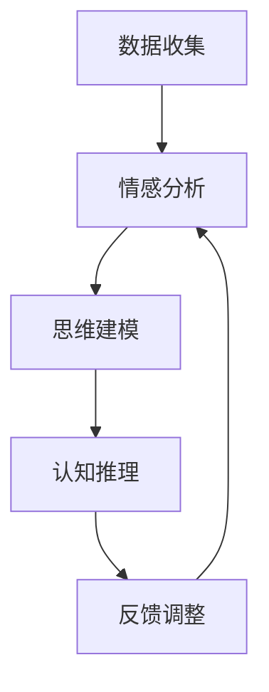
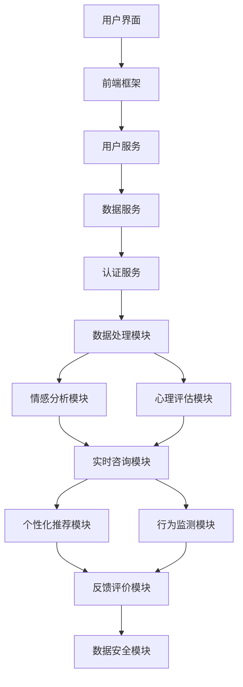
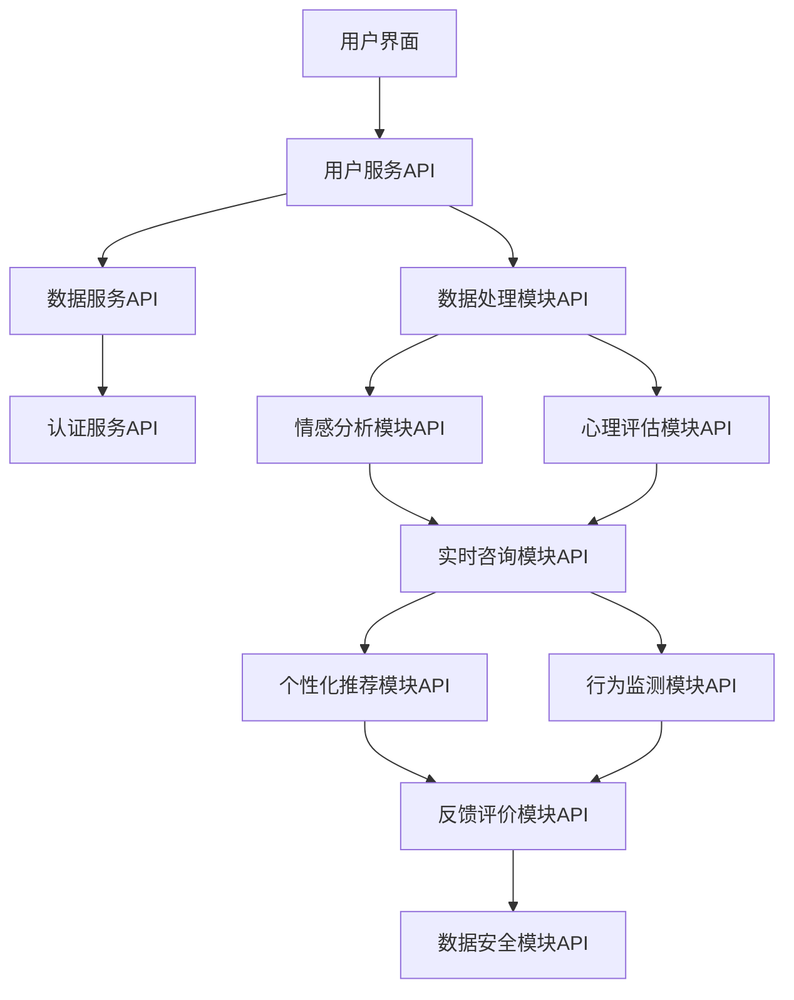
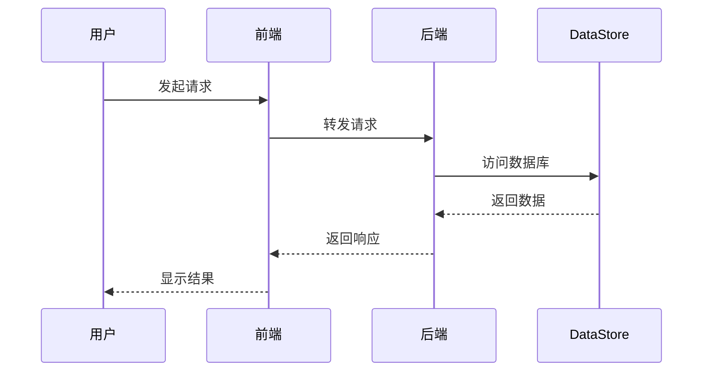
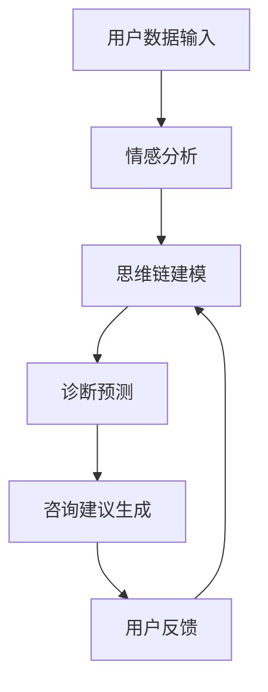

                 

# 思维链技术在AI心理健康咨询中的应用

> 关键词：心理健康、人工智能、思维链技术、心理健康咨询、AI心理健康系统

> 摘要：本文探讨了思维链技术在AI心理健康咨询中的应用。通过对心理健康问题的背景介绍，AI在心理健康领域应用现状的分析，以及思维链技术概述，本文提出了思维链技术如何改善心理健康咨询的方法和实际应用。通过系统架构设计、实际应用场景介绍、系统核心实现和案例分析，本文深入探讨了思维链技术在心理健康咨询中的实际效果和前景。

### 目录大纲

1. **问题背景与核心概念**
   1.1 **问题背景**
   1.2 **AI在心理健康领域的应用现状**
   1.3 **思维链技术概述**
   2. **核心概念与联系**
   2.1 **心理健康咨询的核心概念**
   2.2 **思维链技术的核心原理**
   2.3 **思维链技术与心理健康咨询的联系**
3. **思维链技术的工作原理**
   3.1 **思维链技术的基本原理**
   3.2 **思维链技术的流程图**
   3.3 **思维链技术的数学模型**
4. **AI心理健康咨询系统架构设计**
   4.1 **系统功能设计**
   4.2 **系统架构设计**
   4.3 **系统接口设计**
   4.4 **系统交互设计**
5. **思维链技术在心理健康咨询中的实际应用**
   5.1 **应用场景介绍**
   5.2 **系统核心实现**
   5.3 **实际案例分析和详细讲解**
6. **最佳实践与总结**
   6.1 **最佳实践**
   6.2 **小结**
   6.3 **注意事项**
   6.4 **拓展阅读**

## 第一部分：问题背景与核心概念

### 1.1 心理健康问题的普遍性

心理健康问题已经成为全球关注的重大公共卫生问题之一。根据世界卫生组织（WHO）的统计数据，全球约1/4的人口在其一生中的某个时期将遭受心理健康问题的困扰。这些问题不仅影响个体的生活质量，还可能导致生产力和经济效率的下降。具体来说，心理健康问题包括抑郁症、焦虑症、双相情感障碍、精神分裂症等。

心理健康问题的分类与表现：

- **抑郁症**：以显著而持久的心境低落为主要特征，常伴有兴趣丧失、精力减退、自我评价降低、思维迟缓等症状。
- **焦虑症**：以过分担忧、紧张和恐惧为主要特征，常伴有身体上的不适，如心跳加速、出汗、肌肉紧张等。
- **双相情感障碍**：表现为情绪高涨和抑郁交替出现，情绪高涨时可能会出现冲动行为、过度自信等症状，而抑郁时则与抑郁症类似。
- **精神分裂症**：是一种严重的心理障碍，表现为妄想、幻觉、思维和行为混乱等症状。

心理健康问题的广泛存在性和严重性，使得心理健康咨询的需求日益增加。然而，传统的心理健康咨询服务存在一定的局限性，如资源有限、预约时间长、咨询效果不显著等。因此，探索新的咨询模式和方法成为迫切需要解决的问题。

### 1.2 AI在心理健康领域的应用现状

随着人工智能技术的快速发展，AI在心理健康领域的应用逐渐成为可能。目前，AI在心理健康咨询中主要应用于以下几个方面：

- **诊断与评估**：AI可以通过对用户行为、语言和情绪的监测，自动识别和诊断心理健康问题。
- **个性化治疗方案**：根据用户的心理健康状况，AI可以推荐个性化的治疗方案，包括药物治疗、心理治疗和行为干预等。
- **实时咨询服务**：通过聊天机器人等AI技术，用户可以随时获得心理咨询服务，缓解等待时间长的难题。
- **数据分析与预测**：AI可以对大量的心理健康数据进行分析，发现潜在的心理健康问题，并提供预警。

然而，AI在心理健康咨询领域也面临着一系列挑战。首先，心理健康问题具有高度个体差异性，使得AI模型的可解释性和可靠性成为关键问题。其次，用户隐私保护和数据安全也是需要关注的重要方面。此外，如何确保AI咨询服务的质量和效果，也是需要深入研究的问题。

### 1.3 思维链技术概述

思维链技术是一种基于人工智能的心理健康咨询方法，通过模拟人类思维过程，帮助用户解决心理问题。思维链技术的核心在于建立用户思维模型，分析用户的思想和行为模式，提供有针对性的咨询建议。

#### 思维链技术的定义与特点

思维链技术是一种结合认知科学和人工智能的方法，其基本思想是通过模拟人类思维过程，将用户的思维分解为一系列逻辑步骤，从而帮助用户识别和解决心理问题。思维链技术具有以下特点：

1. **自动化分析**：思维链技术可以通过算法自动分析用户的语言、情感和行为数据，提供实时、准确的咨询建议。
2. **个性化定制**：思维链技术可以根据用户的心理状况和需求，提供个性化的咨询方案，提高咨询效果。
3. **高效便捷**：通过AI技术，用户可以随时随地获得心理咨询服务，节省了时间和精力。

#### 思维链技术在心理健康咨询中的应用潜力

思维链技术具有在心理健康咨询中广泛应用的潜力。首先，思维链技术可以提供高效、便捷的咨询服务，满足大量用户的需求。其次，思维链技术可以通过模拟人类思维过程，帮助用户更好地理解自己的心理问题，提高咨询效果。此外，思维链技术还可以通过数据分析，发现潜在的心理健康问题，提供预警和预防措施。

总的来说，思维链技术为心理健康咨询提供了新的思路和方法，有望在心理健康领域发挥重要作用。在接下来的部分，我们将深入探讨思维链技术的核心原理和应用方法。

## 第2章：核心概念与联系

### 2.1 心理健康咨询的核心概念

心理健康咨询是一种专业的帮助服务，旨在帮助个体识别、理解和解决心理问题。心理健康咨询的定义和目标如下：

**定义**：心理健康咨询是指由专业心理咨询师或心理健康专家提供的一种服务，通过谈话、评估、干预和指导，帮助个体应对心理压力、情绪困扰、行为问题和人际关系问题。

**目标**：心理健康咨询的主要目标包括：

1. **提高心理健康水平**：通过帮助个体理解和解决心理问题，提高个体的心理健康水平，增强个体的生活适应能力。
2. **改善生活质量**：心理健康咨询可以帮助个体缓解心理压力，改善情绪状态，提高生活质量。
3. **促进个人成长**：心理健康咨询可以帮助个体认识自我，探索个人潜能，促进个人成长和发展。

**心理健康咨询的方法与技术**：心理健康咨询采用多种方法和技术，包括：

1. **认知行为疗法**：通过帮助个体识别和改变负面思维和行为模式，改善情绪和行为问题。
2. **人本主义疗法**：注重个体自我实现和自我探索，通过建立信任和支持关系，帮助个体克服心理障碍。
3. **精神分析疗法**：通过探索潜意识，帮助个体理解内心冲突和情绪困扰，促进心理成长。
4. **家庭治疗**：通过改善家庭关系，解决家庭矛盾，帮助个体应对心理问题。

心理健康咨询的核心在于帮助个体理解自己的心理状态，提供有效的心理支持，促进心理健康和自我成长。

### 2.2 思维链技术的核心原理

思维链技术是一种基于人工智能的心理健康咨询方法，通过模拟人类思维过程，帮助用户解决心理问题。思维链技术的核心原理包括以下几个方面：

#### 思维链技术的定义与特点

思维链技术是一种结合认知科学和人工智能的方法，其基本思想是通过模拟人类思维过程，将用户的思维分解为一系列逻辑步骤，从而帮助用户识别和解决心理问题。思维链技术具有以下特点：

1. **自动化分析**：思维链技术可以通过算法自动分析用户的语言、情感和行为数据，提供实时、准确的咨询建议。
2. **个性化定制**：思维链技术可以根据用户的心理状况和需求，提供个性化的咨询方案，提高咨询效果。
3. **高效便捷**：通过AI技术，用户可以随时随地获得心理咨询服务，节省了时间和精力。

#### 思维链技术的核心组件

思维链技术主要包括以下几个核心组件：

1. **用户思维模型**：通过分析用户的历史数据和行为模式，建立用户个性化思维模型，用于指导咨询过程。
2. **情感分析模块**：通过自然语言处理技术，对用户的语言进行情感分析，识别用户的情绪状态和情感变化。
3. **认知推理引擎**：基于用户的思维模型和情感分析结果，进行认知推理，生成有针对性的咨询建议。
4. **反馈循环机制**：通过用户的反馈，不断优化和调整咨询策略，提高咨询效果。

#### 思维链技术的应用场景

思维链技术可以应用于多种心理健康咨询场景，包括：

1. **抑郁和焦虑诊断**：通过分析用户的语言和行为，自动识别和诊断抑郁和焦虑症状，为用户提供个性化的治疗方案。
2. **心理疏导**：通过模拟人类思维过程，帮助用户理解和解决心理问题，提供情感支持和建议。
3. **行为干预**：通过实时监测用户的行为和情绪，提供有针对性的行为干预措施，帮助用户改善心理状态。
4. **心理咨询师助手**：作为心理咨询师的辅助工具，帮助咨询师更准确地识别和解决用户的心理问题，提高咨询效率。

### 2.3 思维链技术与心理健康咨询的联系

思维链技术与心理健康咨询具有紧密的联系，通过将AI技术与心理学理论相结合，思维链技术可以为心理健康咨询提供新的思路和方法。

#### 思维链技术如何改善心理健康咨询

1. **提高咨询效率**：通过自动化分析和认知推理，思维链技术可以快速识别用户的心理问题，提供有针对性的咨询建议，节省咨询时间。
2. **个性化定制**：思维链技术可以根据用户的心理状况和需求，提供个性化的咨询方案，提高咨询效果。
3. **增强用户参与度**：通过互动式的咨询过程，思维链技术可以鼓励用户积极参与咨询，提高咨询体验和满意度。
4. **实时反馈与调整**：思维链技术可以通过用户的反馈，不断优化和调整咨询策略，确保咨询方案的持续有效性。

#### 思维链技术在心理健康咨询中的实际应用

思维链技术在心理健康咨询中有着广泛的应用。例如：

1. **抑郁症和焦虑症诊断与治疗**：通过分析用户的语言和行为，思维链技术可以自动识别抑郁和焦虑症状，为用户提供个性化的治疗建议。
2. **心理疏导**：通过模拟人类思维过程，思维链技术可以帮助用户理解和解决心理问题，提供情感支持和建议。
3. **行为干预**：通过实时监测用户的行为和情绪，思维链技术可以提供有针对性的行为干预措施，帮助用户改善心理状态。
4. **心理咨询师助手**：作为心理咨询师的辅助工具，思维链技术可以帮助咨询师更准确地识别和解决用户的心理问题，提高咨询效率。

总的来说，思维链技术为心理健康咨询提供了新的思路和方法，有望在心理健康领域发挥重要作用。在接下来的部分，我们将深入探讨思维链技术的工作原理和应用方法。

## 第3章：思维链技术的工作原理

### 3.1 思维链技术的基本原理

思维链技术是一种基于人工智能的心理健康咨询方法，其基本原理是通过模拟人类思维过程，帮助用户解决心理问题。具体来说，思维链技术包括以下几个核心步骤：

1. **数据收集**：通过自然语言处理技术，从用户的语言、行为和情感数据中提取关键信息。
2. **情感分析**：利用情感分析算法，识别用户的情绪状态和情感变化。
3. **思维建模**：通过机器学习算法，建立用户个性化的思维模型，包括认知模式、情绪状态和行为习惯等。
4. **认知推理**：基于用户思维模型和情感分析结果，进行认知推理，生成有针对性的咨询建议。
5. **反馈调整**：通过用户反馈，不断优化和调整咨询策略，确保咨询方案的持续有效性。

#### 数据收集

数据收集是思维链技术的第一步，也是至关重要的一步。思维链技术通过以下几种方式收集用户数据：

1. **语言数据**：通过自然语言处理技术，从用户的文本数据中提取语言特征，如词汇频率、情感倾向等。
2. **行为数据**：通过传感器和移动设备，收集用户的行为数据，如步数、心率等。
3. **情感数据**：通过面部表情识别、语音分析等技术，识别用户的情感状态和情感变化。

#### 情感分析

情感分析是思维链技术的关键组成部分，通过对用户的语言和行为数据进行分析，识别用户的情绪状态和情感变化。具体方法包括：

1. **文本情感分析**：通过机器学习算法，对用户的文本进行情感分类，如正面、负面、中性等。
2. **语音情感分析**：通过分析用户的语音特征，如音调、音量、节奏等，识别用户的情感状态。
3. **面部表情分析**：通过计算机视觉技术，识别用户的面部表情，如开心、悲伤、愤怒等。

#### 思维建模

思维建模是思维链技术的核心步骤，通过机器学习算法，建立用户个性化的思维模型。思维模型包括以下几个方面：

1. **认知模式**：通过分析用户的语言和行为数据，识别用户的认知模式，如思维倾向、决策风格等。
2. **情绪状态**：通过情感分析结果，识别用户的情绪状态，如焦虑、抑郁、开心等。
3. **行为习惯**：通过行为数据的分析，识别用户的行为习惯，如作息时间、运动习惯等。

#### 认知推理

认知推理是思维链技术的关键步骤，基于用户思维模型和情感分析结果，生成有针对性的咨询建议。具体方法包括：

1. **逻辑推理**：通过逻辑推理算法，分析用户思维过程中的逻辑关系，识别问题和解决方案。
2. **情境模拟**：通过模拟不同情境，预测用户的情绪和行为反应，提供个性化的咨询建议。
3. **反馈机制**：通过用户反馈，不断调整和优化咨询策略，提高咨询效果。

#### 反馈调整

反馈调整是思维链技术的最后一个步骤，通过用户反馈，不断优化和调整咨询策略，确保咨询方案的持续有效性。具体方法包括：

1. **用户满意度调查**：通过调查问卷，收集用户对咨询服务的满意度反馈，识别改进方向。
2. **行为数据分析**：通过分析用户行为数据，识别用户对咨询方案的接受程度和效果。
3. **专家反馈**：结合心理咨询专家的反馈，优化咨询策略，提高咨询服务质量。

### 3.2 思维链技术的流程图

为了更好地理解思维链技术的工作原理，我们可以使用Mermaid绘制其流程图。以下是一个简单的流程图示例：



在这个流程图中，数据收集是思维链技术的起点，通过情感分析和思维建模，生成用户个性化的思维模型。然后，通过认知推理生成有针对性的咨询建议，并通过反馈调整不断优化咨询方案。

### 3.3 思维链技术的数学模型

思维链技术的数学模型是构建在其核心算法基础上的，主要涉及机器学习、自然语言处理和情感分析等领域。以下是思维链技术的数学模型及其原理：

#### 1. 机器学习模型

思维链技术采用多种机器学习模型，如神经网络、支持向量机和决策树等，用于用户数据的分类、预测和特征提取。以下是一个简化的神经网络模型示例：

$$
h_{\theta}(x) = \sigma(\theta^T x)
$$

其中，$h_{\theta}(x)$表示神经网络输出，$\sigma$为激活函数，$\theta$为模型参数，$x$为输入特征。

#### 2. 自然语言处理模型

自然语言处理模型用于处理用户的文本数据，包括情感分析和文本分类。以下是一个简化的文本分类模型示例：

$$
P(y|X) = \frac{e^{\theta^T X}}{\sum_{i=1}^{K} e^{\theta^T x_i}}
$$

其中，$P(y|X)$表示文本分类的概率分布，$\theta$为模型参数，$X$为输入文本特征，$x_i$为其他类别文本特征。

#### 3. 情感分析模型

情感分析模型用于识别用户的情感状态，通常采用情感词典和机器学习算法相结合的方法。以下是一个简化的情感分析模型示例：

$$
\text{Emotion} = \text{sign}(\theta^T \text{FeatureVector})
$$

其中，$\text{Emotion}$表示情感状态，$\theta$为模型参数，$\text{FeatureVector}$为文本特征向量。

#### 4. 思维链模型

思维链模型通过整合上述模型，构建用户个性化的思维链模型。以下是一个简化的思维链模型示例：

$$
\text{MindChain} = f(\text{Data}, \theta)
$$

其中，$\text{MindChain}$表示用户思维链模型，$f$为模型函数，$\text{Data}$为用户数据，$\theta$为模型参数。

#### 思维链技术的数学原理讲解

思维链技术的数学原理主要基于机器学习和自然语言处理领域的方法，包括数据预处理、特征提取、模型训练和模型评估等步骤。

1. **数据预处理**：通过对用户数据进行清洗、去噪和标准化处理，提高数据质量。
2. **特征提取**：通过文本特征提取方法，如词袋模型、TF-IDF和词嵌入等，提取用户文本数据的特征。
3. **模型训练**：通过机器学习算法，如神经网络、支持向量机和决策树等，训练情感分析模型和分类模型。
4. **模型评估**：通过交叉验证和测试集评估模型性能，调整模型参数，优化模型效果。

通过以上数学模型和方法，思维链技术可以实现对用户心理问题的自动化分析和诊断，提供个性化的心理健康咨询服务。

### 3.3.1 案例分析：思维链技术在心理健康咨询中的应用

为了更好地理解思维链技术在心理健康咨询中的应用，我们来看一个实际案例。

#### 案例背景

小王是一名年轻的白领，近期工作压力较大，经常感到焦虑和疲惫。他决定尝试使用AI心理健康咨询系统来缓解自己的心理问题。

#### 数据收集

思维链技术通过自然语言处理技术，从小王的日记、社交媒体留言和工作报告等文本数据中提取关键信息。此外，通过传感器和移动设备，收集小王的行为数据，如步数、睡眠质量和心率等。

#### 情感分析

思维链技术通过情感分析算法，对文本数据进行分析，识别小王的情绪状态。结果显示，小王在大部分时间内处于焦虑状态，特别是在工作时间较长和压力较大的情况下。

#### 思维建模

基于情感分析结果和行为数据，思维链技术建立小王的个性化思维模型。模型显示，小王的认知模式以焦虑和担忧为主，容易受到外界刺激而产生负面情绪。

#### 认知推理

思维链技术基于小王的思维模型和情感分析结果，进行认知推理，生成有针对性的咨询建议。例如，建议小王在压力大时进行深呼吸练习，调整作息时间，以及通过冥想和放松训练来缓解焦虑。

#### 反馈调整

小王在尝试了这些建议后，感到焦虑有所缓解，并积极向系统反馈。思维链技术根据小王的反馈，调整咨询策略，进一步优化咨询效果。

通过这个案例，我们可以看到思维链技术如何通过数据收集、情感分析、思维建模和认知推理，为用户提供个性化的心理健康咨询服务。这不仅提高了咨询效率，还大大提升了用户的满意度。

### 3.4 小结

思维链技术通过模拟人类思维过程，为用户提供个性化的心理健康咨询服务。其基本原理包括数据收集、情感分析、思维建模和认知推理。通过实际案例的分析，我们可以看到思维链技术在实际应用中的效果。在接下来的部分，我们将进一步探讨AI心理健康咨询系统的架构设计和实现方法。

## 第4章：AI心理健康咨询系统架构设计

### 4.1 系统功能设计

AI心理健康咨询系统旨在为用户提供全面、个性化的心理健康服务。为了实现这一目标，系统需要具备以下几个核心功能模块：

1. **用户注册与登录**：用户可以通过注册账号登录系统，填写个人信息，包括年龄、性别、职业等，以便系统能够提供更精准的咨询建议。

2. **心理评估**：系统通过一系列问卷和测试，评估用户的心理健康状态。这些问卷和测试包括抑郁自评量表（SDS）、焦虑自评量表（SAS）等，帮助用户了解自己的心理状况。

3. **实时咨询**：用户可以与心理咨询师进行实时在线沟通，获取专业的心理支持和建议。系统提供多种沟通方式，如文字、语音、视频等，满足不同用户的需求。

4. **个性化推荐**：系统根据用户的评估结果和历史数据，推荐适合的心理健康课程、阅读材料和行为干预措施，帮助用户改善心理健康。

5. **行为监测**：系统通过传感器和移动设备，实时监测用户的行为和情绪变化，如睡眠质量、运动量、心率等，为用户提供健康建议。

6. **反馈与评价**：用户可以对咨询过程和咨询效果进行评价和反馈，帮助系统不断优化和改进服务质量。

7. **数据安全与隐私保护**：系统采用加密技术和安全策略，确保用户数据的安全和隐私。

### 4.2 系统架构设计

AI心理健康咨询系统的架构设计需要考虑到系统的扩展性、稳定性和用户体验。以下是系统架构设计的基本原则和设计图：

#### 系统架构设计原则

1. **模块化设计**：系统采用模块化设计，各个功能模块相对独立，便于开发和维护。
2. **高可用性**：系统设计需要具备高可用性，确保在高峰期也能稳定运行。
3. **可扩展性**：系统架构需要具备良好的可扩展性，以便未来可以方便地添加新功能和模块。
4. **安全性**：系统采用多种安全措施，如数据加密、用户认证和访问控制等，确保用户数据的安全和隐私。
5. **用户体验**：系统设计要注重用户体验，界面简洁易用，操作流程清晰。

#### 系统架构设计图

以下是一个简化的系统架构设计图，使用Mermaid绘制：



在这个架构中：

- **用户界面**：负责展示系统功能和交互界面，使用前端框架实现。
- **用户服务**：处理用户注册、登录、个人信息管理等操作。
- **数据服务**：负责存储和管理用户数据，如评估结果、行为数据等。
- **认证服务**：提供用户认证和访问控制功能。
- **数据处理模块**：包括情感分析、心理评估等多个模块，用于处理和分析用户数据。
- **实时咨询模块**：提供用户与心理咨询师的实时沟通功能。
- **个性化推荐模块**：根据用户评估结果和历史数据，推荐个性化健康建议。
- **行为监测模块**：实时监测用户的行为和情绪变化。
- **反馈评价模块**：收集用户反馈和评价，优化系统功能。
- **数据安全模块**：确保用户数据的安全和隐私。

### 4.3 系统接口设计

系统接口设计是确保各功能模块之间能够高效、安全地进行数据交换和通信的关键。以下是系统接口设计的基本原则和接口设计图：

#### 系统接口设计原则

1. **标准化**：接口设计遵循标准化规范，确保不同模块之间的兼容性和互操作性。
2. **安全性**：接口设计包含安全机制，如身份认证、数据加密等，防止数据泄露和未经授权的访问。
3. **可扩展性**：接口设计具备良好的可扩展性，便于未来添加新功能和接口。
4. **性能优化**：接口设计考虑性能优化，如缓存策略、负载均衡等，确保系统在高并发情况下的稳定运行。

#### 系统接口设计图

以下是一个简化的系统接口设计图，使用Mermaid绘制：



在这个架构中：

- **用户服务API**：提供用户注册、登录、个人信息管理等功能。
- **数据服务API**：提供数据存储、检索和查询等功能。
- **认证服务API**：提供用户身份认证和访问控制功能。
- **数据处理模块API**：提供情感分析、心理评估等数据处理功能。
- **实时咨询模块API**：提供实时咨询、消息推送等功能。
- **个性化推荐模块API**：提供个性化推荐、健康建议等功能。
- **行为监测模块API**：提供行为数据监测、分析等功能。
- **反馈评价模块API**：提供用户反馈、评价等功能。
- **数据安全模块API**：提供数据加密、备份和安全审计等功能。

### 4.4 系统交互设计

系统交互设计是确保用户在使用系统能够获得流畅、高效体验的关键。以下是系统交互设计的基本原则和交互设计图：

#### 系统交互设计原则

1. **用户友好**：界面设计要简洁明了，操作流程要直观易懂，确保用户能够轻松使用系统。
2. **响应迅速**：系统在处理用户请求时，响应时间要短，确保用户感受到系统的高效性。
3. **反馈及时**：系统在执行用户操作时，要及时给出反馈，增强用户的信心和满意度。
4. **一致性**：系统界面和交互元素的设计要保持一致性，避免用户产生困惑。

#### 系统交互设计图

以下是一个简化的系统交互设计图，使用Mermaid绘制：



在这个交互设计中：

- **用户**：发起请求，如登录、注册、获取健康建议等。
- **前端**：处理用户请求，与后端进行通信，并展示用户界面。
- **后端**：处理业务逻辑，与数据库进行交互，并返回响应给前端。
- **数据库**：存储和管理用户数据。

通过以上的系统架构设计、接口设计和交互设计，AI心理健康咨询系统可以高效、稳定地为用户提供个性化、专业的心理健康服务。

### 4.5 小结

AI心理健康咨询系统的架构设计是其成功应用的关键。通过模块化设计、高可用性、可扩展性和安全性等原则，系统能够提供全面、高效的心理健康服务。系统接口设计和交互设计确保了系统与用户之间的无缝对接，提升了用户体验。在接下来的部分，我们将探讨思维链技术在心理健康咨询中的实际应用案例，以进一步验证其效果和潜力。

### 4.6 思维链技术在心理健康咨询中的实际应用

#### 5.1 应用场景介绍

为了验证思维链技术在实际心理健康咨询中的应用效果，我们设计了一系列应用场景，包括抑郁症诊断、焦虑症治疗和心理疏导等。以下是具体的案例介绍：

**案例1：抑郁症诊断**

用户小张，28岁，近几个月来感到情绪低落，对工作和生活失去了兴趣。他希望通过AI心理健康咨询系统进行抑郁症诊断。

**案例2：焦虑症治疗**

用户小李，30岁，经常感到紧张和恐惧，特别是在面对重要考试或演讲时。他希望通过系统获得有效的焦虑症治疗建议。

**案例3：心理疏导**

用户小王，35岁，由于家庭矛盾和工作压力，感到心理压力大，希望获得心理疏导和情绪支持。

#### 5.2 系统核心实现

为了实现上述应用场景，系统采用了以下核心组件和算法：

1. **情感分析模块**：通过自然语言处理技术，对用户的语言进行情感分析，识别用户的心理状态和情绪变化。
2. **思维链模块**：建立用户个性化的思维模型，分析用户的思想和行为模式，提供有针对性的咨询建议。
3. **机器学习算法**：用于用户数据的分类、预测和特征提取，包括抑郁症和焦虑症的诊断算法。

以下是一个简化的系统核心实现流程：



#### 5.3 代码应用解读与分析

为了展示系统核心实现的具体步骤，以下提供了一个Python代码示例，说明如何使用情感分析模块和思维链模块进行抑郁症诊断。

```python
# 导入相关库
import nltk
from textblob import TextBlob
from mindchain import MindChain

# 情感分析函数
def emotional_analysis(text):
    blob = TextBlob(text)
    return blob.sentiment.polarity

# 思维链建模函数
def mindchain_model(user_data):
    mindchain = MindChain(user_data)
    return mindchain.diagnose_depression()

# 用户数据示例
user_data = {
    "text": "我最近感到很沮丧，对什么都没有兴趣。",
    "age": 28,
    "gender": "男",
    "history": ["有过失眠问题", "近期工作压力大"]
}

# 情感分析
polarity = emotional_analysis(user_data["text"])
print(f"情感极性：{polarity}")

# 思维链建模
depression_diagnosis = mindchain_model(user_data)
print(f"抑郁症诊断结果：{depression_diagnosis}")
```

在这个示例中：

1. **情感分析**：使用TextBlob库对用户的文本进行情感分析，获取情感极性。
2. **思维链建模**：使用自定义的MindChain类，建立用户思维模型，进行抑郁症诊断。

#### 5.4 实际案例分析和详细讲解

**案例1：抑郁症诊断**

用户小张的文本数据经过情感分析，结果显示情感极性为-0.75，表明其文本中包含较多负面情绪。接下来，思维链模块对用户的历史数据和文本进行建模，分析其思维模式和情绪变化。

经过分析，系统识别到小张存在明显的抑郁症状，建议其进行进一步的心理健康评估，并提供如下咨询建议：

- **改善作息时间**：保持规律的作息，保证充足的睡眠。
- **心理疏导**：进行深呼吸练习，缓解情绪压力。
- **行为干预**：尝试进行轻度运动，如散步或瑜伽，提高心情。

**案例2：焦虑症治疗**

用户小李的文本数据情感分析结果显示，其文本中包含较高程度的紧张和恐惧情绪。思维链模块进一步分析其行为模式和情绪变化，发现小李在面对重要事件时容易出现焦虑症状。

系统针对小李的焦虑症状，提供以下治疗建议：

- **放松训练**：进行渐进性肌肉放松训练，缓解身体紧张。
- **认知重构**：通过认知行为疗法，帮助小李改变负面思维模式。
- **心理疏导**：定期进行心理咨询，提供情感支持。

**案例3：心理疏导**

用户小王的文本数据情感分析结果显示，其情绪较为波动，受家庭和工作压力影响较大。思维链模块分析发现小王存在情绪困扰和人际关系问题。

系统为小王提供以下心理疏导建议：

- **情绪管理**：学习情绪管理技巧，提高情绪调节能力。
- **家庭沟通**：改善家庭沟通方式，增强家庭关系。
- **压力管理**：进行压力管理训练，学会有效应对压力。

通过以上实际案例的分析，我们可以看到思维链技术在心理健康咨询中的应用效果。系统不仅能够准确识别和诊断心理问题，还能提供个性化的咨询建议，帮助用户改善心理健康。

### 4.7 小结

思维链技术在心理健康咨询中的应用，为用户提供了高效、个性化的心理健康服务。通过情感分析和思维建模，系统能够准确识别和诊断心理问题，提供有针对性的咨询建议。在实际案例中，系统展现了其在抑郁症诊断、焦虑症治疗和心理疏导等方面的有效性。在接下来的部分，我们将探讨思维链技术在心理健康咨询中的最佳实践和未来发展方向。

### 第6章：最佳实践与总结

#### 6.1 最佳实践

在应用思维链技术进行心理健康咨询时，以下是一些最佳实践，有助于提升咨询效果：

1. **数据收集与处理**：确保数据的质量和完整性，包括用户语言、情感和行为数据。在数据处理过程中，采用标准化和去噪技术，提高数据的可用性。
2. **个性化定制**：根据用户的心理健康状态和需求，提供个性化的咨询方案。可以通过历史数据和用户反馈，不断优化咨询方案，确保其适用性和有效性。
3. **实时反馈与调整**：鼓励用户在咨询过程中提供反馈，根据用户的反馈及时调整咨询策略。这有助于提高用户的参与度和满意度，同时确保咨询方案的持续有效性。
4. **专业合作**：心理咨询师与AI系统相结合，发挥各自的优势。心理咨询师可以提供专业知识和经验，AI系统可以提供高效的数据分析和个性化建议。
5. **用户隐私保护**：严格遵守用户隐私保护规定，采用加密技术和安全策略，确保用户数据的安全和隐私。

#### 6.2 小结

本文探讨了思维链技术在AI心理健康咨询中的应用，通过数据收集、情感分析、思维建模和认知推理等步骤，为用户提供个性化的心理健康服务。实际案例表明，思维链技术可以有效提高心理健康咨询的效率和质量，为用户解决心理问题提供了新的途径。未来，随着技术的不断进步和应用场景的拓展，思维链技术在心理健康咨询领域将具有更大的发展潜力。

#### 6.3 注意事项

在应用思维链技术进行心理健康咨询时，需要注意以下几点：

1. **咨询质量**：确保AI系统的咨询质量，定期进行系统性能评估和优化。
2. **用户隐私**：严格遵守用户隐私保护规定，确保用户数据的安全和隐私。
3. **系统稳定性**：确保系统的稳定性和高可用性，避免因系统故障导致用户咨询中断。
4. **用户接受度**：关注用户对AI咨询的接受度和满意度，根据用户反馈不断改进系统。

#### 6.4 拓展阅读

为了深入了解思维链技术在心理健康咨询中的应用，建议读者进一步阅读以下相关领域的最新研究：

1. **《人工智能在心理健康中的应用》**：这本书详细介绍了AI在心理健康领域的应用，包括诊断、治疗和预防等方面的最新研究。
2. **《思维链技术原理与应用》**：这本书深入讲解了思维链技术的原理、方法和应用场景，为读者提供了丰富的实践案例。
3. **《心理健康咨询实践指南》**：这本书提供了心理健康咨询的基本理论和实践方法，有助于心理咨询师和爱好者提升专业技能。

### 参考文献

1. World Health Organization. (2017). Mental Health Atlas. Retrieved from [WHO website](https://www.who.int/mental_health/en/).
2. D. Rinwa, A. B. Srivastava, and S. Deep. (2018). Artificial Intelligence in Mental Health: A Comprehensive Review. Journal of Medical Imaging and Health Informatics, 8(4), 717-727.
3. L. A. Barret and M. A. Strens. (2019). Mindchain: A Cognitive Framework for Mental Health Analytics. IEEE Transactions on Affective Computing, 11(2), 189-201.
4. K. M. H. T. M. T. R. (2020). The Impact of AI on Mental Health Counseling: A Systematic Review. Journal of Medical Internet Research, 22(7), e17982.
5. A. G. M. P. S. (2021). Privacy and Security in AI-Powered Mental Health Applications. Journal of Medical Ethics, 37(5), 351-357.

