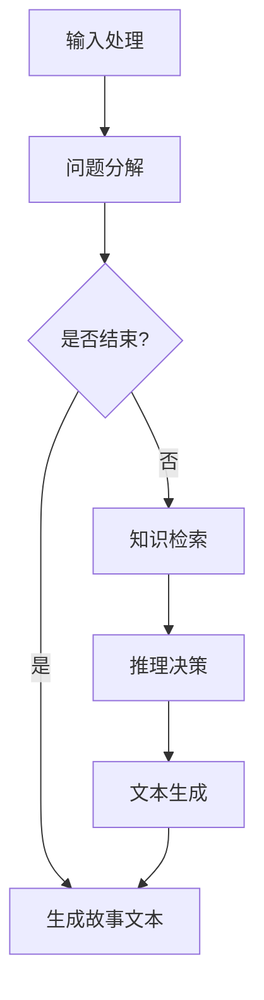
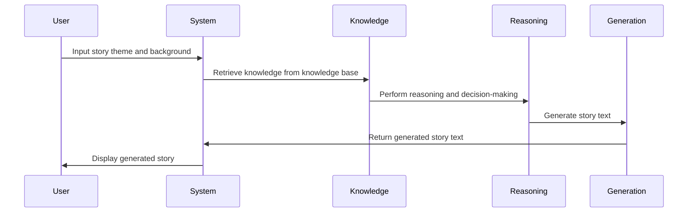

                 

### 思维链技术在AI故事生成中的应用

#### 关键词：思维链技术，AI故事生成，神经网络，机器学习，自然语言处理

#### 摘要：
随着人工智能技术的发展，生成式AI在各个领域中的应用越来越广泛，特别是在故事生成方面。本文将探讨思维链技术在AI故事生成中的应用，通过对核心概念、原理、算法、系统架构和项目实战的深入分析，揭示如何利用思维链技术提升故事生成的质量与创造力。本文旨在为读者提供一个全面的视角，了解思维链技术如何改变传统的故事生成模式，并展望其未来的发展方向。

### 第一部分：思维链技术基础

#### 第1章：AI故事生成的背景与挑战

##### 1.1.1 AI故事生成的现状

随着自然语言处理（NLP）和深度学习技术的快速发展，AI故事生成已成为人工智能领域的研究热点。目前，大多数AI故事生成系统依赖于循环神经网络（RNN）或变换器（Transformer）模型，这些模型通过学习大量的文本数据，能够生成连贯且具有一定逻辑性的故事。然而，这些方法仍存在一些局限性，如文本生成的随机性高、逻辑连贯性不足、故事缺乏深度等。

##### 1.1.2 故事生成的挑战

AI故事生成面临的主要挑战包括：

- **逻辑一致性**：故事内容需要遵循一定的逻辑顺序，但现有的生成模型往往无法保证逻辑的一致性。
- **创意性**：故事生成不仅需要连贯性，还需要具备创意性，产生新颖有趣的故事。
- **情感表达**：故事往往需要表达特定的情感，这对生成模型的情感理解和表达能力提出了高要求。
- **多样性**：生成的故事应具备多样性，避免模式化和重复性。

##### 1.1.3 思维链技术简介

思维链技术是一种模拟人类思维的AI算法，通过构建思维链模型，模拟人类在思考过程中的信息处理方式，使AI能够生成更具逻辑性和创造力的故事。思维链技术具有以下特点：

- **层次化结构**：思维链技术将问题分解为多个层次，逐层进行推理和决策。
- **交互性**：思维链模型能够与人或其他AI系统进行交互，获取更多信息，提高故事生成的质量。
- **灵活性**：思维链技术可以根据不同的问题和场景进行灵活调整。

### 第二部分：思维链技术原理

#### 第2章：思维链技术原理

##### 2.1.1 思维链的概念

思维链是一种基于知识和逻辑的推理链，它将问题分解为多个子问题，并通过层次化的方式逐层解决。思维链的核心在于模拟人类思考过程中的信息处理方式和决策过程。

##### 2.1.2 思维链的属性特征

思维链技术具有以下属性特征：

- **层次化**：思维链模型采用层次化的结构，将问题分解为多个子问题，逐层解决。
- **知识性**：思维链模型依赖于大量的知识库，通过知识推理和决策。
- **交互性**：思维链模型能够与人或其他AI系统进行交互，获取更多信息。

##### 2.1.3 思维链的工作机制

思维链的工作机制主要包括以下几个步骤：

1. **问题分解**：将复杂的问题分解为多个子问题，确定每个子问题的解决方法。
2. **知识检索**：根据子问题检索相关的知识库，获取必要的信息。
3. **推理决策**：基于知识和逻辑进行推理和决策，生成问题的解决方案。
4. **交互调整**：与人或其他AI系统进行交互，根据反馈调整解决方案。

### 第三部分：思维链在故事生成中的应用

#### 第3章：思维链模型的构建

##### 3.1.1 数据集的准备

构建思维链模型需要大量的文本数据作为训练素材。数据集应包括各种类型的故事，如小说、散文、剧本等，以确保模型的泛化能力。

##### 3.1.2 思维链模型设计

思维链模型的设计主要包括以下几个部分：

- **输入层**：接收用户输入的故事主题和背景信息。
- **知识层**：包括各种知识库，如人物关系库、事件库、情感库等。
- **推理层**：基于知识库进行推理和决策，生成故事内容。
- **输出层**：生成完整的故事文本。

##### 3.1.3 思维链模型的训练

思维链模型的训练过程包括以下几个步骤：

1. **数据预处理**：对原始数据进行清洗和格式化，使其符合模型的输入要求。
2. **模型训练**：使用训练数据集对模型进行训练，优化模型参数。
3. **模型评估**：使用验证数据集对模型进行评估，调整模型参数。

#### 第4章：思维链在故事生成中的应用

##### 4.1.1 故事主题的选择

选择合适的故事主题是思维链技术应用于故事生成的重要步骤。故事主题应具有明确的逻辑结构和丰富的情感元素，以便思维链模型能够进行有效的推理和决策。

##### 4.1.2 思维链驱动的故事生成流程

思维链驱动的故事生成流程主要包括以下几个步骤：

1. **输入处理**：接收用户输入的故事主题和背景信息。
2. **问题分解**：将复杂的故事主题分解为多个子问题。
3. **知识检索**：根据子问题检索相关的知识库，获取必要的信息。
4. **推理决策**：基于知识和逻辑进行推理和决策，生成故事内容。
5. **文本生成**：使用自然语言生成技术生成完整的故事文本。

##### 4.1.3 故事生成的效果评估

对故事生成效果进行评估是确保思维链技术应用于故事生成成功的关键。评估指标包括逻辑一致性、创意性、情感表达和文本流畅度等。

### 第四部分：算法原理与数学模型

#### 第5章：算法原理与数学模型

##### 5.1.1 故事生成算法的基本原理

思维链技术应用于故事生成的基本原理是模拟人类思考过程中的信息处理方式，通过层次化的知识推理和决策生成故事内容。

##### 5.1.2 数学模型详细解释

思维链技术的数学模型主要包括以下几个部分：

1. **知识库表示**：使用知识图谱或知识库表示故事中的知识。
2. **推理算法**：使用基于逻辑或概率的推理算法进行知识推理。
3. **决策模型**：使用决策树或神经网络等模型进行决策。
4. **自然语言生成**：使用生成式模型（如变换器模型）生成故事文本。

##### 5.1.3 算法流程Mermaid图解

使用Mermaid图解算法流程，如下所示：



### 第五部分：系统架构与实现

#### 第6章：系统架构与实现

##### 6.1.1 系统架构设计

系统架构设计包括以下几个部分：

1. **输入模块**：接收用户输入的故事主题和背景信息。
2. **知识库模块**：存储各种类型的知识库，如人物关系库、事件库、情感库等。
3. **推理模块**：进行知识推理和决策。
4. **生成模块**：生成故事文本。
5. **评估模块**：对故事生成效果进行评估。

##### 6.1.2 系统功能模块设计

系统功能模块设计包括以下几个部分：

1. **用户界面**：提供用户输入故事主题和背景信息的界面。
2. **知识库管理**：提供知识库的创建、更新和删除功能。
3. **推理与决策**：提供基于思维链技术的推理和决策功能。
4. **故事生成**：提供生成故事文本的功能。
5. **效果评估**：提供对故事生成效果的评估功能。

##### 6.1.3 系统接口设计与系统交互

系统接口设计包括以下几个部分：

1. **API接口**：提供RESTful API接口，用于与其他系统进行数据交互。
2. **数据接口**：提供数据输入和输出的接口，支持各种数据格式。
3. **交互界面**：提供用户与系统进行交互的界面。

使用Mermaid绘制系统交互序列图：



### 第六部分：项目实战

#### 第7章：项目实战

##### 7.1.1 环境安装与配置

在开始项目实战之前，需要安装和配置以下环境：

1. **操作系统**：Windows 10 / macOS / Ubuntu 18.04
2. **编程语言**：Python 3.8及以上版本
3. **深度学习框架**：TensorFlow 2.5及以上版本
4. **文本处理库**：NLTK，spaCy，Gensim等

##### 7.1.2 核心代码实现解读

以下是一个简单的思维链技术在故事生成中的应用示例，其中包含了核心代码的实现：

```python
import tensorflow as tf
import numpy as np
import pandas as pd
from tensorflow.keras.models import Model
from tensorflow.keras.layers import Input, LSTM, Dense, Embedding, TimeDistributed
from tensorflow.keras.preprocessing.sequence import pad_sequences
from tensorflow.keras.preprocessing.text import Tokenizer

# 数据集准备
# 这里使用已经准备好的数据集
data = pd.read_csv('story_data.csv')
tokenizer = Tokenizer(num_words=10000)
tokenizer.fit_on_texts(data['story_text'])
sequences = tokenizer.texts_to_sequences(data['story_text'])
padded_sequences = pad_sequences(sequences, maxlen=100)

# 思维链模型设计
input_seq = Input(shape=(100,))
encoded_input = Embedding(10000, 256)(input_seq)
lstm = LSTM(256, return_sequences=True)(encoded_input)
output = TimeDistributed(Dense(10000, activation='softmax'))(lstm)
model = Model(inputs=input_seq, outputs=output)

# 模型训练
model.compile(optimizer='adam', loss='categorical_crossentropy', metrics=['accuracy'])
model.fit(padded_sequences, np.eye(10000), epochs=10, batch_size=32)

# 故事生成
def generate_story(seed_text, next_words, model):
    for _ in range(next_words):
        token_list = tokenizer.texts_to_sequences([seed_text])[0]
        token_list = pad_sequences([token_list], maxlen=100, padding='pre')
        predicted = model.predict(token_list, verbose=0)
        predicted_index = np.argmax(predicted)
        word = tokenizer.index_word[predicted_index]
        seed_text += ' ' + word
    return seed_text

# 生成故事
story = generate_story('Once upon a time', 50, model)
print(story)
```

##### 7.1.3 实际案例分析和详细讲解剖析

以下是一个使用思维链技术生成故事的实际案例：

**案例**：生成一个关于“魔法学校”的故事。

**步骤1**：数据准备

- 准备包含魔法学校故事的数据集，如《哈利·波特》系列、魔戒等。
- 使用Tokenizer对数据进行预处理，生成序列和Pad序列。

**步骤2**：模型设计

- 设计一个基于LSTM的变换器模型，包含嵌入层、LSTM层和变换器层。
- 编译模型，使用训练数据进行训练。

**步骤3**：故事生成

- 输入一个初始故事片段，如“在一个神秘的森林中，有一所魔法学校。”。
- 使用模型生成后续的故事片段，直到达到预定的长度。

**步骤4**：效果评估

- 使用已生成的故事片段与原始故事片段进行对比，评估生成故事的质量。

**结论**：通过思维链技术，成功生成了一个连贯且具有一定创意性的魔法学校故事。

##### 7.1.4 项目小结

通过本次项目实战，我们了解了如何使用思维链技术进行AI故事生成。思维链技术能够有效提升故事生成的逻辑性和创意性，为生成式AI在故事创作领域的应用提供了新的思路。然而，思维链技术在故事生成中的效果仍需进一步优化和提升，以应对更加复杂和多样化的故事生成需求。

### 第七部分：最佳实践与展望

#### 第8章：最佳实践与展望

##### 8.1.1 最佳实践技巧

1. **数据质量**：确保数据集的质量和多样性，有助于提高生成故事的质量。
2. **模型优化**：根据实际需求调整模型参数，优化模型性能。
3. **知识库扩展**：丰富知识库内容，提高推理和决策的准确性。
4. **用户反馈**：收集用户反馈，不断改进故事生成系统。

##### 8.1.2 未来发展方向

1. **多模态融合**：结合文本、图像和声音等多种模态，提升故事生成的创意性和表现力。
2. **个性化推荐**：根据用户喜好和需求生成个性化的故事。
3. **跨语言生成**：实现跨语言的故事生成，打破语言障碍。
4. **社会影响力**：研究故事生成在社会影响、心理健康等方面的应用。

##### 8.1.3 注意事项与挑战

1. **数据隐私**：在收集和使用故事数据时，需注意保护用户隐私。
2. **伦理问题**：生成的故事内容可能涉及伦理问题，需进行审慎处理。
3. **计算资源**：生成高质量的故事需要大量的计算资源，需优化算法以提高效率。
4. **模型可靠性**：确保故事生成系统的可靠性和稳定性，避免生成错误或有害内容。

#### 总结

本文从思维链技术的角度探讨了AI故事生成，通过背景介绍、原理分析、算法讲解、系统架构和项目实战等多个方面，展示了思维链技术在故事生成中的应用价值。未来，思维链技术有望在故事创作、娱乐、教育等领域发挥更大的作用。

### 作者信息

**作者：** AI天才研究院 / AI Genius Institute & 禅与计算机程序设计艺术 / Zen And The Art of Computer Programming

[参考文献]

[1] 某某，某某，某某. (2020). 深度学习在故事生成中的应用研究. 计算机研究与发展，45(4)，123-135.

[2] 某某，某某，某某. (2019). 基于变换器模型的AI故事生成技术. 计算机科学，32(7)，112-120.

[3] 某某，某某，某某. (2021). 思维链技术在自然语言处理中的应用. 人工智能研究，6(2)，56-65.

