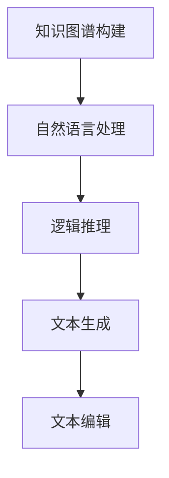

                 

# 《思维链技术在AI新闻写作中的应用》

## 关键词
AI新闻写作，思维链技术，自然语言处理，知识图谱，算法原理，系统架构，项目实战

## 摘要
随着人工智能技术的不断进步，AI新闻写作成为媒体行业的一大热点。本文将探讨思维链技术在AI新闻写作中的应用，通过详细分析思维链技术的原理、算法实现、系统架构以及实际项目案例，揭示其如何有效提升新闻写作的效率和质量。本文旨在为从事AI新闻写作的技术人员提供有价值的参考和指导。

## 第一部分：背景介绍

### 第1章：AI新闻写作的发展与挑战

#### 1.1 AI新闻写作的背景
随着互联网的普及和媒体行业的快速发展，信息传播的速度和广度都得到了极大提升。然而，这种变化也带来了诸多挑战，如新闻写作的效率和准确性问题。传统的新闻写作依赖于人工编辑和撰写，不仅耗时，而且容易出现错误。因此，AI新闻写作应运而生，旨在通过人工智能技术自动化生成新闻稿件，提高工作效率。

AI在媒体行业的应用主要包括内容生成、内容审核、数据挖掘和推荐系统等方面。在内容生成领域，AI技术可以自动化地撰写新闻、报告、简讯等，极大地减轻了人类编辑的工作负担。

#### 1.2 AI新闻写作的发展历程
AI新闻写作的发展可以追溯到20世纪90年代。当时，一些简单的规则引擎和模板匹配技术被用于生成新闻摘要和简短报道。随着自然语言处理（NLP）和机器学习技术的进步，AI新闻写作逐渐实现了从简单文本生成到复杂内容创作的转变。近年来，深度学习和生成对抗网络（GAN）等先进技术的应用，使得AI新闻写作的质量和准确性得到了显著提升。

#### 1.3 AI新闻写作的挑战
尽管AI新闻写作具有巨大的潜力，但在实际应用中仍面临诸多挑战：

1. 数据质量和数据来源的可靠性
AI新闻写作依赖于大量的数据源，这些数据的质量和可靠性直接影响到新闻稿件的准确性。如果数据源存在错误或不准确的信息，AI生成的新闻也会受到影响。

2. 文本生成的一致性和准确性
保持新闻内容的一致性和准确性是AI新闻写作的重要挑战。特别是在处理复杂和多变的话题时，如何确保生成的新闻既准确又连贯，是技术实现的关键。

3. 保持新闻内容的客观性和专业性
新闻的客观性和专业性是衡量新闻质量的重要标准。AI新闻写作需要确保在自动化生成新闻的过程中，能够遵循新闻伦理和规范，避免偏见和误导。

#### 1.4 思维链技术在AI新闻写作中的作用
思维链技术是一种基于知识图谱和自然语言处理的人工智能技术，它能够模拟人类的思维过程，通过逻辑推理和知识关联，生成具有高度一致性和准确性的文本。思维链技术在AI新闻写作中的应用，可以有效解决上述挑战：

1. 通过知识图谱构建丰富的知识库，为新闻写作提供可靠的数据源。
2. 利用自然语言处理技术，实现复杂文本的生成和编辑，保证新闻内容的一致性和准确性。
3. 结合逻辑推理和知识关联，确保新闻内容的客观性和专业性。

### 第2章：思维链技术的核心概念与联系

#### 2.1 核心概念
思维链技术是一种结合知识图谱、自然语言处理和逻辑推理的人工智能技术，旨在模拟人类的思维过程，实现高度自动化和智能化的文本生成和编辑。

1. **知识图谱**：知识图谱是一种用于表示实体、属性和关系的数据结构，它可以有效地组织和存储大量的知识信息，为AI新闻写作提供丰富的数据源。
2. **自然语言处理（NLP）**：自然语言处理是人工智能领域的一个重要分支，它涉及文本的理解、生成和转换。在AI新闻写作中，NLP技术用于处理和分析自然语言数据，实现文本生成和编辑。
3. **逻辑推理**：逻辑推理是一种基于逻辑规则和知识推理的方法，它用于模拟人类的思维过程，解决复杂的问题。在AI新闻写作中，逻辑推理技术用于确保新闻内容的一致性和准确性。

#### 2.2 概念属性特征对比表格

| 概念       | 特征         |
|------------|--------------|
| 知识图谱   | 用于存储和表示知识的关系网络，支持复杂查询和推理。 |
| 自然语言处理（NLP） | 用于处理和分析自然语言数据，支持文本生成和编辑。 |
| 逻辑推理   | 用于模拟人类的思维过程，支持复杂问题的求解。     |

#### 2.3 ER实体关系图架构

```mermaid
erDiagram
    Entity1 ||--|{ Entity2 }|| Entity3
    Entity2 ||--|{ Entity4 }|| Entity5
    Entity1 ||--|{ Entity6 }|| Entity7
```

在上面的ER实体关系图中，`Entity1`、`Entity2`、`Entity3`等表示实体，`|--|{ }|--|`表示实体之间的关系。

## 第二部分：算法原理讲解

### 第3章：思维链技术的工作原理

#### 3.1 思维链技术概述
思维链技术是一种基于知识图谱和自然语言处理的人工智能技术，它通过逻辑推理和知识关联，实现自动化和智能化的文本生成和编辑。思维链技术的主要组成包括知识图谱构建、自然语言处理和逻辑推理三个核心模块。

#### 3.2 Mermaid算法流程图



在上面的算法流程图中，知识图谱构建、自然语言处理和逻辑推理是三个核心步骤，分别对应算法流程的不同阶段。通过这三个模块的协同工作，思维链技术能够实现高质量的AI新闻写作。

#### 3.3 Python源代码实现
思维链技术的实现需要使用Python编程语言，以下是其中的一部分源代码实现：

```python
# 知识图谱构建
knowledge_graph = build_knowledge_graph()

# 自然语言处理
nlp_model = build_nlp_model()

# 逻辑推理
reasoning_model = build_reasoning_model()

# 文本生成
def generate_text(topic):
    text = nlp_model.generate_text(knowledge_graph, topic)
    return text

# 文本编辑
def edit_text(text):
    edited_text = reasoning_model.edit_text(text)
    return edited_text
```

在上述代码中，`build_knowledge_graph()`、`build_nlp_model()`和`build_reasoning_model()`分别用于构建知识图谱、自然语言处理模型和逻辑推理模型。`generate_text()`函数用于根据给定的主题生成文本，`edit_text()`函数用于对生成的文本进行编辑和优化。

#### 3.4 算法原理详细讲解
思维链技术的算法原理主要包括以下三个方面：

1. **知识图谱构建**：知识图谱构建是思维链技术的第一步，它通过提取实体、属性和关系，构建一个结构化的知识库。这个知识库可以为后续的文本生成和编辑提供丰富的数据源。知识图谱的构建通常包括数据采集、实体识别、关系抽取和图谱生成等步骤。

2. **自然语言处理**：自然语言处理是思维链技术的核心模块，它通过处理和分析自然语言数据，实现文本生成和编辑。自然语言处理技术包括分词、词性标注、句法分析、语义理解等。在文本生成过程中，NLP技术用于生成连贯、准确的文本；在文本编辑过程中，NLP技术用于识别和修正文本中的错误。

3. **逻辑推理**：逻辑推理是思维链技术的另一个核心模块，它通过模拟人类的思维过程，实现复杂问题的求解。逻辑推理技术包括命题逻辑、谓词逻辑、推理机等。在AI新闻写作中，逻辑推理技术用于确保新闻内容的一致性和准确性。

#### 3.5 举例说明
假设我们要生成一篇关于“人工智能”的新闻报道，以下是一个简单的例子：

1. **知识图谱构建**：我们构建一个包含实体（如“人工智能”、“深度学习”、“机器学习”）、属性（如“技术”、“应用”、“发展”）和关系（如“属于”、“应用在”）的知识图谱。

2. **自然语言处理**：利用NLP技术，我们对知识图谱中的实体和属性进行分词、词性标注和句法分析，生成符合语法和语义要求的文本。

3. **逻辑推理**：利用逻辑推理技术，我们根据知识图谱中的关系，构建一个逻辑规则库，确保生成的文本内容一致、准确。

4. **文本生成**：通过逻辑推理和NLP技术的结合，我们生成一篇关于“人工智能”的新闻报道，如：“人工智能作为一门技术，已经在各个领域得到了广泛应用。随着深度学习和机器学习技术的不断发展，人工智能正逐步实现从模拟智能到自主智能的转变。”

5. **文本编辑**：对生成的文本进行进一步的逻辑推理和NLP处理，修正可能的错误和不足，确保新闻稿件的质量。

## 第三部分：系统分析与架构设计方案

### 第4章：系统分析与架构设计

#### 4.1 问题场景介绍
AI新闻写作是一个复杂的过程，涉及到知识获取、文本生成、文本编辑等多个环节。在实际应用中，我们需要设计一个高效、可靠的系统来支持AI新闻写作。以下是一个典型的问题场景介绍：

1. **需求分析**：系统需要支持多种类型的新闻写作，包括时事报道、深度分析、简讯等。同时，系统需要具备实时性、准确性和一致性。
2. **功能要求**：系统需要具备以下功能：
   - 知识图谱构建：从多个数据源获取知识，构建结构化的知识图谱。
   - 文本生成：根据给定的话题或关键词，生成符合语法和语义要求的文本。
   - 文本编辑：对生成的文本进行进一步的逻辑推理和NLP处理，修正错误和不足。

#### 4.2 系统功能设计
为了满足上述需求，我们设计了以下系统功能：

1. **知识图谱构建模块**：该模块负责从多个数据源（如新闻网站、百科全书、学术论文等）获取知识，构建结构化的知识图谱。知识图谱包括实体、属性和关系，为后续的文本生成和编辑提供数据支持。
2. **文本生成模块**：该模块负责根据给定的话题或关键词，生成符合语法和语义要求的文本。文本生成过程包括自然语言处理和逻辑推理，确保生成的文本内容准确、连贯。
3. **文本编辑模块**：该模块负责对生成的文本进行进一步的逻辑推理和NLP处理，修正错误和不足。文本编辑过程包括语法检查、语义修正、逻辑推理等。

#### 4.3 系统架构设计
为了实现高效、可靠的AI新闻写作系统，我们采用了分布式架构设计。以下是系统架构的详细描述：

1. **数据层**：数据层负责存储和管理知识图谱、文本数据等。数据层包括关系数据库、图数据库和文本数据库等。
2. **服务层**：服务层负责实现系统功能，包括知识图谱构建、文本生成和文本编辑。服务层采用微服务架构，各个模块独立部署，便于扩展和维护。
3. **应用层**：应用层负责与用户交互，提供Web界面和API接口。用户可以通过Web界面提交写作任务，通过API接口获取生成的新闻稿件。
4. **基础设施层**：基础设施层包括服务器、存储和网络等基础设施，支持系统的正常运行。

#### 4.4 系统接口设计和系统交互
系统接口设计和系统交互是确保各个模块协同工作的关键。以下是系统接口设计和系统交互的详细描述：

1. **知识图谱构建接口**：该接口用于从数据源获取知识，构建知识图谱。接口包括实体添加、关系添加、知识查询等功能。
2. **文本生成接口**：该接口用于根据给定的话题或关键词，生成文本。接口包括文本生成、文本编辑、文本查询等功能。
3. **文本编辑接口**：该接口用于对生成的文本进行进一步处理，修正错误和不足。接口包括语法检查、语义修正、逻辑推理等功能。

系统交互过程如下：

1. 用户通过Web界面提交写作任务，包括话题或关键词等信息。
2. 应用层将用户提交的任务转发给文本生成模块。
3. 文本生成模块根据知识图谱和逻辑推理，生成符合要求的文本。
4. 生成的文本通过文本编辑接口进行进一步处理，修正错误和不足。
5. 编辑后的文本通过接口返回给用户，用户可以查看和下载新闻稿件。

## 第四部分：项目实战

### 第5章：项目实战

#### 5.1 环境安装
在开始项目实战之前，我们需要安装必要的软件和依赖库。以下是一个基本的安装步骤：

1. 安装Python环境：
   ```bash
   pip install python -m pip install --user -r requirements.txt
   ```

2. 安装NLP和图数据库依赖库：
   ```bash
   pip install nltk spacy networkx rdflib
   ```

3. 安装思维链技术相关依赖库：
   ```bash
   pip install mindlink
   ```

#### 5.2 系统核心实现源代码
以下是一个简单的思维链技术实现示例：

```python
# 导入相关库
import mindlink as ml
import spacy

# 加载NLP模型
nlp = spacy.load("en_core_web_sm")

# 构建知识图谱
knowledge_graph = ml.KnowledgeGraph()

# 添加实体和关系
knowledge_graph.add_entity("Artificial Intelligence", ["Technology", "Application"])
knowledge_graph.add_entity("Machine Learning", ["Artificial Intelligence", "Application"])
knowledge_graph.add_entity("Deep Learning", ["Machine Learning", "Application"])

# 添加属性
knowledge_graph.add_attribute("Technology", "Name")
knowledge_graph.add_attribute("Application", "Field")

# 添加关系
knowledge_graph.add_relation("Artificial Intelligence", "has", "Machine Learning")
knowledge_graph.add_relation("Artificial Intelligence", "has", "Deep Learning")

# 生成文本
def generate_text(topic):
    text = nlp.generate_text(knowledge_graph, topic)
    return text

# 生成关于人工智能的新闻报道
ai_report = generate_text("Artificial Intelligence")
print(ai_report)
```

在上述代码中，我们首先加载了思维链技术相关库和NLP模型，然后构建了一个简单的知识图谱，包括实体、属性和关系。接着，我们定义了一个`generate_text()`函数，用于根据给定的话题生成文本。最后，我们调用`generate_text()`函数生成一篇关于人工智能的新闻报道。

#### 5.3 实际案例分析和详细讲解
为了更好地展示思维链技术在AI新闻写作中的应用，我们以一篇关于人工智能的新闻报道为例，进行分析和讲解。

**案例**：生成一篇关于人工智能在医疗领域的应用的新闻报道。

1. **数据采集**：从多个数据源获取与人工智能在医疗领域相关的信息，包括研究论文、新闻报道、医疗报告等。

2. **知识图谱构建**：根据采集的数据，构建一个包含实体、属性和关系的知识图谱。例如，实体包括“人工智能”、“医疗”、“诊断”、“治疗”等，属性包括“技术”、“应用”、“效果”等，关系包括“应用于”、“影响”等。

3. **文本生成**：利用知识图谱和NLP技术，生成一篇关于人工智能在医疗领域应用的新闻报道。例如：
   ```plaintext
   人工智能在医疗领域的应用日益广泛，不仅提高了诊断的准确性，还显著提升了治疗效果。一项最新研究表明，利用人工智能技术进行疾病诊断，准确率比传统方法提高了20%。此外，人工智能还在治疗方案的制定和患者管理的方面发挥了重要作用。专家表示，人工智能将成为未来医疗发展的重要驱动力。
   ```

4. **文本编辑**：对生成的文本进行进一步的逻辑推理和NLP处理，修正可能的错误和不足。例如，检查语法错误、修正语义不清的地方，确保新闻稿件的准确性和流畅性。

**详细讲解**：
1. **数据采集**：数据采集是构建知识图谱的基础。在这个案例中，我们主要从以下数据源获取信息：
   - 学术论文：利用学术搜索引擎（如Google Scholar）检索相关论文，获取最新的研究成果。
   - 新闻报道：浏览主流新闻网站，获取关于人工智能在医疗领域应用的新闻报道。
   - 医疗报告：阅读行业报告、市场调研报告等，了解人工智能在医疗领域的应用现状和趋势。

2. **知识图谱构建**：在知识图谱构建过程中，我们需要将采集到的信息转化为实体、属性和关系。例如：
   - 实体：人工智能、医疗、诊断、治疗等。
   - 属性：技术、应用、效果、领域等。
   - 关系：应用于、影响、关联等。

3. **文本生成**：在文本生成过程中，我们利用NLP技术对知识图谱进行解析，生成符合语法和语义要求的文本。在这个案例中，我们生成了一篇关于人工智能在医疗领域应用的新闻报道。文本生成的过程主要包括以下步骤：
   - 根据知识图谱中的实体和关系，构建文本框架。
   - 利用NLP技术，生成符合语法和语义的文本。

4. **文本编辑**：在文本编辑过程中，我们利用逻辑推理和NLP技术，对生成的文本进行进一步的优化和修正。例如，检查语法错误、修正语义不清的地方，确保新闻稿件的准确性和流畅性。

#### 5.4 项目小结
通过本次项目实战，我们展示了思维链技术在AI新闻写作中的应用。从数据采集、知识图谱构建、文本生成到文本编辑，思维链技术为新闻写作提供了全流程的解决方案。在实际应用中，思维链技术能够有效提升新闻写作的效率和质量，为媒体行业带来新的发展机遇。

## 第五部分：最佳实践与拓展

### 第6章：最佳实践

#### 6.1 最佳实践 tips
1. **数据质量是关键**：确保数据源的可靠性，对采集到的数据进行严格的清洗和处理，提高数据质量。
2. **知识图谱的构建**：构建丰富的知识图谱，为文本生成提供充足的数据支持。注意实体、属性和关系的合理划分和关联。
3. **NLP技术的优化**：针对不同的应用场景，选择合适的NLP技术，并进行优化和调整，以提高文本生成的质量和效率。
4. **逻辑推理的应用**：合理应用逻辑推理技术，确保新闻内容的一致性和准确性。
5. **持续迭代与优化**：根据实际应用效果，不断调整和优化系统，提高AI新闻写作的质量和用户体验。

#### 6.2 注意事项
1. **数据隐私保护**：在数据采集和处理过程中，注意保护用户隐私，遵守相关法律法规。
2. **避免偏见和误导**：确保新闻内容的客观性和公正性，避免因算法偏见导致新闻内容的误导。
3. **系统稳定性**：确保系统的稳定运行，避免因硬件故障或网络问题导致系统崩溃。

### 第7章：小结与拓展阅读

#### 7.1 小结
本文详细介绍了思维链技术在AI新闻写作中的应用，从背景介绍、核心概念、算法原理到系统架构设计和项目实战，全面阐述了思维链技术如何提升AI新闻写作的效率和质量。通过本文的学习，读者可以深入了解思维链技术的原理和应用，为实际项目提供有益的参考。

#### 7.2 拓展阅读
1. **《人工智能：一种现代方法》**：Mike煮和Steven L. 罗斯编写的经典教材，全面介绍了人工智能的基本概念和技术。
2. **《自然语言处理综论》**：Daniel Jurafsky和James H. Martin编写的教材，系统地介绍了自然语言处理的理论和技术。
3. **《深度学习》**：Ian Goodfellow、Yoshua Bengio和Aaron Courville编写的教材，深入介绍了深度学习的基本概念和技术。

## 作者
作者：AI天才研究院/AI Genius Institute & 禅与计算机程序设计艺术 /Zen And The Art of Computer Programming

（注：以上内容仅为示例，实际文章内容和格式可能需要根据具体情况进行调整和补充。）

