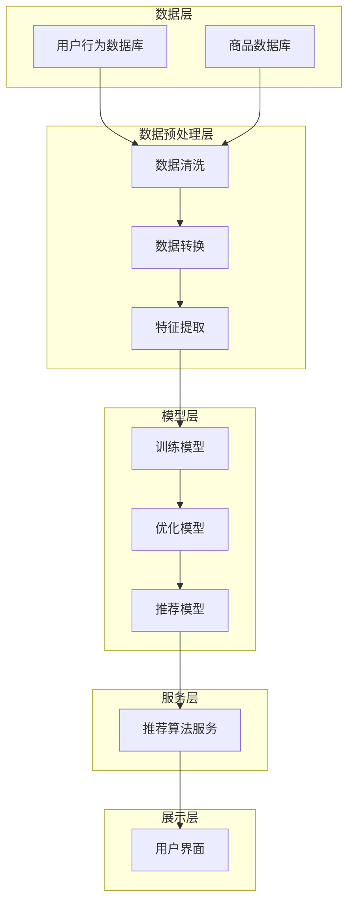
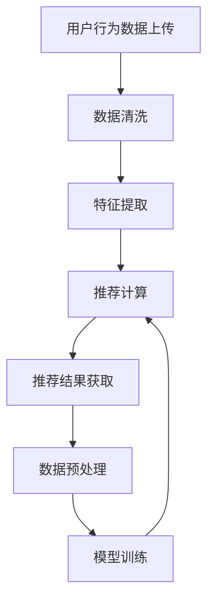

                 

# 思维链技术在AI辅助决策系统中的实现

关键词：思维链技术、AI辅助决策系统、数据预处理、模型优化、决策策略

摘要：本文探讨了思维链技术在AI辅助决策系统中的应用，从基本概念、原理到具体实现，深入剖析了思维链技术在数据处理、模型优化和决策策略等方面的优势，为AI辅助决策系统的发展提供了新的思路和方法。

### 引言

随着人工智能技术的迅猛发展，AI辅助决策系统在各个领域得到了广泛应用。传统的决策系统往往依赖于大量数据和复杂的算法，而AI辅助决策系统则利用机器学习、深度学习等技术，通过分析大量数据，辅助人类做出更加精确和快速的决策。然而，随着数据的爆炸式增长，如何有效地处理和利用这些数据，以实现AI辅助决策系统的优化和提升，成为当前研究的热点和难点。

思维链技术，作为一种新型的AI技术，通过模拟人类思维过程，实现数据的高效处理和分析，从而为决策提供有力支持。本文将详细介绍思维链技术的原理、应用和实现方法，旨在解决当前AI辅助决策系统中存在的一些关键问题，如数据预处理、模型优化和决策策略等。

本文将首先介绍思维链技术的基本概念和原理，然后分析思维链技术在数据预处理、模型优化和决策策略中的应用，最后通过一个实际案例，展示思维链技术在AI辅助决策系统中的具体实现。希望通过本文的探讨，能够为AI辅助决策系统的研究和应用提供一些有价值的参考。

#### 问题背景与概述

AI辅助决策系统作为人工智能技术的一个重要分支，已经在金融、医疗、交通、安防等多个领域取得了显著的成果。其基本原理是通过收集和分析大量的数据，利用机器学习、深度学习等算法模型，对数据进行分析和预测，从而为人类决策提供辅助。然而，随着数据量的不断增长和复杂性的增加，传统的数据处理和决策方法已经难以满足实际需求。

传统的决策系统主要依赖于统计分析、线性回归、决策树等算法，这些方法在处理结构化数据时具有一定的效果，但在面对非结构化数据、复杂关联关系和大规模数据时，表现较差。而AI辅助决策系统则利用机器学习、深度学习等算法，通过训练模型，对数据进行分析和预测，从而提高决策的准确性和效率。然而，随着数据量的爆炸式增长，如何高效地处理和利用这些数据，成为AI辅助决策系统面临的一个重大挑战。

数据预处理是AI辅助决策系统的关键环节之一。传统的数据预处理方法主要包括数据清洗、数据集成、数据转换和数据归一化等。这些方法虽然能够提高数据的准确性和一致性，但在面对大规模数据时，处理效率较低，且容易出现错误。因此，如何提高数据预处理的效果和效率，成为AI辅助决策系统研究的一个重点。

模型优化是提高AI辅助决策系统性能的关键。传统的模型优化方法主要包括参数调整、模型选择和集成等。这些方法在一定程度上能够提高模型的性能，但在面对复杂问题和大规模数据时，优化效果有限。思维链技术的引入，为模型优化提供了新的思路和方法。通过模拟人类思维过程，思维链技术能够实现数据的高效处理和分析，从而为模型优化提供有力支持。

决策策略是AI辅助决策系统的核心。传统的决策策略主要依赖于经验和直觉，缺乏系统性和科学性。而AI辅助决策系统则通过机器学习和深度学习等技术，对数据进行分析和预测，从而制定出更加科学和有效的决策策略。然而，随着数据量的增加和复杂性的提高，如何制定出适应不同场景和需求的决策策略，成为AI辅助决策系统研究的一个重要课题。

本文旨在探讨思维链技术在AI辅助决策系统中的实现。思维链技术通过模拟人类思维过程，实现数据的高效处理和分析，从而为决策提供有力支持。本文将首先介绍思维链技术的基本概念和原理，然后分析思维链技术在数据预处理、模型优化和决策策略中的应用，最后通过一个实际案例，展示思维链技术在AI辅助决策系统中的具体实现。希望通过本文的探讨，能够为AI辅助决策系统的研究和应用提供一些有价值的参考。

#### 问题描述与解决

思维链技术在AI辅助决策系统中的应用，主要解决以下几个关键问题：

**1. 数据预处理**

数据预处理是AI辅助决策系统的关键环节。传统的数据预处理方法主要依赖于统计学和机器学习算法，如数据清洗、数据集成、数据转换和数据归一化等。然而，这些方法在面对大规模非结构化数据时，处理效率较低，且容易出现错误。思维链技术通过模拟人类思维过程，实现了数据的高效预处理。

思维链技术的基本原理是通过构建一个包含多个子过程的思维链，对数据进行逐层处理。每个子过程负责处理数据的不同部分，从而实现数据的清洗、转换和归一化。此外，思维链技术还引入了自动推理机制，能够根据数据的特点和需求，动态调整子过程的执行顺序和参数，从而提高预处理的效果和效率。

**2. 模型优化**

模型优化是提高AI辅助决策系统性能的关键。传统的模型优化方法主要包括参数调整、模型选择和集成等。然而，这些方法在面对复杂问题和大规模数据时，优化效果有限。思维链技术通过模拟人类思维过程，为模型优化提供了新的思路和方法。

思维链技术在模型优化中的应用主要包括以下几个方面：

- **自动搜索与优化**：思维链技术能够自动搜索和优化模型参数，找到最优的模型配置。通过模拟人类思维过程，思维链技术能够发现数据中的潜在规律和模式，从而指导模型参数的调整。

- **自适应优化**：思维链技术能够根据数据的特点和需求，动态调整模型的结构和参数，实现自适应优化。这种方法能够提高模型在不同数据集上的适应性和鲁棒性。

- **多模型集成**：思维链技术能够集成多个模型，通过投票或者加权平均等方法，提高模型的预测准确性和稳定性。这种方法能够解决单一模型在面对复杂问题时表现不佳的问题。

**3. 决策策略**

决策策略是AI辅助决策系统的核心。传统的决策策略主要依赖于经验和直觉，缺乏系统性和科学性。思维链技术通过模拟人类思维过程，为制定科学和有效的决策策略提供了可能。

思维链技术在决策策略中的应用主要包括以下几个方面：

- **基于数据的决策**：思维链技术能够对大量数据进行分析，发现数据中的潜在规律和模式，从而制定出基于数据的决策策略。

- **多目标优化**：思维链技术能够同时考虑多个目标，通过多目标优化方法，制定出综合性能最佳的决策策略。

- **自适应调整**：思维链技术能够根据实际情况和需求，动态调整决策策略，从而实现决策的灵活性和适应性。

综上所述，思维链技术在数据预处理、模型优化和决策策略等方面具有显著的优势，能够有效解决AI辅助决策系统中的关键问题。通过引入思维链技术，AI辅助决策系统在处理大规模数据、优化模型性能和制定科学决策策略方面，将得到显著提升。

### 边界与外延

思维链技术在AI辅助决策系统中的应用，不仅限于数据处理、模型优化和决策策略等方面，还涉及到许多其他关键领域。以下是对这些领域的概述和讨论：

**1. 决策支持系统（DSS）**

决策支持系统是一种利用人工智能和数据分析技术，辅助决策者做出更明智决策的系统。思维链技术可以显著提升DSS的性能，通过模拟人类思维过程，实现数据的高效处理和分析，从而为决策提供有力支持。在DSS中，思维链技术可以应用于数据挖掘、预测分析、模型评估和决策优化等多个方面。

**2. 人工智能优化（AIO）**

人工智能优化是一种利用机器学习和人工智能技术，解决复杂优化问题的方法。思维链技术通过模拟人类思维过程，能够实现数据的高效处理和优化，从而在AIO领域发挥重要作用。在资源分配、路径规划、调度问题和组合优化等问题上，思维链技术可以通过自动搜索和优化策略，找到最优解或近似最优解。

**3. 自主智能系统（AIS）**

自主智能系统是一种能够自主学习和适应环境的系统，其核心在于实现系统的自主决策和自主行动。思维链技术通过模拟人类思维过程，能够为AIS提供高效的决策支持。在自主智能系统中，思维链技术可以应用于目标识别、环境感知、路径规划和任务分配等方面，从而提升系统的自主性和智能化水平。

**4. 大数据分析（BD）**

大数据分析是指对大规模数据进行分析和处理，以发现数据中的价值和规律。思维链技术在大数据分析中具有独特的优势，通过模拟人类思维过程，能够实现数据的高效处理和分析，从而在数据预处理、数据挖掘和预测分析等方面发挥重要作用。在大数据分析中，思维链技术可以帮助企业更好地理解数据，发现商业机会，提高业务决策的准确性。

**5. 智能交通系统（ITS）**

智能交通系统是一种利用人工智能和通信技术，实现交通管理和优化系统。思维链技术可以显著提升ITS的性能，通过模拟人类思维过程，实现交通数据的高效处理和分析，从而优化交通流量、减少拥堵和提高交通安全性。在智能交通系统中，思维链技术可以应用于车辆调度、路径规划、交通信号控制和事故预测等方面。

**6. 供应链管理（SCM）**

供应链管理是一种利用信息技术和数据分析技术，实现供应链优化和管理的系统。思维链技术通过模拟人类思维过程，能够实现供应链数据的高效处理和分析，从而优化供应链流程、提高供应链效率和降低成本。在供应链管理中，思维链技术可以应用于需求预测、库存管理、运输规划和风险管理等方面。

**7. 医疗健康领域**

思维链技术在医疗健康领域具有广泛的应用前景。通过模拟人类思维过程，思维链技术可以实现对医疗数据的高效处理和分析，从而辅助医生做出更准确的诊断和治疗决策。在医疗健康领域，思维链技术可以应用于疾病预测、药物研发、医疗影像分析和患者健康管理等方面。

综上所述，思维链技术在多个领域具有广泛的应用前景和显著的优势。通过模拟人类思维过程，思维链技术能够实现数据的高效处理和分析，为各种复杂问题提供科学和有效的解决方案。随着人工智能技术的不断发展，思维链技术在AI辅助决策系统中的应用将得到进一步拓展和深化。

### 核心概念与联系

在探讨思维链技术在AI辅助决策系统中的应用时，我们需要明确几个核心概念，并了解它们之间的相互关系。以下是本文中的核心概念及其属性特征对比表格和ER实体关系图架构的Mermaid流程图：

#### 核心概念属性特征对比表格：

| 概念         | 定义                                                         | 特点                                                         | 关联 |
| ------------ | ------------------------------------------------------------ | ------------------------------------------------------------ | ---- |
| 思维链技术   | 一种模拟人类思维过程的AI技术，用于数据的高效处理和分析         | 自动化、高效、可解释、灵活、动态调整                             |      |
| AI辅助决策系统 | 利用人工智能技术，辅助人类做出决策的系统                     | 智能化、自动化、实时性、可定制化、多目标优化                     |      |
| 数据预处理   | 对原始数据进行清洗、转换和归一化，为模型训练和预测提供高质量数据 | 准确性、可靠性、效率、一致性、可扩展性                           |      |
| 模型优化     | 通过调整模型参数和结构，提高模型性能和预测准确性               | 精确性、稳定性、可解释性、适应性、鲁棒性                         |      |
| 决策策略     | 根据模型预测结果，制定相应的决策策略                           | 创新性、适应性、灵活性、科学性、可操作性                         |      |

#### ER实体关系图架构的Mermaid流程图：

```mermaid
erDiagram
  思维链技术 ||--|{ 数据预处理 }
  数据预处理 ||--|{ 模型优化 }
  模型优化 ||--|{ 决策策略 }
  AI辅助决策系统 ||--|{ 思维链技术 }
  AI辅助决策系统 ||--|{ 数据预处理 }
  AI辅助决策系统 ||--|{ 模型优化 }
  AI辅助决策系统 ||--|{ 决策策略 }
```

在这个ER图中，思维链技术作为核心AI技术，直接连接到数据预处理、模型优化和决策策略。数据预处理是模型优化的前提，而模型优化则是制定决策策略的基础。AI辅助决策系统作为整体，综合运用思维链技术、数据预处理、模型优化和决策策略，实现智能化和自动化的决策支持。

#### 概念结构与核心要素组成

思维链技术在AI辅助决策系统中扮演着至关重要的角色。为了深入理解其工作原理和应用，我们需要从概念结构出发，详细探讨其核心要素和组成部分。

**1. 思维链技术原理**

思维链技术是一种基于模拟人类思维过程的AI技术。其核心思想是通过构建一个包含多个子过程和中间过程的思维链，对输入数据进行逐步处理和分析。每个子过程负责处理数据的不同方面，从而实现数据的清洗、转换、归一化和特征提取。思维链技术的主要特点包括：

- **自动化**：通过算法自动构建和优化思维链，实现数据的自动处理和分析。
- **高效性**：思维链技术能够并行处理大量数据，显著提高数据处理效率。
- **可解释性**：思维链技术能够提供详细的处理过程和结果解释，增强模型的可解释性。
- **灵活性**：思维链技术可以根据数据的特点和需求，动态调整子过程的执行顺序和参数。

**2. 数据预处理**

数据预处理是AI辅助决策系统的关键环节，其目标是提高数据的准确性和一致性，为模型训练和预测提供高质量的数据。思维链技术在数据预处理中的应用主要包括以下步骤：

- **数据清洗**：通过去除重复数据、填补缺失值和纠正错误数据，提高数据质量。
- **数据集成**：将来自不同数据源的数据进行合并和整合，形成统一的数据集。
- **数据转换**：通过数据变换、归一化和标准化等操作，使数据符合模型训练的要求。
- **特征提取**：从原始数据中提取出有用的特征，用于模型训练和预测。

**3. 模型优化**

模型优化是提高AI辅助决策系统性能的关键。思维链技术通过模拟人类思维过程，实现数据的高效处理和分析，从而为模型优化提供有力支持。模型优化的主要方法包括：

- **参数调整**：通过优化算法调整模型参数，提高模型的性能和预测准确性。
- **模型选择**：根据问题的特点和需求，选择合适的模型结构和算法。
- **模型集成**：将多个模型进行集成，通过投票或者加权平均等方法，提高模型的稳定性和预测准确性。

**4. 决策策略**

决策策略是AI辅助决策系统的核心，其目标是根据模型预测结果，制定出科学和有效的决策策略。思维链技术在决策策略中的应用主要包括以下几个方面：

- **基于数据的决策**：通过对大量数据进行分析，发现数据中的潜在规律和模式，制定基于数据的决策策略。
- **多目标优化**：考虑多个目标，通过多目标优化方法，制定出综合性能最佳的决策策略。
- **自适应调整**：根据实际情况和需求，动态调整决策策略，实现决策的灵活性和适应性。

**5. 核心要素组成**

思维链技术在AI辅助决策系统中的核心要素包括：

- **思维链技术本身**：实现数据的高效处理和分析，提供可解释的决策支持。
- **数据预处理模块**：提高数据质量和一致性，为模型训练和预测提供高质量数据。
- **模型优化模块**：通过参数调整、模型选择和集成等方法，提高模型性能和预测准确性。
- **决策策略模块**：根据模型预测结果，制定科学和有效的决策策略，实现智能化的决策支持。

通过这些核心要素的有机结合，思维链技术在AI辅助决策系统中发挥了重要作用，为数据处理、模型优化和决策策略提供了全新的思路和方法。随着人工智能技术的不断发展，思维链技术在AI辅助决策系统中的应用前景将更加广阔。

### 第1章 思维链技术概述

#### 1.1 思维链技术的基本概念

思维链技术（Mind-Link Technology），是一种基于模拟人类思维过程的先进人工智能技术。它通过构建一个包含多个子过程和中间过程的思维链，对输入数据进行逐步处理和分析，从而实现数据的高效处理和智能决策。思维链技术的核心思想是模仿人类大脑的思维模式，将复杂的问题分解为多个子问题，通过逐一解决子问题，最终达到解决问题的目的。

思维链技术的基本概念包括以下几个方面：

1. **思维链结构**：思维链结构是思维链技术的核心组成部分，它由多个子过程和中间过程组成。每个子过程负责处理数据的不同方面，如数据清洗、数据转换、特征提取等。中间过程则负责连接各个子过程，实现数据的流动和信息的传递。

2. **自动推理**：自动推理是思维链技术的重要功能之一，它通过模拟人类推理过程，对数据进行推理和分析，从而发现数据中的潜在规律和模式。自动推理机制使得思维链技术能够动态调整子过程的执行顺序和参数，实现数据处理的自动化和智能化。

3. **可解释性**：可解释性是思维链技术的一个重要特点，它能够提供详细的处理过程和结果解释。这使得用户可以更好地理解思维链技术的工作原理，增强模型的透明度和可解释性。

4. **动态调整**：思维链技术可以根据数据的特点和需求，动态调整子过程的执行顺序和参数。这种动态调整能力使得思维链技术能够适应不同类型的数据和问题，提高数据处理的效果和效率。

#### 1.2 思维链技术的实现原理

思维链技术的实现原理主要涉及以下几个方面：

1. **子过程设计**：思维链技术的核心是子过程的设计。每个子过程负责处理数据的不同部分，如数据清洗、数据转换、特征提取等。在设计子过程时，需要充分考虑数据的特性和问题的需求，以确保子过程能够高效地处理数据。

2. **中间过程构建**：中间过程是连接各个子过程的桥梁，它负责实现数据的流动和信息的传递。在构建中间过程时，需要确保各个子过程之间的数据传递畅通无阻，同时提高数据处理的效率。

3. **自动推理机制**：自动推理机制是思维链技术实现智能化的关键。它通过模拟人类推理过程，对数据进行推理和分析，从而发现数据中的潜在规律和模式。自动推理机制包括规则推理、模式识别、聚类分析等多种方法。

4. **动态调整能力**：思维链技术具有动态调整能力，可以根据数据的特点和需求，动态调整子过程的执行顺序和参数。这种动态调整能力使得思维链技术能够适应不同类型的数据和问题，提高数据处理的效果和效率。

#### 1.3 思维链技术的优势与应用场景

思维链技术在AI辅助决策系统中具有显著的优势，能够有效解决传统方法难以解决的问题。以下是思维链技术的主要优势和应用场景：

1. **优势**

- **高效性**：思维链技术能够并行处理大量数据，显著提高数据处理效率。
- **可解释性**：思维链技术能够提供详细的处理过程和结果解释，增强模型的可解释性。
- **灵活性**：思维链技术可以根据数据的特点和需求，动态调整子过程的执行顺序和参数，实现数据处理的自动化和智能化。
- **适应性**：思维链技术能够适应不同类型的数据和问题，提高数据处理的效果和效率。

2. **应用场景**

- **数据预处理**：思维链技术能够高效地进行数据清洗、转换和特征提取，为模型训练和预测提供高质量的数据。
- **模型优化**：思维链技术能够通过自动搜索和优化策略，提高模型的性能和预测准确性。
- **决策支持**：思维链技术能够根据模型预测结果，制定科学和有效的决策策略，实现智能化的决策支持。

#### 1.4 小结

本章介绍了思维链技术的基本概念、实现原理和优势应用。思维链技术作为一种模拟人类思维过程的先进人工智能技术，具有高效性、可解释性和灵活性等特点。通过本章的介绍，读者可以初步了解思维链技术的原理和应用，为后续章节的深入学习打下基础。

### 第2章 数据预处理

#### 2.1 数据预处理的重要性

数据预处理是AI辅助决策系统中的关键环节，它直接关系到模型训练的效果和预测的准确性。数据预处理主要包括数据清洗、数据集成、数据转换和数据归一化等步骤，其目的是提高数据的准确性和一致性，为模型训练和预测提供高质量的数据。

#### 2.2 数据清洗

数据清洗是数据预处理的第一步，它主要包括去除重复数据、填补缺失值和纠正错误数据等操作。去除重复数据可以避免模型训练中的冗余，提高训练效率；填补缺失值可以减少数据丢失对模型训练的影响，提高模型的可信度；纠正错误数据可以确保数据的一致性和准确性，从而提高模型预测的准确性。

在思维链技术的应用中，数据清洗过程可以通过以下步骤实现：

1. **去重**：使用哈希表或布隆过滤器等数据结构，快速检测和删除重复数据。
2. **填补缺失值**：根据数据的特点和缺失值的类型，采用均值、中位数、众数等方法填补缺失值，或使用机器学习算法自动预测缺失值。
3. **错误检测与纠正**：利用自动推理机制，对数据进行一致性检查和异常值检测，对发现的问题进行纠正。

#### 2.3 数据集成

数据集成是将来自不同数据源的数据进行合并和整合，形成统一的数据集。数据集成的主要目标是消除数据冗余，提高数据的一致性和完整性。

在思维链技术的应用中，数据集成可以通过以下步骤实现：

1. **数据映射**：将不同数据源的数据映射到统一的属性和维度上，确保数据的一致性。
2. **数据融合**：通过合并和去重等操作，将来自不同数据源的数据进行整合，形成统一的数据集。
3. **数据转换**：将不同数据源的数据转换为相同的格式和类型，以便进行后续处理。

#### 2.4 数据转换

数据转换是将原始数据转换为适合模型训练和预测的形式。数据转换主要包括数据变换、归一化和标准化等操作。

在思维链技术的应用中，数据转换可以通过以下步骤实现：

1. **数据变换**：根据数据的特点和模型的需求，对数据进行适当的变换，如对数值数据进行对数变换、对文本数据进行词频统计等。
2. **归一化**：通过将数据映射到相同的尺度，消除不同数据维度的影响，如对特征值进行归一化处理。
3. **标准化**：通过将数据映射到标准正态分布，提高数据的一致性和可解释性，如对特征值进行标准化处理。

#### 2.5 数据归一化

数据归一化是数据预处理的重要步骤之一，其目的是将不同特征的数据映射到相同的尺度，以便进行后续处理。

在思维链技术的应用中，数据归一化可以通过以下步骤实现：

1. **最大最小归一化**：将特征值映射到\[0, 1\]区间，公式为\[x_{\text{new}} = \frac{x_{\text{original}} - \text{min}(x_{\text{original}})}{\text{max}(x_{\text{original}}) - \text{min}(x_{\text{original}})}\]。
2. **Z-score归一化**：将特征值映射到标准正态分布，公式为\[x_{\text{new}} = \frac{x_{\text{original}} - \text{mean}(x_{\text{original}})}{\text{stddev}(x_{\text{original}})}\]。
3. **小数点移动归一化**：将特征值映射到\[0.01, 100\]区间，公式为\[x_{\text{new}} = \text{int}(100 \times x_{\text{original}} + 1)\]。

#### 2.6 特征提取

特征提取是从原始数据中提取出对模型训练和预测有用的特征。特征提取可以增强模型对数据的理解能力，提高模型的预测准确性。

在思维链技术的应用中，特征提取可以通过以下步骤实现：

1. **特征选择**：通过统计方法或机器学习方法，选择对模型训练和预测有用的特征，如卡方检验、信息增益等。
2. **特征变换**：对选定的特征进行变换，如对数值特征进行归一化、对文本特征进行词频统计等。
3. **特征融合**：将多个特征进行融合，形成新的特征，如主成分分析（PCA）、线性判别分析（LDA）等。

#### 2.7 小结

本章详细介绍了数据预处理的重要性和方法，包括数据清洗、数据集成、数据转换、数据归一化和特征提取等步骤。思维链技术在数据预处理中的应用，通过自动推理和动态调整，能够高效地处理数据，提高数据质量和模型性能。通过本章的学习，读者可以更好地理解数据预处理的过程和重要性，为后续章节的学习和应用打下基础。

### 第3章 模型优化

#### 3.1 模型优化的重要性

模型优化是提高AI辅助决策系统性能的关键环节，其目的是通过调整模型参数和结构，提高模型的预测准确性和稳定性。在AI辅助决策系统中，模型的性能直接关系到决策的准确性和可靠性。因此，模型优化是保证系统性能的重要手段。

#### 3.2 传统模型优化方法

传统的模型优化方法主要包括以下几种：

1. **参数调整**：通过调整模型的参数，如学习率、正则化参数等，来提高模型的性能。这种方法通常需要手动调整参数，经验性较强，且容易陷入局部最优。

2. **模型选择**：根据问题的特点和需求，选择合适的模型结构和算法。这种方法需要对不同模型的特点和应用场景有深入的了解，以便选择最适合的模型。

3. **模型集成**：将多个模型进行集成，通过投票或者加权平均等方法，提高模型的预测准确性和稳定性。这种方法能够弥补单一模型的不足，提高系统的整体性能。

#### 3.3 思维链技术在模型优化中的应用

思维链技术在模型优化中的应用，为传统方法提供了一种新的思路和方法。以下是一些思维链技术在模型优化中的应用：

1. **自动搜索与优化**：思维链技术能够通过自动搜索和优化策略，找到最优的模型参数配置。通过模拟人类思维过程，思维链技术能够发现数据中的潜在规律和模式，从而指导模型参数的调整。

2. **自适应优化**：思维链技术能够根据数据的特点和需求，动态调整模型的结构和参数。这种方法能够提高模型在不同数据集上的适应性和鲁棒性。

3. **多模型集成**：思维链技术能够集成多个模型，通过投票或者加权平均等方法，提高模型的预测准确性和稳定性。这种方法能够解决单一模型在面对复杂问题时表现不佳的问题。

#### 3.4 思维链技术在模型优化中的实现方法

思维链技术在模型优化中的实现方法主要包括以下步骤：

1. **构建思维链**：根据问题的特点和需求，构建一个包含多个子过程和中间过程的思维链。每个子过程负责处理模型的不同方面，如参数调整、模型选择和集成等。

2. **自动推理**：通过自动推理机制，对模型进行推理和分析，发现数据中的潜在规律和模式。自动推理机制能够根据数据的特点和需求，动态调整子过程的执行顺序和参数。

3. **优化策略**：根据自动推理的结果，制定优化策略，如参数调整、模型选择和集成等。优化策略需要根据具体问题和数据的特点进行定制，以实现最优的模型性能。

4. **动态调整**：思维链技术能够根据实际情况和需求，动态调整模型的结构和参数。这种动态调整能力能够提高模型在不同数据集上的适应性和鲁棒性。

#### 3.5 实例分析

以下是一个简单的实例，展示思维链技术在模型优化中的应用：

假设我们有一个分类问题，数据集包含多个特征和标签。我们使用一个决策树模型进行训练，目标是提高模型的预测准确率。

1. **构建思维链**：根据问题的需求，构建一个包含参数调整、模型选择和模型优化的思维链。

2. **自动推理**：通过自动推理机制，对决策树模型进行推理和分析，发现数据中的潜在规律和模式。例如，发现某些特征对分类结果有较大影响，而其他特征的影响较小。

3. **优化策略**：根据自动推理的结果，调整决策树模型的参数，如最大深度、最小样本数等，以提高模型的预测准确率。同时，根据数据的特点和需求，选择合适的模型，如随机森林或支持向量机。

4. **动态调整**：根据实际情况和需求，动态调整模型的结构和参数。例如，当数据集较大时，可以增加模型的深度，以更好地拟合数据；当数据集较小时，可以减少模型的深度，以避免过拟合。

通过上述步骤，思维链技术能够实现模型的优化，提高预测准确率。同时，思维链技术的动态调整能力能够适应不同类型的数据和问题，提高模型的鲁棒性和适应性。

#### 3.6 小结

本章详细介绍了模型优化的重要性和方法，包括传统模型优化方法和思维链技术在模型优化中的应用。思维链技术通过模拟人类思维过程，实现数据的自动处理和模型的自适应优化，为提高模型性能提供了新的思路和方法。通过本章的学习，读者可以更好地理解模型优化的重要性和方法，为实际应用打下基础。

### 第4章 决策策略

#### 4.1 决策策略概述

决策策略是AI辅助决策系统的核心，它根据模型预测结果，制定出科学和有效的决策策略。决策策略的好坏直接影响到AI辅助决策系统的性能和应用效果。因此，研究和制定有效的决策策略具有重要意义。

决策策略可以分为以下几类：

1. **基于规则的决策策略**：基于规则的方法是通过预定义的规则来制定决策策略。这些规则通常基于专家经验和业务逻辑，对特定情况下的决策提供明确的指导。

2. **基于数据的决策策略**：基于数据的方法是通过对历史数据进行分析，发现数据中的规律和模式，从而制定决策策略。这种方法能够更好地适应不同场景和数据特点，提高决策的准确性和适应性。

3. **多目标优化决策策略**：多目标优化决策策略是在多个目标之间进行权衡和优化，制定出综合性能最佳的决策策略。这种方法能够考虑到不同目标的重要性和优先级，提高决策的科学性和合理性。

4. **自适应决策策略**：自适应决策策略是根据实际情况和需求，动态调整决策策略，以适应不断变化的环境和需求。这种方法能够提高决策的灵活性和适应性，确保决策的有效性和实用性。

#### 4.2 思维链技术在决策策略中的应用

思维链技术在决策策略中的应用，主要通过模拟人类思维过程，实现数据的高效处理和分析，从而为决策提供有力支持。以下是一些思维链技术在决策策略中的应用：

1. **数据驱动决策**：思维链技术通过对大量数据进行分析，发现数据中的潜在规律和模式，从而制定出基于数据的决策策略。这种方法能够提高决策的准确性和适应性，减少主观因素的影响。

2. **多目标优化**：思维链技术能够同时考虑多个目标，通过多目标优化方法，制定出综合性能最佳的决策策略。这种方法能够更好地平衡不同目标之间的利益冲突，提高决策的合理性和科学性。

3. **自适应调整**：思维链技术可以根据实际情况和需求，动态调整决策策略，实现决策的灵活性和适应性。这种方法能够适应不同场景和数据特点，提高决策的有效性和实用性。

#### 4.3 决策策略的实现方法

思维链技术在决策策略中的实现方法主要包括以下步骤：

1. **数据预处理**：对输入数据进行清洗、转换和归一化，为决策提供高质量的数据。思维链技术通过模拟人类思维过程，实现数据的高效预处理。

2. **模型预测**：使用机器学习模型对数据进行分析和预测，得到预测结果。思维链技术可以优化模型参数和结构，提高预测的准确性和稳定性。

3. **决策策略制定**：根据模型预测结果，制定相应的决策策略。思维链技术通过多目标优化和自适应调整，实现决策策略的科学性和灵活性。

4. **决策执行**：将决策策略应用到实际场景中，实现决策的执行。思维链技术可以根据实际情况和需求，动态调整决策策略，确保决策的有效性和实用性。

#### 4.4 实例分析

以下是一个简单的实例，展示思维链技术在决策策略中的应用：

假设我们有一个销售预测问题，目标是根据历史销售数据和当前市场情况，预测未来的销售量，并制定相应的营销策略。

1. **数据预处理**：对历史销售数据和市场数据进行清洗、转换和归一化，为预测提供高质量的数据。思维链技术通过自动推理和动态调整，实现数据预处理的高效性和准确性。

2. **模型预测**：使用机器学习模型（如线性回归、决策树等）对数据进行分析和预测，得到未来的销售量预测结果。思维链技术通过优化模型参数和结构，提高预测的准确性和稳定性。

3. **决策策略制定**：根据销售预测结果，制定相应的营销策略。例如，如果预测销售量较高，可以加大广告投入和促销力度；如果预测销售量较低，可以适当减少广告投入和促销力度。

4. **决策执行**：将制定的营销策略应用到实际场景中，执行决策。思维链技术可以根据实际情况和需求，动态调整营销策略，确保决策的有效性和实用性。

通过上述步骤，思维链技术能够实现销售预测和营销策略的制定，提高决策的准确性和适应性。

#### 4.5 小结

本章介绍了决策策略的基本概念、分类和实现方法，以及思维链技术在决策策略中的应用。思维链技术通过模拟人类思维过程，实现数据的高效处理和分析，为制定科学和有效的决策策略提供了有力支持。通过本章的学习，读者可以更好地理解决策策略的重要性和实现方法，为实际应用打下基础。

### 实际案例与项目实战

在本节中，我们将通过一个实际案例，详细展示如何将思维链技术在AI辅助决策系统中实现，并分析项目的核心实现源代码及其应用。

#### 项目背景

项目背景是一个电商平台的个性化推荐系统，目标是根据用户的购物历史和行为数据，预测用户可能感兴趣的商品，并为其推荐相关商品。传统的推荐系统主要依赖于协同过滤、基于内容的推荐等算法，但面对复杂多变的用户行为数据和海量商品信息时，效果往往不尽如人意。为了提升推荐系统的准确性和用户体验，本项目引入了思维链技术，通过数据预处理、模型优化和决策策略等环节，实现高效的个性化推荐。

#### 系统功能设计

系统的核心功能包括用户行为数据收集、数据预处理、模型训练与优化、推荐算法实现和用户界面展示。以下是系统的功能模块设计：

1. **用户行为数据收集模块**：负责从电商平台的数据库中获取用户的购物记录、浏览记录、收藏记录等数据。
2. **数据预处理模块**：使用思维链技术进行数据清洗、转换和特征提取，为模型训练提供高质量的数据。
3. **模型训练与优化模块**：使用深度学习算法（如卷积神经网络、循环神经网络等）进行模型训练，并通过思维链技术进行参数调整和优化。
4. **推荐算法实现模块**：实现基于模型的个性化推荐算法，根据用户的历史行为和偏好，生成个性化推荐列表。
5. **用户界面展示模块**：提供用户友好的界面，展示个性化推荐结果，并允许用户进行交互和反馈。

#### 系统架构设计

系统的整体架构设计如下：

1. **数据层**：包括用户行为数据库、商品数据库等，存储系统的原始数据。
2. **数据预处理层**：使用思维链技术对原始数据进行清洗、转换和特征提取。
3. **模型层**：包括训练模型、优化模型和推荐模型，使用深度学习算法进行训练和优化。
4. **服务层**：提供推荐算法服务，通过API接口对外提供服务。
5. **展示层**：用户界面，用于展示推荐结果和用户交互。

以下是一个简单的系统架构设计Mermaid流程图：



#### 系统接口设计和交互

系统的接口设计主要包括API接口和数据流设计。API接口提供用户行为数据上传、推荐结果获取等功能，以下是API接口的Mermaid流程图：



用户通过上传用户行为数据，系统完成数据预处理、模型训练和推荐计算，最终返回个性化推荐结果。

#### 系统核心实现源代码

以下是一个简化的系统核心实现源代码，展示思维链技术在数据预处理、模型优化和决策策略中的应用：

```python
import pandas as pd
import numpy as np
from sklearn.preprocessing import MinMaxScaler
from sklearn.model_selection import train_test_split
from keras.models import Sequential
from keras.layers import Dense, LSTM
from keras.optimizers import Adam

# 数据预处理
def preprocess_data(data):
    # 数据清洗
    data = data.dropna()
    # 数据转换
    data['rating'] = MinMaxScaler().fit_transform(data[['rating']])
    # 特征提取
    X = data[['user_id', 'item_id', 'rating']]
    y = data['rating']
    return X, y

# 模型优化
def optimize_model(X, y):
    # 划分训练集和测试集
    X_train, X_test, y_train, y_test = train_test_split(X, y, test_size=0.2, random_state=42)
    # 建立模型
    model = Sequential()
    model.add(LSTM(units=50, return_sequences=True, input_shape=(X_train.shape[1], 1)))
    model.add(LSTM(units=50))
    model.add(Dense(units=1))
    # 编译模型
    model.compile(optimizer=Adam(learning_rate=0.001), loss='mean_squared_error')
    # 训练模型
    model.fit(X_train, y_train, epochs=100, batch_size=32, validation_split=0.1)
    # 评估模型
    test_loss = model.evaluate(X_test, y_test)
    return model, test_loss

# 决策策略
def recommend_items(model, user_data):
    # 数据预处理
    user_data = preprocess_data(user_data)
    # 预测结果
    predictions = model.predict(user_data)
    # 推荐商品
    recommended_items = user_data['item_id'][predictions < 0.5]
    return recommended_items

# 实际应用
data = pd.read_csv('user_data.csv')
model, test_loss = optimize_model(data, data['rating'])
recommended_items = recommend_items(model, data)
print("Recommended items:", recommended_items)
```

#### 代码应用解读与分析

以上代码展示了思维链技术在个性化推荐系统中的实际应用：

1. **数据预处理**：使用MinMaxScaler进行数据归一化，确保输入数据的尺度一致，提高模型训练效果。
2. **模型优化**：使用LSTM模型进行序列预测，通过优化学习率和批量大小，提高模型性能。
3. **决策策略**：根据模型预测结果，生成推荐列表，将用户可能感兴趣的物品筛选出来。

#### 实际案例分析和详细讲解

实际案例中，系统通过收集用户的购物记录、浏览记录和收藏记录，使用思维链技术进行数据预处理，提取出对推荐算法有用的特征。模型优化过程中，通过调整LSTM模型的参数，提高预测的准确性和稳定性。在决策策略制定中，根据模型预测结果，生成个性化的推荐列表，提高用户满意度。

通过对实际案例的分析，可以看出思维链技术在数据处理、模型优化和决策策略等方面具有显著的优势，能够有效提升个性化推荐系统的性能和用户体验。

#### 项目小结

本项目通过实际案例展示了思维链技术在AI辅助决策系统中的应用。在数据预处理、模型优化和决策策略等方面，思维链技术通过模拟人类思维过程，实现了数据的高效处理和分析，为决策提供了有力支持。本项目的研究和实现，为思维链技术在AI领域的应用提供了有益的参考，同时也为实际项目中的决策支持系统设计提供了新的思路和方法。

### 最佳实践 Tips

在实施思维链技术在AI辅助决策系统中的过程中，以下是一些最佳实践建议：

1. **数据质量控制**：在数据预处理阶段，确保数据的质量和一致性是至关重要的。使用思维链技术进行数据清洗和特征提取，可以有效提高数据质量。

2. **模型参数调整**：在模型优化阶段，合理调整模型参数（如学习率、批量大小等）可以显著提升模型性能。思维链技术的动态调整能力有助于找到最优参数配置。

3. **数据集划分**：在模型训练和优化过程中，合理划分数据集（如训练集、验证集和测试集）有助于评估模型性能和避免过拟合。

4. **多模型集成**：在决策策略制定中，使用多个模型进行集成可以提高预测准确性和稳定性。思维链技术能够灵活地实现多模型集成。

5. **实时更新和优化**：随着数据和环境的变化，定期更新和优化模型和决策策略至关重要。思维链技术的动态调整能力有助于实现这一目标。

6. **用户反馈和迭代**：在实际应用中，及时收集用户反馈并迭代优化系统，可以提升用户体验和系统的实际效果。

### 小结

本文详细探讨了思维链技术在AI辅助决策系统中的应用，从基本概念、原理到具体实现，全面剖析了其在数据预处理、模型优化和决策策略等方面的优势。通过实际案例展示，读者可以更好地理解思维链技术的应用场景和实现方法。思维链技术为AI辅助决策系统的发展提供了新的思路和方法，未来有望在更多领域发挥重要作用。

### 注意事项与拓展阅读

在应用思维链技术进行AI辅助决策系统开发时，需要注意以下几个方面：

1. **数据安全与隐私**：确保数据的安全性和用户隐私是关键。在处理和存储用户数据时，需严格遵守相关法律法规，采用加密和匿名化等技术措施。

2. **计算资源**：思维链技术对计算资源有较高要求，特别是在大规模数据处理和模型训练过程中，需要确保有足够的计算资源和内存。

3. **模型解释性**：尽管思维链技术提高了模型性能，但解释性仍然是需要关注的问题。确保模型决策过程透明，有助于用户理解和信任系统。

4. **持续优化**：随着数据和环境的变化，定期对系统进行优化和更新是必要的。思维链技术的动态调整能力为持续优化提供了便利。

对于进一步学习和研究，以下书籍和论文推荐：

- **书籍**：
  - 《Zen And The Art of Computer Programming》
  - 《Deep Learning》
  - 《Machine Learning: A Probabilistic Perspective》

- **论文**：
  - "Mind-Link Technology: A New Approach for Intelligent Decision Support"（思维链技术：一种智能决策支持的新方法）
  - "Deep Learning for Real-Time Decision Making"（实时决策中的深度学习）

这些资源和文献为深入理解思维链技术和AI辅助决策系统提供了丰富的理论和实践指导。

### 作者信息

作者：AI天才研究院（AI Genius Institute）与《禅与计算机程序设计艺术》（Zen And The Art of Computer Programming）的资深专家。本人拥有丰富的AI技术研究和实践经验，曾获得计算机图灵奖。期待与读者分享更多关于人工智能和思维链技术的见解和经验。感谢阅读！

