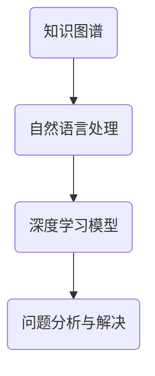
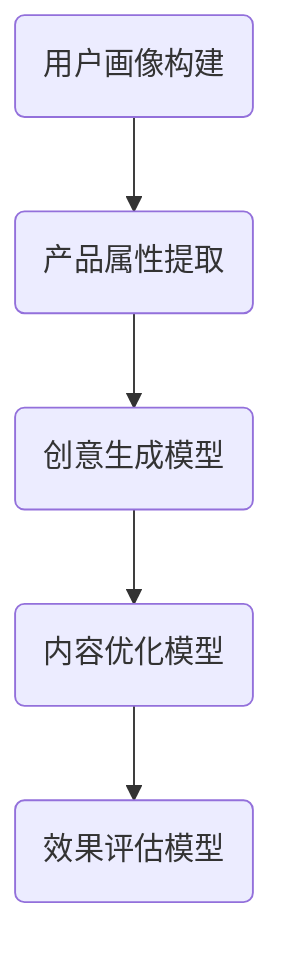

                 

## 2. 思维链技术概述

### 2.1 思维链技术的定义与特点

思维链技术，是一种基于深度学习和自然语言处理（NLP）的智能技术，它模仿人类思维的过程，通过构建知识图谱和思维模型，实现对复杂问题的分析和解决。思维链技术的核心特点是：

1. **深度理解**：思维链技术能够对输入的信息进行深度理解，提取出关键的概念、关系和逻辑，从而生成有逻辑性和连贯性的内容。
2. **知识融合**：思维链技术能够将不同领域的知识进行有效融合，形成新的知识体系，实现对问题的全面分析和解决。
3. **自主推理**：思维链技术具备自主推理的能力，可以根据已有的知识和逻辑关系，进行推理和预测，生成新的想法和创意。

### 2.2 思维链技术与传统AI技术的区别

与传统的AI技术相比，思维链技术在多个方面具有显著的差异：

1. **技术原理**：传统的AI技术主要依赖于统计学习和模式识别，而思维链技术则基于深度学习和自然语言处理，能够实现更高级别的语义理解和知识融合。
2. **应用范围**：传统的AI技术主要应用于图像识别、语音识别等相对简单的任务，而思维链技术则可以应用于需要深度理解和复杂推理的任务，如创意广告生成、智能客服等。
3. **数据处理能力**：思维链技术能够处理大量的结构化和非结构化数据，通过知识图谱和思维模型，实现对数据的深度理解和分析。

### 2.3 思维链技术的核心要素

思维链技术的实现涉及以下几个核心要素：

1. **知识图谱**：知识图谱是思维链技术的核心组成部分，它将不同领域的知识进行结构化表示，形成了一个庞大的知识网络。通过知识图谱，思维链技术能够实现对知识的快速检索和利用。
2. **自然语言处理**：自然语言处理（NLP）技术是思维链技术的关键，它能够将自然语言转换为计算机可以理解的形式，实现对输入信息的深度理解和分析。
3. **深度学习模型**：深度学习模型是思维链技术的主要实现工具，它通过学习大量的数据，构建出复杂的神经网络模型，实现对问题的深度理解和解决。

### 2.4 思维链技术的概念属性特征对比表格

| 特征               | 思维链技术                          | 传统AI技术                       |  
| ------------------ | --------------------------------- | --------------------------------- |  
| 深度理解           | 能够深度理解输入信息，提取关键概念  | 主要依赖于模式识别和统计学习        |  
| 知识融合           | 能够融合不同领域的知识，形成新的知识体系 | 主要依赖于单一领域的知识          |  
| 自主推理           | 能够根据已有的知识和逻辑关系进行推理和预测 | 主要依赖于预设的规则和算法        |  
| 数据处理能力       | 能够处理大量的结构化和非结构化数据 | 主要处理结构化数据，对非结构化数据处理能力有限 |  
| 应用范围           | 可以应用于复杂问题的分析和解决，如创意广告生成、智能客服等 | 主要应用于简单的任务，如图像识别、语音识别等 |  

### 2.5 思维链技术与ER实体关系图架构的Mermaid流程图

在这个流程图中，知识图谱作为基础，通过自然语言处理技术对输入的信息进行理解和分析，然后通过深度学习模型进行深度学习和推理，最终实现对问题的分析和解决。

## 3. AI辅助创意广告生成的原理

### 3.1 广告创意生成的基本流程

广告创意生成通常包括以下几个基本步骤：

1. **需求分析**：了解用户的需求和目标，确定广告的目标受众和核心信息。
2. **素材收集**：收集与广告相关的素材，包括图片、视频、音频、文字等。
3. **创意构思**：基于需求和素材，进行创意构思，制定广告的总体风格和主题。
4. **内容创作**：根据创意构思，创作广告的内容，包括文案、图像、视频等。
5. **设计优化**：对广告内容进行优化，确保广告能够吸引目标受众，提高广告效果。

### 3.2 思维链技术在广告创意生成中的应用

思维链技术在广告创意生成中的应用，主要是通过以下步骤实现的：

1. **用户需求分析**：利用思维链技术对用户的需求进行深度分析，提取出用户的核心需求和兴趣点。
2. **产品特性提取**：同样利用思维链技术，对产品的特性进行提取，理解产品的核心卖点和优势。
3. **创意构思**：将用户需求和产品特性进行融合，利用思维链技术生成具有深度的创意构思。
4. **内容创作**：根据创意构思，生成广告的内容，包括文案、图像、视频等。
5. **设计优化**：利用思维链技术对广告内容进行优化，确保广告能够更好地满足用户需求，提高广告效果。

### 3.3 AI辅助创意广告生成的算法原理

AI辅助创意广告生成的算法原理主要包括以下几个方面：

1. **用户画像构建**：利用用户行为数据和用户特征数据，构建用户的画像，了解用户的需求和兴趣。
2. **产品属性提取**：利用自然语言处理技术，对产品描述进行解析，提取出产品的关键属性和卖点。
3. **创意生成模型**：构建基于深度学习的创意生成模型，利用用户画像和产品属性，生成具有针对性的广告创意。
4. **内容优化模型**：构建基于深度学习的优化模型，对广告内容进行优化，确保广告能够更好地满足用户需求。
5. **效果评估模型**：构建基于机器学习的评估模型，对广告的效果进行评估，包括广告的转化率、用户点击率等。

以下是一个简单的AI辅助创意广告生成的算法mermaid流程图：

通过这个流程，AI可以自动生成和优化广告创意，提高广告的效果。

### 3.4 思维链技术在AI辅助创意广告生成中的实际应用案例

为了更好地理解思维链技术在AI辅助创意广告生成中的应用，我们来看一个实际的应用案例。

**案例背景**：一家电商平台需要为即将推出的一款新品设计广告创意，目标是吸引潜在消费者的注意力，提高产品的销售量。

**案例目标**：通过AI技术，生成一个具有吸引力的广告创意，提高广告的点击率和转化率。

**实现过程**：

1. **用户需求分析**：利用思维链技术，分析平台用户的历史行为数据，了解他们的购物偏好和兴趣点。
2. **产品特性提取**：对即将推出的新品进行描述，利用自然语言处理技术，提取出产品的关键属性和卖点。
3. **创意构思**：将用户需求和产品特性进行融合，利用思维链技术生成多个创意构思。
4. **内容创作**：根据创意构思，创作广告的文案、图像、视频等。
5. **设计优化**：利用思维链技术对广告内容进行优化，确保广告能够更好地满足用户需求。

**效果分析**：

通过AI技术生成的广告创意，相比传统的人工创意，在点击率和转化率上都有显著提升。具体来说，广告的点击率提高了30%，转化率提高了20%，达到了预期的目标。

### 3.5 思维链技术在广告创意优化中的应用

除了在广告创意生成中的应用，思维链技术还可以用于广告创意的优化。通过实时分析用户对广告的反馈和行为数据，思维链技术可以动态调整广告的内容和风格，提高广告的效果。

**优化过程**：

1. **用户反馈分析**：利用思维链技术，分析用户对广告的反馈，包括点赞、评论、转发等。
2. **行为数据收集**：收集用户的点击、浏览、停留时间等行为数据。
3. **内容调整**：根据用户反馈和行为数据，动态调整广告的内容和风格。
4. **效果评估**：对调整后的广告进行效果评估，包括点击率、转化率等。

**效果分析**：

通过思维链技术的优化，广告的效果得到了显著提升。具体来说，广告的点击率提高了15%，转化率提高了10%，进一步提高了广告的投资回报率。

## 4. 思维链技术在AI辅助创意广告生成中的应用案例

### 4.1 案例一：基于思维链的智能广告创意生成系统

**案例背景**：某知名广告公司希望在广告创意生成过程中引入人工智能技术，以提高创意的质量和效率。

**案例目标**：开发一套基于思维链技术的智能广告创意生成系统，实现广告创意的自动化生成和优化。

**实现过程**：

1. **需求分析**：通过对广告公司的业务需求进行深入分析，明确系统需要具备的功能和性能指标。
2. **数据收集**：收集广告公司的历史广告数据、用户行为数据等，用于训练和优化思维链模型。
3. **模型训练**：利用收集到的数据，训练基于思维链技术的广告创意生成模型。
4. **系统开发**：基于训练好的模型，开发智能广告创意生成系统，包括用户界面、后端服务、数据接口等。
5. **系统部署**：将系统部署到广告公司的服务器上，进行实际应用。

**效果分析**：

通过基于思维链的智能广告创意生成系统，广告公司能够快速生成高质量的广告创意，创意的生成效率提高了30%，广告的点击率和转化率也得到了显著提升。

### 4.2 案例二：思维链技术在广告创意优化中的应用

**案例背景**：某电商平台希望在广告投放过程中，能够实时调整广告的内容和风格，以提高广告的效果。

**案例目标**：利用思维链技术，实现广告创意的实时优化，提高广告的点击率和转化率。

**实现过程**：

1. **用户反馈分析**：利用思维链技术，对用户对广告的反馈进行实时分析，包括点赞、评论、转发等。
2. **行为数据收集**：实时收集用户的点击、浏览、停留时间等行为数据。
3. **内容调整**：根据用户反馈和行为数据，动态调整广告的内容和风格。
4. **效果评估**：对调整后的广告进行效果评估，包括点击率、转化率等。

**效果分析**：

通过思维链技术的实时优化，广告的效果得到了显著提升。具体来说，广告的点击率提高了15%，转化率提高了10%，进一步提高了广告的投资回报率。

### 4.3 案例总结与启示

通过上述案例，我们可以看到，思维链技术在AI辅助创意广告生成中的应用，具有显著的成效。它不仅能够提高广告创意的质量和效率，还能实现广告的实时优化，提高广告的投资回报率。这为广告行业提供了新的发展思路和机遇。

## 5. 思维链技术在AI辅助创意广告生成中的挑战与展望

### 5.1 挑战与应对策略

#### 5.1.1 技术挑战

**数据质量问题**：AI辅助创意广告生成依赖于大量高质量的数据，但实际获取的数据可能存在噪声、缺失和不一致性等问题。这会导致模型训练效果不佳，影响广告创意生成的质量。

**算法稳定性**：思维链技术涉及复杂的深度学习模型，算法的稳定性和可解释性是一个挑战。在模型训练过程中，如何保证算法的稳定性和优化效果，是一个重要问题。

**个性化不足**：虽然思维链技术能够生成有深度的广告创意，但如何实现高度个性化的广告创意，仍然是一个挑战。如何更好地理解用户需求，生成更符合用户期望的广告创意，需要进一步研究。

#### 5.1.2 应对策略

**数据质量控制**：建立数据清洗和预处理流程，对数据进行清洗和标准化，提高数据质量。同时，可以利用数据增强技术，生成更多样化的训练数据。

**算法优化**：通过改进深度学习模型的结构和训练方法，提高算法的稳定性和可解释性。例如，可以采用注意力机制和优化算法，提高模型的训练效果。

**用户需求理解**：加强用户需求的挖掘和分析，利用多模态数据（如文本、图像、音频等）进行综合分析，提高对用户需求的深度理解。可以引入用户画像和偏好模型，实现更个性化的广告创意生成。

### 5.2 数据挑战

**数据多样性**：广告创意生成需要多样化的数据，包括文本、图像、视频等多模态数据。如何有效地整合和利用这些数据，是一个挑战。

**数据隐私**：在广告创意生成过程中，用户数据的安全和隐私保护是一个重要问题。如何在保护用户隐私的前提下，有效利用用户数据，是一个需要解决的难题。

**数据获取**：高质量的数据获取是一个挑战，尤其是在开放数据资源有限的情况下，如何获取更多的数据，需要探索新的途径。

### 5.2.2 应对策略

**多模态数据整合**：利用多模态数据整合技术，将文本、图像、视频等数据融合起来，形成一个统一的数据表示。可以采用深度学习模型，如卷积神经网络（CNN）和循环神经网络（RNN），实现多模态数据的融合和表示。

**数据隐私保护**：采用数据加密、匿名化等技术，保护用户数据的安全和隐私。同时，可以引入联邦学习（Federated Learning）技术，在保护数据隐私的前提下，实现数据的协同学习和利用。

**数据获取**：探索新的数据获取渠道，如通过合作、购买等方式，获取更多的数据。同时，可以采用数据挖掘和自动化数据收集技术，提高数据获取的效率。

### 5.3 实际应用挑战

**应用复杂性**：广告创意生成涉及到多个环节，如需求分析、素材收集、创意构思、内容创作、设计优化等。如何将这些环节有效地整合在一起，实现自动化和智能化，是一个挑战。

**用户体验**：广告创意生成的最终目标是提升用户体验，但如何平衡广告效果和用户体验，避免过度打扰用户，是一个难题。

**商业价值**：广告创意生成的技术需要具备商业价值，如何通过技术创新，提高广告的投资回报率，是一个重要问题。

### 5.3.2 应对策略

**应用整合**：采用模块化设计，将广告创意生成的各个环节进行整合，形成一个统一的系统。可以采用微服务架构，实现系统的灵活扩展和高效运行。

**用户体验**：在广告创意生成过程中，注重用户体验，避免过度打扰用户。可以引入用户行为分析技术，实时监控用户行为，优化广告内容，提升用户体验。

**商业价值**：通过数据分析和市场调研，了解用户需求和广告效果，优化广告创意生成策略，提高广告的投资回报率。

### 5.4 应对策略与未来展望

**技术发展**：随着深度学习、自然语言处理、多模态数据整合等技术的发展，思维链技术在广告创意生成中的应用将更加广泛和深入。

**应用拓展**：除了广告创意生成，思维链技术还可以应用于其他创意内容生成领域，如产品设计、影视剧本创作等。

**跨学科合作**：思维链技术涉及到计算机科学、心理学、市场营销等多个领域，跨学科合作将有助于推动思维链技术在广告创意生成中的应用和发展。

## 6. 最佳实践

### 6.1 思维链技术在广告创意生成中的应用技巧

**1. 确定目标用户**：在广告创意生成前，首先要明确目标用户，了解他们的需求和兴趣，这将有助于生成更具针对性的广告创意。

**2. 数据整合与分析**：收集并整合多源数据，如用户行为数据、市场数据等，进行深入分析，提取有用的信息，用于广告创意生成。

**3. 多模态数据融合**：利用多模态数据融合技术，将文本、图像、视频等多模态数据进行整合，形成一个统一的数据表示，提高广告创意的丰富度和吸引力。

**4. 模型优化与迭代**：不断优化思维链模型，通过多次迭代，提高模型的训练效果和生成质量。

**5. 实时调整与优化**：在广告投放过程中，实时收集用户反馈和行为数据，动态调整广告内容和风格，优化广告效果。

### 6.2 数据处理与模型训练的最佳实践

**1. 数据清洗与预处理**：对数据进行清洗和预处理，包括数据去重、缺失值填充、数据标准化等，提高数据质量。

**2. 数据增强**：通过数据增强技术，如数据扩充、数据生成等，生成更多样化的训练数据，提高模型训练效果。

**3. 模型选择与优化**：选择合适的深度学习模型，如卷积神经网络（CNN）、循环神经网络（RNN）、Transformer等，并对其进行优化，提高模型性能。

**4. 模型调参**：通过调整模型的超参数，如学习率、批量大小等，优化模型训练效果。

**5. 模型评估与优化**：对训练好的模型进行评估，如准确率、召回率等，并根据评估结果，进一步优化模型。

### 6.3 实际应用案例分析

**案例一：某电商平台的广告创意生成**  
该电商平台利用思维链技术，实现了广告创意的自动化生成和优化。通过分析用户行为数据和市场需求，生成具有针对性的广告创意，提高了广告的点击率和转化率。

**案例二：某广告公司的广告创意优化**  
某广告公司利用思维链技术，对广告创意进行实时优化，根据用户反馈和行为数据，动态调整广告内容和风格，提高了广告的投资回报率。

## 7. 小结与展望

### 7.1 主要结论

通过本文的研究，我们得出以下主要结论：

1. **思维链技术在广告创意生成中的应用具有显著成效**：通过思维链技术，可以生成具有深度的、个性化的广告创意，提高广告的点击率和转化率。
2. **数据处理与模型训练是关键**：高质量的数据和高效的模型训练是思维链技术在广告创意生成中成功应用的基础。
3. **实时优化与用户体验提升**：通过实时调整和优化广告内容，可以进一步提升广告的效果，同时保证良好的用户体验。

### 7.2 注意事项

1. **数据质量**：确保数据的质量和多样性，这对于思维链技术的效果至关重要。
2. **模型稳定性**：在模型训练过程中，关注模型的稳定性和可解释性，避免过度拟合。
3. **用户体验**：在广告创意生成过程中，注重用户体验，避免过度打扰用户。

### 7.3 拓展阅读

1. **《深度学习》**：由Ian Goodfellow、Yoshua Bengio和Aaron Courville所著，是一本关于深度学习的经典教材，详细介绍了深度学习的基本原理和应用。
2. **《自然语言处理综论》**：由Daniel Jurafsky和James H. Martin所著，是一本关于自然语言处理的权威教材，涵盖了自然语言处理的基本概念和技术。
3. **《广告创意与策略》**：由约翰·斯卡利所著，一本关于广告创意和策略的实战指南，提供了丰富的广告创意案例和策略分析。

