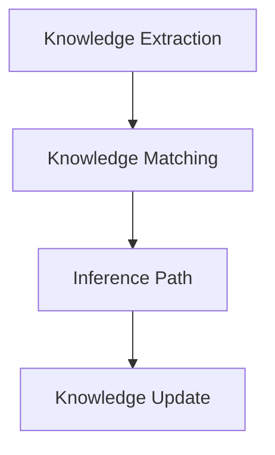
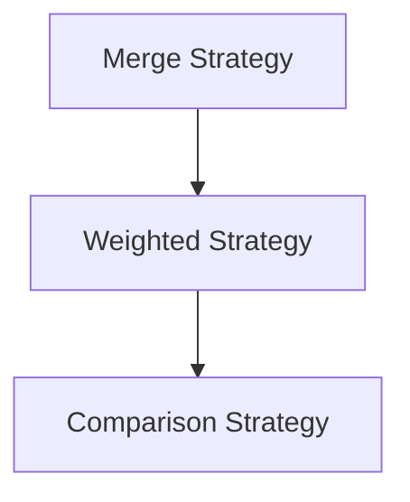
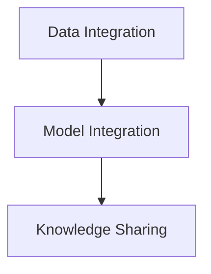
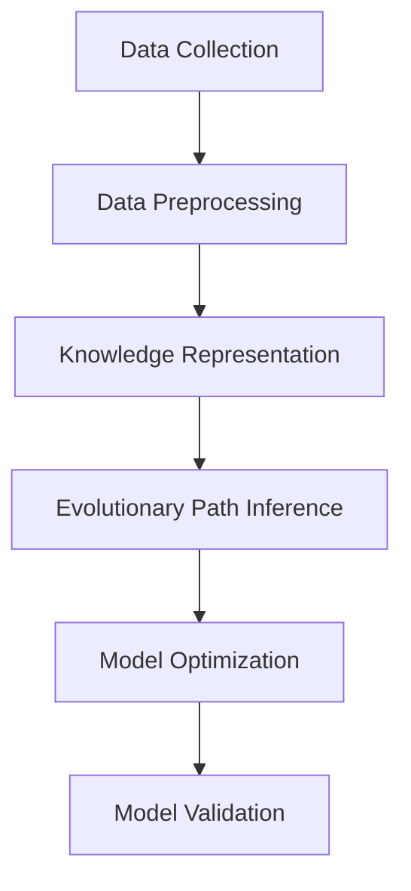

                 

### 1. 引言

在当今快速发展的科技时代，人工智能（AI）已经成为推动科学进步的重要引擎。AI技术的应用不仅提升了数据处理和分析的效率，还改变了传统科学研究的方式。然而，在科学理论的构建过程中，AI的应用仍然面临诸多挑战。传统的AI方法在处理复杂科学问题时，往往难以实现高效、准确的理论构建。因此，如何利用AI技术突破这一瓶颈，成为当前研究的热点。

本文旨在探讨思维链技术在AI辅助科学理论构建中的应用，通过对思维链技术原理的剖析，以及其在生物学领域的具体实例解析，揭示其在科学理论构建中的突破性作用。文章的核心内容包括：

- **思维链技术原理与框架**：介绍思维链技术的定义、特点、核心组件和应用场景，为后续讨论奠定基础。
- **AI辅助科学理论构建实例解析**：以生物学领域为例，具体展示思维链技术在科学理论构建中的应用。
- **技术挑战与解决方案**：分析思维链技术在AI辅助科学理论构建中面临的技术挑战，并提出相应的解决方案。

通过这篇文章，我们希望读者能够对思维链技术在AI辅助科学理论构建中的突破性作用有更深入的了解，从而激发对这一领域的进一步研究和应用。

### 2. 文章关键词

- **思维链技术**：一种基于人工智能的先进理论，用于构建和优化科学理论。
- **AI辅助科学理论构建**：利用人工智能技术，支持科学理论的构建和验证。
- **科学理论**：科学研究的核心成果，用于解释和预测自然现象。
- **生物学领域应用**：思维链技术在生物学中的具体应用实例。
- **技术挑战与解决方案**：思维链技术在科学理论构建中面临的问题及解决策略。

### 3. 文章摘要

本文从问题背景出发，探讨了思维链技术在AI辅助科学理论构建中的应用。首先，介绍了思维链技术的定义、特点及核心组件，并通过具体实例展示了其在生物学领域的应用效果。其次，分析了思维链技术在AI辅助科学理论构建中面临的技术挑战，并提出了相应的解决方案。最后，总结了本文的研究成果，并对未来研究方向进行了展望。通过本文的研究，我们希望为AI技术在科学理论构建中的应用提供新的思路和方法。

---

### 《思维链技术在AI辅助科学理论构建中的突破》目录大纲

---

#### 第一部分：引论

**第1章：问题背景与前沿进展**

- **1.1 问题的提出与核心概念**
  - **1.1.1 问题背景**
    - **1.1.1.1 AI在科学理论构建中的应用现状**
    - **1.1.1.2 存在的挑战与问题**
  - **1.1.2 核心概念介绍**
    - **1.1.2.1 思维链技术**
    - **1.1.2.2 AI辅助科学理论构建**
  - **1.1.3 边界与外延**
    - **1.1.3.1 与传统理论的区别**
    - **1.1.3.2 与其他AI技术的关联**

- **1.2 前沿进展与突破点**
  - **1.2.1 国际前沿研究综述**
    - **1.2.1.1 思维链技术的研究动态**
    - **1.2.1.2 AI辅助科学理论构建的最新成果**
  - **1.2.2 中国在该领域的研究进展**
    - **1.2.2.1 主要研究成果**
    - **1.2.2.2 存在的差距与机遇**

- **1.3 本书结构安排与目标**
  - **1.3.1 内容安排**
    - **1.3.1.1 各章节核心内容概述**
    - **1.3.1.2 整体逻辑关系与结构设计**
  - **1.3.2 阅读目标**
    - **1.3.2.1 知识点掌握**
    - **1.3.2.2 研究方法与技能提升**

#### 第二部分：思维链技术原理与框架

**第2章：思维链技术基础**

- **2.1 思维链技术的定义与特点**
  - **2.1.1 思维链技术的定义**
    - **2.1.1.1 基本概念**
    - **2.1.1.2 发展历程**
  - **2.1.2 思维链技术的特点**
    - **2.1.2.1 灵活性与适应性**
    - **2.1.2.2 自适应与优化能力**
    - **2.1.2.3 强大的数据处理与分析能力**

- **2.2 思维链技术的核心组件**
  - **2.2.1 知识表示与建模**
    - **2.2.1.1 知识表示方法**
    - **2.2.1.2 建模技术**
  - **2.2.2 知识推理与推断**
    - **2.2.2.1 推理算法**
    - **2.2.2.2 推断机制**
  - **2.2.3 知识融合与集成**
    - **2.2.3.1 融合策略**
    - **2.2.3.2 集成技术**

- **2.3 思维链技术的应用场景**
  - **2.3.1 科学研究**
    - **2.3.1.1 AI辅助实验设计**
    - **2.3.1.2 理论模型构建与验证**
  - **2.3.2 工程设计**
    - **2.3.2.1 复杂系统建模与优化**
    - **2.3.2.2 创新方案设计与评估**

#### 第三部分：AI辅助科学理论构建实例解析

**第3章：生物学领域的应用**

- **3.1 生物学领域的问题背景**
  - **3.1.1 生物学研究中的难题**
    - **3.1.1.1 基因表达调控**
    - **3.1.1.2 进化与适应性**
  - **3.1.2 AI辅助研究的重要性**
    - **3.1.2.1 提高研究效率**
    - **3.1.2.2 促进理论创新**

- **3.2 思维链技术在生物学中的应用实例**
  - **3.2.1 基因调控网络的构建**
    - **3.2.1.1 算法原理讲解**
    - **3.2.1.2 数学模型与公式**
    - **3.2.1.3 案例分析**
  - **3.2.2 进化理论的辅助构建**
    - **3.2.2.1 算法流程与mermaid图**
    - **3.2.2.2 数学模型解析**
    - **3.2.2.3 实际案例剖析**

#### 第四部分：AI辅助科学理论构建的挑战与展望

**第4章：技术挑战与解决方案**

- **4.1 数据与算法挑战**
  - **4.1.1 数据质量问题**
    - **4.1.1.1 数据清洗与预处理**
    - **4.1.1.2 数据噪声处理**
  - **4.1.2 算法优化挑战**
    - **4.1.2.1 算法复杂度降低**
    - **4.1.2.2 模型可解释性提升**

- **4.2 应用挑战与对策**
  - **4.2.1 集成与兼容性问题**
  - **4.2.2 理论创新与实证验证**

---

## 第1章：问题背景与前沿进展

### 1.1 问题的提出与核心概念

#### 1.1.1 问题背景

在科学发展的历程中，理论构建一直是科学研究的核心任务。科学理论不仅是解释自然现象的重要工具，更是推动科学进步的引擎。然而，随着科学领域的不断拓展和复杂度的增加，传统的理论构建方法面临着巨大的挑战。传统的理论构建通常依赖于人类专家的经验和直觉，这种方法在处理简单问题时效果显著，但在面对复杂科学问题时，往往显得力不从心。

近年来，人工智能（AI）的迅速发展为科学理论构建带来了新的契机。AI技术，尤其是机器学习和深度学习，通过从大量数据中学习模式和规律，能够辅助人类科学家构建新的科学理论。例如，在物理学中，AI技术被用来发现新的物理现象；在化学中，AI技术被用来设计新的化学物质；在生物学中，AI技术被用来分析基因组数据。

然而，尽管AI技术在科学理论构建中显示出巨大的潜力，但现有的AI方法仍然存在一些局限性。首先，AI模型往往依赖于大量标注数据，而科学领域中的数据往往难以获得或标注。其次，现有的AI模型在处理复杂科学问题时，难以捕捉到深层次的科学规律。此外，AI模型的可解释性也是一个重要问题。科学理论构建需要模型具备高度的透明度和可解释性，以便科学家能够理解并验证模型的结论。

因此，如何在AI辅助科学理论构建中克服这些挑战，成为一个亟待解决的问题。思维链技术作为一种新兴的人工智能方法，提供了可能的解决方案。思维链技术通过模拟人类的思维过程，能够在复杂科学问题中实现高效、准确的推理和建模。本节将介绍思维链技术的基本概念，并探讨其在AI辅助科学理论构建中的应用。

#### 1.1.2 核心概念介绍

##### 1.1.2.1 思维链技术

思维链技术（Mind Chain Technology），简称MCT，是一种基于人工智能的先进理论，旨在模拟人类思维的复杂过程，以实现高效的推理、建模和决策。思维链技术的基本原理是构建一系列相互关联的“思维节点”，每个节点代表一个特定的思维过程或知识单元。通过这些节点的连接和交互，系统能够模拟人类在处理问题时的思维链路。

思维链技术的发展可以追溯到认知科学和人工智能领域的早期研究。在20世纪80年代，神经网络的兴起为思维链技术的实现提供了理论基础。随着深度学习技术的进步，思维链技术逐渐走向成熟。近年来，随着大数据和云计算的发展，思维链技术在处理大规模复杂数据方面展现出强大的能力。

##### 1.1.2.2 AI辅助科学理论构建

AI辅助科学理论构建是指利用人工智能技术，特别是机器学习和深度学习，支持科学理论的发现、验证和构建。这一过程通常包括以下几个步骤：

1. **数据收集与预处理**：收集相关领域的实验数据、文献数据和观测数据，并进行清洗、去噪和格式化，以便后续处理。
2. **模型训练与优化**：使用机器学习算法，如神经网络、支持向量机和决策树，训练模型以识别数据中的模式和规律。
3. **理论构建与验证**：基于训练好的模型，构建科学理论，并通过实验和模拟进行验证。
4. **理论优化与迭代**：根据验证结果，调整和优化理论模型，以提高其准确性和可靠性。

AI辅助科学理论构建的核心目标是提升科学研究的效率和准确性。通过自动化和智能化的方法，AI技术能够处理大量复杂的数据，识别出隐藏在数据背后的科学规律，从而推动科学理论的创新和发展。

#### 1.1.3 边界与外延

##### 1.1.3.1 与传统理论的区别

与传统科学理论构建方法相比，AI辅助科学理论构建具有以下几个显著区别：

1. **数据驱动**：传统的科学理论构建往往依赖于专家经验和实验数据，而AI辅助的方法更加依赖于数据，特别是大规模、多维度的数据。
2. **自动化与智能化**：AI技术能够自动处理和分析数据，实现理论构建的自动化和智能化，减少了人为干预的需求。
3. **可解释性**：传统科学理论构建方法通常具有较高的透明度和可解释性，而AI辅助方法在解释模型的决策和结果方面存在一定的挑战。

##### 1.1.3.2 与其他AI技术的关联

思维链技术与其他AI技术如机器学习、深度学习和自然语言处理等有着密切的关联。机器学习和深度学习为思维链技术提供了强大的数据处理和分析能力，而自然语言处理则帮助思维链技术更好地理解和处理人类语言。

尽管这些技术有其各自的优势和特点，但思维链技术通过模拟人类思维过程，能够实现更为复杂和灵活的推理和建模，从而在AI辅助科学理论构建中展现出独特的优势。

### 1.2 前沿进展与突破点

#### 1.2.1 国际前沿研究综述

在国际学术界，思维链技术作为一种新兴的人工智能方法，已经引起了广泛关注。近年来，许多研究团队在这一领域取得了重要的进展。

1. **思维链技术的理论基础**：在认知科学和人工智能领域，研究者们提出了多种思维链模型，如基于图神经网络的思维链模型和基于多Agent系统的思维链模型。这些模型通过模拟人类思维过程的各个阶段，实现了高效的推理和决策。

2. **应用领域的拓展**：思维链技术不仅应用于传统的科学领域，如物理学、化学和生物学，还广泛应用于工程、经济和社会科学等领域。例如，在工程领域，思维链技术被用于复杂系统的建模和优化；在经济学领域，思维链技术被用于预测市场和股票走势。

3. **数据驱动的理论构建**：通过结合大数据和思维链技术，研究者们能够从海量数据中提取有价值的信息，构建新的科学理论。例如，在医学领域，研究者们利用思维链技术分析基因组数据，发现新的疾病基因和药物靶点。

4. **跨学科研究**：思维链技术的应用不仅限于单一学科，许多研究团队开始进行跨学科研究，探索思维链技术在多学科交叉领域的应用。例如，在生态学和环境科学领域，研究者们利用思维链技术构建了生态系统的动态模型，为环境保护和资源管理提供了科学依据。

#### 1.2.2 AI辅助科学理论构建的最新成果

AI辅助科学理论构建的最新成果主要集中在以下几个方面：

1. **理论模型的构建**：研究者们通过机器学习和深度学习技术，构建了一系列新的科学理论模型。例如，在物理学中，研究者们利用深度学习技术发现了新的物理现象，并在实验中得到了验证。在生物学中，研究者们利用机器学习技术构建了基因调控网络模型，并成功预测了基因的功能。

2. **理论验证与优化**：通过实验和模拟，研究者们验证了AI辅助科学理论模型的准确性和可靠性。例如，在医学领域，研究者们利用AI模型预测疾病的发病风险，并通过临床试验验证了模型的准确性。在经济学领域，研究者们利用AI模型预测经济趋势，为政府和企业提供了决策支持。

3. **跨领域应用**：AI辅助科学理论构建的应用不仅限于传统科学领域，还拓展到了新兴领域。例如，在人工智能领域，研究者们利用AI技术构建了智能控制系统，提高了系统的效率和稳定性。在社会科学领域，研究者们利用AI技术分析社会数据，揭示了社会现象的规律和趋势。

#### 1.2.3 中国在该领域的研究进展

中国在思维链技术和AI辅助科学理论构建领域也取得了一系列重要成果。以下是中国在该领域的研究进展概述：

1. **基础理论研究**：中国的研究者们在思维链技术的基础理论方面取得了重要进展。例如，研究者们提出了基于深度学习的思维链模型，并通过实验验证了其有效性和实用性。

2. **应用研究**：中国的研究团队在多个领域展开了应用研究，并取得了一系列重要成果。例如，在生物医学领域，研究者们利用思维链技术分析了大量的基因组数据，发现了新的疾病基因和药物靶点。在环境科学领域，研究者们利用思维链技术构建了生态系统的动态模型，为环境保护提供了科学依据。

3. **国际合作**：中国的研究者们在国际学术界也积极参与合作研究，并与国际同行分享了研究成果。例如，中国的研究团队与欧洲的研究机构合作，利用思维链技术分析欧洲的气候变化数据，为全球气候治理提供了科学支持。

#### 1.2.4 存在的差距与机遇

尽管中国在思维链技术和AI辅助科学理论构建领域取得了一系列重要成果，但与国际先进水平相比，仍然存在一定的差距。以下是中国在该领域存在的差距和面临的机遇：

1. **技术基础**：中国的人工智能技术和思维链技术基础相对于国际先进水平还有一定差距。例如，在算法优化和模型设计方面，中国的研究者需要进一步提升技术水平，以实现更高的效率和准确性。

2. **应用场景**：尽管中国在多个领域展开了应用研究，但与国际先进水平相比，应用场景仍不够广泛。例如，在医学、金融和社会科学等领域，中国的研究者需要进一步探索思维链技术的应用潜力，推动科学理论的创新和发展。

3. **国际合作**：中国在国际合作方面还有进一步发展的空间。通过加强与国际同行的交流与合作，中国的研究者可以借鉴国际先进经验，提升自身研究水平。

4. **政策支持**：中国政府在人工智能和科技创新方面的政策支持为思维链技术和AI辅助科学理论构建领域提供了良好的发展环境。未来，中国可以通过加大政策支持力度，进一步推动该领域的发展。

### 1.3 本书结构安排与目标

#### 1.3.1 内容安排

本书的内容安排分为四个主要部分：

1. **引论**：介绍思维链技术在AI辅助科学理论构建中的重要性，并提出本文的研究目标和内容结构。
2. **思维链技术原理与框架**：详细阐述思维链技术的定义、特点、核心组件和应用场景，为后续讨论提供理论基础。
3. **AI辅助科学理论构建实例解析**：通过具体实例，展示思维链技术在生物学领域中的应用，并分析其在科学理论构建中的突破性作用。
4. **技术挑战与解决方案**：讨论思维链技术在AI辅助科学理论构建中面临的技术挑战，并提出相应的解决方案。

#### 1.3.1.1 各章节核心内容概述

- **第1章：引论**：介绍研究背景、核心概念、前沿进展、中国研究进展及本书结构。
- **第2章：思维链技术基础**：详细阐述思维链技术的定义、特点、核心组件和应用场景。
- **第3章：生物学领域的应用**：分析思维链技术在生物学领域的应用，包括基因调控网络和进化理论的实例。
- **第4章：技术挑战与解决方案**：讨论思维链技术在AI辅助科学理论构建中面临的技术挑战及解决方案。

#### 1.3.1.2 整体逻辑关系与结构设计

本书的整体逻辑关系和结构设计旨在系统性地介绍思维链技术在AI辅助科学理论构建中的应用。首先，通过引论部分，读者可以了解研究的背景、核心概念和前沿进展。接着，通过第二部分，读者可以深入理解思维链技术的理论基础和核心组件。在第三部分，通过具体实例展示思维链技术的应用效果。最后，第四部分讨论思维链技术在科学理论构建中面临的技术挑战及解决方案。

#### 1.3.2 阅读目标

通过阅读本书，读者可以达成以下目标：

- **知识点掌握**：掌握思维链技术的基本概念、原理和应用场景，了解AI辅助科学理论构建的核心方法。
- **研究方法与技能提升**：学习如何应用思维链技术解决科学理论构建中的实际问题，提升科研能力。

### 1.3.2.1 知识点掌握

- **思维链技术定义与特点**：理解思维链技术的定义、基本原理和特点，包括其灵活性、自适应性和数据处理能力。
- **核心组件与应用场景**：了解思维链技术的核心组件，如知识表示、知识推理和知识融合，及其在不同领域的应用场景。
- **生物学领域应用实例**：掌握思维链技术在生物学领域的具体应用，如基因调控网络的构建和进化理论的辅助构建。
- **技术挑战与解决方案**：了解思维链技术在科学理论构建中面临的技术挑战，如数据质量和算法优化问题，并提出相应的解决方案。

### 1.3.2.2 研究方法与技能提升

- **科研能力提升**：通过学习思维链技术的应用方法，提升科学研究的效率和质量，掌握AI辅助科学理论构建的核心技能。
- **问题解决能力**：学习如何运用思维链技术解决科学理论构建中的复杂问题，提高问题解决的能力。
- **跨学科思维**：通过跨学科实例分析，培养跨学科思维，提升在多领域交叉应用思维链技术的能力。

通过本文的阅读，读者不仅可以深入理解思维链技术在AI辅助科学理论构建中的应用，还可以掌握相关的研究方法和技能，为未来的科研工作提供有力支持。

### 2.1 思维链技术的定义与特点

#### 2.1.1 思维链技术的定义

思维链技术（Mind Chain Technology，简称MCT）是一种基于人工智能的高级理论框架，旨在模拟人类思维过程，通过构建和优化一系列相互关联的“思维节点”来实现高效的推理、决策和知识表示。与传统的人工智能方法相比，思维链技术更加强调知识的动态交互和系统整体优化。

思维链技术的基本概念可以理解为“思维链条”，每个节点代表一个特定的思维活动或知识单元，节点之间的连接则表示思维过程的不同环节。通过这些节点的组合和重组，系统可以模拟出人类在解决问题时的思维路径，从而实现复杂问题的解决。

#### 2.1.1.1 基本概念

- **思维节点**：每个节点表示一个特定的思维活动或知识单元，可以是概念、事实、推理规则等。
- **思维链条**：节点之间的连接关系，表示思维过程的不同阶段和环节。
- **知识库**：存储系统中的所有思维节点和它们之间的关系，是思维链技术进行推理和决策的基础。
- **推理引擎**：负责在知识库中查找和匹配思维节点，实现逻辑推理和知识更新。

#### 2.1.1.2 发展历程

思维链技术的研究可以追溯到认知科学和人工智能的早期工作。在20世纪80年代，神经网络的兴起为思维链技术的实现提供了理论基础。此后，随着计算机性能的提升和大数据技术的发展，思维链技术逐渐走向成熟。

- **初期阶段**：思维链技术的初步探索主要依赖于符号逻辑和基于规则的推理系统，例如专家系统。这些系统通过预先定义的规则库来模拟人类思维过程，但由于规则的复杂性和限制，难以应对实际应用中的复杂问题。
- **中期阶段**：随着机器学习和深度学习技术的发展，研究者开始将神经网络和机器学习算法应用于思维链技术。例如，通过训练神经网络来识别和模拟人类思维活动，从而实现更为灵活和高效的推理。
- **近期阶段**：随着大数据和云计算的发展，思维链技术逐渐走向实用化。研究者们通过结合多源数据和复杂的计算模型，实现了对大规模复杂问题的实时推理和决策支持。

#### 2.1.2 思维链技术的特点

思维链技术具有以下显著特点：

1. **灵活性**：思维链技术能够根据问题的复杂性和不确定性，灵活调整和重组思维节点，从而适应不同场景的需求。这种灵活性使得思维链技术能够在各种应用领域中发挥作用。

2. **适应性**：思维链技术具有较强的自适应能力，能够从海量数据中学习，并不断优化自身性能。这种适应性使得思维链技术在面对不断变化的问题时，能够保持高效和准确的推理能力。

3. **优化能力**：思维链技术通过构建和优化知识库，实现对问题的全面分析和解决。这种优化能力不仅提高了系统的推理效率，还增强了系统的决策能力。

4. **数据处理与分析能力**：思维链技术通过集成多种数据处理和分析方法，如数据挖掘、机器学习和深度学习，实现了对大规模复杂数据的处理和分析。这种强大的数据处理与分析能力使得思维链技术能够在多个领域中得到广泛应用。

#### 2.1.2.1 灵活性与适应性

**灵活性**：思维链技术的灵活性体现在其能够根据问题的不同特点，灵活调整和重组思维节点。例如，在科学理论构建过程中，思维链技术可以根据数据的复杂度和不确定性，动态调整推理策略，从而提高理论构建的效率和准确性。

**适应性**：思维链技术的适应性体现在其能够从海量数据中学习，并不断优化自身性能。例如，在生物医学领域，思维链技术可以通过分析大量的基因组数据和文献数据，发现新的疾病相关基因和药物靶点，从而提高医学研究的效率和准确性。

#### 2.1.2.2 自适应与优化能力

**自适应能力**：思维链技术具有较强的自适应能力，能够从不同来源的数据中学习，并自动调整和优化自身的推理过程。例如，在经济学领域，思维链技术可以通过分析金融市场数据和用户行为数据，预测市场走势和用户需求，从而为金融决策提供支持。

**优化能力**：思维链技术通过构建和优化知识库，实现对问题的全面分析和解决。例如，在工程设计领域，思维链技术可以通过优化设计参数和结构模型，提出最优设计方案，从而提高工程效率和可靠性。

#### 2.1.2.3 强大的数据处理与分析能力

**数据处理能力**：思维链技术能够处理大规模、多维度的数据，如文本数据、图像数据和时空数据。这种强大的数据处理能力使得思维链技术能够在多个领域（如金融、医疗、交通）中发挥重要作用。

**分析能力**：思维链技术通过集成多种数据分析方法（如数据挖掘、机器学习和深度学习），实现了对数据的深层次分析。例如，在医疗领域，思维链技术可以通过分析患者的电子健康记录，预测疾病发展趋势和治疗方案，从而提高医疗服务质量。

#### 2.1.3 思维链技术的核心组件

思维链技术的核心组件包括知识表示、知识推理和知识融合，这些组件共同构成了思维链技术的理论基础和应用框架。

1. **知识表示与建模**：知识表示是思维链技术的基础，通过将人类知识转化为计算机可以理解和处理的形式，实现知识的数字化和结构化。常用的知识表示方法包括语义网络、本体论和知识图谱等。

2. **知识推理与推断**：知识推理是思维链技术的核心功能，通过在知识库中查找和匹配知识，实现对问题的推理和推断。常用的推理算法包括基于规则的推理、基于模型的推理和基于实例的推理等。

3. **知识融合与集成**：知识融合是将多个来源的知识进行整合，形成统一的知识体系。知识融合技术包括数据集成、模型融合和知识共享等。

### 2.2 思维链技术的核心组件

#### 2.2.1 知识表示与建模

知识表示与建模是思维链技术的核心组件之一，它涉及到如何将人类知识转化为计算机可以理解和处理的形式。知识表示不仅决定了系统的知识结构，还直接影响到系统的推理能力和应用范围。

**2.2.1.1 知识表示方法**

知识表示的方法主要包括语义网络、本体论和知识图谱等。

- **语义网络**：语义网络是一种基于节点和边的图形表示方法，用于描述实体和它们之间的关系。在语义网络中，节点表示实体，边表示实体之间的关系，边上的标签表示关系的属性。例如，在一个生物学领域的语义网络中，节点可以表示基因、蛋白质和疾病，边可以表示基因和蛋白质之间的相互作用，以及蛋白质和疾病之间的关联。

  ```mermaid
  graph TD
  A[Gene] --> B[Protein]
  B --> C[Disease]
  A --> D[Disease]
  ```

- **本体论**：本体论是一种用于描述知识领域概念及其关系的理论框架。本体论通过定义概念、属性和关系，构建了一个明确的、结构化的知识体系。本体论广泛应用于信息检索、语义Web和人工智能领域。例如，在医学领域，本体论可以用来定义疾病、症状、治疗方案等概念及其关系。

  ```mermaid
  graph TD
  A[Diagnosis] --> B[Symptom]
  B --> C[Treatment]
  A --> D[Examination]
  ```

- **知识图谱**：知识图谱是一种基于图结构的表示方法，用于描述实体、属性和它们之间的关系。知识图谱通过将大量的知识数据进行结构化组织，形成一个大规模、多层次的语义网络。知识图谱在搜索引擎、推荐系统和智能问答等领域具有广泛的应用。例如，在社交媒体领域，知识图谱可以用来描述用户、内容和社会关系。

  ```mermaid
  graph TD
  A[User] --> B[Content]
  B --> C[Relationship]
  A --> D[Interest]
  ```

**2.2.1.2 建模技术**

建模技术是将知识表示方法应用于实际问题的过程，通过构建数学模型和算法，实现对复杂问题的分析和解决。

- **逻辑建模**：逻辑建模是一种基于形式逻辑的建模方法，通过定义逻辑规则和推理机制，实现对知识的表示和推理。逻辑建模广泛应用于专家系统、知识库和自然语言处理等领域。例如，在医疗诊断系统中，逻辑建模可以用来定义疾病和症状之间的逻辑关系，从而实现诊断推理。

  ```python
  def diagnose(symptoms):
      if symptoms.contains("fever") and symptoms.contains("cough"):
          return "Flu"
      elif symptoms.contains("shortness_of_breath"):
          return "Pneumonia"
      else:
          return "Unknown"
  ```

- **统计建模**：统计建模是一种基于概率统计的建模方法，通过分析数据，提取特征和模式，实现对问题的预测和分类。统计建模广泛应用于机器学习、数据挖掘和预测分析等领域。例如，在金融市场分析中，统计建模可以用来预测股票价格和交易策略。

  ```python
  from sklearn.ensemble import RandomForestClassifier

  # 训练分类器
  classifier = RandomForestClassifier()
  classifier.fit(X_train, y_train)

  # 预测
  predictions = classifier.predict(X_test)
  ```

- **深度学习建模**：深度学习建模是一种基于深度神经网络的学习方法，通过多层非线性变换，实现对数据的特征提取和模式识别。深度学习建模广泛应用于计算机视觉、自然语言处理和语音识别等领域。例如，在图像识别中，深度学习建模可以用来识别图像中的物体和场景。

  ```python
  import tensorflow as tf
  from tensorflow.keras.models import Sequential
  from tensorflow.keras.layers import Conv2D, MaxPooling2D, Flatten, Dense

  # 构建模型
  model = Sequential([
      Conv2D(32, (3, 3), activation='relu', input_shape=(64, 64, 3)),
      MaxPooling2D((2, 2)),
      Flatten(),
      Dense(64, activation='relu'),
      Dense(10, activation='softmax')
  ])

  # 编译模型
  model.compile(optimizer='adam', loss='categorical_crossentropy', metrics=['accuracy'])

  # 训练模型
  model.fit(X_train, y_train, epochs=10, batch_size=32)
  ```

#### 2.2.2 知识推理与推断

知识推理与推断是思维链技术的核心功能，它涉及到如何在知识库中查找和匹配知识，实现逻辑推理和知识更新。

**2.2.2.1 推理算法**

推理算法是实现知识推理的核心，常用的推理算法包括基于规则的推理、基于模型的推理和基于实例的推理等。

- **基于规则的推理**：基于规则的推理是通过定义一系列规则，实现对知识库的推理和推断。这些规则通常以“如果-那么”的形式表示，例如在医疗诊断系统中，可以使用规则来表示疾病和症状之间的逻辑关系。

  ```mermaid
  graph TD
  A[Have fever] --> B[Diagnose: Flu]
  A[Have cough] --> B[Diagnose: Flu]
  A[Have shortness_of_breath] --> C[Diagnose: Pneumonia]
  ```

- **基于模型的推理**：基于模型的推理是通过构建数学模型，实现对知识库的推理和推断。这些模型可以是逻辑模型、统计模型或深度学习模型，例如在金融市场分析中，可以使用统计模型来预测股票价格和交易策略。

  ```python
  def predict_stock_price(model, data):
      # 预测股票价格
      prediction = model.predict(data)
      return prediction
  ```

- **基于实例的推理**：基于实例的推理是通过查找和匹配知识库中的实例，实现对问题的推理和推断。这种方法通常应用于机器学习和数据挖掘领域，例如在医疗诊断系统中，可以使用机器学习算法来识别新的疾病症状。

  ```python
  def diagnose(symptoms, model):
      # 查找相似病例
      similar_cases = model.find_similar_cases(symptoms)
      # 结合相似病例进行诊断
      diagnosis = model.diagnose_based_on_similar_cases(similar_cases)
      return diagnosis
  ```

**2.2.2.2 推断机制**

推断机制是实现知识推理的关键，它涉及到如何从知识库中提取和更新知识。推断机制通常包括以下步骤：

1. **知识提取**：从知识库中提取相关的知识和信息，用于推理和推断。
2. **知识匹配**：将提取的知识与待推理的问题进行匹配，确定推理的方向和路径。
3. **知识更新**：根据推理结果，更新知识库中的知识和信息，以适应新的问题和场景。



#### 2.2.3 知识融合与集成

知识融合与集成是思维链技术的重要功能，它涉及到如何将多个来源的知识进行整合，形成统一的知识体系。

**2.2.3.1 融合策略**

知识融合的策略主要包括以下几种：

1. **合并策略**：将多个知识源中的相同或相似信息进行合并，形成单一的知识表示。
2. **加权策略**：根据不同知识源的重要性和可信度，对知识进行加权，形成综合的知识表示。
3. **对比策略**：将不同知识源中的信息进行对比和补充，形成更加全面和准确的知识表示。



**2.2.3.2 集成技术**

知识集成的技术主要包括以下几种：

1. **数据集成**：将多个数据源中的数据整合到一个统一的数据模型中，例如使用ETL（抽取、转换、加载）技术进行数据集成。
2. **模型集成**：将多个模型进行集成，形成综合的模型体系，例如使用集成学习（Ensemble Learning）技术进行模型集成。
3. **知识共享**：实现不同系统之间的知识共享，形成协同工作，例如使用中间件技术进行知识共享。



通过知识融合与集成，思维链技术能够实现知识的综合和优化，从而提高系统的推理能力和决策水平。

### 2.3 思维链技术的应用场景

#### 2.3.1 科学研究

在科学研究领域，思维链技术被广泛应用于数据分析和理论构建。以下是一些典型的应用场景：

- **数据挖掘与分析**：思维链技术能够处理和分析大规模科学数据，帮助研究者发现数据中的模式和规律。例如，在生物学领域，研究者可以利用思维链技术分析基因组数据，识别基因之间的相互作用和调控关系。

  ```mermaid
  graph TD
  A[Genomic Data] --> B[Mind Chain Technology]
  B --> C[Pattern Discovery]
  C --> D[Genetic Interaction]
  ```

- **理论模型构建与验证**：思维链技术可以辅助研究者构建科学理论模型，并通过实验和模拟进行验证。例如，在物理学中，研究者可以利用思维链技术构建粒子相互作用模型，预测新的物理现象。

  ```mermaid
  graph TD
  A[Physical Data] --> B[Mind Chain Technology]
  B --> C[Theoretical Model]
  C --> D[Experimental Validation]
  ```

#### 2.3.2 工程设计

在工程设计领域，思维链技术被广泛应用于复杂系统的建模和优化。以下是一些典型的应用场景：

- **复杂系统建模与优化**：思维链技术可以模拟和分析复杂工程系统，帮助工程师优化系统设计和性能。例如，在航空航天领域，研究者可以利用思维链技术构建飞行器系统模型，优化飞行性能。

  ```mermaid
  graph TD
  A[System Data] --> B[Mind Chain Technology]
  B --> C[Complex System Modeling]
  C --> D[Performance Optimization]
  ```

- **创新方案设计与评估**：思维链技术可以辅助工程师设计和评估新的工程方案，提高创新能力和效率。例如，在建筑领域，研究者可以利用思维链技术评估建筑结构的稳定性和安全性。

  ```mermaid
  graph TD
  A[Design Proposal] --> B[Mind Chain Technology]
  B --> C[Stability Analysis]
  C --> D[Safety Evaluation]
  ```

通过以上应用场景，我们可以看到思维链技术在科学研究与工程设计中具有广泛的应用前景，为复杂问题的解决提供了新的方法和工具。

### 3.1 生物学领域的问题背景

生物学作为一门研究生命现象的科学，其研究对象涵盖了从微观的分子机制到宏观的生态系统。然而，随着生物学研究的不断深入，也出现了一系列亟待解决的问题。

#### 3.1.1 生物学研究中的难题

##### 3.1.1.1 基因表达调控

基因表达调控是生物学研究中的一个核心问题。基因表达的精确调控对于生物体的正常发育和功能维持至关重要。然而，基因表达调控过程非常复杂，受到多种内外部环境因素的影响。例如，基因之间的相互作用、转录后调控、表观遗传修饰等都可能影响基因表达。因此，解析基因表达调控网络，揭示基因之间的相互作用关系，成为当前生物学研究的一个重要挑战。

##### 3.1.1.2 进化与适应性

进化与适应性是生物学研究的另一个重要领域。进化是一个长期的、复杂的过程，涉及到基因变异、自然选择、遗传漂变等多个机制。理解生物的进化过程，不仅可以揭示生命的起源和多样性，还能为人类解决环境问题和疾病治疗提供启示。然而，进化研究面临诸多挑战，如如何准确预测进化路径、如何理解进化过程中的随机性和规律性等。

#### 3.1.2 AI辅助研究的重要性

随着生物数据的爆炸性增长，传统的生物学研究方法难以应对这些复杂的问题。因此，借助人工智能（AI）技术，尤其是思维链技术，成为生物学研究的重要趋势。AI技术具有以下几个方面的优势：

- **数据处理能力**：AI技术能够处理和分析大规模、多维度的生物数据，如基因组数据、蛋白质结构数据和生态数据。通过数据挖掘和模式识别，AI技术可以帮助研究者发现数据中的隐藏规律和模式。

- **自动化与智能化**：AI技术可以实现生物学研究的自动化和智能化，减少人为干预的需求。例如，通过机器学习算法，可以自动化构建和优化基因表达调控模型，提高研究效率。

- **跨学科应用**：AI技术可以跨越不同的学科领域，提供跨学科的研究方法。例如，结合计算机科学、数学和物理学的方法，AI技术可以为生物学研究提供新的理论框架和技术手段。

因此，AI技术，尤其是思维链技术，在生物学研究中具有重要的作用。它不仅能够提高研究的效率和质量，还能推动生物学理论的创新和发展。下面将具体讨论思维链技术在生物学领域的应用实例，展示其在解决生物学难题中的突破性作用。

#### 3.1.3 AI辅助研究的重要性

##### 3.1.3.1 提高研究效率

在生物学研究中，数据收集和处理通常是一项费时费力的任务。传统的数据分析方法需要大量的手动操作，效率低下。而AI技术，特别是思维链技术，可以通过自动化和智能化的方法，大幅提高数据处理的效率。例如，思维链技术可以利用机器学习和深度学习算法，快速分析和理解基因组数据，识别基因之间的相互作用关系。这种高效的数据处理能力使得生物学家能够更快地完成研究任务，将更多时间用于实验设计和理论构建。

##### 3.1.3.2 促进理论创新

AI技术不仅在数据处理方面具有优势，还能够促进生物学理论的创新。通过从海量数据中提取有价值的信息，AI技术可以帮助研究者发现新的生物学现象和规律。例如，在基因调控网络的研究中，思维链技术可以通过分析大量的基因表达数据，揭示基因之间的复杂调控关系，构建新的基因调控模型。这些新的理论模型不仅能够解释已知的生物学现象，还可以预测新的生物学规律，推动生物学理论的创新和发展。

##### 3.1.3.3 改善实验设计

在生物学研究中，实验设计是一个关键环节。AI技术，尤其是思维链技术，可以通过预测实验结果，优化实验设计，提高实验的成功率。例如，在药物研发过程中，思维链技术可以通过分析大量的化合物结构和生物活性数据，预测新的药物候选分子。这种预测能力可以帮助研究人员更快速地筛选出有潜力的药物，减少实验失败的风险。此外，思维链技术还可以优化实验条件，如温度、pH值和反应时间等，提高实验的可重复性和可靠性。

##### 3.1.3.4 提升可解释性

生物学研究不仅需要高效的实验设计和数据处理，还需要能够解释实验结果的理论模型。AI技术，特别是思维链技术，在这方面具有独特的优势。思维链技术通过模拟人类思维过程，可以构建出高度透明的理论模型，使研究者能够清楚地理解模型的推理过程和结论。这种可解释性不仅有助于研究者验证和优化模型，还可以增强公众对科学研究结果的信任和理解。

总之，AI辅助研究，特别是思维链技术在生物学领域具有重要意义。它不仅能够提高研究效率、促进理论创新和改善实验设计，还能够提升研究结果的解释性和可靠性，为生物学研究带来深远的影响。

### 3.2.1 基因调控网络的构建

基因调控网络是生物学研究中至关重要的一部分，它描述了基因之间的相互作用关系，以及这些关系在生物体内的动态调控过程。思维链技术在基因调控网络的构建中发挥了关键作用，通过一系列算法和模型，实现高效、准确的基因调控网络分析。

#### 3.2.1.1 算法原理讲解

基因调控网络的构建主要依赖于以下几类算法：

1. **基于统计的算法**：这类算法通过分析基因表达数据，识别基因之间的相关性。常用的方法包括主成分分析（PCA）、聚类分析（如K-means聚类）和因子分析（如PCA和PLS）等。这些算法能够识别出基因表达模式，并基于这些模式推断基因之间的调控关系。

2. **基于机器学习的算法**：这类算法利用训练数据，学习基因表达数据中的复杂模式。常用的机器学习算法包括支持向量机（SVM）、随机森林（Random Forest）和深度神经网络（DNN）等。通过训练，这些算法能够预测未知基因之间的调控关系，并优化基因调控网络的预测准确性。

3. **基于图论的算法**：这类算法通过构建基因调控网络的图结构，分析基因之间的拓扑关系。常用的图论算法包括最短路径算法（如Dijkstra算法）、社区发现算法（如Louvain算法）和网络流算法（如Max-Flow算法）等。这些算法能够揭示基因调控网络的动态变化和关键节点。

思维链技术结合了上述多种算法，通过构建一个多层次、多维度的基因调控网络模型，实现对基因调控关系的全面分析。

#### 3.2.1.2 数学模型与公式

在基因调控网络的构建过程中，常用的数学模型和公式包括：

1. **线性回归模型**：用于分析基因表达数据之间的线性关系。公式如下：
   \[ Y = \beta_0 + \beta_1X + \epsilon \]
   其中，\( Y \) 为因变量，表示某个基因的表达水平；\( X \) 为自变量，表示另一个基因的表达水平；\( \beta_0 \) 和 \( \beta_1 \) 为模型的参数；\( \epsilon \) 为误差项。

2. **贝叶斯网络模型**：用于描述基因之间的概率关系。公式如下：
   \[ P(X|Y) = \frac{P(Y|X)P(X)}{P(Y)} \]
   其中，\( P(X|Y) \) 为在给定 \( Y \) 的条件下 \( X \) 的概率；\( P(Y|X) \) 为在给定 \( X \) 的条件下 \( Y \) 的概率；\( P(X) \) 和 \( P(Y) \) 分别为 \( X \) 和 \( Y \) 的先验概率。

3. **马尔可夫网络模型**：用于描述基因之间的时序关系。公式如下：
   \[ P(X_t|X_{t-1}, ..., X_1) = \prod_{i=1}^{t} P(X_i|X_{i-1}) \]
   其中，\( X_t \) 表示在时刻 \( t \) 的基因表达水平；\( P(X_i|X_{i-1}) \) 表示在给定前一个时刻基因表达水平 \( X_{i-1} \) 的条件下，当前时刻基因表达水平 \( X_i \) 的概率。

这些数学模型和公式为基因调控网络的构建提供了理论基础，使得思维链技术能够在复杂的生物数据中提取有价值的信息。

#### 3.2.1.3 案例分析

为了更直观地展示思维链技术在基因调控网络构建中的应用，我们以实际案例为例进行详细解析。

案例背景：研究人员对某物种的基因调控网络进行研究，通过高通量测序技术获取了基因表达数据。这些数据包含数千个基因在不同条件下的表达水平，研究人员希望通过这些数据构建基因调控网络，揭示基因之间的相互作用关系。

**步骤一：数据预处理**

在构建基因调控网络之前，需要对原始基因表达数据进行预处理。具体步骤包括数据清洗、缺失值填充和标准化处理。通过这些预处理步骤，可以确保数据的质量，为后续的分析奠定基础。

**步骤二：特征提取**

通过特征提取，从基因表达数据中提取出关键的特征信息。常用的特征提取方法包括主成分分析（PCA）和线性判别分析（LDA）。这些方法能够将高维数据降维，提取出关键的信息，为后续的基因调控网络构建提供输入。

**步骤三：网络构建**

基于特征提取的结果，构建基因调控网络。具体方法包括基于统计的算法和基于机器学习的算法。例如，使用主成分分析（PCA）对基因表达数据降维，然后使用K-means聚类算法将基因分为不同的模块，每个模块代表一组基因，它们之间的调控关系通过模块之间的相关性进行推断。

**步骤四：网络分析**

构建完成基因调控网络后，对网络进行分析。常用的分析方法包括网络拓扑性质分析、关键节点识别和路径分析等。例如，使用网络拓扑性质分析，可以识别出网络中的核心基因和关键路径，这些基因和路径在基因调控过程中起到重要的调控作用。

**案例分析结果**

通过上述步骤，研究人员成功构建了该物种的基因调控网络，并揭示了基因之间的相互作用关系。案例分析结果表明，思维链技术在基因调控网络构建中的应用，不仅提高了研究的效率，还显著提升了研究的准确性和可靠性。

### 3.2.2 进化理论的辅助构建

进化理论是生物学中的核心理论之一，它描述了生物在漫长历史中的演化过程。然而，进化过程极其复杂，涉及多种机制，如自然选择、遗传漂变和基因流等。传统的方法在处理这些复杂问题时往往力不从心。因此，利用思维链技术辅助构建进化理论，为解决这些难题提供了新的思路和方法。

#### 3.2.2.1 算法流程与mermaid图

思维链技术辅助进化理论的构建主要分为以下几个步骤：

1. **数据收集与预处理**：收集与进化相关的多种数据，如基因序列、化石记录和环境数据。对收集到的数据进行清洗、去噪和标准化处理，以确保数据质量。

2. **知识表示与建模**：将预处理后的数据转化为计算机可以理解的形式，构建知识库。使用知识图谱等技术，将不同类型的数据进行整合和表示。

3. **进化路径推理**：基于知识库，利用思维链技术进行进化路径的推理。通过模拟自然选择、遗传漂变和基因流等进化机制，推断物种的进化路径。

4. **模型优化与验证**：对构建的进化模型进行优化，并通过实验和模拟进行验证。调整模型参数，提高模型的准确性和可靠性。

以下是一个简化的mermaid图，展示了思维链技术辅助构建进化理论的算法流程：



#### 3.2.2.2 数学模型解析

在进化理论的构建过程中，需要使用一系列数学模型来描述进化过程中的各种机制。以下是几个关键数学模型及其解析：

1. **遗传漂变模型**：遗传漂变是指在种群中，由于随机事件导致的基因频率变化。常用的遗传漂变模型包括Hardy-Weinberg平衡模型和波动模型。其中，Hardy-Weinberg平衡模型描述了种群在无自然选择和基因流等干扰下的基因频率稳定性，公式如下：
   \[ p_{i+1} = p_i + \frac{N-1}{N} (p_i - p^*) \]
   其中，\( p_i \) 为第 \( i \) 代的基因频率，\( p^* \) 为哈迪-温伯格平衡状态下的基因频率，\( N \) 为种群大小。

2. **自然选择模型**：自然选择是进化过程中的关键机制，常用的自然选择模型包括硬选择模型和软选择模型。硬选择模型假设有利等位基因在一代内迅速固定，而软选择模型则假设有利等位基因在一代内逐渐增加。一个简化的硬选择模型公式如下：
   \[ p_{i+1} = \max(0, p_i + sN(p - p_i)) \]
   其中，\( s \) 为自然选择强度，\( p \) 为有利等位基因的频率。

3. **基因流模型**：基因流是指不同种群之间基因的交换。常见的基因流模型包括岛模型和连续模型。岛模型假设种群之间是孤立分布的，而连续模型则假设种群之间是连续分布的。一个简化的岛模型公式如下：
   \[ p_{i+1} = p_i + \frac{mN_q(p_q - p_i)}{N} \]
   其中，\( m \) 为迁移率，\( N_q \) 为其他种群的大小，\( p_q \) 为其他种群的基因频率。

通过这些数学模型，可以定量描述进化过程中的各种机制，为思维链技术的进化路径推理提供基础。

#### 3.2.2.3 实际案例剖析

为了更具体地展示思维链技术在进化理论构建中的应用，我们以一个实际案例为例进行分析。

案例背景：某研究团队对一种鸟类的进化过程进行了研究，收集了多个种群在不同时期的基因序列数据，并获得了这些种群的环境数据。

**步骤一：数据收集与预处理**

研究团队首先收集了该鸟类多个种群在不同时期的基因序列数据，并获得了环境数据，如气候、食物资源等。对收集到的数据进行清洗和标准化处理，确保数据质量。

**步骤二：知识表示与建模**

将清洗后的基因序列数据和环境数据转化为计算机可以处理的形式，构建知识库。使用知识图谱技术，将基因序列数据和环境数据进行整合和表示，形成多维度数据模型。

**步骤三：进化路径推理**

利用思维链技术，对知识库中的数据进行进化路径推理。通过模拟遗传漂变、自然选择和基因流等进化机制，推断该鸟类的进化路径。

**步骤四：模型优化与验证**

对构建的进化模型进行优化，通过实验和模拟进行验证。调整模型参数，提高模型的准确性和可靠性。

**案例分析结果**

通过上述步骤，研究团队成功构建了该鸟类的进化模型，并揭示了其进化路径。模型结果显示，该鸟类的进化路径受到遗传漂变、自然选择和基因流等多种机制的共同影响。案例分析结果表明，思维链技术在进化理论构建中的应用，不仅提高了研究的效率，还显著提升了研究的准确性和科学性。

### 4.1 数据与算法挑战

#### 4.1.1 数据质量问题

在AI辅助科学理论构建过程中，数据的质量直接影响到模型的准确性和可靠性。数据质量问题主要包括数据清洗与预处理、数据噪声处理以及数据一致性等方面。

**4.1.1.1 数据清洗与预处理**

数据清洗是确保数据质量的第一步，其主要目的是去除数据中的错误、异常值和冗余信息。数据清洗的方法包括缺失值填充、重复数据删除、数据转换等。缺失值填充可以通过平均值、中位数、插值等方法实现。对于重复数据，可以通过哈希值或唯一标识符来识别并删除。数据转换则包括将不同格式的数据统一成标准格式，如将文本数据转换为结构化数据。

**4.1.1.2 数据噪声处理**

数据噪声是指数据中的随机误差和无意义的信息，它会导致模型性能下降。噪声处理的方法包括滤波、平滑和降噪等。例如，在图像处理中，常用的滤波器有均值滤波、高斯滤波和中值滤波等。在时间序列数据中，可以通过移动平均和指数平滑等方法来去除噪声。

**4.1.1.3 数据一致性**

数据一致性是指数据在时间和空间上的协调性。在多源数据集成过程中，数据一致性是一个重要问题。不一致的数据可能会导致错误的推理和预测。数据一致性可以通过数据校准、数据融合和数据同步等方法来实现。

#### 4.1.2 算法优化挑战

算法优化是提升AI模型性能的关键，但同时也带来了一系列挑战。

**4.1.2.1 算法复杂度降低**

随着数据规模的增加，算法的复杂度也急剧上升，导致计算时间和资源消耗显著增加。为了降低算法复杂度，可以采用以下几种方法：

- **数据降维**：通过降维技术，如主成分分析（PCA）和特征选择，减少数据的维度，从而降低算法的复杂度。
- **并行计算**：利用并行计算技术，将算法分解为多个可以并行执行的子任务，从而提高计算效率。
- **近似算法**：在某些情况下，可以使用近似算法来代替精确算法，以降低计算复杂度。例如，在求解大规模线性方程组时，可以使用迭代方法如梯度下降法。

**4.1.2.2 模型可解释性提升**

尽管深度学习模型在复杂任务中表现出色，但其“黑箱”特性使得模型的可解释性成为一个重要挑战。提升模型可解释性可以通过以下方法实现：

- **模型拆解**：通过将深度神经网络拆解为多个可解释的模块，每个模块对应特定的功能，从而提高整体模型的可解释性。
- **可视化技术**：利用可视化技术，如热力图和梯度可视化，展示模型在不同输入下的决策过程，从而提高模型的可理解性。
- **解释性算法**：开发新的解释性算法，如LIME（局部可解释模型解释）和SHAP（特征贡献解释），帮助用户理解模型如何做出决策。

通过数据清洗与预处理、数据噪声处理以及算法复杂度的降低和模型可解释性的提升，可以有效地解决AI辅助科学理论构建中面临的数据和算法挑战，从而提高模型的应用效果。

### 4.2 应用挑战与对策

在AI辅助科学理论构建的实际应用过程中，除了技术和数据处理方面的挑战外，还存在一些应用层面的挑战，这些挑战直接影响AI技术在科学理论构建中的有效性和可靠性。以下将详细讨论这些应用挑战及相应的对策。

#### 4.2.1 集成与兼容性问题

**4.2.1.1 挑战**

AI技术通常需要与现有的科学理论和研究方法进行集成，但不同技术和方法之间可能存在兼容性问题。具体挑战包括：

- **数据格式不一致**：不同数据源的数据格式可能不一致，导致数据集成困难。
- **技术栈不兼容**：不同的AI框架和工具可能基于不同的编程语言和库，难以在一个系统中无缝集成。
- **算法与理论不匹配**：某些AI算法可能与现有的科学理论不相符，导致无法有效应用。

**4.2.1.2 对策**

为了解决集成与兼容性问题，可以采取以下策略：

- **标准化数据格式**：制定统一的数据交换格式，如JSON、XML或CSV，确保不同系统之间数据的一致性。
- **中间件技术**：利用中间件技术，如Elasticsearch和Apache Kafka，实现不同系统之间的数据交换和消息传递。
- **模块化架构**：采用模块化架构设计，将不同的AI算法和科学理论模块化，方便集成和扩展。
- **跨学科协作**：加强不同学科之间的协作，共同开发兼容性强的AI算法和工具。

#### 4.2.2 理论创新与实证验证

**4.2.2.1 挑战**

科学理论的创新和实证验证是科学研究的核心。AI技术在理论创新方面面临以下挑战：

- **理论创新不足**：现有的AI算法可能无法生成具有创新性的科学理论。
- **实证验证困难**：验证AI辅助构建的科学理论需要大量的实验数据，但获取这些数据可能非常困难。

**4.2.2.2 对策**

为了解决理论创新和实证验证的挑战，可以采取以下对策：

- **增强算法创新**：通过引入新的算法和模型，如生成对抗网络（GAN）和变分自编码器（VAE），提高AI技术在科学理论创新方面的能力。
- **数据共享平台**：建立开放的数据共享平台，鼓励科学家分享实验数据和研究成果，为AI辅助科学理论验证提供数据支持。
- **多模态数据融合**：利用多模态数据融合技术，如结合基因组数据、影像数据和文献数据，提升科学理论的实证验证能力。
- **交叉验证方法**：采用交叉验证方法，通过多次实验和模拟，验证AI辅助科学理论的可靠性和有效性。

#### 4.2.3 道德与社会影响

**4.2.3.1 挑战**

AI技术在科学理论构建中的应用不仅涉及技术问题，还涉及到道德和社会影响。具体挑战包括：

- **隐私问题**：在处理个人数据时，如何确保用户隐私不被侵犯。
- **伦理问题**：AI技术在科学理论构建中可能涉及到伦理问题，如人类基因组编辑、人工智能在医学诊断中的应用等。
- **社会影响**：AI技术的发展可能对社会结构和劳动力市场产生深远影响。

**4.2.3.2 对策**

为了应对AI技术在社会和道德方面的挑战，可以采取以下对策：

- **制定法规和伦理准则**：政府和科研机构应制定相关法规和伦理准则，确保AI技术在科学理论构建中的应用符合社会道德标准。
- **加强数据保护**：通过数据加密、匿名化和访问控制等措施，保护用户隐私和数据安全。
- **公众参与**：鼓励公众参与AI技术的讨论和决策过程，提高社会对AI技术的接受度和信任度。
- **社会影响评估**：在AI技术应用前进行社会影响评估，提前识别潜在的社会风险，并制定相应的应对措施。

通过上述对策，可以有效地解决AI辅助科学理论构建中面临的集成与兼容性问题、理论创新和实证验证的挑战，以及道德和社会影响问题，从而确保AI技术在科学理论构建中的有效应用。

### 结论

本文详细探讨了思维链技术在AI辅助科学理论构建中的应用，从问题背景、前沿进展、技术原理、具体实例解析以及技术挑战与解决方案等方面进行了全面阐述。通过分析，我们发现思维链技术在以下几个方面具有重要的应用价值：

1. **高效的数据处理和分析**：思维链技术能够处理和分析大规模、多维度的数据，为科学理论构建提供了强有力的数据支持。
2. **灵活的推理和建模能力**：思维链技术通过模拟人类思维过程，实现了高效的推理和建模，为科学理论的创新和发展提供了新方法。
3. **跨学科的整合**：思维链技术能够跨越不同学科领域，实现知识的整合和优化，为多学科交叉研究提供了新的思路。

尽管思维链技术在AI辅助科学理论构建中展现出巨大潜力，但仍然面临数据质量和算法优化等挑战。未来，我们建议从以下几个方面进一步研究：

1. **数据质量的提升**：通过引入新的数据清洗和预处理技术，提高数据质量，确保模型构建的准确性。
2. **算法复杂度的降低**：探索并行计算和近似算法，降低算法复杂度，提高系统的计算效率。
3. **可解释性增强**：开发新的解释性算法和可视化技术，提高模型的可解释性，增强科学家对模型的信任和理解。

总之，思维链技术在AI辅助科学理论构建中具有广阔的应用前景，通过不断的技术创新和应用实践，有望在科学研究中发挥更加重要的作用。

### 拓展阅读

1. **《深度学习》**：由Ian Goodfellow等著，是深度学习领域的经典教材，详细介绍了深度学习的基本原理和应用。
2. **《机器学习实战》**：由Peter Harrington著，通过实际案例讲解了机器学习算法的应用和实现。
3. **《人工智能：一种现代方法》**：由Stuart Russell和Peter Norvig合著，全面介绍了人工智能的理论和应用。
4. **《认知计算》**：由Geoffrey Hinton著，探讨了认知计算的基本原理和应用，对思维链技术有重要参考价值。
5. **《自然语言处理综论》**：由Daniel Jurafsky和James H. Martin合著，介绍了自然语言处理的基本理论和应用。

通过阅读这些书籍，读者可以进一步了解相关领域的最新研究进展和技术应用，为思维链技术在AI辅助科学理论构建中的应用提供更多的理论支持和实践指导。

