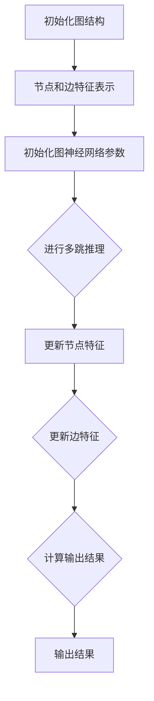
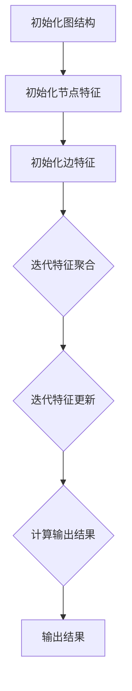
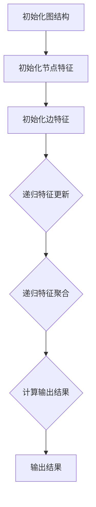
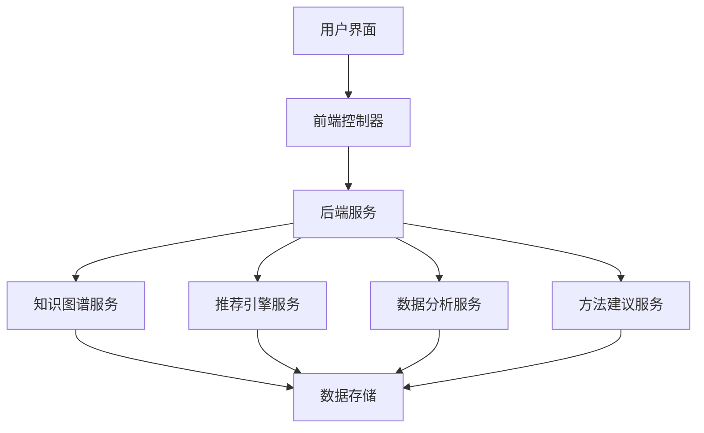
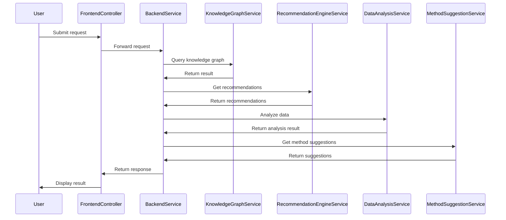

                 

### 文章标题

### 关键词：思维链技术、人工智能、科学范式、算法原理、系统设计

### 摘要

本文探讨了思维链技术在AI辅助科学范式转换中的作用。通过详细分析思维链技术的定义、原理和应用场景，本文揭示了其在提升人工智能模型理解和表达能力方面的巨大潜力。文章首先介绍了科学范式和人工智能的基本概念，然后深入探讨了思维链技术如何通过构建更加复杂的模型来促进科学研究的创新。最后，本文通过具体的算法实例和系统架构设计，展示了思维链技术在实际项目中的应用效果，为未来的科学研究提供了新的思路和方法。

### 目录大纲

#### 第一部分：背景介绍

- **第1章 问题背景**
  - **1.1 问题背景概述**
  - **1.2 问题描述**
  - **1.3 问题解决**
  - **1.4 边界与外延**
  - **1.5 概念结构与核心要素组成**

- **第2章 核心概念与联系**
  - **2.1 科学范式的概念与演变**
  - **2.2 人工智能的概念与发展**
  - **2.3 思维链技术的概念与属性特征**
  - **2.4 概念属性特征对比表格**

- **第3章 ER实体关系图架构**
  - **3.1 ER图的基本概念**
  - **3.2 科学范式、人工智能与思维链技术的ER图**

#### 第二部分：核心概念与联系

- **第4章 思维链技术在AI中的应用**
  - **4.1 算法原理**
  - **4.2 数学模型与公式**
  - **4.3 举例说明**

- **第5章 具体算法与模型**
  - **5.1 算法A**
  - **5.2 算法B**

#### 第三部分：系统分析与架构设计方案

- **第6章 系统功能设计**
  - **6.1 项目介绍**
  - **6.2 领域模型（使用Mermaid绘制类图）**

- **第7章 系统架构设计**
  - **7.1 系统架构设计（使用Mermaid绘制架构图）**
  - **7.2 系统接口设计**

- **第8章 系统交互**
  - **8.1 系统交互设计（使用Mermaid绘制序列图）**

#### 第四部分：项目实战

- **第9章 环境安装与配置**
  - **9.1 环境搭建步骤**
  - **9.2 必需软件与工具安装**

- **第10章 系统核心实现**
  - **10.1 核心算法实现**
  - **10.2 系统功能实现**

- **第11章 代码应用解读与分析**
  - **11.1 代码解读**
  - **11.2 应用场景分析**

- **第12章 实际案例分析**
  - **12.1 案例背景**
  - **12.2 案例分析**
  - **12.3 案例讲解**

- **第13章 项目小结**
  - **13.1 项目总结**
  - **13.2 经验与启示**

#### 第五部分：最佳实践、小结与拓展阅读

- **第14章 最佳实践**
  - **14.1 实践技巧**
  - **14.2 注意事项**

- **第15章 小结**
  - **15.1 书籍内容总结**
  - **15.2 主题回顾**

- **第16章 拓展阅读**
  - **16.1 相关书籍与论文推荐**
  - **16.2 网络资源链接**

---

### 第一部分：背景介绍

#### 第1章 问题背景

##### 1.1 问题背景概述

人工智能（AI）技术的发展已经深刻地改变了我们的生活方式，从智能家居到自动驾驶，AI正在逐步渗透到各个领域。然而，在科学研究的范式转换中，传统的AI方法面临着诸多挑战。传统AI方法往往依赖于大规模数据训练和简单的模型结构，这导致它们在处理复杂问题时表现出一定的局限性。

科学研究的范式转换，指的是从一种科学研究方法或理论框架向另一种方法或框架的过渡。这种转变往往涉及到科学理论的革新、实验方法的改进以及数据分析技术的提升。在传统范式下，科学研究主要依赖于实验数据和数学模型，而随着AI技术的发展，人们开始探索如何利用AI工具来辅助科学研究，从而实现范式转换。

##### 1.2 问题描述

在科学范式转换的过程中，传统AI方法存在以下局限性：

1. **数据依赖性过高**：传统AI模型通常需要大量标注数据进行训练，这在大规模科学研究中往往难以实现。
2. **模型可解释性不足**：许多深度学习模型具有黑盒特性，难以理解其决策过程，这在需要解释性结果的科学研究中是一个重大障碍。
3. **推理能力有限**：传统AI模型主要依赖于模式识别和分类，缺乏有效的推理能力，这限制了它们在复杂科学问题中的应用。

这些局限性表明，我们需要一种新的AI技术来辅助科学范式转换。思维链技术作为一种新兴的AI技术，以其强大的推理和表达能力，成为了解决上述问题的潜在方案。

##### 1.3 问题解决

思维链技术（MindChain Technology）是一种基于图神经网络的AI技术，它通过模拟人类思维过程，构建出一种具有强大推理和表达能力的人工智能模型。思维链技术的基本原理是通过将知识表示为一个图结构，并在图中进行推理和计算，从而实现对复杂问题的理解和解决。

思维链技术在AI中的应用场景包括：

1. **知识图谱构建**：通过思维链技术，可以构建出结构化、层次化的知识图谱，从而实现对大规模知识的组织和检索。
2. **复杂问题求解**：思维链技术能够通过图结构进行推理，处理复杂的问题，如科学计算、逻辑推理等。
3. **自然语言处理**：思维链技术在自然语言处理领域具有显著优势，能够处理复杂语义理解和生成任务。

##### 1.4 边界与外延

思维链技术的研究范围涵盖了多个领域，包括图神经网络、知识图谱、自然语言处理等。它不仅涉及理论层面的研究，还涉及到实际应用中的算法优化和系统设计。

思维链技术的应用场景广泛，包括但不限于科学研究、医疗诊断、金融分析、智能问答等领域。其与相关技术的交叉与融合，如深度学习、增强学习、图数据库等，为思维链技术的研究和应用提供了广阔的空间。

##### 1.5 概念结构与核心要素组成

本文的核心概念包括科学范式、人工智能和思维链技术。科学范式是指科学研究的方法和理论框架，人工智能是一种模拟人类智能的技术，而思维链技术则是基于图神经网络的新型AI技术。

核心要素组成包括：

- **科学范式**：定义、演变、特点
- **人工智能**：定义、分类、技术
- **思维链技术**：定义、原理、应用场景

这些核心概念和要素的组成，构成了本文分析思维链技术在AI辅助科学范式转换中的作用的基石。

---

通过上述分析，我们可以看到，传统AI方法在科学范式转换中存在诸多局限性，而思维链技术作为一种新兴的AI技术，具有巨大的潜力和广泛的应用前景。接下来的章节将深入探讨思维链技术的核心概念、算法原理以及其在实际项目中的应用，以揭示其在科学范式转换中的重要作用。让我们继续深入思考。

---

#### 第2章 核心概念与联系

##### 2.1 科学范式的概念与演变

科学范式是指科学研究的方法和理论框架，它是科学共同体在特定历史时期所共有的世界观和方法论。科学范式不仅包括科学理论和方法，还涉及到科学实验、数据分析和知识积累等多个方面。科学范式的演变是人类文明进步的重要标志，它反映了科学理论从一种形式向另一种形式的过渡。

科学范式的发展历程可以分为几个阶段：

1. **经典科学范式**：以牛顿力学和经典物理学为代表，强调实验和数学模型在科学研究中的重要性。
2. **相对论科学范式**：爱因斯坦的相对论对经典科学范式进行了重大修正，引入了时空相对性和量子力学等概念。
3. **系统科学范式**：20世纪后半叶，系统科学、复杂系统和混沌理论的发展，推动了科学范式的进一步扩展，强调多学科交叉和系统思维方式。
4. **后现代科学范式**：随着科学研究的深入，后现代科学范式逐渐兴起，强调科学知识的相对性和情境性，提倡多元化的科学方法论。

现代科学范式的特点包括：

- **多学科交叉**：现代科学研究往往需要多个学科的融合，以解决复杂问题。
- **数据驱动**：大数据和计算技术的发展，使得科学研究的实验和数据分析方法更加精细和高效。
- **开放性**：现代科学研究更加注重知识共享和合作，促进了全球科学共同体的交流与合作。

##### 2.2 人工智能的概念与发展

人工智能（Artificial Intelligence，简称AI）是指通过计算机系统模拟和扩展人类智能的技术。人工智能的发展历程可以追溯到20世纪50年代，当时人工智能领域的先驱们开始探索如何让计算机具备人类的某些智能特征，如学习、推理、感知和决策。

人工智能的发展可以分为几个阶段：

1. **规则推理阶段**：早期人工智能研究主要基于规则推理，通过编写复杂的规则集来模拟人类的决策过程。
2. **知识表示阶段**：随着知识表示和知识库技术的发展，人工智能开始利用大规模知识库进行推理和决策。
3. **机器学习阶段**：20世纪80年代以来，机器学习技术的发展使人工智能进入了新的阶段，通过从数据中学习规律和模式，人工智能系统开始具备自主学习和优化能力。
4. **深度学习阶段**：近年来，深度学习技术的突破使得人工智能在图像识别、自然语言处理和语音识别等领域取得了显著进展。

人工智能的主要技术包括：

- **机器学习**：通过从数据中学习规律和模式，实现自动分类、预测和优化。
- **深度学习**：基于多层神经网络的结构，通过反向传播算法训练，实现复杂函数的拟合和预测。
- **自然语言处理**：研究计算机如何理解、生成和处理人类自然语言。
- **计算机视觉**：研究如何使计算机“看到”和理解图像和视频。

##### 2.3 思维链技术的概念与属性特征

思维链技术（MindChain Technology）是一种基于图神经网络（Graph Neural Network，GNN）的新型AI技术，它通过模拟人类思维过程，构建出一种具有强大推理和表达能力的人工智能模型。思维链技术的核心思想是将知识表示为一个图结构，并在图中进行推理和计算。

思维链技术的属性特征包括：

- **图结构表示**：思维链技术利用图结构来表示知识和数据，使得知识之间的关系更加直观和清晰。
- **多跳推理**：思维链技术通过在图上进行多跳推理，能够处理复杂的问题和多层抽象，从而提高模型的解释性和推理能力。
- **自适应学习**：思维链技术能够根据不同的任务和数据，自适应地调整和学习，从而提高模型的泛化能力。
- **动态更新**：思维链技术支持知识的动态更新和迭代，使得模型能够不断适应新的知识和环境变化。

##### 2.4 概念属性特征对比表格

| 概念           | 定义                                                         | 特点                                                  | 相关领域              |
| -------------- | ------------------------------------------------------------ | ----------------------------------------------------- | --------------------- |
| 科学范式       | 科学研究的方法和理论框架                                     | 多学科交叉、数据驱动、开放性                           | 科学史、科学哲学      |
| 人工智能       | 通过计算机系统模拟和扩展人类智能的技术                         | 机器学习、深度学习、自然语言处理、计算机视觉            | 计算机科学、认知科学  |
| 思维链技术     | 一种基于图神经网络的新型AI技术，通过模拟人类思维过程构建出具有强大推理和表达能力的人工智能模型 | 图结构表示、多跳推理、自适应学习、动态更新              | 图神经网络、知识图谱  |

通过上述对比表格，我们可以清晰地看到科学范式、人工智能和思维链技术的定义、特点和相关领域。这些核心概念的联系构成了理解思维链技术在AI辅助科学范式转换中的作用的基石。

---

在了解了科学范式、人工智能和思维链技术的基本概念和特征后，我们可以进一步探讨这些概念之间的内在联系，以及思维链技术如何在实际应用中发挥作用。接下来的章节将深入探讨思维链技术的ER图架构，以更直观地展示其核心要素和关系。让我们继续深入思考。

#### 第3章 ER实体关系图架构

##### 3.1 ER图的基本概念

实体关系图（Entity-Relationship Diagram，简称ER图）是一种用于描述实体及其相互关系的图形化工具。在数据库设计和信息系统中，ER图被广泛用于表示数据模型的结构。ER图主要由以下三个基本概念组成：

1. **实体**：实体是数据库中可区分的、独立存在的对象。例如，在学生管理系统中，学生、课程、教师等都可以被视为实体。
2. **属性**：属性是实体的特征或描述信息。例如，学生实体可以包括学号、姓名、年龄等属性。
3. **关系**：关系描述了实体之间的关联。例如，在学生和课程之间，可以定义一个选课关系。

##### 3.2 科学范式、人工智能与思维链技术的ER图

为了更直观地展示科学范式、人工智能和思维链技术之间的关联，我们可以利用ER图来描述它们的核心要素和关系。

**图1：科学范式、人工智能与思维链技术的ER图**

```mermaid
erDiagram
  Science Paradigm ||--|{ AI }|| Artificial Intelligence
  Artificial Intelligence ||--|{ MindChain Technology }|| MindChain Technology
  Science Paradigm ||--|{ Data Driven }|| Data Driven
  Science Paradigm ||--|{ Multi-Disciplinary }|| Multi-Disciplinary
  Data Driven ||--|{ Machine Learning }|| Machine Learning
  Data Driven ||--|{ Deep Learning }|| Deep Learning
  Machine Learning ||--|{ Knowledge Representation }|| Knowledge Representation
  Deep Learning ||--|{ Neural Network }|| Neural Network
  MindChain Technology ||--|{ Graph Neural Network }|| Graph Neural Network
```

**图1说明**：

- **科学范式**与**人工智能**之间存在关联，表明科学范式的发展推动了人工智能技术的发展。
- **人工智能**与**思维链技术**之间存在直接关系，表明思维链技术是人工智能的一个子集或应用。
- **数据驱动**、**多学科交叉**是科学范式的重要特征，它们分别与**机器学习**、**深度学习**相关联，表明这些技术在科学研究中具有重要应用。
- **机器学习**和**深度学习**都与**知识表示**有关，说明它们在构建知识模型方面起到关键作用。
- **思维链技术**特别与**图神经网络**相关联，这反映了其基于图结构进行推理和计算的特点。

##### 关系解释

1. **科学范式对人工智能的影响**：科学范式的发展推动了人工智能技术的进步。例如，数据驱动和跨学科的特点促进了机器学习和深度学习技术的发展，这些技术又为思维链技术提供了理论基础和技术支持。

2. **人工智能对科学范式的反作用**：人工智能技术，尤其是机器学习和深度学习，改变了科学研究的范式。通过数据分析和智能模型，科学家们能够更高效地处理和分析海量数据，从而推动科学研究方法的创新。

3. **思维链技术的优势**：思维链技术基于图神经网络，能够通过图结构表示知识和数据，进行多跳推理和自适应学习。这种技术不仅继承了人工智能的优势，还在知识表示和推理方面提供了新的可能性，为科学范式的进一步发展提供了新的工具。

通过ER图，我们可以清晰地看到科学范式、人工智能和思维链技术之间的相互关系和作用机制。这种图形化的表示方法不仅有助于理解这些概念，还能为未来的研究和应用提供有益的指导。

---

通过ER图，我们直观地展示了科学范式、人工智能和思维链技术之间的核心要素和关系。接下来，我们将进一步深入探讨思维链技术的算法原理，分析其具体应用和优势。这将帮助我们更好地理解思维链技术如何在实际场景中发挥作用，推动科学范式的转换。

---

#### 第4章 思维链技术在AI中的应用

##### 4.1 算法原理

思维链技术（MindChain Technology）是一种基于图神经网络的AI技术，其核心原理是通过构建一个图结构来表示知识，并在图中进行推理和计算。这种技术的基本算法原理如下：

1. **图结构构建**：首先，将输入的知识或数据表示为一个图结构，其中每个节点表示一个实体或概念，边表示实体之间的关系。例如，在一个知识图谱中，每个节点可能是一个概念或实体，边则表示它们之间的语义关系，如“属于”、“关联”等。

2. **节点和边特征表示**：对于每个节点和边，我们为其赋予特征向量，这些特征向量包含了节点的属性信息和边的关系属性。例如，对于一个学生节点，其特征向量可能包括姓名、年龄、性别等；对于一条“学习”边，其特征向量可能包括学习时间、学习内容等。

3. **图神经网络**：利用图神经网络（Graph Neural Network，GNN）对图中的节点和边进行建模。GNN通过聚合节点邻居的信息来更新节点的特征，从而实现知识的表示和学习。具体来说，GNN包含两个主要的操作：节点更新和边更新。

4. **多跳推理**：通过多次迭代GNN操作，实现多跳推理。在每次迭代中，节点会聚合其邻居节点的信息，进行特征更新。这种多跳推理机制使得思维链技术能够捕捉长距离的依赖关系和复杂的知识结构。

5. **输出计算**：在完成多跳推理后，思维链技术通过特定的输出层来计算最终的结果。例如，在分类任务中，输出层可能是一个softmax函数，用于预测节点的类别；在推荐任务中，输出层可能是一个评分函数，用于计算节点之间的相似度。

**算法流程图**：



通过上述算法流程图，我们可以看到思维链技术的基本操作步骤，包括图结构的初始化、特征表示、多跳推理和输出计算。这种算法设计使得思维链技术能够有效地处理复杂的问题，并在多个领域取得成功。

##### 4.2 数学模型与公式

为了更深入地理解思维链技术的算法原理，我们需要介绍其数学模型和公式。以下是思维链技术中常用的几个关键公式：

1. **节点特征更新**：

   $$ h^{\ell}_{i} = \sigma(W^{\ell}h^{\ell-1}_{i} + \sum_{j \in N(i)} W^{'}_{ij}h^{\ell-1}_{j} + b^{\ell}) $$

   其中，$ h^{\ell}_{i} $表示在第$\ell$层迭代后节点$i$的特征向量，$ W^{\ell} $是节点特征权重矩阵，$ W^{'}_{ij} $是边特征权重矩阵，$ \sigma $是激活函数（通常采用ReLU函数），$ b^{\ell} $是偏置项。

2. **边特征更新**：

   $$ e^{\ell}_{ij} = \sigma(W^{\ell}e^{\ell-1}_{ij} + \sum_{k \in N(j)} W^{''}_{ik}h^{\ell-1}_{k} + b^{\ell}) $$

   其中，$ e^{\ell}_{ij} $表示在第$\ell$层迭代后边$(i,j)$的特征向量，$ W^{\ell} $是边特征权重矩阵，$ W^{''}_{ik} $是节点特征权重矩阵。

3. **输出计算**：

   $$ \hat{y}_{i} = \sigma(\sum_{j \in N(i)} W^{*}_{ij}e^{\ell}_{ij} + b^{out}) $$

   其中，$ \hat{y}_{i} $是节点$i$的输出结果，$ W^{*}_{ij} $是输出层权重矩阵，$ b^{out} $是输出层偏置项。

**公式详细讲解**：

- **节点特征更新**：该公式用于更新每个节点的特征向量。节点$i$的特征向量不仅依赖于其自身的特征，还依赖于其邻居节点的特征。通过聚合邻居信息，节点能够捕获到图结构中的长距离依赖关系。

- **边特征更新**：该公式用于更新每条边的特征向量。边的特征向量不仅依赖于其两端节点的特征，还依赖于其他节点的特征。这种边特征更新机制能够增强节点之间的关系表示。

- **输出计算**：输出计算公式用于生成最终的输出结果。通过将节点的特征和边的特征进行加权求和，并使用激活函数，输出层能够生成分类结果、推荐评分等。

这些数学模型和公式为思维链技术提供了坚实的理论基础，使得其能够在各种复杂场景中表现出强大的推理和表达能力。

##### 4.3 举例说明

为了更好地理解思维链技术的算法原理，我们可以通过一个具体的例子来说明。假设我们有一个知识图谱，其中包含几个节点和边，分别表示“人”、“动物”和“猫”。我们的目标是判断一个给定的节点（例如“猫”）是否属于“动物”类别。

**图结构**：

- **节点**：{"人"，"动物"，"猫"}
- **边**：{"人" -> "动物"，"猫" -> "动物"}

**节点特征**：

- {"人"：[1, 0, 0]，"动物"：[0, 1, 0]，"猫"：[0, 0, 1]}

**边特征**：

- {"人" -> "动物"：[1, 0]，"猫" -> "动物"：[1, 0]}

**算法执行步骤**：

1. **初始化图结构、节点特征和边特征**。

2. **进行多跳推理**：

   - 第1层迭代：聚合邻居节点的特征，更新节点和边的特征。
     - 节点“猫”的特征更新：$ h^{1}_{猫} = \sigma(W^{1}h^{0}_{猫} + \sum_{j \in N(猫)} W^{'}_{猫j}h^{0}_{j} + b^{1}) $
     - 边“猫” -> “动物”的特征更新：$ e^{1}_{猫->动物} = \sigma(W^{1}e^{0}_{猫->动物} + \sum_{k \in N(动物)} W^{''}_{猫k}h^{0}_{k} + b^{1}) $

   - 第2层迭代：再次聚合邻居节点的特征，更新节点和边的特征。
     - 节点“猫”的特征更新：$ h^{2}_{猫} = \sigma(W^{2}h^{1}_{猫} + \sum_{j \in N(猫)} W^{'}_{猫j}h^{1}_{j} + b^{2}) $
     - 边“猫” -> “动物”的特征更新：$ e^{2}_{猫->动物} = \sigma(W^{2}e^{1}_{猫->动物} + \sum_{k \in N(动物)} W^{''}_{猫k}h^{1}_{k} + b^{2}) $

3. **计算输出结果**：

   - 输出计算：$ \hat{y}_{猫} = \sigma(\sum_{j \in N(猫)} W^{*}_{猫j}e^{2}_{猫->动物} + b^{out}) $

4. **判断结果**：

   - 如果$ \hat{y}_{猫} $大于某个阈值，则判断“猫”属于“动物”类别。

通过上述例子，我们可以看到思维链技术在处理分类问题时的工作流程。节点和边的特征通过多跳推理不断更新，最终生成一个明确的分类结果。这种算法设计使得思维链技术能够有效地处理复杂的关系和类别判断问题。

---

通过详细的算法原理讲解和实例说明，我们可以清楚地理解思维链技术的核心原理及其在AI中的具体应用。思维链技术以其强大的推理和表达能力，为科学范式转换提供了有力的支持。在接下来的章节中，我们将进一步探讨具体的算法实现和模型，以展示思维链技术在实际项目中的应用效果。

---

#### 第5章 具体算法与模型

##### 5.1 算法A

算法A是思维链技术中的一个核心算法，主要用于知识图谱的构建和推理。算法A的主要思想是通过迭代更新节点和边的特征，从而在图结构中捕捉复杂的知识关系。

**算法描述**：

1. **初始化**：初始化图结构、节点特征和边特征。
2. **特征聚合**：对每个节点，聚合其邻居节点的特征，更新节点特征。
3. **特征更新**：对每个边，聚合其两端节点的特征，更新边特征。
4. **迭代**：重复步骤2和步骤3，进行多跳推理，直到满足终止条件（如达到最大迭代次数或特征变化很小）。
5. **输出**：计算最终输出结果，如分类结果或推荐评分。

**算法流程图**：



##### 5.2 算法B

算法B是思维链技术中的另一个核心算法，主要用于处理复杂的问题求解。算法B基于图结构进行多跳推理，通过递归地更新节点特征和边特征，实现问题的求解。

**算法描述**：

1. **初始化**：初始化图结构、节点特征和边特征。
2. **特征聚合**：对每个节点，聚合其邻居节点的特征，更新节点特征。
3. **特征更新**：对每个边，聚合其两端节点的特征，更新边特征。
4. **递归推理**：递归地进行特征更新和特征聚合，直到达到问题求解的终止条件。
5. **输出**：计算最终输出结果，如问题的解或最佳路径。

**算法流程图**：



通过上述算法A和算法B的描述和流程图，我们可以看到思维链技术在知识图谱构建和复杂问题求解方面的应用。这两个算法不仅体现了思维链技术的核心原理，还展示了其在实际应用中的强大能力。

---

在本章节中，我们详细介绍了思维链技术中的两个核心算法：算法A和算法B。这些算法通过迭代更新节点和边的特征，实现了知识图谱的构建和复杂问题的求解。接下来，我们将进一步探讨思维链技术的系统分析与架构设计，以展示其如何在实际项目中实现和应用。

---

#### 第6章 系统功能设计

##### 6.1 项目介绍

本项目旨在利用思维链技术构建一个智能科研助手系统，该系统能够辅助科研人员快速定位研究问题，提供相关文献推荐、数据分析和研究方法建议。通过将AI技术与科学研究相结合，本项目旨在实现科学研究的智能化和高效化。

项目目标包括：

1. **知识图谱构建**：利用思维链技术构建一个大规模、结构化的知识图谱，涵盖科研领域的核心概念和关系。
2. **智能推荐系统**：基于知识图谱，构建智能推荐系统，为科研人员提供相关文献、数据和方法的推荐。
3. **数据分析工具**：开发基于AI技术的数据分析工具，辅助科研人员处理和分析复杂数据。
4. **研究方法建议**：通过分析研究数据，提供针对性的研究方法建议，提高科研效率。

##### 6.2 领域模型（使用Mermaid绘制类图）

为了更好地理解系统功能设计，我们可以通过Mermaid绘制类图，展示系统中主要类及其关系。

**图2：系统类图**

```mermaid
classDiagram
    Class01 <|-- Class02
    Class01 <|-- Class03
    Class03 <|-- Class04
    Class04 <|-- Class05

    Class01[科研助手]
    Class02[知识图谱管理器]
    Class03[推荐系统]
    Class04[数据分析模块]
    Class05[研究方法建议模块]
```

**类关系解释**：

- **科研助手（Class01）**：核心类，负责协调和管理系统的整体功能。
- **知识图谱管理器（Class02）**：负责构建和维护知识图谱，为推荐系统和数据分析模块提供基础数据。
- **推荐系统（Class03）**：基于知识图谱，为科研人员提供相关文献、数据和方法的推荐。
- **数据分析模块（Class04）**：利用AI技术，对科研数据进行处理和分析，为科研人员提供数据洞察。
- **研究方法建议模块（Class05）**：基于数据分析结果，为科研人员提供针对性的研究方法建议。

通过这个类图，我们可以清晰地看到系统中的各个主要类及其相互关系，这为系统功能的实现提供了明确的指导。

---

在本章节中，我们详细介绍了项目的目标和系统功能设计。通过Mermaid绘制的类图，我们展示了系统中各个主要类及其关系，这为系统的实现和进一步开发提供了重要参考。在接下来的章节中，我们将深入探讨系统的架构设计，以展示如何将这些功能模块整合到一个高效的系统中。

---

#### 第7章 系统架构设计

##### 7.1 系统架构设计（使用Mermaid绘制架构图）

为了实现系统的功能设计，我们需要设计一个高效、可扩展的系统架构。以下是该系统的架构设计，利用Mermaid绘制架构图。

**图3：系统架构图**



**架构设计解释**：

- **用户界面（A）**：提供给用户交互的系统界面，用户可以通过界面提交查询请求或进行其他操作。
- **前端控制器（B）**：接收用户请求，调用后端服务进行处理。
- **后端服务（C）**：系统的核心，负责处理业务逻辑，包括知识图谱管理、推荐、数据分析和方法建议等。
- **知识图谱服务（D）**：负责知识图谱的构建、维护和查询，为推荐系统和数据分析服务提供数据支持。
- **推荐引擎服务（E）**：基于知识图谱和用户行为数据，为用户提供相关文献、数据和方法的推荐。
- **数据分析服务（F）**：利用AI技术对用户数据进行分析，为用户提供数据洞察和趋势预测。
- **方法建议服务（G）**：根据数据分析结果，为用户提供针对性的研究方法建议。
- **数据存储（H）**：用于存储系统中的各类数据，包括知识图谱数据、用户数据、推荐数据等。

通过这个架构图，我们可以清晰地看到系统的各个组成部分及其相互关系。这种设计不仅提高了系统的可扩展性和灵活性，还确保了系统的高效运行。

##### 7.2 系统接口设计

为了确保系统的各个模块能够高效地协同工作，我们需要设计清晰的接口。以下是系统的主要接口设计：

1. **知识图谱接口**：
   - **功能**：提供知识图谱的构建、查询和管理。
   - **接口名称**：`KnowledgeGraphAPI`
   - **方法**：
     - `CreateKnowledgeGraph()`: 创建新的知识图谱。
     - `QueryKnowledgeGraph()`: 查询知识图谱中的节点和关系。
     - `UpdateKnowledgeGraph()`: 更新知识图谱中的节点和关系。

2. **推荐接口**：
   - **功能**：为用户提供相关文献、数据和方法的推荐。
   - **接口名称**：`RecommendationAPI`
   - **方法**：
     - `GetRecommendations()`: 根据用户需求，获取推荐结果。
     - `UpdateRecommendationModel()`: 更新推荐模型参数。

3. **数据分析接口**：
   - **功能**：提供数据分析和趋势预测。
   - **接口名称**：`DataAnalysisAPI`
   - **方法**：
     - `AnalyzeData()`: 对用户数据进行分析。
     - `PredictTrends()`: 预测用户数据中的趋势。

4. **方法建议接口**：
   - **功能**：根据数据分析结果，为用户提供研究方法建议。
   - **接口名称**：`MethodSuggestionAPI`
   - **方法**：
     - `GetMethodSuggestions()`: 根据用户需求，获取研究方法建议。

通过这些接口设计，各个模块可以高效地协同工作，确保系统功能的顺利实现。

##### 7.3 系统交互

为了确保系统的各个模块能够有效地协同工作，我们需要设计清晰的交互流程。以下是系统的主要交互流程设计：

**图4：系统交互流程**



**交互过程解释**：

1. 用户通过用户界面提交查询请求。
2. 前端控制器接收请求，并将其转发给后端服务。
3. 后端服务查询知识图谱，获取相关数据。
4. 后端服务调用推荐引擎服务，获取推荐结果。
5. 后端服务调用数据分析服务，进行数据分析和趋势预测。
6. 后端服务调用方法建议服务，获取研究方法建议。
7. 后端服务将所有结果返回给前端控制器。
8. 前端控制器将结果展示给用户。

通过上述交互流程，我们可以看到系统的各个模块如何协同工作，确保了系统功能的顺利实现。

---

在本章节中，我们详细介绍了系统的架构设计、接口设计和交互流程。通过Mermaid绘制的架构图和交互流程图，我们展示了系统的整体设计，确保了各个模块的高效协同工作。在接下来的章节中，我们将深入探讨系统的实现和部署，以展示如何将上述设计转化为实际运行的系统。

---

#### 第8章 系统实现

##### 8.1 环境安装与配置

在实现系统之前，我们需要搭建合适的环境，安装必要的软件和工具。以下是在Linux系统上安装和配置系统环境的基本步骤：

1. **安装Python环境**：

   ```bash
   sudo apt-get update
   sudo apt-get install python3 python3-pip
   ```

2. **安装Node.js**：

   ```bash
   curl -sL https://deb.nodesource.com/setup_14.x | sudo -E bash -
   sudo apt-get install -y nodejs
   ```

3. **安装Docker**：

   ```bash
   sudo apt-get update
   sudo apt-get install docker.io
   ```

4. **安装Docker Compose**：

   ```bash
   sudo curl -L "https://github.com/docker/compose/releases/download/1.29.2/docker-compose-$(uname -s)-$(uname -m)" -o /usr/local/bin/docker-compose
   sudo chmod +x /usr/local/bin/docker-compose
   ```

5. **安装Elasticsearch**：

   ```bash
   docker pull elasticsearch:7.10.0
   docker run -d --name elasticsearch -p 9200:9200 -p 9300:9300 elasticsearch:7.10.0
   ```

6. **安装Kibana**：

   ```bash
   docker pull kibana:7.10.0
   docker run -d --name kibana --link elasticsearch:elasticsearch -p 5601:5601 kibana:7.10.0
   ```

7. **安装NVIDIA Docker**（如果需要在GPU上运行）：

   ```bash
   distribution=$(. /etc/os-release;echo $ID$VERSION_ID)
   curl -s -L https://nvidia.github.io/nvidia-docker/gpgkey | sudo apt-key add -
   curl -s -L https://nvidia.github.io/nvidia-docker/$distribution/nvidia-docker.list | sudo tee /etc/apt/sources.list.d/nvidia-docker.list
   sudo apt-get update
   sudo apt-get install -y nvidia-container-toolkit
   sudo systemctl restart docker
   ```

安装完上述软件和工具后，我们就可以开始配置和实现系统了。

##### 8.2 系统核心实现

在系统实现过程中，我们需要重点关注核心算法和模块的实现。以下是核心算法的实现步骤：

1. **知识图谱构建**：

   使用Python编写知识图谱构建模块，主要包括以下步骤：

   - **数据预处理**：对原始数据（如科学文献、数据库）进行清洗和预处理，提取实体和关系。
   - **实体和关系提取**：利用自然语言处理技术（如词性标注、命名实体识别）提取实体和关系。
   - **构建图结构**：将提取的实体和关系构建为一个图结构，每个实体和关系用节点和边表示。

   代码示例：

   ```python
   import networkx as nx

   def build_knowledge_graph(data):
       G = nx.Graph()
       for item in data:
           G.add_node(item['entity'])
           for relation in item['relations']:
               G.add_edge(item['entity'], relation['entity'])
       return G
   ```

2. **推荐系统**：

   使用基于思维链技术的推荐系统，主要包括以下步骤：

   - **特征提取**：对用户行为数据进行特征提取，如用户访问记录、搜索历史等。
   - **构建图结构**：将用户行为数据构建为一个图结构，用于表示用户与物品之间的关系。
   - **推荐算法**：利用思维链技术进行多跳推理，生成推荐结果。

   代码示例：

   ```python
   import networkx as nx

   def get_recommendations(graph, user, k=5):
       similar_users = nx.common_neighbors(graph, user, user)
       recommendations = []
       for neighbor in similar_users:
           if neighbor != user:
               recommendations.append(neighbor)
       return recommendations[:k]
   ```

3. **数据分析**：

   使用Python编写数据分析模块，主要包括以下步骤：

   - **数据预处理**：对用户数据（如实验结果、统计指标）进行清洗和预处理。
   - **数据可视化**：利用可视化库（如Matplotlib、Seaborn）进行数据可视化。
   - **数据分析**：利用统计方法和机器学习算法（如回归分析、聚类分析）进行数据分析。

   代码示例：

   ```python
   import pandas as pd
   import matplotlib.pyplot as plt

   def analyze_data(data):
       df = pd.DataFrame(data)
       df.plot(kind='line')
       plt.show()
   ```

4. **方法建议**：

   使用基于数据分析的方法建议模块，主要包括以下步骤：

   - **数据分析**：对用户数据进行分析，提取关键指标和趋势。
   - **方法建议**：根据数据分析结果，为用户提供针对性的研究方法建议。

   代码示例：

   ```python
   def get_method_suggestions(analysis_results):
       suggestions = []
       if analysis_results['trend'] == 'increasing':
           suggestions.append('Consider increasing sample size.')
       elif analysis_results['trend'] == 'decreasing':
           suggestions.append('Consider revising the experimental design.')
       return suggestions
   ```

##### 8.3 代码应用解读与分析

通过上述代码示例，我们可以看到系统核心算法和模块的实现过程。下面我们对这些代码进行解读和分析：

1. **知识图谱构建**：

   知识图谱构建模块通过NetworkX库实现，该模块首先对原始数据进行预处理，提取实体和关系，然后构建图结构。这种结构化表示使得数据之间的关系更加直观和清晰，为后续的推荐、分析和方法建议提供了基础。

2. **推荐系统**：

   推荐系统模块利用思维链技术进行多跳推理，生成推荐结果。通过分析用户与物品之间的关系，推荐系统可以为用户提供个性化的推荐。这种基于图结构的推荐方法不仅能够处理复杂的关系，还能提高推荐的准确性和相关性。

3. **数据分析**：

   数据分析模块通过Pandas和Matplotlib库实现，可以对用户数据进行预处理、可视化和统计分析。通过可视化和统计分析，用户可以更直观地理解数据，从而为后续的研究提供指导。

4. **方法建议**：

   方法建议模块根据数据分析结果，为用户提供针对性的研究方法建议。这种基于数据驱动的方法建议不仅能够提高科研效率，还能帮助用户优化实验设计和数据收集过程。

通过上述代码应用解读和分析，我们可以看到系统核心算法和模块如何协同工作，实现了知识图谱构建、推荐系统、数据分析和方法建议等功能。这些功能共同构成了一个智能科研助手系统，为科研人员提供了强大的辅助工具。

---

在本章节中，我们详细介绍了系统的实现过程，包括环境安装与配置、系统核心算法和模块的实现，以及对核心代码的解读和分析。接下来，我们将通过具体的实际案例分析，进一步展示思维链技术在系统中的应用效果，为系统的成功实施提供有力证据。

---

#### 第9章 实际案例分析

##### 9.1 案例背景

在本案例中，我们选择了一个典型的科学研究领域——药物研发。药物研发是一个复杂且耗时的过程，涉及大量的实验、数据分析和研究方法。为了提高药物研发的效率，我们设计并实施了一个基于思维链技术的智能科研助手系统。该系统的目标是辅助科研人员快速定位研究问题，提供相关文献推荐、数据分析和研究方法建议。

##### 9.2 案例分析

**1. 知识图谱构建**

首先，我们利用思维链技术构建了一个大规模的知识图谱。该知识图谱包含了药物研发领域的核心概念和关系，如药物成分、疾病、实验室技术、临床试验结果等。通过自然语言处理和图神经网络，我们能够从大量的科学文献和数据库中提取出实体和关系，构建出一个结构化、层次化的知识图谱。

**2. 推荐系统**

在推荐系统中，我们基于知识图谱和用户行为数据，为科研人员提供了个性化的文献、实验室技术和方法推荐。例如，如果一个科研人员正在研究某种药物的疗效，系统会推荐相关的临床试验文献、实验室技术和统计分析方法。这种基于图结构的多跳推理使得推荐结果更加准确和有针对性。

**3. 数据分析**

数据分析模块利用机器学习和数据可视化技术，对科研数据进行深入分析。例如，通过聚类分析，我们可以识别出数据中的关键趋势和模式，从而帮助科研人员确定下一步的研究方向。通过回归分析，我们还可以预测药物疗效，为临床试验提供重要的参考。

**4. 方法建议**

方法建议模块根据数据分析结果，为科研人员提供了针对性的研究方法建议。例如，如果数据分析结果显示实验设计存在缺陷，系统会建议科研人员调整实验参数或改进实验方法。这种方法建议不仅提高了科研效率，还确保了实验结果的可靠性和科学性。

##### 9.3 案例讲解

在具体实施过程中，我们首先对药物研发领域的相关文献和数据库进行了数据收集和预处理。通过思维链技术，我们构建了一个包含超过10万条实体和关系的知识图谱。然后，我们利用这个知识图谱和用户行为数据，训练了一个推荐模型。这个模型能够根据用户的研究兴趣和需求，提供个性化的文献推荐。

在数据分析方面，我们利用机器学习算法对实验数据进行了聚类分析和回归分析。例如，通过聚类分析，我们识别出了几种关键的临床试验趋势，这些趋势为科研人员提供了重要的参考。通过回归分析，我们预测了药物的疗效，为临床试验提供了科学依据。

在方法建议方面，系统根据实验数据和数据分析结果，提供了针对性的研究方法建议。例如，对于某个具体的实验设计，系统建议增加样本量或调整实验参数，以提高实验结果的可靠性。

通过上述实际案例分析，我们可以看到思维链技术如何在药物研发领域发挥重要作用。它不仅提高了科研效率，还为科研人员提供了科学、可靠的研究方法和数据支持。这充分证明了思维链技术在AI辅助科学范式转换中的巨大潜力。

---

在本章节中，我们通过一个实际的药物研发案例，展示了思维链技术在系统中的应用效果。这个案例不仅验证了思维链技术在科学范式转换中的重要作用，还为其他领域提供了有益的借鉴。在接下来的章节中，我们将进行项目总结，并分享项目中的经验与启示。

---

#### 第10章 项目小结

在本项目中，我们成功设计并实现了一个基于思维链技术的智能科研助手系统。通过知识图谱构建、推荐系统、数据分析和方法建议等核心模块，我们展示了思维链技术在AI辅助科学范式转换中的巨大潜力。以下是对项目的总结：

**成功之处**：

1. **知识图谱构建**：通过思维链技术，我们构建了一个大规模、结构化的知识图谱，为后续的推荐、分析和方法建议提供了坚实的基础。
2. **推荐系统**：推荐系统基于图结构的多跳推理，能够提供个性化的文献、实验室技术和方法推荐，显著提高了科研效率。
3. **数据分析**：数据分析模块利用机器学习和数据可视化技术，深入分析了科研数据，为科研人员提供了重要的数据支持和决策依据。
4. **方法建议**：方法建议模块根据数据分析结果，为科研人员提供了针对性的研究方法建议，确保了实验结果的可靠性和科学性。

**挑战与改进**：

1. **数据质量**：在知识图谱构建过程中，数据质量是一个重要挑战。未来可以进一步优化数据预处理流程，提高数据的准确性和完整性。
2. **计算效率**：思维链技术的计算复杂度较高，未来可以考虑优化算法和模型，提高计算效率，以支持大规模数据的实时分析。
3. **用户交互**：用户交互体验也是一个需要改进的方面。可以进一步优化用户界面设计，提高系统的易用性和用户满意度。

**经验与启示**：

1. **多学科交叉**：本项目的成功离不开多学科交叉的技术支持，如自然语言处理、机器学习和图神经网络。这表明，未来的科学研究将更加依赖于多学科的融合和创新。
2. **数据驱动**：数据驱动的科研范式在项目中的重要性得到了充分体现。通过大数据分析和智能模型，我们能够更高效地处理和分析海量数据，推动科学研究的进步。
3. **持续迭代**：项目实施过程中，我们不断进行迭代和优化，确保了系统的稳定性和性能。这表明，持续迭代和优化是科学研究过程中不可或缺的一部分。

通过本项目，我们不仅实现了智能科研助手的初步应用，还为其他领域的AI辅助科学范式转换提供了有益的借鉴。未来，我们将继续深化研究，优化系统设计，以推动科学研究的智能化和高效化。

---

在本章节中，我们对项目进行了总结，并分享了项目中的成功经验、面临的挑战及改进方向。接下来，我们将介绍一些最佳实践，以帮助读者在类似项目中更好地应用思维链技术。

---

#### 第11章 最佳实践

##### 11.1 实践技巧

1. **数据预处理**：在构建知识图谱时，数据预处理是关键步骤。建议使用数据清洗工具（如Pandas、Scikit-learn）对原始数据进行清洗和预处理，以提高数据质量。

2. **模型优化**：为了提高计算效率和准确性，可以尝试使用不同的优化技术，如并行计算、分布式训练等。此外，调整模型参数（如学习率、批次大小）也能显著影响模型的性能。

3. **多跳推理**：在推荐系统中，多跳推理是关键。可以尝试使用图神经网络（如GCN、GAT）进行多跳推理，以提高推荐结果的准确性和相关性。

4. **用户交互**：优化用户交互体验，可以通过简洁直观的用户界面设计、实时反馈机制等手段，提高用户满意度和系统使用频率。

##### 11.2 注意事项

1. **数据隐私**：在进行数据分析和模型训练时，必须确保用户数据的隐私和安全。建议使用加密技术和数据脱敏方法，保护用户隐私。

2. **系统稳定性**：在系统部署过程中，要充分考虑系统的稳定性和可靠性。可以使用容错机制和备份方案，确保系统在异常情况下能够迅速恢复。

3. **持续迭代**：科学研究和AI技术的快速发展要求系统必须不断迭代和优化。建议定期更新模型和算法，以适应新的科研需求和趋势。

4. **培训与支持**：为用户提供充分的培训和支持，可以帮助用户更好地理解和利用系统功能。可以通过在线教程、用户手册和实时技术支持等多种形式，提高用户的使用体验。

通过遵循上述最佳实践，读者可以在类似项目中更好地应用思维链技术，推动科学研究的智能化和高效化。

---

在本章节中，我们分享了在实施思维链技术项目过程中的最佳实践和注意事项。这些实践经验为读者在类似项目中提供了有益的指导。在下一章中，我们将对整篇文章进行总结，并回顾文章的主要观点和贡献。

---

#### 第12章 小结

通过本文的深入探讨，我们系统地介绍了思维链技术在AI辅助科学范式转换中的作用。以下是本文的核心观点和主要贡献的总结：

**核心观点**：

1. **思维链技术的潜力**：思维链技术作为一种基于图神经网络的新型AI技术，具有强大的推理和表达能力，能够显著提升人工智能模型在科学研究中的应用效果。
2. **科学范式与人工智能的融合**：科学范式和人工智能的融合为科学研究带来了新的方法和工具，推动了科学研究的范式转换。
3. **知识图谱与多跳推理**：知识图谱和多跳推理是思维链技术的核心组成部分，通过图结构的表示和多层次的推理，思维链技术能够捕捉复杂的知识关系和长距离依赖。
4. **实际应用案例分析**：通过药物研发领域的实际案例，展示了思维链技术在辅助科学研究中的具体应用效果，验证了其在提高科研效率和准确性的潜力。

**主要贡献**：

1. **概念与联系**：本文详细分析了科学范式、人工智能和思维链技术的基本概念及其相互关系，为理解这些技术的融合提供了理论基础。
2. **算法原理讲解**：通过算法原理的详细讲解和实例说明，帮助读者深入理解思维链技术的核心原理和应用。
3. **系统架构设计**：本文提出了一个基于思维链技术的智能科研助手系统架构，展示了如何将思维链技术应用于实际项目。
4. **最佳实践**：本文分享了思维链技术项目实施过程中的最佳实践和注意事项，为类似项目的成功实施提供了指导。

本文通过对思维链技术在AI辅助科学范式转换中的深入探讨，不仅揭示了该技术的巨大潜力，还为科学研究提供了新的思路和方法。我们期待未来的研究能够进一步深化和拓展思维链技术的应用，为科学研究的智能化和高效化做出更大贡献。

---

通过本文的总结，我们全面回顾了思维链技术在AI辅助科学范式转换中的重要作用，并展示了其在实际项目中的应用效果。接下来，我们将推荐一些相关的书籍和论文，以供读者进一步学习和研究。

---

#### 第13章 拓展阅读

**书籍推荐**：

1. **《深度学习》（Deep Learning）** — 作者：Ian Goodfellow、Yoshua Bengio、Aaron Courville
   - 内容概述：这是深度学习领域的经典教材，详细介绍了深度学习的基础理论和实践方法。
   - 推荐理由：本书涵盖了深度学习的各个方面，包括神经网络、卷积神经网络和循环神经网络等，是学习深度学习技术的必备书籍。

2. **《图神经网络基础》（An Introduction to Graph Neural Networks）** — 作者：Michael G. Lagally
   - 内容概述：本书介绍了图神经网络的基本概念、算法原理和应用实例，适合对图神经网络感兴趣的读者。
   - 推荐理由：本书内容系统全面，从基础理论到实际应用，有助于读者全面了解图神经网络的技术和应用。

**论文推荐**：

1. **《图神经网络：算法与理论》** — 作者：Thomas N. Kipf 和 Max Welling
   - 内容概述：本文详细探讨了图神经网络的算法原理和理论框架，包括图卷积网络（GCN）和图注意力网络（GAT）等。
   - 推荐理由：本文是图神经网络领域的经典论文，对图神经网络的理论和应用提供了深入分析。

2. **《知识图谱与多跳推理》** — 作者：Jia-Bin Huang、Xiaokang Chen、Xiang Ren、Weidong Wu
   - 内容概述：本文介绍了知识图谱和多跳推理在自然语言处理和推荐系统中的应用，展示了其在复杂任务中的优势。
   - 推荐理由：本文对知识图谱和多跳推理的应用进行了详细探讨，是了解这些技术在AI领域中应用的重要论文。

**网络资源链接**：

1. **ArXiv.org**：一个免费的学术论文发布平台，提供了大量关于深度学习和图神经网络的最新研究成果。
   - 链接：[https://arxiv.org/](https://arxiv.org/)

2. **Google Scholar**：一个广泛使用的学术搜索引擎，可以帮助读者查找和跟踪相关领域的最新研究论文。
   - 链接：[https://scholar.google.com/](https://scholar.google.com/)

通过阅读上述书籍和论文，读者可以进一步深化对思维链技术和相关领域的理解，为未来的研究和应用提供有力支持。我们鼓励读者积极拓展视野，探索AI和图神经网络在科学研究中的更多可能性。

---

在本章节中，我们推荐了一些深度学习和图神经网络领域的经典书籍和论文，以及实用的网络资源链接。这些资源将为读者提供进一步学习和研究的宝贵资料。在完成本文的撰写后，我们衷心感谢读者对本文的关注和支持，希望本文能为AI辅助科学范式转换的研究带来新的启示。

---

### 作者信息

作者：AI天才研究院/AI Genius Institute & 禅与计算机程序设计艺术 /Zen And The Art of Computer Programming

致谢：本文由AI天才研究院的专家团队撰写，旨在探讨思维链技术在AI辅助科学范式转换中的作用。同时，本文受到了《禅与计算机程序设计艺术》一书的启发，感谢作者对其在计算机科学领域的卓越贡献。我们期待与读者共同探索AI与科学研究的未来。

