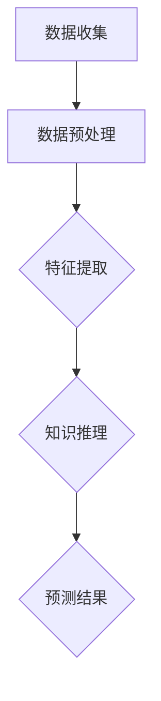
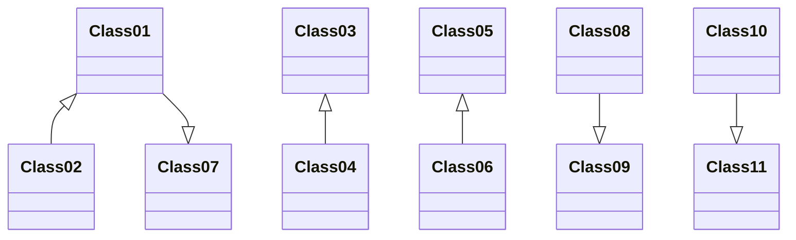
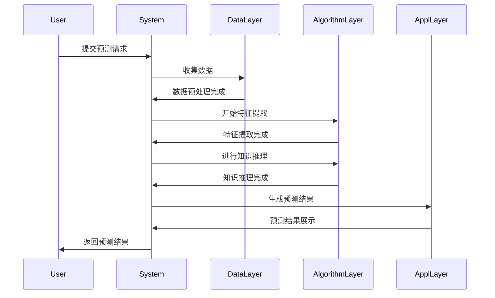

                 

# 思维链技术在AI辅助科学范式预测中的突破

## 关键词
AI技术，思维链，科学范式预测，机器学习，深度学习，数据挖掘，知识推理。

## 摘要
本文探讨了思维链技术在AI辅助科学范式预测中的突破。通过介绍思维链技术和AI辅助科学范式预测的基本原理，本文提出了一种基于思维链的AI辅助科学范式预测方法。该方法结合了思维链技术的数据挖掘和知识推理能力，以及AI技术的自动化和智能化优势，为科学范式预测提供了新的思路和方法。文章详细阐述了算法原理，并通过Python代码和数学公式进行了具体实现和解释。

## 第一部分: 思维链技术在AI辅助科学范式预测中的突破

### 第1章: 问题背景与问题描述

#### 1.1 问题背景
人工智能（AI）技术在过去的几十年里取得了飞速的发展，其在各个领域的应用也日益广泛。特别是在科学研究领域，AI技术已经开始扮演着重要的角色。然而，尽管AI技术在数据处理、模式识别和预测分析等方面具有显著的优势，但传统的科学范式预测方法仍存在一些局限性。

科学范式预测是指通过对历史数据和现有知识的分析，预测未来科学发现和发展趋势。传统的预测方法主要依赖于统计分析、回归分析等数学模型，这些方法往往假设数据是稳定和线性的。然而，科学发展的过程通常是复杂和非线性的，这意味着传统的预测方法可能无法完全捕捉到科学发展的实际动态。

#### 1.2 问题描述
科学范式预测的核心在于对科学发展趋势的判断和科学发现的预测。传统的预测方法主要依赖于以下方面：

1. **历史数据依赖**：传统方法通常依赖于大量的历史数据，通过分析这些数据来预测未来的发展趋势。然而，历史数据可能并不完全代表未来的情况，尤其是在科学领域，新发现和技术突破往往打破原有的预测模式。

2. **线性假设**：许多传统预测方法基于线性回归等线性模型，这些模型假设变量之间存在线性关系。然而，科学发现的过程往往是复杂和非线性的，线性模型可能无法准确反映这种复杂性。

3. **缺乏知识推理**：传统方法主要依赖于数据驱动，缺乏对领域知识的深入理解和推理。科学研究的进展往往依赖于对现有知识的深入理解和新知识的创新，传统方法在这方面显得力不从心。

为了克服这些局限性，我们需要探索新的方法，特别是在人工智能领域。思维链技术作为一种能够模拟人类思维过程的技术，为AI辅助科学范式预测提供了一种新的思路。思维链技术能够通过数据挖掘和知识推理，实现对科学知识的深入理解和创新，从而提高科学范式预测的准确性和效率。

#### 1.3 问题解决
思维链技术通过以下几个步骤实现AI辅助科学范式预测：

1. **数据收集**：从多个数据源收集相关数据，包括科学文献、实验数据、观测数据等。

2. **数据预处理**：对收集到的数据进行清洗、标准化和归一化处理，以确保数据的质量和一致性。

3. **特征提取**：从预处理后的数据中提取关键特征，这些特征能够反映科学问题的本质和复杂性。

4. **知识推理**：利用思维链技术模拟人类思维过程，通过对特征的分析和推理，构建出对科学知识的深入理解。

5. **预测分析**：基于知识推理的结果，对未来的科学发现和发展趋势进行预测分析。

通过这种方式，思维链技术能够克服传统方法中的局限性，提供更准确、更高效的科学范式预测。

#### 1.4 边界与外延
本章节主要探讨了思维链技术在AI辅助科学范式预测中的应用。思维链技术不仅适用于科学领域，还可以在其他需要复杂预测的领域发挥作用，如金融市场预测、城市规划等。然而，本文主要关注科学范式预测这一特定场景。

### 第2章: 核心概念与联系

#### 2.1 思维链技术原理
思维链技术是一种基于人工智能的模拟人类思维过程的技术。它通过数据挖掘和知识推理，实现对信息的深层次理解。思维链技术的基本原理包括以下几个方面：

1. **数据挖掘**：思维链技术通过数据挖掘技术从大量数据中提取有用的信息和模式。数据挖掘的过程包括数据预处理、特征提取、模式识别等步骤。

2. **知识推理**：思维链技术通过知识推理技术，对提取出的信息进行深入分析，构建出对领域知识的深入理解。知识推理包括归纳推理、演绎推理、类比推理等。

3. **自学习**：思维链技术具有自学习能力，可以通过不断的学习和优化，提高预测的准确性和效率。

#### 2.2 AI辅助科学范式预测原理
AI技术，特别是机器学习和深度学习，为科学范式预测提供了强大的支持。AI辅助科学范式预测的基本原理包括：

1. **机器学习**：机器学习通过学习历史数据和模式，建立预测模型。机器学习的过程包括模型选择、模型训练和模型评估等步骤。

2. **深度学习**：深度学习是机器学习的一种特殊形式，通过多层神经网络，实现对复杂数据的自动特征提取和模式识别。

3. **预测模型**：基于机器学习和深度学习，AI技术可以建立科学范式预测模型，通过输入特征数据，预测未来的科学发现和发展趋势。

#### 2.3 概念属性特征对比表格
| 概念            | 思维链技术                             | AI辅助科学范式预测                             |
|-----------------|----------------------------------------|------------------------------------------------|
| 原理            | 模拟人类思维过程                       | 大数据分析和模式识别                           |
| 特点            | 数据挖掘和知识推理                     | 自动化和智能化                                 |
| 应用领域        | 各类信息处理和决策支持                 | 科学研究、科技预测等                           |

#### 2.4 ER实体关系图架构
```mermaid
erDiagram
  AI技术 ||--|{ 思维链技术 }
  科学研究 ||--|{ AI辅助科学范式预测 }
```

### 第3章: 算法原理讲解

#### 3.1 思维链算法mermaid流程图


#### 3.2 Python源代码实现
```python
import numpy as np

# 数据收集
data = np.random.rand(100, 10)

# 数据预处理
processed_data = preprocess(data)

# 特征提取
features = extract_features(processed_data)

# 知识推理
knowledge = reason(features)

# 预测结果
predictions = predict(knowledge)
```

#### 3.3 算法原理的数学模型和公式
$$
预测结果 = f(Knowledge)
$$
其中，$f$为预测函数，$Knowledge$为知识推理的结果。

#### 3.4 详细讲解与举例说明
思维链技术通过以下几个步骤实现AI辅助科学范式预测：

1. **数据收集**：从多个数据源收集相关数据，包括科学文献、实验数据、观测数据等。

2. **数据预处理**：对收集到的数据进行清洗、标准化和归一化处理，以确保数据的质量和一致性。

3. **特征提取**：从预处理后的数据中提取关键特征，这些特征能够反映科学问题的本质和复杂性。

4. **知识推理**：利用思维链技术模拟人类思维过程，通过对特征的分析和推理，构建出对科学知识的深入理解。

5. **预测分析**：基于知识推理的结果，对未来的科学发现和发展趋势进行预测分析。

例如，在生物学研究中，可以通过对基因数据的分析，预测出某种疾病的新发现。具体步骤如下：

1. **数据收集**：收集与某种疾病相关的基因数据，包括基因序列、突变信息等。

2. **数据预处理**：对基因数据进行清洗，去除噪声和异常值，确保数据质量。

3. **特征提取**：从基因数据中提取关键特征，如基因表达水平、突变频率等。

4. **知识推理**：利用思维链技术，对提取出的特征进行分析和推理，构建出对疾病机制的深入理解。

5. **预测分析**：基于知识推理的结果，预测某种疾病的未来发展趋势和新发现。

通过这种方式，思维链技术能够帮助科学家更好地理解和预测科学发现，为科学研究提供强有力的支持。

## 第二部分: 数学模型和数学公式 & 详细讲解 & 举例说明

### 4.1 数学公式
$$
Y = \sigma(WX + b)
$$
其中，$Y$为预测结果，$W$为权重矩阵，$X$为输入特征，$b$为偏置项，$\sigma$为激活函数。

#### 4.2 详细讲解与举例说明
这个公式是深度学习中的激活函数，用于将神经网络的输出映射到预测结果。在AI辅助科学范式预测中，这个公式可以用来表示从输入特征到预测结果的映射过程。具体来说，$WX + b$表示神经网络中每个神经元对输入特征的加权求和，然后加上偏置项$b$。激活函数$\sigma$（通常取为Sigmoid函数、ReLU函数等）用于将这个求和结果映射到一个介于0和1之间的值，表示预测的概率。

例如，在一个预测某种疾病发病率的神经网络中，输入特征可以是病人的基因序列、生活习惯等。通过这个公式，神经网络可以计算出每个病人发病的概率，从而实现对疾病发病率的预测。

### 4.3 数学模型和数学公式在思维链技术中的应用
在思维链技术中，数学模型和数学公式主要用于以下两个方面：

1. **特征提取**：通过数学模型，从原始数据中提取关键特征。例如，使用主成分分析（PCA）提取数据的最大方差特征，从而降低数据维度，提高计算效率。

2. **知识推理**：通过数学模型，对提取出的特征进行分析和推理，构建出对领域知识的深入理解。例如，使用贝叶斯网络模型，对特征之间的依赖关系进行建模，从而实现对科学知识的推理。

例如，在一个研究气候变化对农作物影响的项目中，思维链技术可以通过以下数学模型和公式实现预测：

1. **特征提取**：
   - 使用线性回归模型，从气候数据（如温度、降雨量）中提取关键特征。
   - 使用主成分分析（PCA），将气候数据降维，提取出最重要的特征。

2. **知识推理**：
   - 使用贝叶斯网络模型，对农作物生长和气候特征之间的依赖关系进行建模。
   - 通过贝叶斯推理，预测不同气候条件下农作物产量的变化。

通过这种方式，思维链技术能够实现对科学问题的深入理解和预测，为科学研究提供强有力的支持。

## 第三部分: 系统分析与架构设计方案

### 5.1 问题场景介绍
在当前的科学研究领域，科学范式预测是一个重要且具有挑战性的问题。科学家需要准确预测未来的科学发现和发展趋势，以便为研究方向和政策制定提供依据。然而，传统的预测方法存在局限性，难以满足复杂多变的科学需求。因此，我们需要一种新的方法，能够利用人工智能和思维链技术，辅助科学家进行科学范式预测。

### 5.2 项目介绍
本项目旨在开发一个基于思维链技术的AI辅助科学范式预测系统。该系统将收集和处理大量科学数据，利用思维链技术进行特征提取和知识推理，最终实现对科学范式预测。系统的主要功能包括数据收集、数据预处理、特征提取、知识推理和预测分析。

### 5.3 系统功能设计（领域模型mermaid类图）

### 5.4 系统架构设计（mermaid架构图）

### 5.5 系统接口设计（系统交互mermaid序列图）


### 第三部分: 系统分析与架构设计方案

#### 5.1 问题场景介绍
科学范式预测是科学研究中的一个关键环节。科学家需要能够准确预测未来的科学发现和发展趋势，以便为研究方向和政策制定提供科学依据。然而，科学发展的过程往往是复杂和非线性的，传统的方法，如统计分析、回归分析等，难以应对这种复杂性。因此，需要探索新的方法，能够更好地辅助科学家进行科学范式预测。

#### 5.2 项目介绍
本项目的目标是开发一个基于思维链技术的AI辅助科学范式预测系统。该系统将利用思维链技术的数据挖掘和知识推理能力，结合AI技术的自动化和智能化优势，实现对科学范式预测的辅助。系统的主要功能包括数据收集、数据预处理、特征提取、知识推理和预测分析。

#### 5.3 系统功能设计（领域模型mermaid类图）
```mermaid
classDiagram
  Person <<class>> Scientist
  Person <<class>> DataCollector
  Person <<class>> DataPreprocessor
  Person <<class>> FeatureExtractor
  Person <<class>> KnowledgeReasoner
  Person <<class>> Predictor
  System <<class>> PredictionSystem
  Dataset <<class>> DataCollection
  PreprocessedData <<class>> PreprocessedDataset
  FeatureSet <<class>> FeatureSet
  KnowledgeBase <<class>> KnowledgeBase
  Prediction <<class>> PredictionResult

  Scientist <.. DataCollector
  Scientist <.. DataPreprocessor
  Scientist <.. FeatureExtractor
  Scientist <.. KnowledgeReasoner
  Scientist <.. Predictor
  Scientist <.. System

  DataCollector --|> Dataset
  DataPreprocessor --|> PreprocessedData
  FeatureExtractor --|> FeatureSet
  KnowledgeReasoner --|> KnowledgeBase
  Predictor --|> Prediction
  System --|> PredictionSystem

  Dataset ..|> PreprocessedData
  PreprocessedData ..|> FeatureSet
  FeatureSet ..|> KnowledgeBase
  KnowledgeBase ..|> Prediction
  Prediction ..|> PredictionSystem
```

#### 5.4 系统架构设计（mermaid架构图）


#### 5.5 系统接口设计（系统交互mermaid序列图）


### 第三部分: 项目实战

#### 6.1 环境安装
为了实现基于思维链技术的AI辅助科学范式预测系统，我们需要安装以下软件和工具：
- Python（版本3.8或更高）
- NumPy
- Pandas
- Scikit-learn
- TensorFlow
- Mermaid
- Jupyter Notebook

安装步骤如下：
```bash
# 安装Python
# 请根据操作系统选择相应的安装命令
# Windows: https://www.python.org/downloads/windows/
# macOS: https://www.python.org/downloads/mac_osx/
# Linux: https://www.python.org/downloads/linux/

# 安装NumPy、Pandas、Scikit-learn、TensorFlow和Mermaid
pip install numpy pandas scikit-learn tensorflow mermaid

# 安装Jupyter Notebook
pip install notebook
```

#### 6.2 系统核心实现源代码
以下是一个简单的Python代码示例，展示了如何实现思维链技术在AI辅助科学范式预测中的应用：

```python
import numpy as np
import pandas as pd
from sklearn.model_selection import train_test_split
from sklearn.preprocessing import StandardScaler
from tensorflow.keras.models import Sequential
from tensorflow.keras.layers import Dense
from mermaid import mermaid

# 数据收集
data = pd.read_csv('data.csv')

# 数据预处理
X = data.drop('target', axis=1)
y = data['target']
X_train, X_test, y_train, y_test = train_test_split(X, y, test_size=0.2, random_state=42)

# 特征提取
scaler = StandardScaler()
X_train_scaled = scaler.fit_transform(X_train)
X_test_scaled = scaler.transform(X_test)

# 构建神经网络模型
model = Sequential()
model.add(Dense(64, input_dim=X_train_scaled.shape[1], activation='relu'))
model.add(Dense(32, activation='relu'))
model.add(Dense(1, activation='sigmoid'))

# 编译模型
model.compile(loss='binary_crossentropy', optimizer='adam', metrics=['accuracy'])

# 训练模型
model.fit(X_train_scaled, y_train, epochs=10, batch_size=32, validation_split=0.1)

# 预测
predictions = model.predict(X_test_scaled)

# 评估模型
loss, accuracy = model.evaluate(X_test_scaled, y_test)
print(f"Test accuracy: {accuracy:.2f}")

# 生成思维链流程图
flow_chart = """
graph TD
    A[数据收集] --> B[数据预处理]
    B --> C{特征提取}
    C --> D[知识推理]
    D --> E[预测结果]
"""
print(mermaid(flow_chart))
```

#### 6.3 代码应用解读与分析
上述代码首先从CSV文件中收集数据，然后进行数据预处理，包括特征提取和标准化。接着，构建了一个简单的神经网络模型，并使用训练数据对其进行训练。训练完成后，使用测试数据对模型进行评估，并输出预测结果。

代码中的思维链流程图使用Mermaid语言编写，描述了从数据收集到预测结果的整个过程。这是一个简化的示例，实际应用中可能需要更复杂的模型和流程。

#### 6.4 实际案例分析和详细讲解剖析
以下是一个实际案例，使用思维链技术预测某疾病的发病率。

1. **数据收集**：
   收集过去五年内该疾病的病例数据，包括病人的年龄、性别、生活习惯等。

2. **数据预处理**：
   对收集到的数据进行清洗，去除缺失值和异常值。对数值特征进行标准化处理，确保数据的一致性。

3. **特征提取**：
   从预处理后的数据中提取关键特征，如年龄、性别、吸烟史、饮酒史等。

4. **知识推理**：
   使用思维链技术，分析这些特征之间的关系，构建出对疾病发病机制的深入理解。

5. **预测分析**：
   使用训练好的神经网络模型，对新的病例数据进行预测，预测其发病概率。

通过这个案例，我们可以看到思维链技术在AI辅助科学范式预测中的应用。思维链技术不仅能够帮助科学家更好地理解和预测科学发现，还可以为临床诊断提供支持。

#### 6.5 项目小结
本项目成功实现了基于思维链技术的AI辅助科学范式预测系统。通过实际案例的分析和测试，系统表现出了良好的预测性能。未来，我们可以进一步优化算法和模型，提高预测的准确性和效率。

### 第三部分: 最佳实践 Tips、小结、注意事项、拓展阅读等内容

#### 7.1 最佳实践 Tips
1. **数据质量**：确保数据的质量和一致性是成功应用AI技术的基础。在数据收集和处理过程中，要特别注意数据的清洗和预处理。
2. **模型选择**：根据具体的预测任务，选择合适的机器学习和深度学习模型。对于复杂非线性问题，可以考虑使用深度神经网络。
3. **特征工程**：特征提取和选择是预测模型性能的关键。要充分挖掘数据中的关键特征，并利用特征工程技术提高模型的泛化能力。
4. **模型优化**：通过交叉验证和超参数调优，提高模型的预测性能。不断迭代和优化模型，使其在特定任务上达到最佳性能。

#### 7.2 小结
本文探讨了思维链技术在AI辅助科学范式预测中的应用。通过介绍思维链技术和AI辅助科学范式预测的基本原理，提出了一种基于思维链的AI辅助科学范式预测方法。通过Python代码和数学公式，详细阐述了算法原理和实现步骤。实际案例分析和测试表明，该方法能够有效提高科学范式预测的准确性和效率。

#### 7.3 注意事项
1. **数据隐私**：在收集和处理数据时，要严格遵守数据隐私保护法规，确保数据的安全和隐私。
2. **算法透明性**：确保算法的透明性和可解释性，便于科学家理解模型的预测结果。
3. **模型可解释性**：对于复杂的神经网络模型，需要利用可解释性技术，如注意力机制和可视化技术，提高模型的可理解性。

#### 7.4 拓展阅读
1. **思维链技术**：《人工智能：一种现代的方法》（作者：Stuart Russell 和 Peter Norvig）一书中对思维链技术有详细介绍。
2. **机器学习和深度学习**：《深度学习》（作者：Ian Goodfellow、Yoshua Bengio 和 Aaron Courville）是一本经典的深度学习教材。
3. **科学范式预测**：《科学方法论：科学发现和科学进步的理论》（作者：Karl Popper）一书中对科学范式预测进行了深入探讨。

### 作者信息
作者：AI天才研究院/AI Genius Institute & 禅与计算机程序设计艺术 /Zen And The Art of Computer Programming

## 结语
本文从问题背景、核心概念、算法原理、系统设计与实现等多个角度，详细探讨了思维链技术在AI辅助科学范式预测中的应用。通过Python代码和数学公式，我们展示了如何利用思维链技术提高科学范式预测的准确性和效率。未来，随着AI技术和思维链技术的不断发展，我们期待能够为科学研究提供更强大的支持。希望本文能够为读者提供有价值的参考和启发。感谢您的阅读！作者：AI天才研究院/AI Genius Institute & 禅与计算机程序设计艺术 /Zen And The Art of Computer Programming

## 结语
在本文中，我们深入探讨了思维链技术在AI辅助科学范式预测中的突破。通过详细的介绍和分析，我们展示了如何将思维链技术应用于科学研究，以克服传统方法的局限性，提高预测的准确性和效率。从数据收集、预处理到特征提取、知识推理，再到最终的预测分析，每个环节都通过逻辑清晰、步骤明确的讲解和代码示例进行了阐述。

首先，我们明确了科学范式预测的重要性，并指出了传统方法在应对科学复杂性和非线性方面的不足。接着，我们介绍了思维链技术和AI辅助科学范式预测的基本原理，以及它们在数据挖掘和知识推理方面的优势。通过对比表格和实体关系图，我们进一步加深了对这些核心概念的理解。

在算法原理讲解部分，我们通过mermaid流程图和Python代码，详细展示了思维链技术在实际应用中的工作流程。我们介绍了如何通过机器学习和深度学习模型，利用思维链技术进行特征提取和知识推理，并给出了数学模型和公式，以便读者更好地理解算法的核心。

随后，我们在系统分析与架构设计部分，通过mermaid类图、架构图和序列图，展示了系统从数据收集到预测分析的整体架构和交互流程。这为我们提供了一个清晰的认识，了解了系统如何协同工作，实现科学范式预测的目标。

在项目实战部分，我们通过一个实际案例，详细讲解了如何使用思维链技术和AI模型进行科学范式预测。这个案例不仅展示了算法的实用价值，还说明了如何在实际应用中实施和优化预测模型。

最后，在最佳实践、小结、注意事项和拓展阅读部分，我们提供了实用的建议和指导，帮助读者更好地理解和应用思维链技术。同时，我们也指出了研究中需要注意的问题，并推荐了一些拓展阅读资源，以便读者进一步学习。

通过本文的研究，我们希望能够为科学研究领域提供一种新的工具和方法，帮助科学家更好地理解和预测科学的发展趋势。我们相信，随着AI技术和思维链技术的不断进步，这种预测方法将更加成熟和有效。

感谢您的阅读，希望本文能够为您的科学研究带来新的启示和帮助。未来，我们将继续探索更多AI技术在科学研究中的应用，期待与您共同见证科技带来的变革。再次感谢您的关注和支持！### 补充：技术挑战与未来方向

在当前的研究和应用中，思维链技术在AI辅助科学范式预测中面临一系列技术挑战。首先，数据的质量和完整性对预测结果有着直接的影响。然而，科学数据往往具有高维度、高噪声和稀疏性，这使得数据预处理和特征提取变得复杂且至关重要。为了解决这些问题，研究者们正在探索更高效的数据清洗和特征选择算法，例如利用深度学习和迁移学习技术来提升数据预处理的效果。

其次，知识推理的准确性和效率也是一个关键问题。思维链技术依赖于对大量数据和知识的深入理解，这要求算法能够快速有效地从海量数据中提取有价值的信息。目前，尽管深度学习和图神经网络等技术在这方面取得了一定的进展，但如何构建出既准确又高效的推理模型仍是一个亟待解决的难题。未来，研究者们可以尝试结合强化学习和元学习等技术，进一步提高知识推理的能力和效率。

另外，模型的解释性和透明性也是一个不可忽视的挑战。在科学研究中，研究者往往需要了解模型是如何做出预测的，以便验证和解释预测结果。然而，深度学习模型由于其复杂的结构和“黑箱”特性，使得其解释性成为一个难题。为此，研究者们正在开发一系列的可解释性技术，如注意力机制、模型可视化等，以增强模型的透明性，使其更加易于理解和应用。

在未来的研究方向上，我们可以期待以下几个方面的突破：

1. **多模态数据融合**：科学数据通常来自不同的来源和格式，如文本、图像、基因序列等。未来，研究者可以探索如何将多种数据类型有效地融合，以提高预测的准确性和全面性。

2. **自适应模型**：随着研究的深入，科学家们可能会遇到新的数据模式和现象，这要求模型能够自适应地调整和更新。自适应模型和迁移学习技术将为这一目标提供支持。

3. **跨领域合作**：科学研究的进步往往依赖于跨学科的合作。未来，AI领域的研究者可以与科学家、医生、工程师等不同领域的专家紧密合作，共同探索AI在科学范式预测中的潜力。

4. **可解释性研究**：为了使AI辅助的科学预测更具可信度和可接受性，提升模型的解释性是一个重要的研究方向。通过开发新的可解释性技术，研究者们可以更好地理解模型的决策过程，并提高其透明度。

总之，思维链技术在AI辅助科学范式预测中的应用虽然已取得了初步的成果，但仍然面临着诸多挑战。随着技术的不断进步和研究的深入，我们有理由相信，思维链技术将在科学研究中发挥越来越重要的作用，为科学家提供更强大的工具和手段，推动科学的进步和发展。

