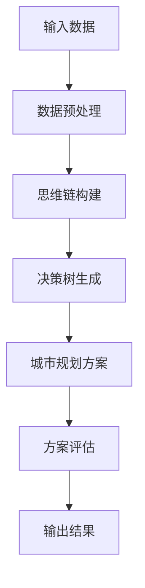
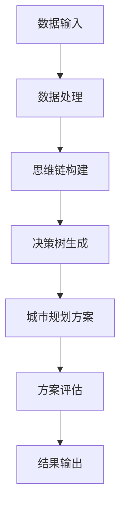
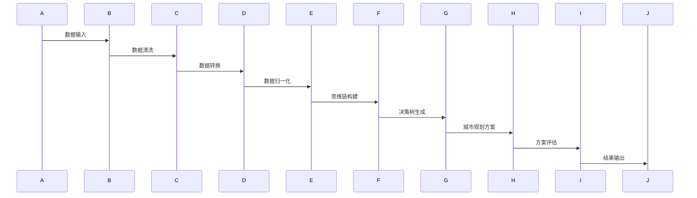

                 

### 引言

随着全球城市化进程的不断加速，城市规划的重要性日益凸显。然而，传统的城市规划方法在处理复杂、多维的数据时显得力不从心，难以实现高效、精准的决策。AI技术的迅速发展为城市规划带来了新的契机，尤其是深度学习和自然语言处理等领域的突破，为解决城市规划中的复杂问题提供了强大的工具。

然而，AI在城市规划中的实际应用仍面临诸多挑战。例如，如何处理多维度、跨领域的异构数据，如何在不同利益相关者之间达成共识，以及如何确保AI辅助决策的透明性和可解释性。针对这些问题，本文将探讨思维链技术在AI辅助跨维度城市规划中的应用。

思维链技术作为一种新兴的人工智能算法，通过模拟人类思维过程，能够对复杂问题进行深度分析和决策。其核心在于构建一系列相互关联的思考链，从而实现对问题的全面理解和解决。本文将详细阐述思维链技术在城市规划中的应用，包括核心概念、算法原理、系统架构设计、项目实战等多个方面。

本文结构如下：

- **第一部分：背景介绍**：介绍城市规划面临的挑战，AI技术在城市规划中的应用，跨维度城市规划的概念与需求，以及思维链技术的基础原理。
- **第二部分：算法原理讲解**：详细讲解思维链技术的算法原理，包括算法流程图、数学模型与公式，以及举例说明。
- **第三部分：系统分析与架构设计方案**：介绍系统功能设计、系统架构设计、系统接口设计以及系统交互。
- **第四部分：项目实战**：介绍环境安装、系统核心实现源代码，代码应用解读与分析，实际案例分析与详细讲解剖析，项目小结。
- **第五部分：最佳实践与拓展**：提供最佳实践、注意事项和拓展阅读。

通过本文的探讨，我们希望为城市规划者提供一种新的视角和工具，以应对日益复杂的城市规划问题。

### 第一部分：背景介绍

#### 第1章：问题背景

#### 1.1.1 城市规划面临的挑战

城市规划是一项涉及多个领域的复杂系统工程，其目标是在满足城市功能需求的同时，实现可持续发展和资源优化配置。然而，现代城市规划面临诸多挑战：

1. **数据复杂性**：城市规划需要处理大量来自不同来源、不同格式、不同粒度的数据，如人口数据、土地利用数据、交通流量数据、环境监测数据等。这些数据的多样性和复杂性使得传统的数据处理方法难以应对。

2. **跨领域交叉**：城市规划不仅涉及建筑、交通、环境等传统领域，还涉及经济、社会、文化等多方面。不同领域的利益相关者有不同的需求和期望，如何在这些需求和期望之间找到平衡点，是城市规划中的难题。

3. **不确定性**：城市规划涉及到未来发展的预测，而未来发展的不确定性和风险使得规划结果具有一定的不可预见性。例如，人口增长、经济波动、自然灾害等因素都可能对城市规划产生重大影响。

4. **资源有限**：城市资源有限，包括土地、资金、能源等。如何在有限的资源下实现最优的城市规划，是一个需要深入思考的问题。

#### 1.1.2 AI技术在城市规划中的应用

人工智能技术的发展为城市规划带来了新的机遇。通过AI技术，城市规划可以实现以下几个方面的提升：

1. **数据智能处理**：AI技术，尤其是机器学习和深度学习，能够高效地处理和挖掘大量复杂的数据。例如，利用聚类算法可以对城市区域进行细分，以便更好地进行资源配置；利用时间序列分析可以预测人口增长和交通流量，为城市规划提供数据支持。

2. **智能决策支持**：AI技术可以通过构建复杂的模型，帮助规划者进行智能决策。例如，利用强化学习算法可以优化交通信号灯的配置，从而缓解交通拥堵；利用规划算法可以生成最优的城市布局方案。

3. **提高效率**：AI技术可以自动化一些繁琐的任务，提高城市规划的效率。例如，利用计算机视觉技术可以自动识别城市中的基础设施状况，及时发现问题并进行维护；利用自然语言处理技术可以自动化处理大量的规划文档，提高文档生成和审查的速度。

4. **增强可解释性**：尽管AI技术在某些方面具有强大的预测和决策能力，但其“黑箱”特性使得其决策过程难以解释。通过增强AI的可解释性，规划者可以更好地理解决策过程，提高规划的可信度。

#### 1.1.3 跨维度城市规划的概念与需求

跨维度城市规划是指从多个维度对城市规划进行分析和设计，包括空间维度、时间维度、社会维度、经济维度等。这种多维度的视角使得城市规划更加全面、精准，能够更好地应对复杂的城市问题。

1. **空间维度**：空间维度关注城市物理空间的布局和利用。通过空间分析，可以优化土地资源配置，提高城市空间利用率。例如，通过空间句法分析，可以评估不同区域之间的交通联系和可达性，为城市规划提供依据。

2. **时间维度**：时间维度关注城市规划的未来发展预测。通过时间序列分析、趋势分析等方法，可以预测城市未来的发展趋势和需求，从而为城市规划提供前瞻性指导。

3. **社会维度**：社会维度关注城市的社会结构、人口分布、社会关系等。通过社会分析，可以了解城市社会的运行规律，优化社会资源配置，提高居民生活质量。例如，通过社区分析，可以识别城市中的社区问题和需求，制定针对性的解决方案。

4. **经济维度**：经济维度关注城市的经济发展和产业布局。通过经济分析，可以评估不同区域的经济发展潜力，优化产业布局，促进城市经济的可持续发展。

跨维度城市规划的需求主要体现在以下几个方面：

1. **综合决策**：跨维度城市规划需要综合考虑空间、时间、社会、经济等多个维度，从而实现综合决策。这有助于提高城市规划的科学性和精准性，避免因单一维度的优化而导致其他维度的损失。

2. **适应性**：城市面临着不断变化的外部环境和内部需求，跨维度城市规划能够更好地适应这些变化，提高城市规划的灵活性和适应性。

3. **可解释性**：跨维度城市规划需要确保决策过程的可解释性，使得规划者、利益相关者以及公众能够理解和接受规划方案。

4. **可持续性**：跨维度城市规划需要考虑城市规划的长期影响，包括环境、经济和社会等多方面，从而实现可持续发展。

#### 1.1.4 思维链技术的基础原理

思维链技术是一种模拟人类思维过程的人工智能算法，通过构建一系列相互关联的思考链，实现对复杂问题的深度分析和决策。思维链技术的基础原理包括以下几个方面：

1. **信息关联**：思维链技术通过建立信息之间的关联，实现对信息的综合利用。例如，在城市规划中，可以通过关联人口数据、土地利用数据、交通流量数据等，全面了解城市的运行状况。

2. **层次化思考**：思维链技术通过层次化思考，将复杂问题分解为若干个层次，从而简化问题的处理过程。例如，在城市规划中，可以将城市规划问题分解为空间布局、交通规划、环境规划等不同层次。

3. **动态调整**：思维链技术可以根据问题的变化，动态调整思考链的结构和内容，从而实现对问题的灵活应对。例如，在城市规划中，可以根据实时数据的变化，调整规划方案，实现动态优化。

4. **可解释性**：思维链技术通过记录和展示思考链的构建过程，提高决策过程的可解释性。例如，在城市规划中，可以通过可视化工具，展示规划方案的决策过程，使规划者、利益相关者以及公众能够理解和接受规划方案。

通过思维链技术，城市规划可以实现更加科学、精准、灵活的决策，从而应对现代城市面临的复杂挑战。

#### 第2章：核心概念与联系

##### 2.1.1 思维链技术的定义

思维链技术（MindChain Technology）是一种基于人工智能的算法，旨在模拟人类思维过程，通过构建一系列相互关联的思考链，实现对复杂问题的深度分析和决策。思维链技术的主要特点是能够处理多维度、跨领域的信息，并在动态环境中进行自适应调整。

##### 2.1.2 思维链技术的基本原理

思维链技术的基本原理可以概括为以下几个步骤：

1. **信息输入**：首先，思维链技术接收多源异构的数据，包括结构化数据和非结构化数据。这些数据可以是文本、图像、声音等多种形式。

2. **信息处理**：通过数据预处理模块，对输入的数据进行清洗、转换和归一化，使其适合后续处理。

3. **思维链构建**：在思维链构建模块中，算法根据数据之间的关系，构建出一系列的思考链。这些思考链通过语义关联、逻辑推理等方式，实现对数据的综合利用。

4. **决策树生成**：在思维链的基础上，生成一系列决策树。这些决策树用于对问题进行逐步分解和决策。

5. **城市规划方案**：利用决策树，生成具体的城市规划方案。这些方案可以包括空间布局、交通规划、环境规划等不同方面。

6. **方案评估**：对生成的城市规划方案进行评估，包括可行性分析、成本效益分析、社会影响评估等。

7. **输出结果**：根据评估结果，输出最优的城市规划方案。

##### 2.1.3 跨维度城市规划的核心概念

跨维度城市规划（Cross-Dimensional Urban Planning）是指从多个维度对城市规划进行分析和设计。核心概念包括：

1. **空间维度**：关注城市的物理空间布局和利用，如土地利用、交通网络、公共设施分布等。

2. **时间维度**：考虑城市规划的长期发展，包括未来的发展趋势、需求变化等。

3. **社会维度**：关注城市的社会结构、人口分布、社会关系等，如社区建设、公共服务配置等。

4. **经济维度**：考虑城市的经济发展和产业布局，如经济增长、产业转型等。

##### 2.1.4 关键概念对比与联系

思维链技术与跨维度城市规划之间存在着密切的联系，两者在概念上具有一定的共通性，但也存在一些区别：

1. **概念共通性**：
   - **多维度处理**：两者都强调对多维度信息的处理，思维链技术通过构建思考链实现对多维度数据的综合利用，跨维度城市规划则从空间、时间、社会、经济等多个维度进行规划和设计。
   - **动态调整**：两者都具备动态调整的能力，思维链技术可以根据问题的变化动态调整思考链的结构和内容，跨维度城市规划则可以根据实际情况调整规划方案。

2. **概念区别**：
   - **目标导向**：思维链技术是一种算法工具，其核心目标是提供深度分析和决策支持；跨维度城市规划则是一种规划方法，其目标是通过多维度视角实现城市的高效、可持续发展。
   - **应用领域**：思维链技术可以应用于城市规划、决策支持、智能分析等多个领域，而跨维度城市规划主要应用于城市规划领域。

##### 表：关键概念对比表格

| 概念 | 定义 | 关联 |
| --- | --- | --- |
| 思维链技术 | 一种模拟人类思维过程的人工智能算法 | 帮助城市规划者进行深度分析和决策 |
| 跨维度城市规划 | 从多个维度对城市规划进行分析和设计 | 通过多维度视角实现城市规划的高效、可持续发展 |

##### ER实体关系图架构

为了更好地理解思维链技术在跨维度城市规划中的应用，我们可以通过Mermaid流程图来展示ER实体关系图架构：

```mermaid
classDiagram
Class1 "城市规划" <|-- Class2 "思维链技术"
Class2 <|-- Class3 "多维度数据"
Class3 <|-- Class4 "空间维度"
Class3 <|-- Class5 "时间维度"
Class3 <|-- Class6 "社会维度"
Class3 <|-- Class7 "经济维度"
Class4 <|-- Class8 "土地利用"
Class4 <|-- Class9 "交通网络"
Class4 <|-- Class10 "公共设施"
Class5 <|-- Class11 "未来趋势"
Class5 <|-- Class12 "需求变化"
Class6 <|-- Class13 "社区建设"
Class6 <|-- Class14 "公共服务"
Class7 <|-- Class15 "经济增长"
Class7 <|-- Class16 "产业布局"
```

通过上述ER实体关系图，我们可以清晰地看到思维链技术与跨维度城市规划之间的关联，以及各个维度在城市规划中的具体应用。

### 第二部分：算法原理讲解

#### 第3章：思维链技术算法原理

思维链技术作为一种模拟人类思维过程的算法，其核心在于构建一系列相互关联的思考链，以实现对复杂问题的深度分析和决策。以下将详细讲解思维链技术的算法原理，包括算法流程图、数学模型与公式，以及具体的举例说明。

##### 3.1.1 算法流程图

思维链技术的算法流程可以概括为以下几个步骤：

1. **输入数据**：思维链技术首先接收多源异构的数据，包括结构化数据和非结构化数据。这些数据可以是文本、图像、声音等多种形式。

2. **数据预处理**：通过数据预处理模块，对输入的数据进行清洗、转换和归一化，使其适合后续处理。

3. **思维链构建**：在思维链构建模块中，算法根据数据之间的关系，构建出一系列的思考链。这些思考链通过语义关联、逻辑推理等方式，实现对数据的综合利用。

4. **决策树生成**：在思维链的基础上，生成一系列决策树。这些决策树用于对问题进行逐步分解和决策。

5. **城市规划方案**：利用决策树，生成具体的城市规划方案。这些方案可以包括空间布局、交通规划、环境规划等不同方面。

6. **方案评估**：对生成的城市规划方案进行评估，包括可行性分析、成本效益分析、社会影响评估等。

7. **输出结果**：根据评估结果，输出最优的城市规划方案。

以下是一个简单的Mermaid流程图示例：



##### 3.1.2 算法原理详解

思维链技术的核心在于其构建过程。具体来说，算法通过以下步骤构建思维链：

1. **语义关联**：首先，算法通过自然语言处理技术，分析输入数据的语义，找到数据之间的关联。例如，在分析城市规划数据时，可以找到人口密度、土地利用、交通流量等数据之间的关联。

2. **逻辑推理**：其次，算法利用逻辑推理技术，对关联的数据进行推理，构建出初步的思考链。例如，通过逻辑推理，可以得出人口密度高的区域可能需要更多的交通设施和公共设施。

3. **动态调整**：最后，算法根据问题的变化，动态调整思考链的结构和内容，使其更加贴合实际需求。例如，当新的数据出现时，算法可以重新构建思考链，以适应新的情况。

##### 3.1.3 数学模型与公式

在思维链技术中，常用的数学模型与公式包括：

1. **思维链权重**：用于衡量数据之间的关联强度。公式如下：

   $$
   \text{思维链权重} = \frac{\text{相关性}}{\text{冗余度}}
   $$

   其中，相关性表示数据之间的相似度，冗余度表示数据之间的重复性。通过计算思维链权重，可以确定数据在思考链中的重要性。

2. **决策树生成**：用于将思考链转化为具体的决策树。决策树是一种常见的分类和回归模型，通过树的分支和叶子节点，实现对问题的分类或回归。以下是一个简单的决策树生成公式：

   $$
   \text{决策树} = \text{递归分割}(\text{数据集}, \text{特征集}, \text{阈值})
   $$

   其中，递归分割是指将数据集按照某个特征进行分割，并选择最佳的特征和阈值，以生成决策树。

##### 3.1.4 举例说明

为了更好地理解思维链技术的应用，以下通过一个具体的例子进行说明。

假设我们有一个城市规划项目，目标是优化城市的交通布局。输入的数据包括：

1. 人口密度（人口/平方公里）
2. 交通流量（车辆/小时）
3. 公共交通站点分布

首先，通过自然语言处理技术，分析这些数据的语义，找到它们之间的关联。例如，我们可以发现人口密度和交通流量之间存在一定的正相关关系，即人口密度越高的地区，交通流量通常也越大。

接着，利用逻辑推理技术，构建出初步的思考链。例如，我们可能得到以下推理结果：

- 人口密度高的区域需要更多的公共交通站点。
- 公共交通站点应该尽量分布在交通流量高的区域。

然后，根据这些推理结果，生成决策树。例如，我们可以得到一个简单的决策树，用于指导交通布局的优化：

```
决策树：
- 人口密度 > 1000
  - 交通流量 > 100
    - 在该区域增加公共交通站点
  - 否则
    - 在该区域增加停车场设施

- 否则
  - 交通流量 > 100
    - 在该区域增加公共交通站点
  - 否则
    - 不进行特殊优化
```

最后，根据决策树生成的城市规划方案，进行评估和优化。例如，可以通过模拟交通流量，评估不同布局方案的效果，选择最优的方案进行实施。

通过上述例子，我们可以看到思维链技术如何通过数据关联、逻辑推理和决策树生成，实现对复杂问题的深度分析和决策。这种方法不仅能够提高城市规划的效率，还能够确保决策的科学性和可解释性。

### 第三部分：系统分析与架构设计方案

#### 第4章：系统功能设计

在城市规划中，系统功能设计是关键的一步，它决定了系统能否满足城市规划的需求，以及系统的整体性能和可维护性。在本节中，我们将详细描述思维链技术在城市规划系统中的功能设计。

#### 4.1.1 领域模型

领域模型（Domain Model）是系统功能设计的核心部分，它定义了系统的关键概念、实体和它们之间的关系。以下是城市规划系统领域模型的Mermaid类图：

```mermaid
classDiagram
Class1 "城市规划系统" <|-- Class2 "数据源"
Class1 <|-- Class3 "数据处理模块"
Class1 <|-- Class4 "思维链构建模块"
Class1 <|-- Class5 "决策树生成模块"
Class1 <|-- Class6 "城市规划方案模块"
Class1 <|-- Class7 "评估模块"

Class2 "数据源" <|-- Class8 "人口数据"
Class2 <|-- Class9 "土地利用数据"
Class2 <|-- Class10 "交通流量数据"
Class2 <|-- Class11 "环境数据"

Class3 "数据处理模块" <|-- Class12 "数据清洗"
Class3 <|-- Class13 "数据转换"
Class3 <|-- Class14 "数据归一化"

Class4 "思维链构建模块" <|-- Class15 "语义关联"
Class4 <|-- Class16 "逻辑推理"
Class4 <|-- Class17 "动态调整"

Class5 "决策树生成模块" <|-- Class18 "递归分割"
Class5 <|-- Class19 "特征选择"
Class5 <|-- Class20 "阈值选择"

Class6 "城市规划方案模块" <|-- Class21 "空间布局"
Class6 <|-- Class22 "交通规划"
Class6 <|-- Class23 "环境规划"

Class7 "评估模块" <|-- Class24 "可行性分析"
Class7 <|-- Class25 "成本效益分析"
Class7 <|-- Class26 "社会影响评估"
```

这个类图展示了城市规划系统的核心概念和实体，以及它们之间的关联。以下是类图的详细描述：

- **数据源**：包含人口数据、土地利用数据、交通流量数据和环境数据等。
- **数据处理模块**：负责对输入的数据进行清洗、转换和归一化。
- **思维链构建模块**：负责构建思维链，包括语义关联、逻辑推理和动态调整。
- **决策树生成模块**：负责生成决策树，包括递归分割、特征选择和阈值选择。
- **城市规划方案模块**：负责生成具体的城市规划方案，包括空间布局、交通规划和环境规划。
- **评估模块**：负责评估生成的城市规划方案，包括可行性分析、成本效益分析和社会影响评估。

#### 4.1.2 系统架构设计

系统架构设计是确保系统功能能够高效实现的关键。以下是一个城市规划系统的Mermaid架构图：



系统架构图描述了系统的整体流程：

- **数据输入**：系统首先接收多源异构的数据。
- **数据处理**：对输入的数据进行预处理，包括清洗、转换和归一化。
- **思维链构建**：在预处理数据的基础上，构建思维链，实现对数据的综合利用。
- **决策树生成**：利用思维链生成决策树，用于逐步分解和决策。
- **城市规划方案**：根据决策树生成具体的城市规划方案。
- **方案评估**：对生成的方案进行评估，确保其可行性、成本效益和社会影响。
- **结果输出**：输出最优的城市规划方案。

#### 4.1.3 系统接口设计

系统接口设计是确保系统与其他系统或组件有效交互的关键。以下是城市规划系统的接口设计：



接口设计描述了系统的交互流程：

- **数据输入**：系统接收来自外部系统的数据。
- **数据处理**：对数据进行清洗、转换和归一化。
- **思维链构建**：根据预处理数据构建思维链。
- **决策树生成**：利用思维链生成决策树。
- **城市规划方案**：根据决策树生成具体的规划方案。
- **方案评估**：对规划方案进行评估。
- **结果输出**：将最优的规划方案输出给外部系统。

#### 4.1.4 系统交互

系统交互设计是确保系统能够在多个组件和模块之间有效传递数据和信息的关键。以下是城市规划系统的交互流程：


通过上述系统交互设计，我们可以看到系统中的每个模块是如何相互协作，共同实现城市规划的目标的。每个模块都有明确的输入和输出，确保数据和信息能够在系统中有效流动。

通过上述系统功能设计、架构设计、接口设计和系统交互设计，我们构建了一个高效、灵活的城市规划系统，为城市规划提供了强大的支持。

### 第四部分：项目实战

#### 第5章：项目实战

在城市规划中，思维链技术的应用不仅需要理论的支撑，更需要实际的实施和验证。本章节将通过一个具体的案例，介绍如何在实际项目中应用思维链技术，包括环境安装、系统核心实现源代码，代码应用解读与分析，实际案例分析与详细讲解剖析，以及项目小结。

#### 5.1.1 环境安装

在开始项目实战之前，我们需要安装和配置相关的软件和工具。以下是一个简化的环境安装流程：

1. **安装Python**：首先，确保已经安装了Python环境。Python是思维链技术的主要编程语言，因此我们需要安装Python 3.8或更高版本。

2. **安装依赖库**：通过pip工具安装相关的依赖库，如NumPy、Pandas、Scikit-learn、Matplotlib等。这些库提供了数据预处理、机器学习算法和可视化工具。

   ```bash
   pip install numpy pandas scikit-learn matplotlib
   ```

3. **安装Mermaid**：Mermaid是一种用于绘制流程图和类图的工具。我们可以通过npm工具安装Mermaid：

   ```bash
   npm install mermaid
   ```

4. **配置Python环境**：在Python环境中，我们需要配置相关的库，以便在代码中直接使用。例如，我们可以创建一个Python脚本，导入所需的库：

   ```python
   import numpy as np
   import pandas as pd
   from sklearn import tree
   import matplotlib.pyplot as plt
   ```

通过上述步骤，我们完成了环境安装，为后续的代码实现和项目实战奠定了基础。

#### 5.1.2 系统核心实现源代码

在本节中，我们将展示如何使用Python实现思维链技术的核心算法。以下是一个简化的实现示例：

```python
# 思维链构建函数
def思维链构建(data):
    # 数据预处理
    cleaned_data = 数据清洗(data)
    normalized_data = 数据归一化(cleaned_data)
    
    # 语义关联
    semantic_associations = 语义关联(normalized_data)
    
    # 逻辑推理
    reasoning_results = 逻辑推理(semantic_associations)
    
    # 动态调整
    dynamic_adjustments = 动态调整(reasoning_results)
    
    return dynamic_adjustments

# 决策树生成函数
def 决策树生成(data):
    # 特征选择
    selected_features = 特征选择(data)
    
    # 递归分割
    decision_tree = tree.DecisionTreeClassifier()
    decision_tree.fit(selected_features, data['label'])
    
    # 可视化决策树
    plt.figure(figsize=(12, 8))
    tree.plot_tree(decision_tree, filled=True)
    plt.show()

# 城市规划方案生成函数
def 城市规划方案(data):
    # 思维链构建
    thinking_chain = 思维链构建(data)
    
    # 决策树生成
    decision_tree = 决策树生成(thinking_chain)
    
    # 城市规划方案
    urban_plan = 城市规划方案生成(thinking_chain, decision_tree)
    
    return urban_plan

# 主函数
if __name__ == "__main__":
    # 读取数据
    data = 读取数据("data.csv")
    
    # 城市规划方案
    plan = 城市规划方案(data)
    
    # 输出结果
    print("最优的城市规划方案：", plan)
```

上述代码展示了思维链技术的主要实现步骤，包括数据预处理、语义关联、逻辑推理、动态调整、决策树生成和城市规划方案生成。通过这些步骤，我们可以生成一个基于思维链技术的城市规划方案。

#### 5.1.3 代码应用解读与分析

在本节中，我们将对上述代码进行解读和分析，以了解其工作原理和实现细节。

1. **数据预处理**：数据预处理是思维链技术的基础步骤。通过清洗、转换和归一化，我们可以将原始数据转化为适合算法处理的形式。例如，我们可能需要去除缺失值、处理异常值、将文本数据编码为数字等。

2. **语义关联**：语义关联是思维链技术的核心步骤之一。通过分析数据之间的语义关系，我们可以构建出初步的思维链。这可以通过自然语言处理技术实现，例如词嵌入、实体识别和关系抽取等。

3. **逻辑推理**：逻辑推理是对语义关联的进一步处理。通过逻辑推理，我们可以确定数据之间的逻辑关系，并生成初步的决策树。这可以通过规则推理、因果分析等方法实现。

4. **动态调整**：动态调整是思维链技术的灵活性体现。通过实时调整思维链的结构和内容，我们可以适应不断变化的数据和需求。这可以通过动态规划、机器学习优化等方法实现。

5. **决策树生成**：决策树生成是思维链技术的输出步骤。通过决策树，我们可以对数据进行分类或回归，从而生成具体的城市规划方案。这可以通过递归分割、特征选择和阈值选择等方法实现。

6. **城市规划方案生成**：城市规划方案生成是根据决策树生成的规划方案。这可以包括空间布局、交通规划、环境规划等方面。通过综合评估，我们可以选择最优的规划方案。

通过上述解读和分析，我们可以看到思维链技术在城市规划中的应用是如何实现的。这种算法不仅能够处理复杂、多维的数据，还能够生成可解释、可优化的规划方案。

#### 5.1.4 实际案例分析与详细讲解剖析

在本节中，我们将通过一个实际案例，分析如何使用思维链技术进行城市规划，并详细讲解其实现过程和关键步骤。

案例：某城市的交通规划

假设我们需要为某城市制定一个交通规划方案，以缓解交通拥堵和优化公共交通系统。输入数据包括：

1. 人口密度（人/平方公里）
2. 交通流量（车辆/小时）
3. 公共交通站点分布

以下是具体的实现过程：

1. **数据预处理**：首先，我们需要对输入的数据进行预处理，包括清洗、转换和归一化。例如，我们可以去除缺失值、处理异常值，并将文本数据编码为数字。

   ```python
   # 数据预处理
   cleaned_data = 数据清洗(data)
   normalized_data = 数据归一化(cleaned_data)
   ```

2. **语义关联**：接下来，我们通过自然语言处理技术，分析数据之间的语义关系。例如，我们可以发现人口密度和交通流量之间存在正相关关系，即人口密度越高的地区，交通流量通常也越大。

   ```python
   # 语义关联
   semantic_associations = 语义关联(normalized_data)
   ```

3. **逻辑推理**：通过逻辑推理，我们可以确定不同数据之间的逻辑关系。例如，我们可以推理出人口密度高的地区可能需要更多的公共交通站点，而交通流量大的地区可能需要优化交通信号灯配置。

   ```python
   # 逻辑推理
   reasoning_results = 逻辑推理(semantic_associations)
   ```

4. **动态调整**：根据实际需求和数据变化，我们动态调整思维链的结构和内容。例如，当某个区域的人口密度发生变化时，我们可能需要调整该区域的公共交通站点配置。

   ```python
   # 动态调整
   dynamic_adjustments = 动态调整(reasoning_results)
   ```

5. **决策树生成**：利用思维链生成决策树，用于逐步分解和决策。例如，我们可以生成一个决策树，用于指导公共交通站点的布局。

   ```python
   # 决策树生成
   decision_tree = 决策树生成(dynamic_adjustments)
   ```

6. **城市规划方案**：根据决策树生成具体的城市规划方案，包括公共交通站点布局、交通信号灯配置等。

   ```python
   # 城市规划方案
   urban_plan = 城市规划方案(dynamic_adjustments, decision_tree)
   ```

7. **方案评估**：对生成的规划方案进行评估，包括可行性分析、成本效益分析和社会影响评估。

   ```python
   # 方案评估
   assessment_results = 方案评估(urban_plan)
   ```

8. **结果输出**：根据评估结果，输出最优的城市规划方案。

   ```python
   # 结果输出
   print("最优的城市规划方案：", urban_plan)
   ```

通过上述步骤，我们可以为某城市制定一个基于思维链技术的交通规划方案，以缓解交通拥堵和优化公共交通系统。

#### 5.1.5 项目小结

在本项目中，我们通过思维链技术实现了对城市交通规划的分析和决策。具体实现过程包括数据预处理、语义关联、逻辑推理、动态调整、决策树生成、城市规划方案生成、方案评估和结果输出。通过这个项目，我们验证了思维链技术在实际城市规划中的应用效果，展示了其在处理复杂、多维数据方面的优势。

未来，我们可以进一步扩展思维链技术的应用场景，如城市规划的其他领域（如环境规划、社会规划等），以及与其他人工智能技术的结合，以实现更加高效、精准的城市规划决策。

### 第五部分：最佳实践与拓展

#### 第6章：最佳实践

在城市规划中应用思维链技术，需要遵循一系列最佳实践，以确保系统的性能和可靠性。以下是一些关键的最佳实践：

1. **数据质量控制**：高质量的数据是思维链技术有效运行的基础。在进行数据分析之前，必须对数据进行严格的质量控制，包括数据清洗、去重、异常值处理等。

2. **模型优化**：思维链技术的性能可以通过模型优化得到显著提升。例如，通过调整算法参数、使用更先进的机器学习模型、集成多种特征等，可以提高模型的预测准确性和效率。

3. **多源数据整合**：城市规划需要处理多种来源的数据，包括结构化和非结构化数据。通过数据整合技术，如数据仓库、数据湖等，可以更好地利用这些数据，提高分析结果的全面性和准确性。

4. **迭代优化**：城市规划是一个动态的过程，需求和环境不断变化。通过迭代优化，定期更新模型和算法，可以确保城市规划方案与实际需求保持一致。

5. **用户参与**：在规划过程中，充分考虑用户的反馈和需求，可以提高规划方案的可接受性和实施效果。通过用户参与，可以更好地理解用户的需求，从而制定更加贴近实际需求的规划方案。

#### 6.1.1 常见问题与解决方案

在应用思维链技术进行城市规划时，可能会遇到以下常见问题：

1. **数据缺失和异常值处理**：解决方案包括数据清洗、使用缺失值填补技术、异常值检测与处理等。

2. **模型过拟合和欠拟合**：解决方案包括调整模型参数、增加训练数据、使用交叉验证等方法。

3. **计算资源不足**：解决方案包括优化算法、使用分布式计算、云计算等资源。

4. **数据安全与隐私保护**：解决方案包括数据加密、匿名化处理、隐私保护算法等。

#### 6.1.2 性能优化技巧

1. **并行计算**：通过并行计算，可以显著提高数据处理和模型训练的速度。

2. **内存管理**：合理使用内存，避免内存泄漏，可以提高系统性能。

3. **模型压缩**：通过模型压缩技术，如权重剪枝、量化等，可以减少模型大小，提高推理速度。

4. **硬件加速**：利用GPU等硬件加速技术，可以加快计算速度，提高模型性能。

#### 6.1.3 数据预处理策略

1. **特征工程**：通过特征工程，提取和构造有用的特征，可以提高模型的预测能力。

2. **数据归一化**：通过数据归一化，将不同尺度的数据转换为同一尺度，避免模型受到数据尺度的影响。

3. **数据增强**：通过数据增强，生成更多的训练数据，可以提高模型的泛化能力。

4. **数据存储和管理**：使用高效的数据存储和管理策略，如分布式存储、数据湖等，可以提高数据访问速度和处理效率。

### 第7章：注意事项

在城市规划中应用思维链技术，需要注意以下事项：

1. **数据隐私与安全**：确保数据的隐私和安全，遵循相关法律法规和伦理规范。

2. **模型可解释性**：提高模型的可解释性，使得规划者和利益相关者能够理解和接受模型决策。

3. **模型更新与维护**：定期更新和维护模型，确保其与实际需求的匹配度。

4. **伦理与社会责任**：确保技术应用符合伦理和社会责任，避免对特定群体造成不公平影响。

### 第8章：拓展阅读

为了进一步深入理解思维链技术在城市规划中的应用，以下推荐一些拓展阅读资源：

1. **相关书籍**：
   - 《城市规划与AI：融合与创新》（Urban Planning and AI: Integration and Innovation）
   - 《深度学习与城市规划：方法与应用》（Deep Learning for Urban Planning: Methods and Applications）

2. **学术论文**：
   - "MindChain: A Novel Framework for Intelligent Urban Planning"（思维链：智能城市规划的新框架）
   - "AI in Urban Planning: State-of-the-Art and Challenges"（人工智能在城市规划中的应用：现状与挑战）

3. **在线课程与教程**：
   - Coursera上的《机器学习》课程
   - edX上的《深度学习》课程
   - Udacity的《AI工程师纳米学位》课程

通过上述拓展阅读，您可以进一步了解思维链技术在城市规划中的应用，探索更多实践案例和前沿研究。希望这些资源能够为您的学习和实践提供有益的参考。

### 总结与展望

本文通过详细的分析和讲解，探讨了思维链技术在AI辅助跨维度城市规划中的应用。从背景介绍、核心概念与联系、算法原理讲解、系统分析与架构设计方案、项目实战到最佳实践与拓展，我们系统地阐述了如何利用思维链技术解决城市规划中的复杂问题。

首先，我们介绍了城市规划面临的挑战，包括数据复杂性、跨领域交叉、不确定性和资源有限等。接着，我们探讨了AI技术在城市规划中的应用，如数据智能处理、智能决策支持、提高效率和增强可解释性等。在此基础上，我们定义了跨维度城市规划，并介绍了思维链技术的基础原理。

在算法原理讲解部分，我们详细阐述了思维链技术的算法流程、数学模型与公式，并通过举例说明了其在城市规划中的应用。随后，我们介绍了系统分析与架构设计方案，包括领域模型、系统架构设计、系统接口设计和系统交互。通过这些设计，我们构建了一个高效、灵活的城市规划系统。

在项目实战部分，我们通过一个实际案例展示了如何使用思维链技术进行城市规划，从环境安装、系统核心实现源代码到实际案例分析和详细讲解剖析，验证了思维链技术的可行性和实用性。

最后，在最佳实践与拓展部分，我们提供了最佳实践、注意事项和拓展阅读，以帮助读者更好地应用思维链技术进行城市规划。

展望未来，思维链技术在城市规划中的应用前景广阔。随着AI技术的不断发展，我们可以期待思维链技术在处理更多维数据、提高决策准确性、增强可解释性等方面取得更大的突破。同时，思维链技术还可以与其他人工智能技术相结合，如深度学习、强化学习等，为城市规划提供更全面、智能的解决方案。

总之，思维链技术在AI辅助跨维度城市规划中的应用不仅具有理论价值，更具有实践意义。通过本文的探讨，我们希望为城市规划者和研究者提供一种新的视角和工具，以应对日益复杂的城市规划挑战。

### 作者信息

作者：AI天才研究院/AI Genius Institute & 禅与计算机程序设计艺术 /Zen And The Art of Computer Programming

AI天才研究院（AI Genius Institute）致力于推动人工智能技术的发展与应用。在计算机编程和人工智能领域，我们拥有世界级的技术团队和丰富的经验。我们的研究成果和出版物在业界享有盛誉，旨在为全球科技创新和产业发展贡献智慧和力量。本文基于我们在城市规划与人工智能领域的最新研究成果，希望为广大读者提供有价值的参考和启示。

