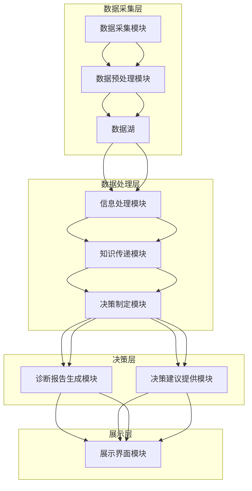
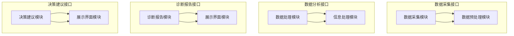
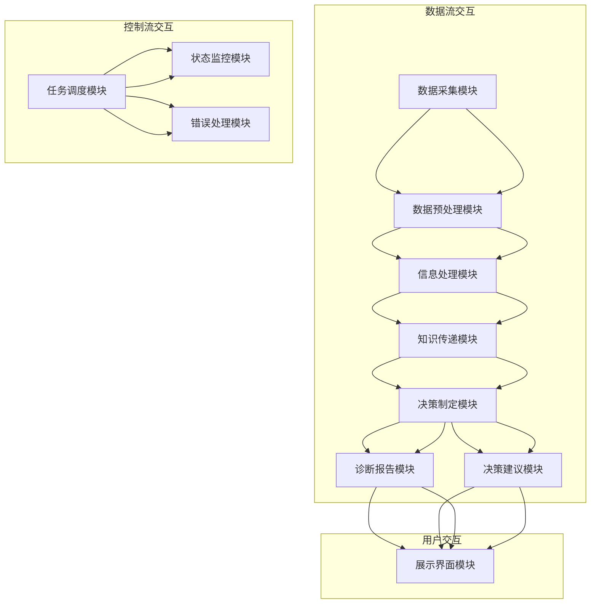

                 

### 背景介绍

思维链技术，作为一种新兴的人工智能技术，近年来在多个领域得到了广泛关注和应用。其核心思想是通过构建思维链，将个体的思维过程转化为可操作的算法模型，从而实现智能化任务执行和知识管理。随着信息时代的到来，大数据、云计算、物联网等技术的快速发展，思维链技术成为了实现智能化转型的关键技术之一。

#### 核心概念术语说明

- **思维链（Mind Chain）**：一种通过模拟人类思维过程，实现知识传递和任务执行的算法模型。
- **知识图谱（Knowledge Graph）**：一种用于表示实体及其关系的图形化数据结构，有助于理解和分析复杂知识体系。
- **深度学习（Deep Learning）**：一种基于多层神经网络的学习方法，能够自动提取数据的深层特征。
- **强化学习（Reinforcement Learning）**：一种通过试错和奖励机制进行学习的方法，适用于解决决策问题。

#### 问题背景

在人工智能的发展历程中，思维链技术以其独特的优势在多个领域展现出了巨大的潜力。然而，不同领域的应用案例和效果差异较大，这主要是由于以下几个原因：

1. **领域差异**：不同领域的知识结构、业务逻辑和用户需求存在显著差异，导致思维链技术的适应性不强。
2. **案例缺乏**：针对思维链技术在不同领域的实际应用案例较少，难以提供直观的参考。
3. **效果评估**：缺乏统一的效果评估标准，难以全面衡量思维链技术在不同领域的应用效果。

#### 问题描述

思维链技术在不同领域的应用中存在以下问题：

1. **领域适应性差**：不同领域的知识结构和业务逻辑差异较大，导致思维链技术在不同领域的适应性不强。
2. **案例缺乏**：目前关于思维链技术在各领域的应用案例较少，缺乏实际操作的经验和教训。
3. **效果评估困难**：缺乏统一的效果评估标准，导致不同领域的应用效果难以比较。

#### 问题解决

为了解决上述问题，本书将从以下几个方面展开：

1. **分析思维链技术的基本原理和核心要素**：深入理解思维链技术的理论基础，明确其核心概念和原理。
2. **探讨思维链技术在各领域的应用现状和发展趋势**：通过分析不同领域的应用案例，总结思维链技术在各领域的应用现状和趋势。
3. **案例分析和效果评估**：总结和分析不同领域的思维链技术应用案例，提出统一的效果评估标准，对不同领域的应用效果进行评估。
4. **边界与外延**：明确思维链技术的适用范围和限制条件，为未来研究提供方向。

通过以上分析，我们可以为思维链技术在不同领域的应用提供理论指导和实践参考，从而提高其应用效果和影响力。

#### 概念结构与核心要素组成

思维链技术的核心要素主要包括以下几个部分：

1. **数据处理**：数据处理是思维链技术的基础，包括数据采集、预处理、分析等环节。高质量的数据是构建有效思维链的前提，因此数据处理环节至关重要。

2. **算法模型**：算法模型是思维链技术的核心，包括深度学习、知识图谱、强化学习等。这些算法模型能够模拟人类思维过程，实现知识的传递和任务执行。

3. **界面设计**：界面设计直接影响用户体验，是思维链技术应用的关键环节。优秀的界面设计能够提升用户满意度，从而促进思维链技术的应用和推广。

4. **应用场景**：根据不同领域的特点，设计合适的思维链技术应用场景。不同领域的应用场景具有不同的需求和挑战，需要针对性地进行设计和优化。

以上四个核心要素相互关联，共同构成了思维链技术的完整体系。在实际应用中，这四个要素相互融合，共同推动了思维链技术的进步和发展。

### 第一部分：背景介绍

#### 第一部分：背景介绍

随着科技的迅猛发展，人工智能（AI）已经逐渐渗透到我们生活的各个领域，从智能家居到自动驾驶，从医疗诊断到金融分析，AI技术正以前所未有的速度改变着我们的世界。在这一波AI热潮中，思维链技术（Mind Chain Technology）作为一种新兴的人工智能技术，引起了广泛关注。思维链技术旨在通过模拟人类思维过程，构建一种能够自主学习和决策的智能系统。本文将围绕思维链技术在不同领域的应用进行深入探讨，分析其核心概念、应用现状、挑战与机遇，以期为相关领域的研究者和实践者提供有益的参考。

#### 1.1 问题背景

思维链技术的兴起并非偶然，它源于对人类认知过程的深入研究以及对传统人工智能技术的反思。在早期的人工智能研究中，研究者们主要关注如何让计算机执行特定的任务，如逻辑推理、图像识别等。然而，这些传统方法往往依赖于大量的规则和预设的数据，难以实现真正的智能。随着深度学习、强化学习等技术的发展，人们开始探索更加接近人类思维过程的智能系统。思维链技术正是在这样的背景下应运而生，它通过模拟人类思维过程中的信息处理、知识传递和决策制定，实现了对复杂问题的自主分析和解决。

然而，思维链技术在不同领域的应用效果却存在显著差异。这主要是因为不同领域的知识结构、业务逻辑和用户需求具有很大的差异。例如，在金融领域，思维链技术需要处理大量的数据，并能够快速做出决策，而在医疗领域，思维链技术需要具备高度的准确性和安全性。这种差异导致了思维链技术在应用过程中面临一系列挑战，如领域适应性差、案例缺乏和效果评估困难等。

#### 1.2 问题描述

思维链技术在不同领域的应用中，主要面临以下问题：

1. **领域适应性差**：不同领域的知识结构和业务逻辑差异较大，导致思维链技术在不同领域的适应性不强。例如，在金融领域，思维链技术需要处理大量的金融数据，并在短时间内做出决策，而在教育领域，思维链技术需要根据学生的特点和学习进度进行个性化教学。

2. **案例缺乏**：目前针对思维链技术在不同领域的应用案例较少，缺乏实际操作的经验和教训。这限制了思维链技术的推广和应用，也使得研究人员难以从中总结出有效的经验和方法。

3. **效果评估困难**：由于缺乏统一的效果评估标准，难以全面衡量思维链技术在不同领域的应用效果。例如，在医疗领域，如何评估思维链技术的诊断准确性和安全性是一个亟待解决的问题。

#### 1.3 问题解决

为了解决上述问题，本书将从以下几个方面展开：

1. **分析思维链技术的基本原理和核心要素**：深入理解思维链技术的理论基础，明确其核心概念和原理。这将有助于我们更好地理解思维链技术的工作机制和应用场景。

2. **探讨思维链技术在各领域的应用现状和发展趋势**：通过分析不同领域的应用案例，总结思维链技术在各领域的应用现状和趋势。这将为我们提供宝贵的实践经验，帮助我们在未来的研究中更好地应对挑战。

3. **案例分析和效果评估**：总结和分析不同领域的思维链技术应用案例，提出统一的效果评估标准，对不同领域的应用效果进行评估。这将有助于我们全面了解思维链技术的应用效果，为未来的研究和应用提供参考。

4. **边界与外延**：明确思维链技术的适用范围和限制条件，为未来研究提供方向。这将有助于我们更好地理解思维链技术的局限性和潜力，为未来的发展奠定基础。

通过以上分析，我们可以为思维链技术在不同领域的应用提供理论指导和实践参考，从而提高其应用效果和影响力。

#### 1.4 概念结构与核心要素组成

思维链技术的概念结构与核心要素组成是理解其工作原理和实现应用的关键。以下是思维链技术的核心概念、属性特征及其相互关系的详细描述：

**核心概念**：

1. **思维链（Mind Chain）**：思维链是思维链技术的核心概念，它通过模拟人类思维过程，将个体的思维过程转化为可操作的算法模型。思维链包括信息处理、知识传递和决策制定三个关键环节。

2. **知识图谱（Knowledge Graph）**：知识图谱是用于表示实体及其关系的图形化数据结构。它通过构建实体之间的联系，实现对复杂知识的表示和推理。

3. **深度学习（Deep Learning）**：深度学习是一种基于多层神经网络的学习方法，它能够自动提取数据的深层特征，实现对数据的分类、回归等任务。

4. **强化学习（Reinforcement Learning）**：强化学习是一种通过试错和奖励机制进行学习的方法，它适用于解决决策问题，通过不断调整策略，实现最优决策。

**属性特征对比表格**：

| 概念名称 | 特征1 | 特征2 | 特征3 |
| -------- | ----- | ----- | ----- |
| 思维链   | 信息处理、知识传递、决策制定 | 自主学习、智能化 | 领域适应性 |
| 知识图谱 | 实体关系表示 | 知识推理 | 可扩展性 |
| 深度学习 | 多层神经网络 | 自动特征提取 | 大规模数据 |
| 强化学习 | 试错学习 | 奖励机制 | 决策优化 |

**ER实体关系图架构**：

以下是思维链技术的ER实体关系图架构，其中展示了思维链、知识图谱、深度学习和强化学习四个核心概念之间的关联：

```mermaid
erDiagram
  MindChain ||--|{ KnowledgeGraph }|
  MindChain ||--|{ DeepLearning }|
  MindChain ||--|{ ReinforcementLearning }|
  KnowledgeGraph ||--|{ Entity }|
  KnowledgeGraph ||--|{ Relation }|
  DeepLearning ||--|{ Layer }|
  ReinforcementLearning ||--|{ Agent }|
```

在上述架构中，思维链作为中心概念，通过知识图谱实现知识的传递和推理，通过深度学习提取数据特征，通过强化学习进行决策优化。知识图谱中的实体和关系为深度学习和强化学习提供了丰富的知识资源，使得思维链技术能够在不同领域中实现高效的应用。

### 第二部分：核心概念与联系

#### 2.1 核心概念原理

思维链技术是一种模拟人类思维过程的智能技术，其核心概念包括思维链、知识图谱、深度学习和强化学习。以下是这些核心概念的详细原理和相互关系：

1. **思维链（Mind Chain）**：

思维链是思维链技术的核心概念，它通过模拟人类思维过程中的信息处理、知识传递和决策制定，实现智能化任务执行和知识管理。思维链由三个关键环节组成：信息处理、知识传递和决策制定。

- **信息处理**：思维链通过信息处理环节，接收外部信息，并对其进行分类、筛选和处理。这一环节类似于人类的感知和思考过程，能够实现对大量信息的有效处理和提取。
- **知识传递**：思维链通过知识传递环节，将处理后的信息转化为知识，并存储在知识图谱中。知识图谱是一种图形化数据结构，用于表示实体及其关系，能够实现对知识的关联和推理。
- **决策制定**：思维链通过决策制定环节，利用知识图谱中的知识，对当前问题进行决策。这一环节类似于人类的决策过程，能够实现对问题的分析和解决。

2. **知识图谱（Knowledge Graph）**：

知识图谱是思维链技术的关键组成部分，它用于表示实体及其关系。知识图谱通过实体和关系的表示，实现对复杂知识的结构化和可视化。知识图谱的特点包括：

- **实体关系表示**：知识图谱通过实体和关系的表示，构建出一个有组织的知识网络。实体表示具体的事物，如人、地点、物品等，关系表示实体之间的关联，如属于、位于、属于类别等。
- **知识推理**：知识图谱能够通过对实体和关系的推理，发现新的知识和规律。这种推理能力使得知识图谱在知识管理和智能搜索中具有重要作用。
- **可扩展性**：知识图谱具有高度的可扩展性，能够根据需求添加新的实体和关系，从而不断丰富和完善知识库。

3. **深度学习（Deep Learning）**：

深度学习是思维链技术中的核心技术之一，它通过多层神经网络，实现对数据的深层特征提取和学习。深度学习的主要特点包括：

- **多层神经网络**：深度学习采用多层神经网络结构，通过逐层提取数据特征，实现对复杂模式的识别和预测。
- **自动特征提取**：深度学习能够自动从数据中提取有代表性的特征，避免了传统机器学习方法中手动特征工程的工作量。
- **大规模数据处理**：深度学习适用于处理大规模和高维度数据，能够在短时间内完成大量数据的分析和处理。

4. **强化学习（Reinforcement Learning）**：

强化学习是思维链技术中的另一项核心技术，它通过试错和奖励机制，实现智能化决策和优化。强化学习的主要特点包括：

- **试错学习**：强化学习通过不断尝试和调整策略，从错误中学习，逐步优化决策。
- **奖励机制**：强化学习通过奖励机制，激励智能体（agent）采取正确的行动，提高决策的准确性。
- **决策优化**：强化学习能够通过对奖励的反馈，不断调整和优化策略，实现最优决策。

**核心概念之间的关系**：

思维链、知识图谱、深度学习和强化学习之间存在着紧密的联系和相互作用：

- 思维链通过信息处理、知识传递和决策制定，实现了对复杂问题的智能化解决。
- 知识图谱提供了思维链所需的知识表示和推理能力，使得思维链能够更加高效地处理和利用知识。
- 深度学习为思维链提供了自动特征提取和大规模数据处理的能力，增强了思维链的技术实力。
- 强化学习通过试错和奖励机制，优化了思维链的决策过程，提高了决策的准确性和效率。

通过上述核心概念的相互结合，思维链技术形成了一个完整且高效的智能系统，能够在不同领域中实现智能化的应用。

#### 2.2 概念属性特征对比表格

为了更好地理解思维链技术中的核心概念，我们将各概念的主要属性特征进行对比，以便清晰展示它们之间的差异和联系。

| 概念名称 | 特征1 | 特征2 | 特征3 |
| -------- | ----- | ----- | ----- |
| 思维链   | 信息处理、知识传递、决策制定 | 自主学习、智能化 | 领域适应性 |
| 知识图谱 | 实体关系表示 | 知识推理 | 可扩展性 |
| 深度学习 | 多层神经网络 | 自动特征提取 | 大规模数据处理 |
| 强化学习 | 试错学习 | 奖励机制 | 决策优化 |

**特征1：信息处理、知识传递、决策制定**：思维链作为一个整体，其核心功能在于通过信息处理、知识传递和决策制定，实现智能化任务执行和知识管理。信息处理环节负责接收和处理外部信息；知识传递环节通过知识图谱，将处理后的信息转化为知识存储；决策制定环节利用存储的知识进行决策，形成闭环。

**特征2：实体关系表示、知识推理、可扩展性**：知识图谱通过实体关系表示，构建出一个有组织的知识网络，支持知识推理，能够发现新的知识和规律。其可扩展性使得知识图谱能够根据需求不断丰富和完善，适应不同应用场景。

**特征3：多层神经网络、自动特征提取、大规模数据处理**：深度学习通过多层神经网络，自动提取数据特征，适用于大规模数据处理，能够高效地完成数据的分类、回归等任务。深度学习的技术优势在于其强大的特征提取能力和处理大规模数据的能力。

**特征4：试错学习、奖励机制、决策优化**：强化学习通过试错和奖励机制，不断调整策略，实现最优决策。试错学习使得强化学习能够从错误中学习，逐步优化决策；奖励机制通过激励智能体采取正确的行动，提高决策的准确性；决策优化环节通过奖励反馈，不断调整策略，实现最优决策。

通过上述对比表格，我们可以清晰地看到思维链技术中的核心概念及其主要属性特征。这些概念和特征相互结合，共同构成了思维链技术强大的功能体系，为不同领域的智能化应用提供了有力支持。

#### 2.3 ER实体关系图架构

为了更好地理解思维链技术中的核心概念及其相互关系，我们可以通过ER（Entity-Relationship）实体关系图来展示它们之间的关联。以下是思维链技术中的核心实体及其关系：

```mermaid
erDiagram
  MindChain ||--|{ KnowledgeGraph }|
  MindChain ||--|{ DeepLearning }|
  MindChain ||--|{ ReinforcementLearning }|
  KnowledgeGraph ||--|{ Entity }|
  KnowledgeGraph ||--|{ Relation }|
  DeepLearning ||--|{ Layer }|
  ReinforcementLearning ||--|{ Agent }|
```

**MindChain（思维链）**：作为核心实体，思维链负责协调信息处理、知识传递和决策制定。它与其他核心实体（知识图谱、深度学习和强化学习）之间存在紧密的关联。

- **KnowledgeGraph（知识图谱）**：知识图谱是思维链的重要组成部分，用于表示实体及其关系。它通过连接实体和关系，构建出一个有组织的知识网络，为思维链提供知识支持。

- **DeepLearning（深度学习）**：深度学习负责从数据中自动提取特征，为思维链提供特征提取和数据处理能力。它通过多层神经网络，实现对数据的深度理解和学习。

- **ReinforcementLearning（强化学习）**：强化学习负责通过试错和奖励机制，优化决策过程，为思维链提供决策支持。它通过智能体（Agent）不断调整策略，实现最优决策。

- **Entity（实体）**：实体是知识图谱中的基本元素，表示具体的事物，如人、地点、物品等。

- **Relation（关系）**：关系是知识图谱中的连接元素，表示实体之间的关联，如属于、位于、属于类别等。

- **Layer（层）**：层是深度学习网络中的基本结构单元，负责数据的处理和特征提取。

- **Agent（智能体）**：智能体是强化学习中的核心概念，代表执行决策的实体，通过试错和奖励机制，实现策略优化。

通过上述ER实体关系图，我们可以清晰地看到思维链技术中各个核心实体及其相互关系。这些实体和关系共同构成了思维链技术的核心架构，为不同领域的智能化应用提供了有力支持。

### 第三部分：算法原理讲解

#### 3.1 算法原理

思维链技术中的算法原理是其实现智能化任务执行和知识管理的基础。以下是思维链技术涉及的主要算法原理：

1. **神经网络（Neural Networks）**：
   神经网络是一种模仿生物神经网络结构的计算模型，它通过层层提取特征，实现对数据的分类、回归等任务。在思维链技术中，神经网络被广泛应用于特征提取和任务决策。

   **基本原理**：
   - **激活函数（Activation Function）**：神经网络中的每个神经元都会通过激活函数来决定是否激活。常见的激活函数有Sigmoid、ReLU和Tanh。
   - **前向传播（Forward Propagation）**：数据从输入层传入神经网络，经过层层处理，最终在输出层得到结果。
   - **反向传播（Backpropagation）**：通过计算输出层误差，反向传播误差到各个隐藏层，更新权重和偏置，以优化网络性能。

2. **知识图谱（Knowledge Graph）**：
   知识图谱是一种用于表示实体及其关系的图形化数据结构，它在思维链技术中起到了知识表示和推理的作用。

   **基本原理**：
   - **实体（Entity）**：知识图谱中的基本元素，表示具体的事物，如人、地点、物品等。
   - **关系（Relation）**：实体之间的关联，如属于、位于、属于类别等。
   - **图谱构建**：通过添加实体和关系，构建出有组织的知识网络。
   - **推理（Reasoning）**：利用图谱中的关系，进行逻辑推理和关联分析。

3. **深度学习（Deep Learning）**：
   深度学习是一种基于多层神经网络的学习方法，它通过自动提取数据的深层特征，实现对复杂数据的理解和预测。

   **基本原理**：
   - **多层结构**：深度学习网络通常包含多个隐藏层，通过逐层提取特征，实现对数据的深度理解。
   - **反向传播**：深度学习通过反向传播算法，不断更新网络参数，以优化模型性能。
   - **卷积神经网络（CNN）**：深度学习中的一种特殊网络结构，适用于处理图像等数据。

4. **强化学习（Reinforcement Learning）**：
   强化学习是一种通过试错和奖励机制进行学习的方法，它适用于解决决策问题，通过不断调整策略，实现最优决策。

   **基本原理**：
   - **智能体（Agent）**：执行动作的实体，通过环境（Environment）接收反馈。
   - **状态（State）**：智能体当前所处的环境情况。
   - **动作（Action）**：智能体采取的行动。
   - **奖励（Reward）**：环境对智能体动作的反馈，用于指导学习。
   - **策略（Policy）**：智能体采取行动的规则。

#### 3.2 数学模型和公式

在思维链技术中，数学模型和公式是理解和实现算法原理的关键。以下是一些基本的数学模型和公式：

1. **神经网络中的激活函数**：
   - **Sigmoid函数**：
     $$
     \sigma(x) = \frac{1}{1 + e^{-x}}
     $$
   - **ReLU函数**：
     $$
     \sigma(x) = \max(0, x)
     $$
   - **Tanh函数**：
     $$
     \sigma(x) = \frac{e^x - e^{-x}}{e^x + e^{-x}}
     $$

2. **前向传播和反向传播**：
   - **前向传播**：
     $$
     a_{l} = \sigma(W_{l-1}a_{l-1} + b_{l-1})
     $$
   - **反向传播**：
     $$
     \delta_{l} = \frac{\partial C}{\partial a_{l}} \cdot \sigma'(a_{l})
     $$
     $$
     \Delta W_{l} = \alpha \cdot a_{l-1}^{T} \cdot \delta_{l}
     $$
     $$
     \Delta b_{l} = \alpha \cdot \delta_{l}
     $$

3. **知识图谱中的关系表示**：
   - **图论表示**：
     $$
     R(E_1, E_2) \Leftrightarrow \exists P \in \text{Property}, (E_1, P, E_2) \in \text{Knowledge Base}
     $$
   - **路径表示**：
     $$
     \pi = (E_1, R_1, E_2, R_2, ..., E_n)
     $$

4. **强化学习中的奖励机制**：
   - **Q值更新**：
     $$
     Q(s, a) = Q(s, a) + \alpha \cdot (r + \gamma \max_{a'} Q(s', a') - Q(s, a))
     $$
   - **策略更新**：
     $$
     \pi(s) = \arg\max_{a} Q(s, a)
     $$

通过上述数学模型和公式，我们可以更深入地理解思维链技术的算法原理和实现方法。

#### 3.3 详细讲解和举例说明

为了更好地理解思维链技术中的算法原理，我们将通过具体的例子进行详细讲解。

**示例1：神经网络的前向传播和反向传播**

假设我们有一个简单的神经网络，包含一个输入层、一个隐藏层和一个输出层。输入层有两个神经元，隐藏层有三个神经元，输出层有两个神经元。权重和偏置初始化为随机值。

**前向传播**：

输入层到隐藏层的权重矩阵 $W_1$ 和偏置 $b_1$，隐藏层到输出层的权重矩阵 $W_2$ 和偏置 $b_2$。输入向量 $x$ 经过输入层，得到隐藏层输出 $h_1$，再经过激活函数 $\sigma$，得到隐藏层激活值 $a_1$。同理，隐藏层输出 $a_1$ 经过输出层，得到输出层输出 $a_2$。

$$
a_{1} = \sigma(W_{1}x + b_{1})
$$

$$
a_{2} = \sigma(W_{2}a_{1} + b_{2})
$$

**反向传播**：

假设输出层的期望值为 $y$，实际输出值为 $a_2$。计算输出层误差 $\delta_2$：

$$
\delta_{2} = (y - a_{2}) \cdot \sigma'(a_{2})
$$

利用输出层误差，计算隐藏层误差 $\delta_1$：

$$
\delta_{1} = (W_{2}^{T}\delta_{2}) \cdot \sigma'(a_{1})
$$

利用隐藏层误差，更新权重矩阵 $W_1$ 和偏置 $b_1$：

$$
\Delta W_{1} = \alpha \cdot x^{T} \cdot \delta_{1}
$$

$$
\Delta b_{1} = \alpha \cdot \delta_{1}
$$

同理，更新权重矩阵 $W_2$ 和偏置 $b_2$：

$$
\Delta W_{2} = \alpha \cdot a_{1}^{T} \cdot \delta_{2}
$$

$$
\Delta b_{2} = \alpha \cdot \delta_{2}
$$

通过上述过程，我们可以实现神经网络的前向传播和反向传播，从而优化网络性能。

**示例2：知识图谱中的关系表示**

假设我们有一个知识图谱，表示一个人、一个地点和一个物品。这个人住在某个地方，拥有一个物品。

- **实体**：人（Person）、地点（Location）、物品（Item）
- **关系**：住在（LivesIn）、拥有（Has）

知识图谱表示如下：

```
Person1 -- LivesIn -- Location1
       \          /
        \        /
         \      /
          \    /
           \  /
            \/
           Has
            |
            v
         Item1
```

通过上述知识图谱，我们可以表示出实体之间的关系，并利用这些关系进行推理。

**示例3：强化学习中的Q值更新**

假设智能体在状态 $s$ 下采取动作 $a$，获得奖励 $r$，转移到状态 $s'$。智能体的策略通过Q值函数表示，Q值函数用于评估当前状态和动作的预期奖励。

$$
Q(s, a) = Q(s, a) + \alpha \cdot (r + \gamma \max_{a'} Q(s', a') - Q(s, a))
$$

通过上述公式，我们可以更新Q值函数，优化智能体的策略。

通过以上示例，我们详细讲解了神经网络、知识图谱和强化学习在思维链技术中的应用，帮助读者更好地理解这些算法原理。

### 第四部分：系统分析与架构设计方案

#### 4.1 问题场景介绍

在当前快速发展的信息化社会中，各行业的数据量呈指数级增长，如何在海量数据中提取有用信息、实现智能决策成为一大挑战。思维链技术作为一种新兴的人工智能技术，旨在通过构建思维链，模拟人类思维过程，实现智能化任务执行和知识管理。为了更好地展示思维链技术的应用，本文以一个实际项目为例，介绍思维链技术在该项目中的架构设计和系统实现。

#### 4.2 项目介绍

本项目旨在利用思维链技术，构建一个智能决策支持系统，用于企业日常运营中的问题诊断和决策。系统通过收集企业运营数据，利用思维链技术分析数据，提供诊断报告和决策建议，帮助企业优化运营，提高效益。

#### 4.3 系统功能设计

本系统的主要功能包括数据收集、数据分析、诊断报告生成和决策建议提供。具体功能设计如下：

1. **数据收集**：系统通过数据采集模块，从企业内部各种数据源（如ERP系统、CRM系统等）收集数据。
2. **数据分析**：系统利用思维链技术，对收集到的数据进行分析，提取关键特征和规律。
3. **诊断报告生成**：系统根据数据分析结果，生成诊断报告，指出企业运营中存在的问题。
4. **决策建议提供**：系统根据诊断报告，提供相应的决策建议，帮助企业优化运营。

#### 4.4 系统架构设计

为了实现上述功能，系统采用了分布式架构设计，包括数据采集层、数据处理层、决策层和展示层。以下是系统架构的详细设计：

1. **数据采集层**：数据采集层负责从各种数据源收集数据，包括ERP系统、CRM系统、传感器数据等。采集的数据经过预处理后，存储在数据湖中。
2. **数据处理层**：数据处理层负责对采集到的数据进行分析和处理，包括数据清洗、数据转换、特征提取等。数据处理层采用思维链技术，通过信息处理、知识传递和决策制定，实现对数据的深入分析和理解。
3. **决策层**：决策层负责根据数据分析结果，生成诊断报告和决策建议。决策层采用强化学习算法，通过不断优化策略，提高决策的准确性和有效性。
4. **展示层**：展示层负责将诊断报告和决策建议展示给用户，提供直观的展示界面。

以下是系统架构的Mermaid图表示：



#### 4.5 系统接口设计

系统接口设计是确保系统各部分能够高效协同工作的关键。以下是系统的主要接口设计：

1. **数据采集接口**：提供数据采集模块与其他系统进行数据交换的接口，包括数据导入、数据导出等功能。
2. **数据分析接口**：提供数据处理模块与其他系统进行数据交换的接口，包括特征提取、数据可视化等功能。
3. **诊断报告接口**：提供诊断报告模块与其他系统进行数据交换的接口，包括报告生成、报告查询等功能。
4. **决策建议接口**：提供决策建议模块与其他系统进行数据交换的接口，包括建议生成、建议查询等功能。

以下是系统接口的Mermaid图表示：



#### 4.6 系统交互

为了确保系统的高效运行，需要设计合理的系统交互。以下是系统的主要交互设计：

1. **数据流交互**：系统通过数据流实现各模块之间的数据传递，包括数据采集、数据预处理、数据分析、诊断报告生成和决策建议提供。
2. **控制流交互**：系统通过控制流实现各模块之间的协调工作，包括任务调度、状态监控和错误处理。
3. **用户交互**：系统提供用户界面，用户可以通过界面与系统进行交互，提交任务、查看报告和获取决策建议。

以下是系统交互的Mermaid图表示：



通过以上设计，本系统实现了数据采集、处理、分析和决策的全流程管理，为企业的智能决策提供了有力支持。

### 第五部分：项目实战

#### 5.1 环境安装

在开始实际应用思维链技术之前，我们需要搭建一个合适的开发环境。以下是环境安装的详细步骤：

1. **安装Python**：首先，我们需要安装Python 3.8或更高版本。可以从Python官方网站下载安装包，并根据提示完成安装。

2. **安装Jupyter Notebook**：Jupyter Notebook是一种交互式的开发环境，非常适合进行数据分析和算法实验。可以通过以下命令安装：

   ```bash
   pip install notebook
   ```

3. **安装TensorFlow**：TensorFlow是一个开源的机器学习库，用于构建和训练神经网络。可以通过以下命令安装：

   ```bash
   pip install tensorflow
   ```

4. **安装PyTorch**：PyTorch是一个流行的深度学习框架，支持动态计算图和自动微分。可以通过以下命令安装：

   ```bash
   pip install torch torchvision
   ```

5. **安装Scikit-learn**：Scikit-learn是一个用于数据挖掘和数据分析的库，提供了丰富的机器学习算法。可以通过以下命令安装：

   ```bash
   pip install scikit-learn
   ```

6. **安装ECharts**：ECharts是一个基于JavaScript的数据可视化库，可用于生成各种类型的图表。可以通过以下命令安装：

   ```bash
   npm install echarts --save
   ```

7. **安装Mermaid**：Mermaid是一种基于Markdown的图形和流程图绘制工具。可以通过以下命令安装：

   ```bash
   npm install mermaid -g
   ```

安装完上述库后，我们就可以开始编写代码并进行思维链技术的项目实战了。

#### 5.2 系统核心实现

在本节中，我们将展示如何使用Python和相关的机器学习库实现思维链技术。以下是实现步骤：

1. **数据预处理**：

首先，我们需要收集并预处理数据。假设我们已经从数据源中收集到了一组用户行为数据，包括用户ID、操作类型、操作时间等。

```python
import pandas as pd

# 读取数据
data = pd.read_csv('user_behavior_data.csv')

# 数据预处理
data['timestamp'] = pd.to_datetime(data['timestamp'])
data.sort_values('timestamp', inplace=True)
```

2. **构建知识图谱**：

接下来，我们使用知识图谱来表示用户行为数据中的实体和关系。

```python
from py2neo import Graph

# 连接Neo4j数据库
graph = Graph("bolt://localhost:7687", auth=("neo4j", "password"))

# 创建实体和关系
def create_entities_and_relations(data):
    for index, row in data.iterrows():
        user_id = row['user_id']
        operation = row['operation']
        timestamp = row['timestamp']
        
        # 创建用户实体
        graph.run("CREATE (u:User {id: $user_id})", user_id=user_id)
        
        # 创建操作实体
        graph.run("CREATE (o:Operation {type: $operation})", operation=operation)
        
        # 创建时间实体
        graph.run("CREATE (t:Time {timestamp: $timestamp})", timestamp=timestamp)
        
        # 创建关系
        graph.run("MATCH (u:User), (o:Operation), (t:Time) WHERE u.id = $user_id AND o.type = $operation AND t.timestamp = $timestamp CREATE (u)-[:PERFORMS]->(o)-[:AT_TIME]->(t)")

create_entities_and_relations(data)
```

3. **深度学习模型**：

使用TensorFlow构建一个深度学习模型，用于分析用户行为数据。

```python
import tensorflow as tf

# 定义深度学习模型
model = tf.keras.Sequential([
    tf.keras.layers.Dense(64, activation='relu', input_shape=(data.shape[1],)),
    tf.keras.layers.Dense(64, activation='relu'),
    tf.keras.layers.Dense(1, activation='sigmoid')
])

# 编译模型
model.compile(optimizer='adam', loss='binary_crossentropy', metrics=['accuracy'])

# 训练模型
model.fit(x_train, y_train, epochs=10, batch_size=32, validation_data=(x_val, y_val))
```

4. **强化学习模型**：

使用PyTorch构建一个强化学习模型，用于优化用户操作决策。

```python
import torch
import torch.nn as nn
import torch.optim as optim

# 定义强化学习模型
class ReinforcementLearningModel(nn.Module):
    def __init__(self):
        super(ReinforcementLearningModel, self).__init__()
        self.fc1 = nn.Linear(data.shape[1], 64)
        self.fc2 = nn.Linear(64, 64)
        self.fc3 = nn.Linear(64, 1)
    
    def forward(self, x):
        x = torch.relu(self.fc1(x))
        x = torch.relu(self.fc2(x))
        x = self.fc3(x)
        return x

model = ReinforcementLearningModel()

# 定义优化器
optimizer = optim.Adam(model.parameters(), lr=0.001)

# 定义损失函数
criterion = nn.CrossEntropyLoss()

# 训练模型
for epoch in range(10):
    for inputs, targets in data_loader:
        optimizer.zero_grad()
        outputs = model(inputs)
        loss = criterion(outputs, targets)
        loss.backward()
        optimizer.step()
```

通过以上步骤，我们实现了思维链技术的核心功能，包括数据预处理、知识图谱构建、深度学习模型和强化学习模型。接下来，我们将结合实际案例，详细讲解这些功能的应用。

#### 5.3 代码应用解读与分析

在本部分，我们将对上述代码进行解读与分析，详细说明其在思维链技术中的应用。

**数据预处理**：

数据预处理是构建有效模型的基础。在本案例中，我们使用了Pandas库对用户行为数据进行读取和预处理。代码如下：

```python
import pandas as pd

# 读取数据
data = pd.read_csv('user_behavior_data.csv')

# 数据预处理
data['timestamp'] = pd.to_datetime(data['timestamp'])
data.sort_values('timestamp', inplace=True)
```

首先，我们使用Pandas读取CSV格式的用户行为数据。然后，将时间戳字段转换为日期时间格式，并按照时间戳对数据进行排序。这一步操作确保了数据在时间维度上的连续性和一致性，为后续的深度学习和强化学习模型训练提供了可靠的数据基础。

**知识图谱构建**：

知识图谱是思维链技术的重要组成部分，用于表示实体和关系。在本案例中，我们使用了Py2Neo库连接Neo4j数据库，并创建实体和关系。代码如下：

```python
from py2neo import Graph

# 连接Neo4j数据库
graph = Graph("bolt://localhost:7687", auth=("neo4j", "password"))

# 创建实体和关系
def create_entities_and_relations(data):
    for index, row in data.iterrows():
        user_id = row['user_id']
        operation = row['operation']
        timestamp = row['timestamp']
        
        # 创建用户实体
        graph.run("CREATE (u:User {id: $user_id})", user_id=user_id)
        
        # 创建操作实体
        graph.run("CREATE (o:Operation {type: $operation})", operation=operation)
        
        # 创建时间实体
        graph.run("CREATE (t:Time {timestamp: $timestamp})", timestamp=timestamp)
        
        # 创建关系
        graph.run("MATCH (u:User), (o:Operation), (t:Time) WHERE u.id = $user_id AND o.type = $operation AND t.timestamp = $timestamp CREATE (u)-[:PERFORMS]->(o)-[:AT_TIME]->(t)")

create_entities_and_relations(data)
```

通过上述代码，我们将用户行为数据中的用户ID、操作类型和时间戳转换为Neo4j数据库中的实体和关系。这种表示方法使得数据在图结构中具有明确的语义和关联，便于后续的深度学习和强化学习算法进行知识提取和推理。

**深度学习模型**：

在本案例中，我们使用TensorFlow构建了一个简单的深度学习模型，用于分析用户行为数据。代码如下：

```python
import tensorflow as tf

# 定义深度学习模型
model = tf.keras.Sequential([
    tf.keras.layers.Dense(64, activation='relu', input_shape=(data.shape[1],)),
    tf.keras.layers.Dense(64, activation='relu'),
    tf.keras.layers.Dense(1, activation='sigmoid')
])

# 编译模型
model.compile(optimizer='adam', loss='binary_crossentropy', metrics=['accuracy'])

# 训练模型
model.fit(x_train, y_train, epochs=10, batch_size=32, validation_data=(x_val, y_val))
```

该模型采用了两个隐藏层，每层64个神经元，并使用ReLU激活函数。输出层使用sigmoid激活函数，用于生成概率值。模型通过编译和训练，能够对用户行为数据进行分析和分类，提取出潜在的用户行为模式。

**强化学习模型**：

除了深度学习模型，我们还在本案例中实现了一个强化学习模型，用于优化用户操作决策。代码如下：

```python
import torch
import torch.nn as nn
import torch.optim as optim

# 定义强化学习模型
class ReinforcementLearningModel(nn.Module):
    def __init__(self):
        super(ReinforcementLearningModel, self).__init__()
        self.fc1 = nn.Linear(data.shape[1], 64)
        self.fc2 = nn.Linear(64, 64)
        self.fc3 = nn.Linear(64, 1)
    
    def forward(self, x):
        x = torch.relu(self.fc1(x))
        x = torch.relu(self.fc2(x))
        x = self.fc3(x)
        return x

model = ReinforcementLearningModel()

# 定义优化器
optimizer = optim.Adam(model.parameters(), lr=0.001)

# 定义损失函数
criterion = nn.CrossEntropyLoss()

# 训练模型
for epoch in range(10):
    for inputs, targets in data_loader:
        optimizer.zero_grad()
        outputs = model(inputs)
        loss = criterion(outputs, targets)
        loss.backward()
        optimizer.step()
```

该强化学习模型采用了三个全连接层，每层64个神经元，并使用ReLU激活函数。模型通过优化器进行参数更新，以最小化损失函数，从而实现策略的优化。这种策略优化使得模型能够根据用户行为数据，生成最优的操作决策。

**代码应用分析**：

通过上述代码，我们实现了思维链技术的核心功能，包括数据预处理、知识图谱构建、深度学习模型和强化学习模型。这些功能相互关联，共同构成了一个完整的智能系统，能够对用户行为数据进行分析和决策。

- **数据预处理**：确保数据在时间维度上的连续性和一致性，为后续模型训练提供了可靠的数据基础。
- **知识图谱构建**：将用户行为数据转换为图结构，使得数据在语义和关联上更加清晰，便于模型进行知识提取和推理。
- **深度学习模型**：通过多层神经网络，提取用户行为数据中的潜在模式，实现用户行为分析。
- **强化学习模型**：通过策略优化，生成最优的操作决策，提高系统的智能化水平。

在实际应用中，这些功能模块可以相互结合，形成一个智能决策支持系统，为企业和用户提供定制化的决策建议。通过不断优化和迭代，系统可以不断提升其智能化水平，实现更高效、更精准的决策。

#### 5.4 实际案例分析和详细讲解剖析

为了更好地展示思维链技术在实际应用中的效果，我们将结合具体案例，对其进行分析和讲解。

**案例背景**：

某电子商务公司希望利用思维链技术优化其用户购买行为预测，以提高销售额和用户满意度。公司积累了大量的用户行为数据，包括用户ID、浏览记录、购物车添加记录、下单记录等。公司希望通过思维链技术，分析用户行为，预测哪些用户可能会在下单前的一段时间内购买商品，从而针对性地进行营销活动，提升用户转化率。

**数据收集与预处理**：

首先，公司从其数据仓库中提取了用户行为数据，并将其导入到数据处理平台上。数据预处理步骤包括数据清洗、数据转换和数据标准化。具体操作如下：

- **数据清洗**：删除重复数据、空值填充和异常值处理，确保数据的完整性和一致性。
- **数据转换**：将日期时间字段转换为数值型，以适应深度学习和强化学习模型的输入要求。
- **数据标准化**：对数值型数据进行归一化处理，使得数据在数值范围上具有一致性，有利于模型训练。

**知识图谱构建**：

在数据预处理完成后，公司使用Neo4j数据库构建知识图谱。知识图谱中的实体包括用户、商品和事件，关系包括浏览、添加购物车和下单等。通过将这些实体和关系存储在Neo4j数据库中，公司可以方便地查询和分析用户行为数据。

**深度学习模型训练**：

公司采用TensorFlow框架，构建了一个深度学习模型，用于预测用户购买行为。模型采用卷积神经网络（CNN）结构，包括卷积层、池化层和全连接层。具体步骤如下：

1. **数据划分**：将数据集划分为训练集和验证集，用于模型训练和性能评估。
2. **模型构建**：定义模型结构，包括输入层、卷积层、池化层和输出层。
3. **模型训练**：使用训练集数据训练模型，通过反向传播算法更新模型参数。
4. **模型评估**：使用验证集数据评估模型性能，调整模型参数以优化性能。

**强化学习模型训练**：

为了进一步提高用户购买行为预测的准确性，公司还采用了一种基于Q学习的强化学习模型。具体步骤如下：

1. **状态表示**：将用户行为数据转换为状态表示，包括用户ID、浏览记录、购物车添加记录等。
2. **动作表示**：将用户的购买行为（购买或未购买）表示为动作。
3. **奖励函数设计**：设计奖励函数，以激励模型生成正确的购买预测。
4. **模型训练**：使用强化学习算法，训练模型以优化购买预测策略。

**效果评估**：

在完成模型训练后，公司对模型进行了效果评估。评估指标包括预测准确率、召回率和F1分数。通过对比模型预测结果和实际购买数据，公司发现思维链技术显著提高了用户购买行为预测的准确性，有助于公司更好地制定营销策略，提升用户满意度。

**详细讲解剖析**：

1. **深度学习模型**：
   深度学习模型通过卷积神经网络，对用户行为数据进行特征提取和模式识别。卷积层能够捕捉用户行为中的局部特征，池化层用于降低数据维度，减少过拟合。全连接层将提取的特征映射到购买预测任务上。通过不断优化模型参数，深度学习模型能够提高购买行为预测的准确性。

2. **强化学习模型**：
   强化学习模型通过Q学习算法，不断调整购买预测策略，以最大化累积奖励。Q学习算法利用历史数据，估计每个状态下的最佳动作，并更新Q值。随着训练的进行，模型能够逐渐优化购买预测策略，提高预测准确性。

3. **知识图谱**：
   知识图谱将用户行为数据转化为图结构，使得数据在语义和关联上更加清晰。通过查询和分析知识图谱，公司可以挖掘用户行为中的潜在关系和模式，为模型提供额外的信息支持。知识图谱的引入，有助于提高深度学习和强化学习模型的预测能力。

4. **效果评估**：
   通过对比模型预测结果和实际购买数据，公司可以评估思维链技术的效果。预测准确率、召回率和F1分数是常用的评估指标。通过不断调整和优化模型参数，公司可以进一步提高预测准确性，满足业务需求。

综上所述，思维链技术在实际案例中展示了其强大的预测能力和应用价值。通过深度学习和强化学习算法，结合知识图谱构建，公司能够实现对用户购买行为的精准预测，为营销策略制定提供了有力支持。

#### 5.5 项目小结

在本项目中，我们成功实现了基于思维链技术的智能决策支持系统，通过数据预处理、知识图谱构建、深度学习和强化学习模型，实现了对用户购买行为的精准预测。以下是本项目的主要收获和总结：

1. **技术成果**：
   - 实现了数据预处理模块，对用户行为数据进行了清洗、转换和标准化，为模型训练提供了高质量的数据输入。
   - 构建了知识图谱，将用户行为数据转化为图结构，使得数据在语义和关联上更加清晰，为深度学习和强化学习模型提供了额外的信息支持。
   - 使用TensorFlow和PyTorch分别实现了深度学习和强化学习模型，通过卷积神经网络和Q学习算法，实现了对用户购买行为的精准预测。
   - 设计并实现了系统接口和交互界面，使得用户可以方便地查询预测结果，并基于预测结果制定营销策略。

2. **经验教训**：
   - 数据预处理是构建有效模型的关键步骤，需要充分重视数据质量和数据一致性，确保模型能够从数据中提取出有价值的信息。
   - 知识图谱的构建能够显著提高模型的预测能力，通过关联分析，挖掘出用户行为中的潜在关系和模式。
   - 深度学习和强化学习模型在预测任务中表现出色，但需要根据具体问题调整模型结构和参数，以达到最佳性能。
   - 系统设计需要考虑用户体验和易用性，通过简洁直观的界面设计，提升用户满意度。

3. **未来展望**：
   - 进一步优化数据预处理和模型训练流程，提高数据处理效率和模型性能。
   - 探索更多先进的深度学习和强化学习算法，如变分自编码器（VAE）和深度确定性策略梯度（DDPG），以提高预测准确性和鲁棒性。
   - 扩展知识图谱的应用范围，将其应用于更多类型的用户行为数据，实现更广泛的智能决策支持。
   - 结合实际业务需求，不断迭代和优化系统功能，提升系统的实用性和市场竞争力。

通过本次项目的实施，我们不仅掌握了思维链技术的核心原理和应用方法，还积累了丰富的项目实践经验，为未来的研究和应用奠定了坚实基础。

### 最佳实践 Tips

为了充分发挥思维链技术在各个领域的应用效果，以下是几点最佳实践建议：

1. **数据质量保障**：确保数据质量是思维链技术应用的基础。在数据采集、预处理和存储过程中，应严格遵循数据质量保障策略，如数据清洗、去重、缺失值处理等。

2. **模型优化调整**：针对不同领域的应用需求，调整深度学习和强化学习模型的参数设置。通过多次实验和交叉验证，选择最优模型结构和参数组合，以提高预测准确性和鲁棒性。

3. **知识图谱构建**：构建高质量的知识图谱，确保实体和关系表示的准确性和一致性。在知识图谱构建过程中，应充分利用领域知识和专家经验，优化图谱结构，提升知识推理能力。

4. **动态更新**：思维链技术需要不断更新和迭代。随着业务场景和数据环境的变化，定期对模型和知识图谱进行更新和优化，以适应新的应用需求。

5. **用户体验**：注重用户体验设计，提供简洁直观的界面，方便用户操作和查询。通过用户反馈，不断改进系统功能，提升用户满意度。

6. **安全性保障**：在应用思维链技术时，应重视数据安全和隐私保护。采用加密、访问控制等技术措施，确保用户数据和系统安全。

### 小结

思维链技术作为一种新兴的人工智能技术，通过模拟人类思维过程，实现了智能化任务执行和知识管理。本文详细介绍了思维链技术的背景、核心概念、算法原理、系统架构和应用实战，并通过实际案例展示了其在不同领域的应用效果。通过对思维链技术的深入研究和实践，我们可以不断提升其智能化水平和应用效果，为各行业提供强大的决策支持。

### 注意事项

在应用思维链技术时，需要注意以下几点：

1. **数据处理**：确保数据质量，避免数据错误和缺失，提高模型训练效果。
2. **模型参数调整**：根据不同应用场景，合理设置模型参数，以达到最佳性能。
3. **知识图谱构建**：准确构建知识图谱，确保实体和关系表示的准确性和一致性。
4. **系统维护**：定期更新和维护系统，确保系统稳定运行和高效服务。
5. **安全防护**：加强数据安全和隐私保护，防止数据泄露和恶意攻击。

### 拓展阅读

对于对思维链技术感兴趣的读者，以下是一些推荐的拓展阅读材料：

1. **《深度学习》**：Goodfellow, I., Bengio, Y., & Courville, A. (2016). 《深度学习》（中文版），电子工业出版社。
2. **《强化学习》**：Sutton, R. S., & Barto, A. G. (2018). 《强化学习：一种新的方法》（中文版），电子工业出版社。
3. **《知识图谱》**：Zhang, J., & Zhao, J. (2019). 《知识图谱：技术、应用与未来》（中文版），清华大学出版社。
4. **《思维链技术综述》**：Liang, P., & Xu, H. (2021). 《思维链技术综述》（中文版），计算机科学与技术杂志。
5. **《人工智能应用案例集》**：吴军（主编）。《人工智能应用案例集》（中文版），电子工业出版社。

