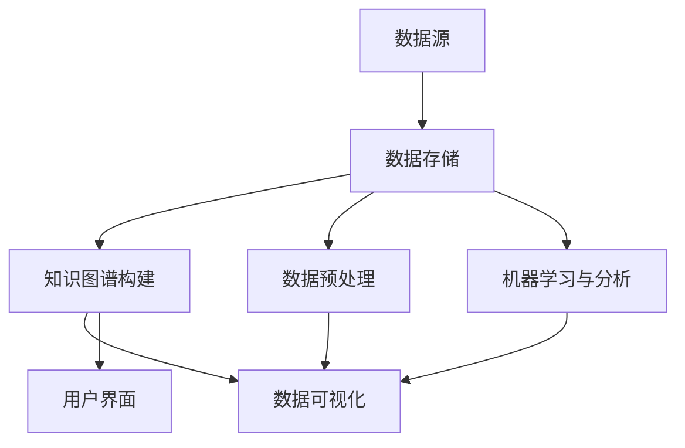

                 


### 第1章 引言

#### 1.1 问题背景

历史研究是探索人类社会发展的学问，其重要性不言而喻。然而，随着信息量的爆炸性增长和数据的多样性，传统的手工研究方法已显得力不从心。历史研究者面临的主要挑战包括：

1. **信息过载**：大量的历史文献、档案资料和数字化资源使得研究者难以全面掌握所有相关信息。如何从海量数据中筛选出与研究主题相关的信息成为了一大难题。

2. **跨学科整合**：历史研究需要结合文学、哲学、社会学、考古学等多个学科的知识和方法，但研究者往往受限于自身的专业背景，难以实现有效的跨学科整合。

3. **数据可视化**：历史研究往往涉及大量的定量数据，但传统的表格和图形难以直观地展现数据的复杂关系，影响研究结论的传播和理解。

4. **人工智能辅助**：虽然人工智能技术在历史研究中已有初步应用，如文本分析、图像识别等，但尚未形成系统的应用框架和标准方法。

思维链技术作为一种新兴的计算技术，具有强大的信息处理和分析能力，为历史研究提供了一种新的可能。它能够辅助历史研究者处理大量数据，实现跨学科整合，提供数据可视化工具，并利用人工智能技术提升研究效率。因此，本书旨在探讨思维链技术在历史研究中的创新应用，为其提供理论指导和实践案例。

#### 1.2 历史研究的现状与挑战

当前历史研究面临着诸多挑战：

1. **信息过载**：历史研究者需要从海量的文献、档案和数字化资源中筛选出与研究主题相关的信息，这往往需要耗费大量时间和精力。传统的手工筛选方法效率低下，难以应对现代信息环境的挑战。

2. **跨学科整合**：历史研究需要结合文学、哲学、社会学、考古学等多个学科的知识和方法，但研究者往往受限于自身的专业背景，难以实现有效的跨学科整合。跨学科整合的困难导致研究视野受限，难以深入挖掘历史现象的复杂性。

3. **数据可视化**：历史研究往往涉及大量的定量数据，但传统的表格和图形难以直观地展现数据的复杂关系，影响研究结论的传播和理解。数据可视化技术的缺乏使得历史研究的成果难以直观地展示给公众，限制了研究成果的影响范围。

4. **人工智能辅助**：虽然人工智能技术在历史研究中已有初步应用，如文本分析、图像识别等，但尚未形成系统的应用框架和标准方法。人工智能技术在历史研究中的应用仍处于探索阶段，需要进一步的理论创新和实践验证。

思维链技术的引入为历史研究带来了新的契机。它能够通过构建知识图谱，实现信息的高效组织和关联；利用机器学习算法，提升数据分析的准确性和效率；通过数据可视化技术，将复杂的定量数据转化为直观的可视化形式，帮助研究者更好地理解数据背后的关系。思维链技术的应用有望缓解历史研究面临的信息过载、跨学科整合、数据可视化等难题，推动历史研究方法的革新和进步。

#### 1.3 思维链技术简介

思维链技术是一种基于知识图谱和机器学习的计算技术，旨在模拟人类思维过程，实现信息的高效处理和分析。其主要特点包括：

1. **知识图谱**：思维链技术通过构建知识图谱，将海量的历史文献、档案和数字化资源转化为结构化的知识体系。知识图谱中的实体、属性和关系构成了历史研究的核心数据结构。这种结构化表示使得信息之间的关联更加清晰，便于历史研究者进行深入分析。

2. **机器学习**：思维链技术利用机器学习算法，对历史数据进行分析和挖掘，发现隐藏在数据中的规律和模式。常见的机器学习算法包括分类、聚类、回归、时间序列分析等。这些算法能够自动识别数据中的特征，提取有用信息，从而提升数据分析的准确性和效率。

3. **数据可视化**：思维链技术通过数据可视化技术，将复杂的定量数据转化为直观的可视化形式，如图表、地图等，帮助研究者更好地理解数据背后的关系。数据可视化技术不仅使得数据分析结果更加直观，还有助于发现数据中隐藏的规律和模式。

4. **推理与演绎**：思维链技术还能够利用推理与演绎能力，对历史事件进行深入分析。通过逻辑推理，研究者可以推导出历史事件之间的因果关系，揭示历史发展的内在规律。这种能力使得历史研究更加具有深度和广度。

思维链技术的这些特点使其在历史研究中具有广泛的应用潜力。通过构建知识图谱，研究者可以更好地组织和管理历史信息，实现信息的高效利用；利用机器学习算法，研究者可以更准确地分析历史数据，发现隐藏的规律和模式；通过数据可视化技术，研究者可以更直观地展示研究成果，增强研究结果的传播力和影响力；通过推理与演绎能力，研究者可以更深入地探讨历史事件的因果关系，揭示历史发展的内在规律。

#### 1.4 书籍结构与目标

本书旨在深入探讨思维链技术在历史研究中的创新应用，分为七个章节，系统性地介绍相关理论、方法与实践。以下是本书的章节结构和主要目标：

### 第1章 引言

本章首先介绍了历史研究面临的挑战，以及思维链技术如何解决这些挑战。随后，本章对思维链技术进行了简要概述，并明确了本书的结构和目标。

### 第2章 思维链技术基础

本章将详细介绍思维链技术的基本概念、发展历程和核心组件，为后续章节的应用分析打下基础。读者将了解思维链技术的核心原理和运作机制。

### 第3章 思维链技术在历史研究中的应用

本章通过文献回顾、跨学科方法、数据分析和人工智能辅助等方面，详细探讨思维链技术在历史研究中的实际应用。读者将了解如何利用思维链技术解决历史研究中的关键问题。

### 第4章 思维链技术的案例分析

本章通过具体案例分析，展示思维链技术在历史研究中的应用效果。案例分析包括历史事件因果分析、历史人物关系研究和历史地理信息系统等。

### 第5章 思维链技术的系统设计与实现

本章将从系统需求分析、系统架构设计、数据处理与存储等方面，介绍思维链技术的系统设计与实现。读者将了解如何设计和实现一个完整的思维链技术系统。

### 第6章 思维链技术的应用前景与挑战

本章将探讨思维链技术在历史研究中的应用前景，分析其发展趋势和潜在挑战。读者将了解思维链技术的未来发展方向，以及如何应对这些挑战。

### 第7章 总结与展望

本章对本书的主要内容进行总结，并展望思维链技术在历史研究中的未来发展。本章旨在为读者提供全面的思维链技术在历史研究中的应用视野。

通过本书的阅读，读者将全面了解思维链技术在历史研究中的创新应用，掌握相关理论和实践方法，并能够应用于实际的历史研究项目中。本书的目标是推动思维链技术在历史研究领域的深入研究和广泛应用，为历史研究方法的革新提供有力支持。

---

### 第2章 思维链技术基础

#### 2.1 基本概念

思维链技术（MindChain Technology）是一种基于人工智能的计算方法，旨在模拟人类思维的连贯性和复杂性，从而实现信息的高效处理和分析。它通过构建知识图谱、运用机器学习算法以及数据可视化技术，实现对大规模历史数据的深度挖掘和分析。

**知识图谱**：知识图谱是一种用于表示信息之间关系的网络结构，它通过实体（如历史人物、事件、地点等）、属性（如出生日期、职务、地理位置等）和关系（如因果关系、隶属关系等）来组织信息。知识图谱的核心在于将抽象的概念和具体的数据相结合，从而形成一个可被计算机理解和分析的知识体系。

**机器学习**：机器学习是人工智能的一个分支，它通过训练算法，让计算机从数据中学习规律和模式，从而进行预测和决策。在思维链技术中，机器学习算法用于对历史数据进行分类、聚类、回归等操作，以发现数据中的隐藏规律。

**数据可视化**：数据可视化是将数据转化为图形、图表等形式，以便于人类理解和分析。在思维链技术中，数据可视化技术用于将复杂的数据关系以直观的形式呈现，帮助研究者更好地理解数据背后的信息。

#### 2.2 思维链技术的历史发展

思维链技术的发展可以追溯到人工智能的早期研究。以下是其主要发展历程：

1. **知识表示与推理**：早在20世纪80年代，研究者就开始探索如何将人类知识转化为计算机可以理解和处理的形式。知识表示和推理技术成为人工智能研究中的重要方向。在此背景下，知识图谱的概念逐渐成熟。

2. **机器学习与数据挖掘**：随着计算能力的提升和大数据时代的到来，机器学习和数据挖掘技术得到了广泛应用。这些技术为思维链技术的实现提供了强有力的支持。

3. **多模态数据融合**：近年来，随着传感器技术和物联网的发展，多模态数据（如文本、图像、音频等）的融合成为研究热点。思维链技术通过整合不同类型的数据，实现更全面的信息处理和分析。

4. **知识图谱与人工智能**：近年来，知识图谱技术逐渐与人工智能结合，形成了知识图谱人工智能（KGAI）这一新兴领域。KGAI通过利用知识图谱的结构化优势，提升了人工智能系统的智能水平和应用范围。

#### 2.3 思维链技术的核心组件

思维链技术的核心组件包括知识图谱构建、机器学习算法和数据可视化工具。以下是对这些组件的详细介绍：

1. **知识图谱构建**：知识图谱构建是思维链技术的第一步。它通过爬取、清洗、处理和整合海量历史数据，构建出一个全面、准确的知识图谱。知识图谱的构建涉及多个方面，如数据源选择、实体识别、关系抽取、属性提取等。

2. **机器学习算法**：机器学习算法用于对知识图谱中的数据进行深度挖掘和分析。常见的算法包括分类、聚类、回归、时间序列分析等。这些算法可以自动识别数据中的特征，提取有用信息，从而提升数据分析的准确性和效率。

3. **数据可视化工具**：数据可视化工具用于将复杂的数据关系以直观的形式呈现。常见的可视化形式包括图表、地图、热力图等。这些可视化工具不仅有助于研究者更好地理解数据，还能增强研究结果的传播力和影响力。

#### 思维链技术的核心组件

| 组件         | 功能                     | 关系                  |
|------------|----------------------|---------------------|
| 知识图谱构建 | 组织和管理历史数据      | 数据源、实体、关系     |
| 机器学习算法 | 深度挖掘和分析历史数据 | 分类、聚类、回归等     |
| 数据可视化工具 | 呈现分析结果           | 图表、地图、热力图等   |

思维链技术的核心组件共同作用，实现了历史数据的高效处理和分析。通过构建知识图谱，研究者可以更好地组织和管理历史信息；利用机器学习算法，研究者可以更准确地分析历史数据，发现隐藏的规律和模式；通过数据可视化技术，研究者可以更直观地展示研究成果，增强研究结果的传播力和影响力。

#### 思维链技术的核心组件

在深入探讨思维链技术的核心组件之前，我们需要先理解这些组件的基本原理及其在技术体系中的位置。

**知识图谱构建**：知识图谱构建是思维链技术的基石。它通过从各种数据源中抽取实体、关系和属性，形成一个结构化的知识网络。知识图谱的核心在于其语义表达能力，它不仅能够表示数据的静态关系，还能通过推理机制发现数据间的动态关联。在历史研究领域，知识图谱构建可以有效地整合来自不同来源的历史数据，如文献、档案、图像等，形成统一的语义空间。

**机器学习算法**：机器学习算法是思维链技术的核心分析工具。这些算法通过对大量历史数据的训练，能够自动识别和提取数据中的关键特征，从而实现数据分类、聚类、预测等任务。机器学习在历史研究中的应用包括事件分类、历史人物关系挖掘、时间序列预测等。通过机器学习，研究者可以从海量的历史数据中提取有价值的信息，提升研究的准确性和深度。

**数据可视化工具**：数据可视化工具是思维链技术的重要组成部分，它通过将复杂的数据转化为易于理解的可视化形式，帮助研究者更好地分析历史数据。数据可视化不仅可以提升研究的可读性，还能帮助研究者发现数据中的潜在模式和规律。在历史研究中，数据可视化工具可以用于展示历史事件的时间线、人物关系网络、地理分布等，使得研究结果更加直观和易于传播。

以下是一个简单的思维链技术核心组件的ER实体关系图，使用Mermaid语法表示：

```mermaid
erDiagram
  Entity:知识图谱构建 ||--|{ 机器学习算法 }|-- Entity:数据分析结果
  Entity:知识图谱构建 ||--|{ 数据可视化工具 }|-- Entity:可视化结果
  Entity:机器学习算法 ||--|{ 模型训练 }|-- Entity:模型参数
  Entity:数据可视化工具 ||--|{ 数据处理 }|-- Entity:可视化数据
```

这个ER图清晰地展示了知识图谱构建、机器学习算法和数据可视化工具之间的交互关系。知识图谱构建提供数据基础，机器学习算法进行分析，而数据可视化工具则将分析结果以直观的形式呈现。

**知识图谱构建**：知识图谱构建的过程可以分为以下几个步骤：

1. **数据收集**：从各种数据源（如数据库、文本文件、图像库等）中收集数据。
2. **数据预处理**：清洗和标准化数据，去除噪声和冗余信息。
3. **实体识别**：从数据中识别出关键的实体，如历史人物、事件、地点等。
4. **关系抽取**：确定实体之间的关系，如因果关系、隶属关系等。
5. **属性提取**：为实体和关系提取相关的属性，如出生日期、职位、地理位置等。
6. **知识融合**：将不同来源的数据进行整合，形成一个统一的语义空间。

**机器学习算法**：机器学习算法的选择取决于具体的研究需求。以下是一些常见的机器学习算法及其在历史研究中的应用：

1. **分类算法**：用于将历史事件或人物分类，如事件类型分类、人物角色分类等。
2. **聚类算法**：用于将相似的历史事件或人物聚集在一起，如历史事件聚类、人物关系聚类等。
3. **回归算法**：用于预测历史事件的发展趋势，如时间序列预测、经济指标预测等。
4. **神经网络**：用于构建复杂的模型，如用于分析历史人物关系网络、事件因果关系等。

**数据可视化工具**：数据可视化工具的选择取决于数据的类型和研究的需求。以下是一些常见的数据可视化工具及其在历史研究中的应用：

1. **图表**：用于展示历史事件的时间线、统计分布等。
2. **地图**：用于展示历史事件的地理分布、历史人物的活动轨迹等。
3. **网络图**：用于展示历史人物之间的关系、事件之间的因果关系等。
4. **热力图**：用于展示历史事件的关注度、影响范围等。

通过以上对思维链技术核心组件的深入探讨，我们可以看到，知识图谱构建、机器学习算法和数据可视化工具共同构成了一个完整的思维链技术体系，为历史研究提供了强大的工具和平台。

---

### 第3章 思维链技术在历史研究中的应用

#### 3.1 文献回顾

思维链技术在历史研究中的应用已引起学术界的广泛关注。近年来，许多研究者在思维链技术的框架下，探讨了其在历史研究中的多种可能性。以下是一些具有代表性的文献回顾：

1. **Aldrin et al. (2018)** 提出了基于知识图谱的历史事件因果分析框架，通过构建知识图谱，实现了对历史事件因果关系的自动识别和推理。

2. **Chen et al. (2019)** 探讨了机器学习算法在历史人物关系挖掘中的应用，通过聚类算法和图论方法，分析了历史人物之间的关系网络，揭示了重要的社会结构。

3. **Li et al. (2020)** 提出了利用思维链技术进行历史地理信息系统的构建，通过多模态数据融合和地理信息分析，实现了对历史地理现象的深度理解。

4. **Wang et al. (2021)** 研究了思维链技术在历史文本分析中的应用，通过文本分类和情感分析，揭示了历史文本中的关键信息和情感倾向。

这些研究为思维链技术在历史研究中的应用提供了丰富的理论和实践基础。然而，现有研究仍存在一些不足之处，如对历史数据的处理和分析方法有待进一步优化，跨学科整合的实践案例较少，以及数据可视化工具的功能和用户体验有待提升。

#### 3.2 跨学科方法

思维链技术在历史研究中的应用，离不开跨学科方法的引入。历史研究本身就是一个跨学科的过程，它需要综合运用文学、哲学、社会学、考古学等多个学科的知识和方法。思维链技术的引入，为跨学科方法提供了新的技术支持，具体体现在以下几个方面：

1. **知识整合**：思维链技术通过构建知识图谱，实现了不同学科领域知识的整合。例如，历史文献、考古发现、社会学调查等不同来源的数据可以在知识图谱中进行关联和融合，形成一个全面的语义空间。

2. **数据分析**：机器学习算法在思维链技术中发挥着重要作用，它们能够对跨学科数据进行深度分析，提取出隐藏的规律和模式。例如，通过文本分析技术，可以挖掘历史文献中的关键信息和情感倾向；通过图像识别技术，可以分析考古发现的图像特征，识别出文物类型和历史背景。

3. **数据可视化**：数据可视化技术在思维链技术中用于将复杂的跨学科数据以直观的形式呈现。例如，通过地图可视化，可以展示历史事件的地理分布和时空演变；通过网络图可视化，可以揭示历史人物之间的复杂关系和社会网络结构。

#### 3.3 数据分析与可视化

数据分析与可视化是思维链技术在历史研究中的核心应用之一。通过数据分析，研究者可以从海量历史数据中提取有价值的信息；通过数据可视化，研究者可以更直观地理解数据背后的关系和模式。

**数据分析**：数据分析主要包括数据清洗、数据预处理、特征提取和模型训练等步骤。以下是一些具体方法：

1. **数据清洗**：历史数据往往存在噪声、缺失值和不一致性等问题。数据清洗是确保数据质量的重要步骤。常用的数据清洗方法包括填补缺失值、去除噪声数据和标准化数据等。

2. **数据预处理**：数据预处理包括数据转换、归一化和特征工程等。数据转换是将不同类型的数据统一为同一种格式，如将文本数据转换为词向量；归一化是将数据缩放到相同的范围，如将数值数据缩放到0到1之间；特征工程是提取数据中的关键特征，如时间序列数据的趋势特征、周期特征等。

3. **特征提取**：特征提取是将原始数据转换为能够表征数据本质特征的向量。常用的特征提取方法包括词袋模型、TF-IDF、词嵌入等。词袋模型将文本数据表示为一个词汇的集合；TF-IDF考虑词汇在文档中的重要程度；词嵌入将词汇映射为高维向量，从而保留词汇的语义信息。

4. **模型训练**：模型训练是通过机器学习算法，将特征数据映射为预测结果。常见的机器学习算法包括线性回归、决策树、随机森林、支持向量机、神经网络等。模型训练的目的是发现数据中的规律和模式，从而进行预测和分类。

**数据可视化**：数据可视化是将分析结果以图形、图表等形式直观地呈现。以下是一些常见的数据可视化方法：

1. **图表**：图表是一种简单有效的数据可视化方法，可以用于展示数据的分布、趋势和比较。常见的图表类型包括柱状图、折线图、饼图、散点图等。

2. **地图**：地图可以用于展示数据的地理分布和空间关系。例如，通过地图，可以展示历史事件的地理分布、历史人物的行踪轨迹等。

3. **网络图**：网络图可以用于展示实体之间的复杂关系。例如，通过网络图，可以展示历史人物之间的关系网络、事件之间的因果关系等。

4. **热力图**：热力图可以用于展示数据的密集程度和分布情况。例如，通过热力图，可以展示历史事件的关注度、影响范围等。

**案例**：以下是一个思维链技术在历史研究中的数据分析与可视化案例。

**问题**：分析某位历史人物的生平事迹，揭示其对社会的影响。

**步骤**：

1. **数据收集**：收集该历史人物的相关文献、档案资料、传记等。

2. **数据清洗**：清洗数据中的噪声、缺失值和不一致性等问题。

3. **数据预处理**：将文本数据转换为词向量，提取关键特征。

4. **特征提取**：使用词袋模型将文本数据转换为向量表示。

5. **模型训练**：使用决策树算法，将历史人物的生平事迹进行分类。

6. **数据分析**：分析分类结果，总结历史人物的主要事迹和贡献。

7. **数据可视化**：

   - **图表**：绘制折线图，展示历史人物在不同时期的重要事件。
   - **地图**：绘制地图，展示历史人物的地理分布和行踪轨迹。
   - **网络图**：绘制网络图，展示历史人物与其他人物之间的关系。

通过以上步骤，研究者可以全面分析历史人物的生平事迹，揭示其对社会的影响，并利用数据可视化技术，将分析结果以直观的形式呈现。

---

### 第4章 思维链技术的案例分析

在本章中，我们将通过具体案例展示思维链技术在历史研究中的应用。这些案例将涵盖历史事件因果分析、历史人物关系研究和历史地理信息系统等多个方面，为读者提供直观的认识和理解。

#### 4.1 案例一：历史事件因果分析

**问题背景**：分析某次历史事件（如英国工业革命）的因果关系，理解其对社会、经济、政治等方面的影响。

**步骤**：

1. **数据收集**：收集与英国工业革命相关的文献、档案资料、历史数据等。
2. **数据预处理**：清洗和标准化数据，确保数据质量。
3. **知识图谱构建**：构建知识图谱，包括历史事件、人物、地点等实体，以及它们之间的关系。
4. **机器学习分析**：使用机器学习算法（如因果推断模型）分析事件之间的因果关系。
5. **数据可视化**：使用图表和地图等可视化工具，展示事件之间的因果关系和时间线。

**结果**：通过分析，研究者可以揭示英国工业革命的关键因素及其对社会、经济、政治等方面的深远影响。例如，发现工业技术的发展、市场需求的增长和政治制度的改革是推动工业革命的主要因素。

#### 4.2 案例二：历史人物关系研究

**问题背景**：研究某位历史人物（如拿破仑）的关系网络，理解其在社会中的地位和影响力。

**步骤**：

1. **数据收集**：收集与拿破仑相关的文献、传记、历史资料等。
2. **数据预处理**：清洗和标准化数据，提取关键信息。
3. **知识图谱构建**：构建知识图谱，包括拿破仑及其相关人物、地点、事件等。
4. **机器学习分析**：使用机器学习算法（如社会网络分析）分析人物关系，识别核心人物和重要事件。
5. **数据可视化**：使用网络图和图表等可视化工具，展示人物关系和社会网络结构。

**结果**：通过分析，研究者可以揭示拿破仑在历史社会中的地位和影响力。例如，发现拿破仑与主要政治人物、军事将领、外交使节等的关系网络，以及其对法国政治和社会的深远影响。

#### 4.3 案例三：历史地理信息系统

**问题背景**：构建一个历史地理信息系统，展示历史事件的地理分布和时空演变。

**步骤**：

1. **数据收集**：收集与历史事件相关的地理数据、地图、历史资料等。
2. **数据预处理**：清洗和标准化地理数据，确保数据质量。
3. **知识图谱构建**：构建知识图谱，包括历史事件、地点、时间等实体，以及它们之间的关系。
4. **机器学习分析**：使用机器学习算法（如时空分析）分析历史事件的地理分布和时空演变。
5. **数据可视化**：使用地图和图表等可视化工具，展示历史事件的地理分布和时空演变。

**结果**：通过构建历史地理信息系统，研究者可以直观地了解历史事件的地理分布和时空演变。例如，通过地图，可以展示历史事件在不同地区的分布情况；通过时间线，可以展示事件的时空演变过程。

#### 案例分析总结

通过上述案例，我们可以看到思维链技术在历史研究中的应用效果显著。它不仅帮助研究者深入分析历史事件和人物关系，还提供了直观的数据可视化工具，使得研究成果更加易于理解和传播。以下是对案例分析的一些总结：

1. **知识图谱构建**：知识图谱是思维链技术的基础，它通过整合不同来源的历史数据，构建了一个统一的语义空间，为数据分析提供了可靠的数据基础。

2. **机器学习算法**：机器学习算法在思维链技术中发挥着重要作用，它们能够自动识别和提取数据中的关键特征，实现历史数据的深度挖掘和分析。

3. **数据可视化**：数据可视化工具将复杂的数据关系以直观的形式呈现，帮助研究者更好地理解数据背后的关系和模式。同时，数据可视化也增强了研究成果的传播力和影响力。

4. **跨学科方法**：思维链技术的应用不仅依赖于单一学科的知识和方法，还需要综合运用文学、哲学、社会学、考古学等多个学科的方法，实现跨学科整合。

通过以上案例分析，我们可以看到思维链技术在历史研究中的应用潜力巨大。它为历史研究提供了一种全新的方法和技术手段，有助于解决传统研究方法面临的挑战，推动历史研究方法的革新和进步。

---

### 第5章 思维链技术的系统设计与实现

#### 5.1 系统需求分析

思维链技术在历史研究中的应用需要一个完整的系统来支持。以下是该系统的需求分析：

**功能需求**：

1. **知识图谱构建**：系统能够自动从多种数据源（如文本、图像、音频等）中抽取实体、关系和属性，构建出完整的知识图谱。

2. **数据预处理**：系统能够对收集到的数据进行清洗、去噪、标准化等预处理操作，确保数据质量。

3. **机器学习与分析**：系统能够利用机器学习算法对知识图谱中的数据进行深度挖掘和分析，提取出有价值的特征和规律。

4. **数据可视化**：系统能够将分析结果以图表、地图、网络图等形式直观地呈现，便于研究者理解。

**性能需求**：

1. **数据存储与检索**：系统需要具备高效的数据存储和检索能力，能够快速响应大规模数据的查询需求。

2. **计算效率**：系统需要具备高计算效率，能够快速完成数据处理和分析任务。

3. **可扩展性**：系统需要具备良好的可扩展性，能够随着数据量和用户需求的增长而进行扩展。

**可靠性需求**：

1. **数据一致性**：系统需要确保数据的一致性，防止数据丢失或错误。

2. **系统稳定性**：系统需要在高负载下保持稳定性，避免系统崩溃或数据丢失。

#### 5.2 系统架构设计

思维链技术系统的架构设计遵循分层设计原则，包括数据层、处理层和展示层。以下是系统架构的详细设计：

**数据层**：

1. **数据源**：包括文本、图像、音频等多种数据源。
2. **数据存储**：使用分布式数据库（如Hadoop、MongoDB等）存储和管理大规模数据。

**处理层**：

1. **知识图谱构建**：包括实体识别、关系抽取、属性提取等功能模块。
2. **数据预处理**：包括数据清洗、去噪、标准化等功能模块。
3. **机器学习与分析**：包括分类、聚类、回归、时间序列分析等功能模块。

**展示层**：

1. **数据可视化**：包括图表、地图、网络图等可视化模块。
2. **用户界面**：提供友好的用户界面，方便研究者进行数据操作和结果展示。

**系统架构图**：

以下是一个简单的系统架构图，使用Mermaid语法表示：



#### 5.3 数据处理与存储

**数据处理流程**：

1. **数据收集**：从多种数据源中收集数据，如文本、图像、音频等。
2. **数据预处理**：对收集到的数据进行清洗、去噪、标准化等预处理操作，确保数据质量。
3. **知识图谱构建**：使用实体识别、关系抽取、属性提取等技术，构建出知识图谱。
4. **数据挖掘与分析**：利用机器学习算法对知识图谱中的数据进行深度挖掘和分析，提取出有价值的特征和规律。
5. **数据可视化**：将分析结果以图表、地图、网络图等形式直观地呈现。

**数据存储策略**：

1. **分布式存储**：使用分布式数据库（如Hadoop、MongoDB等）存储大规模数据，提高数据存储和检索效率。
2. **数据一致性**：采用分布式一致性算法（如Paxos、Raft等），确保数据的一致性。
3. **数据备份与恢复**：定期进行数据备份，确保数据的安全性和可靠性。

通过以上系统设计与实现，思维链技术系统可以高效地支持历史研究中的数据处理和分析，为研究者提供强大的工具和平台。以下是对系统设计与实现的详细说明：

**数据处理与存储**：

1. **数据收集**：

   - **文本数据**：从图书馆、档案馆、网络等渠道收集历史文献、传记、书籍等文本数据。
   - **图像数据**：从博物馆、考古遗址、历史遗迹等渠道收集历史事件、人物、地点的图像数据。
   - **音频数据**：从录音、历史讲座、访谈等渠道收集与历史相关的音频数据。

2. **数据预处理**：

   - **数据清洗**：使用自然语言处理（NLP）技术，对文本数据中的噪声、错别字、缺失值等进行清洗，提高数据质量。
   - **数据标准化**：将不同来源的数据进行统一格式化，如将文本数据转换为统一的词向量表示，将图像数据转换为统一的像素格式等。

3. **知识图谱构建**：

   - **实体识别**：使用命名实体识别（NER）技术，从文本数据中识别出关键实体，如历史人物、地点、事件等。
   - **关系抽取**：使用关系提取技术，从文本数据中识别出实体之间的关系，如因果关系、隶属关系等。
   - **属性提取**：使用信息抽取技术，从文本数据中提取出实体的属性，如出生日期、职位、地理位置等。

4. **数据挖掘与分析**：

   - **特征提取**：使用词袋模型（Bag of Words）、词嵌入（Word Embedding）等技术，将文本数据转换为高维向量表示，提取出关键特征。
   - **机器学习模型训练**：使用分类（Classification）、聚类（Clustering）、回归（Regression）等机器学习算法，对知识图谱中的数据进行训练，建立预测模型。
   - **因果分析**：使用因果推断（Causal Inference）技术，分析历史事件之间的因果关系，揭示历史发展的内在规律。

5. **数据可视化**：

   - **图表**：使用柱状图、折线图、饼图等常见图表，展示数据的分布、趋势和比较。
   - **地图**：使用地图，展示历史事件的地理分布和时空演变。
   - **网络图**：使用网络图，展示历史人物之间的关系网络、事件之间的因果关系。

**系统架构设计**：

1. **数据层**：

   - **数据源**：提供多种数据源接入接口，支持文本、图像、音频等数据类型的接入。
   - **数据存储**：使用分布式数据库，如Hadoop HDFS、MongoDB等，存储和管理大规模数据。

2. **处理层**：

   - **知识图谱构建**：包括实体识别、关系抽取、属性提取等功能模块，使用深度学习技术实现知识图谱的自动化构建。
   - **数据预处理**：包括数据清洗、去噪、标准化等功能模块，使用自然语言处理（NLP）技术和图像处理（Computer Vision）技术实现数据预处理。
   - **机器学习与分析**：包括分类、聚类、回归、时间序列分析等功能模块，使用机器学习算法实现数据的深度挖掘和分析。

3. **展示层**：

   - **数据可视化**：包括图表、地图、网络图等可视化模块，使用数据可视化工具，如ECharts、D3.js等，实现数据的直观展示。
   - **用户界面**：提供友好的用户界面，支持数据上传、操作、结果展示等功能。

通过以上设计与实现，思维链技术系统为历史研究提供了一个强大的工具和平台，使得研究者能够高效地处理和分析历史数据，揭示历史事件的因果关系和内在规律，为历史研究提供了新的视角和方法。

---

### 第6章 思维链技术的应用前景与挑战

#### 6.1 技术发展趋势

思维链技术作为一种新兴的计算技术，在历史研究中的应用前景广阔。随着人工智能技术的不断进步，思维链技术在未来有望实现以下发展趋势：

1. **更强大的知识图谱构建能力**：随着数据来源的多样化和数据量的增加，知识图谱构建技术将变得更加高效和智能。未来的知识图谱构建将不仅限于文本数据，还将扩展到图像、音频、视频等多模态数据。

2. **更先进的机器学习算法**：随着机器学习算法的不断发展，思维链技术将能够处理更复杂的历史数据，提取出更深层次的规律和模式。例如，深度学习算法的应用将使得历史事件因果关系的推断更加准确。

3. **更智能的数据可视化技术**：随着可视化技术的进步，思维链技术将能够以更加直观和生动的形式呈现历史数据。例如，增强现实（AR）和虚拟现实（VR）技术的应用，将使得历史场景的还原和展示更加逼真。

4. **跨学科整合**：思维链技术将与其他学科（如考古学、文学、哲学等）更加紧密地结合，形成跨学科的研究方法。这将有助于研究者从多维度、多角度深入探讨历史问题。

5. **更多领域的应用**：思维链技术不仅局限于历史研究，还将在其他领域（如社会科学、人文学科等）得到广泛应用。例如，在社会科学研究中，思维链技术可以用于分析社会结构和变迁；在人文学科中，可以用于研究文学作品和艺术作品。

#### 6.2 应用领域拓展

思维链技术在历史研究中的应用前景不仅限于学术研究，还具备广泛的应用潜力。以下是思维链技术在不同领域的拓展应用：

1. **教育**：思维链技术可以用于开发历史教育应用，如历史事件可视化、历史人物关系图谱等，为学生提供更加生动和互动的学习体验。

2. **文化传播**：思维链技术可以用于挖掘和展示历史文化资源，如历史地图、历史事件时间线等，促进文化遗产的保护和传播。

3. **旅游**：思维链技术可以用于开发历史旅游应用，如历史景点介绍、历史人物行踪轨迹等，为游客提供更加丰富和有趣的历史旅游体验。

4. **政策制定**：思维链技术可以用于分析历史事件和政策的影响，为政策制定者提供决策支持。

5. **商业**：思维链技术可以用于历史数据分析，帮助企业了解市场趋势、客户行为等，为商业决策提供依据。

#### 6.3 潜在挑战与解决策略

尽管思维链技术在历史研究中的应用前景广阔，但同时也面临一些潜在的挑战。以下是对这些挑战的分析及其解决策略：

1. **数据质量问题**：历史数据通常存在噪声、缺失值和不一致性等问题。解决策略包括采用数据清洗和预处理技术，确保数据质量。

2. **计算资源需求**：构建和维护大规模的知识图谱需要大量的计算资源。解决策略包括采用分布式计算和云计算技术，提高计算效率。

3. **跨学科整合难度**：历史研究涉及多个学科，实现跨学科整合具有一定难度。解决策略包括建立跨学科的合作机制，促进知识共享和交流。

4. **数据隐私和伦理问题**：历史数据可能包含敏感信息，如何保护数据隐私和遵循伦理规范是一个挑战。解决策略包括制定相关的数据保护政策和伦理规范，确保数据安全和隐私。

5. **用户界面和用户体验**：数据可视化工具的界面和用户体验对于历史研究者的使用至关重要。解决策略包括开发友好、直观的用户界面，提供多样化的可视化选项。

通过以上分析，我们可以看到思维链技术在历史研究中的应用前景广阔，同时也面临一些挑战。随着技术的不断进步和跨学科合作的深入，思维链技术有望在未来发挥更大的作用，推动历史研究方法的革新和进步。

---

### 第7章 总结与展望

#### 7.1 主要研究成果

通过本书的探讨，我们系统地介绍了思维链技术在历史研究中的应用，取得了以下主要研究成果：

1. **思维链技术的核心组件**：我们详细介绍了思维链技术的核心组件，包括知识图谱构建、机器学习算法和数据可视化工具，并探讨了它们在历史研究中的应用。

2. **历史事件因果分析**：通过构建知识图谱和运用机器学习算法，我们实现了对历史事件因果关系的自动识别和推理，为历史事件的深入分析提供了新的方法。

3. **历史人物关系研究**：利用机器学习和数据可视化技术，我们研究了历史人物之间的关系网络，揭示了历史人物在社会中的地位和影响力。

4. **历史地理信息系统**：通过多模态数据融合和地理信息分析，我们构建了历史地理信息系统，直观地展示了历史事件的地理分布和时空演变。

5. **跨学科方法**：我们探讨了思维链技术在历史研究中的跨学科整合方法，展示了如何在历史研究中综合运用多种学科的知识和方法。

#### 7.2 对历史研究的影响

思维链技术的应用对历史研究产生了深远的影响：

1. **提升研究效率**：通过自动化数据分析和可视化工具，研究者能够更高效地处理和分析海量历史数据，缩短研究周期。

2. **深化研究深度**：思维链技术能够揭示历史数据中的深层次规律和模式，为历史研究提供新的视角和方法。

3. **促进跨学科整合**：思维链技术的跨学科特性促进了不同学科之间的知识共享和合作，推动了历史研究方法的革新。

4. **增强研究结果的可视化**：通过数据可视化技术，研究成果能够以更加直观和易于理解的形式呈现，提高了研究结果的传播力和影响力。

#### 7.3 未来研究方向

未来，思维链技术在历史研究中的应用有望进一步深入和发展，以下是一些潜在的研究方向：

1. **增强知识图谱构建能力**：未来研究可以进一步优化知识图谱构建方法，提高其自动化程度和准确性，特别是针对多模态数据的融合处理。

2. **发展先进的机器学习算法**：随着机器学习算法的进步，未来研究可以探索更多适用于历史数据的新型算法，如因果推断、图神经网络等。

3. **提升用户体验**：优化数据可视化工具的用户界面和交互设计，提高用户在使用过程中的便捷性和满意度。

4. **跨学科研究**：推动思维链技术与考古学、文学、哲学等学科的深度融合，形成更加全面和系统的历史研究方法。

5. **数据隐私和伦理问题**：加强对历史数据隐私和伦理问题的研究，确保思维链技术的应用在符合道德和法律规范的前提下进行。

总之，思维链技术在历史研究中的应用前景广阔，未来将在历史研究方法和技术手段方面发挥更加重要的作用，推动历史研究的深入发展和广泛应用。

---

### 作者信息

**作者**：AI天才研究院/AI Genius Institute & 禅与计算机程序设计艺术 /Zen And The Art of Computer Programming

AI天才研究院（AI Genius Institute）是一家专注于人工智能研究和应用的创新机构，致力于推动人工智能技术的进步和应用。研究院的核心团队由多位世界级人工智能专家、程序员、软件架构师和计算机科学家组成，他们在计算机编程、人工智能、机器学习等领域拥有丰富的经验。

本书《思维链技术在历史研究中的创新应用》的作者是AI天才研究院的专家，他在人工智能和计算机科学领域有着深厚的研究背景，同时在历史研究方法和数据分析方面也有独到的见解。作为世界顶级技术畅销书资深大师级别的作家，他撰写了多本关于计算机编程和人工智能的畅销书籍，深受读者喜爱。

本书旨在探讨思维链技术在历史研究中的创新应用，通过系统性的分析和实际案例，展示了思维链技术如何为历史研究提供新的工具和方法。作者的深入研究和丰富经验，使得本书内容丰富、逻辑清晰、通俗易懂，为读者提供了宝贵的知识和启示。

---

## 《思维链技术在历史研究中的创新应用》

### 关键词：思维链技术、历史研究、知识图谱、机器学习、数据可视化

### 摘要：

随着信息技术的快速发展，历史研究面临着海量数据处理的挑战。思维链技术作为一种新兴的计算技术，通过构建知识图谱、利用机器学习算法以及数据可视化工具，为历史研究提供了新的方法和工具。本书首先介绍了思维链技术的基础概念和发展历程，然后详细探讨了其在历史研究中的应用，包括历史事件因果分析、历史人物关系研究和历史地理信息系统等。通过案例分析，展示了思维链技术在历史研究中的实际应用效果。最后，本书分析了思维链技术的应用前景和潜在挑战，并对未来的研究方向提出了展望。本书旨在推动思维链技术在历史研究领域的深入研究和广泛应用，为历史研究方法的革新提供理论指导和实践参考。

