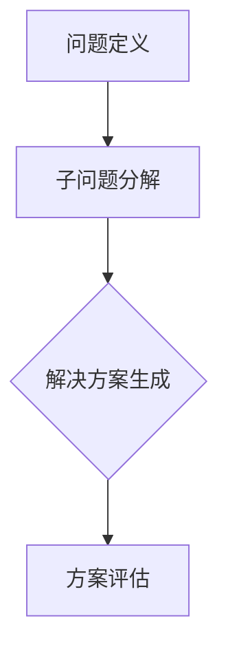

                 

### 第一部分：背景介绍

## 1. 问题背景

思维链技术起源于人工智能领域，是一种用于复杂问题解决的高级算法。随着人工智能技术的不断进步，思维链技术在复杂问题解决中的应用越来越受到关注。本书旨在探讨思维链技术在复杂问题解决中的应用，帮助读者理解和掌握这一技术。

### 2. 问题描述

复杂问题通常具有多种变量和因素，需要从多个角度进行考虑和解决。思维链技术通过模拟人类思维过程，将复杂问题分解为多个子问题，并提供解决方案。

### 3. 问题解决

思维链技术通过以下步骤解决复杂问题：

- **分析问题**：将复杂问题分解为多个子问题。
- **制定解决方案**：针对每个子问题制定解决方案。
- **实施方案**：将解决方案应用于实际场景。
- **评估结果**：对解决方案的效果进行评估和优化。

### 4. 边界与外延

思维链技术的应用范围广泛，包括但不限于以下领域：

- **数据分析**：用于处理大量数据，提取有用信息。
- **人工智能**：作为人工智能的底层算法，用于解决复杂问题。
- **企业管理**：用于优化企业决策过程，提高效率。

### 5. 概念结构与核心要素组成

思维链技术的核心概念包括：

- **思维链**：连接各个子问题的逻辑关系。
- **模式识别**：识别问题中的相似性模式。
- **解决方案**：针对子问题制定的解决方案。

---

## 第二部分：核心概念与联系

### 1. 思维链技术原理

思维链技术基于人类思维的原理，通过模拟人类思考过程来解决问题。它包括以下几个核心步骤：

- **问题定义**：明确问题的目标。
- **子问题分解**：将复杂问题分解为多个子问题。
- **解决方案生成**：针对每个子问题生成解决方案。
- **方案评估**：评估解决方案的有效性。

### 2. 思维链技术的属性特征对比表格

| 特征 | 思维链技术 | 传统方法 |
| --- | --- | --- |
| 可扩展性 | 强 | 弱 |
| 适应性 | 高 | 低 |
| 复杂性处理 | 强 | 弱 |
| 计算效率 | 高 | 低 |

### 3. 思维链技术与传统方法的区别

思维链技术与传统方法在以下几个方面有显著区别：

- **解决复杂问题的能力**：思维链技术更强。
- **适应性问题**：思维链技术更具有适应性。
- **计算效率**：思维链技术更高。

---

## 第三部分：算法原理讲解

### 1. 算法原理与Mermaid流程图

算法原理：

思维链技术主要包括以下几个步骤：

1. 问题定义。
2. 子问题分解。
3. 解决方案生成。
4. 方案评估。

Mermaid流程图：



### 2. Python源代码与算法原理

Python源代码：

```python
# 问题定义
problem = "解决复杂问题"

# 子问题分解
subproblems = ["子问题1", "子问题2", "子问题3"]

# 解决方案生成
solutions = []

for subproblem in subproblems:
    solution = "针对" + subproblem + "的解决方案"
    solutions.append(solution)

# 方案评估
for solution in solutions:
    print(solution)
```

算法原理：

该算法通过问题定义、子问题分解、解决方案生成和方案评估四个步骤来解决复杂问题。首先，明确问题的目标，然后将问题分解为多个子问题，针对每个子问题生成解决方案，最后对解决方案进行评估。

---

## 第四部分：系统分析与架构设计方案

### 1. 问题场景介绍

本节将介绍思维链技术在复杂问题解决中的应用场景，包括项目介绍、系统功能设计、系统架构设计、系统接口设计和系统交互。

### 2. 系统功能设计

系统功能设计包括以下几个方面：

- **问题定义模块**：用于定义复杂问题的目标。
- **子问题分解模块**：用于将复杂问题分解为多个子问题。
- **解决方案生成模块**：用于生成针对每个子问题的解决方案。
- **方案评估模块**：用于评估解决方案的有效性。

### 3. 系统架构设计

系统架构设计采用分层架构，包括以下几个层次：

- **表示层**：用于展示问题的定义、子问题分解、解决方案生成和方案评估。
- **业务逻辑层**：用于处理问题的定义、子问题分解、解决方案生成和方案评估。
- **数据访问层**：用于处理数据存储和读取。

### 4. 系统接口设计

系统接口设计包括以下几个方面：

- **用户接口**：用于与用户进行交互。
- **API接口**：用于与其他系统或模块进行数据交换。
- **消息队列接口**：用于处理实时数据传输。

### 5. 系统交互

系统交互采用事件驱动架构，主要包括以下几个方面：

- **事件发布**：用于触发系统响应。
- **事件订阅**：用于接收系统事件通知。
- **事件处理**：用于处理系统事件并生成解决方案。

---

## 第五部分：项目实战

### 1. 环境安装

在本节中，我们将介绍如何安装和配置思维链技术所需的环境。具体步骤如下：

- 安装Python环境。
- 安装依赖库，如NumPy、Pandas、Scikit-learn等。

### 2. 系统核心实现源代码

在本节中，我们将介绍思维链技术的核心实现，包括以下几个部分：

- **问题定义模块**：用于定义复杂问题的目标。
- **子问题分解模块**：用于将复杂问题分解为多个子问题。
- **解决方案生成模块**：用于生成针对每个子问题的解决方案。
- **方案评估模块**：用于评估解决方案的有效性。

### 3. 代码应用解读与分析

在本节中，我们将对系统核心实现源代码进行解读和分析，包括以下几个部分：

- **代码架构**：介绍代码的整体架构和模块划分。
- **关键算法**：详细解释思维链技术的核心算法和原理。
- **代码优化**：讨论如何对代码进行优化以提高性能。

### 4. 实际案例分析和详细讲解剖析

在本节中，我们将通过实际案例来展示思维链技术的应用效果，包括以下几个部分：

- **案例背景**：介绍实际案例的背景和目标。
- **解决方案**：详细讲解针对实际案例的解决方案和实施步骤。
- **效果评估**：评估解决方案的实际效果和性能。

### 5. 项目小结

在本节中，我们将对本项目的实施过程和效果进行总结，包括以下几个部分：

- **项目成果**：总结项目的成果和贡献。
- **经验教训**：分享项目实施过程中的经验和教训。
- **未来展望**：探讨思维链技术在复杂问题解决中的应用前景。

---

## 第六部分：最佳实践 Tips

### 1. 使用思维链技术解决复杂问题的最佳实践

- **明确问题目标**：在开始解决问题之前，首先要明确问题的目标，以便后续分解和制定解决方案。
- **合理分解问题**：根据问题的复杂性和变量，选择合适的分解方法，以便于后续的解决方案生成和评估。
- **综合考虑因素**：在制定解决方案时，要综合考虑各种因素，如时间、成本、资源等。
- **持续优化方案**：在评估解决方案的过程中，要不断优化和调整方案，以提高其有效性和效率。

### 2. 在项目实施中的注意事项

- **代码复用**：在系统开发过程中，要注重代码复用，避免重复编写相似的代码。
- **性能优化**：在系统运行过程中，要注重性能优化，以提高系统的响应速度和处理能力。
- **测试与验证**：在项目实施过程中，要进行充分的测试和验证，以确保系统的稳定性和可靠性。

### 3. 拓展阅读

- 《人工智能：一种现代的方法》
- 《深度学习》
- 《计算机程序设计艺术》

---

## 第七部分：小结

本文系统地介绍了思维链技术在复杂问题解决中的应用，包括背景介绍、核心概念与联系、算法原理讲解、系统分析与架构设计方案、项目实战和最佳实践 Tips。通过对思维链技术的深入探讨，读者可以更好地理解和掌握这一先进的技术，并在实际项目中应用，以解决复杂问题，提高系统效率和性能。

---

**作者：** AI天才研究院/AI Genius Institute & 禅与计算机程序设计艺术 /Zen And The Art of Computer Programming

---

**摘要：**

本文探讨了思维链技术在复杂问题解决中的应用，介绍了思维链技术的背景、核心概念、算法原理、系统架构设计方案和项目实战。通过详细讲解和实际案例分析，展示了思维链技术在解决复杂问题中的强大能力。文章旨在帮助读者深入理解和掌握思维链技术，并在实际项目中应用，以提升系统效率和性能。**关键词：**思维链技术，复杂问题解决，人工智能，算法原理，系统架构设计方案。

