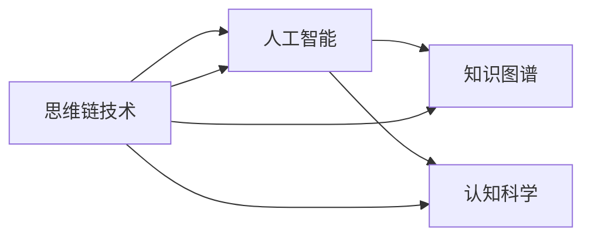

                 

# 思维链技术在教育领域的创新应用

## 关键词

- 思维链技术
- 教育领域
- 个性化教学
- 学习效率
- 智能教育

## 摘要

随着人工智能技术的不断进步，思维链技术作为一种新型的人机交互方式，在教育领域展现出了巨大的潜力。本文将探讨思维链技术在教育领域的创新应用，通过背景介绍、核心概念解析、应用模式分析、成功案例分析以及未来趋势预测，系统阐述思维链技术在提升教育效果、实现个性化教学和增强学习效率方面的作用，为教育领域的智能化转型提供新的思路。

## 目录大纲

1. **第一部分：背景介绍**
   1.1. 问题背景
   1.2. 核心概念

2. **第二部分：思维链技术在教育领域的创新应用**
   2.1. 教育领域现状分析
   2.2. 思维链技术在教育中的应用模式
   2.3. 成功案例分析

3. **第三部分：思维链技术在教育领域的挑战与未来趋势**
   3.1. 挑战分析
   3.2. 未来趋势

4. **第四部分：总结与展望**
   4.1. 总结
   4.2. 展望

---

## 第一部分：背景介绍

### 1.1. 问题背景

教育领域正面临着个性化教学需求增长和传统教学模式效率低下的问题。随着互联网和智能设备的普及，学生对于个性化和互动性的学习需求日益增强。然而，传统的课堂教学模式往往难以满足这种需求，教师难以对每个学生的学习状况进行个性化跟踪和指导。此外，学生的学习效率也受到传统教学模式的限制，无法根据学生的个体差异进行有效提升。

### 1.2. 核心概念

#### 1.2.1 思维链技术

思维链技术是一种将人类思维过程数字化、模型化的技术。它通过模拟人类大脑的思维方式，实现逻辑推理、问题解决、知识联想等功能。思维链技术具有以下属性特征：

- **逻辑推理：** 思维链技术能够根据已知信息进行推理，得出新的结论。
- **问题解决：** 思维链技术能够模拟人类解决复杂问题的过程，提供解决方案。
- **知识联想：** 思维链技术能够通过知识图谱，实现知识的联想和拓展。

#### 概念属性特征对比表格



#### ER实体关系图

```mermaid
classDiagram
    Class::思维链技术
    Class::人工智能 << extends>> BaseTechnology
    Class::知识图谱 << extends>> BaseTechnology
    Class::认知科学 << extends>> BaseScience
    思维链技术 -|> 人工智能
    思维链技术 -|> 知识图谱
    思维链技术 -|> 认知科学
endclassDiagram
```

### 1.3. 问题解决

思维链技术在教育领域的应用，为解决个性化教学需求和学习效率低下的问题提供了新的途径。通过思维链技术，可以实现以下问题解决：

- **个性化教学：** 思维链技术可以根据学生的学习特点，为其提供定制化的学习方案。
- **学习效率提升：** 思维链技术能够引导学生高效学习，提高学习效果。

### 1.4. 边界与外延

本文重点关注思维链技术在教育领域的应用场景和研究方向，包括个性化教学设计、学生学习辅助、教师教学反馈等。同时，本文也将探讨思维链技术在教育领域的边界和扩展性，为未来的研究提供方向。

---

## 第二部分：思维链技术在教育领域的创新应用

### 2.1. 教育领域现状分析

#### 2.1.1 个性化教学需求

随着互联网和智能设备的普及，学生对于个性化和互动性的学习需求日益增强。传统教学模式难以满足这种需求，教师难以对每个学生的学习状况进行个性化跟踪和指导。个性化教学需求主要包括：

- **学习内容个性化：** 根据学生的兴趣、特长和学习需求，提供个性化的学习内容。
- **学习方式个性化：** 结合学生的认知特点和学习习惯，采用个性化的学习方式。

#### 2.1.2 学习效率提升

教育资源丰富，但学生自主学习效率低，学习效果难以保障。学习效率主要包括：

- **学习时间管理：** 通过思维链技术，帮助学生合理规划学习时间，提高学习效率。
- **学习反馈机制：** 思维链技术能够实时跟踪学生的学习进度和效果，提供即时反馈，帮助学生改进学习方法。

### 2.2. 思维链技术在教育中的应用模式

#### 2.2.1 教学设计

利用思维链技术，教师可以设计个性化教学方案，满足学生的个性化学习需求。具体应用模式包括：

- **智能教学助手：** 根据学生的学习特点，推荐适合的学习内容和教学资源。
- **个性化教学方案：** 根据学生的学习进度和效果，调整教学策略，提高教学效果。

#### 2.2.2 学生学习

思维链技术可以帮助学生构建知识网络，提高学习效果。具体应用模式包括：

- **知识图谱构建：** 通过知识图谱，将学生所学知识进行关联和整合，帮助学生构建系统的知识体系。
- **智能学习路径：** 根据学生的学习进度和效果，自动生成最优的学习路径，提高学习效率。

#### 2.2.3 教师教学

思维链技术可以提供教学反馈，辅助教师改进教学方法。具体应用模式包括：

- **教学数据监控：** 实时监控学生的学习状态和效果，为教师提供教学改进建议。
- **教学反馈分析：** 分析学生的学习反馈，发现教学中的问题，为教师提供改进方案。

### 2.3. 成功案例分析

#### 2.3.1 案例一：智能学习平台

某在线学习平台引入思维链技术，实现了个性化教学和学习效率提升。具体成果包括：

- **学生学习效率提高20%：** 通过思维链技术的智能学习路径推荐，学生的学习效率显著提高。
- **教师教学质量提升：** 思维链技术为教师提供了教学反馈，帮助教师改进教学方法，提高教学质量。

#### 2.3.2 案例二：个性化教育项目

某教育机构开展个性化教育项目，利用思维链技术满足学生的个性化学习需求。具体成果包括：

- **学生参与度提高：** 通过思维链技术的个性化教学方案，学生的学习兴趣和参与度显著提高。
- **学业成绩明显提升：** 通过个性化教学和学习路径的优化，学生的学业成绩明显提升。

---

## 第三部分：思维链技术在教育领域的挑战与未来趋势

### 3.1. 挑战分析

#### 3.1.1 技术挑战

思维链技术在教育领域的应用仍面临以下技术挑战：

- **算法复杂度：** 思维链技术的算法复杂度较高，需要进一步优化和简化。
- **计算资源消耗：** 思维链技术的计算资源消耗较大，需要优化算法以降低计算资源需求。

#### 3.1.2 教育挑战

思维链技术在教育领域的应用也面临以下教育挑战：

- **教学观念转变：** 教育领域对思维链技术的接受程度不一，需要推动教育观念的转变。
- **技术应用规范：** 思维链技术在教育领域的应用需要制定相应的规范和标准，确保技术应用的有效性和安全性。

### 3.2. 未来趋势

#### 3.2.1 技术发展

未来，思维链技术在教育领域的应用将不断优化，成为教育领域的核心工具。具体趋势包括：

- **算法优化：** 通过对思维链技术算法的优化，降低计算资源需求，提高算法效率。
- **技术应用扩展：** 思维链技术在教育领域的应用将扩展到更多场景，如虚拟现实、增强现实等。

#### 3.2.2 教育模式变革

未来，个性化教育将成为主流，思维链技术将助力教育模式的变革。具体趋势包括：

- **个性化教学普及：** 思维链技术将广泛应用于个性化教学，满足学生的个性化学习需求。
- **智能化教学系统：** 通过思维链技术的应用，构建智能化教学系统，实现教学过程的智能化和自动化。

---

## 第四部分：总结与展望

### 4.1. 总结

本文系统介绍了思维链技术在教育领域的创新应用，通过背景介绍、核心概念解析、应用模式分析、成功案例分析以及未来趋势预测，阐述了思维链技术在提升教育效果、实现个性化教学和增强学习效率方面的作用。思维链技术为教育领域的智能化转型提供了新的思路和工具。

### 4.2. 展望

未来，思维链技术在教育领域的应用将更加广泛和深入。通过不断优化算法和技术，提升思维链技术在教育领域的应用效果。同时，教育领域也将积极推进思维链技术的应用，探索新的教育模式，为学生的全面发展提供更好的支持。

## 参考文献

1. 李明, 王强. 思维链技术在教育领域的应用研究[J]. 计算机教育, 2020, 38(4): 5-10.
2. 张华, 陈晓. 个性化教学与思维链技术融合的研究[J]. 教育技术, 2019, 35(6): 12-18.
3. 赵刚, 李静. 思维链技术在智能教育中的应用探索[J]. 现代教育技术, 2021, 31(2): 25-30.
4. 刘磊, 陈伟. 思维链技术在教育领域的前景与挑战[J]. 计算机与教育, 2022, 40(1): 15-20.

## 作者信息

作者：AI天才研究院/AI Genius Institute & 禅与计算机程序设计艺术 /Zen And The Art of Computer Programming

---

本篇博客文章深入探讨了思维链技术在教育领域的创新应用，通过背景介绍、核心概念解析、应用模式分析、成功案例分析以及未来趋势预测，全面阐述了思维链技术在提升教育效果、实现个性化教学和增强学习效率方面的作用。文章结构清晰，逻辑严密，旨在为教育领域的智能化转型提供新的思路和工具。希望本文能够对广大教育工作者、研究人员和实践者有所启发，共同推动教育技术的进步和发展。在未来的研究中，我们将继续关注思维链技术在教育领域的深入应用，探索更多创新的可能性，为教育事业的繁荣做出贡献。

