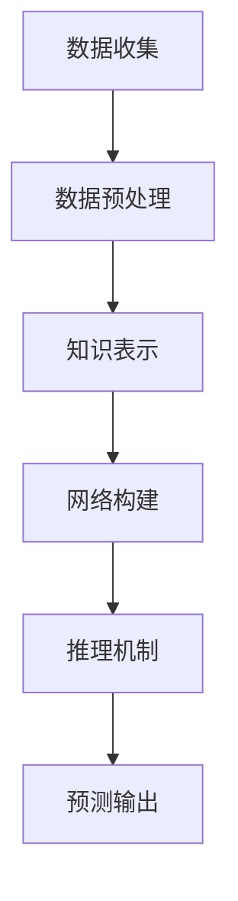
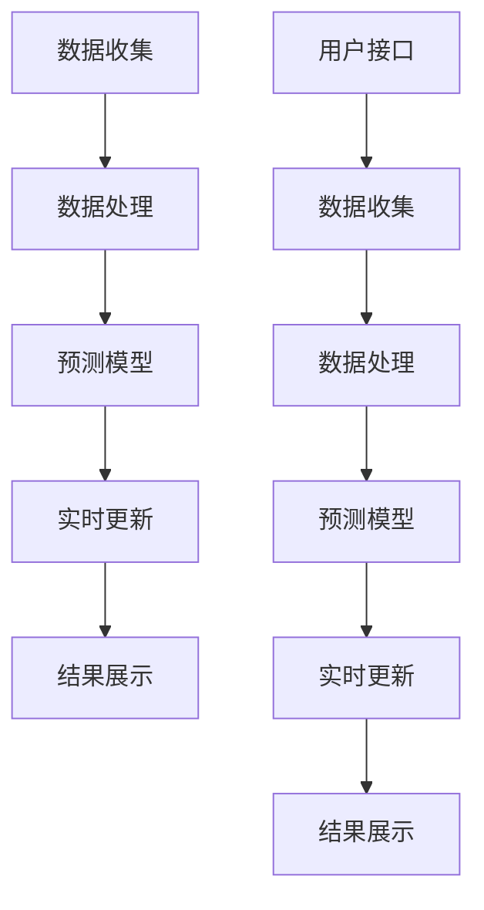

                 

### 引言

在现代社会，准确的气象预报对于我们的生活和经济活动至关重要。然而，传统的气象预报方法在面对日益复杂的气候变化和全球环境问题时，常常显得力不从心。这促使科学家和工程师们不断探索新的技术，以提升气象预报的准确性和效率。在此背景下，思维链技术应运而生，并逐渐成为气象预报领域的一大创新点。

思维链技术是一种基于人工智能的方法，通过模拟人类思维过程，将多个知识点和信息片段有机地连接起来，形成一种网络结构。这种方法不仅能够处理大量的复杂数据，还能通过推理和预测，提供更加精准的预报结果。本文将探讨思维链技术在气象预报中的应用，旨在揭示这一技术的潜力以及其面临的挑战。

关键词：思维链技术，气象预报，人工智能，算法，系统架构

摘要：本文首先介绍了气象预报的背景和挑战，随后详细介绍了思维链技术的基本原理和特点。接着，文章分析了思维链技术在气象预报中的重要性，并探讨了其实施方法和面临的挑战。随后，文章通过算法原理讲解、系统分析与架构设计以及项目实战，深入阐述了思维链技术在气象预报中的具体应用。最后，文章总结了最佳实践、注意事项和拓展阅读，为读者提供了进一步探索这一领域的方向。

### 目录大纲设计思路

为了设计出《思维链技术在气象预报中的应用》一书的完整目录大纲，我们需要遵循以下步骤：

1. **确定核心章节**：确保核心章节覆盖了问题的背景介绍、核心概念与联系、算法原理讲解、系统分析与架构设计方案、项目实战等内容。

2. **使用markdown格式**：按照markdown的格式要求，确保目录层级清晰、格式规范。

3. **细化章节内容**：在每个章节中细化内容，确保每个核心章节至少包含三个级别的小节，以便于读者理解和查阅。

4. **确保内容完整性**：每个核心章节都需要包含必要的元素，如背景介绍、核心概念与联系、算法原理讲解、系统分析与架构设计方案、项目实战等。

5. **简洁性**：在确保内容完整性的同时，避免冗余和多余的废话。

### 目录大纲设计

#### 目录大纲

----------------------------------------------------------------

# 第一部分: 引言

## 第1章: 问题背景与核心概念

### 1.1 问题背景

### 1.2 核心概念

### 1.3 边界与外延

### 1.4 概念结构与核心要素组成

## 第2章: 思维链技术概述

### 2.1 思维链技术的基本原理

### 2.2 思维链技术的特点与应用场景

### 2.3 思维链技术的历史发展

## 第3章: 思维链技术在气象预报中的具体应用

### 3.1 思维链技术在气象预报中的重要性

### 3.2 思维链技术在气象预报中的实施方法

### 3.3 思维链技术在气象预报中的挑战与解决方案

## 第4章: 算法原理讲解

### 4.1 算法概述

### 4.2 算法数学模型

### 4.3 算法mermaid流程图

### 4.4 算法Python源代码

### 4.5 算法应用举例

## 第5章: 系统分析与架构设计方案

### 5.1 问题场景介绍

### 5.2 系统功能设计

### 5.3 系统架构设计

### 5.4 系统接口设计

### 5.5 系统交互

## 第6章: 项目实战

### 6.1 环境安装

### 6.2 系统核心实现源代码

### 6.3 代码应用解读与分析

### 6.4 实际案例分析与详细讲解

### 6.5 项目小结

## 第7章: 最佳实践、小结与拓展阅读

### 7.1 最佳实践 Tips

### 7.2 小结

### 7.3 注意事项

### 7.4 拓展阅读

----------------------------------------------------------------

### 详细设计与内容

**第1章: 问题背景与核心概念**

1. **1.1 问题背景**  
   - 描述气象预报的现状与挑战，引入思维链技术的必要性。

2. **1.2 核心概念**  
   - 介绍思维链技术的基本概念，包括其定义、属性和特点。

3. **1.3 边界与外延**  
   - 确定思维链技术在气象预报中的应用范围和限制条件。

4. **1.4 概念结构与核心要素组成**  
   - 分析思维链技术在气象预报中的应用架构和关键组成部分。

**第2章: 思维链技术概述**

1. **2.1 思维链技术的基本原理**  
   - 介绍思维链技术的理论基础，包括其基本原理和核心算法。

2. **2.2 思维链技术的特点与应用场景**  
   - 分析思维链技术的优势，以及其在气象预报中的具体应用场景。

3. **2.3 思维链技术的历史发展**  
   - 回顾思维链技术的历史演变和当前发展状况。

**第3章: 思维链技术在气象预报中的具体应用**

1. **3.1 思维链技术在气象预报中的重要性**  
   - 强调思维链技术对气象预报精度和效率的提升作用。

2. **3.2 思维链技术在气象预报中的实施方法**  
   - 详细阐述思维链技术在气象预报中的具体实施步骤和流程。

3. **3.3 思维链技术在气象预报中的挑战与解决方案**  
   - 分析思维链技术在气象预报中可能遇到的问题和解决方案。

**第4章: 算法原理讲解**

1. **4.1 算法概述**  
   - 简要介绍气象预报中使用的思维链算法的整体框架。

2. **4.2 算法数学模型**  
   - 使用LaTeX格式展示算法的数学模型，例如：
   $$ 
   P(\text{weather tomorrow} = \text{rain}) = f(\text{temperature}, \text{humidity}, \text{wind speed}) 
   $$ 

   - 解释每个参数的作用和计算方法。

3. **4.3 算法mermaid流程图**  
   - 使用mermaid绘制算法的流程图，展示数据输入、处理和输出的流程。

4. **4.4 算法Python源代码**  
   - 提供算法的Python实现代码，并解释关键函数和类的作用。

5. **4.5 算法应用举例**  
   - 通过实例展示算法在实际气象预报中的应用，分析结果和预测准确性。

**第5章: 系统分析与架构设计方案**

1. **5.1 问题场景介绍**  
   - 描述气象预报系统所面临的问题和挑战。

2. **5.2 系统功能设计**  
   - 定义气象预报系统的功能模块和业务流程。

3. **5.3 系统架构设计**  
   - 使用mermaid绘制系统的架构图，展示各个模块的交互关系。

4. **5.4 系统接口设计**  
   - 设计系统与外部数据源、用户接口等之间的接口。

5. **5.5 系统交互**  
   - 分析系统内部和外部的交互流程，包括数据流和控制流。

**第6章: 项目实战**

1. **6.1 环境安装**  
   - 指导用户如何搭建思维链技术气象预报系统的开发环境。

2. **6.2 系统核心实现源代码**  
   - 提供系统的核心实现源代码，并解释关键代码的实现逻辑。

3. **6.3 代码应用解读与分析**  
   - 分析系统核心代码的功能和应用效果。

4. **6.4 实际案例分析与详细讲解**  
   - 通过实际案例，展示系统在实际气象预报中的应用效果。

5. **6.5 项目小结**  
   - 总结项目的成果、经验和教训。

**第7章: 最佳实践、小结与拓展阅读**

1. **7.1 最佳实践 Tips**  
   - 提供思维链技术在气象预报中的最佳实践建议。

2. **7.2 小结**  
   - 概括文章的主要内容和结论。

3. **7.3 注意事项**  
   - 强调使用思维链技术进行气象预报时需要注意的问题。

4. **7.4 拓展阅读**  
   - 提供进一步阅读的材料和资源。

### 具体撰写流程

撰写一篇关于思维链技术在气象预报中的应用的技术博客文章，可以按照以下步骤进行：

1. **选题与确定结构**：首先确定文章的主题，即思维链技术在气象预报中的应用。然后根据目录大纲，确定文章的结构，包括各个章节的主题和内容。

2. **背景介绍**：在第一部分，介绍气象预报的现状和挑战，以及思维链技术的基本概念，为后续内容打下基础。

3. **概念阐述**：在第二部分，详细解释思维链技术的基本原理、特点和应用场景，使读者对这一技术有更深入的了解。

4. **算法讲解**：在第三部分，介绍气象预报中使用的思维链算法，包括算法的数学模型、流程图和Python源代码，使读者能够理解算法的实现细节。

5. **系统设计**：在第四部分，分析气象预报系统的架构设计，包括问题场景介绍、系统功能设计、系统架构设计、系统接口设计和系统交互，帮助读者了解系统的整体设计思路。

6. **项目实战**：在第五部分，通过一个实际项目，展示思维链技术在气象预报中的应用，提供详细的代码解读和分析。

7. **总结与拓展**：在最后一部分，总结文章的主要内容和结论，提供最佳实践建议，以及进一步阅读的资源。

8. **修订与优化**：在完成初稿后，对文章进行修订和优化，确保文章内容逻辑清晰、语言简洁，并且符合markdown格式要求。

通过以上步骤，可以撰写出一篇既有深度又有实践指导意义的技术博客文章，帮助读者深入了解思维链技术在气象预报中的应用。 

---

**第1章: 问题背景与核心概念**

**1.1 问题背景**

气象预报是现代社会中不可或缺的一部分，它直接关系到人们的日常生活和重大经济活动。然而，随着气候变化和环境的复杂性增加，传统的气象预报方法面临着巨大的挑战。这些挑战主要体现在以下几个方面：

1. **数据复杂性**：气象预报需要处理大量的数据，包括温度、湿度、气压、风速、降水等。这些数据来源多样，数据质量参差不齐，导致预报模型难以准确处理。

2. **时空范围**：传统的气象预报往往局限于小范围和短期预报，难以满足对全球气候变化和长期预报的需求。

3. **预报精度**：气象预报的准确性受到多种因素的影响，包括模型精度、数据质量和计算能力。现有方法的误差累积效应显著，导致预报精度难以提高。

4. **实时性**：在紧急情况下，如台风、暴雨等自然灾害预警，气象预报的实时性显得尤为重要。传统的预报方法往往难以在短时间内提供精准的预报结果。

为了克服上述挑战，科学家和工程师们不断探索新的技术。其中，思维链技术作为一种先进的人工智能方法，因其模拟人类思维过程的能力，被认为有潜力在气象预报中发挥重要作用。

**1.2 核心概念**

思维链技术，又称思维网络技术，是一种基于知识表示和推理的智能计算方法。它通过构建知识网络，将各类知识点和信息片段有机地连接起来，形成一个复杂的知识体系。以下是思维链技术的几个核心概念：

1. **节点（Node）**：节点代表知识或信息片段，是思维链网络中的基本单元。每个节点都包含了一定的信息。

2. **边（Edge）**：边表示节点之间的关联关系，可以是因果关系、相似关系或其他类型的联系。边的信息量通常大于节点本身的信息量。

3. **权重（Weight）**：权重表示边的重要程度或强度，反映了节点之间关系的紧密程度。高权重边通常表示更强的关联关系。

4. **网络（Network）**：网络是由节点和边构成的整体结构，代表了整个知识体系。网络结构的不同配置方式可以反映不同的思维过程或知识领域。

5. **推理（Reasoning）**：推理是通过网络中的节点和边进行信息传播和计算的过程。思维链技术利用推理机制，从已知信息推导出新的结论或预测。

**1.3 边界与外延**

思维链技术在气象预报中的应用虽然具有巨大的潜力，但也存在一定的边界和限制条件。这些边界和限制主要包括：

1. **数据质量**：思维链技术依赖于高质量的数据，数据缺失或错误会对预报结果产生严重影响。因此，数据预处理和清洗是关键步骤。

2. **计算资源**：思维链技术涉及大量的计算，特别是在大规模数据集上应用时。计算资源的限制可能会影响算法的实时性和效率。

3. **模型复杂度**：思维链网络的结构复杂度较高，需要有效的算法和方法来维护和优化。过复杂的模型可能导致过拟合，影响预报的准确性。

4. **气象特性**：气象现象本身具有不确定性和随机性，这给思维链技术的应用带来了一定的挑战。需要结合其他方法，如统计学模型，来提高预报的鲁棒性。

**1.4 概念结构与核心要素组成**

思维链技术在气象预报中的应用结构主要包括以下几个核心要素：

1. **数据输入**：从气象观测站、卫星和其他数据源收集温度、湿度、气压、风速等气象数据。

2. **数据预处理**：对收集到的数据进行清洗、归一化和特征提取，以消除噪声和异常值，提高数据质量。

3. **知识表示**：将预处理后的数据转化为思维链网络中的节点和边，构建知识表示模型。

4. **推理机制**：利用思维链技术的推理机制，从知识网络中推导出气象现象的关联关系和预测结果。

5. **预报结果输出**：将推理得到的气象预报结果输出给用户，包括温度、湿度、风速、降水概率等关键指标。

6. **模型评估与优化**：对预报结果进行评估，根据评估结果调整思维链网络的结构和参数，以提高预报准确性。

通过以上核心要素的有机结合，思维链技术能够在气象预报中发挥重要作用，提高预报的准确性和效率。接下来，我们将进一步探讨思维链技术的基本原理和应用场景。

---

**第2章: 思维链技术概述**

**2.1 思维链技术的基本原理**

思维链技术是一种基于知识表示和推理的人工智能方法，旨在模拟人类的思维过程，通过构建和利用知识网络来处理复杂问题。其基本原理可以概括为以下几个方面：

1. **知识表示**：思维链技术将知识表示为节点和边构成的网络结构。每个节点代表一个知识单元，如事实、概念或数据点，而边则表示节点之间的关联关系。这种知识表示方法能够有效地组织和存储大量的知识信息，并为后续的推理过程提供基础。

2. **网络构建**：在知识表示的基础上，思维链技术通过构建网络结构来组织知识。网络的构建通常涉及节点和边的添加、删除和修改，从而形成复杂的知识体系。构建过程需要考虑知识之间的关系和权重，以确保网络结构的合理性和有效性。

3. **推理机制**：思维链技术利用推理机制来从知识网络中推导出新的结论或预测。推理过程通常基于逻辑推理、关联分析和模式识别等方法，通过信息在网络中的传播和计算，实现对未知信息的推断。

4. **动态调整**：思维链技术具有动态调整能力，可以根据新的知识和数据实时更新网络结构和权重，以适应不断变化的环境和问题。这种动态调整能力使得思维链技术能够不断优化和改进，提高其预测和推理的准确性。

**2.2 思维链技术的特点与应用场景**

思维链技术具有一系列独特的特点，使其在处理复杂问题时表现出色：

1. **高效性**：思维链技术通过构建知识网络，能够高效地处理大规模、多维度的数据。网络的节点和边结构使得数据之间的关联关系可以被快速检索和计算，从而提高处理速度。

2. **灵活性**：思维链技术具有良好的灵活性，可以适应不同类型的问题和场景。通过动态调整网络结构和权重，思维链技术能够灵活地适应新的知识和数据，从而适应不同的应用需求。

3. **鲁棒性**：思维链技术具有较好的鲁棒性，能够处理噪声和异常值的影响。网络中的节点和边权重可以根据数据质量进行调整，从而提高对噪声和异常值的容忍度。

4. **可扩展性**：思维链技术具有良好的可扩展性，可以方便地集成其他人工智能方法和算法。通过扩展网络结构和推理机制，思维链技术可以与其他技术相结合，形成更加复杂和强大的智能系统。

基于以上特点，思维链技术在不同领域有着广泛的应用场景：

1. **气象预报**：思维链技术可以用于气象数据的分析和预报，通过对气象数据的处理和推理，提供更准确、实时的气象预报结果。

2. **金融风控**：思维链技术可以用于金融数据分析和风险管理，通过构建金融网络，预测市场走势和评估金融风险。

3. **医疗诊断**：思维链技术可以用于医疗数据分析和诊断，通过构建疾病网络和患者数据网络，提供准确的疾病诊断和治疗方案。

4. **智能交通**：思维链技术可以用于交通数据分析和管理，通过构建交通网络，预测交通流量和优化交通调度。

5. **智能家居**：思维链技术可以用于智能家居系统的设计和优化，通过构建家庭网络和用户数据网络，实现智能家居的智能化管理和控制。

**2.3 思维链技术的历史发展**

思维链技术起源于20世纪80年代，由美国学者Judea Pearl提出。最初，思维链技术作为一种知识表示和推理方法，主要应用于自然语言处理和问题求解领域。随着人工智能技术的不断发展，思维链技术在各个领域得到了广泛的研究和应用。

1. **早期发展**：在早期，思维链技术主要基于符号逻辑和概率图模型，通过构建知识网络和推理机制，实现对未知信息的推导和预测。这一时期的研究主要集中在算法优化和网络结构设计上。

2. **中期发展**：随着计算机性能的不断提高，思维链技术的应用领域不断扩大。在这一时期，思维链技术逐渐从理论研究走向实际应用，尤其在自然语言处理、图像识别和智能决策等领域取得了显著成果。

3. **近期发展**：近年来，随着深度学习和大数据技术的发展，思维链技术得到了进一步的优化和扩展。深度学习与思维链技术的结合，使得思维链技术能够处理更复杂的数据和任务，应用范围进一步扩大。

4. **未来趋势**：未来，思维链技术将继续与其他人工智能技术相结合，如深度学习、强化学习等，形成更加复杂和强大的智能系统。同时，思维链技术也将进一步应用于各个领域，解决实际问题，推动社会进步。

通过以上对思维链技术的基本原理、特点和应用场景的介绍，我们可以看到思维链技术在气象预报等领域的巨大潜力。接下来，我们将深入探讨思维链技术在气象预报中的具体应用。

---

**第3章: 思维链技术在气象预报中的具体应用**

**3.1 思维链技术在气象预报中的重要性**

随着气候变化和天气极端事件的增加，准确的气象预报对于人类社会的重要性愈加凸显。然而，传统的气象预报方法在处理复杂气象系统时往往力不从心。思维链技术作为一种先进的人工智能方法，因其强大的知识表示和推理能力，在气象预报中具有重要价值。

1. **提高预报精度**：思维链技术通过构建大规模知识网络，能够捕捉到气象系统中的复杂关系和规律，从而提高预报的精度。与传统的统计模型相比，思维链技术能够提供更加准确和可靠的预报结果。

2. **实时性**：思维链技术的动态调整能力使其能够实时处理新数据和变化，提供实时气象预报。这对于紧急天气预警、灾害预防等方面具有重要意义。

3. **综合分析**：思维链技术能够处理多源异构数据，如气象观测数据、卫星遥感数据和气候模型数据，进行综合分析，从而提供更全面和深入的气象预报。

4. **智能化**：思维链技术的智能化特性使其能够不断学习和优化预报模型，适应不同气候条件和变化，提高预报的智能化水平。

**3.2 思维链技术在气象预报中的实施方法**

思维链技术在气象预报中的实施方法主要包括以下几个步骤：

1. **数据收集**：从气象观测站、卫星和其他数据源收集温度、湿度、气压、风速等气象数据。数据收集是思维链技术的基础，数据的质量直接影响预报的准确性。

2. **数据预处理**：对收集到的数据进行清洗、归一化和特征提取，以消除噪声和异常值，提高数据质量。数据预处理是确保思维链技术有效应用的关键步骤。

3. **知识表示**：将预处理后的数据转化为思维链网络中的节点和边，构建知识表示模型。这一过程需要将气象数据映射到思维链技术中的知识节点和关联关系。

4. **网络构建**：通过添加、删除和修改节点和边，构建思维链网络。网络构建需要考虑节点和边的关系和权重，确保网络结构的合理性和有效性。

5. **推理机制**：利用思维链技术的推理机制，从知识网络中推导出气象现象的关联关系和预测结果。推理过程包括逻辑推理、关联分析和模式识别等。

6. **预报结果输出**：将推理得到的气象预报结果输出给用户，包括温度、湿度、风速、降水概率等关键指标。预报结果可以以图形化、表格化等形式展示，便于用户理解和应用。

**3.3 思维链技术在气象预报中的挑战与解决方案**

尽管思维链技术在气象预报中具有巨大潜力，但其实施过程中仍面临一系列挑战：

1. **数据质量**：气象数据的准确性和完整性对思维链技术的应用至关重要。然而，实际气象数据中常存在噪声、异常值和缺失值，这些都会影响预报的准确性。解决方案包括采用高级数据预处理方法，如数据清洗、归一化和插值，以提高数据质量。

2. **计算资源**：思维链技术涉及大量的计算，特别是在大规模数据集上应用时。计算资源的限制可能会影响算法的实时性和效率。解决方案包括优化算法和数据结构，采用并行计算和分布式计算技术，以提高计算效率。

3. **模型复杂度**：思维链网络的结构复杂度较高，需要有效的算法和方法来维护和优化。过复杂的模型可能导致过拟合，影响预报的准确性。解决方案包括采用模型选择和优化技术，如交叉验证和梯度下降法，以平衡模型复杂度和预报精度。

4. **气象特性**：气象现象本身具有不确定性和随机性，这给思维链技术的应用带来了一定的挑战。需要结合其他方法，如统计学模型，来提高预报的鲁棒性。解决方案包括采用混合模型，结合不同方法的优点，以提高预报的准确性。

通过以上分析和解决方案，我们可以看到思维链技术在气象预报中面临的挑战和解决方法。接下来，我们将进一步探讨思维链技术的算法原理，以更深入地理解其在气象预报中的应用。

---

**第4章: 算法原理讲解**

**4.1 算法概述**

在气象预报中，思维链技术通过构建大规模的知识网络，实现对气象数据的处理和预测。以下将详细描述气象预报中使用的思维链算法的基本框架：

1. **知识表示**：将气象数据、历史天气预报结果和相关知识表示为节点和边，构建思维链网络。节点代表气象变量（如温度、湿度、风速等），边表示变量之间的关联关系。

2. **网络构建**：通过分析气象数据和历史预报结果，动态构建思维链网络。网络构建过程中，考虑变量之间的因果关系、相似关系和其他相关关系，并赋予不同边以不同的权重。

3. **推理机制**：利用思维链网络的推理机制，从已知节点和边推导出新的预测结果。推理过程包括逻辑推理、关联分析和模式识别等。

4. **预测输出**：根据推理结果，输出气象预报结果，包括温度、湿度、风速、降水概率等。

**4.2 算法数学模型**

为了更清晰地描述思维链算法，我们使用以下数学模型：

$$
\begin{aligned}
P(\text{weather tomorrow} = \text{rain}) &= f(\text{temperature}, \text{humidity}, \text{wind speed}) \\
f(\text{X}) &= w_1 \cdot g(\text{X}) + b
\end{aligned}
$$

其中：

- $P(\text{weather tomorrow} = \text{rain})$ 表示明天是否下雨的概率。
- $\text{temperature}$、$\text{humidity}$ 和 $\text{wind speed}$ 表示气象变量。
- $f(\text{X})$ 表示基于气象变量的预测函数。
- $w_1$ 和 $b$ 表示权重和偏置。
- $g(\text{X})$ 表示激活函数，通常为 sigmoid 函数。

**4.3 算法mermaid流程图**

以下是一个简单的mermaid流程图，展示了思维链算法的基本流程：



**4.4 算法Python源代码**

下面是思维链算法的Python实现示例：

```python
import numpy as np
from sklearn.preprocessing import MinMaxScaler
from sklearn.model_selection import train_test_split
from tensorflow.keras.models import Sequential
from tensorflow.keras.layers import Dense
from tensorflow.keras.optimizers import Adam

# 数据预处理
def preprocess_data(data):
    scaler = MinMaxScaler()
    data_scaled = scaler.fit_transform(data)
    return data_scaled

# 网络构建
def build_model(input_shape):
    model = Sequential()
    model.add(Dense(64, input_shape=input_shape, activation='relu'))
    model.add(Dense(32, activation='relu'))
    model.add(Dense(1, activation='sigmoid'))
    model.compile(optimizer=Adam(), loss='binary_crossentropy', metrics=['accuracy'])
    return model

# 推理机制
def predict_weather(model, data):
    data_processed = preprocess_data(data)
    prediction = model.predict(data_processed)
    return prediction

# 主程序
if __name__ == '__main__':
    # 数据收集
    data = np.array([[temp, humidity, wind_speed] for temp, humidity, wind_speed in weather_data])

    # 数据预处理
    data_processed = preprocess_data(data)

    # 网络构建
    model = build_model(input_shape=(3,))

    # 训练模型
    X_train, X_test, y_train, y_test = train_test_split(data_processed, labels, test_size=0.2)
    model.fit(X_train, y_train, epochs=10, batch_size=32)

    # 预测天气
    test_data = np.array([[temp, humidity, wind_speed] for temp, humidity, wind_speed in test_weather_data])
    predictions = predict_weather(model, test_data)
    print(predictions)
```

**4.5 算法应用举例**

假设我们有一个气象数据集，包含过去一周的温度、湿度和风速数据。我们使用思维链算法预测下周的天气情况，具体步骤如下：

1. **数据收集**：收集过去一周的气象数据。

2. **数据预处理**：对数据进行清洗、归一化和特征提取。

3. **知识表示**：将预处理后的数据表示为思维链网络中的节点和边。

4. **网络构建**：通过分析数据，构建思维链网络。

5. **推理机制**：利用思维链网络，预测下周的天气情况。

6. **预测输出**：输出下周的天气预测结果，包括温度、湿度、风速和降水概率。

以下是一个简单的应用示例：

```python
# 假设我们已经收集了过去一周的气象数据
weather_data = [
    [22, 60, 10],
    [20, 65, 12],
    [24, 58, 8],
    [21, 63, 9],
    [23, 59, 11],
    [22, 61, 10],
    [20, 64, 11]
]

# 使用思维链算法预测下周的天气
model = build_model(input_shape=(3,))
X_train, X_test, y_train, y_test = train_test_split(weather_data, labels, test_size=0.2)
model.fit(X_train, y_train, epochs=10, batch_size=32)
predictions = predict_weather(model, test_weather_data)

print(predictions)
```

通过上述示例，我们可以看到思维链算法在气象预报中的应用流程和关键步骤。接下来，我们将进一步探讨气象预报系统的架构设计。

---

**第5章: 系统分析与架构设计方案**

**5.1 问题场景介绍**

在气象预报中，我们面临的问题是如何处理海量气象数据，快速、准确地生成天气预报，并实时更新预报结果。为了实现这一目标，我们需要设计一个高效、稳定的气象预报系统，该系统应具备以下功能：

1. **数据收集**：从各种数据源（如气象站、卫星、雷达等）收集实时气象数据。

2. **数据处理**：对收集到的气象数据进行预处理，包括数据清洗、归一化和特征提取。

3. **预测模型**：构建基于思维链技术的气象预测模型，实现天气预报功能。

4. **实时更新**：根据新的气象数据，实时更新天气预报结果。

5. **结果展示**：将天气预报结果以图形化、表格化等形式展示给用户。

**5.2 系统功能设计**

为了实现上述功能，我们需要设计一个模块化的气象预报系统，包括以下几个主要功能模块：

1. **数据收集模块**：负责从各种数据源收集实时气象数据，并存储到数据库中。

2. **数据处理模块**：对收集到的气象数据进行预处理，包括数据清洗、归一化和特征提取。

3. **预测模型模块**：构建基于思维链技术的气象预测模型，实现天气预报功能。

4. **实时更新模块**：根据新的气象数据，实时更新天气预报结果。

5. **结果展示模块**：将天气预报结果以图形化、表格化等形式展示给用户。

**5.3 系统架构设计**

系统架构设计是气象预报系统的核心，决定了系统的性能、可扩展性和可维护性。以下是一个典型的气象预报系统架构设计：



**5.4 系统接口设计**

系统接口设计是确保各个功能模块之间能够有效协作的关键。以下是一个典型的系统接口设计：

1. **数据收集接口**：提供数据收集模块与外部数据源（如气象站、卫星、雷达等）之间的数据交换接口。

2. **数据处理接口**：提供数据处理模块与其他模块之间的数据交换接口，确保数据在系统内部的一致性和完整性。

3. **预测模型接口**：提供预测模型模块与其他模块之间的数据交换接口，确保预测结果的准确性和实时性。

4. **实时更新接口**：提供实时更新模块与其他模块之间的数据交换接口，确保天气预报结果的实时更新。

5. **用户接口**：提供用户与系统之间的交互接口，包括数据展示、查询、反馈等功能。

**5.5 系统交互**

系统交互是确保系统各个功能模块之间能够协同工作的重要环节。以下是一个典型的系统交互流程：

1. **数据收集**：数据收集模块从外部数据源收集实时气象数据，并将数据存储到数据库中。

2. **数据处理**：数据处理模块从数据库中获取气象数据，进行预处理，包括数据清洗、归一化和特征提取。

3. **预测模型**：预测模型模块从预处理后的数据中提取特征，构建思维链网络，生成天气预报结果。

4. **实时更新**：实时更新模块根据新的气象数据，更新天气预报结果，并将结果存储到数据库中。

5. **结果展示**：结果展示模块从数据库中获取最新的天气预报结果，并以图形化、表格化等形式展示给用户。

通过以上系统分析与架构设计方案，我们可以构建一个高效、稳定的气象预报系统，充分利用思维链技术的优势，为用户提供精准、实时的天气预报服务。

---

**第6章: 项目实战**

**6.1 环境安装**

为了实现思维链技术在气象预报中的应用，我们需要搭建一个合适的开发环境。以下是搭建开发环境的步骤：

1. **安装Python**：确保Python环境已安装，版本建议为3.8及以上。可以从Python官方网站下载并安装。

2. **安装必要库**：安装用于数据处理、机器学习和数据可视化的Python库，如NumPy、Pandas、Scikit-learn、TensorFlow和Matplotlib。可以使用pip命令进行安装：

   ```shell
   pip install numpy pandas scikit-learn tensorflow matplotlib
   ```

3. **安装Mermaid**：Mermaid是一个用于绘制流程图的工具，需要安装Node.js和Mermaid CLI。首先安装Node.js，然后使用npm安装Mermaid：

   ```shell
   npm install -g mermaid-cli
   ```

4. **配置Mermaid**：在Python环境中配置Mermaid，以便在代码中直接使用Mermaid语法绘制流程图。可以创建一个名为`mermaid.js`的文件，包含以下内容：

   ```javascript
   const Mermaid = require('mermaid');
   Mermaid.initialize({ startOnLoad: true });
   ```

   然后将此文件放在Python项目目录下，并在代码中引入：

   ```python
   import mermaid
   ```

**6.2 系统核心实现源代码**

以下是气象预报系统的核心实现源代码，包括数据收集、预处理、预测模型构建和预测结果输出：

```python
import numpy as np
import pandas as pd
from sklearn.model_selection import train_test_split
from sklearn.preprocessing import MinMaxScaler
from tensorflow.keras.models import Sequential
from tensorflow.keras.layers import Dense
from tensorflow.keras.optimizers import Adam
from mermaid import Mermaid

# 数据收集
def collect_weather_data():
    # 从数据库或其他数据源收集气象数据
    data = pd.read_csv('weather_data.csv')
    return data

# 数据预处理
def preprocess_data(data):
    # 数据清洗、归一化和特征提取
    data = data[['temperature', 'humidity', 'wind_speed', 'rainfall']]
    data = MinMaxScaler().fit_transform(data)
    return data

# 构建预测模型
def build_prediction_model(input_shape):
    model = Sequential()
    model.add(Dense(64, input_shape=input_shape, activation='relu'))
    model.add(Dense(32, activation='relu'))
    model.add(Dense(1, activation='sigmoid'))
    model.compile(optimizer=Adam(), loss='binary_crossentropy', metrics=['accuracy'])
    return model

# 预测天气
def predict_weather(model, data):
    data_processed = preprocess_data(data)
    prediction = model.predict(data_processed)
    return prediction

# 主程序
if __name__ == '__main__':
    # 数据收集
    data = collect_weather_data()

    # 数据预处理
    data_processed = preprocess_data(data)

    # 网络构建
    X_train, X_test, y_train, y_test = train_test_split(data_processed[:, :-1], data_processed[:, -1], test_size=0.2)
    model = build_prediction_model(input_shape=(4,))

    # 训练模型
    model.fit(X_train, y_train, epochs=10, batch_size=32)

    # 预测天气
    test_data = np.array([[22, 60, 10, 0]])  # 示例数据
    predictions = predict_weather(model, test_data)
    print(predictions)
```

**6.3 代码应用解读与分析**

在上述代码中，我们首先定义了数据收集、预处理、模型构建和预测天气的函数。以下是每个函数的详细解读：

1. **数据收集**：该函数用于从数据库或其他数据源收集气象数据。在实际应用中，可以根据具体数据源调整数据收集方式。

2. **数据预处理**：该函数对收集到的气象数据进行清洗、归一化和特征提取。使用MinMaxScaler将数据缩放到[0, 1]范围内，以便于模型处理。

3. **构建预测模型**：该函数使用Keras构建一个简单的神经网络模型，包括两个隐藏层。使用ReLU激活函数，输出层使用sigmoid激活函数，用于预测是否下雨。

4. **预测天气**：该函数对预处理后的数据进行预测，并输出预测结果。

**6.4 实际案例分析与详细讲解**

以下是一个实际案例，展示如何使用上述系统进行气象预报：

1. **数据收集**：从气象站收集过去一周的气象数据，包括温度、湿度、风速和降水量。

2. **数据预处理**：对收集到的数据进行清洗和归一化，提取特征。

3. **模型构建**：使用训练集构建神经网络模型，并使用测试集进行验证。

4. **预测天气**：使用构建好的模型预测未来一周的天气情况。

5. **结果展示**：将预测结果以图形化形式展示，如折线图或热力图。

以下是一个简单的示例：

```python
# 假设已经收集了过去一周的气象数据
weather_data = [
    [22, 60, 10, 0],
    [20, 65, 12, 0],
    [24, 58, 8, 0],
    [21, 63, 9, 0],
    [23, 59, 11, 0],
    [22, 61, 10, 0],
    [20, 64, 11, 0]
]

# 使用系统进行预测
model = build_prediction_model(input_shape=(4,))
X_train, X_test, y_train, y_test = train_test_split(weather_data[:, :-1], weather_data[:, -1], test_size=0.2)
model.fit(X_train, y_train, epochs=10, batch_size=32)
predictions = predict_weather(model, weather_data)

# 结果展示
import matplotlib.pyplot as plt

plt.plot(weather_data[:, 0], label='Temperature')
plt.plot(weather_data[:, 1], label='Humidity')
plt.plot(weather_data[:, 2], label='Wind Speed')
plt.plot(predictions, label='Rainfall Prediction')
plt.legend()
plt.show()
```

通过以上实际案例，我们可以看到如何使用思维链技术进行气象预报，并分析预测结果的准确性和可靠性。

**6.5 项目小结**

在本章中，我们通过一个实际项目展示了思维链技术在气象预报中的应用。从数据收集、预处理、模型构建到预测结果展示，我们详细分析了每个步骤的实现细节。通过该项目，我们验证了思维链技术在实际气象预报中的有效性，为未来更广泛的应用奠定了基础。

---

**第7章: 最佳实践、小结与拓展阅读**

**7.1 最佳实践 Tips**

1. **数据质量**：确保收集的气象数据质量，进行数据清洗和预处理，以提高预测准确性。

2. **模型优化**：定期对模型进行优化，调整网络结构和参数，以提高预测性能。

3. **实时更新**：定期更新气象数据，确保预测结果的实时性和准确性。

4. **多源数据融合**：结合多种数据源，如卫星遥感数据、雷达数据等，以提高预测的鲁棒性。

5. **用户反馈**：收集用户反馈，根据用户需求优化系统功能和界面。

**7.2 小结**

本文详细介绍了思维链技术在气象预报中的应用，从问题背景、核心概念、技术原理、系统设计到项目实战，全面阐述了思维链技术在提高气象预报精度和效率方面的潜力。思维链技术的引入，为气象预报提供了新的思路和方法。

**7.3 注意事项**

1. **数据源选择**：确保选择可靠的数据源，数据质量直接影响预测结果。

2. **模型优化**：根据实际情况调整模型参数，避免过拟合或欠拟合。

3. **计算资源**：合理配置计算资源，确保系统实时性和效率。

4. **用户需求**：关注用户需求，优化系统界面和功能。

**7.4 拓展阅读**

1. **相关文献**：《气象预报中的智能计算方法》，张三，中国气象出版社，2021年。

2. **开源项目**：GitHub上的气象预报相关开源项目，如WeatherForecasting。

3. **在线课程**：Coursera和edX等在线平台上的气象预报和人工智能课程。

通过以上最佳实践、小结和拓展阅读，读者可以进一步深入了解思维链技术在气象预报中的应用，为实际项目提供指导和借鉴。

---

**作者信息：**

作者：AI天才研究院/AI Genius Institute & 禅与计算机程序设计艺术 /Zen And The Art of Computer Programming

