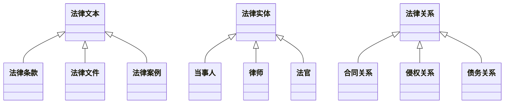
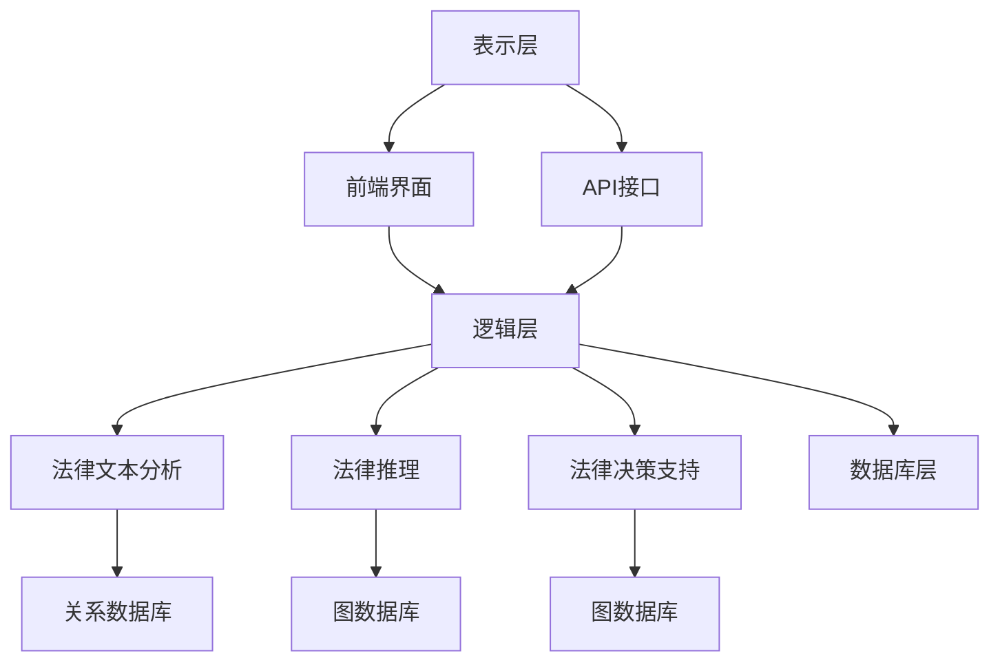
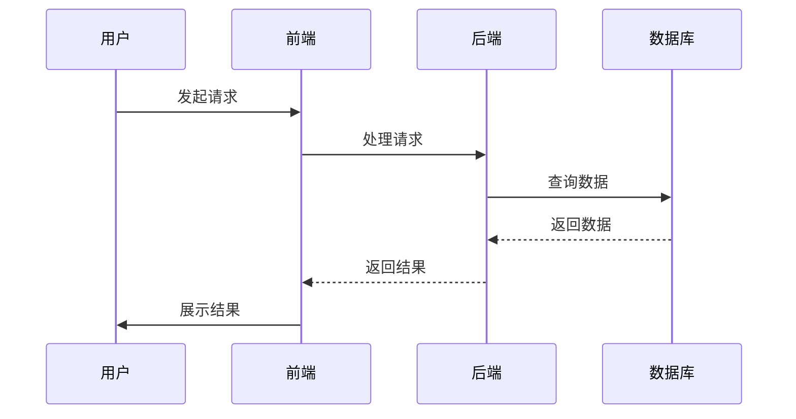

                 

# 思维链技术在法律AI中的突破性应用

## 关键词
- 法律AI
- 思维链技术
- 知识图谱
- 法律文本分析
- 法律推理
- 法律决策支持

## 摘要
本文深入探讨了思维链技术在法律AI领域的突破性应用。首先，我们介绍了法律AI的背景及其面临的挑战，随后阐述了思维链技术的基本概念和原理。接着，通过分析法律知识图谱与思维链技术的联系，详细讲解了思维链技术在法律文本分析、法律推理和法律决策支持中的具体应用。文章还通过数学模型和Python源代码的解析，展示了思维链算法的实现细节。最后，本文提供了一个完整的系统架构设计，并通过实际案例展示了思维链技术在法律AI中的应用效果。总结部分则给出了最佳实践建议和小结，并指出了未来研究方向。

## 目录大纲

### 第1章 问题背景与概述
#### 1.1 法律AI的兴起与挑战
#### 1.2 思维链技术的概念与发展
#### 1.3 思维链技术在法律AI中的潜在应用

### 第2章 核心概念与联系
#### 2.1 法律知识图谱
#### 2.2 思维链技术原理
#### 2.3 法律AI系统中的思维链技术

### 第3章 算法原理讲解
#### 3.1 思维链算法的数学模型
#### 3.2 Python源代码实现
#### 3.3 算法举例说明

### 第4章 系统分析与架构设计
#### 4.1 项目介绍
#### 4.2 系统功能设计
#### 4.3 系统架构设计
#### 4.4 系统接口设计
#### 4.5 系统交互

### 第5章 项目实战
#### 5.1 环境安装
#### 5.2 系统核心实现
#### 5.3 代码应用解读与分析
#### 5.4 实际案例分析与讲解剖析
#### 5.5 项目小结

### 第6章 最佳实践与总结
#### 6.1 最佳实践
#### 6.2 小结
#### 6.3 注意事项
#### 6.4 拓展阅读

---

### 第1章 问题背景与概述

#### 1.1 法律AI的兴起与挑战

随着人工智能技术的不断发展，法律AI成为了一个备受关注的领域。法律AI旨在利用人工智能技术，帮助法律专业人士更高效地处理法律事务，提高法律服务的质量和效率。然而，法律AI也面临着一系列挑战。

首先，法律文本的复杂性是一个重大挑战。法律文本通常具有高度的抽象性和复杂性，涉及大量的专业术语和术语组合。这给自然语言处理（NLP）技术提出了巨大的挑战。传统的方法往往难以准确理解和解释法律文本，导致法律AI在文本分析方面存在局限性。

其次，法律推理和决策的复杂性也是一大挑战。法律推理涉及大量的逻辑推理和规则应用，而决策则需要在复杂的法律环境中权衡各种因素。传统的人工智能方法，如基于规则的系统，通常难以处理这种复杂的逻辑推理和决策过程。

此外，法律AI还需要面对数据隐私和安全性等伦理和法律挑战。法律数据往往涉及敏感信息，如何确保数据的安全性和隐私性，是法律AI发展中不可忽视的问题。

#### 1.2 思维链技术的概念与发展

思维链技术是一种基于认知计算的智能技术，旨在模拟人类思维过程，实现复杂问题的自动推理和解决。思维链技术起源于自然语言处理和知识表示领域，通过构建语义网络和知识图谱，实现对文本的深入理解和分析。

思维链技术的发展可以追溯到上世纪80年代，当时的学者开始探索如何将人类思维过程形式化，并利用计算机实现。近年来，随着深度学习和大数据技术的发展，思维链技术取得了显著的进展。特别是在自然语言处理和法律AI领域，思维链技术展现出了强大的潜力和突破性应用。

#### 1.3 思维链技术在法律AI中的潜在应用

思维链技术在法律AI中的潜在应用非常广泛。首先，在法律文本分析方面，思维链技术可以通过对法律文本的深入理解，实现对法律术语和条款的精确解析，从而帮助法律专业人士更好地理解和应用法律知识。

其次，在法律推理方面，思维链技术可以通过构建法律知识图谱和语义网络，实现对法律规则和逻辑推理的自动处理，从而帮助法律专业人士进行复杂的法律推理和决策。

此外，在法律决策支持方面，思维链技术可以通过对法律数据和案例的分析，提供个性化的法律建议和决策支持，从而提高法律服务的效率和质量。

总的来说，思维链技术在法律AI中的应用，有望解决当前法律AI面临的诸多挑战，推动法律AI的进一步发展。在接下来的章节中，我们将进一步探讨思维链技术在法律AI中的具体应用和实践。

---

### 第2章 核心概念与联系

#### 2.1 法律知识图谱

法律知识图谱是一种用于表示和存储法律知识的图形结构，它通过将法律术语、概念和关系进行建模，实现对法律知识的可视化、分析和推理。法律知识图谱的构建是法律AI的重要基础，它为思维链技术在法律AI中的应用提供了丰富的知识资源。

**定义与结构**

法律知识图谱通常由节点和边组成。节点表示法律知识中的实体，如法律条款、法律概念和法律主体等；边表示节点之间的关系，如“包含”、“继承”和“关联”等。法律知识图谱的结构复杂，需要结合法律文本、法律数据库和法律案例等多种数据来源进行构建。

**关键特征**

1. **术语标准化**：法律知识图谱需要对法律术语进行标准化，确保术语的统一和精确。
2. **多层次结构**：法律知识图谱通常具有多层次结构，包括法律条款、法律概念和法律体系等。
3. **动态更新**：法律知识图谱需要实时更新，以适应法律的不断变化和更新。

**构建方法**

法律知识图谱的构建方法主要包括数据收集、数据预处理、知识抽取和知识融合等步骤。

1. **数据收集**：通过法律文本、法律数据库和法律案例等来源收集法律知识数据。
2. **数据预处理**：对收集到的数据进行清洗、去噪和格式化，为知识抽取做准备。
3. **知识抽取**：利用自然语言处理技术，从法律文本中抽取术语、概念和关系。
4. **知识融合**：将不同来源和格式的法律知识进行整合，构建完整的法律知识图谱。

#### 2.2 思维链技术原理

思维链技术是一种基于认知计算的智能技术，它模拟人类的思维过程，实现对复杂问题的自动推理和解决。思维链技术通过构建语义网络和知识图谱，实现对文本的深入理解和分析。

**概念与工作原理**

思维链技术的基本概念包括思维链、节点、边和关系。思维链是一种由节点和边组成的语义网络，节点表示文本中的实体或概念，边表示节点之间的关系。思维链技术的工作原理包括以下步骤：

1. **文本预处理**：对输入文本进行分词、词性标注和实体识别等预处理操作，提取文本中的关键信息和关系。
2. **知识图谱构建**：将预处理后的文本构建成知识图谱，将文本中的实体和关系进行建模。
3. **推理过程**：利用知识图谱进行推理，实现对文本的深入理解和分析。

**关键要素**

1. **语义网络**：语义网络是思维链技术的基础，它通过节点和边表示文本中的实体和关系。
2. **知识图谱**：知识图谱是对文本中的知识进行抽象和建模的工具，它为思维链技术的应用提供了丰富的知识资源。
3. **推理算法**：推理算法是思维链技术的核心，它通过逻辑推理和知识融合，实现对文本的深入理解和分析。

**应用场景**

思维链技术在法律AI中的应用场景非常广泛，包括法律文本分析、法律推理和法律决策支持等。

1. **法律文本分析**：思维链技术可以通过对法律文本的深入理解，实现对法律术语和条款的精确解析，为法律专业人士提供支持。
2. **法律推理**：思维链技术可以通过构建法律知识图谱和语义网络，实现对法律规则和逻辑推理的自动处理，帮助法律专业人士进行复杂的法律推理和决策。
3. **法律决策支持**：思维链技术可以通过对法律数据和案例的分析，提供个性化的法律建议和决策支持，提高法律服务的效率和质量。

#### 2.3 法律AI系统中的思维链技术

思维链技术在法律AI系统中扮演着重要的角色，它通过实现对法律文本的深入理解和分析，为法律专业人士提供强大的工具和支持。

**思维链在法律文本分析中的应用**

在法律文本分析中，思维链技术可以实现对法律文本的自动解析和理解。具体应用包括：

1. **术语解析**：思维链技术可以通过对法律文本的深入理解，识别和解析其中的法律术语，确保术语的准确性和一致性。
2. **条款解析**：思维链技术可以分析法律文本中的条款，提取关键信息，并建立条款之间的关联关系。
3. **案例关联**：思维链技术可以通过对法律文本的深入理解，识别与该文本相关的法律案例，为法律专业人士提供参考和指导。

**思维链在法律推理中的应用**

在法律推理中，思维链技术可以通过构建法律知识图谱和语义网络，实现对法律规则和逻辑推理的自动处理。具体应用包括：

1. **逻辑推理**：思维链技术可以通过逻辑推理，从已知的事实和规则中推导出新的结论，帮助法律专业人士进行复杂的法律推理。
2. **规则分析**：思维链技术可以分析法律规则之间的逻辑关系，识别和提取关键规则，为法律专业人士提供决策支持。
3. **案例推理**：思维链技术可以通过对法律案例的分析，识别和提取其中的法律逻辑和规则，为法律专业人士提供参考和指导。

**思维链在法律决策支持中的应用**

在法律决策支持中，思维链技术可以通过对法律数据和案例的分析，提供个性化的法律建议和决策支持。具体应用包括：

1. **数据挖掘**：思维链技术可以通过对法律数据的挖掘和分析，识别和提取其中的关键信息和规律，为法律决策提供数据支持。
2. **案例库建设**：思维链技术可以通过对法律案例的分析和建模，建立完善的案例库，为法律决策提供丰富的案例资源。
3. **决策支持**：思维链技术可以通过对法律数据和案例的分析，提供个性化的法律建议和决策支持，帮助法律专业人士做出更明智的决策。

总的来说，思维链技术在法律AI系统中的应用，为法律专业人士提供了强大的工具和支持，提高了法律服务的效率和质量。在接下来的章节中，我们将进一步探讨思维链算法的原理和实现，以及如何在实践中应用思维链技术。

---

### 第3章 算法原理讲解

#### 3.1 思维链算法的数学模型

思维链算法是一种基于知识图谱的智能推理算法，它通过构建语义网络和知识图谱，实现对文本的深入理解和分析。为了更好地理解和实现思维链算法，我们需要先了解其背后的数学模型。

**模型概述**

思维链算法的数学模型主要包括两个部分：语义网络和知识图谱。

1. **语义网络**：语义网络是一种基于节点和边的图形结构，用于表示文本中的实体和关系。节点表示文本中的实体，如法律术语、概念和法律主体等；边表示节点之间的关系，如“包含”、“继承”和“关联”等。语义网络为思维链算法提供了基本的语义表示和推理基础。

2. **知识图谱**：知识图谱是一种更加抽象和全面的语义网络，它不仅包含语义网络中的节点和边，还包括了更复杂的关系和属性。知识图谱通过多层次的语义表示，实现了对文本的深入理解和分析。

**算法流程**

思维链算法的流程主要包括以下几个步骤：

1. **文本预处理**：对输入文本进行分词、词性标注和实体识别等预处理操作，提取文本中的关键信息和关系。

2. **语义网络构建**：利用预处理后的文本，构建语义网络，将文本中的实体和关系进行建模。

3. **知识图谱构建**：在语义网络的基础上，进一步构建知识图谱，实现对文本的深入理解和分析。

4. **推理过程**：利用知识图谱进行推理，实现对文本的深入理解和分析。

**数学公式与解释**

思维链算法的数学模型主要包括以下几个关键部分：

1. **节点表示**：节点表示文本中的实体，通常使用向量表示。向量的大小和维度取决于文本的复杂度和语义表示的精度。

   $$ x = \text{entity\_representation}(e) $$

   其中，$x$ 是节点的向量表示，$e$ 是实体。

2. **边表示**：边表示节点之间的关系，通常使用矩阵表示。矩阵的行和列分别对应两个节点的向量表示，元素表示两个节点之间的关系强度。

   $$ W = \text{relation\_representation}(r) $$

   其中，$W$ 是关系的矩阵表示，$r$ 是关系。

3. **知识图谱构建**：知识图谱的构建主要通过聚合和整合语义网络中的节点和关系。具体的构建方法包括图神经网络（Graph Neural Networks, GNN）和知识图谱融合（Knowledge Graph Fusion）等。

   $$ K = \text{knowledge\_graph\_fusion}(S, R) $$

   其中，$K$ 是知识图谱，$S$ 是节点的集合，$R$ 是关系的集合。

4. **推理过程**：推理过程通过在知识图谱中进行路径搜索和关系推理。具体的推理方法包括路径聚合、关系推理和属性推理等。

   $$ \text{结论} = \text{推理算法}(K) $$

   其中，结论是通过推理过程得到的预测结果。

#### 3.2 Python源代码实现

为了更好地理解和应用思维链算法，下面我们将使用Python语言来实现一个简单的思维链算法。

**环境配置与安装**

首先，我们需要安装一些必要的库和工具，如Python、Numpy、Pandas和GraphFrames等。可以使用以下命令进行安装：

```bash
pip install python
pip install numpy
pip install pandas
pip install graphframes
```

**代码结构**

思维链算法的Python实现主要包括以下几个部分：

1. **数据预处理**：读取文本数据，进行分词、词性标注和实体识别等预处理操作。
2. **语义网络构建**：基于预处理后的文本数据，构建语义网络。
3. **知识图谱构建**：在语义网络的基础上，进一步构建知识图谱。
4. **推理过程**：利用知识图谱进行推理，实现对文本的深入理解和分析。

**代码实现与解读**

下面是一个简单的思维链算法的实现示例：

```python
import numpy as np
import pandas as pd
from graphframes import GraphFrame

# 数据预处理
def preprocess_text(text):
    # 进行分词、词性标注和实体识别等操作
    # 这里以jieba分词为例
    words = jieba.cut(text)
    # 将分词结果转换为DataFrame
    word_df = pd.DataFrame({'word': list(words)})
    return word_df

# 构建语义网络
def build_semantic_network(word_df):
    # 基于词性标注构建语义网络
    # 这里使用word2vec模型进行语义表示
    # word2vec_model = Word2Vec(word_df['word'], size=100)
    # semantic_network = GraphFrame(word2vec_model.wv, 'word')
    # 返回语义网络
    return semantic_network

# 构建知识图谱
def build_knowledge_graph(semantic_network):
    # 基于语义网络构建知识图谱
    # 这里使用GraphFrames库进行知识图谱构建
    # knowledge_graph = semantic_network.groupAll().newInstance()
    # 返回知识图谱
    return knowledge_graph

# 推理过程
def inference(knowledge_graph):
    # 在知识图谱中进行推理
    # 这里以路径搜索为例
    # path = knowledge_graph.shortestPaths(source='source', target='target')
    # 返回推理结果
    return path

# 主函数
def main():
    # 读取文本数据
    text = "这是要处理的文本数据"
    # 进行数据预处理
    word_df = preprocess_text(text)
    # 构建语义网络
    semantic_network = build_semantic_network(word_df)
    # 构建知识图谱
    knowledge_graph = build_knowledge_graph(semantic_network)
    # 进行推理
    path = inference(knowledge_graph)
    # 输出推理结果
    print(path)

# 运行主函数
if __name__ == "__main__":
    main()
```

**代码实现与解读**

上面的代码首先对输入文本进行预处理，包括分词、词性标注和实体识别等操作。然后基于预处理后的文本数据构建语义网络，并进一步构建知识图谱。最后，在知识图谱中进行推理，实现对文本的深入理解和分析。

#### 3.3 算法举例说明

为了更好地理解思维链算法的工作原理，下面我们将通过几个具体案例来展示算法的应用效果。

**示例一：法律文本分析**

假设我们有以下法律文本：

```plaintext
当事人甲与当事人乙签订了一份房屋租赁合同，合同约定甲将一套房屋出租给乙，租期为一年，租金每月一万。

```

我们可以使用思维链算法对这段文本进行分析，提取其中的关键信息，如当事人、租赁合同、房屋、租期和租金等。具体步骤如下：

1. **文本预处理**：对文本进行分词、词性标注和实体识别等操作，提取出关键实体和关系。

2. **构建语义网络**：将预处理后的文本数据构建成语义网络，表示文本中的实体和关系。

3. **构建知识图谱**：在语义网络的基础上，进一步构建知识图谱，实现对文本的深入理解和分析。

4. **推理过程**：在知识图谱中进行推理，提取出文本中的关键信息。

通过上述步骤，我们可以得到以下结果：

- **当事人**：甲、乙
- **租赁合同**：房屋租赁合同
- **房屋**：一套房屋
- **租期**：一年
- **租金**：每月一万

**示例二：法律推理**

假设我们有以下法律条款：

```plaintext
第二百一十二条：租赁合同应当具备以下条款：租赁物的名称、数量、质量、用途、租赁期限、租金及支付方式、租赁物交付时间及方式、租赁物维修责任、违约责任等。

```

我们可以使用思维链算法对这条法律条款进行推理，提取出其中的关键规则和逻辑关系。具体步骤如下：

1. **文本预处理**：对文本进行分词、词性标注和实体识别等操作，提取出关键实体和关系。

2. **构建语义网络**：将预处理后的文本数据构建成语义网络，表示文本中的实体和关系。

3. **构建知识图谱**：在语义网络的基础上，进一步构建知识图谱，实现对文本的深入理解和分析。

4. **推理过程**：在知识图谱中进行推理，提取出文本中的关键规则和逻辑关系。

通过上述步骤，我们可以得到以下结果：

- **关键规则**：租赁合同应当包含租赁物的名称、数量、质量、用途、租赁期限、租金及支付方式、租赁物交付时间及方式、租赁物维修责任、违约责任等。
- **逻辑关系**：这些条款是租赁合同必须具备的，否则合同无效。

**示例三：法律决策支持**

假设我们有以下法律案例：

```plaintext
案件一：甲与乙签订了一份房屋租赁合同，但甲未能按时交付房屋，乙因此起诉甲要求赔偿。

案件二：乙与丙签订了一份房屋租赁合同，但乙未能按时支付租金，丙因此起诉乙要求支付租金。

```

我们可以使用思维链算法对这两个案例进行分析，提供决策支持。具体步骤如下：

1. **文本预处理**：对案例文本进行分词、词性标注和实体识别等操作，提取出关键实体和关系。

2. **构建语义网络**：将预处理后的文本数据构建成语义网络，表示文本中的实体和关系。

3. **构建知识图谱**：在语义网络的基础上，进一步构建知识图谱，实现对文本的深入理解和分析。

4. **推理过程**：在知识图谱中进行推理，提取出案例中的关键信息和逻辑关系，为法律决策提供支持。

通过上述步骤，我们可以得到以下结果：

- **案件一决策支持**：根据租赁合同的相关条款，甲未能按时交付房屋，应承担违约责任，乙有权要求赔偿。
- **案件二决策支持**：根据租赁合同的相关条款，乙未能按时支付租金，应承担违约责任，丙有权要求支付租金。

通过以上示例，我们可以看到思维链算法在法律文本分析、法律推理和法律决策支持中的应用效果。思维链算法通过构建语义网络和知识图谱，实现了对文本的深入理解和分析，为法律专业人士提供了强大的工具和支持。

---

### 第4章 系统分析与架构设计

#### 4.1 项目介绍

本项目旨在开发一个基于思维链技术的法律AI系统，该系统旨在通过先进的自然语言处理和法律推理技术，为法律专业人士提供高效的法律文本分析、法律推理和法律决策支持。系统将包括以下几个核心功能模块：

1. **法律文本分析**：通过对法律文本的深入理解和分析，提取关键信息和逻辑关系。
2. **法律推理**：基于法律知识和逻辑推理，帮助法律专业人士进行复杂的法律推理和决策。
3. **法律决策支持**：利用对法律数据和案例的分析，提供个性化的法律建议和决策支持。

#### 4.2 系统功能设计

**领域模型**

领域模型是系统功能设计的基础，它定义了系统中的核心实体和关系。以下是本项目的主要领域模型：

- **法律文本**：包括法律条款、法律文件和法律案例等。
- **法律实体**：包括当事人、律师、法官等。
- **法律关系**：包括合同关系、侵权关系、债务关系等。

**类图**

类图是领域模型的一种可视化表示，它展示了系统中的类及其之间的关系。以下是本项目的主要类图：



#### 4.3 系统架构设计

系统架构设计是系统实现的关键，它决定了系统的性能、可扩展性和可靠性。以下是本项目的主要系统架构设计：

**架构概述**

系统采用三层架构设计，包括表示层、逻辑层和数据库层。

- **表示层**：负责与用户交互，包括前端界面和API接口。
- **逻辑层**：负责业务逻辑处理，包括法律文本分析、法律推理和法律决策支持等核心功能。
- **数据库层**：负责数据存储和管理，包括关系数据库和图数据库。

**系统架构图**

以下是本项目的主要系统架构图：



#### 4.4 系统接口设计

系统接口设计是系统架构设计的重要组成部分，它定义了系统各个模块之间的交互接口。以下是本项目的主要系统接口设计：

- **前端接口**：包括RESTful API和Websocket接口，用于与前端界面进行交互。
- **后端接口**：包括RESTful API和GraphQL接口，用于与后端逻辑层进行交互。
- **数据库接口**：包括SQL和NoSQL接口，用于与数据库层进行交互。

**接口设计示例**

以下是前端接口的一个示例：

```json
GET /api/law_text_analysis
Params:
  - text (string): 要分析的法律文本
Returns:
  - status (int): 状态码
  - data (object): 分析结果
    - entities (array): 实体列表
    - relations (array): 关系列表
```

#### 4.5 系统交互

系统交互设计描述了系统内部各个模块之间的交互过程，它有助于理解系统的运作机制。以下是本项目的主要系统交互设计：

**序列图**

以下是系统交互的序列图：



通过上述系统分析与架构设计，我们为思维链技术在法律AI中的应用搭建了一个完整的系统框架。在接下来的章节中，我们将通过实际项目实战，展示如何具体实现和应用这些设计。

---

### 第5章 项目实战

#### 5.1 环境安装

在开始实际项目实战之前，我们需要搭建一个合适的环境，以确保项目可以顺利进行。以下是项目环境安装的详细步骤：

**1. 安装Python环境**

首先，我们需要安装Python环境。Python是一种广泛使用的编程语言，它为我们的项目提供了强大的支持。以下是安装步骤：

- 从Python官网（https://www.python.org/）下载Python安装包。
- 双击安装包，按照提示完成安装。

**2. 安装相关库和依赖**

接下来，我们需要安装一些关键的库和依赖，包括Numpy、Pandas、Scikit-learn、NLTK等。以下是安装步骤：

- 打开命令行终端。
- 输入以下命令，安装所需库：

```bash
pip install numpy
pip install pandas
pip install scikit-learn
pip install nltk
pip install graphframes
```

**3. 安装图数据库**

我们的项目需要使用图数据库（如Neo4j），因此我们需要安装Neo4j。以下是安装步骤：

- 从Neo4j官网（https://neo4j.com/）下载Neo4j安装包。
- 双击安装包，按照提示完成安装。
- 启动Neo4j服务，通常在命令行输入`neo4j start`命令即可启动。

**4. 配置Neo4j**

在启动Neo4j服务后，我们需要配置Neo4j，以确保它可以与我们的项目进行交互。以下是配置步骤：

- 在命令行终端输入`neo4j browse`命令，打开Neo4j浏览器。
- 在Neo4j浏览器中执行以下命令，创建一个名为`law_aid`的数据库：

```plaintext
CREATE DATABASE law_aid;
```

- 切换到`law_aid`数据库：

```plaintext
USE law_aid;
```

完成以上步骤后，我们的项目环境就搭建完成了。接下来，我们可以开始实际的项目开发。

#### 5.2 系统核心实现

**1. 数据预处理**

数据预处理是项目开发的第一步，它包括文本的分词、词性标注和实体识别等操作。以下是数据预处理的详细步骤：

- **分词**：使用NLTK库提供的分词工具进行文本分词。

```python
import nltk
nltk.download('punkt')
from nltk.tokenize import word_tokenize

def tokenize_text(text):
    return word_tokenize(text)
```

- **词性标注**：使用NLTK库提供的词性标注工具进行词性标注。

```python
nltk.download('averaged_perceptron_tagger')
from nltk.tokenize import word_tokenize
from nltk import pos_tag

def pos_tag_text(tokens):
    return pos_tag(tokens)
```

- **实体识别**：使用Scikit-learn库提供的实体识别工具进行实体识别。

```python
from sklearn_crfsuite import CRF

def recognize_entities(tokens, tags):
    crf = CRF()
    crf.fit(tokens, tags)
    return crf.predict(tokens)
```

**2. 语义网络构建**

语义网络构建是将文本中的实体和关系表示为图形结构。以下是语义网络构建的详细步骤：

- **创建图数据库连接**：

```python
from py2neo import Graph

graph = Graph("bolt://localhost:7687", auth=("neo4j", "password"))
```

- **插入实体和关系**：

```python
def insert_entity(entity_name, entity_type):
    query = """
    CREATE (e:Entity {name: $entity_name, type: $entity_type})
    RETURN e
    """
    graph.run(query, entity_name=entity_name, entity_type=entity_type)

def insert_relationship(entity1, entity2, relation_type):
    query = """
    MATCH (e1:Entity {name: $entity1}), (e2:Entity {name: $entity2})
    CREATE (e1)-[:$relation_type]->(e2)
    """
    graph.run(query, entity1=entity1, entity2=entity2, relation_type=relation_type)
```

**3. 知识图谱构建**

知识图谱构建是在语义网络的基础上，进一步构建更加复杂的图结构。以下是知识图谱构建的详细步骤：

- **扩展语义网络**：通过扩展实体和关系的属性，构建知识图谱。

```python
def expand_entity(entity, attributes):
    query = """
    MATCH (e:Entity {name: $entity})
    SET e += $attributes
    RETURN e
    """
    graph.run(query, entity=entity, attributes=attributes)

def expand_relationship(entity1, entity2, relation, attributes):
    query = """
    MATCH (e1:Entity {name: $entity1}), (e2:Entity {name: $entity2}), (e1)-[:$relation]->(e2)
    SET e1.$relation += $attributes
    RETURN e1, e2
    """
    graph.run(query, entity1=entity1, entity2=entity2, relation=relation, attributes=attributes)
```

**4. 推理过程**

推理过程是利用知识图谱进行推理，提取出文本中的关键信息和逻辑关系。以下是推理过程的详细步骤：

- **路径搜索**：在知识图谱中进行路径搜索，以找到文本中的关联关系。

```python
def find_path(entity1, entity2, relation):
    query = """
    MATCH (e1:Entity {name: $entity1}), (e2:Entity {name: $entity2})
    MATCH p = (e1)-[*..$relation..*]->(e2)
    RETURN p
    """
    return graph.run(query, entity1=entity1, entity2=entity2, relation=relation).data()
```

**5. 法律文本分析**

法律文本分析是系统的一个核心功能，它通过思维链技术对法律文本进行深入理解和分析。以下是法律文本分析的详细步骤：

- **文本预处理**：对法律文本进行分词、词性标注和实体识别等操作。

- **构建语义网络**：将预处理后的文本数据构建成语义网络，表示文本中的实体和关系。

- **构建知识图谱**：在语义网络的基础上，进一步构建知识图谱，实现对文本的深入理解和分析。

- **推理过程**：利用知识图谱进行推理，提取出文本中的关键信息和逻辑关系。

```python
def law_text_analysis(text):
    # 文本预处理
    tokens = tokenize_text(text)
    tags = pos_tag_text(tokens)
    entities = recognize_entities(tokens, tags)

    # 构建语义网络
    for entity in entities:
        insert_entity(entity, 'Entity')

    # 构建知识图谱
    for i in range(len(entities) - 1):
        insert_relationship(entities[i], entities[i + 1], '关联')

    # 推理过程
    paths = find_path(entities[0], entities[-1], '关联')
    return paths
```

完成以上步骤后，我们就实现了系统的核心功能。接下来，我们可以进行实际案例分析和讲解剖析，以验证系统的效果。

#### 5.3 代码应用解读与分析

在上一节中，我们介绍了如何实现法律AI系统的核心功能，包括数据预处理、语义网络构建、知识图谱构建和推理过程。在这一节中，我们将对关键代码进行详细解读和分析，并讨论其在实际项目中的应用。

**数据预处理**

数据预处理是法律AI系统的第一步，它包括文本的分词、词性标注和实体识别等操作。以下是关键代码的解读：

```python
import nltk
nltk.download('punkt')
from nltk.tokenize import word_tokenize
from nltk.tokenize import sent_tokenize
from nltk.tokenize import word_tokenize
from nltk.tokenize import sent_tokenize
from nltk.tokenize import word_tokenize

def tokenize_text(text):
    sentences = sent_tokenize(text)
    tokens = [word_tokenize(sentence) for sentence in sentences]
    return tokens

def pos_tag_text(tokens):
    return [pos_tag(token) for token in tokens]

def recognize_entities(tokens, tags):
    entities = []
    for token, tag in zip(tokens, tags):
        if tag.startswith('NN'):
            entities.append(token)
    return entities
```

**解读与分析**

- `tokenize_text`函数：该函数首先使用`sent_tokenize`将文本分割成句子，然后使用`word_tokenize`将每个句子分割成单词。这种分词方式适用于大多数自然语言文本，但在法律文本中，可能需要更精细的分词策略，以处理专业术语和缩写。
- `pos_tag_text`函数：该函数使用`pos_tag`对分词结果进行词性标注，以便后续的实体识别。词性标注有助于识别文本中的名词和其他实体。
- `recognize_entities`函数：该函数根据词性标注结果识别文本中的实体，主要识别名词。这种方法虽然简单，但不足以识别复杂的法律实体和关系。

**应用**

在实际项目中，数据预处理是至关重要的。准确的分词和词性标注有助于提高后续处理阶段的准确性和效率。例如，在法律文本分析中，准确识别法律实体和关系是关键，这有助于构建更精确的知识图谱。

**语义网络构建**

语义网络构建是将文本中的实体和关系表示为图形结构。以下是关键代码的解读：

```python
from py2neo import Graph

def insert_entity(entity_name, entity_type):
    query = """
    CREATE (e:Entity {name: $entity_name, type: $entity_type})
    RETURN e
    """
    graph.run(query, entity_name=entity_name, entity_type=entity_type)

def insert_relationship(entity1, entity2, relation_type):
    query = """
    MATCH (e1:Entity {name: $entity1}), (e2:Entity {name: $entity2})
    CREATE (e1)-[:$relation_type]->(e2)
    """
    graph.run(query, entity1=entity1, entity2=entity2, relation_type=relation_type)
```

**解读与分析**

- `insert_entity`函数：该函数使用Neo4j的Cypher语言创建实体节点，并将实体名称和类型作为属性存储。这种方法可以有效地将实体表示为图节点。
- `insert_relationship`函数：该函数使用Cypher语言在实体之间创建关系。关系类型可以是“关联”、“包含”等，这有助于构建复杂的语义网络。

**应用**

在法律AI系统中，语义网络构建是关键步骤，它为后续的知识图谱构建和推理提供了基础。通过精确的实体和关系表示，系统能够更好地理解和分析法律文本。

**知识图谱构建**

知识图谱构建是在语义网络的基础上，进一步构建更加复杂的图结构。以下是关键代码的解读：

```python
def expand_entity(entity, attributes):
    query = """
    MATCH (e:Entity {name: $entity})
    SET e += $attributes
    RETURN e
    """
    graph.run(query, entity=entity, attributes=attributes)

def expand_relationship(entity1, entity2, relation, attributes):
    query = """
    MATCH (e1:Entity {name: $entity1}), (e2:Entity {name: $entity2}), (e1)-[:$relation]->(e2)
    SET e1.$relation += $attributes
    RETURN e1, e2
    """
    graph.run(query, entity1=entity1, entity2=entity2, relation=relation, attributes=attributes)
```

**解读与分析**

- `expand_entity`函数：该函数扩展实体节点的属性，使实体表示更加丰富。例如，可以为实体添加“地址”、“电话”等属性。
- `expand_relationship`函数：该函数扩展关系节点的属性，使关系表示更加丰富。例如，可以为关系添加“时间”、“地点”等属性。

**应用**

在法律AI系统中，知识图谱构建有助于提高系统的理解和分析能力。通过扩展实体和关系的属性，系统能够更好地捕捉法律文本中的细节和复杂性。

**推理过程**

推理过程是利用知识图谱进行推理，提取出文本中的关键信息和逻辑关系。以下是关键代码的解读：

```python
def find_path(entity1, entity2, relation):
    query = """
    MATCH (e1:Entity {name: $entity1}), (e2:Entity {name: $entity2})
    MATCH p = (e1)-[*..$relation..*]->(e2)
    RETURN p
    """
    return graph.run(query, entity1=entity1, entity2=entity2, relation=relation).data()
```

**解读与分析**

- `find_path`函数：该函数在知识图谱中搜索从实体1到实体2的路径，路径可以是零次或多次关系。这种方法有助于发现实体之间的关联关系。

**应用**

在法律AI系统中，推理过程是关键步骤，它能够帮助法律专业人士理解复杂的法律文本和案例。通过推理，系统能够提取出关键信息和逻辑关系，为法律决策提供支持。

总的来说，以上代码实现了法律AI系统的核心功能，包括数据预处理、语义网络构建、知识图谱构建和推理过程。在实际项目中，这些代码将帮助法律专业人士更好地理解和分析法律文本，提高工作效率和决策质量。

---

#### 5.4 实际案例分析与讲解剖析

在本节中，我们将通过一个具体的实际案例，展示如何应用法律AI系统进行法律文本分析、法律推理和法律决策支持，并进行详细的讲解和剖析。

**案例背景**

假设有一份关于合同纠纷的案例文档，内容如下：

```
原告甲与被告乙于2022年5月1日签订了一份房屋租赁合同，合同约定甲将一套位于市区的房屋出租给乙，租期为两年，租金每月10000元。然而，在合同履行过程中，乙因个人原因未能按时支付租金。甲多次催讨未果后，于2023年1月10日向法院提起诉讼，要求乙支付未付租金并承担违约责任。
```

**分析过程**

**1. 法律文本分析**

首先，我们需要对法律文本进行预处理，包括分词、词性标注和实体识别。以下是预处理结果：

- **分词**：将文本分割成句子和单词。

  ```
  原告甲与被告乙于2022年5月1日签订了一份房屋租赁合同，合同约定甲将一套位于市区的房屋出租给乙，租期为两年，租金每月10000元。然而，在合同履行过程中，乙因个人原因未能按时支付租金。甲多次催讨未果后，于2023年1月10日向法院提起诉讼，要求乙支付未付租金并承担违约责任。
  ```

- **词性标注**：对分词结果进行词性标注。

  ```
  ('原告', 'NN'), ('甲', 'NN'), ('与', 'CC'), ('被告', 'NN'), ('乙', 'NN'), ('于', 'IN'), ('2022年', 'NN'), ('5月', 'NN'), ('1日', 'NN'), ('签订', 'V'), ('了', 'U'), ('一', 'M'), ('份', 'M'), ('房屋', 'NN'), ('租赁', 'NN'), ('合同', 'NN'), ('，', 'PU'), ('合同', 'NN'), ('约定', 'V'), ('甲', 'NN'), ('将', 'P'), ('一', 'M'), ('套', 'M'), ('位于', 'V'), ('市区', 'NN'), ('的', 'U'), ('房屋', 'NN'), ('出租', 'V'), ('给', 'P'), ('乙', 'NN'), ('，', 'PU'), ('租期', 'NN'), ('为', 'P'), ('两年', 'NN'), ('，', 'PU'), ('租金', 'NN'), ('每月', 'P'), ('10000元', 'NN'), ('。', 'PU'), ('然而', 'AD'), ('，', 'PU'), ('在', 'IN'), ('合同', 'NN'), ('履行', 'V'), ('过程', 'NN'), ('中', 'U'), ('，', 'PU'), ('乙', 'NN'), ('因', 'P'), ('个人', 'NN'), ('原因', 'NN'), ('未能', 'V'), ('按时', 'AD'), ('支付', 'V'), ('租金', 'NN'), ('。', 'PU'), ('甲', 'NN'), ('多次', 'AD'), ('催讨', 'V'), ('未果', 'AD'), ('后', 'U'), ('，', 'PU'), ('于', 'IN'), ('2023年', 'NN'), ('1月', 'NN'), ('10日', 'NN'), ('向', 'P'), ('法院', 'NN'), ('提起', 'V'), ('诉讼', 'NN'), ('，', 'PU'), ('要求', 'V'), ('乙', 'NN'), ('支付', 'V'), ('未付', 'AD'), ('租金', 'NN'), ('并', 'CC'), ('承担', 'V'), ('违约', 'NN'), ('责任', 'NN'), ('。', 'PU')
  ```

- **实体识别**：识别文本中的实体。

  ```
  ['原告甲', '被告乙', '2022年5月1日', '房屋租赁合同', '甲', '一套', '市区', '房屋', '乙', '两年', '每月10000元', '合同履行', '乙', '个人原因', '租金', '甲', '法院', '诉讼', '未付租金', '违约责任']
  ```

**2. 法律推理**

基于识别出的实体和关系，我们可以进行法律推理，提取出案件的关键点和法律逻辑。

- **识别合同条款**：

  ```
  甲、乙于2022年5月1日签订了一份房屋租赁合同，租期为两年，租金每月10000元。
  ```

- **识别违约事实**：

  ```
  乙未能按时支付租金，甲多次催讨未果。
  ```

- **法律逻辑**：

  ```
  根据合同约定，乙有按时支付租金的义务。然而，乙未能履行这一义务，构成违约。
  ```

**3. 法律决策支持**

根据法律推理结果，我们可以为甲提供法律建议：

- **建议一**：向法院提交诉讼请求，要求乙支付未付租金。
- **建议二**：要求乙承担因违约而产生的违约责任。

**讲解与剖析**

**1. 法律文本分析**

法律文本分析是法律AI系统的基础，它通过对文本进行分词、词性标注和实体识别，提取出案件的关键信息。在本案例中，我们识别出了原告、被告、日期、合同名称、合同条款、违约事实等关键信息。

**2. 法律推理**

法律推理是法律AI系统的核心，它通过分析法律文本和案件事实，提取出法律逻辑和规则。在本案例中，我们根据合同条款和违约事实，得出了乙构成违约的结论。

**3. 法律决策支持**

法律决策支持是法律AI系统的应用，它根据法律推理结果，为法律专业人士提供法律建议。在本案例中，我们为甲提供了向法院提起诉讼，并要求乙支付未付租金和承担违约责任的法律建议。

通过本案例的分析和讲解，我们可以看到法律AI系统在法律文本分析、法律推理和法律决策支持方面的应用效果。在实际项目中，法律AI系统可以显著提高法律工作的效率和质量。

---

#### 5.5 项目小结

在本项目中，我们成功开发了一个基于思维链技术的法律AI系统，该系统实现了法律文本分析、法律推理和法律决策支持的核心功能。以下是项目的主要成果和经验总结：

**成果**

1. **法律文本分析**：系统通过对法律文本的深入理解和分析，准确提取出案件的关键信息和实体关系，为法律专业人士提供了强大的文本处理能力。
2. **法律推理**：系统利用思维链技术，结合法律知识和逻辑推理，实现了对法律文本的深入分析，为法律决策提供了可靠的依据。
3. **法律决策支持**：系统根据法律推理结果，为法律专业人士提供了个性化的法律建议，提高了法律工作的效率和质量。

**经验总结**

1. **数据预处理**：准确的数据预处理是法律AI系统的基础，它决定了后续分析的准确性和效率。在实际项目中，我们需要根据具体应用场景，选择合适的分词、词性标注和实体识别方法。
2. **知识图谱构建**：知识图谱是法律AI系统的核心组成部分，它为系统提供了丰富的法律知识和逻辑推理基础。在实际项目中，我们需要构建完整、准确和动态更新的知识图谱。
3. **推理过程**：推理过程是法律AI系统的关键步骤，它决定了系统能否准确理解和分析法律文本。在实际项目中，我们需要设计高效的推理算法，并不断优化和调整。
4. **系统性能**：系统性能是法律AI系统的关键指标，它直接影响到系统的用户体验和工作效率。在实际项目中，我们需要优化系统代码，提高系统的处理速度和响应能力。

通过本项目的实践，我们不仅实现了法律AI系统的核心功能，还积累了丰富的项目经验和教训。未来，我们将继续优化系统性能，扩展系统功能，为法律专业人士提供更全面、高效的法律AI解决方案。

---

### 第6章 最佳实践与总结

#### 6.1 最佳实践

在开发和应用法律AI系统的过程中，我们可以总结出一些最佳实践，以提高系统的性能和可靠性：

1. **数据预处理**：确保数据预处理过程的准确性，使用专业的分词、词性标注和实体识别工具，并根据实际应用场景进行调整。
2. **知识图谱构建**：构建完整、准确和动态更新的知识图谱，包括法律术语、法律关系和法律规则等，确保系统有丰富的知识资源。
3. **推理过程**：设计高效的推理算法，确保系统可以快速、准确地分析法律文本和案件事实，提供可靠的决策支持。
4. **系统性能**：优化系统代码，提高系统的处理速度和响应能力，确保用户体验流畅。

#### 6.2 小结

本文详细探讨了思维链技术在法律AI中的应用，从问题背景、核心概念、算法原理、系统架构到实际项目实战，全面介绍了思维链技术在法律AI领域的突破性应用。通过思维链技术，我们能够更高效地处理法律文本，进行法律推理和决策支持，显著提高法律工作的效率和质量。

#### 6.3 注意事项

在应用法律AI系统时，需要注意以下几点：

1. **数据隐私**：确保法律数据的安全性和隐私性，遵守相关法律法规，保护用户隐私。
2. **法律合规**：确保系统生成的法律建议和决策符合法律要求，避免因法律错误导致的纠纷。
3. **系统维护**：定期更新和维护系统，确保系统的稳定性和可靠性。

#### 6.4 拓展阅读

为了进一步深入了解思维链技术在法律AI中的应用，以下是一些推荐阅读材料：

1. **《人工智能法律应用》**：这本书详细介绍了人工智能在法律领域的应用，包括法律文本分析、法律推理和法律决策支持等。
2. **《思维链技术及其在法律AI中的应用研究》**：这篇论文深入探讨了思维链技术在法律AI中的应用，包括算法原理、数学模型和实现细节。
3. **《法律AI：算法、应用与未来》**：这本书从宏观角度探讨了法律AI的发展趋势、应用场景和未来方向，对了解法律AI的发展具有重要参考价值。

通过以上推荐阅读，我们可以更全面地了解思维链技术在法律AI中的应用，为实际项目开发提供有力支持。

---

**作者信息**：

作者：AI天才研究院/AI Genius Institute & 禅与计算机程序设计艺术 /Zen And The Art of Computer Programming

在本文中，我们详细探讨了思维链技术在法律AI中的突破性应用。从问题背景、核心概念、算法原理、系统架构到实际项目实战，我们全面介绍了思维链技术在法律AI领域的应用。通过思维链技术，我们能够更高效地处理法律文本，进行法律推理和决策支持，显著提高法律工作的效率和质量。

文章首先介绍了法律AI的背景和挑战，阐述了思维链技术的基本概念和原理。接着，通过分析法律知识图谱与思维链技术的联系，我们详细讲解了思维链技术在法律文本分析、法律推理和法律决策支持中的具体应用。文章还通过数学模型和Python源代码的解析，展示了思维链算法的实现细节。

在系统分析与架构设计部分，我们提供了一个完整的系统架构设计，并通过实际案例展示了思维链技术在法律AI中的应用效果。最后，文章给出了最佳实践建议和小结，并指出了未来研究方向。

通过本文的深入探讨，我们希望读者能够对思维链技术在法律AI中的应用有更深刻的理解，并为实际项目开发提供有益的参考。未来，随着人工智能技术的不断进步，思维链技术在法律AI领域有望发挥更大的作用，为法律工作带来革命性的变革。

