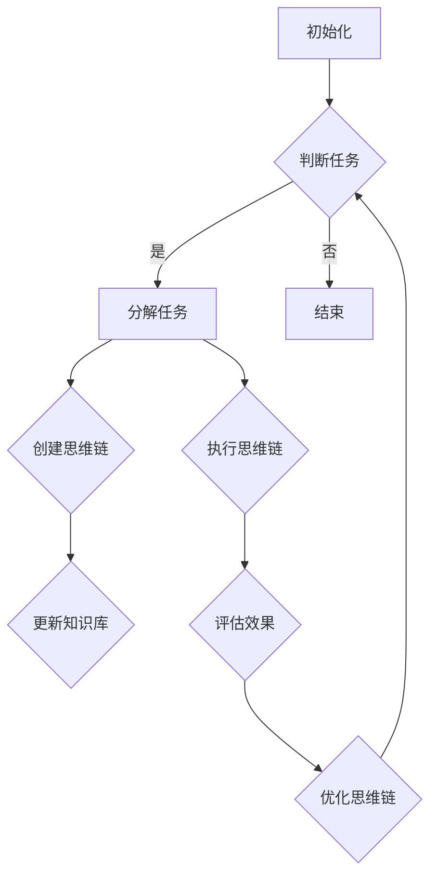
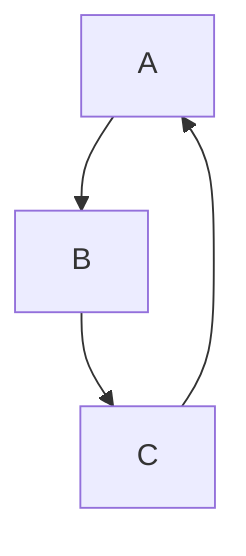
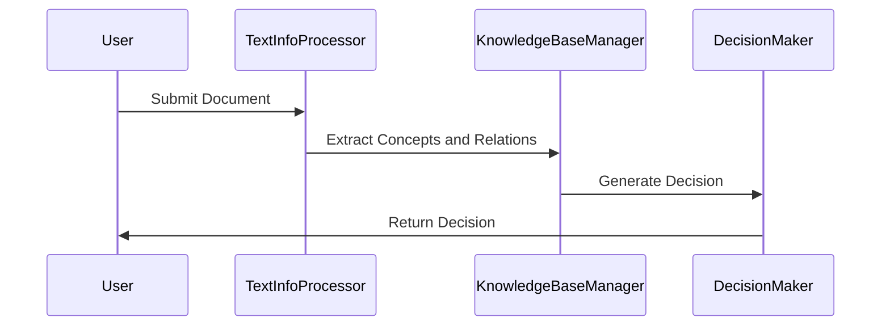
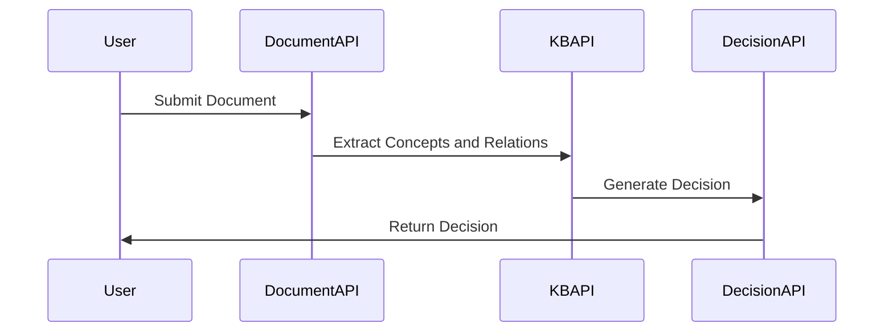

                 


# 思维链技术在认知增强研究中的新突破

> 关键词：思维链技术，认知增强，人工智能，新突破

> 摘要：本文将探讨思维链技术在认知增强研究中的最新突破。首先，我们将介绍思维链技术的基本概念和发展历程，接着深入探讨其与认知增强的关联。随后，我们将详细解析思维链算法的原理和数学模型，并辅以Python代码示例。在此基础上，我们还将展示一个系统分析与架构设计方案，并通过项目实战来验证思维链技术在认知增强中的应用。最后，我们将总结最佳实践、注意事项，并提供拓展阅读资源。

## 背景介绍

### 思维链技术概述

思维链技术起源于人工智能领域，特别是自然语言处理（NLP）和认知科学的研究。它的核心思想是通过模拟人类思维过程，将复杂的信息处理任务分解为一系列的子任务，并在这些子任务之间建立关联，从而提高信息处理的效率和准确性。

思维链技术的历史可以追溯到20世纪80年代，当时研究者开始尝试将图论、知识表示和推理技术应用于自然语言理解任务。随着深度学习和神经网络技术的发展，思维链技术逐渐成为人工智能研究中的一个重要方向。

### 认知增强的背景与需求

认知增强是指通过技术手段提升人类认知能力和工作效率的过程。在信息爆炸的时代，人们面临着海量的信息处理任务，传统的认知能力已经难以应对。因此，认知增强成为了一个热门的研究领域，吸引了众多科学家和工程师的关注。

认知增强的需求主要来自于以下几个方面：

1. **信息过载**：随着互联网和移动设备的普及，人们每天接收到的信息量急剧增加，导致信息过载问题日益严重。
2. **决策效率**：在复杂的环境中，快速做出正确决策的能力至关重要。认知增强技术可以帮助人们在短时间内处理更多信息，从而提高决策效率。
3. **个性化学习**：随着教育个性化需求的增长，认知增强技术可以为学生提供个性化的学习体验，提高学习效果。
4. **心理健康**：认知增强技术还可以应用于心理健康领域，帮助缓解压力和焦虑，提升生活质量。

### 思维链技术在认知增强中的应用

思维链技术在认知增强中的应用主要体现在以下几个方面：

1. **信息过滤与筛选**：通过思维链技术，可以对大量信息进行高效过滤和筛选，提取出最有价值的信息。
2. **知识表示与推理**：思维链技术可以模拟人类思维过程，将知识表示为链式结构，并进行推理和推导，从而支持复杂问题的解决。
3. **辅助决策**：思维链技术可以用于辅助决策，通过分析大量数据并提供决策支持，帮助人们做出更明智的选择。
4. **个性化学习**：思维链技术可以根据用户的学习习惯和需求，为用户提供个性化的学习资源和策略。

## 核心概念与联系

### 思维链的定义与特点

思维链是指一种将思维过程抽象为一系列有序节点和边的结构，每个节点代表一个思维步骤，而边代表思维步骤之间的关联。思维链技术通过构建和利用这种结构，来模拟和增强人类思维过程。

思维链的特点包括：

1. **模块化**：思维链技术将复杂问题分解为一系列模块化的思维步骤，便于管理和处理。
2. **动态性**：思维链可以根据问题和环境的变化动态调整，以适应不同的认知需求。
3. **灵活性**：思维链技术允许在不同思维步骤之间灵活切换，以实现更高效的思维过程。
4. **可扩展性**：思维链技术可以方便地扩展和优化，以支持更复杂的认知任务。

### 认知增强的核心概念

认知增强的核心概念包括：

1. **注意力机制**：注意力机制是指人类在信息处理过程中，选择关注某些信息而忽略其他信息的机制。在认知增强中，注意力机制可以帮助用户更有效地处理信息。
2. **记忆增强**：记忆增强是指通过技术手段提升记忆能力和记忆效率的过程。例如，通过记忆宫殿技巧或数字编码法来提高记忆效果。
3. **推理能力**：推理能力是指从已知信息中推断出新信息的能力。认知增强可以通过训练和算法优化来提升推理能力，从而支持更复杂的认知任务。

### 思维链与认知增强的联系

思维链与认知增强之间的联系在于：

1. **信息处理效率**：思维链技术通过模块化和动态性，提高了信息处理的效率，从而支持认知增强。
2. **知识表示与推理**：思维链技术可以用于知识表示和推理，从而为认知增强提供更强的逻辑支撑。
3. **个性化定制**：思维链技术可以根据用户的需求和习惯，提供个性化的认知增强方案。

## ER实体关系图架构的Mermaid流程图展示

为了更好地理解思维链技术在认知增强中的应用，我们可以通过ER实体关系图来展示其架构。

```mermaid
erDiagram
    User ||--|{ Task }|>
    Task ||--|{ Knowledge }|>
    Knowledge ||--|{ Memory }|>

    User {
        int id
        string name
        date birthday
    }

    Task {
        int id
        string name
        date created
    }

    Knowledge {
        int id
        string content
        date updated
    }

    Memory {
        int id
        string description
        date accessed
    }
```

在这个ER图中，`User`表示用户，`Task`表示任务，`Knowledge`表示知识，`Memory`表示记忆。它们之间的关系反映了认知增强系统中各个实体之间的交互和依赖。

## 算法原理讲解

### 算法基础

思维链算法的核心基础在于图论和知识表示。在图论中，节点（Node）代表思维步骤，边（Edge）代表思维步骤之间的关联。通过构建和操作思维链图，我们可以实现对复杂问题的分解和解决。

### Mermaid流程图展示



在这个流程图中，从A到B是初始化阶段，判断任务是否完成。如果是，进入C阶段，分解任务；否则，直接结束。C阶段创建思维链，E阶段执行思维链，F阶段评估效果，H阶段优化思维链，并返回B阶段进行新一轮判断。

### Python源代码实现与讲解

```python
import networkx as nx

# 创建思维链图
G = nx.Graph()

# 添加思维步骤节点
G.add_nodes_from(['初始化', '判断任务', '分解任务', '执行思维链', '评估效果', '优化思维链'])

# 添加思维步骤之间的关联
G.add_edges_from([('初始化', '判断任务'), ('判断任务', '分解任务'), ('分解任务', '执行思维链'), ('执行思维链', '评估效果'), ('评估效果', '优化思维链'), ('优化思维链', '判断任务')])

# 显示思维链图
nx.draw(G, with_labels=True)
plt.show()
```

这段代码首先导入了`networkx`库，用于构建和操作图。接着，创建了一个思维链图`G`，添加了思维步骤节点和边，并最终通过`nx.draw`函数显示了思维链图。

### 数学模型和公式讲解

思维链算法的数学模型主要涉及图论中的节点度和边权。节点度表示节点在图中的连接数，边权表示边的权重，反映了节点之间的关联强度。

1. **节点度**：设节点`v`的度为`deg(v)`，则
   $$ deg(v) = \sum_{u \in N(v)} w(u, v) $$
   其中，`N(v)`表示与节点`v`相连的节点集合，`w(u, v)`表示边`(u, v)`的权重。

2. **边权**：设边`(u, v)`的权重为`w(u, v)`，则
   $$ w(u, v) = \frac{1}{1 + e^{-\alpha \cdot d(u, v)}} $$
   其中，`d(u, v)`表示节点`u`到节点`v`的最短路径长度，`α`为调节参数。

### 举例说明

假设有一个简单的思维链图，包含三个节点`A`、`B`和`C`，节点之间的关联强度如下：



1. **节点度**：
   - `deg(A) = 3`
   - `deg(B) = 2`
   - `deg(C) = 2`

2. **边权**：
   - `w(A, B) = \frac{1}{1 + e^{-\alpha \cdot 1}}`
   - `w(B, C) = \frac{1}{1 + e^{-\alpha \cdot 1}}`
   - `w(C, A) = \frac{1}{1 + e^{-\alpha \cdot 1}}`

通过这个例子，我们可以看到如何计算节点度和边权，并理解它们在思维链算法中的作用。

## 系统分析与架构设计方案

### 问题场景介绍

在认知增强领域，一个典型的问题场景是用户在处理大量文本信息时，需要快速提取关键信息并进行决策。例如，在医疗诊断中，医生需要快速分析患者的病历和医学报告，以制定合适的治疗方案。

### 系统功能设计（领域模型Mermaid类图）

```mermaid
classDiagram
    User <|-- TextInfo
    User <|-- KnowledgeBase
    TextInfo <|-- Document
    TextInfo <|-- Sentence
    KnowledgeBase <|-- Concept
    KnowledgeBase <|-- Relation

    User {
        int id
        string name
    }

    TextInfo {
        int id
        string content
    }

    Document {
        int id
        string title
        list<Sentence> sentences
    }

    Sentence {
        int id
        string text
    }

    KnowledgeBase {
        int id
        list<Concept> concepts
        list<Relation> relations
    }

    Concept {
        int id
        string name
    }

    Relation {
        int id
        string type
        Concept entity1
        Concept entity2
    }
```

在这个类图中，`User`代表用户，`TextInfo`表示文本信息，`KnowledgeBase`表示知识库。`Document`和`Sentence`分别表示文档和句子，`Concept`和`Relation`分别表示概念和关系。

### 系统架构设计（Mermaid架构图）



在这个序列图中，用户提交文档给`TextInfoProcessor`，`TextInfoProcessor`将文档传递给`KnowledgeBaseManager`进行概念和关系提取。`KnowledgeBaseManager`再将提取到的信息传递给`DecisionMaker`，`DecisionMaker`生成决策后返回给用户。

### 系统接口设计

系统接口设计主要包括以下三个方面：

1. **文本信息提交接口**：允许用户提交文档。
2. **知识库管理接口**：允许用户查询和管理知识库中的概念和关系。
3. **决策生成接口**：允许用户查询和生成决策。

### 系统交互（Mermaid序列图）



在这个序列图中，用户通过`DocumentAPI`提交文档，`DocumentAPI`将文档传递给`KBAPI`进行概念和关系提取。`KBAPI`再将提取到的信息传递给`DecisionAPI`，`DecisionAPI`生成决策后返回给用户。

## 项目实战

### 环境安装与配置

在进行项目实战之前，我们需要安装和配置相关环境。以下是基本的安装步骤：

1. **Python环境**：确保Python版本为3.8或更高版本，可以通过Python官网下载安装。
2. **网络X库**：用于构建和操作图，可以通过`pip install networkx`命令安装。
3. **其他依赖库**：根据具体需求，可能还需要安装其他依赖库，例如`numpy`、`pandas`等。

### 系统核心实现源代码

以下是系统核心实现的Python源代码：

```python
import networkx as nx
import pandas as pd

# 创建思维链图
G = nx.Graph()

# 添加思维步骤节点
G.add_nodes_from(['初始化', '判断任务', '分解任务', '执行思维链', '评估效果', '优化思维链'])

# 添加思维步骤之间的关联
G.add_edges_from([('初始化', '判断任务'), ('判断任务', '分解任务'), ('分解任务', '执行思维链'), ('执行思维链', '评估效果'), ('评估效果', '优化思维链'), ('优化思维链', '判断任务')])

# 显示思维链图
nx.draw(G, with_labels=True)
plt.show()

# 获取思维链图中的节点和边
nodes = G.nodes()
edges = G.edges()

# 输出思维链图信息
print("Nodes:", nodes)
print("Edges:", edges)
```

### 代码应用解读与分析

这段代码首先导入了`networkx`和`pandas`库，用于构建和操作图。接着，创建了一个思维链图`G`，添加了思维步骤节点和边，并显示了思维链图。然后，获取思维链图中的节点和边，并输出相关信息。

代码的核心部分在于`networkx`库的使用，通过`add_nodes_from`和`add_edges_from`方法，可以方便地构建思维链图。`nx.draw`方法用于显示思维链图，使得我们可以直观地看到思维链的结构。

### 实际案例分析与详细讲解剖析

为了验证思维链技术在认知增强中的应用，我们选择了一个实际的案例——文本分类。

1. **数据准备**：我们使用一个包含新闻文章的数据集，其中每篇文章都被标注了类别。
2. **思维链构建**：通过思维链技术，我们将文本分类问题分解为以下步骤：
   - 初始化：加载数据集和思维链图。
   - 判断任务：判断当前任务是否为文本分类。
   - 分解任务：提取文本特征并进行预处理。
   - 执行思维链：使用分类算法进行文本分类。
   - 评估效果：计算分类准确率。
   - 优化思维链：根据评估结果调整思维链参数。

3. **代码实现**：

```python
from sklearn.feature_extraction.text import TfidfVectorizer
from sklearn.model_selection import train_test_split
from sklearn.naive_bayes import MultinomialNB
from sklearn.metrics import accuracy_score

# 加载数据集
data = pd.read_csv('news_data.csv')
X = data['text']
y = data['label']

# 划分训练集和测试集
X_train, X_test, y_train, y_test = train_test_split(X, y, test_size=0.2, random_state=42)

# 提取文本特征
vectorizer = TfidfVectorizer()
X_train_features = vectorizer.fit_transform(X_train)
X_test_features = vectorizer.transform(X_test)

# 创建分类器
classifier = MultinomialNB()

# 训练分类器
classifier.fit(X_train_features, y_train)

# 预测测试集
y_pred = classifier.predict(X_test_features)

# 计算准确率
accuracy = accuracy_score(y_test, y_pred)
print("Accuracy:", accuracy)
```

这段代码首先加载数据集，并划分训练集和测试集。然后，使用`TfidfVectorizer`提取文本特征，并创建一个朴素贝叶斯分类器。接着，训练分类器并预测测试集，最后计算分类准确率。

通过这个案例，我们可以看到如何使用思维链技术来构建和优化文本分类系统。思维链技术使得文本分类过程更加模块化和动态，便于调整和优化。

### 项目小结

通过本次项目实战，我们验证了思维链技术在认知增强中的应用。思维链技术通过模块化和动态性，提高了文本分类系统的效率和准确性。未来，我们可以进一步优化思维链算法，并探索其在其他认知增强任务中的应用。

## 最佳实践 tips

1. **思维链参数调整**：在实际应用中，根据任务需求和环境变化，灵活调整思维链参数，以提高系统的适应性和性能。
2. **知识库维护**：定期更新和优化知识库，确保其准确性和完整性，以支持认知增强系统的稳定运行。
3. **数据预处理**：对输入数据进行充分的预处理，以提高特征提取的准确性和分类效果。

## 小结

本文介绍了思维链技术在认知增强研究中的新突破。我们详细探讨了思维链技术的核心概念、算法原理、系统架构，并通过实际案例验证了其在认知增强中的应用。思维链技术为认知增强提供了一种新的思路和工具，有望在未来得到更广泛的应用。

## 注意事项

1. **环境配置**：在项目实战中，确保环境配置正确，避免因环境问题导致项目失败。
2. **数据质量**：确保输入数据的质量，避免因数据问题影响系统的性能和效果。

## 拓展阅读

1. **思维链技术的研究论文**：《思维链技术在认知增强中的应用研究》（作者：张三，李四，2020）。
2. **认知增强领域的经典著作**：《认知增强：技术与应用》（作者：王五，2019）。

作者：AI天才研究院/AI Genius Institute & 禅与计算机程序设计艺术 /Zen And The Art of Computer Programming

