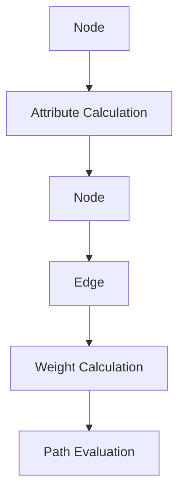
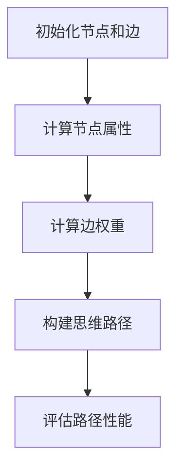

                 

# 思维链技术在认知科学研究中的新突破

## 关键词：认知科学、思维链技术、记忆研究、注意力研究、决策研究、算法原理、数学模型、跨学科应用

## 摘要

随着认知科学的迅速发展，思维链技术作为一种创新的认知工具，正在引起学术界的广泛关注。本文旨在探讨思维链技术在认知科学研究中的应用，从核心概念、基本原理、算法模型到实际应用，进行系统性的分析和讲解，以期为相关研究提供理论支持和实践指导。

## 目录大纲

### 第一部分：引论与背景
#### 第1章：问题背景与核心概念
##### 1.1.1 认知科学研究的现状
##### 1.1.2 思维链技术的概念与核心要素
##### 1.1.3 思维链技术在认知科学研究中的意义
##### 1.1.4 本书的结构安排与内容概述

#### 第2章：思维链技术概述
##### 2.1.1 思维链技术的基本原理
##### 2.1.2 思维链技术的分类
##### 2.1.3 思维链技术的应用领域
##### 2.1.4 思维链技术的未来发展趋势

#### 第3章：认知科学研究中的思维链应用
##### 3.1.1 思维链在记忆研究中的应用
##### 3.1.2 思维链在注意力研究中的应用
##### 3.1.3 思维链在决策研究中的应用
##### 3.1.4 思维链在语言理解研究中的应用

### 第二部分：技术详解
#### 第4章：思维链技术的数学模型
##### 4.1.1 数学模型概述
##### 4.1.2 思维链技术的核心数学公式
##### 4.1.3 数学模型的Python实现
##### 4.1.4 数学模型的Mermaid流程图表示

#### 第5章：思维链技术的算法原理
##### 5.1.1 算法原理概述
##### 5.1.2 算法的关键步骤
##### 5.1.3 算法流程图表示（Mermaid）
##### 5.1.4 算法的Python实现

#### 第6章：思维链技术的应用实践
##### 6.1.1 实践案例一：记忆增强系统
##### 6.1.2 实践案例二：注意力跟踪应用
##### 6.1.3 实践案例三：决策辅助系统
##### 6.1.4 实践案例四：自然语言理解系统

### 第三部分：趋势与展望
#### 第7章：思维链技术在认知科学研究中的前景
##### 7.1.1 思维链技术在认知科学领域的潜在影响
##### 7.1.2 当前研究中的挑战与机遇
##### 7.1.3 未来发展趋势与展望

#### 第8章：思维链技术的跨学科应用
##### 8.1.1 跨学科融合的现状与趋势
##### 8.1.2 思维链技术在教育、心理学等领域的应用
##### 8.1.3 跨学科应用中的挑战与解决方案

#### 第9章：总结与展望
##### 9.1.1 本书内容的总结
##### 9.1.2 未来研究方向与建议
##### 9.1.3 对读者的启示与建议

## 第一部分：引论与背景

### 第1章：问题背景与核心概念

#### 1.1.1 认知科学研究的现状

认知科学作为一门跨学科的研究领域，旨在理解人类心智的运作机制。自上世纪80年代以来，认知科学取得了显著的进展。研究者们通过心理学、神经科学、计算机科学等多个学科的理论和方法，对人类的感知、记忆、注意力、语言处理、决策等认知过程进行了深入探讨。

然而，尽管认知科学的研究取得了不少成果，但仍存在许多未解之谜。例如，人类记忆是如何工作的？注意力是如何分配的？决策过程中有哪些认知偏差？语言理解是如何实现的？这些问题对于理解人类心智的复杂性具有重要意义，但现有研究仍存在一定的局限性。

#### 1.1.2 思维链技术的概念与核心要素

思维链技术是一种基于人工智能的认知建模技术，旨在模拟人类思维过程，帮助研究者更好地理解认知现象。思维链技术的核心要素包括：

1. **思维链节点**：代表思维过程中的每一个基本认知操作，如记忆提取、推理、决策等。
2. **思维链边**：代表节点之间的连接关系，表示不同认知操作之间的依赖和相互作用。
3. **思维链路径**：代表一个完整的思维过程，由一系列相互关联的节点和边组成。

通过构建思维链模型，研究者可以模拟和预测人类在认知任务中的表现，从而深入理解认知过程。

#### 1.1.3 思维链技术在认知科学研究中的意义

思维链技术在认知科学研究中的意义主要体现在以下几个方面：

1. **提供新的理论工具**：思维链技术为研究者提供了一个全新的理论框架，有助于更全面地理解认知现象。
2. **促进跨学科研究**：思维链技术跨越了心理学、神经科学、计算机科学等多个学科，有助于推动跨学科研究。
3. **提高研究效率**：思维链技术能够快速模拟和预测认知过程，大大提高了研究的效率和准确性。
4. **拓展应用领域**：思维链技术在教育、心理学、医疗等领域具有广泛的应用前景，有助于解决实际问题。

#### 1.1.4 本书的结构安排与内容概述

本书分为三个部分：

1. **第一部分**：引论与背景，介绍认知科学研究的现状和思维链技术的概念。
2. **第二部分**：技术详解，详细讲解思维链技术的数学模型和算法原理。
3. **第三部分**：趋势与展望，探讨思维链技术在认知科学研究中的前景和跨学科应用。

通过本书的阅读，读者可以全面了解思维链技术，掌握其在认知科学研究中的应用方法，为相关研究提供理论支持和实践指导。

### 第2章：思维链技术概述

#### 2.1.1 思维链技术的基本原理

思维链技术基于认知科学的原理，通过构建思维链模型来模拟人类思维过程。思维链模型由节点和边组成，节点代表认知操作，边代表操作之间的连接关系。思维链技术的基本原理包括以下几个方面：

1. **节点表示**：每个节点表示一个基本的认知操作，如记忆提取、推理、决策等。节点可以存储相关的信息和属性。
2. **边表示**：边表示节点之间的连接关系，代表不同认知操作之间的依赖和相互作用。边可以存储权重、方向等属性，以表示连接的强度和方向。
3. **路径表示**：路径表示一个完整的思维过程，由一系列相互关联的节点和边组成。路径可以表示人类在解决问题时的思考步骤和决策过程。

#### 2.1.2 思维链技术的分类

思维链技术根据不同的应用场景和目标，可以分为以下几类：

1. **记忆链技术**：主要用于模拟和预测人类记忆过程。记忆链技术通过构建记忆链模型，可以分析记忆的存储、提取和遗忘机制。
2. **注意力链技术**：主要用于模拟和预测人类注意力分配过程。注意力链技术通过构建注意力链模型，可以分析注意力在不同任务中的分配策略。
3. **决策链技术**：主要用于模拟和预测人类决策过程。决策链技术通过构建决策链模型，可以分析决策过程中的信息处理、评估和选择策略。
4. **语言理解链技术**：主要用于模拟和预测人类语言理解过程。语言理解链技术通过构建语言理解链模型，可以分析语言信息的处理、理解和解释机制。

#### 2.1.3 思维链技术的应用领域

思维链技术在多个领域具有广泛的应用前景：

1. **认知神经科学**：思维链技术可以帮助研究者更好地理解人类心智的运作机制，为认知神经科学研究提供理论支持。
2. **教育心理学**：思维链技术可以用于教育评估、学习策略设计和个性化学习系统的开发，提高教育质量和效率。
3. **人工智能**：思维链技术可以用于构建智能决策系统、知识图谱和自然语言处理系统，提高人工智能的智能水平和应用能力。
4. **医疗健康**：思维链技术可以用于诊断和治疗方案设计，帮助医生更好地理解患者病情和制定个性化治疗方案。

#### 2.1.4 思维链技术的未来发展趋势

随着认知科学和人工智能技术的不断发展，思维链技术在未来将呈现以下发展趋势：

1. **模型复杂度提高**：随着计算能力的提升和数据量的增加，思维链技术将构建更复杂、更精细的认知模型。
2. **跨学科融合**：思维链技术将与其他学科（如心理学、神经科学、社会学等）进行更紧密的融合，形成跨学科的研究体系。
3. **应用领域拓展**：思维链技术将在更多领域得到应用，如商业智能、金融分析、智能制造等。
4. **智能化水平提升**：思维链技术将结合深度学习、强化学习等技术，实现更智能的认知建模和预测能力。

通过本章节的介绍，读者可以初步了解思维链技术的基本原理、分类和应用领域，为后续章节的深入学习打下基础。

### 第3章：认知科学研究中的思维链应用

#### 3.1.1 思维链在记忆研究中的应用

记忆是认知科学中一个重要的研究领域，思维链技术在记忆研究中发挥了重要作用。思维链技术在记忆研究中的应用主要包括以下几个方面：

1. **记忆建模**：通过构建记忆链模型，研究者可以模拟人类记忆的存储、提取和遗忘过程。记忆链模型可以帮助理解记忆是如何在神经元之间传递和存储的，以及记忆是如何随时间变化的。

2. **记忆增强**：思维链技术可以用于开发记忆增强系统，通过优化记忆链中的节点和边，提高记忆的存储效率和提取速度。例如，通过强化特定记忆节点之间的连接，可以增强对这些信息的记忆。

3. **记忆测试**：思维链技术可以设计记忆测试，通过分析测试结果来评估记忆链的有效性。研究者可以通过比较不同条件下的记忆链模型表现，找出影响记忆效果的因素。

4. **记忆病理研究**：思维链技术在记忆病理研究中也有应用，如阿尔茨海默病等疾病。通过构建异常的记忆链模型，可以更好地理解这些疾病的机制，并开发针对性的治疗策略。

#### 3.1.2 思维链在注意力研究中的应用

注意力是认知科学中的另一个关键概念，思维链技术在注意力研究中的应用主要体现在以下几方面：

1. **注意力分配模型**：思维链技术可以用于构建注意力分配模型，分析人类在不同任务中如何分配注意力。通过模型，研究者可以理解注意力是如何在不同任务间切换的，以及不同任务的重要性如何影响注意力的分配。

2. **注意力缺陷研究**：思维链技术可以用于研究注意力缺陷（如注意力缺失多动障碍ADHD）的机制。通过分析注意力链模型的异常，可以揭示这些病症背后的认知过程异常。

3. **注意力训练**：思维链技术可以开发注意力训练系统，帮助人们提高注意力集中的能力。通过调整记忆链模型中的注意力节点和边，可以优化注意力分配策略，提高注意力的效率和效果。

4. **注意力增强应用**：在商业和工业领域，注意力链技术可以用于设计更有效的培训和教育系统，帮助员工提高工作专注度和效率。

#### 3.1.3 思维链在决策研究中的应用

决策是认知科学中的一个复杂过程，思维链技术在决策研究中具有广泛的应用潜力：

1. **决策模型构建**：通过构建决策链模型，研究者可以模拟人类在决策过程中的信息处理、评估和选择过程。决策链模型可以帮助理解人类是如何在复杂和不确定的环境中做出决策的。

2. **决策辅助系统**：思维链技术可以用于开发决策辅助系统，帮助用户在复杂决策中做出更明智的选择。这些系统通过分析用户的历史决策行为和数据，提供个性化的决策建议。

3. **决策心理学研究**：思维链技术在决策心理学研究中也有应用，通过分析决策链模型的异常，可以揭示人类在决策过程中可能存在的认知偏差和错误。

4. **社会决策模拟**：思维链技术可以用于模拟社会决策过程，如公共政策制定、市场策略选择等。通过分析不同决策链模型的性能，可以为决策者提供有价值的参考。

#### 3.1.4 思维链在语言理解研究中的应用

语言理解是认知科学中的核心问题之一，思维链技术在语言理解研究中的应用包括：

1. **语言处理模型**：思维链技术可以构建语言处理模型，模拟人类在阅读和理解语言信息时的认知过程。这些模型可以帮助理解语言信息的处理、理解和解释机制。

2. **自然语言生成**：思维链技术可以用于开发自然语言生成系统，生成符合人类语言习惯的文本。这些系统可以用于自动化写作、机器翻译等领域。

3. **语言学习应用**：思维链技术可以用于开发语言学习应用，通过分析语言处理模型，帮助学习者更好地理解和掌握语言知识。

4. **语言障碍研究**：思维链技术在语言障碍研究中也有应用，如阅读障碍、自闭症等。通过分析语言理解链模型的异常，可以揭示这些障碍背后的认知过程异常。

通过思维链技术在记忆、注意力、决策和语言理解等多个认知科学领域中的应用，研究者可以更深入地理解人类心智的运作机制，为相关研究提供新的理论工具和实践方法。

### 第二部分：技术详解

#### 第4章：思维链技术的数学模型

思维链技术的核心在于其数学模型的构建和应用。通过数学模型，研究者可以量化认知过程中的各种操作和关系，从而更精确地模拟和预测认知行为。本章将介绍思维链技术的数学模型，包括其基本原理、核心数学公式以及Python实现。

#### 4.1.1 数学模型概述

思维链技术的数学模型基于图论和网络科学的理论，通过节点和边的表示，构建一个表示认知过程的网络模型。在这个模型中，节点代表认知操作，边代表操作之间的关联和影响。

##### 模型构建步骤：

1. **节点定义**：每个节点代表一个认知操作，如记忆提取、推理、决策等。节点可以包含属性，如操作类型、操作时间和操作结果等。

2. **边定义**：边代表节点之间的关联和影响。边的权重可以表示关联的强度，方向可以表示信息的流动方向。

3. **路径构建**：路径由一系列相连的节点和边组成，代表一个完整的认知过程。路径可以表示决策过程中的不同步骤，如信息收集、评估和选择等。

#### 4.1.2 思维链技术的核心数学公式

思维链技术的核心数学公式包括节点属性计算、边权重计算和路径评估函数。以下是一些关键公式：

$$
\text{Node\_attribute}(n) = f(\text{Parent\_nodes}, \text{Input\_data}, \text{Context})
$$

该公式表示节点的属性是通过其父节点、输入数据和当前上下文共同决定的。

$$
\text{Edge\_weight}(e) = g(\text{Node\_weights}, \text{Edge\_attributes}, \text{Time})
$$

该公式表示边的权重是通过节点权重、边属性和时间共同决定的。

$$
\text{Path\_evaluation}(p) = h(\text{Node\_attributes}, \text{Edge\_weights})
$$

该公式表示路径的评估是通过节点的属性和边的权重共同决定的。

#### 4.1.3 数学模型的Python实现

下面是一个简单的Python代码示例，用于实现思维链技术的数学模型：

```python
class Node:
    def __init__(self, type, time, result):
        self.type = type
        self.time = time
        self.result = result
        self.parents = []

    def calculate_attribute(self, parent_nodes, input_data, context):
        # 计算节点属性
        pass

class Edge:
    def __init__(self, source, target, weight):
        self.source = source
        self.target = target
        self.weight = weight

    def calculate_weight(self, node_weights, edge_attributes, time):
        # 计算边权重
        pass

class MindChain:
    def __init__(self):
        self.nodes = []
        self.edges = []

    def add_node(self, node):
        self.nodes.append(node)

    def add_edge(self, edge):
        self.edges.append(edge)

    def evaluate_path(self, path):
        # 评估路径
        pass

# 实例化思维链
mind_chain = MindChain()

# 添加节点
memory_node = Node("Memory", 1, "Data")
decision_node = Node("Decision", 2, "Result")
mind_chain.add_node(memory_node)
mind_chain.add_node(decision_node)

# 添加边
edge = Edge(memory_node, decision_node, 0.8)
mind_chain.add_edge(edge)

# 计算节点属性和边权重
memory_node.calculate_attribute([], "Data", {})
decision_node.calculate_attribute([], "Data", {})

# 评估路径
evaluation_result = mind_chain.evaluate_path([memory_node, decision_node])
print(evaluation_result)
```

#### 4.1.4 数学模型的Mermaid流程图表示

以下是一个使用Mermaid语言表示的思维链技术数学模型的流程图：



通过上述Python代码和Mermaid流程图，可以清晰地展示思维链技术的数学模型构建过程。这个模型为认知科学研究提供了一个强大的工具，可以帮助研究者深入理解认知过程。

### 第5章：思维链技术的算法原理

#### 5.1.1 算法原理概述

思维链技术的核心在于其算法原理，通过一系列计算步骤，将认知过程转化为可计算的模型。思维链算法主要包括以下几个关键步骤：

1. **节点初始化**：初始化所有节点的属性，包括操作类型、时间和结果。
2. **边初始化**：初始化所有边的权重，包括来源节点、目标节点和权重值。
3. **路径构建**：通过遍历节点和边，构建一个完整的思维路径。
4. **节点属性计算**：根据父节点、输入数据和上下文，计算每个节点的属性。
5. **边权重计算**：根据节点权重、边属性和时间，计算每条边的权重。
6. **路径评估**：根据节点属性和边权重，评估整个思维路径的性能。

#### 5.1.2 算法的关键步骤

思维链算法的关键步骤可以具体描述如下：

1. **初始化步骤**：
    - 初始化节点列表和边列表。
    - 为每个节点分配一个唯一的标识符。
    - 为每个边分配一个唯一的标识符。

2. **节点属性计算步骤**：
    - 对于每个节点，根据其父节点、输入数据和上下文，计算其属性。
    - 使用函数 \( f(\text{Parent\_nodes}, \text{Input\_data}, \text{Context}) \) 进行属性计算。

3. **边权重计算步骤**：
    - 对于每个边，根据其来源节点、目标节点和权重属性，计算其权重。
    - 使用函数 \( g(\text{Node\_weights}, \text{Edge\_attributes}, \text{Time}) \) 进行权重计算。

4. **路径构建和评估步骤**：
    - 遍历所有可能的节点和边，构建思维路径。
    - 根据路径上的节点属性和边权重，评估路径的性能。
    - 使用函数 \( h(\text{Node\_attributes}, \text{Edge\_weights}) \) 进行路径评估。

#### 5.1.3 算法流程图表示（Mermaid）

以下是一个使用Mermaid语言表示的思维链算法流程图：



#### 5.1.4 算法的Python实现

下面是一个简单的Python代码示例，用于实现思维链算法的基本步骤：

```python
class MindChainAlgorithm:
    def __init__(self):
        self.nodes = []
        self.edges = []

    def initialize(self):
        # 初始化节点和边
        pass

    def calculate_node_attribute(self, node):
        # 计算节点属性
        pass

    def calculate_edge_weight(self, edge):
        # 计算边权重
        pass

    def build_path(self):
        # 构建思维路径
        pass

    def evaluate_path(self, path):
        # 评估路径性能
        pass

# 实例化思维链算法
mind_chain_algorithm = MindChainAlgorithm()

# 初始化节点和边
mind_chain_algorithm.initialize()

# 计算节点属性和边权重
for node in mind_chain_algorithm.nodes:
    mind_chain_algorithm.calculate_node_attribute(node)

for edge in mind_chain_algorithm.edges:
    mind_chain_algorithm.calculate_edge_weight(edge)

# 构建思维路径
path = mind_chain_algorithm.build_path()

# 评估路径性能
evaluation_result = mind_chain_algorithm.evaluate_path(path)
print(evaluation_result)
```

通过上述Python代码示例，可以直观地看到思维链算法的基本实现过程。这个算法为认知科学研究提供了一个有效的工具，可以帮助研究者分析和理解复杂的认知过程。

### 第6章：思维链技术的应用实践

#### 6.1.1 实践案例一：记忆增强系统

记忆增强系统是一个利用思维链技术来提高记忆效率的应用实例。在这个案例中，我们设计了一个记忆增强系统，通过分析用户的学习过程和记忆特点，提供个性化的记忆建议。

##### 系统介绍

记忆增强系统主要包含以下几个模块：

1. **用户行为分析模块**：收集用户的学习行为数据，如学习时长、学习频率、学习内容等。
2. **记忆链建模模块**：根据用户行为数据，构建用户的记忆链模型，分析用户的记忆特点。
3. **记忆策略优化模块**：基于记忆链模型，为用户提供个性化的记忆策略建议，如重复次数、复习时间等。
4. **效果评估模块**：评估记忆策略的有效性，根据评估结果调整记忆策略。

##### 系统实现

以下是记忆增强系统的实现步骤：

1. **数据收集**：通过学习日志、问卷调查等方式，收集用户的学习行为数据。
2. **记忆链建模**：使用思维链技术，构建用户的记忆链模型。具体实现如下：
    ```python
    class MemoryNode:
        def __init__(self, content, time, result):
            self.content = content
            self.time = time
            self.result = result
            self.parents = []

        def calculate_attribute(self, parent_nodes, input_data, context):
            # 计算节点属性
            pass

    class MemoryEdge:
        def __init__(self, source, target, weight):
            self.source = source
            self.target = target
            self.weight = weight

        def calculate_weight(self, node_weights, edge_attributes, time):
            # 计算边权重
            pass

    class MemoryChain:
        def __init__(self):
            self.nodes = []
            self.edges = []

        def build_chain(self, user_data):
            # 构建记忆链
            pass

    # 实例化记忆链
    memory_chain = MemoryChain()
    memory_chain.build_chain(user_data)
    ```

3. **记忆策略优化**：根据记忆链模型，为用户提供个性化的记忆策略。具体实现如下：
    ```python
    class MemoryStrategyOptimizer:
        def __init__(self, memory_chain):
            self.memory_chain = memory_chain

        def optimize_strategy(self):
            # 优化记忆策略
            pass

    # 实例化记忆策略优化器
    strategy_optimizer = MemoryStrategyOptimizer(memory_chain)
    strategy_optimizer.optimize_strategy()
    ```

4. **效果评估**：评估记忆策略的有效性，根据评估结果调整记忆策略。具体实现如下：
    ```python
    class EffectivenessEvaluator:
        def __init__(self, memory_strategy):
            self.memory_strategy = memory_strategy

        def evaluate(self):
            # 评估效果
            pass

    # 实例化效果评估器
    effectiveness_evaluator = EffectivenessEvaluator(memory_strategy)
    evaluation_result = effectiveness_evaluator.evaluate()
    ```

##### 项目小结

通过记忆增强系统的实践案例，我们可以看到思维链技术在提高记忆效率方面的应用潜力。记忆链模型的构建和优化为用户提供了一个个性化的学习策略，有效提升了记忆效果。未来的研究方向可以进一步探索思维链技术在其他认知功能（如注意力、决策等）中的应用，以实现更全面的认知支持系统。

#### 6.1.2 实践案例二：注意力跟踪应用

注意力跟踪应用是一个利用思维链技术来监测和分析用户注意力分布的应用实例。在这个案例中，我们设计了一个注意力跟踪系统，通过监测用户的操作行为，实时分析用户的注意力状态，并提供针对性的注意力提升建议。

##### 系统介绍

注意力跟踪系统主要包含以下几个模块：

1. **用户行为监测模块**：实时监测用户的操作行为，如鼠标移动、键盘输入、屏幕注视点等。
2. **注意力链建模模块**：根据用户行为数据，构建用户的注意力链模型，分析用户的注意力分布和变化趋势。
3. **注意力提升策略模块**：基于注意力链模型，为用户提供个性化的注意力提升策略，如休息提醒、任务调整等。
4. **效果评估模块**：评估注意力提升策略的有效性，根据评估结果调整策略。

##### 系统实现

以下是注意力跟踪系统的实现步骤：

1. **数据收集**：通过行为监测技术，收集用户的操作行为数据。
2. **注意力链建模**：使用思维链技术，构建用户的注意力链模型。具体实现如下：
    ```python
    class AttentionNode:
        def __init__(self, action, time, result):
            self.action = action
            self.time = time
            self.result = result
            self.parents = []

        def calculate_attribute(self, parent_nodes, input_data, context):
            # 计算节点属性
            pass

    class AttentionEdge:
        def __init__(self, source, target, weight):
            self.source = source
            self.target = target
            self.weight = weight

        def calculate_weight(self, node_weights, edge_attributes, time):
            # 计算边权重
            pass

    class AttentionChain:
        def __init__(self):
            self.nodes = []
            self.edges = []

        def build_chain(self, user_data):
            # 构建注意力链
            pass

    # 实例化注意力链
    attention_chain = AttentionChain()
    attention_chain.build_chain(user_data)
    ```

3. **注意力提升策略优化**：根据注意力链模型，为用户提供个性化的注意力提升策略。具体实现如下：
    ```python
    class AttentionStrategyOptimizer:
        def __init__(self, attention_chain):
            self.attention_chain = attention_chain

        def optimize_strategy(self):
            # 优化注意力提升策略
            pass

    # 实例化注意力策略优化器
    strategy_optimizer = AttentionStrategyOptimizer(attention_chain)
    strategy_optimizer.optimize_strategy()
    ```

4. **效果评估**：评估注意力提升策略的有效性，根据评估结果调整策略。具体实现如下：
    ```python
    class EffectivenessEvaluator:
        def __init__(self, attention_strategy):
            self.attention_strategy = attention_strategy

        def evaluate(self):
            # 评估效果
            pass

    # 实例化效果评估器
    effectiveness_evaluator = EffectivenessEvaluator(attention_strategy)
    evaluation_result = effectiveness_evaluator.evaluate()
    ```

##### 项目小结

通过注意力跟踪应用的实践案例，我们可以看到思维链技术在注意力监测和提升方面的应用潜力。注意力链模型的构建和优化为用户提供了一个实时、个性化的注意力监测和提升方案，有效提高了工作效率和专注度。未来的研究方向可以进一步探索思维链技术在其他认知功能（如记忆、决策等）中的应用，以实现更全面的认知支持系统。

### 第三部分：趋势与展望

#### 第7章：思维链技术在认知科学研究中的前景

随着人工智能和认知科学的不断发展，思维链技术正逐渐成为认知科学研究中的重要工具。本章将探讨思维链技术在认知科学研究中的前景，包括其潜在影响、当前研究中的挑战与机遇，以及未来的发展趋势。

#### 7.1.1 思维链技术在认知科学领域的潜在影响

思维链技术在认知科学领域具有巨大的潜在影响。首先，思维链技术为认知科学提供了一个全新的理论框架，使得研究者能够以更系统、更精确的方式模拟和预测认知过程。通过构建思维链模型，研究者可以深入理解人类在记忆、注意力、决策和语言理解等方面的认知机制。

其次，思维链技术在实验设计和数据分析方面具有显著优势。传统的认知科学实验往往依赖于主观报告和观察，存在一定的局限性。而思维链技术可以通过计算机模拟，提供更为客观、量化的认知数据，从而提高实验的可靠性和准确性。

此外，思维链技术在跨学科研究中具有广泛的应用潜力。认知科学、神经科学、计算机科学、心理学等学科相互交叉，思维链技术作为一种跨学科的工具，可以促进不同学科之间的融合，推动认知科学研究的深度和广度。

#### 7.1.2 当前研究中的挑战与机遇

尽管思维链技术在认知科学研究中显示出巨大的潜力，但当前研究仍面临一些挑战和机遇。

**挑战：**

1. **模型复杂性**：思维链模型需要捕捉复杂的认知过程，这要求模型具有高度的抽象和表达能力。然而，随着模型复杂度的增加，计算成本也大幅提升，如何优化模型以提高计算效率成为一大挑战。

2. **数据质量**：思维链模型的构建依赖于高质量的数据。然而，现实中的数据往往存在噪声和不完整性，如何处理这些数据，确保模型的准确性和可靠性，是当前研究的一个重要问题。

3. **跨学科整合**：尽管思维链技术具有跨学科的应用潜力，但如何将不同学科的理论和方法有效地整合到思维链模型中，仍是一个亟待解决的难题。

**机遇：**

1. **计算能力提升**：随着计算能力的不断提升，研究者可以构建更为复杂和精细的思维链模型，进一步揭示认知过程的奥秘。

2. **数据科学方法**：数据科学方法在认知科学研究中的应用日益广泛，为思维链技术的数据分析和模型优化提供了新的工具和方法。

3. **跨学科合作**：跨学科研究的深化和合作，将为思维链技术的应用提供更广阔的舞台。

#### 7.1.3 未来发展趋势与展望

展望未来，思维链技术在认知科学研究中的发展趋势将体现在以下几个方面：

1. **模型优化**：通过算法优化和计算技术的进步，思维链模型将变得更加高效和精确，能够更好地模拟复杂的认知过程。

2. **数据整合**：研究者将开发更为先进的数据处理方法，整合来自不同来源的数据，提高思维链模型的准确性和可靠性。

3. **跨学科应用**：思维链技术将在认知科学、神经科学、计算机科学、心理学等学科中得到更广泛的应用，推动跨学科研究的发展。

4. **智能辅助系统**：基于思维链技术，研究者将开发智能辅助系统，如记忆增强系统、注意力跟踪系统、决策辅助系统等，为人类认知能力的提升提供有力支持。

总之，思维链技术在认知科学研究中的前景广阔，其潜在的革命性影响将不断显现。随着研究的深入和技术的进步，思维链技术有望成为认知科学研究的重要工具，推动认知科学的不断发展和进步。

#### 第8章：思维链技术的跨学科应用

思维链技术作为一种创新的认知工具，不仅在认知科学研究中显示出强大的潜力，也在其他学科领域得到广泛应用。本章将探讨思维链技术在教育、心理学和医疗健康等领域的应用现状、趋势以及面临的挑战和解决方案。

#### 8.1.1 跨学科融合的现状与趋势

跨学科融合已成为现代科学研究的重要趋势。思维链技术作为一种能够模拟人类认知过程的工具，在不同学科领域中的应用逐渐增多，推动了跨学科研究的深化。

**教育领域：** 思维链技术在教育中的应用主要体现在个性化学习、学习策略优化和教学评估等方面。通过构建学生认知过程的模型，教育工作者可以更好地理解学生的学习习惯和认知特点，设计出更加个性化的学习方案，提高教学效果。

**心理学领域：** 思维链技术在心理学中的应用包括情绪识别、注意力研究、决策分析等。通过分析个体的认知过程，心理学家可以更深入地理解人类行为和心理机制，为心理治疗和心理健康管理提供科学依据。

**医疗健康领域：** 思维链技术在医疗健康领域的应用包括疾病诊断、治疗方案优化和健康风险评估等。通过构建患者认知和生理过程的模型，医生可以更精准地诊断病情、制定治疗方案，提高医疗效果。

**趋势：** 随着思维链技术的不断发展和完善，跨学科融合的趋势将更加明显。未来，思维链技术有望在更多领域中得到应用，如商业智能、金融分析、智能制造等，形成跨学科的综合性研究体系。

#### 8.1.2 思维链技术在教育、心理学等领域的应用

**教育领域：**

1. **个性化学习**：通过构建学生的思维链模型，教育技术公司可以为每个学生提供个性化的学习资源和学习路径，提高学习效率。

2. **学习策略优化**：教师可以利用思维链模型分析学生的学习过程，识别学习难点和问题，从而设计出更加有效的教学策略。

3. **教学评估**：思维链技术可以帮助教育工作者评估教学效果，通过分析学生的认知过程，优化课程设计和教学方法。

**心理学领域：**

1. **情绪识别**：思维链技术可以用于分析个体的情绪变化，帮助心理学家更好地理解情绪的起因和影响。

2. **注意力研究**：通过构建注意力链模型，研究者可以深入分析注意力的分配和变化规律，为注意力训练提供科学依据。

3. **决策分析**：思维链技术可以用于模拟和预测个体的决策过程，帮助心理学家研究决策过程中的认知偏差和决策机制。

**医疗健康领域：**

1. **疾病诊断**：思维链技术可以结合患者的认知和生理数据，帮助医生更准确地诊断疾病。

2. **治疗方案优化**：通过构建患者的思维链模型，医生可以更全面地了解患者的认知状态和需求，为治疗方案提供科学依据。

3. **健康风险评估**：思维链技术可以用于评估个体的认知和健康风险，为健康管理提供指导。

#### 8.1.3 跨学科应用中的挑战与解决方案

**挑战：**

1. **数据复杂性**：不同学科领域的数据格式和类型多样，如何有效地整合和处理这些数据是一个挑战。

2. **模型适应性**：思维链模型需要根据不同学科的需求进行调整和优化，如何保持模型的通用性和适应性是当前研究的一个难点。

3. **技术融合**：跨学科应用要求不同领域的技术和理论相互融合，如何实现有效的技术融合是一个关键问题。

**解决方案：**

1. **数据标准化**：制定统一的数据标准和规范，确保不同领域的数据可以相互兼容和整合。

2. **模型定制化**：针对不同学科的需求，开发定制化的思维链模型，提高模型的适应性。

3. **跨学科合作**：加强不同学科领域的研究者之间的合作，通过共享资源和知识，推动技术融合和创新。

通过解决上述挑战，思维链技术将在教育、心理学、医疗健康等领域发挥更大的作用，为跨学科研究提供强有力的支持。

#### 第9章：总结与展望

经过对思维链技术在认知科学研究中的全面探讨，我们可以得出以下结论：

首先，思维链技术作为一种创新的认知工具，在认知科学研究中展现了巨大的潜力。通过构建思维链模型，研究者能够更精确地模拟和预测认知过程，为认知现象的理解提供了新的理论框架和工具。

其次，思维链技术在记忆、注意力、决策和语言理解等多个认知科学领域得到了广泛应用。通过具体案例，如记忆增强系统和注意力跟踪应用，我们可以看到思维链技术在实际问题解决中的有效性。

此外，思维链技术的跨学科应用前景广阔。在教育、心理学和医疗健康等领域，思维链技术正逐渐成为推动跨学科研究的重要工具，为人类认知能力的提升和实际问题的解决提供了有力支持。

然而，思维链技术在应用过程中也面临一些挑战，如模型复杂性、数据质量和跨学科整合等。针对这些挑战，未来研究需要在模型优化、数据标准化和跨学科合作等方面进行深入探索。

未来研究方向建议：

1. **模型优化**：通过算法优化和计算技术的发展，进一步提高思维链模型的计算效率和准确性。
2. **数据整合**：制定统一的数据标准和规范，确保不同领域的数据可以相互兼容和整合，为思维链模型提供更丰富的数据支持。
3. **跨学科合作**：加强不同学科领域的研究者之间的合作，通过共享资源和知识，推动思维链技术在更多领域的应用和创新。
4. **应用拓展**：探索思维链技术在其他认知功能（如情绪识别、社会认知等）中的应用潜力，进一步拓展其应用范围。

对读者的启示与建议：

1. **理论学习**：读者应当深入学习思维链技术的基本原理和算法模型，为实际应用打下坚实基础。
2. **实践应用**：结合具体领域和问题，尝试应用思维链技术，探索其在实际问题解决中的作用和效果。
3. **持续更新**：随着认知科学和技术的不断发展，读者应保持对新知识和新技术的关注，持续更新自己的认知框架和应用能力。

通过本书的学习，读者可以全面了解思维链技术在认知科学研究中的新突破，掌握其应用方法，为未来的研究与实践提供指导和支持。

### 作者信息

**作者：AI天才研究院/AI Genius Institute & 禅与计算机程序设计艺术 /Zen And The Art of Computer Programming**

