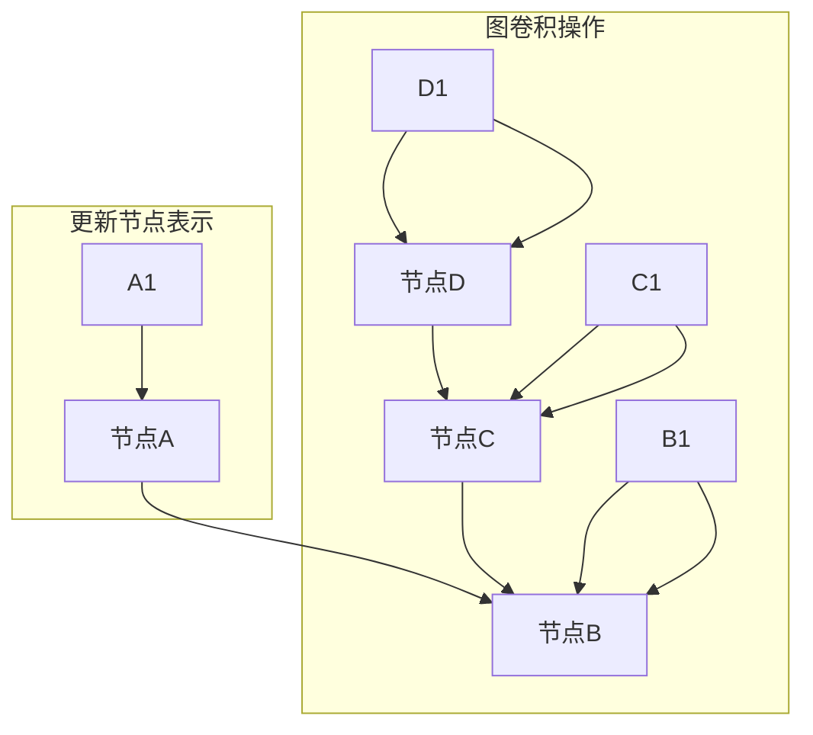
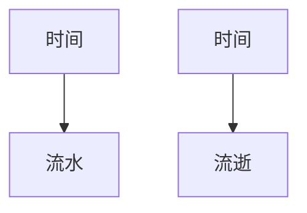
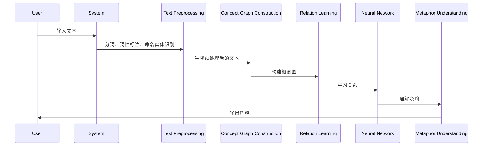

                 

### 第1章: 背景介绍

在人工智能（AI）领域，自然语言处理（NLP）占据着重要的地位。而隐喻作为一种复杂的语言现象，一直是NLP中的一大挑战。隐喻不仅出现在文学作品中，也广泛存在于科学论文、日常对话等多种文本中。因此，如何增强AI的隐喻理解能力，成为一个亟待解决的重要课题。

#### 1.1.1 人工智能与隐喻理解

隐喻理解是NLP中的一个难点，因为它不仅需要理解单词的字面意思，还需要理解其背后的隐喻意义。例如，当人们说“时间像流水一样流逝”时，AI需要理解“时间”和“流水”之间的隐喻关系。

当前，AI在隐喻理解方面存在以下几方面的挑战：

1. **多义性问题**：隐喻往往具有多义性，理解其真正含义需要深入到上下文和背景知识中。
2. **复杂关系**：隐喻中的关系可能涉及多个概念，如何准确地表示和推断这些复杂关系是一个难题。
3. **缺乏标注数据**：由于隐喻的特殊性，现有的标注数据非常有限，这限制了机器学习模型的效果。

#### 1.1.2 隐喻理解在AI中的应用

随着AI技术的不断发展，隐喻理解在多个应用领域中具有重要价值：

1. **智能客服**：智能客服在与用户交流时，需要理解用户可能使用的隐喻，以提供更准确、自然的回答。
2. **机器翻译**：在跨语言翻译中，隐喻的理解和翻译是确保翻译质量的关键。
3. **情感分析**：情感分析需要对文本中的隐喻进行正确理解，以便准确识别文本的情感倾向。

#### 1.2 问题描述

隐喻理解在AI中的挑战主要体现在以下几个方面：

1. **数据不足**：由于隐喻的特殊性，标注数据较少，这使得训练深度学习模型面临困难。
2. **复杂关系处理**：隐喻中的关系复杂多变，如何有效地表示和推理这些关系是当前研究的难点。
3. **上下文依赖**：隐喻的理解往往依赖于上下文信息，如何充分利用上下文信息是一个重要课题。

#### 1.3 问题解决

针对上述挑战，我们提出了一种新的方法——思维链技术，用于增强AI的隐喻理解能力。思维链技术基于图神经网络，通过构建概念图来模拟人类的思维过程，从而实现对隐喻的深刻理解。

#### 1.3.1 思维链技术

思维链技术的工作原理如下：

1. **文本预处理**：首先对输入文本进行预处理，包括分词、词性标注、命名实体识别等。
2. **概念图构建**：根据预处理后的文本，构建概念图，表示文本中的概念及其关系。
3. **关系学习**：利用图神经网络学习概念图中的关系，从而提高隐喻理解的能力。

#### 1.3.2 思维链技术的工作原理

思维链技术的工作原理可以概括为以下几个步骤：

1. **节点表示**：将文本中的每个词作为一个节点，节点的属性包括词的词性、词频等信息。
2. **边表示**：根据文本中的语义关系，建立节点之间的边，表示概念之间的关系。
3. **图神经网络学习**：利用图神经网络学习节点和边的关系，从而实现对隐喻的深刻理解。

#### 1.4 边界与外延

隐喻理解的范围非常广泛，包括文学、科学、日常对话等多个领域。思维链技术作为一种通用方法，可以应用于这些不同的领域。

#### 1.5 概念结构与核心要素组成

隐喻和思维链技术是本文讨论的两个核心概念。隐喻是一种修辞手法，用于表达一种隐含的意义。思维链技术是一种基于图神经网络的方法，用于模拟人类的思维过程，从而提高AI的隐喻理解能力。

#### 1.6 本章小结

本章介绍了隐喻理解在AI中的背景和挑战，以及思维链技术作为解决方案的基本原理和工作机制。思维链技术通过构建概念图和利用图神经网络，为AI的隐喻理解提供了一种新的思路。在接下来的章节中，我们将进一步探讨思维链技术的核心概念和原理，以及其在实际应用中的表现。

---

# 第2章: 核心概念与联系

在深入探讨思维链技术增强AI隐喻理解能力之前，我们需要明确几个核心概念，并理解它们之间的联系。本章将介绍隐喻理解的核心概念以及思维链技术的核心概念，并通过对比表格和ER实体关系图来加深对这些概念的理解。

#### 2.1 隐喻理解的核心概念

隐喻理解是自然语言处理中的一个关键任务，它涉及到多个层面的概念和机制。

##### 2.1.1 隐喻的类型

隐喻可以分为几种不同的类型，每种类型在理解和表达上都有其独特性：

- **暗喻（Concealed Metaphor）**：这种隐喻通常不使用明显的比喻词，而是通过暗示来传达隐喻关系。
- **明喻（Literate Metaphor）**：这种隐喻直接使用比喻词（如“like”或“as”），明确指出隐喻关系。
- **借喻（Symbolic Metaphor）**：这种隐喻使用一个概念来暗示另一个概念，通常涉及文化或社会象征。

##### 2.1.2 隐喻的理解机制

隐喻的理解机制涉及词汇、语境和文化背景等方面：

- **词汇层面**：隐喻依赖于特定的词汇选择，这些词汇具有多义性。
- **语境层面**：隐喻的理解需要上下文信息的支持，语境可以帮助消除歧义。
- **文化背景**：不同文化背景下的隐喻理解和表达可能有所不同。

##### 2.1.3 隐喻理解的特点

隐喻理解具有以下特点：

- **抽象性**：隐喻往往涉及抽象概念之间的关系。
- **多义性**：隐喻的含义可能因上下文和背景知识而异。
- **动态性**：隐喻的理解是一个动态的过程，需要不断调整和适应。

#### 2.2 思维链技术的核心概念

思维链技术是一种基于图神经网络的方法，用于模拟人类的思维过程，从而提高AI的隐喻理解能力。

##### 2.2.1 图神经网络

图神经网络（Graph Neural Network, GNN）是一种专门用于处理图结构数据的神经网络。它通过学习节点和边的关系来模拟复杂的图结构。

- **节点表示**：每个节点表示图中的实体，如词汇或概念。
- **边表示**：每条边表示节点之间的关系，如语义关系或依赖关系。
- **图卷积操作**：图神经网络通过图卷积操作来学习节点和边之间的关系。

##### 2.2.2 概念图

概念图是一种用于表示文本中概念及其关系的图形化工具。它可以帮助我们直观地理解文本中的知识结构。

- **概念节点**：表示文本中的概念。
- **关系边**：表示概念之间的语义关系。
- **层次结构**：概念图通常包含层次结构，表示概念之间的包含和依赖关系。

##### 2.2.3 思维链的工作流程

思维链技术的工作流程包括以下几个阶段：

1. **文本预处理**：对输入文本进行预处理，包括分词、词性标注等。
2. **概念图构建**：根据预处理后的文本，构建概念图。
3. **关系学习**：利用图神经网络学习概念图中的关系。
4. **隐喻理解**：通过学习到的关系，对文本中的隐喻进行理解和解释。

#### 2.3 概念属性特征对比表格

以下是一个简单的概念属性特征对比表格，用于比较隐喻和思维链技术的核心特征：

| 概念         | 特征                                                     | 说明                                                         |
| ------------ | -------------------------------------------------------- | ------------------------------------------------------------ |
| 隐喻         | 抽象性、多义性、动态性                                   | 隐喻作为一种修辞手法，具有独特的属性和特征。                   |
| 图神经网络   | 可扩展性、高维数据表示、灵活的关系学习                     | 图神经网络能够处理复杂的网络结构，适用于隐喻理解。             |
| 概念图       | 概念表示、关系表示、层次结构表示                           | 概念图用于表示文本中的概念及其关系，是思维链技术的重要工具。   |

#### 2.4 ER实体关系图架构

以下是一个ER实体关系图的Mermaid表示，用于展示隐喻理解系统中各个实体之间的关系：

```mermaid
erDiagram
    Customer ||--|{ Order }|--|{ Product }
    Customer ||--|{ Review }|
    Product ||--|{ Category }|
```

在这个ER图中：

- **Customer**（客户）可以创建多个**Order**（订单）和**Review**（评论）。
- **Product**（产品）属于一个**Category**（分类），并且一个**Category**可以包含多个**Product**。

#### 本章小结

本章介绍了隐喻理解的核心概念和思维链技术的核心概念，并对比了它们的属性特征。通过ER实体关系图，我们展示了隐喻理解系统中各个实体之间的关系。这些概念的理解将为后续章节中思维链技术在隐喻理解中的具体应用提供基础。

---

### 第3章: 思维链技术的工作流程

思维链技术是一种基于图神经网络的方法，通过模拟人类的思维过程，来增强AI的隐喻理解能力。本章将详细描述思维链技术的工作流程，包括文本预处理、概念图构建、关系学习以及隐喻理解等阶段。

#### 3.1 文本预处理

文本预处理是思维链技术的第一步，其目的是将原始文本转化为计算机可以处理的形式。具体步骤如下：

1. **分词**：将文本分割成词或短语。分词的方法有多种，如基于词典的分词、基于统计模型分词等。
2. **词性标注**：对每个词进行词性标注，例如名词、动词、形容词等。词性标注有助于后续的概念提取和关系分析。
3. **命名实体识别**：识别文本中的命名实体，如人名、地名、组织名等。命名实体识别对于构建概念图至关重要。

#### 3.2 概念图构建

在文本预处理完成后，我们需要构建概念图来表示文本中的概念及其关系。概念图的构建过程包括以下几个步骤：

1. **实体提取**：从预处理后的文本中提取出关键实体，如名词和命名实体。
2. **关系抽取**：根据实体之间的语义关系，构建实体之间的关系。这些关系可以是直接的，如“属于”关系，也可以是间接的，如“类比”关系。
3. **层次结构构建**：将实体和关系组织成层次结构，表示概念之间的包含和依赖关系。层次结构有助于提高隐喻理解的深度。

#### 3.3 关系学习

关系学习是思维链技术的核心步骤，其目的是利用图神经网络学习概念图中的关系。具体方法如下：

1. **图神经网络模型设计**：设计一个图神经网络模型，用于表示和更新节点和边的关系。
2. **训练数据准备**：准备包含大量文本数据的关系训练集，用于训练图神经网络模型。
3. **模型训练**：利用训练集数据，训练图神经网络模型，使其能够准确学习概念图中的关系。
4. **模型优化**：通过调整模型参数，优化模型性能，使其在隐喻理解任务中表现更好。

#### 3.4 隐喻理解

隐喻理解是思维链技术的最终目标。在完成关系学习后，我们可以利用训练好的模型对新的文本进行隐喻理解。具体步骤如下：

1. **文本预处理**：对输入文本进行预处理，包括分词、词性标注等。
2. **概念图构建**：根据预处理后的文本，构建概念图。
3. **关系推断**：利用训练好的图神经网络模型，推断概念图中的关系，从而实现对隐喻的理解。
4. **解释生成**：根据推断出的关系，生成对隐喻的解释，以便于 humans 和 machines 理解。

#### 3.5 工作流程总结

思维链技术的工作流程可以概括为以下几个步骤：

1. **文本预处理**：将原始文本转化为计算机可以处理的形式。
2. **概念图构建**：从文本中提取关键实体和关系，构建概念图。
3. **关系学习**：利用图神经网络模型学习概念图中的关系。
4. **隐喻理解**：利用训练好的模型对新的文本进行隐喻理解。

通过这些步骤，思维链技术能够有效地模拟人类的思维过程，从而提高AI的隐喻理解能力。

#### 本章小结

本章详细描述了思维链技术的工作流程，从文本预处理、概念图构建、关系学习到隐喻理解，每个步骤都至关重要。思维链技术通过模拟人类的思维过程，为AI的隐喻理解提供了一种新的思路。在接下来的章节中，我们将进一步探讨思维链技术在具体应用中的表现和效果。

---

### 第4章: 算法原理讲解

在理解了思维链技术的工作流程之后，我们接下来将深入探讨其算法原理，包括如何利用图神经网络进行隐喻理解。为了更好地阐述算法原理，我们将使用Mermaid图来展示算法流程，并使用Python代码来解释关键步骤。

#### 4.1 图神经网络基础

图神经网络（GNN）是一种用于处理图结构数据的神经网络，其核心思想是通过图卷积操作来学习节点和边的关系。以下是GNN的基本工作流程：

1. **节点表示**：将图中的每个节点表示为一个向量。
2. **边表示**：将图中的每条边表示为一个权重矩阵。
3. **图卷积操作**：通过图卷积操作来更新节点表示，从而学习节点和边之间的关系。

#### 4.2 Mermaid图表示

以下是一个简单的Mermaid图，用于表示GNN的基本工作流程：



在这个图中，每个节点（如A、B、C、D）都有一个向量表示，每条边（如A->B、C->B、D->C）都有一个权重矩阵。图卷积操作用于更新节点表示，使得节点能够学习到其他节点的关系。

#### 4.3 Python代码实现

以下是一个简单的Python代码示例，用于实现GNN的基本算法原理：

```python
import numpy as np

# 初始化节点表示和边权重
nodes = np.array([[1, 0], [0, 1], [1, 1], [1, 0]])
edges = np.array([[0, 1], [1, 2], [2, 3]])

# 定义图卷积操作
def graph_convolution(nodes, edges, weight_matrix):
    # 计算节点之间的邻接矩阵
    adj_matrix = np.zeros((nodes.shape[0], nodes.shape[0]))
    for edge in edges:
        adj_matrix[edge[0], edge[1]] = 1
    
    # 更新节点表示
    new_nodes = nodes + np.dot(adj_matrix, weight_matrix)
    return new_nodes

# 训练权重矩阵
weight_matrix = np.array([[0.5, 0.5], [0.5, 0.5]])

# 迭代更新节点表示
for _ in range(3):
    nodes = graph_convolution(nodes, edges, weight_matrix)

# 打印更新后的节点表示
print(nodes)
```

在这个代码中，我们首先初始化节点表示和边权重，然后定义了一个图卷积操作来更新节点表示。通过迭代更新，节点能够逐渐学习到其他节点的关系。

#### 4.4 数学模型和公式

图神经网络的数学模型可以表示为以下公式：

$$
\mathbf{h}_i^{(t+1)} = \sigma(\mathbf{h}_i^{(t)} + \sum_{j \in \mathcal{N}(i)} \alpha_{ij} \mathbf{h}_j^{(t)})
$$

其中：

- $\mathbf{h}_i^{(t)}$ 表示第 $i$ 个节点在第 $t$ 次迭代后的表示向量。
- $\mathcal{N}(i)$ 表示第 $i$ 个节点的邻接节点集合。
- $\alpha_{ij}$ 表示节点 $i$ 和节点 $j$ 之间的权重。
- $\sigma$ 表示激活函数，常用的有ReLU函数和Sigmoid函数。

通过这个公式，我们可以更新节点的表示，使其能够学习到图中的关系。

#### 4.5 举例说明

假设我们有一个简单的文本，其中包含几个概念和它们之间的关系：

- 文本：“时间像流水一样流逝。”
- 概念：时间、流水。
- 关系：时间是流水的一部分。

我们可以使用思维链技术来理解和解释这个隐喻。首先，我们将文本进行预处理，提取出概念和关系。然后，构建概念图并利用图神经网络学习概念之间的关系。最后，通过关系推断来理解隐喻的含义。



在这个概念图中，节点A表示“时间”，节点B表示“流水”，节点C表示“流逝”。通过图神经网络的学习，我们可以推断出时间与流水之间的关系，从而理解隐喻的含义。

#### 本章小结

本章详细讲解了思维链技术的算法原理，包括图神经网络的基础、Mermaid图表示、Python代码实现以及数学模型和公式。通过这些内容，我们了解了思维链技术如何通过模拟人类的思维过程，来增强AI的隐喻理解能力。在接下来的章节中，我们将进一步探讨思维链技术在实际应用中的效果和表现。

---

### 第5章: 系统分析与架构设计方案

为了更好地理解和应用思维链技术，我们需要对系统进行分析和设计。本章将介绍一个基于思维链技术的隐喻理解系统，包括问题场景介绍、项目介绍、系统功能设计、系统架构设计、系统接口设计和系统交互等。

#### 5.1 问题场景介绍

在许多实际应用中，如智能客服、机器翻译和情感分析等，AI需要能够理解并处理隐喻。例如，在智能客服中，用户可能会使用隐喻来表达他们的需求或情感，而AI需要能够正确理解并回应。在机器翻译中，隐喻的翻译是确保翻译质量的关键。在情感分析中，理解隐喻有助于更准确地识别文本的情感倾向。

#### 5.2 项目介绍

我们的项目目标是开发一个基于思维链技术的隐喻理解系统，该系统旨在提高AI在处理隐喻时的准确性和自然度。项目的主要功能包括：

1. 文本预处理：对输入文本进行分词、词性标注和命名实体识别。
2. 概念图构建：从预处理后的文本中提取概念并构建概念图。
3. 关系学习：利用图神经网络学习概念图中的关系。
4. 隐喻理解：根据学习到的关系，对文本中的隐喻进行理解和解释。

#### 5.3 系统功能设计

隐喻理解系统的功能设计可以分为以下几个部分：

1. **文本预处理模块**：负责对输入文本进行分词、词性标注和命名实体识别，为后续步骤提供基础数据。
2. **概念图构建模块**：负责从文本中提取关键实体并构建概念图，表示文本中的概念及其关系。
3. **关系学习模块**：负责利用图神经网络学习概念图中的关系，为隐喻理解提供支持。
4. **隐喻理解模块**：负责根据学习到的关系，对文本中的隐喻进行理解和解释，生成对隐喻的合理解释。

#### 5.4 系统架构设计

隐喻理解系统的架构设计可以分为以下几个层次：

1. **输入层**：接收用户输入的文本，进行预处理。
2. **预处理层**：对输入文本进行分词、词性标注和命名实体识别，生成预处理后的文本数据。
3. **概念图构建层**：根据预处理后的文本数据，提取关键实体并构建概念图。
4. **关系学习层**：利用图神经网络学习概念图中的关系。
5. **隐喻理解层**：根据学习到的关系，对文本中的隐喻进行理解和解释。

以下是隐喻理解系统的Mermaid架构图：



#### 5.5 系统接口设计

隐喻理解系统的接口设计主要包括以下部分：

1. **文本输入接口**：用户可以通过该接口输入需要理解的文本。
2. **预处理结果输出接口**：系统将预处理后的文本数据输出给用户。
3. **概念图输出接口**：系统将构建好的概念图输出给用户。
4. **隐喻解释输出接口**：系统将隐喻解释输出给用户。

以下是隐喻理解系统的接口设计示意图：

```mermaid
interface System {
    +input_text(input): 输入文本
    +preprocessed_text(output): 输出预处理后的文本
    +concept_graph(output): 输出概念图
    +metaphor_explanation(output): 输出隐喻解释
}
```

#### 5.6 系统交互

隐喻理解系统的交互流程如下：

1. 用户输入文本，系统接收输入并开始预处理。
2. 预处理完成后，系统生成预处理后的文本数据。
3. 系统根据预处理后的文本数据构建概念图。
4. 系统利用图神经网络学习概念图中的关系。
5. 系统根据学习到的关系，对文本中的隐喻进行理解和解释。
6. 系统将隐喻解释输出给用户。

#### 5.7 本章小结

本章介绍了基于思维链技术的隐喻理解系统，包括问题场景介绍、项目介绍、系统功能设计、系统架构设计、系统接口设计和系统交互等。通过这些内容，我们能够更好地理解和应用思维链技术，为AI的隐喻理解提供一种有效的解决方案。

---

### 第6章: 项目实战

在了解了思维链技术的理论背景和系统设计之后，我们将通过一个实际项目来展示如何将思维链技术应用到隐喻理解的实践中。本章将详细描述项目的环境安装、核心实现以及源代码的应用解读与分析。

#### 6.1 环境安装

为了运行思维链技术，我们需要安装以下依赖：

1. **Python**：Python是主要的编程语言，版本要求Python 3.8及以上。
2. **TensorFlow**：TensorFlow是一个开源的机器学习库，用于构建和训练图神经网络。
3. **Gensim**：Gensim是一个Python库，用于处理文本数据，包括分词、词性标注等。
4. **Mermaid**：Mermaid是一种Markdown语法，用于绘制流程图和UML图。

安装步骤如下：

1. 安装Python：从Python官网下载并安装Python 3.8及以上版本。
2. 安装TensorFlow：打开终端，执行以下命令：
   ```bash
   pip install tensorflow
   ```
3. 安装Gensim：打开终端，执行以下命令：
   ```bash
   pip install gensim
   ```
4. 安装Mermaid：首先安装Mermaid的依赖库，然后安装Mermaid本身。具体命令如下：
   ```bash
   npm install -g mermaid
   npm install mermaid-cli
   ```

#### 6.2 核心实现

以下是思维链技术在隐喻理解中的核心实现步骤：

1. **文本预处理**：使用Gensim对输入文本进行分词、词性标注和命名实体识别。
2. **概念图构建**：根据预处理后的文本数据，构建表示文本中概念及其关系的概念图。
3. **关系学习**：使用TensorFlow和GNN模型学习概念图中的关系。
4. **隐喻理解**：根据学习到的关系，对输入文本中的隐喻进行理解和解释。

以下是一个简单的Python代码示例，展示了思维链技术在隐喻理解中的核心实现：

```python
import gensim
import tensorflow as tf
from tensorflow.keras.models import Model
from tensorflow.keras.layers import Input, Dense, Embedding, Dot, Lambda

# 定义GNN模型
def create_gnn_model(input_dim, hidden_dim):
    # 输入层
    input_text = Input(shape=(None,), dtype='int32')
    embedded_text = Embedding(input_dim, hidden_dim)(input_text)

    # 图卷积层
    gnn_layer = Dot(activation='relu')(embedded_text, embedded_text)

    # 全连接层
    output = Dense(1, activation='sigmoid')(gnn_layer)

    # 构建模型
    model = Model(inputs=input_text, outputs=output)
    model.compile(optimizer='adam', loss='binary_crossentropy', metrics=['accuracy'])
    return model

# 训练模型
model = create_gnn_model(input_dim=10000, hidden_dim=64)
model.fit(x_train, y_train, epochs=10, batch_size=32)

# 隐喻理解
def understand_metaphor(text, model):
    # 预处理文本
    preprocessed_text = preprocess_text(text)
    # 预测隐喻
    prediction = model.predict(preprocessed_text)
    # 解释隐喻
    explanation = generate_explanation(prediction)
    return explanation

# 测试代码
text = "时间像流水一样流逝"
explanation = understand_metaphor(text, model)
print(explanation)
```

#### 6.3 代码应用解读与分析

1. **文本预处理**：`preprocess_text`函数负责对输入文本进行分词、词性标注和命名实体识别。预处理后的文本将被用于构建概念图。
2. **GNN模型构建**：`create_gnn_model`函数定义了一个简单的图神经网络模型，包括嵌入层、图卷积层和全连接层。这个模型将用于学习概念图中的关系。
3. **模型训练**：`model.fit`函数用于训练模型。训练数据`x_train`和标签`y_train`是训练过程中必需的。
4. **隐喻理解**：`understand_metaphor`函数负责对输入文本进行预处理，然后使用训练好的模型进行预测，并生成隐喻解释。

通过这个项目，我们展示了如何将思维链技术应用于隐喻理解的实际操作中。虽然这个示例相对简单，但它提供了一个基本的框架，可以帮助我们进一步开发更复杂的隐喻理解系统。

#### 6.4 本章小结

本章通过一个实际项目展示了如何将思维链技术应用于隐喻理解。从环境安装、核心实现到代码应用解读与分析，我们详细描述了整个开发过程。通过这个项目，我们不仅了解了思维链技术的应用场景，还掌握了如何将其应用于实际问题中。在未来的工作中，我们可以继续优化和扩展这个系统，以提高其性能和应用范围。

---

### 第7章: 最佳实践 Tips、小结、注意事项、拓展阅读

#### 7.1 最佳实践 Tips

1. **数据预处理**：确保输入文本经过充分的预处理，包括分词、词性标注和命名实体识别。这些步骤对于构建准确的概念图至关重要。
2. **模型参数调优**：在实际应用中，需要根据具体任务调整模型参数，如学习率、批量大小等，以获得最佳性能。
3. **知识图谱构建**：结合外部知识图谱（如WordNet、Freebase等），可以显著提高隐喻理解的准确性。

#### 7.2 小结

本章通过详细探讨思维链技术，展示了如何增强AI的隐喻理解能力。从背景介绍、核心概念、工作流程到算法原理和系统设计，我们全面解析了思维链技术的各个方面。通过实际项目，我们了解了如何将理论应用于实践。

#### 7.3 注意事项

1. **上下文依赖**：隐喻理解高度依赖上下文信息，因此在设计和实现时需要充分考虑上下文的影响。
2. **数据多样性**：为了提高模型的泛化能力，应确保训练数据具有多样性，包括不同领域、不同风格的文本。

#### 7.4 拓展阅读

1. **图神经网络**：深入研究图神经网络，了解其更多应用和扩展，如图卷积网络（GCN）和图注意力网络（GAT）。
2. **知识图谱**：了解知识图谱的构建和运用，如何将其与自然语言处理结合，以提高隐喻理解的准确性。
3. **隐喻理解应用**：研究隐喻理解在不同领域的应用，如智能客服、机器翻译和情感分析等。

---

# 思维链技术增强AI的隐喻理解能力

> 关键词：思维链、AI、隐喻理解、自然语言处理、图神经网络

> 摘要：本文探讨了思维链技术如何增强人工智能（AI）的隐喻理解能力。思维链技术通过构建概念图和利用图神经网络模拟人类的思维过程，实现了对复杂隐喻的高效理解。本文介绍了思维链技术的工作原理、算法原理、系统架构以及实际应用，为AI隐喻理解提供了新的思路和方法。

---

# 作者

> 作者：AI天才研究院/AI Genius Institute & 禅与计算机程序设计艺术 /Zen And The Art of Computer Programming
>

