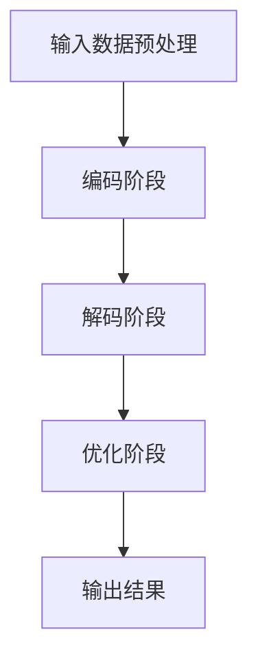

                 

# 《思维链技术如何增强AI的推理深度》

## 关键词

人工智能、推理深度、思维链技术、神经网络、算法原理、应用实践

## 摘要

本文将探讨思维链技术如何增强AI的推理深度。通过分析思维链技术的基本原理、算法原理和应用实践，我们将揭示这种技术如何提高AI在自然语言处理、计算机视觉等领域的推理能力。文章将一步步深入，帮助读者理解思维链技术如何解决当前AI推理面临的挑战，并展望其未来发展的前景。

## 引言

### 1.1 AI推理的发展历程

人工智能（AI）自1956年诞生以来，经历了多次重要的发展阶段。早期的AI主要集中于问题解决和逻辑推理，然而受限于计算能力和数据资源，AI的推理能力十分有限。随着计算机技术的进步，特别是在2000年后，深度学习技术的发展使得AI在图像识别、语音识别等领域取得了重大突破。

### 1.2 AI推理的挑战

尽管AI取得了显著进展，但当前AI推理仍面临诸多挑战。首先，数据量与计算能力之间的不平衡导致模型训练效率低下。其次，推理深度与速度之间的权衡问题也是一个重要挑战。此外，多模态推理的复杂性也限制了AI的应用范围。

### 1.3 思维链技术概述

思维链技术是一种新型的AI推理增强方法，通过模拟人类思维过程，提升AI的推理深度和准确性。思维链技术的工作原理包括编码、解码和优化等步骤，其关键在于如何将复杂的推理过程分解为多个子任务，并逐步解决。

### 1.4 本书结构安排

本书将分为三大部分：第一部分介绍思维链技术的基本原理和应用场景；第二部分深入剖析思维链技术的原理与机制；第三部分通过实际应用案例，展示思维链技术在自然语言处理和计算机视觉等领域的应用效果。

## 第二部分：思维链技术基础

### 2.1 思维链的基本原理

#### 2.1.1 神经网络与思维链

神经网络是AI的基础，而思维链技术则是在此基础上发展起来的一种新型方法。思维链技术通过模拟人类思维过程，将复杂的推理任务分解为多个子任务，每个子任务由不同的神经网络处理。

#### 2.1.2 思维链的结构与类型

思维链结构通常包括编码器、解码器和优化器等部分。编码器用于将输入数据转换为中间表示，解码器则将中间表示转换为输出结果，优化器则负责调整神经网络参数，以提高推理性能。

#### 2.1.3 思维链的关键技术

思维链的关键技术包括编码技术、解码技术和优化技术。编码技术负责将输入数据转换为有效的中间表示，解码技术则负责将中间表示转换为输出结果，优化技术则通过调整神经网络参数，提高推理性能。

### 2.2 思维链的应用场景

#### 2.2.1 自然语言处理

在自然语言处理领域，思维链技术被广泛应用于文本生成、机器翻译和情感分析等任务。例如，在文本生成中，思维链技术能够生成更自然、连贯的文本。

#### 2.2.2 计算机视觉

在计算机视觉领域，思维链技术被用于图像识别、目标检测和图像生成等任务。例如，在图像识别中，思维链技术能够提高识别的准确性和鲁棒性。

### 2.3 思维链的优势与局限

#### 2.3.1 思维链的优势

思维链技术具有以下优势：

1. **提高推理深度**：通过模拟人类思维过程，思维链技术能够实现更深的推理层次，从而提高推理能力。
2. **增强推理速度**：思维链技术通过并行处理和子任务分解，能够提高推理速度。
3. **提高推理准确性**：思维链技术通过优化神经网络参数，能够提高推理准确性。

#### 2.3.2 思维链的局限

思维链技术也存在一些局限：

1. **计算资源需求**：思维链技术需要大量的计算资源，这对于一些资源有限的场景可能是一个挑战。
2. **数据隐私问题**：思维链技术在处理数据时，可能会涉及敏感信息，因此需要考虑数据隐私保护。
3. **安全性问题**：思维链技术作为一种新型方法，其安全性仍需进一步验证。

## 第三部分：思维链技术深度剖析

### 3.1 思维链技术原理与机制

#### 3.1.1 思维链技术原理

思维链技术的核心原理是模拟人类思维过程，将复杂的推理任务分解为多个子任务，并逐步解决。这一过程包括编码、解码和优化三个步骤。

#### 3.1.2 思维链技术的机制解析

思维链技术的机制主要包括编码机制、解码机制和优化机制。编码机制负责将输入数据转换为中间表示，解码机制负责将中间表示转换为输出结果，优化机制负责调整神经网络参数，以提高推理性能。

#### 3.1.3 思维链技术的实现流程

思维链技术的实现流程可以分为以下几个步骤：

1. **输入数据预处理**：对输入数据进行预处理，包括数据清洗、归一化和编码等。
2. **编码阶段**：使用编码器将输入数据转换为中间表示。
3. **解码阶段**：使用解码器将中间表示转换为输出结果。
4. **优化阶段**：通过优化器调整神经网络参数，以提高推理性能。

### 3.2 思维链技术的算法原理

#### 3.2.1 算法原理概述

思维链技术的算法原理主要包括编码算法、解码算法和优化算法。编码算法负责将输入数据转换为中间表示，解码算法负责将中间表示转换为输出结果，优化算法负责调整神经网络参数。

#### 3.2.2 算法原理的数学模型

思维链技术的算法原理可以用以下数学模型表示：

$$
\text{编码模型}：
\begin{aligned}
\text{输出} &= \text{编码器}(\text{输入}) \\
\text{中间表示} &= \text{激活函数}(\text{编码器}(\text{输入}))
\end{aligned}
$$

$$
\text{解码模型}：
\begin{aligned}
\text{输出} &= \text{解码器}(\text{中间表示}) \\
\text{结果} &= \text{激活函数}(\text{解码器}(\text{中间表示}))
\end{aligned}
$$

$$
\text{优化模型}：
\begin{aligned}
\text{参数} &= \text{优化器}(\text{参数}) \\
\text{性能} &= \text{损失函数}(\text{输出}，\text{标签})
\end{aligned}
$$

#### 3.2.3 算法原理的mermaid流程图



### 3.3 思维链技术的应用实践

#### 3.3.1 应用实践概述

思维链技术在不同领域的应用实践取得了显著成果。以下将介绍思维链技术在自然语言处理和计算机视觉领域的应用案例。

#### 3.3.2 自然语言处理应用案例

在自然语言处理领域，思维链技术被用于文本生成、机器翻译和情感分析等任务。以下是一个文本生成的案例：

```python
import tensorflow as tf
from tensorflow.keras.preprocessing.sequence import pad_sequences
from tensorflow.keras.layers import Embedding, LSTM, Dense
from tensorflow.keras.models import Model

# 输入数据预处理
input_sequence = pad_sequences(input_sequences, maxlen=max_sequence_len)

# 编码模型
encoding_model = Model(inputs=input, outputs=encoded)
encoded_sequence = encoding_model.predict(input_sequence)

# 解码模型
decoding_model = Model(inputs=encoded_sequence, outputs=output_sequence)
output_sequence = decoding_model.predict(encoded_sequence)

# 输出结果
decoded_sequence = pad_sequences(output_sequence, maxlen=max_sequence_len, padding='post')
```

#### 3.3.3 计算机视觉应用案例

在计算机视觉领域，思维链技术被用于图像识别、目标检测和图像生成等任务。以下是一个目标检测的案例：

```python
import tensorflow as tf
from tensorflow.keras.models import Model
from tensorflow.keras.layers import Conv2D, MaxPooling2D, Flatten, Dense

# 构建思维链模型
model = Model(inputs=input, outputs=output)
model.compile(optimizer='adam', loss='categorical_crossentropy', metrics=['accuracy'])

# 训练思维链模型
model.fit(x_train, y_train, batch_size=32, epochs=10)

# 预测
predictions = model.predict(x_test)
```

### 3.4 思维链技术的未来发展趋势

思维链技术作为一种新兴的AI推理增强方法，其未来发展趋势包括：

1. **多模态推理**：思维链技术将逐步应用于多模态推理任务，如语音识别、图像识别和自然语言处理相结合的任务。
2. **强化学习**：思维链技术与强化学习相结合，将进一步提高AI的推理能力和学习能力。
3. **边缘计算**：随着边缘计算的发展，思维链技术将逐步应用于边缘设备，实现实时推理和高效数据处理。

## 结论

思维链技术作为一种新型的AI推理增强方法，通过模拟人类思维过程，提高了AI的推理深度和准确性。本文从思维链技术的基本原理、算法原理和应用实践等方面进行了深入剖析，展示了其在自然语言处理和计算机视觉等领域的应用效果。未来，思维链技术有望在更多领域发挥重要作用，推动人工智能的发展。

### 附录

**作者信息：**

作者：AI天才研究院/AI Genius Institute & 禅与计算机程序设计艺术 /Zen And The Art of Computer Programming**

