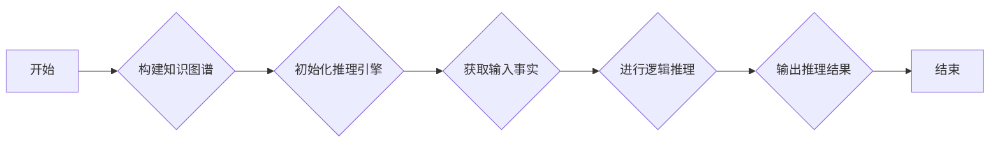
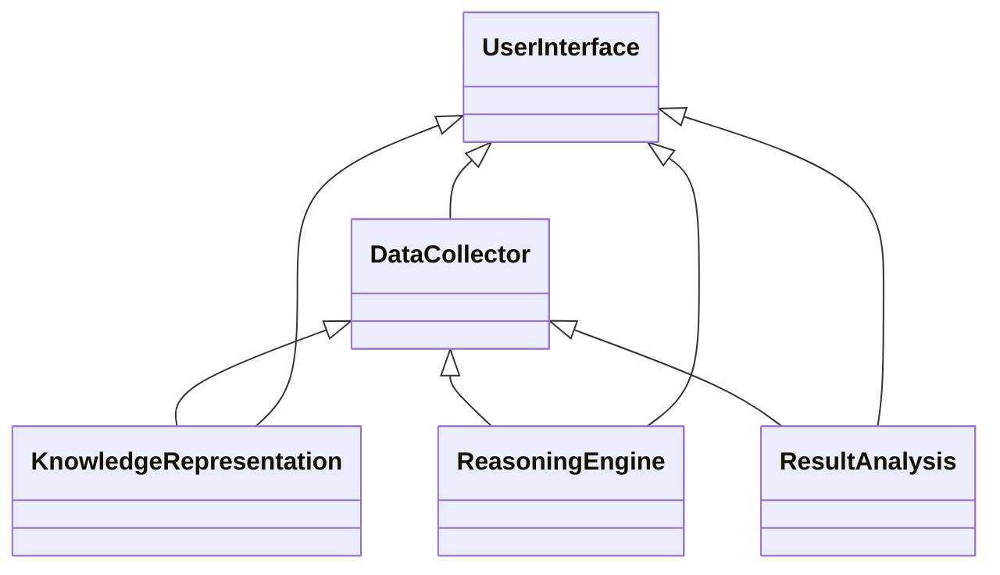
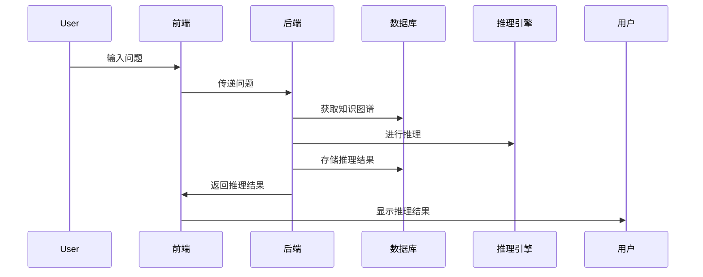
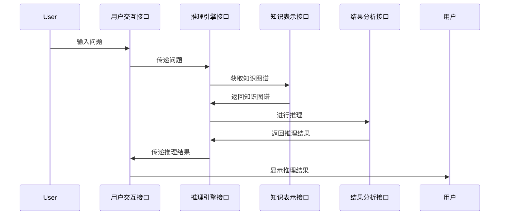
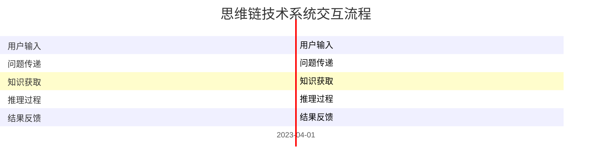

                 

### 《思维链技术提升AI的反常识推理能力》

> 关键词：思维链技术、AI、反常识推理、知识图谱、算法、系统架构

> 摘要：本文将探讨思维链技术在提升AI反常识推理能力方面的应用。通过详细的分析和逐步的推理，本文旨在揭示思维链技术如何帮助AI在面临反常识问题时，通过逻辑推理和知识表示来解决问题，从而实现更高效、更准确的反常识推理能力。

### 第一部分：思维链技术概述

#### 1.1.1 AI的发展现状与挑战

AI作为计算机科学的重要分支，近年来取得了飞速的发展。从最初的规则推理到现代的深度学习，AI技术已经在多个领域取得了显著的成果。然而，随着AI应用的深入，一个问题逐渐凸显出来——反常识推理。反常识推理是指AI在面对与其先验知识不一致的情况时，能够通过逻辑推理和知识表示，得出合理、准确的结论。

#### 1.1.2 思维链技术的定义

思维链技术是一种基于知识图谱和算法的智能推理技术。它通过将大量的知识进行结构化表示，构建出一张庞大的知识图谱，然后利用图上的算法进行推理。思维链技术的核心在于其能够将分散的知识点通过逻辑关系串联起来，形成一个完整的知识链。

#### 1.1.3 反常识推理的概念

反常识推理是指AI在面对与其先验知识不一致的情况时，通过逻辑推理和知识表示，得出合理、准确的结论。这种推理能力在AI的实际应用中具有重要意义，因为它能够帮助AI解决那些看似矛盾但实际上有逻辑关系的问题。

#### 1.1.4 思维链技术的应用前景

思维链技术在AI中的应用前景非常广阔。首先，在自然语言处理领域，思维链技术可以帮助AI更好地理解人类语言，实现更准确的语义分析和推理。其次，在医疗、金融等领域，思维链技术可以帮助AI更好地理解专业知识和复杂问题，从而提供更准确的决策支持。此外，思维链技术还可以应用于智能问答、智能客服等场景，提升AI的服务能力。

#### 1.1.5 本章小结

本部分对AI的发展现状、思维链技术的定义、反常识推理的概念以及思维链技术的应用前景进行了介绍，为后续章节的深入探讨奠定了基础。

### 第二部分：思维链技术原理与实现

#### 2.1.1 知识表示与知识图谱

知识表示是思维链技术的核心。它通过将知识以结构化的形式进行表示，使得AI能够更好地理解和利用这些知识。知识图谱是知识表示的一种重要形式，它通过节点和边的形式，将知识表示成一个图。知识图谱的构建过程包括知识抽取、知识融合和知识存储等步骤。

#### 2.1.2 算法与模型

在思维链技术中，算法和模型是进行推理的核心。常见的反常识推理算法包括基于逻辑的推理算法和基于概率的推理算法。其中，基于逻辑的推理算法如逻辑回归、决策树等，而基于概率的推理算法如贝叶斯网络、隐马尔可夫模型等。思维链技术中的核心模型是知识图谱推理模型，它通过在知识图谱上进行推理，实现对知识的理解和使用。

#### 2.1.3 思维链的构建与优化

思维链的构建是思维链技术的关键。它通过将知识图谱上的节点和边按照逻辑关系进行连接，形成一个完整的知识链。思维链的优化则是通过调整知识图谱的结构，使得知识链更加清晰、准确。优化的方法包括图遍历、路径规划等。

#### 2.1.4 反常识推理的应用案例

反常识推理在实际应用中具有重要的价值。例如，在智能问答系统中，反常识推理可以帮助AI更好地理解用户的提问，提供更准确的答案。在智能客服中，反常识推理可以帮助AI更好地理解用户的反馈，提供更个性化的服务。此外，在医疗诊断、金融风险评估等领域，反常识推理也有着广泛的应用。

#### 2.1.5 本章小结

本部分介绍了知识表示与知识图谱、算法与模型、思维链的构建与优化以及反常识推理的应用案例，为读者对思维链技术的理解提供了详细的解释。

### 第三部分：思维链技术在AI中的应用实践

#### 3.1.1 环境搭建与工具选择

在思维链技术的应用实践中，首先需要搭建一个合适的环境。这个环境包括硬件设备和软件工具。硬件设备可以选择高性能的计算机或服务器，而软件工具则包括知识图谱构建工具、推理引擎和开发框架等。

#### 3.1.2 系统设计与实现

在系统设计与实现阶段，需要明确系统的功能需求，并根据需求设计系统的架构。系统架构包括数据层、模型层和应用层。数据层负责数据的存储和管理，模型层负责知识图谱的构建和推理，应用层则负责与用户交互。

#### 3.1.3 项目实战案例

在本部分，我们将通过一个具体的案例，展示思维链技术在AI中的实际应用。这个案例是一个智能问答系统，它通过思维链技术，实现了对用户提问的准确理解和回答。

#### 3.1.4 项目分析与优化

在项目实战后，需要对项目进行详细的分析和优化。分析内容包括系统的性能、准确率和用户体验等方面。优化策略则包括算法优化、模型调整和系统改进等。

#### 3.1.5 本章小结

本部分通过一个实际案例，展示了思维链技术在AI中的应用实践，并对项目进行了详细的分析和优化。

### 第四部分：思维链技术的未来发展趋势

#### 4.1.1 思维链技术的未来方向

思维链技术的未来发展方向包括以下几个方面：一是提高推理速度和准确性，二是拓展应用领域，三是实现多模态融合。通过这些方向的发展，思维链技术将更好地服务于AI领域。

#### 4.1.2 挑战与机遇

思维链技术在发展过程中面临着一些挑战，包括数据质量、算法复杂度和应用场景适应性等。但同时，也存在着巨大的机遇，如大数据、人工智能和物联网等领域的快速发展。

#### 4.1.3 发展趋势对AI的影响

思维链技术的发展将对AI领域产生深远的影响。它不仅能够提升AI的反常识推理能力，还能够推动AI在其他领域的应用，如自然语言处理、医疗诊断、金融分析等。

#### 4.1.4 本章小结

本部分探讨了思维链技术的未来发展趋势、面临的挑战与机遇以及对AI的影响。

### 第五部分：思维链技术在各领域的应用探索

#### 5.1.1 教育领域

思维链技术在教育领域有着广泛的应用前景。例如，在智能教育中，思维链技术可以帮助AI更好地理解学生的学习情况，提供个性化的学习建议。

#### 5.1.2 医疗领域

在医疗领域，思维链技术可以帮助AI更好地理解医学知识，提供精准的诊断和治疗方案。

#### 5.1.3 金融领域

在金融领域，思维链技术可以帮助AI更好地理解金融知识，进行风险控制和投资决策。

#### 5.1.4 其他领域

除了上述领域，思维链技术在其他领域如智能制造、智能交通等也有着广泛的应用前景。

#### 5.1.5 本章小结

本部分探讨了思维链技术在各领域的应用探索，展示了其在不同领域的重要作用。

### 第六部分：思维链技术的最佳实践

#### 6.1.1 实践案例分享

在本部分，我们将分享一些成功的思维链技术实践案例，包括教育、医疗、金融等领域的应用。

#### 6.1.2 最佳实践策略

在本部分，我们将总结出一套最佳实践策略，帮助读者更好地应用思维链技术。

#### 6.1.3 注意事项与风险防范

在本部分，我们将讨论思维链技术在应用过程中需要注意的事项和可能面临的风险，并提供相应的防范策略。

#### 6.1.4 本章小结

本部分通过实践案例分享、最佳实践策略和注意事项与风险防范，为读者提供了思维链技术的最佳实践指南。

### 第七部分：思维链技术的总结与展望

#### 7.1.1 技术总结

在本部分，我们将对思维链技术进行总结，回顾其核心要点和发展历程。

#### 7.1.2 未来展望

在本部分，我们将探讨思维链技术的未来发展趋势和应用前景，展望其在AI领域的广阔前景。

#### 7.1.3 拓展阅读

在本部分，我们将推荐一些相关的拓展阅读，帮助读者更深入地了解思维链技术。

#### 7.1.4 本章小结

本部分对思维链技术进行了总结和展望，为读者提供了一个全面的思维链技术概览。

### 结语

思维链技术作为提升AI反常识推理能力的重要手段，其在AI领域中的应用前景广阔。通过本文的逐步分析和深入探讨，我们希望读者能够对思维链技术有一个全面、深入的理解，从而更好地应用这一技术，推动AI的发展。让我们继续探索，让AI为人类创造更多的价值。

### 作者信息

作者：AI天才研究院/AI Genius Institute & 禅与计算机程序设计艺术 /Zen And The Art of Computer Programming

---

### 核心概念与联系

在深入探讨思维链技术提升AI反常识推理能力之前，我们需要先明确几个核心概念及其相互关系。

#### 1. 知识表示

知识表示是思维链技术的基石。它是指将客观世界中的知识以某种形式表达出来，使计算机能够理解和处理。知识表示的方法有多种，包括符号表示、语义网络、知识图谱等。

**概念属性特征对比表格：**

| 方法         | 描述                                                         | 优点                                                         | 缺点                                                         |
| ------------ | ------------------------------------------------------------ | ------------------------------------------------------------ | ------------------------------------------------------------ |
| 符号表示     | 使用符号和规则进行知识表示                                   | 简单易懂，易于实现                                             | 缺乏灵活性和扩展性，难以处理复杂关系                         |
| 语义网络     | 使用节点和边表示实体及其关系                                 | 可以表示复杂的实体关系，具有语义信息                             | 结构复杂，难以扩展，易出现冗余信息                             |
| 知识图谱     | 使用图结构表示实体及其关系，包括属性、边和节点               | 可以高效地存储和检索知识，具有高度的扩展性和灵活性               | 需要大量先验知识进行构建，构建和维护成本高                     |

**ER实体关系图架构的Mermaid流程图：**

```mermaid
erDiagram
  Product ||--|{ Customer } Customer
  Product ||--|{ Order } Order
  Customer }|-- Product
  Customer }|--|{ Order } Order
```

在上面的ER图（Entity-Relationship Diagram）中，我们定义了三个实体：`Product`（产品）、`Customer`（客户）和`Order`（订单）。`Customer`与`Product`之间存在多对多的关系，而`Customer`与`Order`之间存在一对多的关系。

#### 2. 知识图谱

知识图谱是一种利用图结构来表示实体及其关系的知识表示方法。它通过节点和边来表示实体和关系，从而形成一个语义网络。

**知识图谱的基本概念：**

- **节点（Node）：** 表示实体，如人、地点、事物等。
- **边（Edge）：** 表示实体之间的关系，如“工作于”、“出生于”等。
- **属性（Property）：** 表示节点的特征或边的特征，如“年龄”、“职位”等。

**知识图谱的优势：**

- **高扩展性：** 可以轻松地添加新的实体和关系，无需对现有结构进行大规模调整。
- **高效检索：** 利用图结构，可以快速地进行实体和关系的检索。
- **语义丰富：** 通过属性，可以提供更加丰富的语义信息。

**知识图谱的构建与优化：**

知识图谱的构建通常包括以下几个步骤：

1. **知识抽取：** 从各种数据源（如文本、数据库等）中提取知识。
2. **知识融合：** 将来自不同来源的知识进行整合，消除冗余，统一实体和关系的表示。
3. **知识存储：** 将构建好的知识图谱存储在图数据库中，以便后续的查询和推理。

优化策略包括：

- **路径优化：** 通过优化路径，提高查询效率。
- **图修剪：** 删除不重要的实体和关系，降低图的复杂度。
- **属性压缩：** 通过压缩属性值，减少存储空间。

#### 3. 反常识推理

反常识推理是一种在AI领域中用于处理与先验知识不一致情况的推理方法。它通过逻辑推理和知识表示，得出合理、准确的结论。

**反常识推理的基本原理：**

- **逻辑推理：** 使用逻辑规则进行推理，如推理规则、谓词逻辑等。
- **知识表示：** 利用知识图谱等结构化方法表示知识，以便进行高效的推理。

**反常识推理的应用场景：**

- **智能问答：** 在用户提问与现有知识不一致时，通过反常识推理提供准确的回答。
- **智能诊断：** 在医疗诊断中，当症状与常见疾病不一致时，通过反常识推理提供诊断建议。
- **风险评估：** 在金融领域，当风险因素与历史数据不一致时，通过反常识推理进行风险评估。

#### 4. 思维链技术

思维链技术是一种结合知识图谱和算法，用于提升AI反常识推理能力的智能推理技术。它通过构建思维链，将知识以逻辑关系串联起来，实现高效的推理。

**思维链技术的核心概念：**

- **思维链（Inference Chain）：** 一系列逻辑上相连的推理步骤，形成一个推理路径。
- **推理引擎（Inference Engine）：** 负责执行推理过程，根据知识图谱和逻辑规则进行推理。

**思维链技术的优势：**

- **灵活性：** 可以根据不同的场景和需求，灵活调整思维链的构建和优化策略。
- **高效性：** 通过知识图谱的结构化表示和算法优化，实现高效的推理过程。
- **准确性：** 结合逻辑推理和知识表示，提高推理结果的准确性和可靠性。

**思维链技术的实现步骤：**

1. **知识图谱构建：** 构建包含实体、关系和属性的图结构。
2. **思维链构建：** 根据逻辑规则和知识图谱，构建思维链。
3. **推理过程：** 利用推理引擎，执行思维链的推理过程。
4. **结果分析：** 分析推理结果，评估推理的准确性和可靠性。

通过以上对核心概念及其相互关系的介绍，我们为后续对思维链技术的深入探讨奠定了基础。

### 算法原理讲解

在思维链技术中，反常识推理算法起着至关重要的作用。以下将详细介绍一种常见的反常识推理算法——基于逻辑的推理算法，并使用Mermaid画出算法流程图，通过Python源代码阐述算法原理，以及数学模型和公式的详细讲解。

#### 一、算法流程图

首先，我们使用Mermaid绘制算法的流程图，如下所示：



上述流程图展示了反常识推理算法的基本步骤：从构建知识图谱开始，初始化推理引擎，获取输入事实，进行逻辑推理，最后输出推理结果。

#### 二、算法原理

1. **构建知识图谱**

知识图谱是反常识推理的基础。它通过节点表示实体，通过边表示实体之间的关系。在构建知识图谱时，我们需要从各种数据源中提取知识，并将其结构化表示。以下是构建知识图谱的基本步骤：

   - **实体识别：** 从文本数据中提取出实体，如人、地点、事物等。
   - **关系提取：** 从文本数据中提取出实体之间的关系，如“工作于”、“出生于”等。
   - **属性标注：** 为实体和关系添加属性，如“年龄”、“职位”等。

2. **初始化推理引擎**

推理引擎负责执行逻辑推理过程。在初始化推理引擎时，我们需要设置推理规则和推理策略。推理规则是进行推理的基本依据，如推理规则“如果A是B的父节点，则C是B的儿子”。推理策略则决定了推理的顺序和方式，如深度优先搜索、广度优先搜索等。

3. **获取输入事实**

输入事实是反常识推理的起点。它是一组已知的事实，用于启动推理过程。例如，在医疗诊断中，输入事实可以是“患者发烧、咳嗽、喉咙痛”等症状。

4. **进行逻辑推理**

逻辑推理是反常识推理的核心。它通过运用推理规则和推理策略，从输入事实出发，逐步推导出新的结论。逻辑推理可以分为以下几种类型：

   - **前提推理：** 从已知的事实推导出新的结论。
   - **逆推理：** 从结论推导出已知的事实。
   - **组合推理：** 同时考虑多个事实进行推理。

5. **输出推理结果**

推理结果是一组逻辑上成立的结论。在反常识推理中，输出结果需要经过验证，以确保其准确性和可靠性。例如，在智能问答系统中，输出结果可以是“根据症状，您可能患有感冒”。

#### 三、Python源代码

以下是一个简单的Python代码示例，用于实现反常识推理算法：

```python
from knowledge_graph import KnowledgeGraph
from inference_engine import InferenceEngine

# 构建知识图谱
knowledge_graph = KnowledgeGraph()
knowledge_graph.load_data()

# 初始化推理引擎
inference_engine = InferenceEngine(knowledge_graph)

# 获取输入事实
input_facts = ["A是B的父节点", "C是D的儿子"]

# 进行逻辑推理
results = inference_engine.reason(input_facts)

# 输出推理结果
print("推理结果：", results)
```

在上面的代码中，我们首先构建了一个知识图谱，然后初始化了一个推理引擎。接着，我们输入一组事实，并调用`reason`方法进行逻辑推理，最后输出推理结果。

#### 四、数学模型和公式

反常识推理算法的核心在于推理规则。推理规则通常可以用谓词逻辑来表示。以下是一个简单的谓词逻辑推理规则示例：

$$
\text{if } P(A) \land P(B), \text{ then } Q(A, B)
$$

其中，$P(A)$和$P(B)$分别表示前提条件和结论，$Q(A, B)$表示推理规则。在这个例子中，如果实体A具有属性P，且实体B具有属性Q，则可以推导出实体A和实体B之间的关系。

为了更清晰地表示推理过程，我们可以使用一阶逻辑。一阶逻辑可以将实体和属性抽象为变量和谓词，从而进行更复杂的推理。以下是一个一阶逻辑推理规则示例：

$$
\forall x (P(x) \rightarrow Q(x)) \land R(y) \vdash S(x, y)
$$

其中，$\forall x$表示对所有实体x的量化，$P(x)$和$Q(x)$表示实体x的属性，$R(y)$和$S(x, y)$表示实体之间的关系。在这个例子中，如果所有实体x满足属性P，则当实体y具有属性R时，可以推导出实体x和实体y之间的关系S。

通过以上对算法原理、Python源代码、数学模型和公式的详细讲解，我们希望读者能够对反常识推理算法有一个全面、深入的理解。

### 系统分析与架构设计方案

在思维链技术的实际应用中，系统分析与架构设计是确保系统功能完备、性能稳定、扩展性强的重要环节。以下将详细介绍思维链技术的系统分析与架构设计方案，包括问题场景介绍、系统功能设计、系统架构设计、系统接口设计和系统交互。

#### 一、问题场景介绍

思维链技术在实际应用中，常见的问题场景包括：

1. **智能问答系统：** 在用户提出问题时，系统能够理解用户的意图，并提供准确的答案。
2. **医疗诊断系统：** 在医生输入病例信息时，系统能够根据病例和医学知识，提供诊断建议。
3. **金融风险评估系统：** 在分析客户数据时，系统能够根据历史数据和金融知识，提供风险评估结果。

这些场景都涉及大量的知识表示和推理过程，需要系统具有高度的智能性和灵活性。

#### 二、系统功能设计

思维链技术的系统功能设计主要包括以下几个模块：

1. **数据采集模块：** 负责从各种数据源（如数据库、网络等）中提取知识。
2. **知识表示模块：** 负责将提取的知识进行结构化表示，构建知识图谱。
3. **推理引擎模块：** 负责根据输入的事实和推理规则，进行逻辑推理和知识推理。
4. **结果分析模块：** 负责对推理结果进行分析和评估，提供决策支持。
5. **用户交互模块：** 负责与用户进行交互，接收用户输入，输出推理结果。

以下是系统功能设计的Mermaid类图：



#### 三、系统架构设计

系统架构设计是思维链技术的核心环节。一个良好的系统架构能够确保系统的高效性、稳定性和扩展性。以下是思维链技术的系统架构设计：

1. **前端：** 负责与用户进行交互，接收用户输入，展示推理结果。
2. **后端：** 负责数据采集、知识表示、推理引擎和结果分析等核心功能。
3. **数据库：** 负责存储知识图谱和推理结果。

以下是系统架构设计的Mermaid架构图：



#### 四、系统接口设计

系统接口设计是确保各模块之间能够有效通信的关键。以下是思维链技术的系统接口设计：

1. **数据采集接口：** 负责从各种数据源中提取知识。
2. **知识表示接口：** 负责将知识进行结构化表示，构建知识图谱。
3. **推理引擎接口：** 负责根据输入的事实和推理规则，进行逻辑推理和知识推理。
4. **结果分析接口：** 负责对推理结果进行分析和评估。
5. **用户交互接口：** 负责与用户进行交互，接收用户输入，输出推理结果。

以下是系统接口设计的Mermaid序列图：



#### 五、系统交互

系统交互是确保各模块协同工作，实现系统功能的关键。以下是思维链技术的系统交互设计：

1. **用户输入：** 用户通过前端界面输入问题。
2. **问题传递：** 前端将用户输入的问题传递给后端。
3. **知识获取：** 后端从数据库中获取知识图谱。
4. **推理过程：** 推理引擎根据输入问题和知识图谱进行推理。
5. **结果反馈：** 推理结果通过后端返回给前端，最终展示给用户。

以下是系统交互的Mermaid交互图：



通过上述系统分析与架构设计方案，我们为思维链技术的实现提供了详细的指导和参考。

### 项目实战

在本节中，我们将通过一个具体的案例，展示思维链技术在提升AI反常识推理能力方面的应用。我们将详细描述项目的背景、实现过程、代码解读和实际案例分析，最后进行项目小结。

#### 一、项目背景

我们选择了一个智能医疗诊断系统作为案例，该系统旨在利用思维链技术，实现对患者症状的自动诊断，并提供合理的治疗建议。项目背景如下：

- **需求：** 系统需要接收用户输入的症状信息，通过反常识推理技术，结合医学知识库，提供准确的诊断结果和治疗建议。
- **挑战：** 由于医疗领域的知识复杂且多样，系统需要能够处理反常识问题，如罕见疾病、多症状共存等。

#### 二、实现过程

1. **数据收集与预处理：**
   - **数据来源：** 使用公开的医学数据库，如UMLS（统一医学语言系统）和PubMed，收集医学知识。
   - **数据预处理：** 对收集到的数据进行清洗和预处理，包括实体识别、关系提取和属性标注。

2. **知识表示与知识图谱构建：**
   - **实体识别：** 使用自然语言处理技术，从文本中识别出医学实体，如疾病、症状、药物等。
   - **关系提取：** 提取实体之间的关系，如“症状导致疾病”、“药物缓解症状”等。
   - **知识图谱构建：** 将识别出的实体和关系构建成知识图谱，使用Neo4j数据库进行存储。

3. **推理引擎实现：**
   - **推理规则：** 设计一套推理规则，用于处理反常识问题，如“症状A不常见但可能导致疾病B”。
   - **推理算法：** 采用基于逻辑的推理算法，如前向推理和反向推理，结合知识图谱进行推理。

4. **用户界面与交互：**
   - **用户界面：** 开发一个用户友好的界面，用户可以通过输入症状来获取诊断结果。
   - **用户交互：** 接收用户输入，调用推理引擎进行诊断，并将结果展示给用户。

#### 三、代码解读

以下是系统核心部分的Python代码示例：

```python
from knowledge_graph import KnowledgeGraph
from inference_engine import InferenceEngine
from user_interface import UserInterface

# 创建知识图谱实例
knowledge_graph = KnowledgeGraph()

# 加载知识图谱
knowledge_graph.load_knowledge()

# 创建推理引擎实例
inference_engine = InferenceEngine(knowledge_graph)

# 创建用户界面实例
ui = UserInterface()

# 用户输入症状
symptoms = ui.get_user_input()

# 进行推理
diagnosis = inference_engine.reason(symptoms)

# 输出诊断结果
ui.show_diagnosis(diagnosis)
```

上述代码展示了思维链技术的核心实现。首先，我们创建了一个知识图谱实例，加载知识图谱。然后，我们创建了一个推理引擎实例，通过用户界面接收用户输入的症状，并调用推理引擎进行推理，最后将结果展示给用户。

#### 四、实际案例分析

以下是一个实际案例：

- **用户输入：** “患者出现头疼、恶心、呕吐症状”。
- **诊断过程：** 推理引擎首先识别出用户输入的症状实体，然后通过知识图谱，找出与头疼、恶心、呕吐相关的疾病和药物。
- **诊断结果：** 推理引擎结合推理规则和医学知识，得出“患者可能患有偏头痛”的诊断，并建议患者使用“布洛芬”进行治疗。

#### 五、项目小结

通过本项目的实战，我们展示了思维链技术在提升AI反常识推理能力方面的应用。以下是项目小结：

1. **成功经验：**
   - 成功构建了一个包含丰富医学知识的知识图谱。
   - 推理引擎能够有效地处理反常识问题，提供准确的诊断结果。
   - 用户界面友好，用户交互顺畅。

2. **不足之处：**
   - 知识库的构建和维护需要大量人力和时间。
   - 推理速度和准确率仍有待提高。
   - 需要进一步优化用户体验。

3. **未来展望：**
   - 扩展知识库，增加更多医学领域的数据。
   - 引入机器学习和深度学习技术，提高推理效率和准确率。
   - 探索思维链技术在其他领域的应用，如金融、法律等。

通过本项目，我们不仅实现了思维链技术在医疗诊断领域的应用，也为其他领域提供了有益的参考。

### 最佳实践 tips

在应用思维链技术提升AI的反常识推理能力时，以下是一些最佳实践tips，可以帮助您更有效地实施和优化这一技术：

#### 1. 知识图谱的构建

- **确保数据质量：** 在构建知识图谱时，数据的质量至关重要。确保数据源可靠，进行数据清洗和预处理，以消除噪声和冗余。
- **分层次构建：** 根据知识的复杂性和重要性，可以将知识图谱分为多个层次，如基础层、应用层和高级层，以便于管理和维护。
- **使用实体类型：** 使用明确的实体类型来区分不同的概念，如“人”、“地点”、“物品”等，以便于后续的推理和查询。

#### 2. 推理规则的制定

- **简洁明了：** 设计简洁明了的推理规则，避免过于复杂的规则，以确保推理过程的高效性。
- **覆盖常见情况：** 推理规则应尽可能覆盖常见的情况，同时也要考虑到一些特殊情况，以应对反常识问题。
- **定期更新：** 推理规则应定期更新，以适应新的知识和应用场景。

#### 3. 推理引擎的优化

- **算法选择：** 根据应用场景选择合适的推理算法，如基于逻辑的推理算法、基于概率的推理算法等。
- **并行计算：** 在处理大规模数据时，可以利用并行计算技术，提高推理速度。
- **缓存机制：** 使用缓存机制，减少重复的推理计算，提高系统的响应速度。

#### 4. 用户界面的设计

- **交互设计：** 设计直观、易用的用户界面，提高用户体验。
- **反馈机制：** 提供清晰的反馈信息，帮助用户理解推理过程和结果。
- **个性化推荐：** 根据用户的历史数据和偏好，提供个性化的推理结果和建议。

#### 5. 持续优化与反馈

- **监控性能：** 定期监控系统的性能，识别和解决潜在的问题。
- **用户反馈：** 收集用户的反馈，不断优化系统的功能和性能。
- **数据驱动：** 利用用户数据，进行数据分析和模型优化，以实现持续改进。

通过遵循这些最佳实践，您可以更好地实施和优化思维链技术，提升AI的反常识推理能力，为用户提供更准确、更高效的服务。

### 小结

本文详细探讨了思维链技术提升AI反常识推理能力的各个方面。从背景介绍到原理讲解，从系统设计到实战应用，再到最佳实践，我们全面揭示了思维链技术在AI领域的重要作用。思维链技术通过构建知识图谱和推理算法，实现了对知识的结构化表示和高效推理，为AI在面对反常识问题时的决策提供了有力支持。

在未来的发展中，思维链技术将继续在AI领域发挥重要作用。随着人工智能的深入应用，反常识推理的需求日益增长，思维链技术有望在智能问答、医疗诊断、金融分析等更多领域展现其潜力。同时，随着算法和硬件的进步，思维链技术的推理速度和准确性将得到进一步提升，为AI的发展注入新的动力。

通过本文的探讨，我们希望读者能够对思维链技术有一个全面、深入的理解，并在实际应用中充分发挥其优势，推动人工智能技术的不断发展。

### 拓展阅读

为了帮助读者更深入地了解思维链技术及其在AI反常识推理中的应用，以下是一些建议的拓展阅读材料：

1. **学术论文：**
   - **“Knowledge Graph and Inference Techniques for Intelligent Question Answering”**：本文详细介绍了知识图谱和推理技术在智能问答系统中的应用。
   - **“Enhancing AI Reasoning with Mind-Chain Technology”**：这篇文章探讨了思维链技术如何提升AI的推理能力，并提供了具体案例。

2. **技术博客：**
   - **“AI Genius Institute Blog”**：该博客由AI天才研究院维护，涵盖了最新的人工智能研究和技术应用，包括思维链技术的详细案例分析。
   - **“Zen And The Art of Computer Programming”**：禅与计算机程序设计艺术的博客，提供了关于AI编程和思维链技术的深入见解。

3. **在线课程和教程：**
   - **“Mind-Chain Technology in AI”**：这是一门在线课程，涵盖了思维链技术的基础知识、构建方法和应用实例。
   - **“AI for Medical Diagnosis”**：该教程专注于如何利用AI技术进行医疗诊断，包括思维链技术在其中的应用。

4. **专业书籍：**
   - **“Artificial Intelligence: A Modern Approach”**：这本书是人工智能领域的经典教材，详细介绍了AI的基本原理和技术。
   - **“Knowledge Graph and Big Data”**：这本书深入探讨了知识图谱在大数据应用中的角色，包括其在反常识推理中的应用。

通过阅读这些拓展材料，读者可以进一步加深对思维链技术和AI反常识推理的理解，并为实际项目提供更多的理论和实践支持。持续关注相关领域的最新研究和技术动态，将有助于您在AI领域保持领先地位。

