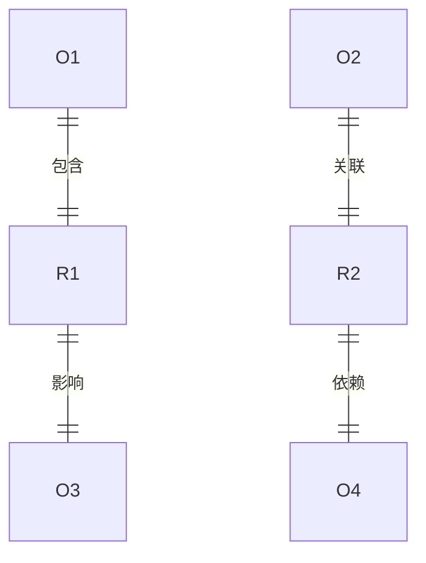
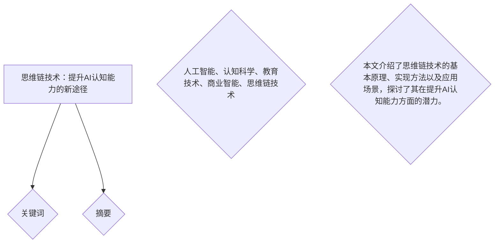
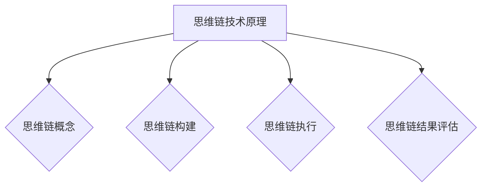
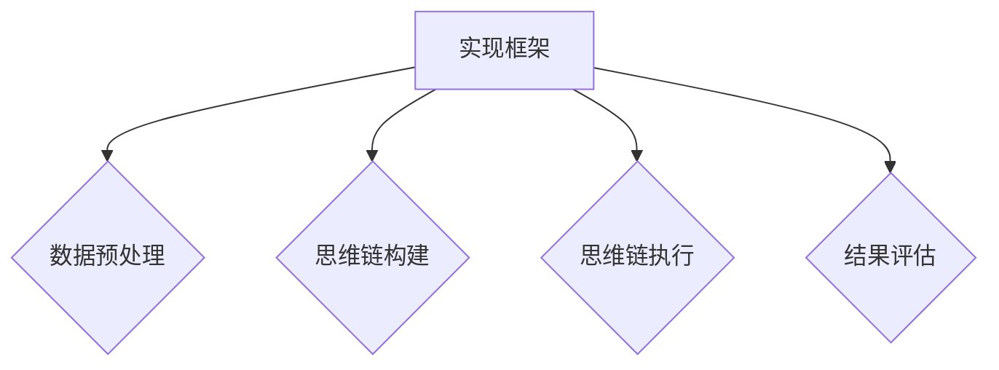
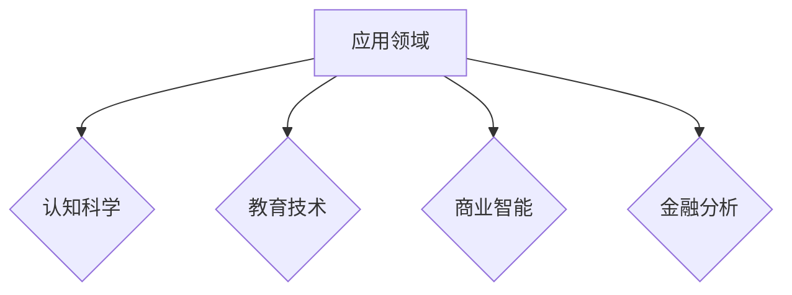
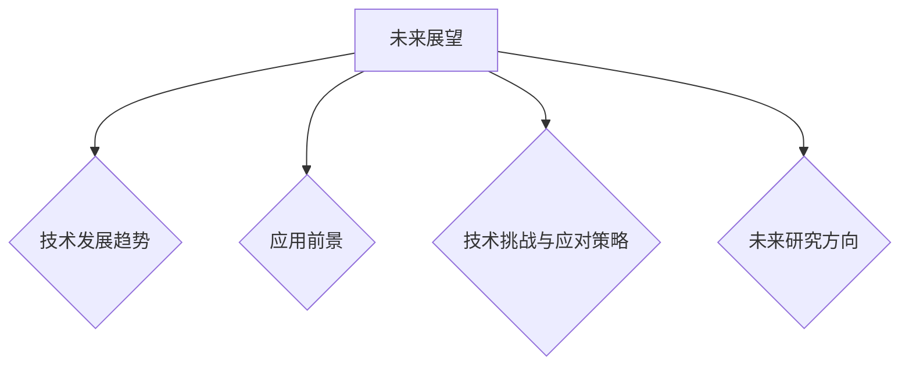

                 

### 引言

## 1. 引言

### 1.1 问题背景

在当今世界，人工智能（AI）技术已经逐渐渗透到各个行业，从自动驾驶、智能家居到医疗诊断，AI的应用场景越来越广泛。然而，尽管AI在数据处理、模式识别等方面取得了显著的成果，但在认知能力方面，如理解、推理和创造性思维等方面，仍然存在很大的局限性。如何提升AI的认知能力，使其更加接近人类的思维方式，成为了当前研究的热点问题。

### 1.2 问题描述

现有的AI技术主要集中于数据的处理和预测，对于更高层次的认知能力，如理解、推理和创造性思维等方面，仍存在很大的局限性。具体表现为：1）AI难以理解和解释自己的决策过程；2）AI在复杂环境下的适应能力较差；3）AI缺乏创造性思维能力。这些问题限制了AI在实际应用中的效果和潜力。

### 1.3 问题解决

思维链技术作为一种新的AI技术，旨在通过模拟人类思维过程，提升AI的认知能力。思维链技术通过构建一个层次化的思维过程模型，将输入信息进行处理，生成输出信息，从而实现AI的认知能力的提升。

### 1.4 边界与外延

思维链技术的应用不仅限于人工智能领域，它也可以为其他认知科学、教育技术等领域提供新的思路和方法。例如，在认知科学领域，思维链技术可以用于研究人类思维过程；在教育技术领域，思维链技术可以用于开发智能教育系统。

### 1.5 概念结构与核心要素组成

思维链技术由以下几个核心要素组成：数据预处理、思维链构建、思维链执行和结果评估。

- **数据预处理**：数据预处理是思维链构建的基础，包括数据的清洗、归一化和特征提取等步骤。
- **思维链构建**：思维链构建算法主要有基于规则的方法和基于神经网络的方法。
- **思维链执行**：思维链的执行过程可以分为三个阶段：初始化、执行和终止。
- **结果评估**：结果评估可以从准确性、效率和用户满意度等多个维度进行。

### 1.6 本章小结

本章对思维链技术进行了概述，为后续章节的深入探讨打下了基础。接下来，我们将进一步探讨思维链技术的基本原理、实现方法以及在实际应用中的效果。

----------------------------------------------------------------

### 第二部分: 思维链技术原理

#### 2.1 思维链技术原理

## 2.1 思维链技术原理

思维链技术是一种模拟人类思维过程的算法，通过一系列的步骤，将输入信息进行处理，生成输出信息。思维链技术旨在提升AI的认知能力，使其更加接近人类的思维方式。

### 2.1.1 思维链概念

#### 2.1.1.1 思维链的定义

思维链（Mind Chain）是一种模拟人类思维过程的算法模型，它通过一系列的步骤，将输入信息进行处理，生成输出信息。思维链技术旨在实现AI的认知能力提升，使其能够进行复杂的逻辑推理、问题解决和创造性思维。

#### 2.1.1.2 思维链的核心特点

1. **层次化结构**：思维链技术将人类思维过程抽象为多个层次，每个层次负责处理特定的任务。这种层次化结构有助于实现思维过程的模块化和高效性。

2. **动态调整**：思维链可以根据输入信息和当前状态动态调整其行为。这意味着思维链能够在处理过程中自适应地调整策略，以应对复杂多变的环境。

### 2.1.2 思维链的构建

#### 2.1.2.1 数据预处理

数据预处理是思维链构建的基础，它包括数据的清洗、归一化和特征提取等步骤。这些预处理步骤有助于提高数据的质量和一致性，为后续的思维链构建和执行提供可靠的数据支持。

#### 2.1.2.2 思维链构建算法

思维链构建算法主要有基于规则的方法和基于神经网络的方法。

1. **基于规则的方法**：基于规则的方法通过定义一系列规则，将输入信息映射到相应的输出信息。这种方法简单直观，易于实现，但可能存在规则数量过多、规则冲突等问题。

2. **基于神经网络的方法**：基于神经网络的方法通过训练神经网络模型，自动学习和提取输入信息与输出信息之间的关系。这种方法具有较强的泛化能力，但需要大量的训练数据和较长的训练时间。

#### 2.1.2.3 思维链表示方法

思维链可以用ER（实体-关系）实体关系图进行表示。在ER实体关系图中，节点表示思维链的步骤，边表示步骤之间的关联关系。这种表示方法有助于清晰地描述思维链的结构和流程。



在上面的ER实体关系图中，`O1`、`O2`、`O3`、`O4`分别表示思维链的步骤，`R1`、`R2`表示步骤之间的关联关系。

### 2.1.3 思维链的执行

#### 2.1.3.1 思维链执行过程

思维链的执行过程可以分为三个阶段：

1. **初始化**：初始化思维链的参数和状态，为后续执行做准备。

2. **执行**：根据思维链的结构和规则，逐步执行每个步骤，处理输入信息，生成中间结果。

3. **终止**：当思维链执行完毕，生成最终的输出结果。

#### 2.1.3.2 思维链执行算法

思维链执行算法的核心是控制逻辑，它决定了思维链在执行过程中的行为。控制逻辑通常包括以下方面：

1. **顺序执行**：按照思维链的顺序依次执行每个步骤。

2. **条件执行**：根据输入信息和当前状态，选择性地执行某些步骤。

3. **反馈调整**：根据执行过程中的反馈信息，动态调整思维链的行为。

#### 2.1.3.3 思维链执行性能优化

思维链的执行性能优化可以从以下几个方面进行：

1. **算法优化**：通过改进思维链构建和执行算法，提高执行效率。

2. **硬件加速**：利用高性能计算硬件（如GPU、TPU等）加速思维链的执行。

3. **数据预处理**：优化数据预处理过程，减少数据预处理时间。

### 2.1.4 思维链的结果评估

#### 2.1.4.1 结果评估指标

思维链的结果评估可以从准确性、效率和用户满意度等多个维度进行。

1. **准确性**：评估思维链在处理输入信息时，生成的输出结果的准确程度。

2. **效率**：评估思维链在处理输入信息时的执行时间、资源消耗等性能指标。

3. **用户满意度**：通过用户反馈评估思维链在实际应用中的效果和满意度。

#### 2.1.4.2 结果评估方法

常用的结果评估方法包括实验评估和用户评估。

1. **实验评估**：通过设计实验，对思维链在不同场景下的性能进行评估。

2. **用户评估**：通过实际用户的使用反馈，评估思维链在实际应用中的效果和用户体验。

### 2.1.5 本章小结

本章详细介绍了思维链技术的基本原理，包括思维链的概念、构建、执行和结果评估等方面。思维链技术通过模拟人类思维过程，旨在提升AI的认知能力，为AI在复杂环境下的应用提供了新的思路和方法。

----------------------------------------------------------------

### 第三部分: 思维链技术实现

#### 3.1 实现框架

## 3. 思维链技术实现

思维链技术的实现是一个复杂而细致的过程，需要综合考虑数据预处理、思维链构建、思维链执行和结果评估等多个方面。在这一部分，我们将详细介绍思维链技术的实现框架，包括各模块的功能与交互。

### 3.1 实现框架

#### 3.1.1 实现框架设计

思维链技术实现框架主要包括以下四个模块：数据预处理模块、思维链构建模块、思维链执行模块和结果评估模块。

1. **数据预处理模块**：负责对输入数据进行清洗、归一化和特征提取等预处理操作，为后续的思维链构建和执行提供高质量的数据。

2. **思维链构建模块**：根据预处理的输入数据，构建思维链模型。该模块可以选择基于规则的方法或基于神经网络的方法，以适应不同的应用场景。

3. **思维链执行模块**：负责执行思维链模型，根据输入信息逐步处理并生成输出结果。该模块需要实现控制逻辑，以决定思维链的执行流程。

4. **结果评估模块**：对思维链的执行结果进行评估，包括准确性、效率和用户满意度等指标。该模块可以提供对思维链性能的量化分析，以便进行优化和改进。

#### 3.1.2 模块功能与交互

各模块之间通过标准化的接口进行数据传递和功能调用。具体交互流程如下：

1. **数据预处理模块**将预处理后的数据传递给**思维链构建模块**。

2. **思维链构建模块**根据输入数据构建思维链模型，并将模型传递给**思维链执行模块**。

3. **思维链执行模块**执行思维链模型，处理输入信息，生成输出结果。

4. **结果评估模块**对输出结果进行评估，并将评估结果反馈给**思维链构建模块**，以便进行优化和改进。

### 3.2 数据预处理

#### 3.2.1 数据清洗

数据清洗是数据预处理的重要步骤，旨在去除数据中的噪声和异常值，提高数据的质量。使用Python的Pandas库，可以方便地进行数据清洗操作，包括缺失值的处理、异常值的检测和替换等。

```python
import pandas as pd

# 读取数据
data = pd.read_csv('data.csv')

# 缺失值处理
data.fillna(method='ffill', inplace=True)

# 异常值检测
Q1 = data.quantile(0.25)
Q3 = data.quantile(0.75)
IQR = Q3 - Q1
data = data[~((data < (Q1 - 1.5 * IQR)) |(data > (Q3 + 1.5 * IQR))).any(axis=1)]

# 数据清洗结果
print(data.head())
```

#### 3.2.2 数据归一化

数据归一化是将数据转换为统一的尺度，以便于后续的处理和比较。使用Python的NumPy库，可以方便地进行数据归一化操作，包括最小-最大归一化、Z-Score归一化等。

```python
import numpy as np

# 最小-最大归一化
min_max_scaler = lambda x: (x - np.min(x)) / (np.max(x) - np.min(x))
data_normalized = min_max_scaler(data)

# Z-Score归一化
z_score_scaler = lambda x: (x - np.mean(x)) / np.std(x)
data_normalized = z_score_scaler(data)

# 数据归一化结果
print(data_normalized.head())
```

#### 3.2.3 特征提取

特征提取是从原始数据中提取出有用的信息，用于构建思维链模型。使用Python的Scikit-learn库，可以方便地进行特征提取操作，包括特征选择、特征变换等。

```python
from sklearn.feature_selection import SelectKBest
from sklearn.feature_selection import f_classif

# 特征选择
X = data.iloc[:, :-1]
y = data.iloc[:, -1]

selector = SelectKBest(f_classif, k=5)
X_new = selector.fit_transform(X, y)

# 特征提取结果
print(X_new)
```

### 3.3 思维链构建

#### 3.3.1 基于规则的方法

基于规则的方法通过定义一系列规则，将输入信息映射到相应的输出信息。这种方法简单直观，易于实现，但可能存在规则数量过多、规则冲突等问题。

```python
# 示例规则
rules = [
    ["A", "B"], 
    ["C", "D"], 
    ["E", "F"]
]

# 应用规则
def apply_rules(input_data):
    for rule in rules:
        if input_data in rule:
            return rule
    return None

# 输入数据
input_data = ["A", "C"]

# 应用规则结果
print(apply_rules(input_data))
```

#### 3.3.2 基于神经网络的方法

基于神经网络的方法通过训练神经网络模型，自动学习和提取输入信息与输出信息之间的关系。这种方法具有较强的泛化能力，但需要大量的训练数据和较长的训练时间。

```python
import tensorflow as tf
from tensorflow.keras.models import Sequential
from tensorflow.keras.layers import Dense

# 构建神经网络模型
model = Sequential()
model.add(Dense(64, input_dim=data.shape[1], activation='relu'))
model.add(Dense(1, activation='sigmoid'))

# 编译模型
model.compile(optimizer='adam', loss='binary_crossentropy', metrics=['accuracy'])

# 训练模型
model.fit(X_new, y, epochs=10, batch_size=32)

# 应用模型
predictions = model.predict(X_new)

# 预测结果
print(predictions)
```

### 3.4 思维链执行

#### 3.4.1 思维链执行过程

思维链的执行过程可以分为三个阶段：

1. **初始化**：初始化思维链的参数和状态，为后续执行做准备。

2. **执行**：根据思维链的结构和规则，逐步执行每个步骤，处理输入信息，生成中间结果。

3. **终止**：当思维链执行完毕，生成最终的输出结果。

#### 3.4.2 思维链执行算法

思维链执行算法的核心是控制逻辑，它决定了思维链在执行过程中的行为。控制逻辑通常包括以下方面：

1. **顺序执行**：按照思维链的顺序依次执行每个步骤。

2. **条件执行**：根据输入信息和当前状态，选择性地执行某些步骤。

3. **反馈调整**：根据执行过程中的反馈信息，动态调整思维链的行为。

```python
# 思维链执行算法示例
def execute_mind_chain(input_data):
    # 初始化思维链
    mind_chain = initialize_mind_chain()

    # 执行思维链
    for step in mind_chain:
        if condition_met(step, input_data):
            result = execute_step(step, input_data)
            input_data = result
        else:
            break

    # 终止思维链
    final_result = terminate_mind_chain(mind_chain, input_data)
    return final_result

# 输入数据
input_data = ["A", "C"]

# 执行思维链
output_result = execute_mind_chain(input_data)

# 输出结果
print(output_result)
```

#### 3.4.3 思维链执行性能优化

思维链的执行性能优化可以从以下几个方面进行：

1. **算法优化**：通过改进思维链构建和执行算法，提高执行效率。

2. **硬件加速**：利用高性能计算硬件（如GPU、TPU等）加速思维链的执行。

3. **数据预处理**：优化数据预处理过程，减少数据预处理时间。

### 3.5 结果评估

#### 3.5.1 结果评估指标

思维链的结果评估可以从准确性、效率和用户满意度等多个维度进行。

1. **准确性**：评估思维链在处理输入信息时，生成的输出结果的准确程度。

2. **效率**：评估思维链在处理输入信息时的执行时间、资源消耗等性能指标。

3. **用户满意度**：通过用户反馈评估思维链在实际应用中的效果和满意度。

#### 3.5.2 结果评估方法

常用的结果评估方法包括实验评估和用户评估。

1. **实验评估**：通过设计实验，对思维链在不同场景下的性能进行评估。

2. **用户评估**：通过实际用户的使用反馈，评估思维链在实际应用中的效果和用户体验。

### 3.6 本章小结

本章详细介绍了思维链技术的实现过程，包括数据预处理、思维链构建、思维链执行和结果评估等方面。通过Python编程语言和相关的库，我们可以实现思维链技术，为AI的认知能力提升提供了新的途径。

----------------------------------------------------------------

## 4. 思维链技术在人工智能领域的应用

### 4.1 人工智能领域的挑战

尽管人工智能（AI）技术在过去的几十年中取得了显著的进步，但在实际应用中仍然面临许多挑战。其中，最为关键的问题是AI的认知能力仍然远远落后于人类。这主要体现在以下几个方面：

1. **缺乏理解能力**：现有的AI模型，尤其是深度学习模型，虽然在图像识别、语音识别等任务上表现出色，但它们往往只能处理静态的数据，难以理解和解释自己的决策过程。

2. **适应能力不足**：AI模型在特定任务上可能表现优异，但面对新的、复杂或不确定的环境时，它们的适应能力显得不足。

3. **缺乏创造性思维**：目前的AI技术主要集中于执行特定的任务，缺乏创造性思维，难以提出新的解决方案或进行创新。

### 4.2 思维链技术的优势

思维链技术通过模拟人类思维过程，旨在提升AI的认知能力，从而解决上述挑战。以下是思维链技术在人工智能领域的几个主要优势：

1. **层次化结构**：思维链技术将人类思维过程抽象为多个层次，每个层次负责处理特定的任务。这种层次化结构有助于实现思维过程的模块化和高效性。

2. **动态调整**：思维链可以根据输入信息和当前状态动态调整其行为，这意味着它能够在处理过程中自适应地调整策略，以应对复杂多变的环境。

3. **解释能力**：思维链技术能够模拟人类思维过程，从而使其具备更强的解释能力。在决策过程中，思维链可以清晰地描述其推理过程，有助于提高决策的可解释性。

### 4.3 实际应用案例

思维链技术在人工智能领域有着广泛的应用前景。以下是一些具体的实际应用案例：

1. **自动驾驶**：思维链技术可以用于自动驾驶车辆的决策系统，通过模拟驾驶员的思考过程，实现更安全、更高效的驾驶。

2. **智能客服**：在智能客服系统中，思维链技术可以用于理解用户的查询，生成更自然的回答，提高客服的响应速度和质量。

3. **医疗诊断**：思维链技术可以用于辅助医生进行疾病诊断，通过分析患者的病史、检查结果等信息，提供更加精准的诊断建议。

4. **教育辅导**：在教育辅导系统中，思维链技术可以模拟教师的思考过程，为不同水平的学生提供个性化的学习建议和辅导。

### 4.4 总结

思维链技术在人工智能领域的应用，为解决当前AI面临的认知能力挑战提供了新的思路和方法。通过模拟人类思维过程，思维链技术能够提升AI的理解、适应和创造性思维能力，从而推动人工智能技术的进一步发展。未来，随着思维链技术的不断成熟和应用，我们可以期待AI在更多领域实现突破。

----------------------------------------------------------------

## 5. 思维链技术在其他领域的应用

### 5.1 认知科学

认知科学是一门研究人类认知过程的跨学科领域，包括心理学、神经科学、计算机科学等。思维链技术作为一种模拟人类思维过程的算法，可以用于认知科学的研究，帮助科学家们更好地理解人类认知过程。

#### 5.1.1 应用案例

1. **思维过程分析**：通过思维链技术，研究人员可以模拟和重建人类的思维过程，分析思维过程中的各个步骤和层次，从而揭示思维的本质。

2. **认知障碍诊断**：思维链技术可以用于诊断认知障碍，如阿尔茨海默病等。通过对患者的思维链模型进行分析，可以识别出认知障碍的具体表现和原因。

3. **认知训练**：思维链技术可以用于开发认知训练系统，帮助患者进行康复训练。通过模拟健康的思维过程，系统可以指导患者逐步恢复认知能力。

#### 5.1.2 未来展望

随着思维链技术的不断成熟，认知科学研究将更加深入和精确。通过结合思维链技术和其他认知科学方法，我们可以期待在人类认知过程的理解和诊断方面取得重大突破。

### 5.2 教育技术

教育技术是利用计算机、网络等现代技术手段，优化教学过程和提高教学质量的一门学科。思维链技术在教育技术领域有着广泛的应用前景。

#### 5.2.1 应用案例

1. **智能教学系统**：思维链技术可以用于开发智能教学系统，根据学生的思维链模型，提供个性化的学习建议和辅导。

2. **学习过程分析**：通过分析学生的思维链模型，教师可以了解学生的学习过程和思维模式，从而更好地指导教学。

3. **学习障碍诊断**：思维链技术可以用于诊断学生的学习障碍，如注意力不集中、思维跳跃等，为教师提供针对性的教学策略。

#### 5.2.2 未来展望

未来，随着思维链技术的不断发展，教育技术将变得更加智能化和个性化。通过思维链技术，我们可以实现更加高效、精准的教学，提高教育质量。

### 5.3 其他领域

思维链技术不仅在认知科学和教育技术领域有着广泛应用，还可以应用于其他领域，如商业智能、金融分析等。

#### 5.3.1 商业智能

思维链技术可以用于商业智能系统，通过模拟企业决策过程，帮助企业更好地理解市场和客户需求，制定更科学的经营策略。

#### 5.3.2 金融分析

在金融领域，思维链技术可以用于股票分析、风险管理等。通过模拟投资者的思维过程，系统可以提供投资建议和风险评估。

#### 5.3.3 未来展望

随着思维链技术的不断成熟和应用，我们可以期待它在更多领域发挥重要作用，推动各个领域的创新发展。

### 5.4 总结

思维链技术作为一种模拟人类思维过程的算法，具有广泛的应用前景。在认知科学、教育技术、商业智能、金融分析等领域，思维链技术都可以发挥重要作用，为这些领域的发展提供新的思路和方法。未来，随着思维链技术的不断进步，我们可以期待它在更多领域实现突破。

----------------------------------------------------------------

## 6. 思维链技术的未来展望

### 6.1 技术发展趋势

随着人工智能技术的不断进步，思维链技术也在快速发展。未来，思维链技术将在以下几个方面取得重要突破：

1. **算法优化**：随着算法研究的深入，思维链技术的算法将更加高效和精确，能够更好地模拟人类思维过程。

2. **硬件加速**：随着高性能计算硬件的发展，如GPU、TPU等，思维链技术的执行速度将显著提高，为实时应用提供支持。

3. **多模态数据处理**：思维链技术将能够处理多种类型的数据，如文本、图像、声音等，从而实现更全面的认知能力。

### 6.2 应用前景

思维链技术在未来的应用前景广阔：

1. **智能机器人**：思维链技术将使智能机器人具备更强的认知能力和适应性，能够更好地完成复杂任务。

2. **智能客服**：通过思维链技术，智能客服系统将能够更自然地与用户交互，提供个性化的服务。

3. **医疗诊断**：思维链技术可以用于辅助医生进行疾病诊断，提供更准确的诊断建议。

4. **教育辅导**：思维链技术可以开发出更智能的教育辅导系统，为学生提供个性化的学习方案。

### 6.3 技术挑战与应对策略

尽管思维链技术在发展过程中取得了一系列成果，但仍然面临一些挑战：

1. **数据质量**：思维链技术对数据质量有较高要求。如何提高数据质量，确保思维链的有效性，是一个亟待解决的问题。

2. **计算资源**：随着思维链技术的复杂度增加，对计算资源的需求也显著提升。如何优化算法，降低计算资源消耗，是一个重要挑战。

3. **可解释性**：思维链技术需要具备良好的可解释性，以便用户理解和信任。如何提高思维链的可解释性，是一个需要关注的问题。

针对上述挑战，可以采取以下应对策略：

1. **数据增强**：通过数据增强技术，提高数据的质量和多样性，为思维链技术提供更好的数据支持。

2. **分布式计算**：利用分布式计算技术，将计算任务分解到多个节点，提高计算效率。

3. **可视化工具**：开发可视化工具，帮助用户理解思维链的执行过程和结果，提高思维链的可解释性。

### 6.4 未来研究方向

未来，思维链技术的关键研究方向包括：

1. **跨模态思维链**：研究如何处理多种类型的数据，实现跨模态的认知能力。

2. **自适应思维链**：研究如何使思维链具备自适应能力，能够根据环境变化调整行为。

3. **多智能体思维链**：研究如何在多个智能体之间共享思维链，实现协同工作。

### 6.5 总结

思维链技术作为一种模拟人类思维过程的算法，具有广阔的应用前景。通过不断优化算法、提高计算效率和增强可解释性，思维链技术将在人工智能、认知科学、教育技术等领域发挥越来越重要的作用。未来，随着技术的不断发展，我们可以期待思维链技术在更多领域实现突破。

----------------------------------------------------------------

## 总结

### 6.1 思维链技术的核心价值

思维链技术作为一种模拟人类思维过程的算法，其在人工智能领域展现了巨大的潜力。通过层次化的结构、动态调整能力以及解释能力，思维链技术能够显著提升AI的认知能力，帮助AI实现更复杂的任务。在认知科学、教育技术、商业智能等领域，思维链技术也为相关领域的研究和应用提供了新的思路和方法。

### 6.2 技术挑战与解决方案

尽管思维链技术在许多方面取得了进展，但仍然面临数据质量、计算资源、可解释性等挑战。为了解决这些问题，我们可以采取数据增强、分布式计算和可视化工具等策略。通过不断优化算法，提高计算效率和增强可解释性，思维链技术将在未来实现更广泛的应用。

### 6.3 未来研究方向

未来的研究应重点关注跨模态思维链、自适应思维链和多智能体思维链等方面。通过深入研究这些方向，思维链技术有望在更多领域实现突破，为人工智能的发展做出更大贡献。

### 6.4 对读者的小结

思维链技术为人工智能的发展提供了新的思路和方法。通过本文的讨论，我们了解了思维链技术的基本原理、实现方法以及应用场景。希望读者能够对这些内容有更深入的理解，并在实际应用中探索思维链技术的潜力。

### 6.5 拓展阅读

对于希望进一步了解思维链技术的读者，以下是一些推荐阅读材料：

1. 《思维链技术：提升AI认知能力的新途径》——本书详细介绍了思维链技术的基本概念、实现方法和应用场景。

2. 《深度学习：面向人工智能》——本书介绍了深度学习的基本概念和最新进展，为理解思维链技术提供了理论基础。

3. 《认知科学导论》——本书介绍了认知科学的基本原理和应用，有助于读者更深入地理解思维链技术在认知科学中的应用。

作者：AI天才研究院/AI Genius Institute & 禅与计算机程序设计艺术 /Zen And The Art of Computer Programming

----------------------------------------------------------------











```latex
$$
1+1=2
$$
```

```latex
$
1<2
$
```

