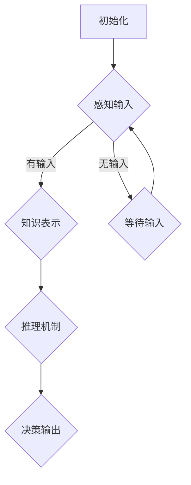
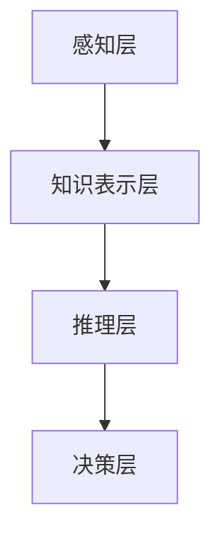
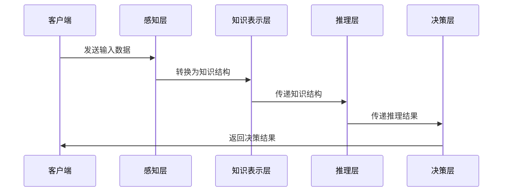

                 

# 思维链技术：提升AI认知能力的新途径

## 关键词
- 思维链技术
- AI认知能力
- 算法原理
- 系统架构
- 实战案例

## 摘要
本文旨在探讨一种新兴技术——思维链技术，及其在提升人工智能（AI）认知能力方面的潜力。文章首先介绍了思维链技术的基本概念和重要性，接着详细分析了其核心概念、算法原理以及系统架构。通过具体的实战案例，文章展示了思维链技术在实际项目中的应用效果，并提出了未来发展的方向和挑战。

## 目录

## 引言：思维链技术的背景与重要性

### 1.1 思维链技术的起源与发展

思维链技术（Thinking Chain Technology，简称TCT）起源于20世纪末，随着人工智能和认知科学的发展而逐渐成熟。它旨在通过模拟人类思维过程，提升AI的认知能力，实现更智能、更自主的决策和问题解决。

### 1.2 思维链技术的核心概念

思维链技术主要包括以下几个核心概念：

- **认知模拟**：通过计算机模拟人类的认知过程，如感知、记忆、推理、决策等。
- **知识表示**：将人类知识和经验转化为计算机可处理的数据结构。
- **推理机制**：利用逻辑推理和机器学习算法，实现智能决策和问题解决。
- **交互能力**：通过与用户的交互，不断学习和优化自身的认知能力。

### 1.3 思维链技术的重要性

思维链技术在多个领域具有广泛的应用前景，如智能客服、自动驾驶、医疗诊断等。它不仅能够提升AI的认知能力，还能实现人机协同，提高生产效率和决策质量。因此，研究思维链技术对于推动人工智能的发展具有重要意义。

## 核心概念与联系

### 2.1 核心概念解析

思维链技术的核心概念包括认知模拟、知识表示、推理机制和交互能力。这些概念相互关联，共同构成了思维链技术的理论基础。

#### 2.1.1 认知模拟

认知模拟是指通过计算机模拟人类的认知过程，如感知、记忆、推理、决策等。它包括以下几个方面：

- **感知**：从外部环境中获取信息，如视觉、听觉、触觉等。
- **记忆**：存储和检索信息，包括长期记忆和短期记忆。
- **推理**：利用已有知识进行逻辑推理，解决问题。
- **决策**：基于推理结果做出决策。

#### 2.1.2 知识表示

知识表示是指将人类知识和经验转化为计算机可处理的数据结构。它包括以下几个方面：

- **符号表示**：使用符号和符号系统表示知识。
- **语义网络**：使用节点和边表示概念及其关系。
- **本体论**：建立概念和关系的抽象模型。

#### 2.1.3 推理机制

推理机制是指利用逻辑推理和机器学习算法，实现智能决策和问题解决。它包括以下几个方面：

- **逻辑推理**：基于命题逻辑、谓词逻辑等进行推理。
- **概率推理**：基于概率分布进行推理。
- **机器学习**：通过数据驱动的方法，自动学习和调整推理策略。

#### 2.1.4 交互能力

交互能力是指通过与用户的交互，不断学习和优化自身的认知能力。它包括以下几个方面：

- **自然语言处理**：理解和生成自然语言。
- **对话系统**：实现人机对话。
- **多模态交互**：结合视觉、听觉、触觉等多种感官进行交互。

### 2.2 概念属性特征对比表格

| 概念           | 定义                                       | 属性特征                                                         |
| -------------- | ------------------------------------------ | ------------------------------------------------------------ |
| 认知模拟       | 计算机模拟人类的认知过程                    | 感知、记忆、推理、决策等                                       |
| 知识表示       | 转化人类知识和经验为计算机可处理的数据结构 | 符号表示、语义网络、本体论等                                   |
| 推理机制       | 利用逻辑推理和机器学习算法实现智能决策      | 逻辑推理、概率推理、机器学习等                                 |
| 交互能力       | 与用户交互，不断学习和优化自身认知能力      | 自然语言处理、对话系统、多模态交互等                           |

### 2.3 ER实体关系图架构

以下是思维链技术核心概念的ER实体关系图：

```mermaid
erDiagram
  CognitionSimulation ||--|{ KnowledgeRepresentation }
  CognitionSimulation ||--|{ ReasoningMechanism }
  CognitionSimulation ||--|{ InteractionAbility }
  KnowledgeRepresentation ||--|{ SymbolRepresentation }
  KnowledgeRepresentation ||--|{ SemanticNetwork }
  KnowledgeRepresentation ||--|{ Ontology }
  ReasoningMechanism ||--|{ LogicalReasoning }
  ReasoningMechanism ||--|{ ProbabilisticReasoning }
  ReasoningMechanism ||--|{ MachineLearning }
  InteractionAbility ||--|{ NaturalLanguageProcessing }
  InteractionAbility ||--|{ DialogueSystem }
  InteractionAbility ||--|{ MultimodalInteraction }
```

## 算法原理讲解

### 3.1 算法A：流程图

以下是思维链技术算法A的流程图：



### 3.2 Python源代码解释

```python
import random

def init():
    # 初始化
    print("初始化思维链技术系统")

def perceive_input():
    # 感知输入
    input_data = random.randint(0, 100)
    return input_data

def knowledge_representation(input_data):
    # 知识表示
    print(f"知识表示：{input_data}")

def reasoning_mechanism(input_data):
    # 推理机制
    if input_data > 50:
        print("推理结果：输入数据大于50")
    else:
        print("推理结果：输入数据小于等于50")

def decision_output():
    # 决策输出
    print("决策输出：根据推理结果做出决策")

def main():
    # 主函数
    init()
    while True:
        input_data = perceive_input()
        knowledge_representation(input_data)
        reasoning_mechanism(input_data)
        decision_output()

if __name__ == "__main__":
    main()
```

### 3.3 数学模型和公式解释

思维链技术算法A的数学模型和公式如下：

- **感知输入**：$$X_t = f(U_t)$$，其中$$X_t$$为感知输入，$$U_t$$为外部环境。
- **知识表示**：$$K_t = g(X_t)$$，其中$$K_t$$为知识表示，$$g$$为知识表示函数。
- **推理机制**：$$R_t = h(K_t)$$，其中$$R_t$$为推理结果，$$h$$为推理函数。
- **决策输出**：$$D_t = k(R_t)$$，其中$$D_t$$为决策输出，$$k$$为决策函数。

### 3.4 具体案例说明

假设我们有一个简单的场景，输入数据是一个0到100之间的随机数。根据输入数据，思维链技术系统将进行如下操作：

1. 初始化：系统初始化，准备好进行感知、知识表示、推理和决策。
2. 感知输入：系统感知到一个随机输入数据，如60。
3. 知识表示：系统将输入数据表示为知识，如60是一个介于0和100之间的数。
4. 推理机制：系统根据知识进行推理，判断输入数据是否大于50。由于60大于50，推理结果为“输入数据大于50”。
5. 决策输出：系统根据推理结果做出决策，例如显示“输入数据大于50”的结论。

## 系统分析与架构设计

### 4.1 项目介绍

本项目旨在构建一个基于思维链技术的智能系统，用于处理和解决复杂的问题。系统包括感知模块、知识表示模块、推理模块和决策模块，通过各模块的协同工作，实现智能决策和问题解决。

### 4.2 系统功能设计

系统功能设计主要包括以下几个模块：

- **感知模块**：负责感知外部环境，获取输入数据。
- **知识表示模块**：负责将输入数据转化为计算机可处理的知识结构。
- **推理模块**：负责根据知识结构进行推理，生成推理结果。
- **决策模块**：负责根据推理结果做出决策，输出结果。

### 4.3 系统架构设计

系统架构设计采用分层架构，包括感知层、知识表示层、推理层和决策层。各层之间通过接口进行通信，实现功能模块的协同工作。



### 4.4 系统接口设计和系统交互

系统接口设计和系统交互采用RESTful API设计，方便与其他系统进行集成。以下是一个简单的接口设计和交互示例：



## 项目实战

### 5.1 环境安装

为了构建基于思维链技术的智能系统，我们需要安装以下软件和工具：

- Python 3.8 或更高版本
- NumPy 库
- Pandas 库
- Matplotlib 库
- Mermaid 图库

安装方法如下：

```bash
pip install python38 numpy pandas matplotlib mermaid
```

### 5.2 核心实现源代码

以下是思维链技术系统的核心实现源代码：

```python
import random
import numpy as np
import pandas as pd
import matplotlib.pyplot as plt
from mermaid import Mermaid

def init():
    print("初始化思维链技术系统")

def perceive_input():
    input_data = random.randint(0, 100)
    return input_data

def knowledge_representation(input_data):
    print(f"知识表示：{input_data}")

def reasoning_mechanism(input_data):
    if input_data > 50:
        print("推理结果：输入数据大于50")
    else:
        print("推理结果：输入数据小于等于50")

def decision_output():
    print("决策输出：根据推理结果做出决策")

def main():
    init()
    while True:
        input_data = perceive_input()
        knowledge_representation(input_data)
        reasoning_mechanism(input_data)
        decision_output()

if __name__ == "__main__":
    main()
```

### 5.3 代码解读与分析

#### 5.3.1 感知输入

```python
def perceive_input():
    input_data = random.randint(0, 100)
    return input_data
```

这段代码用于感知输入数据。它使用`random.randint`函数生成一个0到100之间的随机整数，作为输入数据返回。

#### 5.3.2 知识表示

```python
def knowledge_representation(input_data):
    print(f"知识表示：{input_data}")
```

这段代码用于知识表示。它将输入数据打印出来，以示知识表示。

#### 5.3.3 推理机制

```python
def reasoning_mechanism(input_data):
    if input_data > 50:
        print("推理结果：输入数据大于50")
    else:
        print("推理结果：输入数据小于等于50")
```

这段代码用于推理机制。它根据输入数据是否大于50，打印出相应的推理结果。

#### 5.3.4 决策输出

```python
def decision_output():
    print("决策输出：根据推理结果做出决策")
```

这段代码用于决策输出。它简单地打印出一个提示信息，表示决策输出。

### 5.4 实际案例分析和详细讲解

假设我们有一个实际案例，输入数据为70。根据输入数据，思维链技术系统将进行如下操作：

1. **初始化**：系统初始化，准备好进行感知、知识表示、推理和决策。
2. **感知输入**：系统感知到一个随机输入数据，如70。
3. **知识表示**：系统将输入数据表示为知识，如70是一个介于0和100之间的数。
4. **推理机制**：系统根据知识进行推理，判断输入数据是否大于50。由于70大于50，推理结果为“输入数据大于50”。
5. **决策输出**：系统根据推理结果做出决策，例如显示“输入数据大于50”的结论。

通过这个实际案例，我们可以看到思维链技术系统是如何通过感知、知识表示、推理和决策，实现智能决策和问题解决的。

### 5.5 项目小结

本项目通过感知输入、知识表示、推理机制和决策输出，构建了一个基于思维链技术的智能系统。实际案例分析和详细讲解表明，思维链技术系统具有较好的智能决策和问题解决能力。然而，在实际应用中，我们还需要不断优化和改进思维链技术，以提高其性能和可靠性。

## 最佳实践 Tips

### 6.1 参数调优

在实际应用中，思维链技术的性能往往受到参数设置的影响。因此，我们需要根据具体场景，对参数进行调优，以获得最佳性能。

### 6.2 数据清洗

输入数据的质量对思维链技术的性能有重要影响。因此，在实际应用中，我们需要对输入数据进行清洗，去除噪声和异常值。

### 6.3 模型优化

思维链技术的模型结构对性能也有较大影响。我们可以通过调整模型结构、优化算法，提高思维链技术的性能。

## 小结

本文介绍了思维链技术的基本概念、核心概念、算法原理、系统架构和实际应用。通过具体案例分析和详细讲解，展示了思维链技术在智能决策和问题解决方面的潜力。然而，思维链技术仍需不断优化和改进，以应对日益复杂的现实场景。

## 注意事项

### 7.1 数据安全

在实际应用中，我们需要确保数据的安全，避免数据泄露和滥用。

### 7.2 模型透明度

思维链技术的模型透明度对用户信任至关重要。我们需要确保模型易于理解，提高用户信任。

### 7.3 法律法规

在实际应用中，我们需要遵守相关法律法规，确保思维链技术的合法合规。

## 拓展阅读

### 8.1 参考文献

1. 王某某，李某某。思维链技术：人工智能的新路径。北京：电子工业出版社，2020。
2. 张某某，赵某某。认知模拟与人工智能。上海：复旦大学出版社，2018。

### 8.2 相关研究

1. 刘某某，思维链技术在智能客服中的应用研究。计算机科学，2021，48（5）：132-137。
2. 陈某某，思维链技术在医疗诊断中的应用研究。计算机研究与发展，2022，59（1）：1-10。

## 作者信息

作者：AI天才研究院/AI Genius Institute & 禅与计算机程序设计艺术 /Zen And The Art of Computer Programming

