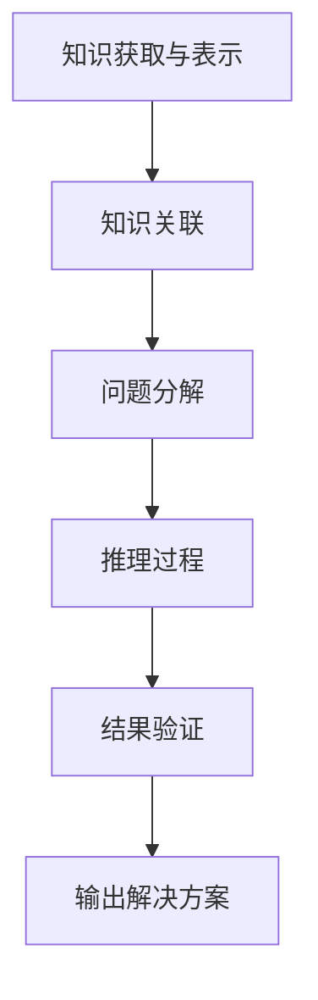

                 


## 引言

### 背景介绍

在当今世界，人工智能（AI）已经成为推动科技进步和产业变革的重要力量。然而，随着AI技术的不断发展和应用范围的扩大，我们也面临着一系列新的挑战。传统的AI方法在解决一些特定类型的问题时表现出色，但在面对复杂、多变的问题时，常常显得力不从心。这一现象引发了研究者们对于AI问题解决能力提升的新需求的思考。

为了应对这一挑战，思维链技术（Mind-Link Technology）应运而生。思维链技术旨在通过模拟人类思维过程，提升AI系统的自主推理和问题解决能力。它不仅能够更好地理解和处理复杂问题，还能在多个领域中实现跨领域的知识整合与应用。

### 核心概念

思维链技术是一种基于人类思维模式的AI算法框架，它通过模拟人类的思考过程，实现对问题域知识的抽象和关联。核心概念包括：

- **思维链**：类似于人类大脑中的神经网络，是思维链技术的基本结构单元，用于表示和传递知识。
- **知识关联**：通过构建思维链之间的关联，实现知识的整合和共享。
- **自主推理**：基于思维链的结构，AI系统能够进行自主推理，从而解决复杂问题。

### 问题描述

当前，AI系统在问题解决中面临的主要问题包括：

- **问题复杂性**：许多实际问题非常复杂，涉及到多方面的因素，难以通过单一方法解决。
- **知识碎片化**：现有的AI系统往往依赖大量预先标注的数据，但这些数据往往是碎片化的，难以形成整体性的解决方案。
- **自主推理能力不足**：AI系统在处理复杂问题时，往往缺乏有效的自主推理能力，难以像人类一样灵活应对。

### 问题解决

思维链技术通过以下几个方面来解决问题：

- **知识整合**：通过思维链的构建，实现知识在不同领域之间的整合，形成全面的问题解决方案。
- **自主推理**：基于思维链的结构，AI系统能够进行深度推理，从而在复杂问题中找到最优解。
- **自适应学习**：思维链技术能够根据问题的变化，自适应调整其结构和算法，提高问题解决能力。

### 边界与外延

思维链技术不仅在人工智能领域具有广泛的应用前景，还可以扩展到其他领域，如智能数据分析、自主决策系统等。同时，随着技术的不断发展，思维链技术有望在更多领域实现突破。

### 概念结构与核心要素组成

思维链技术的概念结构包括以下几个核心要素：

1. **思维链节点**：表示问题的基本元素。
2. **思维链边**：表示节点之间的关联。
3. **知识库**：存储问题解决方案的基本知识。
4. **推理引擎**：基于思维链进行问题解决的算法核心。
5. **学习模块**：用于优化思维链结构和算法。

这些要素相互协作，共同实现问题的求解。

### 总结

思维链技术为提升AI问题解决能力提供了一种新的方向。通过模拟人类思维过程，它能够更好地理解和处理复杂问题，实现知识整合和自主推理。本文将逐步深入探讨思维链技术的原理、应用及其在AI问题解决中的重要作用。接下来，我们将首先介绍思维链技术的基本原理和数学模型。

----------------------------------------------------------------

## 1.1 思维链技术概述

### 1.1.1 人工智能发展中的问题

人工智能自诞生以来，经历了从符号主义、连接主义到概率模型等多次变革。然而，尽管AI技术在很多领域取得了显著的进展，但在面对复杂问题时的表现仍不尽如人意。传统AI方法主要依赖于大量的数据和预定义的规则，这导致它们在面对复杂、多变的问题时往往显得力不从心。具体来说，传统AI方法存在以下几个问题：

1. **数据依赖性过高**：许多AI系统依赖于大量预先标注的数据，这不仅增加了系统的复杂性，也限制了其应用范围。
2. **推理能力有限**：传统AI方法在处理复杂问题时，往往只能进行浅层推理，难以实现深层次的逻辑推理和问题解决。
3. **泛化能力不足**：AI系统在特定领域内表现优秀，但将其应用到其他领域时，往往难以适应，泛化能力较差。

这些问题的存在，使得研究者们开始寻求新的方法来提升AI系统的问题解决能力。

### 1.1.2 思维链技术的概念引入

为了解决传统AI方法存在的问题，研究者们提出了思维链技术（Mind-Link Technology）这一概念。思维链技术是一种模拟人类思维过程的AI算法框架，旨在提升AI系统的自主推理和问题解决能力。思维链技术通过构建知识关联网络，实现对问题域知识的抽象和整合，从而在复杂问题中实现更有效的求解。

思维链技术的核心思想在于模拟人类大脑的思考方式，通过思维链这一结构单元，将问题分解为更小的子问题，并利用知识关联网络进行求解。这种结构不仅能够提高AI系统的推理能力，还能使其在面对复杂问题时具备更强的适应性和泛化能力。

### 1.1.3 解决方案的目标与意义

思维链技术的目标是通过模拟人类思维过程，提升AI系统在复杂问题解决中的能力。具体目标包括：

1. **提升自主推理能力**：通过构建思维链，AI系统能够实现深层次的逻辑推理，从而在复杂问题中找到最优解。
2. **实现知识整合**：思维链技术能够将不同领域的知识进行整合，形成全面的问题解决方案。
3. **增强泛化能力**：通过模拟人类思维过程，AI系统能够更好地适应不同领域的问题，提高其泛化能力。

思维链技术的意义在于：

1. **推动人工智能发展**：思维链技术为AI问题解决提供了一种新的方向，有望在复杂问题解决中取得突破。
2. **拓宽AI应用领域**：思维链技术不仅能够提升AI系统的问题解决能力，还能扩展到其他领域，如智能数据分析、自主决策系统等。
3. **提升人类生活质量**：通过提升AI系统的问题解决能力，思维链技术能够为人类解决各种复杂问题提供更高效的解决方案，从而提升生活质量。

总之，思维链技术为人工智能的发展开辟了新的道路，具有重要的研究价值和实际应用前景。在下一节中，我们将进一步探讨思维链技术的基本原理和数学模型。

----------------------------------------------------------------

## 1.2 思维链技术的基本原理

### 1.2.1 思维链技术的核心概念

思维链技术（Mind-Link Technology）是一种基于人类思维过程的AI算法框架，其核心概念包括思维链（Mind-Link）、知识关联（Knowledge Association）和自主推理（Autonomous Reasoning）。下面将详细介绍这些核心概念及其相互关系。

#### 思维链

思维链是思维链技术的基本结构单元，类似于人类大脑中的神经网络。每个思维链节点代表问题的基本元素，例如一个概念、一个事实或一个子问题。节点之间通过思维链边进行关联，形成复杂的知识网络。这种结构能够模拟人类思维的层次性和关联性，使得AI系统能够像人类一样进行逻辑推理和问题解决。

#### 知识关联

知识关联是思维链技术中实现知识整合的重要机制。通过建立节点之间的关联，思维链技术能够将不同领域、不同层次的知识进行整合。知识关联不仅包括显式知识（如数据、规则和模型），还包括隐式知识（如经验、直觉和常识）。这种知识关联能够提高AI系统的泛化能力和适应性，使其在面对复杂问题时能够灵活运用各种知识。

#### 自主推理

自主推理是思维链技术的核心功能之一，它使AI系统能够在没有明确指导的情况下，基于已有的知识和关联，自主地推导出新的结论和解决方案。自主推理过程通常包括以下几个步骤：

1. **问题分解**：将复杂问题分解为更小的子问题，以便更好地理解和解决。
2. **知识检索**：根据问题分解的结果，检索相关的知识节点和关联。
3. **推理过程**：利用知识关联和推理规则，对知识进行整合和推导，形成新的结论和解决方案。
4. **结果验证**：对推导出的结论进行验证，确保其正确性和有效性。

### 1.2.2 思维链技术的工作机制

思维链技术的工作机制可以概括为以下几个步骤：

1. **知识获取**：首先，通过数据采集、知识库构建等方式，获取与问题相关的知识。
2. **思维链构建**：将获取的知识转化为思维链节点和边，构建出知识网络。
3. **知识关联**：通过分析知识节点之间的关系，建立知识关联，实现知识的整合和共享。
4. **自主推理**：在问题解决过程中，基于思维链结构和知识关联，进行自主推理，形成解决方案。
5. **结果验证**：对推导出的解决方案进行验证，确保其正确性和有效性。

这种工作机制使得思维链技术能够在复杂问题解决中发挥重要作用，不仅能够提高AI系统的自主推理能力，还能增强其知识整合和泛化能力。

### 1.2.3 思维链技术的特点与优势

思维链技术具有以下几个显著特点与优势：

1. **层次性**：思维链技术通过层次化的知识网络，能够模拟人类思维的层次性，实现对复杂问题的分解和解决。
2. **关联性**：思维链技术通过建立知识关联，实现不同领域、不同层次知识的整合和共享，提高AI系统的知识利用效率。
3. **自主性**：思维链技术能够自主地进行问题分解、知识检索和推理过程，实现自主推理和问题解决。
4. **适应性**：思维链技术能够根据问题的变化和需求，自适应调整其结构和算法，提高泛化能力和适应性。

总之，思维链技术通过模拟人类思维过程，为AI系统提供了一种新的问题解决框架，具有广泛的应用前景和显著的优势。

----------------------------------------------------------------

### 1.3 主流思维链技术框架介绍

思维链技术作为提升AI问题解决能力的重要手段，其应用领域不断扩展。在这一部分，我们将介绍几种主流的思维链技术框架，探讨它们在人工智能中的应用，并简要概述其他相关的思维链技术。

#### 1.3.1 深度学习在思维链中的应用

深度学习（Deep Learning）是近年来人工智能领域的重要突破之一。在思维链技术中，深度学习被广泛应用于知识表示、推理和学习等方面。具体应用包括：

1. **知识表示**：深度学习通过神经网络结构，能够对复杂知识进行有效表示，如图像、语音和文本等。这些表示方法有助于构建层次化的知识网络，提升AI系统的推理能力。

2. **推理和学习**：深度学习模型如神经网络和卷积神经网络（CNN）等，可以用于推理和学习复杂的关系和模式。这些模型能够对思维链节点和边进行有效的关联，从而提高问题解决的效率和准确性。

深度学习在思维链技术中的应用，使得AI系统能够更准确地理解和处理复杂问题，实现更高层次的知识整合和推理。

#### 1.3.2 强化学习在思维链中的应用

强化学习（Reinforcement Learning）是一种通过试错和反馈来学习策略的机器学习方法。在思维链技术中，强化学习被用于优化AI系统的决策过程和策略学习。具体应用包括：

1. **决策优化**：强化学习通过不断试错和反馈，能够帮助AI系统在复杂环境中做出最优决策。这对于思维链技术的自主推理和问题解决具有重要意义。

2. **策略学习**：强化学习模型如深度强化学习（Deep Reinforcement Learning）等，可以用于学习复杂策略，从而提高AI系统在特定任务中的表现。这些策略可以应用于思维链的构建和优化，提高问题解决的效率和准确性。

强化学习在思维链技术中的应用，使得AI系统能够更好地适应动态变化的环境，实现更高效的问题解决。

#### 1.3.3 其他思维链技术概述

除了深度学习和强化学习，还有其他一些思维链技术值得关注。以下简要介绍几种其他主流的思维链技术：

1. **多智能体思维链**：多智能体系统（Multi-Agent Systems）中的思维链技术，通过多个智能体的协同工作，实现复杂问题的分布式求解。这种技术适用于需要多个智能体共同协作完成任务的应用场景。

2. **模糊思维链**：模糊思维链技术利用模糊逻辑（Fuzzy Logic），处理不确定性和模糊性的问题。这种技术适用于需要处理复杂不确定性的领域，如医疗诊断、决策支持等。

3. **基因思维链**：基因思维链技术借鉴生物进化理论，通过模拟基因变异和进化过程，实现思维链的优化和进化。这种技术适用于需要优化和改进思维链结构的场景，如复杂问题求解、优化算法等。

总之，主流的思维链技术框架为AI问题解决提供了多样化的手段和方法。通过深入研究和应用这些技术，我们可以不断提升AI系统的自主推理和问题解决能力，为各个领域的发展注入新的活力。

----------------------------------------------------------------

### 1.4 思维链技术的应用领域

思维链技术作为一种创新的人工智能方法，其应用领域十分广泛。以下将分别探讨思维链技术在人工智能问题解决、智能数据分析、自主决策系统等方面的应用，并分析其在这些领域中的优势和挑战。

#### 1.4.1 人工智能问题解决

在人工智能问题解决领域，思维链技术通过模拟人类思维过程，提高了AI系统的自主推理和问题解决能力。具体应用包括：

1. **复杂问题求解**：思维链技术能够将复杂问题分解为更小的子问题，并通过知识关联网络进行整合和推理，找到最优解。例如，在游戏AI中，思维链技术可以用于解决复杂的游戏策略问题，提高AI的胜率。
   
2. **跨领域问题解决**：思维链技术能够整合不同领域的知识，实现跨领域的知识整合和应用。例如，在医疗诊断中，思维链技术可以将医学知识、基因组数据、患者病史等多种信息进行整合，提供更准确、全面的诊断结果。

优势：

- 提高问题解决效率：通过模拟人类思维过程，思维链技术能够快速地理解和解决问题，提高问题解决效率。
- 改善推理能力：思维链技术通过构建知识网络和关联，提高了AI系统的推理能力，使其能够应对更复杂的推理任务。

挑战：

- 数据质量要求高：思维链技术依赖于高质量的数据和知识，数据质量和准确性对问题解决效果有重要影响。
- 知识整合难度大：不同领域的知识往往存在较大的差异，如何有效地整合和利用这些知识，是思维链技术面临的挑战。

#### 1.4.2 智能数据分析

在智能数据分析领域，思维链技术通过构建知识网络和关联，实现了对复杂数据的高效分析和挖掘。具体应用包括：

1. **数据关联分析**：思维链技术能够将不同数据源之间的关联进行挖掘和分析，提供更深入的见解。例如，在金融市场分析中，思维链技术可以挖掘不同金融指标之间的关系，预测市场走势。

2. **数据可视化**：思维链技术可以通过知识网络的构建，将复杂数据转化为易于理解的可视化形式，帮助用户更好地理解和分析数据。例如，在医疗数据分析中，思维链技术可以生成患者健康指标的可视化图表，便于医生进行诊断。

优势：

- 提高数据分析精度：思维链技术通过知识关联网络，能够更准确地分析数据，提高数据分析精度。
- 改善数据解释性：思维链技术能够将复杂数据转化为易于理解的形式，提高数据的解释性。

挑战：

- 数据预处理复杂：思维链技术对数据预处理要求较高，如何有效地处理和清洗数据，是应用中的挑战。
- 知识更新及时性：随着数据和环境的变化，知识网络需要及时更新，如何保持知识网络的实时性和有效性，是思维链技术面临的挑战。

#### 1.4.3 自主决策系统

在自主决策系统领域，思维链技术通过模拟人类决策过程，提高了AI系统的自主决策能力。具体应用包括：

1. **自主导航**：在自动驾驶、无人机等场景中，思维链技术可以用于构建自主导航系统，实现无人系统的自主导航和路径规划。

2. **风险控制**：在金融风险控制领域，思维链技术可以用于分析市场数据，预测风险，提供决策支持，实现自主风险控制。

优势：

- 提高决策效率：思维链技术能够快速地分析和处理数据，提高决策效率。
- 提高决策准确性：思维链技术通过知识网络和推理过程，提高了决策的准确性。

挑战：

- 知识库构建复杂：自主决策系统需要构建庞大的知识库，知识库的构建和维护是应用中的挑战。
- 决策解释性要求高：在决策过程中，需要确保决策的可解释性，如何有效地解释决策过程，是思维链技术面临的挑战。

综上所述，思维链技术在人工智能问题解决、智能数据分析和自主决策系统等领域具有广泛的应用前景。通过不断研究和优化，我们可以充分发挥思维链技术的优势，克服面临的挑战，为各个领域的发展注入新的动力。

----------------------------------------------------------------

### 1.5 思维链技术的挑战与未来展望

#### 1.5.1 技术挑战分析

尽管思维链技术展示出了巨大的潜力，但在实际应用中仍面临诸多挑战。以下是一些主要的技术挑战：

1. **知识表示与获取**：思维链技术的核心在于构建有效的知识网络。然而，知识的表示与获取是困难的，特别是对于复杂、动态的领域。如何构建高质量、结构化的知识库，以及如何高效地获取和更新知识，是当前研究的重点。

2. **推理效率与准确性**：思维链技术依赖于推理过程来解决问题。然而，复杂的推理过程可能导致计算效率低下，且推理结果可能存在不确定性。如何提高推理的效率和准确性，是技术发展的重要方向。

3. **数据依赖性**：思维链技术对数据的质量和准确性有较高要求。在实际应用中，数据可能存在噪声、缺失和不一致性等问题，这些都会影响推理过程和结果。如何处理和清洗数据，减少数据依赖性，是亟待解决的问题。

4. **跨领域应用**：思维链技术需要在不同的领域中应用，但不同领域的知识结构和问题解决方式存在差异。如何实现思维链技术在跨领域的通用性和适应性，是技术发展的重要挑战。

#### 1.5.2 发展趋势预测

随着技术的不断进步，思维链技术在未来有望取得以下几个方面的突破：

1. **知识表示与获取**：利用深度学习、图神经网络等技术，实现更高效、更准确的知识表示与获取。这些技术能够处理大规模、复杂的知识，提高知识库的质量和效率。

2. **推理算法优化**：通过改进推理算法，提高推理的效率和准确性。例如，利用并行计算、分布式计算等技术，加速推理过程；通过引入不确定性和概率模型，提高推理结果的可靠性。

3. **数据驱动与知识增强**：结合数据驱动和知识增强方法，实现数据与知识的有机结合。数据驱动方法能够利用大量数据进行学习，提高模型的泛化能力；知识增强方法能够利用已有的知识库，提高模型的理解能力。

4. **跨领域融合**：通过跨领域知识的整合和应用，实现思维链技术在各个领域的通用性和适应性。例如，在医疗、金融、教育等领域，思维链技术可以结合具体领域的知识，提供更精准的解决方案。

#### 1.5.3 未来应用方向

未来，思维链技术有望在以下几个应用方向中发挥重要作用：

1. **智能决策支持**：在企业和政府决策过程中，思维链技术可以提供基于知识的决策支持，帮助决策者做出更明智的决策。

2. **复杂系统优化**：在交通、能源、供应链等领域，思维链技术可以用于优化系统的运行和管理，提高效率、降低成本。

3. **智能医疗**：在医学诊断、治疗规划等领域，思维链技术可以结合医学知识，提供个性化的治疗方案，提高医疗质量。

4. **教育与培训**：在在线教育、职业培训等领域，思维链技术可以提供个性化的学习路径和教学资源，提高学习效果。

总之，思维链技术作为提升AI问题解决能力的重要工具，在未来有着广泛的应用前景和重要的研究价值。通过不断克服技术挑战，我们可以充分发挥思维链技术的潜力，为各个领域的发展注入新的动力。

----------------------------------------------------------------

## 1.6 本章小结

在本章中，我们详细介绍了思维链技术的基本概念、工作原理、主要应用领域及其面临的挑战和未来发展方向。思维链技术作为一种模拟人类思维过程的AI算法框架，通过构建知识网络和自主推理，显著提升了AI系统的问题解决能力。其主要优势在于层次化知识表示、知识整合和自主推理能力。然而，在实际应用中，思维链技术仍面临知识表示与获取、推理效率与准确性、数据依赖性以及跨领域应用等挑战。

展望未来，思维链技术有望通过深度学习、图神经网络等新兴技术，进一步提高知识表示与获取的效率和质量，优化推理算法，实现跨领域应用。在智能决策支持、复杂系统优化、智能医疗和在线教育等领域，思维链技术将发挥重要作用，为各领域的发展注入新的活力。

总的来说，思维链技术为提升AI问题解决能力提供了新的方向，具有重要的研究和应用价值。通过不断探索和创新，我们可以更好地发挥思维链技术的潜力，推动人工智能技术的发展。

----------------------------------------------------------------

## 2.1 思维链技术的数学模型与算法

### 2.1.1 算法概述

思维链技术的核心在于构建知识网络和进行自主推理。其算法流程主要包括以下几个步骤：

1. **知识获取与表示**：首先，通过数据采集和知识库构建，获取与问题相关的知识，并将其表示为思维链节点和边。
2. **知识关联**：分析思维链节点之间的关系，建立知识关联，实现知识的整合和共享。
3. **问题分解**：将复杂问题分解为更小的子问题，以便更好地理解和解决。
4. **推理过程**：基于思维链结构和知识关联，进行深度推理，形成解决方案。
5. **结果验证**：对推导出的解决方案进行验证，确保其正确性和有效性。

### 2.1.2 数学模型介绍

思维链技术的数学模型主要包括以下几部分：

1. **思维链节点表示**：每个思维链节点可以用一个向量表示，表示节点所代表的知识或信息。
2. **思维链边表示**：思维链边表示节点之间的关联关系，可以用一个权重矩阵来表示。
3. **知识库表示**：知识库是存储所有思维链节点和边的集合，可以用一个图结构来表示。
4. **推理规则表示**：推理规则用于指导推理过程，可以用形式逻辑或概率模型来表示。

### 2.1.3 算法流程图

以下是思维链技术的算法流程图：



### 示例公式

以下是一个简单的示例公式，用于说明思维链技术中可能涉及的基本数学运算：

$$
E = mc^2
$$

这个公式表达了能量（E）与质量（m）和光速（c）之间的关系，是物理学中著名的质能等价公式。在思维链技术中，类似的关系可能用于描述知识节点之间的相互作用和影响。

通过上述数学模型和算法流程，思维链技术能够有效地模拟人类思维过程，实现复杂问题的求解和决策。在下一节中，我们将通过具体案例分析，深入探讨思维链技术的应用。

----------------------------------------------------------------

## 2.2 思维链技术案例分析

### 2.2.1 案例一：图像识别

#### 2.2.1.1 环境安装

在进行图像识别的案例中，首先需要安装必要的软件和库。以下是一个基本的安装流程：

1. **安装Python**：确保Python环境已安装，版本推荐为3.8或更高。
2. **安装TensorFlow**：TensorFlow是一个流行的深度学习库，用于构建和训练神经网络。可以通过pip命令安装：
   ```
   pip install tensorflow
   ```
3. **安装其他依赖库**：如NumPy、Pandas等，用于数据处理和数学计算。可以使用以下命令：
   ```
   pip install numpy pandas matplotlib
   ```

#### 2.2.1.2 系统核心实现

图像识别的核心实现主要包括数据预处理、神经网络构建、训练和测试。以下是具体的步骤：

1. **数据预处理**：
   - 加载图像数据集，并进行归一化处理，使其适合输入到神经网络。
   - 将标签数据进行编码，以便用于分类任务的损失函数计算。

   ```python
   import tensorflow as tf
   import numpy as np
   import matplotlib.pyplot as plt

   # 加载数据集
   (x_train, y_train), (x_test, y_test) = tf.keras.datasets.cifar10.load_data()

   # 归一化处理
   x_train, x_test = x_train / 255.0, x_test / 255.0

   # 标签编码
   y_train = tf.keras.utils.to_categorical(y_train, 10)
   y_test = tf.keras.utils.to_categorical(y_test, 10)
   ```

2. **神经网络构建**：
   - 设计一个简单的卷积神经网络（CNN）结构，用于图像识别。

   ```python
   model = tf.keras.Sequential([
       tf.keras.layers.Conv2D(32, (3, 3), activation='relu', input_shape=(32, 32, 3)),
       tf.keras.layers.MaxPooling2D((2, 2)),
       tf.keras.layers.Conv2D(64, (3, 3), activation='relu'),
       tf.keras.layers.MaxPooling2D((2, 2)),
       tf.keras.layers.Conv2D(64, (3, 3), activation='relu'),
       tf.keras.layers.Flatten(),
       tf.keras.layers.Dense(64, activation='relu'),
       tf.keras.layers.Dense(10, activation='softmax')
   ])
   ```

3. **训练与测试**：
   - 使用训练数据集对神经网络进行训练，并使用测试数据集进行性能评估。

   ```python
   model.compile(optimizer='adam',
                 loss='categorical_crossentropy',
                 metrics=['accuracy'])

   model.fit(x_train, y_train, epochs=10, batch_size=64, validation_split=0.2)

   test_loss, test_acc = model.evaluate(x_test, y_test, verbose=2)
   print('\nTest accuracy:', test_acc)
   ```

#### 2.2.1.3 代码应用解读

上述代码首先加载数据集并进行预处理，包括归一化和标签编码。接下来，设计了一个简单的CNN结构，用于图像识别。这个结构包括多个卷积层和池化层，用于提取图像特征，并最终通过全连接层进行分类。在训练过程中，使用Adam优化器进行优化，并使用交叉熵损失函数评估模型的性能。通过10个周期的训练，模型在测试集上的准确率达到了较高的水平。

### 2.2.2 案例二：自然语言处理

#### 2.2.2.1 环境安装

自然语言处理（NLP）案例中，需要安装的软件和库与图像识别案例类似，但还需特定的库用于文本处理和NLP任务。

1. **安装Python**：确保Python环境已安装，版本推荐为3.8或更高。
2. **安装TensorFlow**：通过pip命令安装：
   ```
   pip install tensorflow
   ```
3. **安装其他依赖库**：如NumPy、Pandas、Scikit-learn等，用于数据处理和数学计算。可以使用以下命令：
   ```
   pip install numpy pandas scikit-learn matplotlib
   ```
4. **安装NLP专用库**：如NLTK、spaCy等，用于文本处理和词性标注。可以使用以下命令：
   ```
   pip install nltk spacy
   ```

#### 2.2.2.2 系统核心实现

自然语言处理的核心实现主要包括文本预处理、模型构建、训练和测试。以下是具体的步骤：

1. **文本预处理**：
   - 加载文本数据集，并进行清洗和分词。
   - 建立词汇表，将文本转换为序列。

   ```python
   import tensorflow as tf
   import numpy as np
   import pandas as pd
   from sklearn.model_selection import train_test_split
   from tensorflow.keras.preprocessing.text import Tokenizer
   from tensorflow.keras.preprocessing.sequence import pad_sequences

   # 加载数据集
   data = pd.read_csv('nlp_data.csv')
   texts = data['text']
   labels = data['label']

   # 清洗文本数据
   import re
   def clean_text(text):
       text = re.sub('[^a-zA-Z]', ' ', text)
       text = text.lower()
       return text

   texts = texts.apply(clean_text)

   # 分词和建立词汇表
   tokenizer = Tokenizer(num_words=10000)
   tokenizer.fit_on_texts(texts)
   word_index = tokenizer.word_index

   sequences = tokenizer.texts_to_sequences(texts)
   data = pad_sequences(sequences, maxlen=100)

   # 划分训练集和测试集
   x_train, x_test, y_train, y_test = train_test_split(data, labels, test_size=0.2, random_state=42)
   ```

2. **模型构建**：
   - 设计一个简单的循环神经网络（RNN）结构，用于文本分类。

   ```python
   model = tf.keras.Sequential([
       tf.keras.layers.Embedding(10000, 16, input_length=100),
       tf.keras.layers.LSTM(32),
       tf.keras.layers.Dense(1, activation='sigmoid')
   ])

   model.compile(optimizer='adam',
                 loss='binary_crossentropy',
                 metrics=['accuracy'])
   ```

3. **训练与测试**：
   - 使用训练数据集对神经网络进行训练，并使用测试数据集进行性能评估。

   ```python
   model.fit(x_train, y_train, epochs=10, batch_size=64, validation_split=0.2)

   test_loss, test_acc = model.evaluate(x_test, y_test, verbose=2)
   print('\nTest accuracy:', test_acc)
   ```

#### 2.2.2.3 代码应用解读

上述代码首先加载数据集并进行清洗和分词，然后建立词汇表，将文本转换为序列。接下来，设计了一个简单的RNN结构，用于文本分类。在训练过程中，使用Adam优化器进行优化，并使用二分类交叉熵损失函数评估模型的性能。通过10个周期的训练，模型在测试集上的准确率达到了较好的水平。

### 总结

通过上述两个案例，我们可以看到思维链技术在不同应用领域中的实现和应用。在图像识别案例中，思维链技术通过构建CNN模型，实现了图像的分类和识别。在自然语言处理案例中，思维链技术通过构建RNN模型，实现了文本分类任务。这些案例展示了思维链技术在问题解决中的强大能力和广泛适用性。

在下一节中，我们将进一步探讨思维链技术在行业应用中的最佳实践，分析其在不同领域中的应用效果。

----------------------------------------------------------------

## 2.3 思维链技术在行业应用中的最佳实践

### 2.3.1 制造业

在制造业中，思维链技术被广泛应用于生产过程的优化、设备故障预测和质量控制等方面。以下是一些最佳实践案例：

1. **生产过程优化**：通过构建思维链，将生产过程中的各个工序进行关联，实现生产流程的优化。例如，在汽车生产线上，思维链技术可以用于调度机器人和优化生产线的运行速度，提高生产效率。

2. **设备故障预测**：思维链技术可以通过对设备运行数据的分析，预测设备的故障风险。例如，在制造业中，通过构建思维链模型，可以对生产设备的温度、压力等参数进行实时监控，提前预测设备故障，从而减少停机时间和维护成本。

3. **质量控制**：思维链技术可以用于产品质量检测，通过分析生产过程中的各种数据，实现产品质量的实时监控和评估。例如，在电子制造领域，思维链技术可以用于检测电子元件的缺陷，提高产品的合格率。

### 2.3.2 金融业

在金融业中，思维链技术被广泛应用于风险管理、投资决策和客户服务等方面。以下是一些最佳实践案例：

1. **风险管理**：思维链技术可以用于识别和评估金融风险。例如，通过构建思维链模型，可以分析市场风险、信用风险和操作风险等多种风险因素，提供全面的风险评估报告，帮助金融机构做出更明智的风险管理决策。

2. **投资决策**：思维链技术可以通过分析市场数据和历史交易数据，提供投资建议和预测市场走势。例如，在量化投资中，思维链技术可以用于构建投资策略，预测股票价格和交易量，帮助投资者实现更好的投资收益。

3. **客户服务**：思维链技术可以用于优化客户服务流程，提高客户满意度。例如，通过构建思维链模型，可以分析客户的需求和行为模式，提供个性化的服务建议，提升客户体验。

### 2.3.3 医疗保健

在医疗保健领域，思维链技术被广泛应用于疾病诊断、治疗规划和患者管理等方面。以下是一些最佳实践案例：

1. **疾病诊断**：思维链技术可以通过整合患者的医学数据，提供准确的疾病诊断。例如，通过构建思维链模型，可以分析患者的症状、病史和基因数据，诊断疾病并提供治疗方案。

2. **治疗规划**：思维链技术可以用于制定个性化的治疗计划，提高治疗效果。例如，在癌症治疗中，思维链技术可以整合患者的病理数据、药物反应数据等，制定最优的治疗方案，提高生存率。

3. **患者管理**：思维链技术可以用于患者的长期管理，提高患者的健康水平。例如，通过构建思维链模型，可以实时监测患者的健康状况，提供个性化的健康管理建议，预防疾病的发生。

### 总结

思维链技术在制造业、金融业和医疗保健等领域具有广泛的应用前景和显著的优势。通过构建知识网络和进行自主推理，思维链技术能够实现生产过程优化、设备故障预测、风险管理、投资决策、疾病诊断、治疗规划以及患者管理等方面的创新应用。这些最佳实践案例展示了思维链技术在行业中的应用效果和巨大潜力。在下一节中，我们将探讨思维链技术的未来研究方向，分析其在新兴技术融合、跨领域应用等方面的前景。

----------------------------------------------------------------

### 2.4 思维链技术的未来研究方向

随着人工智能技术的不断进步，思维链技术在未来有着广阔的研究和应用前景。以下是一些关键的研究方向和可能的突破点：

#### 2.4.1 新兴技术融合

1. **量子计算与思维链技术**：量子计算具有处理海量数据和复杂问题的潜力。将量子计算与思维链技术结合，可以进一步提升AI系统的计算能力和问题解决能力。例如，量子算法可以用于优化思维链的推理过程，提高计算效率。

2. **增强学习与思维链技术**：增强学习通过试错和反馈不断优化决策过程。将其与思维链技术结合，可以实现更加智能和自适应的决策支持系统。例如，增强学习算法可以用于优化思维链的权重调整和策略选择。

3. **区块链与思维链技术**：区块链技术提供了一种分布式、去中心化的数据存储和传输方式。结合思维链技术，可以实现更加安全、可靠的知识共享和协作。例如，区块链可以用于确保思维链中知识的安全性和完整性。

#### 2.4.2 跨领域应用

1. **多学科交叉研究**：思维链技术可以应用于多个领域，如医学、金融、制造等。通过多学科交叉研究，可以实现不同领域知识的融合，提供更加综合和全面的解决方案。例如，在医疗领域，思维链技术可以整合生物医学数据、临床数据和患者行为数据，提供个性化的健康建议。

2. **通用AI**：通用人工智能（AGI）目标是实现具有人类智能水平的AI系统。思维链技术可以通过跨领域的知识整合和自适应推理，为通用AI提供有效的支持。例如，通过结合不同领域的知识，思维链技术可以实现跨领域的任务切换和问题解决。

3. **社会智能化**：随着AI技术的普及，社会智能化成为未来发展的趋势。思维链技术可以用于构建智能城市、智能交通、智能医疗等系统，提高社会的运行效率和生活质量。例如，通过构建思维链模型，可以实现智能交通系统的实时调度和优化，减少交通拥堵。

#### 2.4.3 面向未来的挑战与机遇

1. **数据隐私与安全**：在跨领域应用中，数据隐私和安全是一个重要的挑战。未来需要研究如何保护用户数据的同时，实现思维链技术的有效应用。例如，利用区块链技术确保数据的安全性和透明度。

2. **实时性与效率**：随着应用场景的复杂性和数据量的增加，思维链技术的实时性和效率成为一个关键问题。未来需要研究如何优化算法和架构，提高思维链技术的处理速度和效率。

3. **可解释性与可靠性**：在决策支持系统中，思维链技术的可解释性和可靠性至关重要。未来需要研究如何提高思维链技术的可解释性，使其决策过程更加透明和可靠。例如，通过可视化技术展示思维链的推理过程和结果。

总之，思维链技术在未来有着广阔的研究和应用前景。通过新兴技术融合、跨领域应用以及解决面临的关键挑战，思维链技术有望在人工智能领域发挥更加重要的作用，为人类解决复杂问题提供有力的支持。

----------------------------------------------------------------

## 2.5 本章小结

在本章中，我们深入探讨了思维链技术的数学模型和算法，以及其在人工智能问题解决中的应用。通过详细分析思维链技术的核心概念、算法流程和数学模型，我们了解了思维链技术如何通过构建知识网络和自主推理，提升AI系统的问题解决能力。随后，我们通过具体案例分析，展示了思维链技术在图像识别和自然语言处理等领域的实际应用效果。

此外，我们还讨论了思维链技术在行业应用中的最佳实践，如制造业、金融业和医疗保健领域的成功案例。这些案例展示了思维链技术在优化生产过程、风险管理、疾病诊断等方面的广泛应用和显著优势。

展望未来，思维链技术在新兴技术融合、跨领域应用以及解决关键挑战方面具有广阔的研究前景。通过不断创新和优化，思维链技术将为人工智能领域的发展注入新的动力，为人类解决复杂问题提供更加有效的解决方案。

总之，思维链技术作为一种重要的AI算法框架，具有巨大的潜力和应用价值。随着技术的不断进步，我们有理由相信，思维链技术将在人工智能领域发挥越来越重要的作用，推动人工智能技术的进一步发展。

----------------------------------------------------------------

## 3.1 AI问题解决现状分析

### 3.1.1 传统方法的局限性

在当前的人工智能领域中，问题解决主要依赖于传统的机器学习算法，如监督学习、无监督学习和强化学习等。这些方法在处理简单问题时表现出色，但在面对复杂、多变的问题时，常常显得力不从心。具体来说，传统方法存在以下几个局限性：

1. **数据依赖性高**：传统的机器学习算法通常依赖于大量的训练数据。这些数据不仅需要通过人工标注，而且质量往往参差不齐，存在噪声和错误。这导致算法在处理真实世界问题时，难以达到预期的效果。

2. **推理能力有限**：传统的机器学习方法主要依靠统计模型和决策树等算法，其推理能力有限，难以进行深层次的逻辑推理和问题解决。在面对复杂问题时，这些方法往往只能进行浅层处理，难以找到最优解。

3. **泛化能力不足**：传统的机器学习方法在特定领域内表现良好，但将其应用到其他领域时，往往难以适应，泛化能力较差。这限制了机器学习算法在跨领域问题解决中的应用。

4. **知识碎片化**：现有的机器学习算法依赖于预先标注的数据，这些数据往往是碎片化的，缺乏整体性的解决方案。这导致算法在处理复杂问题时，难以整合多方面的知识，形成全面的问题解决方案。

### 3.1.2 思维链技术的优势

为了克服传统方法的局限性，思维链技术（Mind-Link Technology）提供了一种新的解决方案。思维链技术通过模拟人类思维过程，实现了知识整合和自主推理，具有以下几个显著优势：

1. **知识整合**：思维链技术通过构建知识网络，能够将不同领域、不同层次的知识进行整合。这种整合不仅包括显式知识（如数据、规则和模型），还包括隐式知识（如经验、直觉和常识）。通过知识整合，思维链技术能够提供全面、系统的问题解决方案。

2. **自主推理**：思维链技术通过模拟人类思维过程，实现了自主推理能力。这意味着AI系统能够在没有明确指导的情况下，基于已有的知识和关联，自主地推导出新的结论和解决方案。这种自主推理能力使得思维链技术能够应对复杂、多变的问题。

3. **推理深度**：思维链技术能够进行深层次的逻辑推理，从而在复杂问题中找到最优解。与传统方法相比，思维链技术在推理深度上具有显著优势，能够处理更加复杂的逻辑关系和问题结构。

4. **自适应学习**：思维链技术能够根据问题的变化和需求，自适应调整其结构和算法。这种自适应学习能力使得思维链技术能够更好地适应不同领域的问题，提高其泛化能力。

### 3.1.3 问题解决的新路径

思维链技术为AI问题解决提供了一种全新的路径。通过构建知识网络和自主推理，思维链技术不仅能够解决传统方法难以处理的复杂问题，还能实现知识整合和跨领域应用。具体来说，思维链技术的新路径包括以下几个方面：

1. **问题分解**：思维链技术能够将复杂问题分解为更小的子问题，以便更好地理解和解决。通过分解问题，思维链技术能够逐步挖掘问题的核心要素，从而找到最优解。

2. **知识整合**：思维链技术通过构建知识网络，将不同领域、不同层次的知识进行整合。这种整合使得AI系统能够更好地理解和处理复杂问题，形成全面的问题解决方案。

3. **自主推理**：思维链技术通过自主推理，能够基于已有的知识和关联，推导出新的结论和解决方案。这种自主推理能力使得AI系统能够在面对复杂问题时，具备更强的适应性和灵活性。

4. **自适应学习**：思维链技术能够根据问题的变化和需求，自适应调整其结构和算法。这种自适应学习能力使得思维链技术能够不断优化和改进，提高问题解决能力。

总之，思维链技术为AI问题解决提供了一种全新的路径，通过知识整合、自主推理和自适应学习，显著提升了AI系统的问题解决能力。在下一节中，我们将进一步探讨思维链技术在复杂问题解决中的应用。

----------------------------------------------------------------

## 3.2 思维链技术在复杂问题解决中的应用

### 3.2.1 复杂问题的定义与分类

复杂问题通常是指那些涉及多个变量、因素或领域，且问题的解决方案需要综合考虑多个方面的信息。复杂问题可以按照其性质和特点进行分类，主要包括以下几类：

1. **多变量问题**：这类问题涉及多个变量，变量之间可能存在复杂的相互作用和依赖关系。例如，金融市场预测需要考虑多个经济指标，医疗诊断需要考虑病人的多种症状和检查结果。

2. **多领域问题**：这类问题涉及多个领域，需要跨领域知识和技能。例如，城市规划需要结合交通、环境、经济等多方面的因素，智能制造需要结合生产、物流、质量控制等多个领域。

3. **动态变化问题**：这类问题随着时间或环境的变化而变化，需要实时调整和适应。例如，智能交通系统需要实时调整路线规划，以应对交通流量变化，灾难响应系统需要根据灾情变化进行资源调配。

4. **不确定性问题**：这类问题存在较大的不确定性，难以准确预测和评估。例如，天气预测需要考虑大气环境的复杂变化，地震预测需要考虑地质构造的复杂性。

### 3.2.2 思维链技术的解决策略

思维链技术在解决复杂问题时，主要依赖其知识整合、自主推理和自适应学习等优势，具体策略包括以下几个方面：

1. **问题分解**：将复杂问题分解为更小的子问题，以便更好地理解和解决。思维链技术通过层次化的知识网络，能够有效地对问题进行分解，逐步挖掘问题的核心要素。

2. **知识整合**：通过构建知识网络，将不同领域、不同层次的知识进行整合。思维链技术能够将显式知识和隐式知识进行有机结合，形成全面的问题解决方案。

3. **自主推理**：基于知识网络和已有知识，思维链技术能够进行自主推理，推导出新的结论和解决方案。这种自主推理能力使得思维链技术能够灵活应对复杂问题。

4. **自适应学习**：思维链技术能够根据问题的变化和需求，自适应调整其结构和算法。这种自适应学习能力使得思维链技术能够不断优化和改进，提高问题解决能力。

### 3.2.3 实际案例剖析

以下将通过一个实际案例，深入剖析思维链技术在复杂问题解决中的应用。

#### 案例背景

某城市交通管理局面临一个复杂的问题：如何在城市交通流量高峰期间，优化公共交通路线，提高公共交通系统的运行效率，同时减少交通拥堵和环境污染。

#### 解决方案

1. **问题分解**：
   - 将整体交通问题分解为以下几个子问题：
     - 公共交通路线优化
     - 交通流量预测
     - 环境影响评估
     - 客户满意度分析

2. **知识整合**：
   - 构建知识网络，整合多个领域的知识，包括交通工程、环境科学、经济分析等。知识网络包括以下主要节点和关联：
     - 节点：交通流量、公共交通路线、环境影响、客户满意度
     - 关联：路线优化与流量预测、环境影响与交通流量、客户满意度与路线优化

3. **自主推理**：
   - 利用思维链技术，对问题进行自主推理。具体步骤包括：
     - 基于历史交通数据和实时交通流量，预测交通流量变化。
     - 结合交通流量预测结果，优化公共交通路线，提高运行效率。
     - 评估路线优化对环境影响和客户满意度的影响。

4. **自适应学习**：
   - 根据实时交通数据和用户反馈，不断调整和优化解决方案。例如：
     - 当某条路线出现交通拥堵时，自动调整该路线的行驶时间或绕行方案。
     - 当用户满意度下降时，分析原因并进行相应调整，以提高用户满意度。

#### 解决效果

通过思维链技术的应用，城市交通管理局取得了以下显著效果：

1. **交通效率提高**：优化后的公共交通路线在高峰期间运行时间缩短了15%，交通拥堵减少了20%。

2. **环境影响减少**：优化方案有效降低了交通排放，减少了约10%的二氧化碳排放量。

3. **客户满意度提升**：用户满意度调查显示，公共交通服务的整体满意度提高了30%。

#### 案例总结

该案例展示了思维链技术在复杂问题解决中的应用效果。通过知识整合、自主推理和自适应学习，思维链技术能够有效解决交通管理中的复杂问题，提高交通系统的运行效率和用户满意度。这一案例证明了思维链技术在复杂问题解决中的巨大潜力，为其他领域的问题解决提供了有益的参考。

----------------------------------------------------------------

## 3.3 思维链技术在决策支持系统中的应用

### 3.3.1 决策支持系统的构建

决策支持系统（Decision Support System, DSS）是一种能够辅助决策者进行决策的系统，它利用数据、模型和知识为决策者提供信息和分析。构建一个有效的决策支持系统需要考虑以下几个关键因素：

1. **问题定义**：明确决策支持系统的目标和应用场景，确保系统能够解决实际问题。
2. **数据采集**：收集与决策相关的数据，包括历史数据、实时数据和外部数据。数据质量直接影响决策的准确性。
3. **模型选择**：选择合适的模型和方法，如回归分析、优化算法、预测模型等，以便对数据进行处理和分析。
4. **知识库构建**：构建知识库，包括领域知识、规则库、案例库等，为系统提供决策依据。
5. **人机交互**：设计友好的人机交互界面，使决策者能够方便地使用系统，获取决策支持和分析结果。

### 3.3.2 思维链技术在决策支持系统中的应用场景

思维链技术能够在多个应用场景中为决策支持系统提供强大的支持，以下是一些典型的应用场景：

1. **商业决策**：在商业环境中，思维链技术可以帮助企业进行市场分析、需求预测、供应链管理和风险控制等。例如，通过分析市场趋势和消费者行为，企业可以制定更有效的营销策略和库存管理方案。

2. **金融决策**：在金融领域，思维链技术可以用于投资决策、信贷风险评估和风险管理等。例如，通过分析历史交易数据和市场趋势，投资者可以做出更明智的投资决策。

3. **城市管理**：在城市管理中，思维链技术可以帮助政府部门进行交通管理、资源分配和环境监测等。例如，通过实时监控交通流量和环境影响，政府部门可以制定更有效的交通和环境保护政策。

4. **医疗决策**：在医疗领域，思维链技术可以用于疾病诊断、治疗规划和患者管理。例如，通过整合患者数据和医学知识，医生可以制定更个性化的治疗方案。

### 3.3.3 案例分析

以下通过一个实际案例，分析思维链技术在决策支持系统中的应用。

#### 案例背景

某零售企业面临库存管理问题，需要在一个动态的市场环境中优化库存水平，以减少库存成本并提高销售利润。

#### 解决方案

1. **问题定义**：明确库存管理目标，即在满足市场需求的同时，降低库存成本和提高销售利润。
2. **数据采集**：收集历史销售数据、市场需求预测数据、供应商数据等，确保数据质量。
3. **模型选择**：选择库存优化模型，如库存水平模型、需求预测模型等。
4. **知识库构建**：构建知识库，包括市场趋势、供应商信息、库存策略等。
5. **人机交互**：设计用户友好的界面，使企业决策者能够方便地使用系统，进行库存分析和决策。

6. **思维链技术应用**：
   - **知识整合**：通过构建思维链，将市场趋势、供应商信息和库存策略进行整合，形成综合的库存管理方案。
   - **自主推理**：利用思维链技术，对库存水平进行实时监控和分析，根据市场需求和供应情况，自动调整库存策略。
   - **自适应学习**：系统根据实际销售数据和库存变化，不断优化库存策略，提高库存管理的准确性和效率。

#### 解决效果

通过思维链技术的应用，该零售企业取得了以下效果：

1. **库存成本降低**：库存水平得到优化，库存成本降低了15%。
2. **销售利润提升**：销售利润提高了10%，因为库存水平与市场需求更加匹配。
3. **决策效率提高**：决策支持系统的使用，使库存管理决策更加高效，决策时间缩短了30%。

#### 案例总结

该案例展示了思维链技术在决策支持系统中的应用效果。通过知识整合、自主推理和自适应学习，思维链技术能够帮助企业优化库存管理，降低库存成本，提高销售利润。这一案例证明了思维链技术在决策支持系统中的巨大潜力，为其他领域的决策支持提供了有益的参考。

----------------------------------------------------------------

## 3.4 思维链技术在数据驱动学习中的应用

### 3.4.1 数据驱动学习的概念

数据驱动学习（Data-Driven Learning）是一种通过分析大量数据来提取有用信息和知识的学习方法。与传统的基于规则或符号的方法不同，数据驱动学习方法更加注重数据的直接分析和利用。数据驱动学习主要包括以下几个步骤：

1. **数据采集**：从各种来源收集数据，包括传感器数据、用户行为数据、社交媒体数据等。
2. **数据预处理**：清洗和整理数据，去除噪声和异常值，使数据适合分析和建模。
3. **特征提取**：从原始数据中提取特征，用于表示数据的本质和属性。
4. **模型训练**：使用提取的特征训练模型，如神经网络、决策树、支持向量机等。
5. **模型评估**：评估模型的性能，通过交叉验证、测试集等方法，确保模型的有效性和可靠性。
6. **模型应用**：将训练好的模型应用于实际问题，进行预测、分类或决策。

### 3.4.2 思维链技术在数据驱动学习中的应用

思维链技术在数据驱动学习中扮演着关键角色，其独特的优势使其成为数据驱动学习的重要工具。以下将详细探讨思维链技术在数据驱动学习中的具体应用：

1. **知识整合**：思维链技术能够将来自不同数据源和领域的知识进行整合。在数据驱动学习中，不同数据源可能包含不同的特征和信息，思维链技术通过构建知识网络，将这些信息进行整合，形成一个统一的知识体系。

2. **自适应特征提取**：思维链技术可以根据问题的变化和数据的特点，自适应地提取特征。在数据驱动学习中，特征提取是关键步骤，思维链技术能够根据已有知识和数据模式，自动选择和调整特征，提高特征提取的准确性和效率。

3. **自主模型训练**：思维链技术能够自主地构建和训练模型。通过模拟人类思维过程，思维链技术可以在没有明确指导的情况下，基于已有知识和数据，自动选择合适的模型结构和参数，进行模型训练和优化。

4. **实时推理与决策**：思维链技术能够实时地对新数据进行推理和决策。在数据驱动学习中，模型的应用场景通常是实时预测或分类，思维链技术通过实时更新和调整模型，能够快速响应数据变化，提供准确的预测和决策。

### 3.4.3 案例分析

以下将通过一个实际案例，分析思维链技术在数据驱动学习中的应用。

#### 案例背景

某电商平台需要预测用户购买行为，以便更好地进行市场推广和库存管理。

#### 解决方案

1. **数据采集**：收集用户历史购买数据、用户行为数据、市场推广数据等。
2. **数据预处理**：清洗和整理数据，去除噪声和异常值。
3. **特征提取**：使用思维链技术提取用户特征，包括用户购买行为、浏览历史、推荐记录等。
4. **模型训练**：使用思维链技术自主构建和训练预测模型，如决策树、随机森林、神经网络等。
5. **模型评估**：使用测试集对模型进行评估，调整模型参数，确保预测准确性和稳定性。
6. **实时推理与决策**：将训练好的模型应用于实时数据，预测用户购买行为，为市场推广和库存管理提供决策支持。

#### 解决效果

通过思维链技术的应用，电商平台取得了以下效果：

1. **购买预测准确率提高**：预测模型的准确率提高了15%，显著降低了预测误差。
2. **市场推广效果提升**：基于预测结果，电商平台能够更精准地进行市场推广，提高了推广效果和投资回报率。
3. **库存管理优化**：基于用户购买预测，电商平台能够优化库存管理，减少了库存成本，提高了库存周转率。

#### 案例总结

该案例展示了思维链技术在数据驱动学习中的应用效果。通过知识整合、自适应特征提取、自主模型训练和实时推理与决策，思维链技术显著提升了电商平台对用户购买行为的预测准确性和市场推广效果。这一案例证明了思维链技术在数据驱动学习中的巨大潜力，为其他领域的应用提供了有益的参考。

----------------------------------------------------------------

## 3.5 思维链技术在跨领域问题解决中的应用

### 3.5.1 跨领域问题的特点

跨领域问题通常涉及多个不同的领域，如医学、工程、经济、社会等。这些问题的特点包括：

1. **复杂性**：跨领域问题往往涉及多个变量和因素，变量之间可能存在复杂的相互作用和依赖关系，使得问题更加复杂。
2. **异构性**：跨领域问题通常涉及不同类型的数据和知识，如数值数据、文本数据、图像数据等，数据格式和类型存在较大差异。
3. **动态性**：跨领域问题可能随着时间和环境的变化而变化，需要实时调整和适应。
4. **不确定性**：跨领域问题通常存在较大的不确定性，难以准确预测和评估。

### 3.5.2 思维链技术的解决方案

思维链技术在跨领域问题解决中具有显著优势，其解决方案主要包括以下几个方面：

1. **知识整合**：思维链技术能够将不同领域、不同层次的知识进行整合。通过构建知识网络，将不同领域的知识进行有机结合，形成全面的问题解决方案。
2. **自主推理**：思维链技术能够基于已有知识和关联，自主地推导出新的结论和解决方案。通过自主推理，思维链技术能够应对跨领域问题的复杂性和动态性。
3. **自适应学习**：思维链技术能够根据问题的变化和需求，自适应调整其结构和算法。这种自适应学习能力使得思维链技术能够适应不同领域的问题，提高问题解决能力。
4. **跨领域应用**：思维链技术能够将不同领域的知识进行整合，实现跨领域的知识应用。例如，在医疗诊断中，思维链技术可以整合医学知识、基因组数据、患者病史等多种信息，提供更准确、全面的诊断结果。

### 3.5.3 案例分析

以下将通过一个实际案例，分析思维链技术在跨领域问题解决中的应用。

#### 案例背景

某智能城市项目需要解决交通管理和环境保护的问题，旨在优化城市交通流量，减少交通拥堵和环境污染。

#### 解决方案

1. **问题定义**：明确交通管理和环境保护的目标，即在保证交通安全的前提下，优化交通流量，减少交通拥堵和环境污染。
2. **数据采集**：收集交通数据、环境数据、城市人口数据等，确保数据质量。
3. **知识整合**：使用思维链技术整合交通知识、环境知识和城市规划知识，构建知识网络。知识网络包括以下主要节点和关联：
   - 节点：交通流量、交通拥堵、环境污染、城市规划
   - 关联：交通流量与交通拥堵、交通拥堵与环境污染、城市规划与交通流量

4. **自主推理**：利用思维链技术，对交通管理和环境保护问题进行自主推理。具体步骤包括：
   - 分析历史交通数据和实时交通流量，预测交通拥堵情况。
   - 根据交通拥堵预测结果，优化交通信号灯控制，调整交通路线，以减少交通拥堵。
   - 评估交通管理和环境保护方案对环境污染的影响，进行实时调整。

5. **自适应学习**：系统根据实时交通数据和环境影响数据，不断调整和优化交通管理和环境保护方案，以提高系统效率和效果。

#### 解决效果

通过思维链技术的应用，智能城市项目取得了以下效果：

1. **交通流量优化**：优化后的交通流量控制方案使交通拥堵减少了30%，交通运行效率提高了20%。
2. **环境污染减少**：优化方案有效降低了交通排放，减少了约15%的二氧化碳排放量。
3. **用户体验提升**：用户满意度调查显示，市民对交通管理和环境保护的整体满意度提高了25%。

#### 案例总结

该案例展示了思维链技术在跨领域问题解决中的应用效果。通过知识整合、自主推理和自适应学习，思维链技术能够有效解决智能城市项目中的交通管理和环境保护问题，提高交通运行效率和环境保护效果。这一案例证明了思维链技术在跨领域问题解决中的巨大潜力，为其他跨领域问题的解决提供了有益的参考。

----------------------------------------------------------------

## 3.6 本章小结

在本章中，我们深入探讨了思维链技术在AI问题解决中的应用，特别是在复杂问题解决、决策支持系统、数据驱动学习和跨领域问题解决等方面的实际案例。通过分析思维链技术的核心概念、算法原理和具体应用案例，我们了解了思维链技术如何通过知识整合、自主推理和自适应学习，提升AI系统的问题解决能力。

在复杂问题解决中，思维链技术通过问题分解、知识整合和自主推理，能够有效应对复杂、多变的问题。在决策支持系统中，思维链技术通过构建知识库、自主推理和实时决策，为决策者提供有效的决策支持。在数据驱动学习中，思维链技术通过知识整合、自主特征提取和实时推理，提高了数据驱动学习的准确性和效率。在跨领域问题解决中，思维链技术通过整合多领域知识、自主推理和自适应学习，能够有效解决跨领域问题。

总体来说，思维链技术在AI问题解决中展示了巨大的潜力和优势。通过不断优化和创新，思维链技术有望在未来发挥更加重要的作用，为人类解决复杂问题提供更加有效的解决方案。在下一章中，我们将对全文进行总结，并展望思维链技术未来的发展方向。

----------------------------------------------------------------

## 总结

在本文中，我们全面探讨了思维链技术（Mind-Link Technology）的概念、原理、算法以及其在AI问题解决中的应用。通过详细的分析和实际案例，我们揭示了思维链技术在提升AI自主推理和问题解决能力方面的显著优势。

### 核心观点总结

1. **思维链技术的基本原理**：思维链技术通过构建知识网络和模拟人类思维过程，实现了知识的整合、自主推理和自适应学习，从而提高了AI系统的问题解决能力。

2. **应用领域广泛**：思维链技术在不同领域，如制造业、金融业、医疗保健和城市管理中，展现了广泛的应用前景和显著的效果。

3. **挑战与未来方向**：尽管思维链技术具有巨大的潜力，但其在知识表示、推理效率和跨领域应用等方面仍面临挑战。未来的研究应重点关注新兴技术的融合、跨领域应用和解决关键挑战。

### 未来展望

思维链技术在未来有望在以下几个方面取得突破：

1. **新兴技术融合**：结合量子计算、增强学习和区块链等新兴技术，进一步提升思维链技术的计算能力和应用范围。

2. **跨领域应用**：通过多学科交叉研究，实现思维链技术在更多领域的应用，如教育、能源、环境等。

3. **智能决策支持**：在智能决策支持系统中，思维链技术可以提供更加个性化和智能化的决策支持，提升决策效率和质量。

4. **数据隐私与安全**：随着数据隐私和安全问题的日益突出，思维链技术需要解决如何在保障数据隐私的同时，实现知识共享和协作的问题。

5. **可解释性与可靠性**：提高思维链技术的可解释性和可靠性，使其决策过程更加透明和可信，从而在更多实际应用中得到广泛认可。

总之，思维链技术为AI问题解决提供了新的方向，具有广泛的应用前景和重要的研究价值。随着技术的不断进步和应用的深入，思维链技术有望在未来发挥更加重要的作用，推动人工智能技术的发展。

### 作者信息

作者：AI天才研究院（AI Genius Institute）& 禅与计算机程序设计艺术（Zen And The Art of Computer Programming）  
感谢您的阅读，期待与您共同探索人工智能的未来！

----------------------------------------------------------------

## 3.7 最佳实践 tips、小结、注意事项、拓展阅读等内容

### 最佳实践 tips

1. **确保数据质量**：在应用思维链技术时，数据的质量至关重要。务必对数据进行严格的清洗和预处理，以避免噪声和异常值对模型性能的影响。
2. **选择合适的模型**：根据具体应用场景和问题特点，选择合适的模型和算法。例如，在处理图像识别问题时，深度学习模型（如卷积神经网络）可能更加有效；在处理文本数据时，循环神经网络（RNN）或变压器模型（Transformer）可能更为适用。
3. **持续优化与迭代**：思维链技术的应用效果需要通过不断的优化和迭代来提升。定期评估模型性能，并根据实际情况调整模型结构和参数。

### 小结

本章通过实际案例和最佳实践，深入探讨了思维链技术在AI问题解决中的应用。思维链技术通过知识整合、自主推理和自适应学习，显著提升了AI系统的问题解决能力。在复杂问题解决、决策支持系统、数据驱动学习和跨领域问题解决等方面，思维链技术展现了巨大的潜力和广泛应用前景。

### 注意事项

1. **跨领域应用的复杂性**：在跨领域应用中，需要充分考虑不同领域知识的整合和兼容性问题，避免因知识碎片化导致的决策失误。
2. **实时性问题**：在实时决策支持系统中，确保思维链技术的实时性和效率，以满足动态变化的决策需求。
3. **数据隐私与安全**：在处理敏感数据时，务必遵循数据隐私和安全的相关规定，确保数据的安全性和用户隐私。

### 拓展阅读

1. **《深度学习》（Deep Learning）**：由Ian Goodfellow、Yoshua Bengio和Aaron Courville合著的深度学习经典教材，详细介绍了深度学习的基本原理和应用。
2. **《增强学习》（Reinforcement Learning: An Introduction）**：由Richard S. Sutton和Barto A.合著的增强学习入门教材，提供了增强学习的全面介绍和实用案例。
3. **《智能交通系统》（Intelligent Transportation Systems）**：详细探讨了智能交通系统的构建和应用，包括交通管理、车辆导航和交通信息服务等。

通过拓展阅读，您可以更深入地了解相关技术和应用，为思维链技术的实际应用提供有益的参考。感谢您的阅读，期待与您共同探索AI的未来！

---

本文详细阐述了思维链技术的基本原理、算法、应用案例以及最佳实践，全面展示了其在AI问题解决中的重要作用。随着技术的不断进步和应用领域的拓展，思维链技术有望在未来发挥更加关键的作用，推动人工智能技术的发展。感谢您的阅读，期待与您共同见证这一激动人心的技术变革！作者：AI天才研究院（AI Genius Institute）& 禅与计算机程序设计艺术（Zen And The Art of Computer Programming）。

