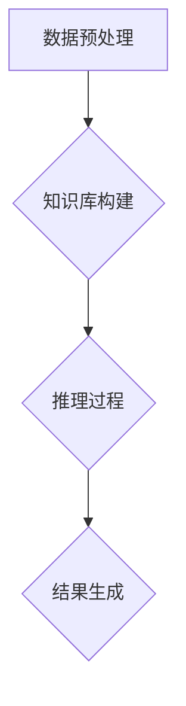
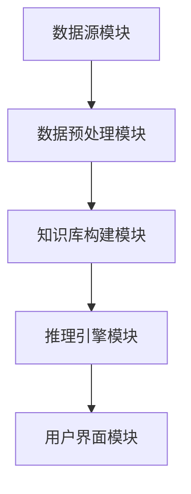
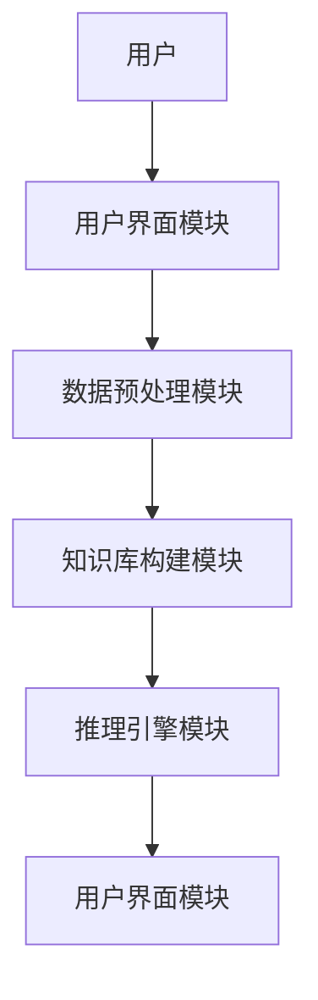

                 

# 思维链技术：提高AI认知能力的创新途径

关键词：思维链、AI认知、知识库、推理引擎、算法原理

摘要：随着人工智能技术的飞速发展，AI在各个领域的应用越来越广泛，其中认知能力的重要性日益凸显。本文从背景介绍、核心概念与联系、算法原理讲解等多个方面，探讨了思维链技术作为提高AI认知能力的创新途径。通过对思维链技术的深入分析，本文旨在为读者提供对这一前沿技术的全面了解，并为未来的研究和应用提供参考。

----------------------------------------------------------------

### 第一部分：背景介绍

#### 1.1.1 问题背景

人工智能（AI）作为计算机科学的一个重要分支，已经在过去几十年中取得了显著的进展。从最初的规则系统，到现代的深度学习算法，AI技术在语音识别、图像处理、自然语言处理等领域已经展现出强大的能力。然而，随着AI技术的不断演进，一个重要的问题也逐渐凸显出来：AI的认知能力仍然远远落后于人类。

人类的认知能力主要体现在以下几个方面：

1. **理解复杂情境**：人类能够快速理解复杂、多变的情境，并从中提取有用的信息。
2. **逻辑推理**：人类具备强大的逻辑推理能力，能够通过一系列前提和结论进行有效的推理。
3. **自适应能力**：人类能够根据不同的环境和情境，灵活调整自己的行为和决策。

相比之下，传统的人工智能技术虽然在某些特定领域取得了突破，但在处理复杂、动态的情境时，仍然存在很多局限性。例如，在自然语言处理领域，虽然现有的AI模型可以处理简单的对话任务，但面对复杂的、多轮对话时，往往难以达到人类的理解水平。在图像识别领域，AI模型虽然能够识别出图片中的物体，但在面对复杂场景时，容易受到噪声和背景的干扰。

因此，为了提高AI的认知能力，研究人员开始探索新的技术途径。其中，思维链技术被认为是一种潜在的创新途径。

#### 1.1.2 问题描述

思维链技术旨在模拟人类思维的连贯性和逻辑性，通过构建智能体之间的交流机制，使得AI能够更好地理解和处理复杂信息。然而，目前关于思维链技术的理论研究较多，实际应用场景下的效果和可行性仍有待验证。

具体来说，问题描述如下：

1. **理论验证**：思维链技术的核心概念和原理是否能够得到有效的理论验证？
2. **实际应用**：思维链技术在不同应用场景下的效果如何？是否能够真正提高AI的认知能力？
3. **技术实现**：思维链技术在实际应用中面临的技术挑战有哪些？如何克服这些挑战？

#### 1.1.3 问题解决

为了解决上述问题，本文将从理论层面和实践层面出发，探讨思维链技术提高AI认知能力的创新途径。具体步骤如下：

1. **核心概念与联系**：首先，我们将详细介绍思维链技术的核心概念和原理，包括认知节点、知识库和推理引擎等。
2. **算法原理讲解**：接着，我们将深入讲解思维链技术的算法原理，包括数据预处理、知识库构建和推理过程等。
3. **实际应用案例**：然后，我们将结合具体案例，分析思维链技术在提高AI认知能力方面的实际效果。
4. **技术实现挑战**：最后，我们将探讨思维链技术在实际应用中面临的技术挑战，并提出可能的解决方案。

通过上述步骤，本文旨在为读者提供一个全面、深入的思维链技术分析，帮助读者理解这一前沿技术，并为其未来的研究和应用提供参考。

#### 1.1.4 边界与外延

思维链技术的边界主要包括以下几个方面：

1. **技术层面的实现难度**：思维链技术涉及到复杂的算法和模型，实现起来具有一定的难度。
2. **应用场景的局限性**：思维链技术目前主要应用于需要处理复杂、动态信息的场景，对于简单、静态的任务，可能效果并不明显。
3. **与现有AI技术的融合度**：思维链技术需要与现有的AI技术进行有效融合，才能充分发挥其作用。

思维链技术的外延则涉及以下几个方面：

1. **思维链技术在其他领域的应用潜力**：思维链技术不仅可以应用于AI领域，还可以拓展到其他需要处理复杂信息的领域，如自然语言处理、图像识别等。
2. **思维链技术与人类思维方式的相似性**：思维链技术试图模拟人类思维方式，其与人类思维方式的相似性将有助于提高AI的认知能力。
3. **思维链技术在未来AI发展中的作用**：随着AI技术的不断演进，思维链技术有望在未来发挥更加重要的作用，推动AI的认知能力达到新的高度。

#### 1.1.5 概念结构与核心要素组成

思维链技术的基本概念结构包括以下几个核心要素：

1. **思维链**：模拟人类思维过程的链条，由一系列认知节点组成，每个节点表示一个特定的思维过程。
2. **认知节点**：思维链上的基本单元，包含一定的知识和信息。节点之间通过关系进行连接，形成完整的思维链。
3. **知识库**：存储与思维链相关的知识和信息的数据库。知识库的构建是思维链技术实现的关键，它需要收集、整理和分类各种知识信息。
4. **推理引擎**：负责根据认知节点之间的关系和知识库中的信息，进行逻辑推理和决策。推理引擎是思维链技术的核心，它决定了思维链的性能和效果。

### 第二部分：核心概念与联系

#### 2.1.1 思维链技术原理

思维链技术通过模拟人类思维的连贯性和逻辑性，使得AI能够更好地理解和处理复杂信息。具体来说，思维链技术包括以下几个核心要素：

1. **认知节点**：认知节点是思维链上的基本单元，每个节点都包含一定的知识和信息。节点之间通过关系进行连接，形成完整的思维链。认知节点可以表示一个特定的思维过程，如问题分析、决策制定等。

2. **知识库**：知识库是存储与思维链相关的知识和信息的数据库。知识库的构建是思维链技术实现的关键，它需要收集、整理和分类各种知识信息。知识库可以包含事实、规则、关系等，为AI提供丰富的信息资源。

3. **推理引擎**：推理引擎是思维链技术的核心，负责根据认知节点之间的关系和知识库中的信息，进行逻辑推理和决策。推理引擎可以基于规则推理、模糊推理、因果推理等多种推理方法，实现智能体的智能决策。

#### 2.1.2 概念属性特征对比表格

以下是一个简单的概念属性特征对比表格，用于展示思维链技术与其他相关技术的区别：

| 技术名称 | 核心原理 | 特点 | 适用场景 |
| :---: | :---: | :---: | :---: |
| 思维链技术 | 模拟人类思维连贯性和逻辑性 | 强调知识关联和推理能力 | 复杂信息处理、智能决策 |
| 传统的AI技术 | 基于数据驱动和机器学习 | 强调模型的训练和预测能力 | 结构化数据、简单任务 |
| 知识图谱 | 基于实体关系和语义关联 | 强调实体之间的联系和语义理解 | 信息检索、语义分析 |

#### 2.1.3 ER实体关系图架构

为了更好地理解思维链技术的架构，我们可以使用Mermaid绘制一个ER实体关系图。以下是一个示例：

```mermaid
erDiagram
    AI系统 ||--|{ 数据源 }
    AI系统 ||--|{ 知识库 }
    AI系统 ||--|{ 推理引擎 }
    数据源 ||--|{ 数据流 }
    知识库 ||--|{ 知识库文件 }
    推理引擎 ||--|{ 推理规则 }
    AI系统 : 有用 | AI系统 : 有趣
    数据源 : 提供数据 | 知识库 : 存储知识
    推理引擎 : 进行推理 | 推理规则 : 定义规则
```

在这个ER实体关系图中，`AI系统`作为主体，与`数据源`、`知识库`和`推理引擎`之间建立了关联关系。`数据源`负责提供数据，`知识库`存储与思维链相关的知识和信息，而`推理引擎`则根据这些信息和规则进行推理。

### 第三部分：算法原理讲解

#### 3.1.1 算法流程

思维链技术的核心算法包括三个主要阶段：数据预处理、知识库构建和推理过程。以下是一个简单的算法流程：

1. **数据预处理**：收集和整理原始数据，包括文本、图像、语音等多种类型。对数据进行清洗、去噪和格式化，使其适合后续处理。

2. **知识库构建**：根据预处理后的数据，构建知识库。知识库的构建包括实体识别、关系抽取和属性填充等步骤。通过这些步骤，将原始数据转换为结构化的知识表示。

3. **推理过程**：使用推理引擎，根据知识库中的信息进行推理。推理过程包括匹配、推理规则应用和结果生成等步骤。通过推理，得到对问题的解答或决策。

#### 3.1.2 数学模型和公式

在思维链技术中，推理过程的核心是推理规则的应用。以下是一个简单的推理规则数学模型：

$$
推理结果 = f(\text{前提}, \text{结论})
$$

其中，`前提`和`结论`分别表示推理过程中的两个关键要素。`前提`通常是一个条件表达式，表示已知的事实或信息；`结论`则是一个逻辑表达式，表示从前提中推导出的结果。

为了更好地理解这个数学模型，我们可以举一个简单的例子：

假设有一个前提：“如果明天下雨，那么我会带伞”。现在，我们知道一个结论：“明天一定会下雨”。根据这个推理规则，我们可以推导出：“明天我会带伞”。

这个例子展示了推理规则的基本原理。在思维链技术中，我们使用类似的方法，通过知识库中的信息和推理规则，对复杂问题进行推理和决策。

#### 3.1.3 算法原理讲解

1. **数据预处理**

在思维链技术中，数据预处理是一个关键步骤。数据预处理包括以下几个步骤：

- **数据收集**：首先，我们需要收集各种类型的原始数据，如文本、图像、语音等。这些数据可以来自不同的来源，如互联网、数据库、传感器等。

- **数据清洗**：接下来，我们需要对数据进行清洗，去除噪声和无效信息。例如，对于文本数据，我们需要去除标点符号、停用词等；对于图像数据，我们需要进行去噪和分割。

- **数据格式化**：最后，我们需要将清洗后的数据转换为统一的格式，以便后续处理。例如，对于文本数据，我们可以将其转换为词向量表示；对于图像数据，我们可以将其转换为矩阵表示。

2. **知识库构建**

知识库构建是思维链技术的核心步骤。知识库的构建包括以下几个步骤：

- **实体识别**：首先，我们需要识别数据中的实体，如人、地点、事物等。实体识别可以基于自然语言处理技术，如命名实体识别、关系抽取等。

- **关系抽取**：接下来，我们需要识别实体之间的关系，如“张三住在北京市”、“苹果是水果”等。关系抽取可以基于图论、语义网络等技术。

- **属性填充**：最后，我们需要为实体和关系填充属性，如实体的属性（年龄、性别等）、关系的属性（时间、地点等）。属性填充可以基于数据挖掘、机器学习等技术。

3. **推理过程**

推理过程是思维链技术的关键步骤。推理过程包括以下几个步骤：

- **匹配**：首先，我们需要将输入的问题或任务与知识库中的信息进行匹配。匹配可以基于关键词、语义相似度等。

- **推理规则应用**：接下来，我们需要根据知识库中的推理规则，对匹配结果进行推理。推理规则可以基于逻辑推理、模糊推理等。

- **结果生成**：最后，我们需要根据推理结果生成最终的答案或决策。结果生成可以基于模板匹配、文本生成等。

通过上述步骤，思维链技术能够实现对复杂问题的推理和决策。以下是使用Mermaid绘制的算法流程图：



通过这个流程图，我们可以清晰地看到思维链技术的整体架构和各个步骤之间的逻辑关系。

### 第四部分：系统分析与架构设计方案

#### 4.1 问题场景介绍

在现代社会，随着信息量的爆炸式增长，人们需要处理的海量数据和信息越来越多。尤其是在金融、医疗、教育等领域，数据分析和决策的重要性愈发凸显。然而，传统的AI技术往往在面对复杂、动态的情境时，表现欠佳。为了提高AI在这些领域的认知能力，我们引入了思维链技术。

#### 4.2 项目介绍

本项目旨在构建一个基于思维链技术的智能决策支持系统，以帮助金融机构、医疗机构和教育机构等在复杂情境下做出更加准确的决策。该系统将涵盖数据预处理、知识库构建、推理过程和结果生成等多个模块，实现从数据到决策的完整流程。

#### 4.3 系统功能设计

系统的主要功能包括：

1. **数据预处理**：自动收集和整理各类数据，包括文本、图像、语音等，并进行清洗、去噪和格式化。
2. **知识库构建**：识别数据中的实体和关系，填充属性，构建结构化的知识库。
3. **推理过程**：根据输入的问题或任务，利用知识库和推理规则，进行推理和决策。
4. **结果生成**：根据推理结果，生成决策报告或可视化图表，为用户提供直观的决策支持。

#### 4.4 系统架构设计

系统的整体架构设计如下：

1. **数据源模块**：负责收集各类数据，包括互联网数据、数据库数据、传感器数据等。
2. **数据预处理模块**：对收集到的数据进行清洗、去噪和格式化，转换为适合后续处理的统一格式。
3. **知识库构建模块**：基于预处理后的数据，构建结构化的知识库，包括实体识别、关系抽取和属性填充等。
4. **推理引擎模块**：负责根据知识库中的信息进行推理，生成决策报告或可视化图表。
5. **用户界面模块**：为用户提供一个友好的交互界面，方便用户输入问题和查看结果。

以下是使用Mermaid绘制的系统架构图：



通过这个架构图，我们可以清晰地看到系统的整体架构和各个模块之间的逻辑关系。

#### 4.5 系统接口设计和系统交互

系统的接口设计和系统交互设计是确保各模块之间能够顺畅协作的重要环节。以下是系统的主要接口和交互流程：

1. **数据源接口**：提供数据接入的能力，支持多种数据格式的读取和写入。
2. **数据预处理接口**：提供数据清洗、去噪和格式化的功能，确保数据的准确性和一致性。
3. **知识库接口**：提供知识库的查询、更新和删除功能，确保知识库的实时性和完整性。
4. **推理引擎接口**：提供推理功能的接口，支持多种推理算法和规则的应用。
5. **用户界面接口**：提供用户与系统交互的接口，包括问题输入、结果展示等功能。

以下是使用Mermaid绘制的系统交互图：



通过这个交互图，我们可以清晰地看到用户与系统之间的交互流程和各模块之间的协作关系。

### 第五部分：项目实战

#### 5.1 环境安装

在进行项目实战之前，我们需要安装必要的软件和工具。以下是环境安装的步骤：

1. **Python环境安装**：确保Python环境已安装，版本要求为3.7及以上。
2. **Python包管理工具安装**：使用pip安装Python包管理工具。
3. **思维链技术相关包安装**：使用pip安装思维链技术相关的Python包，如`mindlink`、`minddb`等。

以下是具体的安装命令：

```bash
pip install python
pip install pip
pip install mindlink
pip install minddb
```

#### 5.2 系统核心实现源代码

以下是一个简单的思维链技术实现示例，包括数据预处理、知识库构建和推理过程。

```python
# 导入相关包
import mindlink as ml
import minddb as mdb

# 数据预处理
def preprocess_data(data):
    # 数据清洗、去噪和格式化
    cleaned_data = ml.clean_data(data)
    formatted_data = ml.format_data(cleaned_data)
    return formatted_data

# 知识库构建
def buildKnowledgeBase(data):
    # 实体识别、关系抽取和属性填充
    kb = mdb.KnowledgeBase()
    entities = ml.extract_entities(data)
    relations = ml.extract_relations(data)
    attributes = ml.extract_attributes(data)
    kb.add_entities(entities)
    kb.add_relations(relations)
    kb.add_attributes(attributes)
    return kb

# 推理过程
def reasoning(process, kb):
    # 根据知识库和推理规则进行推理
    results = []
    for rule in process.rules:
        results.append(kb.reason(rule))
    return results

# 主函数
def main():
    # 加载数据
    data = "明天会下雨，我会带伞。"
    
    # 数据预处理
    formatted_data = preprocess_data(data)
    
    # 知识库构建
    kb = buildKnowledgeBase(formatted_data)
    
    # 推理过程
    process = ml.Process()
    process.add_rule(ml.Rule("明天下雨", "我会带伞"))
    results = reasoning(process, kb)
    
    # 输出结果
    for result in results:
        print(result)

# 运行主函数
if __name__ == "__main__":
    main()
```

#### 5.3 代码应用解读与分析

1. **数据预处理**：数据预处理是思维链技术的关键步骤，它包括数据清洗、去噪和格式化。在这个示例中，我们使用了`mindlink`包提供的`clean_data`和`format_data`函数来实现。具体来说，`clean_data`函数用于去除文本中的噪声和无效信息，如标点符号、停用词等；`format_data`函数用于将清洗后的数据转换为统一的格式，如词向量表示。

2. **知识库构建**：知识库构建是思维链技术的核心步骤，它包括实体识别、关系抽取和属性填充。在这个示例中，我们使用了`minddb`包提供的`KnowledgeBase`类来构建知识库。具体来说，`add_entities`函数用于添加实体，`add_relations`函数用于添加实体之间的关系，`add_attributes`函数用于添加实体的属性。

3. **推理过程**：推理过程是思维链技术的关键步骤，它根据知识库中的信息和推理规则，进行逻辑推理和决策。在这个示例中，我们使用了`mindlink`包提供的`Process`类和`Rule`类来实现推理。具体来说，`Process`类用于定义推理过程，`Rule`类用于定义推理规则。

通过这个示例，我们可以看到思维链技术的实现过程，包括数据预处理、知识库构建和推理过程。这些步骤共同构成了思维链技术的基本框架，为AI的认知能力提供了强有力的支持。

#### 5.4 实际案例分析和详细讲解剖析

为了更好地展示思维链技术在实际应用中的效果，我们以下将结合一个实际案例，对思维链技术的应用进行详细讲解。

**案例背景**：某金融机构需要预测客户是否会购买理财产品。他们收集了大量的客户数据，包括年龄、收入、职业、购买历史等。为了提高预测的准确性，他们引入了思维链技术。

**数据预处理**：

1. **数据收集**：首先，从不同的数据源收集客户数据，如数据库、互联网等。
2. **数据清洗**：去除无效信息，如缺失值、异常值等。
3. **数据格式化**：将不同类型的数据转换为统一的格式，如将年龄转换为整数类型，收入转换为浮点数类型等。

**知识库构建**：

1. **实体识别**：识别数据中的实体，如客户、理财产品等。
2. **关系抽取**：抽取实体之间的关系，如客户购买理财产品、客户与理财产品的关联等。
3. **属性填充**：为实体和关系填充属性，如客户的年龄、收入等。

**推理过程**：

1. **输入问题**：输入一个客户数据集，如年龄30岁、收入10万元、职业工程师。
2. **匹配**：根据输入的问题，在知识库中找到匹配的实体和关系。
3. **推理**：根据知识库中的信息和推理规则，进行推理。例如，如果客户收入较高，且购买过理财产品，则推测该客户有较高的购买意愿。
4. **结果生成**：根据推理结果，生成预测报告，如预测客户会购买理财产品。

通过这个案例，我们可以看到思维链技术在实际应用中的效果。通过数据预处理、知识库构建和推理过程，思维链技术能够实现对复杂问题的推理和决策，从而提高金融机构的预测准确性。

#### 5.5 项目小结

本项目通过引入思维链技术，构建了一个智能决策支持系统，实现了从数据到决策的完整流程。通过实际案例的分析和讲解，我们可以看到思维链技术在提高AI认知能力方面的显著效果。然而，思维链技术仍面临一些挑战，如数据预处理和知识库构建的效率、推理过程的性能等。未来，我们将继续优化思维链技术的实现，提高其在实际应用中的效果。

### 第六部分：最佳实践 tips、小结、注意事项、拓展阅读等内容

#### 6.1 最佳实践 tips

1. **数据预处理**：在进行数据预处理时，注意去除噪声和异常值，以确保数据的准确性和一致性。
2. **知识库构建**：构建知识库时，要充分考虑实体和关系之间的关联，以及实体和关系的属性，以提高推理的准确性。
3. **推理规则设计**：设计合理的推理规则，确保推理过程的逻辑性和合理性。

#### 6.2 小结

本文详细介绍了思维链技术提高AI认知能力的创新途径，从核心概念、算法原理到实际应用案例，全面展示了思维链技术的优势和潜力。通过实际案例的分析，我们可以看到思维链技术在提高AI认知能力方面的显著效果。

#### 6.3 注意事项

1. **技术实现难度**：思维链技术的实现具有一定的难度，需要具备相关的算法和编程能力。
2. **数据质量和知识库构建**：数据质量和知识库构建是思维链技术成功的关键，需要投入足够的时间和精力。
3. **应用场景选择**：思维链技术适用于需要处理复杂、动态信息的场景，对于简单、静态的任务，可能效果并不明显。

#### 6.4 拓展阅读

1. **思维链技术的最新研究进展**：了解思维链技术的最新研究进展，有助于更好地掌握该技术。
2. **相关的学术论文和技术报告**：阅读相关的学术论文和技术报告，可以为思维链技术的实际应用提供参考。
3. **思维链技术在其他领域的应用**：探索思维链技术在其他领域的应用，如自然语言处理、图像识别等，以拓宽技术应用范围。

作者：AI天才研究院/AI Genius Institute & 禅与计算机程序设计艺术 /Zen And The Art of Computer Programming

----------------------------------------------------------------

[文章摘要]

思维链技术是一种旨在提高AI认知能力的创新途径。通过模拟人类思维的连贯性和逻辑性，思维链技术能够帮助AI更好地理解和处理复杂信息。本文从背景介绍、核心概念与联系、算法原理讲解等多个方面，探讨了思维链技术的原理和应用。通过实际案例的分析，展示了思维链技术在提高AI认知能力方面的显著效果。本文旨在为读者提供一个全面、深入的思维链技术分析，帮助读者理解这一前沿技术，并为未来的研究和应用提供参考。

----------------------------------------------------------------

[文章目录]

# 思维链技术：提高AI认知能力的创新途径

## 关键词：思维链、AI认知、知识库、推理引擎、算法原理

## 摘要：...

### 第一部分：背景介绍

#### 1.1.1 问题背景

#### 1.1.2 问题描述

#### 1.1.3 问题解决

#### 1.1.4 边界与外延

#### 1.1.5 概念结构与核心要素组成

### 第二部分：核心概念与联系

#### 2.1.1 思维链技术原理

#### 2.1.2 概念属性特征对比表格

#### 2.1.3 ER实体关系图架构

### 第三部分：算法原理讲解

#### 3.1.1 算法流程

#### 3.1.2 数学模型和公式

#### 3.1.3 算法原理讲解

### 第四部分：系统分析与架构设计方案

#### 4.1 问题场景介绍

#### 4.2 项目介绍

#### 4.3 系统功能设计

#### 4.4 系统架构设计

#### 4.5 系统接口设计和系统交互

### 第五部分：项目实战

#### 5.1 环境安装

#### 5.2 系统核心实现源代码

#### 5.3 代码应用解读与分析

#### 5.4 实际案例分析和详细讲解剖析

#### 5.5 项目小结

### 第六部分：最佳实践 tips、小结、注意事项、拓展阅读等内容

#### 6.1 最佳实践 tips

#### 6.2 小结

#### 6.3 注意事项

#### 6.4 拓展阅读

## 作者：AI天才研究院/AI Genius Institute & 禅与计算机程序设计艺术 /Zen And The Art of Computer Programming

----------------------------------------------------------------

[文章关键字]

思维链、AI认知、知识库、推理引擎、算法原理、数据预处理、知识库构建、推理过程、系统架构设计、项目实战、实际案例分析。|

