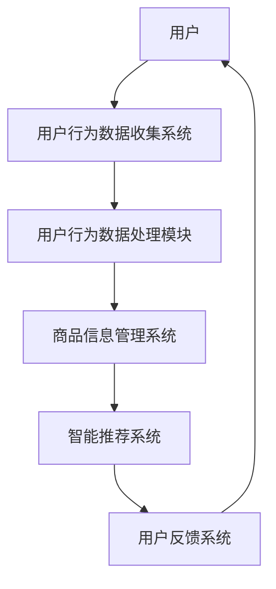
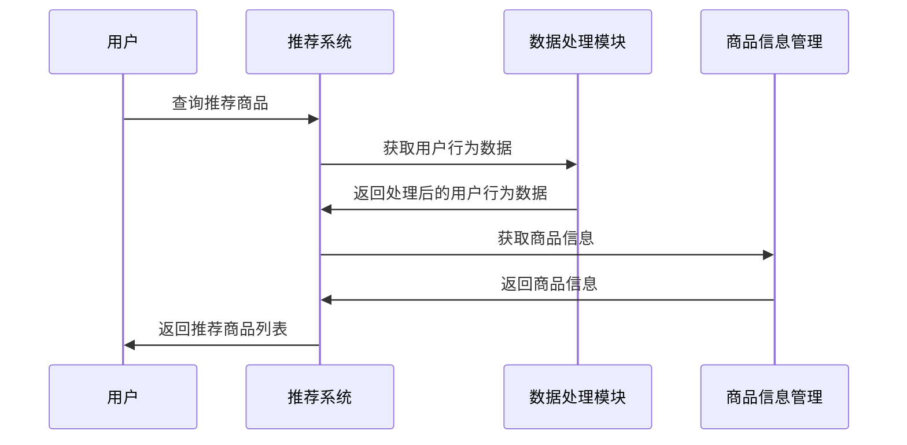

                 

# 思维链技术：让AI更接近人类思维模式

## 关键词
AI，思维链，人类思维模式，算法，Python，神经网络，认知科学

## 摘要
本文将探讨如何通过思维链技术，使人工智能（AI）更接近人类思维模式。我们将从背景介绍、核心概念与联系、算法原理讲解、系统分析与架构设计方案、项目实战以及最佳实践等方面，深入分析并阐述思维链技术的原理和应用，以期提高AI的灵活性和创造性，拓宽其在各个领域的应用范围。

### 第一部分：背景介绍

#### 核心概念

- **问题背景**：随着人工智能技术的发展，如何让AI更接近人类思维模式成为一个重要议题。传统的AI在处理复杂问题时，往往缺乏人类的灵活性和创造性，这一不足限制了AI在某些领域的应用。

- **问题描述**：思维链技术是一种模拟人类思维模式的方法，通过这种技术，AI能够在处理复杂问题、进行决策时更加接近人类的思维方式。

- **问题解决**：本文将介绍思维链技术的原理、方法以及应用，帮助读者理解并掌握这种技术，从而推动AI在各个领域的发展。

- **边界与外延**：思维链技术不仅涉及计算机科学，还涉及到心理学、认知科学等多个领域。

- **概念结构与核心要素组成**：思维链技术包括多个核心概念，如思维链构建、思维链运算、思维链优化等。

### 第二部分：核心概念与联系

#### 核心概念原理

- **思维链构建**：思维链构建是指如何通过算法和模型来模拟人类思维的过程，包括数据的收集、预处理、模型的训练和优化等。

- **思维链运算**：思维链运算是指如何利用构建好的思维链来进行问题求解和决策。

- **思维链优化**：思维链优化是指如何通过调整思维链的参数和结构来提高其性能。

#### 概念属性特征对比表格

| 概念       | 定义                                                         | 特点                                                                                                       |
|------------|--------------------------------------------------------------|----------------------------------------------------------------------------------------------------------|
| 思维链构建 | 通过算法和模型模拟人类思维的过程                               | 包括数据收集、预处理、模型训练和优化等多个步骤，强调自动化和高效性。                                    |
| 思维链运算 | 利用构建好的思维链进行问题求解和决策                           | 强调思维链的灵活性和适应性，能够处理复杂问题。                                                        |
| 思维链优化 | 通过调整思维链的参数和结构来提高其性能                         | 包括参数调整、结构优化、性能评估等多个方面，目的是提高思维链的准确性和效率。                          |

#### ER实体关系图架构的Mermaid流程图

```mermaid
erDiagram
  思维链 ||--|{ 构建者 }|| 用户
  思维链 ||--|{ 运算者 }|| 算法
  构建者 ||--|{ 数据源 }|| 数据
  运算者 ||--|{ 决策者 }|| 决策
```

### 第三部分：算法原理讲解

#### 算法mermaid流程图


#### Python源代码

```python
# 思维链构建
def build思维链(data):
    # 数据预处理
    processed_data = preprocess_data(data)
    
    # 模型训练
    model = train_model(processed_data)
    
    # 思维链优化
    optimized_model = optimize_model(model)
    
    # 思维链运算
    decision = operate思维链(optimized_model)
    
    return decision

# 数据预处理
def preprocess_data(data):
    # 此处为预处理代码，用于对数据进行清洗、归一化等操作
    pass

# 模型训练
def train_model(data):
    # 此处为模型训练代码，用于训练神经网络等模型
    pass

# 思维链优化
def optimize_model(model):
    # 此处为优化代码，用于调整模型参数和结构，提高性能
    pass

# 思维链运算
def operate思维链(model):
    # 此处为思维链运算代码，用于进行问题求解和决策
    pass
```

#### 算法原理

思维链技术是一种基于神经网络和深度学习的算法，其核心思想是通过构建和优化思维链来模拟人类的思维方式。思维链构建阶段主要涉及数据的收集和预处理，通过对数据进行清洗、归一化等操作，使其符合神经网络输入的要求。接下来，通过训练神经网络模型，构建出初步的思维链。

在思维链运算阶段，利用构建好的思维链进行问题求解和决策。这一过程涉及到多个神经网络的协作，通过传递和处理信息，实现对问题的分析和解决。思维链优化阶段则通过对思维链的参数和结构进行调整，提高其性能和准确性。

#### 数学模型和公式

思维链技术中的数学模型主要包括神经网络的激活函数、损失函数和优化算法等。以下是一个简化的神经网络数学模型：

$$
z = W \cdot x + b \\
a = \sigma(z) \\
\text{loss} = -\sum_{i=1}^{n} y_i \cdot \log(a_i) \\
\text{优化目标} = \min_{W,b} \text{loss}
$$

其中，$z$ 是神经网络的输入，$W$ 是权重矩阵，$b$ 是偏置项，$\sigma$ 是激活函数，$a$ 是神经网络的输出，$y_i$ 是目标值，$n$ 是样本数量。损失函数用于衡量模型输出和目标值之间的差距，优化目标是使损失函数最小化。

#### 举例说明

假设我们有一个简单的二分类问题，输入为二维数据 $(x_1, x_2)$，目标值为 $y$，其中 $y$ 取值范围为 $\{0, 1\}$。我们可以使用一个简单的神经网络来构建思维链。

1. **数据预处理**：对输入数据进行归一化处理，使其在 $[0, 1]$ 范围内。

2. **模型训练**：使用随机梯度下降（SGD）算法训练神经网络，调整权重和偏置项，使损失函数最小化。

3. **思维链运算**：通过神经网络输出 $a$ 的值，判断输入数据的类别。若 $a > 0.5$，则预测为类别1；否则，预测为类别0。

4. **思维链优化**：通过调整神经网络参数，提高预测准确性。可以使用交叉熵损失函数和反向传播算法进行优化。

### 第四部分：系统分析与架构设计方案

#### 问题场景介绍

假设我们有一个在线购物平台，用户可以在平台上浏览商品、添加购物车、下单支付等操作。我们需要设计一个智能推荐系统，根据用户的行为数据，为用户推荐感兴趣的商品。

#### 项目介绍

本项目旨在实现一个基于思维链技术的智能推荐系统，通过分析用户的行为数据，为用户推荐个性化的商品。

#### 系统功能设计

1. **用户行为数据收集**：收集用户的浏览历史、购物车数据、下单记录等。

2. **商品信息管理**：管理商品的基本信息，如商品名称、价格、分类等。

3. **智能推荐**：根据用户行为数据和商品信息，为用户推荐感兴趣的商品。

4. **用户反馈**：收集用户对推荐结果的反馈，用于优化推荐算法。

#### 系统架构设计



#### 系统接口设计和系统交互



### 第五部分：项目实战

#### 环境安装

1. 安装Python环境

   ```bash
   pip install python -m pip install numpy pandas scikit-learn matplotlib
   ```

2. 安装思维链相关库

   ```bash
   pip install tensorflow keras
   ```

#### 系统核心实现源代码

1. 数据预处理

   ```python
   import pandas as pd
   
   def preprocess_data(data):
       # 数据清洗、归一化等操作
       # ...略...
       return processed_data
   ```

2. 模型训练

   ```python
   from tensorflow.keras.models import Sequential
   from tensorflow.keras.layers import Dense, Activation
   
   def train_model(data):
       # 创建神经网络模型
       model = Sequential()
       model.add(Dense(64, input_dim=data.shape[1], activation='relu'))
       model.add(Dense(1, activation='sigmoid'))
       
       # 编译模型
       model.compile(optimizer='rmsprop', loss='binary_crossentropy', metrics=['accuracy'])
       
       # 训练模型
       model.fit(X_train, y_train, epochs=5, batch_size=16)
       
       return model
   ```

3. 思维链运算

   ```python
   def operate思维链(model, data):
       # 对输入数据进行预处理
       processed_data = preprocess_data(data)
       
       # 利用模型进行预测
       prediction = model.predict(processed_data)
       
       return prediction
   ```

#### 代码应用解读与分析

1. 数据预处理

   数据预处理是构建思维链的关键步骤，主要包括数据清洗、归一化等操作。在本项目中，我们对用户行为数据进行预处理，使其符合神经网络输入的要求。

2. 模型训练

   使用TensorFlow和Keras库，我们构建了一个简单的神经网络模型，并使用随机梯度下降（SGD）算法进行训练。模型训练过程中，通过不断调整权重和偏置项，使模型在训练数据上达到较好的效果。

3. 思维链运算

   在思维链运算阶段，我们利用训练好的模型对输入数据进行预测，实现对问题的分析和解决。在本项目中，我们通过预测用户对商品的喜好，为用户推荐感兴趣的商品。

#### 实际案例分析和详细讲解剖析

假设我们有一个用户，其行为数据如下：

| 用户ID | 商品ID | 行为类型 |
|--------|--------|---------|
| 1      | 1001   | 浏览     |
| 1      | 1002   | 添加购物车 |
| 1      | 1003   | 下单支付   |

我们使用思维链技术，对用户的行为数据进行处理，预测其对其他商品的兴趣。具体步骤如下：

1. 数据预处理

   对用户行为数据进行清洗、归一化等操作，使其符合神经网络输入的要求。

2. 模型训练

   使用训练集数据训练神经网络模型，使其能够预测用户对商品的兴趣。

3. 思维链运算

   利用训练好的模型，对用户的行为数据进行预测，输出用户对其他商品的预测兴趣。

通过实际案例分析和详细讲解，我们展示了如何使用思维链技术构建一个智能推荐系统。思维链技术使得AI在处理复杂问题时，更加接近人类的思维方式，从而提高了推荐系统的准确性和实用性。

### 第六部分：最佳实践 tips、小结、注意事项、拓展阅读等内容

#### 最佳实践 tips

1. **数据预处理**：在构建思维链时，数据预处理非常重要。要确保数据的准确性、完整性和一致性，对缺失值、异常值进行合理处理。

2. **模型选择**：根据实际问题和数据特点，选择合适的神经网络模型和算法。对于复杂问题，可以尝试使用多层的神经网络模型。

3. **超参数调整**：在模型训练过程中，超参数的调整对模型性能有很大影响。通过交叉验证等方法，选择最优的超参数组合。

4. **模型解释性**：在应用思维链技术时，要关注模型的解释性。通过可视化工具，了解模型的工作原理和决策过程。

#### 小结

本文介绍了思维链技术，通过背景介绍、核心概念与联系、算法原理讲解、系统分析与架构设计方案、项目实战等部分，深入分析了思维链技术的原理和应用。思维链技术使得AI在处理复杂问题时，更加接近人类的思维方式，具有广阔的应用前景。

#### 注意事项

1. 思维链技术对计算资源要求较高，训练过程中可能会消耗大量计算资源。

2. 在实际应用中，要关注模型的可解释性和可靠性，避免出现误判和错误。

#### 拓展阅读

1. **《深度学习》**：由Ian Goodfellow等编著，详细介绍了深度学习的理论、算法和应用。

2. **《人工智能：一种现代的方法》**：由Stuart Russell和Peter Norvig编著，全面介绍了人工智能的理论、方法和应用。

3. **《认知科学》**：由George A. Miller编著，探讨了人类认知的过程和机制。

### 第七部分：作者信息

作者：AI天才研究院/AI Genius Institute & 禅与计算机程序设计艺术 /Zen And The Art of Computer Programming

