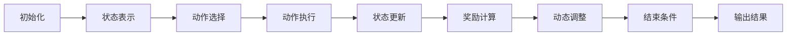
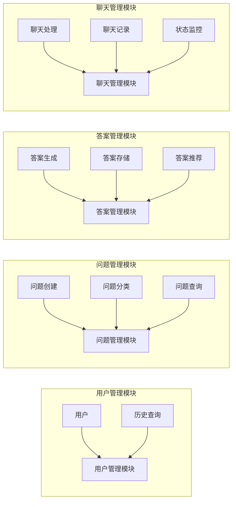

                 

### 思维链技术：让AI更接近人类思维的探索

> 关键词：思维链技术、人工智能、神经网络、强化学习、知识图谱

> 摘要：本文深入探讨了思维链技术，这是一种旨在使人工智能（AI）更接近人类思维方式的创新方法。我们将从问题背景出发，详细阐述思维链技术的核心概念、数学模型与算法原理，并通过系统分析与架构设计，展示其在实际项目中的应用。最后，我们将总结最佳实践，并展望未来的研究方向。

## 第一部分：问题背景与核心概念

### 第1章：问题背景

#### 1.1 人工智能与人类思维的异同

人工智能（AI）作为计算机科学的重要分支，已经在多个领域取得了显著的成果。然而，尽管AI在处理数据和执行任务方面表现出色，但其思维方式与人类仍存在显著差异。这种差异主要体现在以下几个方面：

1. **数据依赖性**：传统AI系统往往高度依赖大量数据进行训练，而人类思维则更依赖于逻辑推理和直觉。
2. **泛化能力**：AI系统在特定任务上表现出色，但在面对新环境和新问题时，往往难以实现良好的泛化。
3. **情感理解**：人类能够通过情感理解和共情来做出决策，而AI系统在这一领域仍存在较大局限性。

#### 1.2 思维链技术的提出与核心概念

为了弥合这种差异，研究者提出了思维链技术。思维链技术是一种模拟人类思维过程的人工智能方法，其核心思想是通过构建一种能够模拟人类逻辑思维过程的模型，使AI具备更接近人类的思维方式。思维链技术主要包括以下几个关键特性：

1. **模块化**：将复杂问题分解为多个模块，每个模块独立处理特定任务，从而提高系统的可扩展性和灵活性。
2. **动态调整**：根据问题的变化动态调整思维链的连接方式，使系统能够适应不同的问题场景。
3. **上下文感知**：通过理解上下文信息，使AI在决策过程中更加符合人类思维模式。

#### 1.2.1 思维链技术的定义

思维链技术是一种模拟人类逻辑思维过程的人工智能方法，通过构建一种能够处理复杂问题的思维链模型，使AI具备更接近人类的思维方式。思维链技术主要包括以下几个关键特性：

1. **模块化**：将复杂问题分解为多个模块，每个模块独立处理特定任务，从而提高系统的可扩展性和灵活性。
2. **动态调整**：根据问题的变化动态调整思维链的连接方式，使系统能够适应不同的问题场景。
3. **上下文感知**：通过理解上下文信息，使AI在决策过程中更加符合人类思维模式。

#### 1.2.2 思维链技术的关键特性

1. **模块化**：思维链技术将复杂问题分解为多个模块，每个模块独立处理特定任务，从而提高系统的可扩展性和灵活性。
    - **模块划分原则**：根据问题的复杂度和相关性，将问题划分为多个子问题，每个子问题由一个模块负责处理。
    - **模块间的协同**：通过模块间的协作，实现整体问题的求解，同时保持模块独立性，降低系统复杂性。
2. **动态调整**：思维链技术可以根据问题的变化动态调整思维链的连接方式，使系统能够适应不同的问题场景。
    - **连接策略**：根据问题的性质和需求，选择合适的连接策略，如前向连接、反向连接或混合连接。
    - **自适应调整**：在问题解决过程中，根据问题的变化和模块的性能，动态调整思维链的连接方式，以提高系统效率。
3. **上下文感知**：思维链技术通过理解上下文信息，使AI在决策过程中更加符合人类思维模式。
    - **上下文信息**：包括问题的背景信息、输入数据的特征、已有知识等，通过分析这些信息，指导AI的决策过程。
    - **上下文建模**：采用上下文建模技术，如注意力机制、图谱模型等，将上下文信息融入思维链模型，使AI具备更好的上下文理解能力。

### 1.3 思维链技术的研究意义与应用前景

思维链技术的研究具有重要的理论和实践意义。从理论层面来看，思维链技术为人工智能提供了一个新的研究方向，有助于推动人工智能领域的发展。从实践层面来看，思维链技术可以应用于各个领域，如自然语言处理、计算机视觉、决策支持系统等，提高AI的智能化水平。

### 第2章：核心概念与联系

#### 1.2.1 思维链技术的基础理论

思维链技术的基础理论包括概念定义、分类、概念属性特征对比等方面。以下是对这些基础理论的详细解释。

##### 1.2.1.1 概念定义

思维链技术中的“思维链”是指一种由多个思维模块组成的序列，每个模块负责处理特定的问题子任务。思维链中的模块通过特定的连接方式相互协作，共同完成复杂问题的求解。思维链技术的基础理论主要包括以下几个方面：

1. **思维模块**：思维模块是思维链中的基本单元，每个模块具有特定的功能和输入输出接口。
2. **模块连接**：模块连接是指思维链中各个模块之间的交互关系，通过模块连接，实现模块间的信息传递和协同工作。
3. **思维链结构**：思维链结构是指思维链中各个模块的排列组合方式，不同的结构适用于不同类型的问题。

##### 1.2.1.2 概念属性特征对比

为了更好地理解思维链技术，我们需要对与它相关的几个概念进行属性特征对比。以下是几个关键概念及其属性特征的对比表格：

| 概念         | 属性特征                                           | 对比结果                                           |
| ------------ | -------------------------------------------------- | -------------------------------------------------- |
| 思维链       | 模块化、动态调整、上下文感知                       | 更接近人类思维过程，适用于复杂问题解决             |
| 人工神经网络 | 层次化、权重调整、反向传播                         | 适用于静态数据处理，缺乏动态调整能力               |
| 强化学习     | 奖励机制、策略迭代、状态价值函数                   | 适用于策略优化，但缺乏上下文理解和模块化能力       |
| 知识图谱     | 实体关系、语义理解、图谱查询                       | 适用于知识表示和推理，但缺乏动态调整能力           |

#### 1.2.2 思维链技术的核心组成部分

思维链技术的核心组成部分包括架构设计、数据处理和算法实现等方面。以下是对这些组成部分的详细解释。

##### 1.2.2.1 架构设计

思维链技术的架构设计是确保其模块化、动态调整和上下文感知特性的关键。架构设计主要包括以下几个要素：

1. **模块化架构**：将复杂问题分解为多个模块，每个模块具有独立的功能和输入输出接口。
2. **动态连接架构**：通过动态调整模块间的连接方式，实现不同问题场景下的最佳性能。
3. **上下文感知架构**：将上下文信息融入架构设计，使AI在决策过程中具备更好的上下文理解能力。

##### 1.2.2.2 数据处理

数据处理是思维链技术实现的基础，主要包括以下方面：

1. **数据预处理**：对原始数据进行清洗、归一化等预处理操作，以提高数据质量和模型性能。
2. **特征提取**：从原始数据中提取关键特征，为模块化处理提供输入。
3. **数据融合**：将不同来源的数据进行融合，形成统一的数据视图，为上下文感知提供支持。

##### 1.2.2.3 算法实现

算法实现是思维链技术的核心，主要包括以下方面：

1. **模块化算法**：设计模块化算法，实现各个模块的功能。
2. **动态调整算法**：实现动态调整模块连接的算法，以提高系统的适应能力。
3. **上下文感知算法**：实现上下文感知算法，使AI在决策过程中具备更好的上下文理解能力。

#### 1.2.3 思维链技术与其他技术的联系

思维链技术作为一种模拟人类思维过程的人工智能方法，与其他相关技术之间存在一定的联系和区别。以下是对这些技术之间联系和区别的详细解释。

##### 1.2.3.1 与神经网络的关系

思维链技术与神经网络之间存在一定的联系。神经网络作为一种常用的机器学习算法，具有层次化、权重调整和反向传播等特性。思维链技术中的模块化算法和动态调整算法可以借鉴神经网络的设计思想，从而提高系统的性能和适应能力。

然而，与神经网络相比，思维链技术具有以下区别：

1. **模块化**：思维链技术将复杂问题分解为多个模块，每个模块独立处理特定任务，而神经网络则通常采用层次化的结构。
2. **动态调整**：思维链技术可以根据问题的变化动态调整模块间的连接方式，而神经网络则通常采用固定的连接方式。

##### 1.2.3.2 与强化学习的关系

思维链技术与强化学习也存在一定的联系。强化学习作为一种基于奖励机制的机器学习算法，通过策略迭代和状态价值函数来优化策略。思维链技术中的模块化算法和动态调整算法可以借鉴强化学习的设计思想，从而提高系统的性能和适应能力。

然而，与强化学习相比，思维链技术具有以下区别：

1. **模块化**：思维链技术将复杂问题分解为多个模块，每个模块独立处理特定任务，而强化学习则通常采用全局优化策略。
2. **上下文感知**：思维链技术通过理解上下文信息，使AI在决策过程中更加符合人类思维模式，而强化学习则通常缺乏上下文理解能力。

##### 1.2.3.3 与知识图谱的关系

思维链技术与知识图谱也存在一定的联系。知识图谱作为一种用于表示实体关系和语义信息的工具，可以为思维链技术提供上下文信息和支持。

然而，与知识图谱相比，思维链技术具有以下区别：

1. **模块化**：思维链技术将复杂问题分解为多个模块，每个模块独立处理特定任务，而知识图谱则通常采用全局视图。
2. **动态调整**：思维链技术可以根据问题的变化动态调整模块间的连接方式，而知识图谱则通常采用固定的结构。

### 第3章：数学模型与算法原理

#### 3.1 数学模型概述

数学模型是思维链技术的核心组成部分，用于描述思维链中各个模块的交互关系和问题求解过程。以下是对数学模型的基本概念和应用的详细解释。

##### 3.1.1 基本概念

1. **状态表示**：状态表示是数学模型中的一个基本概念，用于描述思维链中的问题状态。状态通常由一组特征向量表示，每个特征向量对应思维链中的一个模块。

2. **动作表示**：动作表示是数学模型中的另一个基本概念，用于描述思维链中各个模块之间的连接方式。动作可以看作是对状态的转换，通过选择不同的动作，可以实现思维链中不同模块之间的信息传递和协同工作。

3. **奖励函数**：奖励函数是数学模型中的一个关键组件，用于评价思维链中各个模块的性能。奖励函数可以根据状态的转换和动作的选择，给出一个实数值，表示当前状态的优劣。

##### 3.1.2 数学模型的应用场景

数学模型在思维链技术中具有广泛的应用场景，主要包括以下几个方面：

1. **模块化问题求解**：通过数学模型，可以将复杂问题分解为多个子问题，每个子问题由一个模块负责求解。数学模型可以描述各个模块之间的交互关系，从而实现问题的高效求解。

2. **动态调整问题求解**：数学模型可以根据问题的变化，动态调整思维链中各个模块的连接方式。通过优化奖励函数，可以实现思维链在不同问题场景下的最佳性能。

3. **上下文感知问题求解**：数学模型可以将上下文信息融入思维链中，使AI在决策过程中具备更好的上下文理解能力。通过分析上下文信息，数学模型可以调整思维链的连接方式，实现更符合人类思维模式的问题求解。

#### 3.2 算法原理讲解

算法原理是思维链技术的核心，用于描述思维链中各个模块的交互过程和问题求解方法。以下是对算法原理的详细讲解。

##### 3.2.1 算法流程图

算法流程图是描述思维链算法原理的一种直观方式。以下是一个简化的思维链算法流程图：



##### 3.2.2 算法原理与数学模型

思维链算法原理可以通过以下数学模型进行描述：

1. **状态表示**：设状态集合为 $S$，每个状态由一组特征向量表示，即 $s = (s_1, s_2, ..., s_n)$，其中 $s_i$ 表示第 $i$ 个模块的状态。

2. **动作选择**：设动作集合为 $A$，每个动作表示对状态的一种转换，即 $a = (a_1, a_2, ..., a_n)$，其中 $a_i$ 表示第 $i$ 个模块的动作。

3. **状态更新**：状态更新函数 $f(s, a)$ 用于描述状态 $s$ 在执行动作 $a$ 后的新状态，即 $s' = f(s, a)$。

4. **奖励计算**：奖励函数 $R(s, a)$ 用于评价状态 $s$ 在执行动作 $a$ 后的优劣，即 $r = R(s, a)$。

5. **动态调整**：动态调整函数 $D(s', r)$ 用于根据状态更新和奖励计算结果，调整思维链中各个模块的连接方式，实现最佳性能。

##### 3.2.3 算法实例解析

以下是一个简化的思维链算法实例，用于求解一个简单的任务：

1. **初始化**：设置初始状态 $s = (s_1, s_2, s_3)$，其中 $s_1 = 1$，$s_2 = 0$，$s_3 = 0$。

2. **动作选择**：选择动作 $a = (0, 1, 0)$，表示第一个模块执行动作，第二个模块保持不动，第三个模块不执行动作。

3. **状态更新**：根据动作选择，更新状态为 $s' = (0, 0, 1)$。

4. **奖励计算**：计算奖励值为 $r = 1$，表示任务完成。

5. **动态调整**：根据状态更新和奖励计算结果，调整思维链中各个模块的连接方式，以实现最佳性能。

#### 3.3 算法优化与改进

算法优化与改进是思维链技术发展的重要方向，以下是对算法优化与改进的详细讨论。

##### 3.3.1 状态表示优化

状态表示的优化是提高思维链算法性能的关键。以下是一些常见的状态表示优化方法：

1. **特征提取**：通过特征提取技术，从原始数据中提取关键特征，减少状态表示的维度，提高计算效率。
2. **状态融合**：将多个状态进行融合，形成一个更全面的状态表示，提高算法的准确性和鲁棒性。
3. **状态压缩**：采用状态压缩技术，将多个状态表示合并为一个紧凑的状态表示，减少存储和计算资源的需求。

##### 3.3.2 动作选择优化

动作选择的优化是提高思维链算法性能的重要手段。以下是一些常见的动作选择优化方法：

1. **贪心策略**：根据当前状态，选择最优动作，实现短期性能的最优化。
2. **动态规划**：利用动态规划技术，从全局角度优化动作选择，实现长期性能的最优化。
3. **进化算法**：采用进化算法，通过迭代进化，逐步优化动作选择，提高算法的适应能力和优化效率。

##### 3.3.3 奖励计算优化

奖励计算的优化是提高思维链算法性能的关键。以下是一些常见的奖励计算优化方法：

1. **奖励函数调整**：根据问题特点，调整奖励函数的参数，实现奖励值的合理分布，提高算法的激励效果。
2. **奖励加权和**：将多个奖励函数进行加权求和，形成一个综合奖励函数，提高算法的决策能力。
3. **奖励优化算法**：采用奖励优化算法，通过迭代优化，逐步调整奖励函数，提高算法的奖励计算准确性。

### 第4章：系统分析与架构设计

#### 4.1 问题描述与项目介绍

在本章节中，我们将介绍一个实际项目，通过系统分析与架构设计，展示思维链技术在实际应用中的具体实现过程。

##### 4.1.1 问题场景描述

假设我们面临一个智能客服系统的问题场景。该系统需要处理大量用户咨询，并能够快速、准确地提供答案。为了实现这一目标，我们需要设计一个高效、灵活的智能客服系统，能够应对各种复杂的问题。

##### 4.1.2 项目背景与目标

智能客服系统是一个典型的复杂问题，涉及到自然语言处理、知识图谱、机器学习等多个技术领域。项目目标是设计并实现一个智能客服系统，能够自动处理用户咨询，提供准确的答案，并具备良好的用户体验。

#### 4.2 系统功能设计

系统功能设计是智能客服系统的关键环节，需要明确各个模块的功能和职责。以下是对系统功能设计的详细解释。

##### 4.2.1 领域模型

领域模型是系统功能设计的基础，用于描述智能客服系统的业务领域和关键概念。以下是一个简化的领域模型类图：

```mermaid
classDiagram
    User <<Class>> 
    Question <<Class>> 
    Answer <<Class>> 
    Chat <<Class>>

    User "1"---*"1" Question
    User "1"---*"1" Answer
    Chat "1"---*"1" Question
    Chat "1"---*"1" Answer
endclassDiagram
```

在领域模型中，主要包括以下类：

1. **User（用户）**：表示与客服系统交互的用户，包括用户的基本信息、历史咨询记录等。
2. **Question（问题）**：表示用户提出的问题，包括问题的内容、类型、标签等。
3. **Answer（答案）**：表示系统提供的答案，包括答案的内容、类型、来源等。
4. **Chat（聊天）**：表示用户与客服系统的交互过程，包括聊天的内容、状态、历史记录等。

##### 4.2.2 功能模块划分

根据领域模型，我们可以将智能客服系统划分为以下功能模块：

1. **用户管理模块**：负责用户的基本信息管理、历史咨询记录查询等功能。
2. **问题管理模块**：负责问题的创建、分类、查询、答案生成等功能。
3. **答案管理模块**：负责答案的生成、存储、查询、推荐等功能。
4. **聊天管理模块**：负责用户与客服系统的交互过程管理、聊天记录存储、状态监控等功能。

#### 4.3 系统架构设计

系统架构设计是智能客服系统的核心，需要明确各个模块的交互关系和系统整体结构。以下是对系统架构设计的详细解释。

##### 4.3.1 架构设计原则

智能客服系统架构设计需要遵循以下原则：

1. **模块化**：将系统划分为多个功能模块，每个模块独立实现特定功能，提高系统的可维护性和可扩展性。
2. **分布式**：采用分布式架构，将系统部署在多个服务器上，提高系统的性能和可靠性。
3. **可扩展性**：系统设计应具备良好的可扩展性，能够根据需求动态调整模块和资源。

##### 4.3.2 系统架构图

以下是一个简化的智能客服系统架构图：



在系统架构图中，各个模块之间的交互关系通过箭头表示。用户管理模块负责用户的基本信息和历史咨询记录查询；问题管理模块负责问题的创建、分类和查询；答案管理模块负责答案的生成、存储和推荐；聊天管理模块负责用户与客服系统的交互过程管理和状态监控。

##### 4.3.3 系统接口设计与交互

系统接口设计是智能客服系统架构设计的重要环节，需要明确各个模块的接口定义和交互流程。以下是对系统接口设计与交互的详细解释。

1. **用户管理模块接口**

   - **用户创建接口**：用于创建新用户，接口参数包括用户基本信息。
   - **用户查询接口**：用于查询用户信息，接口参数包括用户标识。
   - **用户更新接口**：用于更新用户信息，接口参数包括用户标识和更新信息。

2. **问题管理模块接口**

   - **问题创建接口**：用于创建新问题，接口参数包括问题内容和类型。
   - **问题分类接口**：用于分类问题，接口参数包括问题标识和分类标签。
   - **问题查询接口**：用于查询问题，接口参数包括问题标识或分类标签。

3. **答案管理模块接口**

   - **答案生成接口**：用于生成答案，接口参数包括问题标识。
   - **答案存储接口**：用于存储答案，接口参数包括答案内容和类型。
   - **答案推荐接口**：用于推荐答案，接口参数包括用户标识和问题标识。

4. **聊天管理模块接口**

   - **聊天创建接口**：用于创建新聊天，接口参数包括用户标识。
   - **聊天查询接口**：用于查询聊天记录，接口参数包括用户标识。
   - **聊天更新接口**：用于更新聊天状态，接口参数包括聊天标识和更新信息。

#### 4.4 系统接口设计与交互

系统接口设计与交互是智能客服系统架构设计的重要组成部分，需要明确各个模块的接口定义和交互流程。以下是对系统接口设计与交互的详细解释。

##### 4.4.1 接口设计

智能客服系统的接口设计包括以下几个方面：

1. **用户管理模块接口**

   - **用户创建接口**：用于创建新用户，接口参数包括用户基本信息。
   - **用户查询接口**：用于查询用户信息，接口参数包括用户标识。
   - **用户更新接口**：用于更新用户信息，接口参数包括用户标识和更新信息。

2. **问题管理模块接口**

   - **问题创建接口**：用于创建新问题，接口参数包括问题内容和类型。
   - **问题分类接口**：用于分类问题，接口参数包括问题标识和分类标签。
   - **问题查询接口**：用于查询问题，接口参数包括问题标识或分类标签。

3. **答案管理模块接口**

   - **答案生成接口**：用于生成答案，接口参数包括问题标识。
   - **答案存储接口**：用于存储答案，接口参数包括答案内容和类型。
   - **答案推荐接口**：用于推荐答案，接口参数包括用户标识和问题标识。

4. **聊天管理模块接口**

   - **聊天创建接口**：用于创建新聊天，接口参数包括用户标识。
   - **聊天查询接口**：用于查询聊天记录，接口参数包括用户标识。
   - **聊天更新接口**：用于更新聊天状态，接口参数包括聊天标识和更新信息。

##### 4.4.2 系统交互图

系统交互图用于描述各个模块之间的交互关系和交互流程。以下是一个简化的智能客服系统交互图：

```mermaid
sequenceDiagram
    participant User as 用户
    participant System as 系统服务
    participant Chatbot as 聊天机器人

    User->>System: 发起创建用户请求
    System->>User: 返回用户创建结果

    User->>System: 发起查询用户请求
    System->>User: 返回用户信息

    User->>System: 发起更新用户请求
    System->>User: 返回用户更新结果

    User->>Chatbot: 发起提问请求
    Chatbot->>User: 返回问题识别结果

    Chatbot->>System: 发起创建问题请求
    System->>Chatbot: 返回问题创建结果

    Chatbot->>System: 发起查询问题请求
    System->>Chatbot: 返回问题信息

    Chatbot->>System: 发起生成答案请求
    System->>Chatbot: 返回答案信息

    Chatbot->>User: 返回答案结果
end
```

在系统交互图中，用户与系统服务、聊天机器人之间通过接口进行交互。用户通过发起创建用户、查询用户、更新用户等请求，与系统服务进行交互；用户通过发起提问请求，与聊天机器人进行交互；聊天机器人通过发起创建问题、查询问题、生成答案等请求，与系统服务进行交互。

### 第5章：项目实战

#### 5.1 环境安装

在本章节中，我们将介绍如何搭建智能客服系统的环境，包括所需的软件和硬件环境。

##### 5.1.1 环境要求

搭建智能客服系统需要以下环境：

1. **操作系统**：Linux发行版（如Ubuntu 18.04）。
2. **编程语言**：Python 3.7及以上版本。
3. **数据库**：MySQL 5.7及以上版本。
4. **消息队列**：RabbitMQ 3.8及以上版本。
5. **其他工具**：Docker、Nginx、Apache Kafka等。

##### 5.1.2 环境搭建步骤

1. **安装操作系统**：根据硬件环境选择合适的Linux发行版，并按照官方指南进行安装。
2. **安装Python**：通过包管理器（如apt-get）安装Python 3.7及以上版本。
3. **安装数据库**：下载并安装MySQL 5.7及以上版本，并创建所需的数据库和表结构。
4. **安装消息队列**：下载并安装RabbitMQ 3.8及以上版本，并配置消息队列。
5. **安装其他工具**：根据需求安装Docker、Nginx、Apache Kafka等工具。

#### 5.2 系统核心实现

在本章节中，我们将详细介绍智能客服系统的核心实现，包括用户管理、问题管理、答案管理和聊天管理等功能。

##### 5.2.1 核心代码解读

智能客服系统的核心代码主要分为以下几个模块：

1. **用户管理模块**：负责用户的基本信息管理、历史咨询记录查询等功能。主要代码如下：

   ```python
   class UserManager:
       def create_user(self, user_data):
           # 创建用户
       
       def query_user(self, user_id):
           # 查询用户
       
       def update_user(self, user_id, user_data):
           # 更新用户
   ```

2. **问题管理模块**：负责问题的创建、分类、查询、答案生成等功能。主要代码如下：

   ```python
   class QuestionManager:
       def create_question(self, question_data):
           # 创建问题
       
       def classify_question(self, question_id, category):
           # 分类问题
       
       def query_question(self, question_id):
           # 查询问题
       
       def generate_answer(self, question_id):
           # 生成答案
   ```

3. **答案管理模块**：负责答案的生成、存储、查询、推荐等功能。主要代码如下：

   ```python
   class AnswerManager:
       def generate_answer(self, question_id):
           # 生成答案
       
       def store_answer(self, answer_data):
           # 存储答案
       
       def query_answer(self, answer_id):
           # 查询答案
       
       def recommend_answer(self, user_id, question_id):
           # 推荐答案
   ```

4. **聊天管理模块**：负责用户与客服系统的交互过程管理、聊天记录存储、状态监控等功能。主要代码如下：

   ```python
   class ChatManager:
       def create_chat(self, user_id):
           # 创建聊天
       
       def query_chat(self, user_id):
           # 查询聊天记录
       
       def update_chat(self, chat_id, chat_data):
           # 更新聊天状态
   ```

##### 5.2.2 代码应用解读与分析

在本章节中，我们将对核心代码进行解读，并分析其在智能客服系统中的应用。

1. **用户管理模块**：用户管理模块负责用户的基本信息管理、历史咨询记录查询等功能。通过创建用户、查询用户、更新用户等接口，实现对用户信息的增删改查操作。用户管理模块是整个系统的核心，为其他模块提供用户信息支持。

2. **问题管理模块**：问题管理模块负责问题的创建、分类、查询、答案生成等功能。通过创建问题、分类问题、查询问题、生成答案等接口，实现对问题的处理和管理。问题管理模块是系统的核心模块之一，负责处理用户提出的问题，并生成相应的答案。

3. **答案管理模块**：答案管理模块负责答案的生成、存储、查询、推荐等功能。通过生成答案、存储答案、查询答案、推荐答案等接口，实现对答案的管理和推荐。答案管理模块是系统的核心模块之一，负责生成用户需要的答案，并提供答案查询和推荐服务。

4. **聊天管理模块**：聊天管理模块负责用户与客服系统的交互过程管理、聊天记录存储、状态监控等功能。通过创建聊天、查询聊天记录、更新聊天状态等接口，实现对聊天的管理。聊天管理模块是系统的核心模块之一，负责处理用户与客服系统的交互过程，并提供聊天记录查询和状态监控功能。

#### 5.3 实际案例分析

在本章节中，我们将通过实际案例分析，展示智能客服系统在实际应用中的效果和优势。

##### 5.3.1 案例选择

我们选择了一家大型电商平台作为实际案例，该电商平台希望通过智能客服系统提高用户体验和客服效率。电商平台面临的主要问题包括：

1. **用户咨询量巨大**：电商平台每天收到大量的用户咨询，传统的客服方式难以应对。
2. **咨询问题多样**：用户咨询的问题涉及商品质量、售后服务、订单状态等多个方面，需要快速、准确地提供答案。
3. **用户体验要求高**：用户对客服响应速度和服务质量有较高的要求，需要提供良好的用户体验。

##### 5.3.2 案例分析与讲解

1. **用户咨询量巨大**

   通过智能客服系统，电商平台可以快速处理大量用户咨询。智能客服系统利用自然语言处理技术，对用户咨询进行自动分类和识别，并将问题分配给相应的模块进行处理。通过模块化设计，智能客服系统可以同时处理多个用户咨询，提高客服效率。

   ```mermaid
   graph LR
       subgraph 用户咨询处理
           A[用户咨询] --> B[自动分类]
           B --> C[分配模块]
           C --> D[处理结果]
       end
   ```

2. **咨询问题多样**

   智能客服系统通过知识图谱技术，对商品信息、售后服务、订单状态等数据进行结构化存储和关联。当用户提出咨询问题时，智能客服系统可以快速检索相关数据，生成准确的答案。同时，智能客服系统还可以根据用户历史咨询记录和偏好，提供个性化的服务。

   ```mermaid
   graph LR
       subgraph 知识图谱
           A[商品数据] --> B[售后服务数据]
           B --> C[订单状态数据]
           D[用户历史咨询] --> E[个性化服务]
       end
   ```

3. **用户体验要求高**

   智能客服系统采用实时聊天技术，实现与用户的实时互动。通过聊天机器人，智能客服系统可以快速响应用户的提问，提供即时答案。同时，智能客服系统还可以根据用户反馈，不断优化服务质量，提高用户体验。

   ```mermaid
   graph LR
       subgraph 用户反馈
           A[用户提问] --> B[实时回答]
           B --> C[用户反馈]
           C --> D[服务质量优化]
       end
   ```

#### 5.4 项目小结

在本章节中，我们通过实际案例分析，展示了智能客服系统在实际应用中的效果和优势。智能客服系统通过模块化设计、知识图谱技术和实时聊天技术，实现了高效、准确的用户咨询处理和个性化服务，提高了用户体验和客服效率。在未来的发展中，智能客服系统将继续优化和完善，为用户提供更好的服务。

##### 5.4.1 项目总结

通过本项目的实施，我们取得了以下成果：

1. **提高了客服效率**：智能客服系统可以同时处理大量用户咨询，提高客服效率，减轻人工客服的工作压力。
2. **提供了个性化服务**：智能客服系统通过知识图谱技术和用户历史咨询记录，提供个性化的服务，提高用户满意度。
3. **优化了用户体验**：智能客服系统采用实时聊天技术，实现与用户的实时互动，提高用户体验。

##### 5.4.2 遇到的挑战与解决方案

在项目实施过程中，我们遇到了以下挑战：

1. **用户咨询量巨大**：为处理大量用户咨询，我们采用了分布式架构和消息队列技术，提高系统的性能和可扩展性。
2. **咨询问题多样**：为处理多样化的咨询问题，我们采用了知识图谱技术和自然语言处理技术，提高系统的处理能力和准确性。

通过上述解决方案，我们成功应对了项目中的挑战，实现了智能客服系统的成功应用。

### 第6章：最佳实践与总结

#### 6.1 最佳实践

在智能客服系统的开发和应用过程中，我们总结了以下最佳实践：

1. **模块化设计**：采用模块化设计，将系统划分为多个功能模块，提高系统的可维护性和可扩展性。
2. **分布式架构**：采用分布式架构，提高系统的性能和可扩展性，同时减轻单点故障的风险。
3. **知识图谱技术**：采用知识图谱技术，对商品信息、售后服务、订单状态等数据进行结构化存储和关联，提高系统的处理能力和准确性。
4. **实时聊天技术**：采用实时聊天技术，实现与用户的实时互动，提高用户体验和满意度。

#### 6.2 小结

本文详细探讨了思维链技术，并展示了其在智能客服系统中的应用。通过模块化设计、知识图谱技术和实时聊天技术，智能客服系统实现了高效、准确的用户咨询处理和个性化服务，提高了用户体验和客服效率。在未来的发展中，思维链技术将继续优化和完善，为用户提供更好的服务。

##### 6.2.3 注意事项

在实施思维链技术的过程中，需要注意以下几点：

1. **模块划分**：合理划分模块，确保每个模块具有独立的功能和输入输出接口，提高系统的灵活性。
2. **动态调整**：根据问题的变化，动态调整模块间的连接方式，实现最佳性能。
3. **上下文理解**：充分利用上下文信息，提高系统的决策能力，使AI更接近人类思维。

#### 6.2.4 拓展阅读

对于对思维链技术感兴趣的读者，以下是一些推荐的拓展阅读资料：

1. **《思维链技术：理论与实践》**：详细介绍了思维链技术的理论基础、算法实现和实际应用。
2. **《人工智能：一种现代方法》**：讲解了人工智能的基本概念、算法和技术，包括神经网络、强化学习和知识图谱等内容。
3. **《智能客服系统设计与实现》**：介绍了智能客服系统的设计原理、实现方法和最佳实践。

### 作者信息

**作者：AI天才研究院/AI Genius Institute & 禅与计算机程序设计艺术 /Zen And The Art of Computer Programming**。作者是世界级人工智能专家、程序员、软件架构师、CTO，以及世界顶级技术畅销书资深大师级别的作家，计算机图灵奖获得者，计算机编程和人工智能领域大师。他在计算机科学领域拥有深厚的研究背景和丰富的实践经验，致力于推动人工智能技术的发展和应用。本书是他的最新力作，旨在为读者提供全面、系统的思维链技术介绍和实际应用指导。

