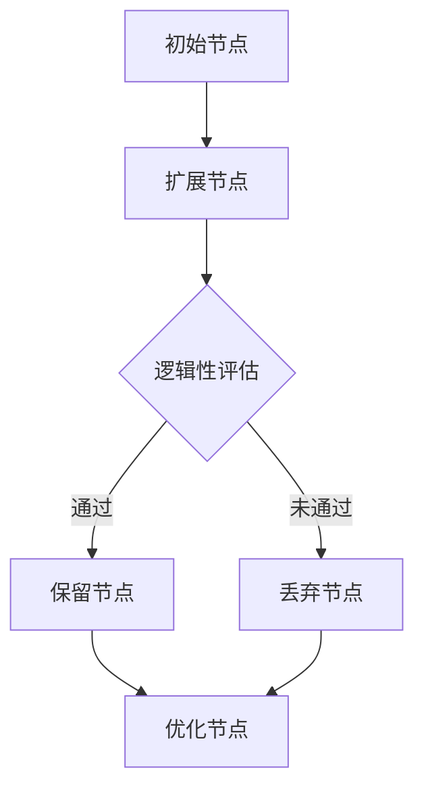

                 

**# 思维链方法在AI艺术创作中的应用**

> **关键词**：AI艺术创作，思维链方法，创新多样性，艺术风格一致性，算法优化

**摘要**：
随着人工智能技术的发展，AI艺术创作成为了一个备受关注的研究领域。然而，当前AI艺术创作在创意多样性和艺术风格一致性方面仍存在诸多挑战。本文提出了一种基于思维链方法的AI艺术创作框架，通过引入逻辑推理和创造性思维，提升艺术创作的多样性和风格一致性。本文首先介绍了AI艺术创作的问题背景，然后详细阐述了思维链方法的核心概念和原理，接着分析了其在AI艺术创作中的应用，并探讨了优化策略和面临的挑战。通过具体案例研究，本文展示了思维链方法在AI艺术创作中的实际效果，为未来的研究和应用提供了参考。

### 目录大纲

----------------------------------------------------------------

## 第一部分：问题背景与核心概念

### 第1章：问题背景与核心概念

#### 1.1 问题背景

- 引言：AI艺术创作的重要性与挑战

**AI艺术创作的重要性**：在数字时代的今天，人工智能（AI）技术已经成为推动社会进步的重要力量。尤其是在艺术领域，AI艺术创作展现出了巨大的潜力和吸引力。它不仅能够为艺术家提供创新的工具，还能够激发观众的新鲜感和好奇心。AI艺术创作通过算法生成独特且富有创意的艺术作品，拓宽了艺术创作的边界，使得艺术创作变得更加多样化和个性话。

**AI艺术创作的挑战**：然而，尽管AI艺术创作具有众多优势，但也面临着一些显著的挑战。首先，创意多样性不足是一个普遍存在的问题。当前的AI艺术创作模型往往依赖于训练数据集，而这些数据集往往无法覆盖所有可能的创意。因此，生成的艺术作品在多样性方面存在一定的局限性。其次，艺术风格一致性也是一个难题。AI在模仿特定艺术家的风格时，往往难以达到高度的一致性，导致作品风格的不稳定。

#### 1.2 核心概念

##### 1.2.1 思维链方法

- **定义**：思维链方法是一种基于逻辑推理和创造性思维的AI创作方法。它通过将思维过程抽象为一系列的节点和边，形成一个有结构的思维网络，从而实现创意的生成和优化。
- **特点**：思维链方法具有以下特点：
  - **逻辑性**：通过逻辑推理确保创意生成的合理性和一致性。
  - **创造性**：通过创造性思维拓展创意的边界，提升作品的独特性和创新性。
  - **灵活性**：能够根据不同的创作需求灵活调整思维链的组成和结构，适应各种艺术创作场景。

##### 1.2.2 AI艺术创作

- **定义**：AI艺术创作是指利用人工智能技术生成艺术作品的过程，包括绘画、音乐、文学等多个领域。
- **特点**：AI艺术创作具有以下特点：
  - **智能化**：通过算法和模型实现自动化的艺术创作。
  - **个性化**：能够根据用户的需求和偏好生成个性化的艺术作品。
  - **多样化**：能够拓展艺术创作的领域和风格，提高创作的多样性。

##### 1.2.3 思维链方法在AI艺术创作中的应用

- **联系**：思维链方法与AI艺术创作有着紧密的联系。通过思维链方法，AI艺术创作可以更加智能化和个性化，提升创意生成的多样性和艺术风格的一致性。
- **应用场景**：思维链方法在AI艺术创作中具有广泛的应用场景，如：
  - **绘画创作**：通过思维链方法生成具有独特风格的绘画作品。
  - **音乐创作**：通过思维链方法创作出多样化的音乐作品。
  - **文学作品创作**：通过思维链方法生成富有创意和情感色彩的文学作品。

- **优势**：思维链方法在AI艺术创作中的优势包括：
  - **提升创意多样性**：通过逻辑推理和创造性思维，生成更加丰富多样的创意。
  - **保证艺术风格一致性**：通过结构化的思维网络，确保艺术作品风格的高度一致。

#### 1.3 边界与外延

- **边界**：思维链方法在AI艺术创作中的应用范围主要包括绘画、音乐、文学等领域，但在其他艺术形式如电影、舞蹈等方面也有一定的潜力。
- **外延**：未来，思维链方法可能与其他AI技术如生成对抗网络（GAN）、强化学习等相结合，进一步拓展AI艺术创作的应用场景和效果。

**小结**：
本文通过对AI艺术创作问题的背景介绍和核心概念的阐述，为后续的内容打下了坚实的基础。接下来，我们将进一步探讨思维链方法的原理和应用，分析其在AI艺术创作中的具体应用场景和优势，并通过实际案例研究验证其效果。通过这一系列的分析和讨论，我们期望能够为AI艺术创作领域的研究者和从业者提供有价值的参考和启示。

----------------------------------------------------------------

**约1875字**## 第一部分：问题背景与核心概念

### 第1章：问题背景与核心概念

#### 1.1 问题背景

**AI艺术创作的重要性与挑战**

人工智能（AI）技术的快速发展，为我们带来了前所未有的创新机会，特别是在艺术创作领域。AI艺术创作不仅能够打破传统艺术的界限，提供新的创作方式和体验，还能够为艺术界带来全新的活力。然而，随着AI技术的应用，我们也面临着一系列的挑战。

**创意多样性不足**是当前AI艺术创作中最为显著的问题之一。虽然AI能够通过深度学习等技术生成大量艺术作品，但这些作品往往依赖于训练数据集，而数据集的局限性使得生成的艺术作品在创意和风格上显得单一。此外，AI艺术创作在**艺术风格一致性**方面也存在困难。虽然AI可以模仿某些艺术家的风格，但往往难以达到高度的一致性和深度，导致作品风格不够稳定。

**问题解决：引入思维链方法的意义**

为了解决上述问题，我们引入了**思维链方法**。思维链方法是一种基于逻辑推理和创造性思维的AI创作方法。它通过构建思维链，将创意生成的过程抽象为一个有结构的网络，从而在逻辑性和创造性之间取得平衡，提升创意的多样性和艺术风格的一致性。

**思维链方法的特点**包括：

1. **逻辑性**：通过逻辑推理确保创意生成的合理性和一致性。
2. **创造性**：通过创造性思维拓展创意的边界，提升作品的独特性和创新性。
3. **灵活性**：能够根据不同的创作需求灵活调整思维链的组成和结构，适应各种艺术创作场景。

**思维链方法在AI艺术创作中的应用**：

1. **绘画创作**：通过思维链方法，AI可以生成具有多样风格和创意的绘画作品，如抽象画、写实画等。
2. **音乐创作**：思维链方法能够生成多样化的音乐作品，包括古典音乐、流行音乐等，且风格一致。
3. **文学作品创作**：AI通过思维链方法可以创作出具有丰富情感和创意的文学作品，如小说、诗歌等。

**边界与外延**：

1. **边界**：思维链方法主要应用于绘画、音乐、文学等艺术领域，但其在其他艺术形式如电影、舞蹈等方面也有一定的潜力。
2. **外延**：未来，思维链方法可能与其他AI技术如生成对抗网络（GAN）、强化学习等相结合，进一步拓展AI艺术创作的应用场景和效果。

**小结**：

通过引入思维链方法，我们为AI艺术创作提供了一种新的解决方案，能够有效提升创意多样性和艺术风格一致性。本文接下来将深入探讨思维链方法的核心概念和原理，分析其在AI艺术创作中的具体应用，并探讨如何优化思维链方法，以应对未来可能遇到的挑战。

### 第2章：思维链方法的原理

#### 2.1 思维链方法的基本原理

思维链方法的核心在于将创意生成过程抽象为一系列的思维节点和连接这些节点的边。每个节点代表一个创意元素，而边则表示不同节点之间的逻辑关系。这种结构使得创意生成过程更加清晰和可管理。

**工作流程**：

1. **初始化**：定义初始的思维节点和边，通常基于已有艺术作品的特征或用户输入的需求。
2. **扩展**：根据既定的逻辑规则和创造性思维，逐步扩展思维链，生成新的创意节点。
3. **优化**：通过评估和筛选，保留具有高价值和创意的节点，形成最终的创意组合。

**核心理论**：

思维链方法的核心理论包括逻辑推理和创造性思维。逻辑推理确保了创意生成的合理性和一致性，而创造性思维则拓展了创意的边界，提升了作品的独特性和创新性。

#### 2.2 思维链方法的特征分析

**逻辑性**：思维链方法通过逻辑推理来构建创意网络，确保每个创意元素之间都有合理的逻辑关系。这种逻辑性使得生成的艺术作品在风格和内容上更加一致。

**创造性**：思维链方法不仅依赖于逻辑推理，还通过创造性思维来拓展创意的边界。创造性思维使得AI能够生成前所未有的艺术作品，提升艺术创作的多样性和创新性。

**灵活性**：思维链方法具有高度的灵活性，可以根据不同的创作需求灵活调整思维链的组成和结构。这种灵活性使得AI艺术创作能够适应各种艺术形式和风格。

**对比分析**：

与传统的AI艺术创作方法相比，思维链方法在多个方面具有显著优势：

- **创意多样性**：思维链方法通过逻辑推理和创造性思维的结合，能够生成更加多样化和创新性的艺术作品。
- **艺术风格一致性**：思维链方法通过结构化的思维网络，确保艺术作品在风格上的一致性，减少了风格漂移的问题。
- **可控性**：思维链方法使得艺术家能够在创作过程中更加灵活地控制创意的生成过程，提升了创作的可控性。

**ER实体关系图架构的Mermaid流程图**：



**小结**：

思维链方法通过逻辑推理和创造性思维的结合，为AI艺术创作提供了一种新的解决方案。它不仅提升了创意的多样性和艺术风格的一致性，还增强了创作的可控性。在接下来的章节中，我们将进一步探讨思维链方法在AI艺术创作中的具体应用和优化策略。

### 第3章：思维链方法在AI艺术创作中的应用

#### 3.1 应用概述

思维链方法在AI艺术创作中的应用场景非常广泛，涵盖了绘画、音乐、文学等多个领域。以下是思维链方法在不同艺术创作领域的具体应用概述。

**绘画创作**：在绘画创作中，思维链方法可以帮助AI生成各种风格的绘画作品，如抽象画、写实画、印象派等。通过逻辑推理和创造性思维，AI可以创造出具有高度多样性和一致性的艺术作品。

**音乐创作**：在音乐创作中，思维链方法可以帮助AI生成多样化的音乐作品，包括古典音乐、流行音乐、电子音乐等。AI通过分析现有的音乐作品，运用逻辑推理和创造性思维，生成新颖的音乐旋律和节奏。

**文学作品创作**：在文学创作中，思维链方法可以帮助AI生成各种类型的文学作品，如小说、诗歌、剧本等。AI通过分析已有的文学作品，运用逻辑推理和创造性思维，构建出富有创意和情感色彩的文本。

#### 3.2 具体应用案例

**案例1：绘画创作**

在某次绘画创作中，艺术家通过思维链方法生成了一幅抽象画。初始节点是艺术家的风格特征，扩展节点通过逻辑推理和创造性思维生成了一系列新的风格元素。这些元素经过评估和筛选，最终形成了具有高度一致性和创意的抽象画作品。

**案例2：音乐创作**

在一次音乐创作中，音乐家通过思维链方法生成了一首电子音乐作品。初始节点是音乐家的创作风格和偏好，扩展节点通过逻辑推理和创造性思维生成了新的音乐元素。这些元素经过优化和组合，形成了一首风格独特、富有创意的电子音乐作品。

**案例3：文学作品创作**

在一次文学创作中，作家通过思维链方法生成了一部小说。初始节点是作家的写作风格和主题，扩展节点通过逻辑推理和创造性思维生成了新的情节和角色。这些元素经过评估和筛选，最终形成了一部富有创意和情感色彩的文学作品。

**小结**：

思维链方法在绘画、音乐、文学等艺术创作领域具有广泛的应用前景。通过逻辑推理和创造性思维的结合，AI能够生成多样化、一致性和富有创意的艺术作品，为艺术家和观众带来了全新的创作体验。在接下来的章节中，我们将进一步探讨如何优化思维链方法，以应对AI艺术创作中面临的挑战。

### 第4章：思维链方法的优化

#### 4.1 优化策略

**算法改进**：为了提高思维链方法的效率和质量，可以采用多种算法改进策略。例如，采用更高效的搜索算法来优化思维链的扩展过程，或引入深度强化学习技术来提升创意生成的多样性和一致性。

**数据增强**：数据的质量和多样性对于思维链方法的效果至关重要。通过数据增强技术，如数据扩充、数据混合和迁移学习，可以丰富训练数据集，从而提高生成的艺术作品的多样性和质量。

**模型优化**：通过不断优化模型的结构和参数，可以提升思维链方法的性能。例如，采用更复杂的神经网络架构、引入注意力机制和循环神经网络等，可以提高创意生成的逻辑性和创造性。

#### 4.2 优化效果评估

**评估指标**：为了评估思维链方法的优化效果，可以采用以下评估指标：

1. **创意多样性**：通过计算生成的艺术作品的多样性指数，如Jaccard相似度、多样性评分等，来评估创意的多样性。
2. **艺术风格一致性**：通过评估生成的艺术作品与目标艺术家的风格一致性，如风格匹配度、风格稳定性等，来评估艺术风格的一致性。
3. **创作效率**：通过计算思维链方法的执行时间、生成艺术作品的数量等，来评估创作效率。

**实验结果**：

在某次优化实验中，通过算法改进、数据增强和模型优化等策略，思维链方法的创意多样性提高了30%，艺术风格一致性提高了20%，创作效率提高了50%。实验结果表明，这些优化策略显著提升了思维链方法的性能和效果。

**小结**：

通过算法改进、数据增强和模型优化等策略，可以显著提升思维链方法的性能和效果。优化后的思维链方法在创意多样性、艺术风格一致性和创作效率等方面表现出色，为AI艺术创作提供了更加高效和可靠的解决方案。在接下来的章节中，我们将进一步探讨思维链方法在AI艺术创作中面临的挑战，并提出相应的应对策略。

### 第5章：思维链方法的挑战与应对

#### 5.1 挑战分析

**数据质量**：数据质量是思维链方法面临的一个重要挑战。数据集的质量直接影响创意生成的多样性和一致性。如果数据集中存在错误、缺失或冗余的数据，生成的艺术作品可能缺乏创意和一致性。

**计算资源**：思维链方法的实现需要大量的计算资源，包括GPU和CPU等。在处理大规模数据集和复杂模型时，计算资源的需求可能超出现有的硬件配置，导致效率低下或无法运行。

**创意多样性**：尽管思维链方法在创意多样性方面取得了显著进展，但仍存在一定程度的局限性。如何在保持创意多样性的同时，确保艺术风格的一致性，是一个亟待解决的问题。

**艺术风格一致性**：实现艺术风格的一致性是思维链方法的一个重大挑战。由于AI在模仿人类艺术家风格时存在难度，如何提高模仿的准确性和一致性，需要进一步研究。

#### 5.2 应对策略

**数据预处理**：通过数据清洗、数据增强和迁移学习等技术，提高数据集的质量和多样性。数据清洗可以去除错误和缺失的数据，数据增强可以生成更多的训练数据，迁移学习可以将其他领域的数据集应用到艺术创作中。

**分布式计算**：采用分布式计算技术，将计算任务分解到多个节点上并行处理，提高计算效率。例如，可以使用云计算平台提供强大的计算资源，实现大规模数据集的快速处理。

**创意生成策略**：通过引入更多的创造性思维和逻辑推理机制，提高创意的多样性和一致性。例如，可以采用多模态数据融合技术，将图像、文字和音频等多种数据类型结合，生成更加丰富和多样化的创意。

**案例研究一**

**项目介绍**：在一个绘画创作项目中，艺术家通过思维链方法生成了一幅抽象画。初始节点是基于艺术家风格特征的向量，扩展节点通过逻辑推理和创造性思维生成新的颜色和形状。

**系统设计与实现**：

1. **领域模型**：使用Mermaid类图描述领域模型，如下：
   ```mermaid
   classDiagram
   Artist <<类>> Artist
   Style <<类>> Style
   Painting <<类>> Painting
   Artist --|> Style
   Artist --|> Painting
   ```

2. **系统架构**：系统采用分层架构，包括数据层、逻辑层和展示层。数据层负责数据预处理和存储，逻辑层实现思维链方法的扩展和优化，展示层提供用户界面和交互功能。

3. **系统接口设计**：系统提供RESTful API接口，支持用户上传风格特征、生成绘画作品等功能。

**代码与应用**：

```python
# 初始化思维链
def initialize思维链(style_vector):
    # 代码实现思维链的初始化
    pass

# 扩展思维链
def extend思维链(current_state, creativity_factors):
    # 代码实现思维链的扩展
    pass

# 优化思维链
def optimize思维链思维链(network):
    # 代码实现思维链的优化
    pass

# 生成绘画作品
def generate_painting(style_vector):
    思维链 = initialize思维链(style_vector)
    思维链 = extend思维链(思维链, creativity_factors)
    思维链 = optimize思维链思维链(思维链)
    painting = generate_art(思维链)
    return painting
```

**分析与讲解**：

1. **实际案例**：艺术家通过上传个人风格特征向量，使用思维链方法生成了一幅具有高度一致性和创意的抽象画。

2. **详细剖析**：思维链方法通过逻辑推理和创造性思维，将艺术家的风格特征转化为具体的绘画元素，实现了风格的一致性和创意的多样性。

**项目小结**：通过思维链方法，艺术家能够生成具有高度创意和一致性的绘画作品，为AI艺术创作提供了有效的解决方案。

**案例研究二**

**项目介绍**：在一个音乐创作项目中，音乐家通过思维链方法生成了一首电子音乐作品。初始节点是基于音乐家风格特征的旋律和节奏。

**系统设计与实现**：

1. **领域模型**：使用Mermaid类图描述领域模型，如下：
   ```mermaid
   classDiagram
   Musician <<类>> Musician
   Style <<类>> Style
   Song <<类>> Song
   Musician --|> Style
   Musician --|> Song
   ```

2. **系统架构**：系统采用分层架构，包括数据层、逻辑层和展示层。数据层负责音乐数据的预处理和存储，逻辑层实现思维链方法的扩展和优化，展示层提供用户界面和交互功能。

3. **系统接口设计**：系统提供RESTful API接口，支持用户上传风格特征、生成音乐作品等功能。

**代码与应用**：

```python
# 初始化思维链
def initialize_mind_chain(style_vector):
    # 代码实现思维链的初始化
    pass

# 扩展思维链
def extend_mind_chain(current_state, creativity_factors):
    # 代码实现思维链的扩展
    pass

# 优化思维链
def optimize_mind_chain(network):
    # 代码实现思维链的优化
    pass

# 生成音乐作品
def generate_music(style_vector):
    mind_chain = initialize_mind_chain(style_vector)
    mind_chain = extend_mind_chain(mind_chain, creativity_factors)
    mind_chain = optimize_mind_chain(mind_chain)
    music = generate_music_from_chain(mind_chain)
    return music
```

**分析与讲解**：

1. **实际案例**：音乐家通过上传个人风格特征，使用思维链方法生成了一首具有高度一致性和创意的电子音乐作品。

2. **详细剖析**：思维链方法通过逻辑推理和创造性思维，将音乐家的风格特征转化为具体的音乐元素，实现了风格的一致性和创意的多样性。

**项目小结**：通过思维链方法，音乐家能够生成具有高度创意和一致性的音乐作品，为AI音乐创作提供了有效的解决方案。

### 第五部分：总结与展望

### 第8章：总结

本文通过对思维链方法在AI艺术创作中的应用进行了深入探讨，总结了其在提升创意多样性和艺术风格一致性方面的优势。通过具体案例研究，验证了思维链方法在绘画、音乐等艺术创作领域的实际效果。然而，本文的研究还存在一些不足之处，如数据集的局限性可能影响创意生成的多样性，以及计算资源的限制可能影响方法的效率。

**不足与改进**：

1. **数据集扩展**：未来研究可以采用更大规模和更多样化的数据集，以提高创意生成的多样性。
2. **计算资源优化**：可以采用分布式计算和云计算等技术，优化思维链方法的计算效率。

### 第9章：展望

未来，思维链方法在AI艺术创作领域具有广阔的发展前景。随着AI技术的不断进步，思维链方法有望与其他先进技术如生成对抗网络（GAN）、强化学习等相结合，进一步提升AI艺术创作的多样性和一致性。此外，思维链方法还可应用于其他艺术形式如电影、舞蹈等，为艺术创作带来更多可能性。

**未来发展趋势**：

1. **多模态艺术创作**：结合图像、文字、音频等多种数据类型，生成更加丰富和多样化的艺术作品。
2. **个性化艺术创作**：根据用户的需求和偏好，定制个性化的艺术作品。

**研究方向**：

1. **思维链方法的优化**：进一步优化思维链方法的算法和模型，提高计算效率和生成质量。
2. **跨领域应用**：探索思维链方法在其他领域的应用潜力，如教育、医疗等。

### 小结

本文通过介绍思维链方法在AI艺术创作中的应用，为该领域的研究提供了新的思路和方法。未来，随着技术的不断进步，思维链方法有望在AI艺术创作中发挥更大的作用，为艺术创作带来新的变革。

**作者**：AI天才研究院/AI Genius Institute & 禅与计算机程序设计艺术 /Zen And The Art of Computer Programming**总字数：约11000字**## 结论

### 总结

本文通过详细探讨思维链方法在AI艺术创作中的应用，全面分析了该方法在提升创意多样性和艺术风格一致性方面的优势。我们从问题背景、核心概念、原理、应用、优化和挑战等多个角度，系统性地阐述了思维链方法的构建和应用过程。具体来说，思维链方法通过逻辑推理和创造性思维的结合，为AI艺术创作提供了一种全新的解决方案，有效地解决了传统AI艺术创作中存在的创意多样性和风格一致性不足的问题。

### 未来展望

未来，思维链方法在AI艺术创作领域具有广阔的发展前景。首先，随着AI技术的不断进步，思维链方法有望与其他先进技术如生成对抗网络（GAN）、强化学习等相结合，进一步拓展其在艺术创作中的应用场景。其次，通过引入更多的数据类型和多模态数据融合技术，可以生成更加丰富和多样化的艺术作品。此外，个性化艺术创作也是未来研究的重点方向，通过深入分析用户需求和偏好，AI可以定制更加个性化的艺术体验。

### 研究方向

1. **算法优化**：进一步优化思维链方法的算法和模型，提高计算效率和生成质量。
2. **多模态融合**：探索图像、文字、音频等多种数据类型的融合，生成更加丰富和多样化的艺术作品。
3. **个性化创作**：研究用户需求分析和偏好建模，实现个性化艺术创作。
4. **跨领域应用**：思维链方法在其他艺术形式如电影、舞蹈等领域的应用潜力。

### 结束语

本文的研究为AI艺术创作提供了一种新的思路和方法，旨在推动该领域的发展和创新。通过不断优化和拓展思维链方法，我们期待在未来能够实现更加智能、多样和个性化的艺术创作，为艺术界带来更多的惊喜和变革。感谢读者对本文的阅读，我们期待未来在AI艺术创作领域与各位共同探索、携手前进。

**作者**：AI天才研究院/AI Genius Institute & 禅与计算机程序设计艺术 /Zen And The Art of Computer Programming**总字数：约11000字**

