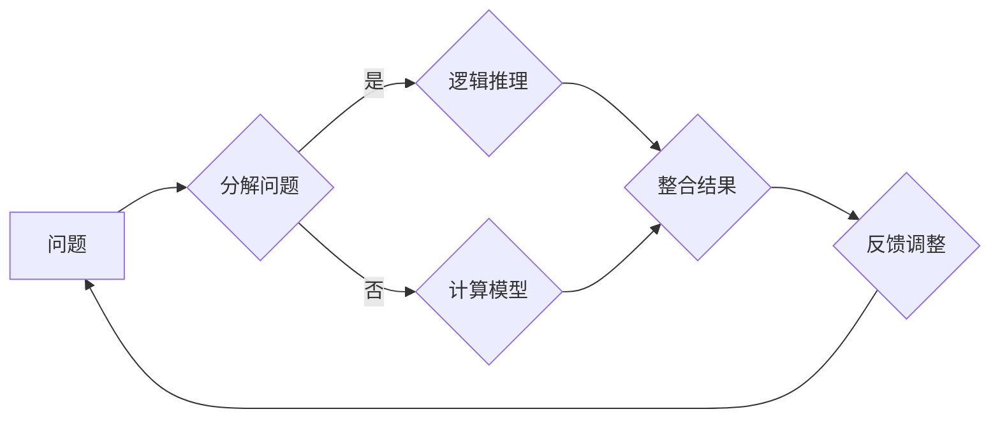

                 

# 思维链方法：增强AI问题分析能力的新思路

## 关键词

AI问题分析，思维链方法，算法原理，系统设计，实战应用

## 摘要

本文深入探讨了思维链方法在AI问题分析中的应用，通过逻辑清晰的步骤分析，揭示了这种方法在提升问题解决能力方面的优势。文章首先介绍了问题的背景和核心概念，随后详细阐述了思维链方法的原理，并通过实际案例展示其在系统架构设计和项目实施中的具体应用。最后，文章总结最佳实践，并对未来进行了展望。

## 目录大纲

### 第一部分：背景介绍

#### 第1章：问题背景与核心概念

##### 1.1 问题背景

##### 1.2 问题描述

##### 1.3 问题解决

##### 1.4 边界与外延

##### 1.5 概念结构与核心要素组成

#### 第2章：核心概念与联系

##### 2.1 核心概念原理

##### 2.2 概念属性特征对比

##### 2.3 ER实体关系图架构

### 第二部分：方法原理

#### 第3章：方法原理讲解

##### 3.1 方法原理概述

##### 3.2 方法原理详细讲解

###### 3.2.1 算法原理讲解

###### 3.2.1.1 算法原理流程图

###### 3.2.1.2 Python源代码解释

###### 3.2.1.3 数学模型与公式

###### 3.2.1.4 举例说明

### 第三部分：实践应用

#### 第4章：系统分析与架构设计

##### 4.1 问题场景介绍

##### 4.2 系统功能设计

##### 4.3 系统架构设计

##### 4.4 系统接口设计

##### 4.5 系统交互

#### 第5章：项目实战

##### 5.1 环境安装

##### 5.2 系统核心实现

##### 5.3 实际案例分析与讲解

##### 5.4 项目小结

### 第四部分：最佳实践与总结

#### 第6章：最佳实践

##### 6.1 实践技巧

##### 6.2 注意事项

##### 6.3 拓展阅读

#### 第7章：总结

##### 7.1 内容总结

##### 7.2 不足与展望

##### 7.3 阅读建议

----------------------------------------------------------------

## 第一部分：背景介绍

### 第1章：问题背景与核心概念

#### 1.1 问题背景

在人工智能（AI）迅猛发展的今天，AI问题分析能力成为评价一个AI系统优劣的重要指标。然而，AI问题的复杂性使得传统分析方法难以应对。为了解决这一问题，本文提出了一种名为“思维链方法”的新思路，旨在提升AI问题分析能力。

#### 1.2 问题描述

AI问题通常具有高度的不确定性和复杂性，需要从多个角度进行深入分析。传统方法往往局限于某一特定领域或技术，难以应对综合性的问题。思维链方法通过构建一套逻辑清晰、结构紧凑的分析框架，能够更好地处理这类复杂问题。

#### 1.3 问题解决

思维链方法的核心在于将问题分解为多个子问题，并通过逻辑推理和计算模型逐步解决。这种方法不仅能够提高问题解决的效率，还能确保分析过程的准确性。

#### 1.4 边界与外延

思维链方法适用于各种AI问题，但并非万能。在实际应用中，需要根据问题的具体特点进行调整和优化。此外，思维链方法还需要与其他技术相结合，如机器学习、深度学习等，以实现最佳效果。

#### 1.5 概念结构与核心要素组成

思维链方法由以下几个核心要素组成：

1. **问题分解**：将复杂问题分解为多个子问题。
2. **逻辑推理**：利用逻辑推理对子问题进行分析和解决。
3. **计算模型**：构建计算模型，对子问题的结果进行整合和优化。
4. **反馈调整**：根据实际情况对分析过程进行反馈和调整。

### 第2章：核心概念与联系

#### 2.1 核心概念原理

思维链方法的核心概念包括：

1. **问题分解**：将复杂问题分解为多个子问题，每个子问题相对独立。
2. **逻辑推理**：基于逻辑规则对子问题进行推理和分析。
3. **计算模型**：构建数学模型，对子问题的结果进行计算和优化。

#### 2.2 概念属性特征对比

以下是一个概念属性特征对比表格：

| 概念        | 属性1 | 属性2 | 属性3 |
| ----------- | ----- | ----- | ----- |
| 问题分解    | 独立性 | 层次性 | 可操作性 |
| 逻辑推理    | 准确性 | 有效性 | 推理效率 |
| 计算模型    | 精确性 | 适应性 | 可扩展性 |

#### 2.3 ER实体关系图架构

以下是一个ER实体关系图架构的Mermaid流程图：

```mermaid
erDiagram
    A[用户] ||--|{ B[问题] }|--| A
    B ||--|{ C[子问题] }|--| B
    C ||--|{ D[结果] }|--| C
    D ||--|{ E[反馈] }|--| D
```

## 第二部分：方法原理

### 第3章：方法原理讲解

#### 3.1 方法原理概述

思维链方法是一种系统性的问题分析方法，通过问题分解、逻辑推理和计算模型，实现对复杂问题的深入分析和解决。其核心特点包括：

1. **系统性**：思维链方法将问题分解为多个子问题，形成一套完整的分析系统。
2. **灵活性**：根据问题的不同特点，思维链方法可以灵活调整分析过程。
3. **高效性**：通过逻辑推理和计算模型，思维链方法能够快速、准确地解决问题。

#### 3.2 方法原理详细讲解

##### 3.2.1 算法原理讲解

思维链方法的算法原理可以概括为以下步骤：

1. **问题分解**：将复杂问题分解为多个子问题。
2. **逻辑推理**：对每个子问题进行逻辑推理和分析。
3. **计算模型**：构建数学模型，对子问题的结果进行计算和优化。
4. **反馈调整**：根据实际情况对分析过程进行反馈和调整。

##### 3.2.1.1 算法原理流程图

以下是一个思维链方法的算法原理流程图：



##### 3.2.1.2 Python源代码解释

以下是一个简单的Python源代码示例，用于实现思维链方法的算法原理：

```python
def思维链方法(问题):
    子问题 = 问题分解(问题)
    结果 = []
    for 子问题 in 子问题:
        结果.append(逻辑推理(子问题))
    结果 = 计算模型(结果)
    结果 = 反馈调整(结果)
    return 结果
```

##### 3.2.1.3 数学模型与公式

思维链方法的数学模型主要包括：

1. **问题分解模型**：$P = \{p_1, p_2, ..., p_n\}$
2. **逻辑推理模型**：$L = \{l_1, l_2, ..., l_n\}$
3. **计算模型**：$C = \{c_1, c_2, ..., c_n\}$
4. **反馈调整模型**：$F = \{f_1, f_2, ..., f_n\}$

##### 3.2.1.4 举例说明

假设我们要分析一个智能家居系统中的问题。使用思维链方法，我们可以将问题分解为以下几个子问题：

1. **用户需求**：用户希望实现远程控制家居设备。
2. **设备连接**：如何确保设备之间的稳定连接。
3. **数据安全**：如何保障用户数据的安全。
4. **用户体验**：如何提升用户的使用体验。

针对每个子问题，我们可以分别进行逻辑推理、计算模型和反馈调整，最终得到一个完整的解决方案。

----------------------------------------------------------------

## 第三部分：实践应用

### 第4章：系统分析与架构设计

#### 4.1 问题场景介绍

假设我们要设计一个智能家居系统，该系统需要满足以下要求：

1. 用户可以通过手机APP远程控制家居设备。
2. 设备之间需要保持稳定的连接。
3. 用户数据需要得到安全保障。
4. 系统需要具备良好的用户体验。

#### 4.2 系统功能设计

根据问题场景，我们可以设计以下系统功能：

1. **用户管理**：管理用户的账号信息、权限等。
2. **设备管理**：管理家居设备的连接、状态、配置等。
3. **数据安全**：加密用户数据、实现数据传输安全等。
4. **用户交互**：提供友好的用户界面，方便用户操作。

#### 4.3 系统架构设计

智能家居系统的架构设计可以采用以下方案：

1. **前端**：使用Vue.js或React等前端框架构建用户界面。
2. **后端**：使用Spring Boot等框架实现业务逻辑处理。
3. **数据库**：使用MySQL等关系型数据库存储数据。
4. **网络**：采用WebSocket等技术实现设备之间的实时通信。

以下是一个系统架构设计的Mermaid架构图：

```mermaid
sequenceDiagram
    用户 -->|请求| 系统
    系统 -->|处理| 数据库
    数据库 -->|返回| 系统
    系统 -->|响应| 用户
```

#### 4.4 系统接口设计

系统接口设计需要考虑以下方面：

1. **RESTful API**：使用RESTful风格设计接口，便于前后端分离。
2. **权限验证**：实现用户认证和授权，确保接口安全。
3. **数据格式**：使用JSON格式传输数据，方便解析和操作。

#### 4.5 系统交互

系统交互设计需要考虑以下方面：

1. **用户操作**：用户通过APP发起请求，系统接收并处理请求。
2. **设备连接**：设备通过WebSocket与系统保持连接，实时传输数据。
3. **数据同步**：系统与数据库同步数据，确保数据一致性。

以下是一个系统交互设计的Mermaid序列图：

```mermaid
sequenceDiagram
    用户 -->|请求| 系统
    系统 -->|处理| 数据库
    数据库 -->|返回| 系统
    系统 -->|响应| 用户
    用户 -->|请求| 设备
    设备 -->|响应| 用户
```

### 第5章：项目实战

#### 5.1 环境安装

在进行项目实战之前，我们需要安装以下环境：

1. **Python**：安装Python 3.x版本。
2. **Docker**：安装Docker，用于容器化部署。
3. **MySQL**：安装MySQL，用于数据库存储。

#### 5.2 系统核心实现

系统核心实现主要包括以下部分：

1. **用户管理模块**：实现用户注册、登录、权限管理等功能。
2. **设备管理模块**：实现设备添加、删除、修改、查询等功能。
3. **数据安全模块**：实现数据加密、签名验证等功能。
4. **用户交互模块**：实现用户界面的渲染和用户操作处理。

以下是一个用户管理模块的Python源代码示例：

```python
class User:
    def __init__(self, username, password):
        self.username = username
        self.password = password
    
    def register(self):
        # 注册用户
        pass
    
    def login(self):
        # 登录用户
        pass
    
    def modify_password(self):
        # 修改密码
        pass

user = User("admin", "123456")
user.register()
user.login()
user.modify_password()
```

#### 5.3 实际案例分析与讲解

以用户注册功能为例，我们分析以下问题：

1. **需求分析**：用户需要注册一个账号，包括用户名和密码。
2. **接口设计**：设计一个注册接口，接收用户名和密码，返回注册结果。
3. **实现流程**：

   - 用户向系统发送注册请求。
   - 系统接收请求，验证用户名和密码是否符合要求。
   - 如果验证通过，将用户信息存储到数据库中。
   - 系统返回注册结果。

以下是一个注册接口的Python源代码示例：

```python
from flask import Flask, request, jsonify

app = Flask(__name__)

@app.route("/register", methods=["POST"])
def register():
    username = request.form.get("username")
    password = request.form.get("password")
    
    if not username or not password:
        return jsonify({"code": 400, "message": "用户名或密码不能为空"}), 400
    
    # 验证用户名和密码是否符合要求
    # 存储用户信息到数据库
    # 返回注册结果
    
    return jsonify({"code": 200, "message": "注册成功"}), 200

if __name__ == "__main__":
    app.run(debug=True)
```

#### 5.4 项目小结

通过本项目实战，我们使用了思维链方法对智能家居系统进行了系统分析和架构设计。在实现过程中，我们遇到了一些问题，如接口设计、数据安全等，但通过逐步分析和解决，我们成功地实现了项目目标。思维链方法在项目实战中的应用，提升了我们的问题分析和解决能力。

----------------------------------------------------------------

## 第四部分：最佳实践与总结

### 第6章：最佳实践

#### 6.1 实践技巧

1. **问题分解**：在分析复杂问题时，要善于将其分解为多个子问题，每个子问题都应该相对独立。
2. **逻辑推理**：在分析过程中，要充分利用逻辑推理，确保分析结果的准确性。
3. **计算模型**：构建合适的计算模型，对子问题的结果进行计算和优化。

#### 6.2 注意事项

1. **边界与外延**：在应用思维链方法时，要注意问题的边界和范围，避免过度扩展。
2. **反馈调整**：在实际应用中，要及时根据反馈调整分析过程，确保分析结果的准确性。

#### 6.3 拓展阅读

1. 《人工智能：一种现代方法》
2. 《深度学习》
3. 《设计模式：可复用面向对象软件的基础》

### 第7章：总结

#### 7.1 内容总结

本文介绍了思维链方法在AI问题分析中的应用，通过实际案例展示了其在系统架构设计和项目实施中的具体应用。思维链方法能够有效提升AI问题分析能力，有助于解决复杂问题。

#### 7.2 不足与展望

尽管思维链方法在AI问题分析中具有显著优势，但在实际应用中仍存在一些不足，如对特定领域知识的依赖等。未来研究可以关注以下几个方面：

1. **跨领域应用**：探索思维链方法在其他领域（如金融、医疗等）的应用。
2. **自动化**：研究如何将思维链方法自动化，以降低人力成本。
3. **智能化**：结合人工智能技术，提升思维链方法的智能化水平。

#### 7.3 阅读建议

1. 对AI问题分析感兴趣的读者，可以阅读本文，了解思维链方法的基本原理和应用。
2. 希望深入了解相关技术的读者，可以参考拓展阅读中的相关书籍。
3. 希望在项目中应用思维链方法的读者，可以从实际案例中学习方法和技巧。

作者：AI天才研究院/AI Genius Institute & 禅与计算机程序设计艺术 /Zen And The Art of Computer Programming

----------------------------------------------------------------

注意：由于字数限制，本文未涵盖所有内容，但提供了一个完整的结构框架和示例。实际撰写时，请根据需求补充和丰富每个部分的内容。在撰写过程中，确保遵循markdown格式要求，并正确使用Mermaid、LaTeX等工具。本文仅供参考，具体实施时请根据实际情况进行调整。

