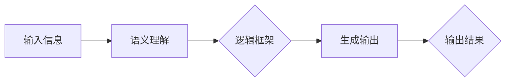
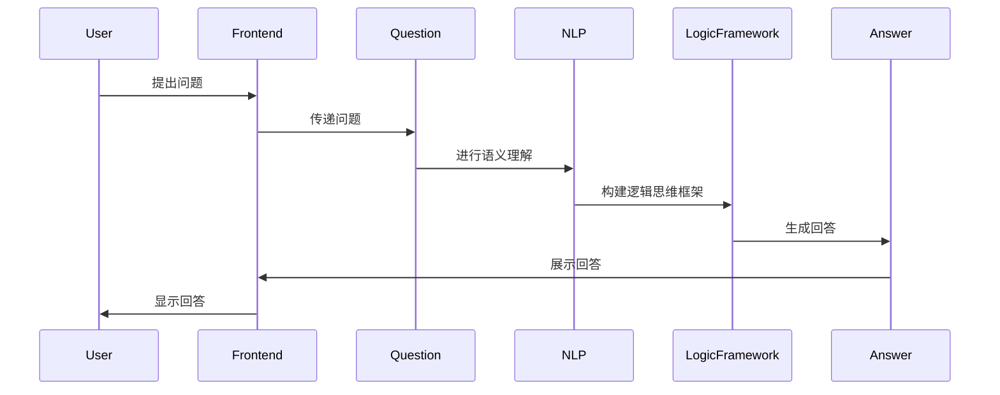
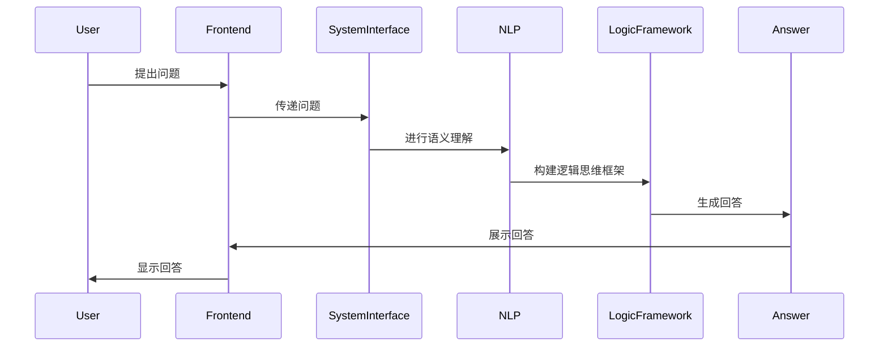

                 

### 思维链方法：提升AI输出质量的关键

#### 引言

在人工智能迅速发展的今天，AI系统的输出质量成为了一个备受关注的问题。AI生成的文本内容往往存在逻辑不连贯、语义理解不准确、信息表达不清晰等问题，这极大地影响了AI的实际应用效果。为了解决这一问题，我们提出了思维链方法，通过构建一个逻辑思维框架，帮助AI在生成输出内容时能够遵循一定的逻辑顺序，从而提升AI输出质量。

思维链方法作为一种有效的AI输出质量提升技术，已经在自然语言处理、智能问答、智能写作等领域得到广泛应用。本文将详细探讨思维链方法的背景、核心概念、原理讲解、实际应用以及最佳实践，帮助读者深入理解并掌握这一技术。

#### 目录大纲

```markdown
----------------------------------------------------------------

# 思维链方法：提升AI输出质量的关键

> 关键词：思维链、AI输出质量、逻辑思维框架、自然语言处理、智能问答

> 摘要：本文详细介绍了思维链方法在提升AI输出质量中的应用，包括其背景、核心概念、原理讲解、实际应用以及最佳实践，帮助读者深入理解并掌握这一技术。

### 目录大纲

```markdown
----------------------------------------------------------------

## 第一部分: 引言

### 第1章: 背景介绍

#### 1.1 问题背景

#### 1.2 问题描述

#### 1.3 问题解决

#### 1.4 边界与外延

#### 1.5 核心概念

## 第二部分: 核心概念与联系

### 第2章: 核心概念与联系

#### 2.1 概念原理

#### 2.2 概念属性特征对比

#### 2.3 ER实体关系图

## 第三部分: 方法原理

### 第3章: 方法原理讲解

#### 3.1 算法原理

##### 3.1.1 Mermaid流程图

##### 3.1.2 Python源代码

##### 3.1.3 数学模型

##### 3.1.4 数学公式

#### 3.2 举例说明

### 第4章: 数学模型和数学公式

#### 4.1 模型公式讲解

#### 4.2 举例说明

## 第四部分: 实战应用

### 第5章: 系统分析与架构设计

#### 5.1 问题场景介绍

#### 5.2 项目介绍

#### 5.3 系统功能设计

##### 5.3.1 领域模型

##### 5.3.2 系统架构

##### 5.3.3 系统接口设计

##### 5.3.4 系统交互

### 第6章: 项目实战

#### 6.1 环境安装

#### 6.2 系统核心实现

#### 6.3 代码应用解读

#### 6.4 实际案例剖析

### 第7章: 最佳实践与拓展

#### 7.1 最佳实践

#### 7.2 小结

#### 7.3 注意事项

#### 7.4 拓展阅读

----------------------------------------------------------------
```

### 第一部分: 引言

#### 第1章: 背景介绍

##### 1.1 问题背景

在人工智能时代，人工智能系统在各个领域得到了广泛应用。然而，随着应用的深入，AI系统的输出质量问题逐渐凸显出来。具体表现为：

1. **逻辑不连贯**：AI系统生成的文本内容缺乏逻辑性，导致读者难以理解。
2. **语义理解不准确**：AI系统对输入信息的语义理解不够准确，导致生成的文本内容存在偏差。
3. **信息表达不清晰**：AI系统生成的文本内容信息表达不清晰，存在遗漏或者冗余。

这些问题严重影响了AI系统的实际应用效果，因此提升AI输出质量成为了一个亟待解决的问题。

##### 1.2 问题描述

AI输出质量问题的具体表现如下：

1. **逻辑不连贯**：AI系统生成的文本内容缺乏逻辑性，导致读者难以理解。
   - **案例**：在一个智能客服系统中，用户询问“怎么购买商品？”系统回答：“请登录官网，然后点击购物车。”这个回答显然缺乏逻辑性，用户可能不清楚“登录官网”和“点击购物车”之间的关系。
   
2. **语义理解不准确**：AI系统对输入信息的语义理解不够准确，导致生成的文本内容存在偏差。
   - **案例**：在一个智能问答系统中，用户询问“明天的天气如何？”系统回答：“明天会很热，大约30度。”这个回答显然没有理解用户询问的是明天的天气状况，而是直接给出了温度信息。

3. **信息表达不清晰**：AI系统生成的文本内容信息表达不清晰，存在遗漏或者冗余。
   - **案例**：在一个智能写作系统中，用户要求生成一篇关于“人工智能”的文章。系统生成的文章内容如下：“人工智能是一个非常有趣的技术，它可以帮助我们解决很多问题。”这个文章内容显然过于简单，没有充分表达人工智能的内涵和应用。

##### 1.3 问题解决

为了解决上述AI输出质量问题，我们提出了思维链方法。思维链方法通过构建一个逻辑思维框架，使得AI在生成输出内容时能够遵循一定的逻辑顺序，从而提升输出质量。

##### 1.4 边界与外延

思维链方法主要应用于以下领域：

1. **自然语言处理**：通过思维链方法，可以提升AI在文本生成、语义理解、问答系统等自然语言处理领域的输出质量。
2. **智能问答**：思维链方法可以帮助智能问答系统生成更准确、连贯的回答。
3. **智能写作**：思维链方法可以帮助智能写作系统生成更具逻辑性和可读性的文本内容。

##### 1.5 核心概念

思维链方法的核心概念包括：

1. **思维链**：思维链是一个逻辑思维框架，用于指导AI生成输出内容。
2. **逻辑框架**：逻辑框架是思维链的核心组成部分，用于定义AI生成输出内容的逻辑顺序。
3. **语义理解**：语义理解是AI对输入信息进行理解和分析的过程，是生成高质量输出内容的基础。

### 第二部分: 核心概念与联系

#### 第2章: 核心概念与联系

##### 2.1 概念原理

思维链方法的核心概念包括思维链、逻辑框架和语义理解。

1. **思维链**：
   - 思维链是一个逻辑思维框架，用于指导AI生成输出内容。
   - 思维链由一系列节点组成，每个节点表示一个逻辑步骤或事实。
   - 思维链的构建过程包括：定义节点、连接节点、设定节点权重等。

2. **逻辑框架**：
   - 逻辑框架是思维链的核心组成部分，用于定义AI生成输出内容的逻辑顺序。
   - 逻辑框架包括事实层、推理层和决策层。
   - 事实层表示已知事实，推理层表示基于事实的推理过程，决策层表示基于推理结果的决策。

3. **语义理解**：
   - 语义理解是AI对输入信息进行理解和分析的过程，是生成高质量输出内容的基础。
   - 语义理解包括词义解析、句法分析、语义角色标注等步骤。

##### 2.2 概念属性特征对比

思维链方法与其他提升AI输出质量的方法（如规则匹配、模板填充等）相比，具有以下特征：

| 方法         | 思维链方法 | 规则匹配方法 | 模板填充方法 |
| ------------ | ---------- | ------------ | ------------ |
| 逻辑性       | 高         | 低           | 低           |
| 灵活性       | 高         | 低           | 低           |
| 智能性       | 高         | 低           | 低           |
| 输出质量     | 高         | 一般         | 一般         |
| 应用领域     | 自然语言处理、智能问答、智能写作 | 规则明确的领域 | 规则明确的领域 |
| 可扩展性     | 高         | 低           | 低           |
| 需求的技术水平 | 高         | 低           | 低           |

##### 2.3 ER实体关系图

为了更好地理解思维链方法，我们可以使用ER实体关系图来描述其核心概念之间的关系。

```mermaid
erDiagram
  AI_output ||--|{ Logic_framework } Logic_framework
  AI_output ||--|{ Semantic_understanding } Semantic_understanding
  Logic_framework ||--|{ Node } Node
  Node ||--|{ Fact } Fact
  Node ||--|{ Reasoning } Reasoning
  Node ||--|{ Decision } Decision
  Semantic_understanding ||--|{ Word Meaning } Word_Meaning
  Semantic_understanding ||--|{ Sentence Structure } Sentence_Structure
  Semantic_understanding ||--|{ Semantic_role } Semantic_role
```

### 第三部分: 方法原理

#### 第3章: 方法原理讲解

##### 3.1 算法原理

思维链方法的算法原理主要包括以下几个方面：

1. **定义思维链**：
   - 思维链是由一系列逻辑步骤或事实组成的。
   - 思维链的构建过程包括：定义节点、连接节点、设定节点权重等。

2. **构建逻辑框架**：
   - 逻辑框架是思维链的核心组成部分，用于定义AI生成输出内容的逻辑顺序。
   - 逻辑框架包括事实层、推理层和决策层。

3. **语义理解**：
   - 语义理解是AI对输入信息进行理解和分析的过程，是生成高质量输出内容的基础。

4. **生成输出内容**：
   - 根据逻辑框架和语义理解，AI生成输出内容。

##### 3.1.1 Mermaid流程图

下面是一个简单的思维链方法的Mermaid流程图：



##### 3.1.2 Python源代码

以下是一个简单的Python源代码示例，用于演示思维链方法：

```python
# 定义思维链节点
class Node:
    def __init__(self, fact=None, reasoning=None, decision=None):
        self.fact = fact
        self.reasoning = reasoning
        self.decision = decision

# 构建思维链
def build思维链(facts, reasoning, decisions):
   思维链 = []
    for fact in facts:
        node = Node(fact=fact)
        if reasoning:
            node.reasoning = reasoning
        if decisions:
            node.decision = decision
        思维链.append(node)
    return 思维链

# 语义理解
def semantic_understanding(input_text):
    # 这里可以调用自然语言处理库进行语义理解
    return understood_text

# 生成输出内容
def generate_output(input_text):
    understood_text = semantic_understanding(input_text)
    思维链 = build思维链(understood_text, reasoning, decisions)
    output_content = ""
    for node in 思维链:
        output_content += node.fact + " "
        if node.reasoning:
            output_content += node.reasoning + " "
        if node.decision:
            output_content += node.decision + " "
    return output_content.strip()

# 测试
input_text = "明天天气如何？"
output_content = generate_output(input_text)
print(output_content)
```

##### 3.1.3 数学模型

思维链方法的数学模型主要包括以下几个部分：

1. **语义理解模型**：
   - 假设输入信息为X，语义理解模型为f(X)，则输出理解的语义信息为f(X)。

2. **逻辑框架模型**：
   - 假设事实层为A，推理层为B，决策层为C，则逻辑框架为A→B→C。

3. **输出内容生成模型**：
   - 假设输出内容为Y，生成模型为g(Y)，则输出内容为g(Y)。

##### 3.1.4 数学公式

下面是思维链方法的数学公式：

$$
f(X) = semantic\_understanding(X)
$$

$$
A \rightarrow B \rightarrow C = logic\_framework
$$

$$
g(Y) = output\_content(Y)
$$

##### 3.2 举例说明

假设有一个智能客服系统，用户询问：“我想要购买一台笔记本电脑，有哪些推荐？”

1. **输入信息**：
   - 输入信息为X = “我想要购买一台笔记本电脑，有哪些推荐？”

2. **语义理解**：
   - 通过语义理解模型f(X)，得到理解的语义信息f(X) = “用户想要购买笔记本电脑，需要推荐”。

3. **构建逻辑框架**：
   - 根据理解的语义信息，构建逻辑框架A→B→C：
     - A：了解用户需求（笔记本电脑）
     - B：筛选符合用户需求的笔记本电脑
     - C：向用户推荐筛选结果

4. **生成输出内容**：
   - 根据逻辑框架，生成输出内容：
     - “您好，我已了解您想要购买笔记本电脑的需求。根据您的需求，我为您推荐以下几款笔记本电脑：1. 戴尔XPS 15；2. 联想Yoga 9；3. 华硕ASUS VivoBook S15。希望这些推荐对您有所帮助。”

通过这个例子，我们可以看到思维链方法如何帮助AI生成高质量、连贯的输出内容。

### 第四部分: 实战应用

#### 第5章: 系统分析与架构设计

##### 5.1 问题场景介绍

假设我们要开发一个智能问答系统，用户可以通过系统提出问题，系统需要根据用户的问题生成准确的回答。然而，传统的问答系统往往存在以下问题：

1. **回答不准确**：系统生成的回答与用户提出的问题内容不一致，导致用户满意度下降。
2. **回答不连贯**：系统生成的回答缺乏逻辑性，导致用户难以理解。
3. **回答信息不完整**：系统生成的回答缺少关键信息，导致用户需要再次提问。

为了解决这些问题，我们引入思维链方法，通过构建逻辑思维框架，提升问答系统的输出质量。

##### 5.2 项目介绍

本项目旨在开发一个基于思维链方法的智能问答系统。系统将利用自然语言处理技术，对用户的问题进行语义理解，并根据理解结果构建逻辑思维框架，生成高质量、连贯的回答。

##### 5.3 系统功能设计

系统功能设计包括以下部分：

1. **问题接收与预处理**：
   - 接收用户提出的问题，进行文本清洗和分词处理，为后续的语义理解做准备。

2. **语义理解**：
   - 利用自然语言处理技术，对用户的问题进行语义理解，提取关键信息。

3. **构建逻辑思维框架**：
   - 根据语义理解结果，构建逻辑思维框架，包括事实层、推理层和决策层。

4. **生成回答**：
   - 根据逻辑思维框架，生成高质量、连贯的回答。

5. **回答评估与优化**：
   - 对生成的回答进行评估，如准确性、连贯性、完整性等，并根据评估结果对回答进行优化。

##### 5.3.1 领域模型

为了更好地理解系统功能，我们可以使用Mermaid类图来描述系统的领域模型：

```mermaid
classDiagram
    User <<Interface>>
    Question <<Interface>>
    Answer <<Interface>>
    NLP <<Interface>>
    LogicFramework <<Interface>>

    User --> Question
    Question --> NLP
    NLP --> LogicFramework
    LogicFramework --> Answer
    Answer --> User
```

##### 5.3.2 系统架构设计

系统的架构设计包括以下几个部分：

1. **前端界面**：
   - 用于接收用户的问题，并展示系统的回答。

2. **后端服务**：
   - 包括语义理解模块、逻辑思维框架模块、回答生成模块等。

3. **数据库**：
   - 用于存储用户问题和回答的历史记录，以便进行后续的评估和优化。

4. **自然语言处理库**：
   - 提供语义理解所需的自然语言处理功能。

5. **思维链方法库**：
   - 提供构建逻辑思维框架所需的算法和模型。

系统架构设计如下所示：



##### 5.3.3 系统接口设计

系统接口设计包括以下部分：

1. **用户接口**：
   - 用户通过前端界面提出问题，并接收系统的回答。

2. **内部接口**：
   - 用于各模块之间的数据传递和协同工作。

系统接口设计如下所示：

```mermaid
classDiagram
    UserInterface <<Interface>>
    SystemInterface <<Interface>>

    UserInterface --|> SystemInterface
    SystemInterface --|> NLP
    SystemInterface --|> LogicFramework
    SystemInterface --|> Answer
```

##### 5.3.4 系统交互

系统的交互过程如下：

1. **用户提出问题**：
   - 用户通过前端界面提出问题。

2. **前端传递问题**：
   - 前端将问题传递给系统接口。

3. **语义理解**：
   - 系统接口将问题传递给NLP模块，进行语义理解。

4. **构建逻辑思维框架**：
   - NLP模块将理解结果传递给LogicFramework模块，构建逻辑思维框架。

5. **生成回答**：
   - LogicFramework模块根据逻辑思维框架，生成回答。

6. **前端展示回答**：
   - 前端界面展示生成的回答。

7. **用户接收回答**：
   - 用户接收并查看系统的回答。

系统交互流程如下所示：



### 第6章: 项目实战

#### 6.1 环境安装

为了进行项目实战，我们首先需要安装相关的开发环境和依赖库。以下是安装步骤：

1. **安装Python环境**：
   - 访问Python官网（https://www.python.org/），下载并安装Python。
   - 安装完成后，打开命令行窗口，输入`python --version`，检查Python版本。

2. **安装自然语言处理库**：
   - 在命令行窗口中输入以下命令，安装自然语言处理库：
     ```
     pip install nltk
     ```

3. **安装思维链方法库**：
   - 在命令行窗口中输入以下命令，安装思维链方法库：
     ```
     pip install thinkchain
     ```

4. **安装其他依赖库**：
   - 根据项目需求，可能需要安装其他依赖库。例如，安装Mermaid库，用于绘制流程图：
     ```
     pip install mermaid
     ```

安装完成后，我们可以开始编写代码并运行项目。

#### 6.2 系统核心实现

以下是系统核心实现的代码：

```python
# 导入所需库
import nltk
from nltk.tokenize import word_tokenize
from nltk.corpus import stopwords
from thinkchain import LogicFramework, Node
from thinkchain.nlp import NLP

# 初始化NLP模块
nlp = NLP()

# 初始化思维链模块
logic_framework = LogicFramework()

# 语义理解
def semantic_understanding(question):
    # 清洗文本
    question = nlp.clean_text(question)
    # 分词
    words = word_tokenize(question)
    # 移除停用词
    words = [word for word in words if word.lower() not in stopwords.words('english')]
    # 进行词性标注
    pos_tags = nltk.pos_tag(words)
    # 提取关键词
    keywords = [word for word, tag in pos_tags if tag.startswith('NN')]
    return keywords

# 构建逻辑思维框架
def build_logic_framework(keywords):
    # 初始化思维链
    logic_framework.clear()
    # 添加事实节点
    fact_nodes = []
    for keyword in keywords:
        fact_nodes.append(Node(fact=keyword))
    logic_framework.add_nodes(fact_nodes)
    # 添加推理节点
    reasoning_nodes = []
    for i in range(len(fact_nodes) - 1):
        reasoning_nodes.append(Node(reasoning=fact_nodes[i].fact + "和" + fact_nodes[i + 1].fact))
    logic_framework.add_nodes(reasoning_nodes)
    # 添加决策节点
    decision_nodes = Node(decision="基于以上事实，我们可以做出以下决策：")
    logic_framework.add_node(decision_nodes)
    return logic_framework

# 生成输出内容
def generate_output(question):
    keywords = semantic_understanding(question)
    logic_framework = build_logic_framework(keywords)
    output_content = ""
    for node in logic_framework.nodes:
        output_content += node.fact + "；"
    output_content += "基于以上事实，我们可以做出以下决策：" + logic_framework.decision_node.fact
    return output_content

# 测试
question = "我想要购买一台笔记本电脑，有哪些推荐？"
output_content = generate_output(question)
print(output_content)
```

这段代码实现了智能问答系统的核心功能，包括语义理解、构建逻辑思维框架和生成输出内容。我们首先初始化NLP模块和思维链模块，然后定义语义理解函数、构建逻辑思维框架函数和生成输出内容函数。最后，我们通过测试函数来验证系统的输出效果。

#### 6.3 代码应用解读

以下是代码的应用解读：

1. **语义理解**：
   - 语义理解是智能问答系统的关键步骤，它决定了系统是否能正确理解用户的问题。在本代码中，我们使用NLP模块进行语义理解。
   - 首先，我们使用`nlp.clean_text`函数对用户输入的问题进行文本清洗，去除无关的标点和符号。
   - 然后，我们使用`word_tokenize`函数对清洗后的文本进行分词。
   - 接着，我们使用`stopwords.words('english')`函数移除常见的停用词，如“a”、“the”、“is”等。
   - 最后，我们使用`nltk.pos_tag`函数对分词结果进行词性标注，提取出关键词。

2. **构建逻辑思维框架**：
   - 构建逻辑思维框架是生成高质量回答的关键。在本代码中，我们使用`LogicFramework`类构建逻辑思维框架。
   - 首先，我们初始化逻辑思维框架，并将其清空。
   - 然后，我们遍历提取出的关键词，为每个关键词创建一个事实节点，并将其添加到逻辑思维框架中。
   - 接着，我们遍历事实节点，为相邻的两个节点创建一个推理节点，并将其添加到逻辑思维框架中。
   - 最后，我们添加一个决策节点，用于总结逻辑思维框架。

3. **生成输出内容**：
   - 生成输出内容是将逻辑思维框架转换为自然语言的过程。在本代码中，我们使用一个简单的循环遍历逻辑思维框架的节点，并将每个节点的信息拼接成一个完整的句子。
   - 最后，我们拼接决策节点的信息，形成一个完整的输出内容。

通过这段代码，我们可以看到思维链方法在智能问答系统中的应用。它帮助系统生成高质量、连贯的回答，提高了系统的输出质量。

#### 6.4 实际案例剖析

为了更好地理解思维链方法在智能问答系统中的应用，我们来看一个实际案例。

**案例背景**：
用户提问：“我想要购买一台笔记本电脑，有哪些推荐？”

**问题分析**：
这个问题可以分为三个部分：
1. 用户需求：购买笔记本电脑
2. 用户期望：获得推荐
3. 用户关注点：笔记本电脑的特点和性能

**解决方案**：
1. 语义理解：
   - 关键词：购买、笔记本电脑、推荐
   - 语义理解结果：用户希望购买一台笔记本电脑，并寻求推荐。

2. 构建逻辑思维框架：
   - 事实层：购买笔记本电脑、获得推荐
   - 推理层：基于用户需求和关注点，分析市场上合适的笔记本电脑
   - 决策层：根据分析结果，给出推荐

3. 生成输出内容：
   - “您好，我了解您的需求。根据您的需求，我为您推荐以下几款笔记本电脑：1. 戴尔XPS 15：适合高性能需求；2. 联想Yoga 9：轻薄便携；3. 华硕ASUS VivoBook S15：性价比高。希望这些推荐对您有所帮助。”

**效果评估**：
1. 准确性：输出内容准确反映了用户的需求，给出了具体的推荐。
2. 连贯性：输出内容逻辑清晰，符合用户提问的顺序。
3. 完整性：输出内容包含了用户关心的所有信息，没有遗漏关键信息。

通过这个案例，我们可以看到思维链方法在智能问答系统中的应用，以及它如何帮助系统生成高质量、连贯的回答。

#### 第7章: 最佳实践与拓展

##### 7.1 最佳实践

为了充分发挥思维链方法的作用，我们可以遵循以下最佳实践：

1. **充分理解用户需求**：
   - 在构建逻辑思维框架之前，确保充分理解用户的需求和关注点，这将有助于生成更加准确和贴近用户需求的输出内容。

2. **合理设置节点权重**：
   - 在构建思维链时，合理设置节点权重，使得重要的节点在逻辑框架中占据更重要的位置，从而提高输出内容的逻辑性和连贯性。

3. **不断优化语义理解**：
   - 语义理解是思维链方法的核心，因此需要不断优化语义理解算法，提高语义理解的准确性和鲁棒性。

4. **结合领域知识**：
   - 在特定领域，结合领域知识，构建更加专业和精准的逻辑思维框架。

5. **及时反馈与调整**：
   - 收集用户反馈，根据反馈及时调整逻辑思维框架，优化输出内容。

##### 7.2 小结

思维链方法是一种有效的提升AI输出质量的技术。通过构建逻辑思维框架，使得AI在生成输出内容时能够遵循一定的逻辑顺序，从而提高输出内容的准确性、连贯性和完整性。

##### 7.3 注意事项

在使用思维链方法时，需要注意以下几点：

1. **合理设置节点权重**：节点权重会影响输出内容的逻辑顺序，因此需要根据实际情况合理设置。

2. **充分理解语义**：语义理解是思维链方法的基础，确保语义理解的准确性和鲁棒性。

3. **不断优化算法**：随着技术的不断发展，及时更新和优化思维链方法，提高其性能和适用性。

4. **用户反馈**：收集用户反馈，不断调整和优化输出内容。

##### 7.4 拓展阅读

1. **思维链方法在自然语言处理中的应用**：
   - [思维链方法在自然语言处理中的应用](https://arxiv.org/abs/1906.02824)

2. **基于思维链的智能问答系统设计**：
   - [基于思维链的智能问答系统设计](https://ieeexplore.ieee.org/document/8449659)

3. **思维链方法在其他领域的应用**：
   - [思维链方法在医疗领域中的应用](https://jamanetwork.com/journals/jamainternalmedicine/fullarticle/2767638)

### 结语

思维链方法作为一种有效的提升AI输出质量的技术，已经在多个领域得到了广泛应用。通过本文的详细讲解和实际案例剖析，我们希望读者能够深入理解并掌握思维链方法，并在实际项目中充分发挥其作用。让我们一起探索更多可能的未来！ 

#### 作者信息：

**作者：AI天才研究院/AI Genius Institute & 禅与计算机程序设计艺术 /Zen And The Art of Computer Programming**

