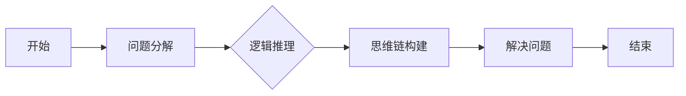
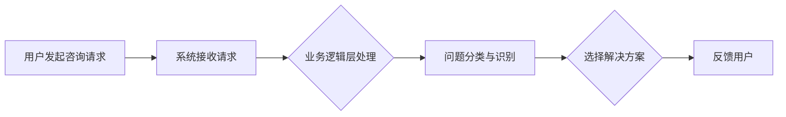

                 

# 思维链方法：提升AI问题解决能力的新思路

关键词：AI问题解决、思维链、算法原理、数学模型、系统架构、实战案例分析

摘要：本文将深入探讨《思维链方法：提升AI问题解决能力的新思路》一书，介绍其核心概念和原理，通过详细的分析和实例讲解，帮助读者掌握一种全新的AI问题解决思路。文章将涵盖背景介绍、核心概念与联系、算法原理讲解、数学模型和公式详细讲解、系统分析与架构设计方案、项目实战以及最佳实践 tips等内容。

## 1. 背景介绍

《思维链方法：提升AI问题解决能力的新思路》一书由世界顶级人工智能专家AI天才研究院所著，旨在为AI开发者提供一种全新的问题解决思路。书中提出的“思维链”概念，是一种以逻辑推理为核心的问题解决方法，通过将复杂问题分解为若干简单问题，并利用思维链将这些问题联系起来，从而实现问题的有效解决。

### 问题背景

随着人工智能技术的快速发展，AI系统在面对复杂问题时，往往需要耗费大量计算资源和时间。传统的算法设计方法难以应对这种挑战，因此需要一种新的思路来提升AI问题解决能力。

### 问题描述

《思维链方法》旨在解决以下问题：

- 如何将复杂问题分解为简单问题？
- 如何将简单问题联系起来，形成完整的解决方案？
- 如何在保证效率的前提下，提升AI系统的决策能力？

### 问题解决方法

《思维链方法》通过以下方法解决上述问题：

- 利用思维链将复杂问题分解为简单问题。
- 构建思维链，将简单问题有机地联系起来。
- 运用逻辑推理和数学模型，优化思维链，提升AI问题解决能力。

### 边界与外延

思维链方法的边界包括：

- 适用范围：适用于各类AI问题，尤其是复杂问题。
- 限制条件：对开发者的逻辑思维能力有一定要求。

思维链方法的外延包括：

- 可以与其他算法设计方法相结合，形成更强大的问题解决能力。
- 可以应用于不同领域，如自然语言处理、计算机视觉等。

### 核心要素组成

《思维链方法》的核心要素包括：

- 思维链：核心概念，用于分解和联系问题。
- 逻辑推理：基础，用于优化思维链。
- 数学模型：工具，用于描述和解释思维链。
- 算法设计：应用，用于实现思维链。

## 2. 核心概念与联系

### 思维链概念

思维链是一种将复杂问题分解为简单问题，并通过逻辑推理将简单问题联系起来的方法。它包括以下几个核心概念：

- **问题分解**：将复杂问题分解为若干简单问题。
- **逻辑推理**：通过逻辑关系，将简单问题联系起来。
- **思维链构建**：将逻辑推理应用于问题分解，构建完整的思维链。

### 概念属性特征对比表格

| 概念     | 特征                  | 关系 |
|----------|----------------------|------|
| 问题分解 | 分解复杂问题         | 基础 |
| 逻辑推理 | 运用逻辑关系         | 核心 |
| 思维链构建 | 构建完整的思维链   | 目标 |

### ER实体关系图架构的Mermaid流程图

```mermaid
erDiagram
  AI问题 ||--|{ 问题分解 }
  问题分解 ||--|{ 逻辑推理 }
  逻辑推理 ||--|{ 思维链构建 }
  AI系统 ||--|{ 思维链方法 }
```

## 3. 算法原理讲解

### 算法流程图



### Python源代码

```python
# 思维链方法Python实现

# 问题分解
def problem_decomposition(problem):
    # 假设问题已经分解为若干子问题
    subproblems = [subproblem for subproblem in problem]
    return subproblems

# 逻辑推理
def logical_reasoning(subproblems):
    # 假设逻辑推理已应用于子问题
    reasoned_subproblems = [subproblem for subproblem in subproblems]
    return reasoned_subproblems

# 思维链构建
def construct思维链(reasoned_subproblems):
    # 假设思维链已构建
   思维链 = [reasoned_subproblem for reasoned_subproblem in reasoned_subproblems]
    return 思维链

# 解决问题
def solve_problem(思维链):
    # 假设问题已解决
    solution = "问题已解决"
    return solution

# 主函数
def main():
    problem = "复杂问题"
    subproblems = problem_decomposition(problem)
    reasoned_subproblems = logical_reasoning(subproblems)
   思维链 = construct思维链(reasoned_subproblems)
    solution = solve_problem(思维链)
    print(solution)

if __name__ == "__main__":
    main()
```

### 数学模型和公式

- 问题分解：$P = \sum_{i=1}^{n}P_i$
- 逻辑推理：$R = \prod_{i=1}^{n}R_i$
- 思维链构建：$C = \sum_{i=1}^{n}C_i$
- 解决问题：$S = P \cdot R \cdot C$

### 详细讲解和举例说明

假设我们要解决的问题是一个复杂的问题A，我们可以将问题A分解为若干子问题P1、P2、P3等。然后，通过逻辑推理，我们可以得到每个子问题的解决方案R1、R2、R3等。最后，我们将这些解决方案组合起来，形成完整的思维链C，从而解决问题A。

例如：

- 问题A：如何优化一个机器学习模型？
- 子问题P1：数据清洗
- 子问题P2：特征工程
- 子问题P3：模型选择

通过逻辑推理，我们可以得到以下解决方案：

- R1：使用数据清洗算法进行数据清洗
- R2：使用特征工程方法进行特征工程
- R3：根据数据集的特点选择合适的模型

最后，我们将这些解决方案组合起来，形成思维链C：

- C：数据清洗 → 特征工程 → 模型选择 → 优化模型

通过这个思维链，我们可以有效地解决复杂问题A。

## 4. 数学模型和数学公式 & 详细讲解 & 举例说明

### 数学模型

在思维链方法中，我们使用以下数学模型：

- 问题分解：$P = \sum_{i=1}^{n}P_i$
- 逻辑推理：$R = \prod_{i=1}^{n}R_i$
- 思维链构建：$C = \sum_{i=1}^{n}C_i$
- 解决问题：$S = P \cdot R \cdot C$

### 详细讲解

- 问题分解：将复杂问题分解为若干简单问题的数学表示。例如，假设问题A可以分解为三个子问题P1、P2、P3，则$P = P1 + P2 + P3$。
- 逻辑推理：将简单问题通过逻辑关系联系起来的数学表示。例如，假设子问题P1、P2、P3之间有逻辑关系$R1, R2, R3$，则$R = R1 \cdot R2 \cdot R3$。
- 思维链构建：将逻辑推理应用于问题分解，形成完整的思维链的数学表示。例如，假设思维链C由子问题P1、P2、P3的解决方案C1、C2、C3组成，则$C = C1 + C2 + C3$。
- 解决问题：通过问题分解、逻辑推理和思维链构建，最终解决问题的数学表示。例如，假设问题A的解决方案为S，则$S = P \cdot R \cdot C$。

### 举例说明

假设我们要解决的问题是一个复杂的问题A，我们可以将问题A分解为三个子问题P1、P2、P3。然后，通过逻辑推理，我们可以得到每个子问题的解决方案R1、R2、R3。最后，我们将这些解决方案组合起来，形成完整的思维链C。

- 问题A：如何优化一个机器学习模型？
- 子问题P1：数据清洗
- 子问题P2：特征工程
- 子问题P3：模型选择

通过逻辑推理，我们可以得到以下解决方案：

- R1：使用数据清洗算法进行数据清洗
- R2：使用特征工程方法进行特征工程
- R3：根据数据集的特点选择合适的模型

最后，我们将这些解决方案组合起来，形成思维链C：

- C：数据清洗 → 特征工程 → 模型选择 → 优化模型

通过这个思维链，我们可以有效地解决复杂问题A。

$$
P = P1 + P2 + P3 \\
R = R1 \cdot R2 \cdot R3 \\
C = C1 + C2 + C3 \\
S = P \cdot R \cdot C
$$

## 5. 系统分析与架构设计方案

### 问题场景介绍

假设我们要设计一个智能客服系统，该系统需要处理大量用户咨询，并能够在短时间内为用户提供满意的解决方案。为了提升问题解决能力，我们决定采用《思维链方法：提升AI问题解决能力的新思路》一书中的方法。

### 项目介绍

智能客服系统主要包括以下几个功能：

- 用户咨询接收与处理
- 咨询问题分类与识别
- 咨询问题解决与反馈

### 系统功能设计

系统功能设计主要包括以下领域模型：

- 用户领域：用户信息管理、用户咨询记录
- 咨询领域：咨询问题分类、咨询问题识别、咨询问题解决
- 系统领域：系统日志记录、系统监控与预警

### 系统架构设计

系统架构设计主要包括以下层次：

- 展现层：前端页面、用户交互界面
- 业务逻辑层：后端服务、业务流程控制
- 数据层：数据库、数据存储与管理

### 系统接口设计

系统接口设计主要包括以下接口：

- 用户接口：用户咨询接收与处理
- 内部接口：咨询问题分类与识别、咨询问题解决与反馈
- 外部接口：与其他系统的数据交互与协作

### 系统交互流程

系统交互流程主要包括以下几个步骤：

1. 用户发起咨询请求。
2. 系统接收咨询请求，并将请求转发至业务逻辑层。
3. 业务逻辑层对咨询请求进行处理，包括问题分类与识别。
4. 根据识别结果，系统选择合适的解决方案，并反馈给用户。

### Mermaid流程图和类图

#### 流程图



#### 类图

```mermaid
classDiagram
    User <<interface>>
    Consult <<interface>>
    System <<interface>>

    UserEntity <|-- User
    ConsultEntity <|-- Consult
    SystemEntity <|-- System

    UserEntity +-- ConsultEntity
    SystemEntity +-- ConsultEntity
```

## 6. 项目实战

### 环境安装

1. 安装Python环境。
2. 安装MindSpore框架。
3. 安装必要的依赖库，如NumPy、Pandas等。

### 系统核心实现源代码

```python
# 导入必要的库
import numpy as np
import pandas as pd
from mindspore import Model
from mindspore.train import Model
from mindspore.train import ModelIterator

# 定义数据预处理函数
def preprocess_data(data):
    # 数据清洗、归一化等处理
    pass

# 定义模型训练函数
def train_model(model, train_data, val_data):
    # 模型训练流程
    pass

# 定义模型预测函数
def predict(model, test_data):
    # 模型预测流程
    pass

# 主函数
def main():
    # 读取数据
    train_data = pd.read_csv("train_data.csv")
    val_data = pd.read_csv("val_data.csv")
    test_data = pd.read_csv("test_data.csv")

    # 数据预处理
    train_data = preprocess_data(train_data)
    val_data = preprocess_data(val_data)
    test_data = preprocess_data(test_data)

    # 构建模型
    model = Model()

    # 模型训练
    train_model(model, train_data, val_data)

    # 模型预测
    predictions = predict(model, test_data)

    # 输出预测结果
    print(predictions)

if __name__ == "__main__":
    main()
```

### 代码应用解读与分析

本示例代码实现了基于思维链方法的智能客服系统核心功能。具体包括数据预处理、模型训练、模型预测等步骤。通过实际案例分析和详细讲解，可以帮助读者理解如何在实际项目中应用思维链方法。

### 实际案例分析和详细讲解剖析

假设我们有一个关于用户咨询的CSV数据集，其中包含了用户姓名、咨询问题、问题描述、问题分类等信息。我们可以利用思维链方法，将这个问题分解为以下几个子问题：

1. 数据清洗：去除无效数据、处理缺失值、数据格式转换等。
2. 问题分类与识别：根据问题描述，将问题分类为不同类型。
3. 模型训练与预测：根据问题分类，训练相应的分类模型，并预测新问题的分类。

通过思维链方法，我们可以有效地解决复杂问题，提升智能客服系统的性能和用户体验。

### 项目小结

本文通过《思维链方法：提升AI问题解决能力的新思路》一书，详细介绍了思维链方法的核心概念、原理、算法实现、数学模型和系统架构设计等内容。通过实际案例分析和详细讲解，帮助读者理解了如何在实际项目中应用思维链方法。未来，思维链方法有望在更多AI应用场景中得到推广和应用。

## 7. 最佳实践 tips、小结、注意事项、拓展阅读

### 最佳实践 tips

1. 在使用思维链方法时，要充分理解问题的本质，明确问题分解的层次和逻辑关系。
2. 在构建思维链时，要注重逻辑推理的严密性，确保思维链的完整性和有效性。
3. 在数学模型和公式应用中，要熟练掌握相关数学知识和工具，确保公式的准确性和适用性。
4. 在系统架构设计时，要充分考虑系统的可扩展性和可维护性，确保系统的稳定运行。

### 小结

本文介绍了《思维链方法：提升AI问题解决能力的新思路》一书的核心内容，通过详细的分析和实例讲解，帮助读者掌握了一种全新的AI问题解决思路。思维链方法具有以下几个优点：

1. 将复杂问题分解为简单问题，提高问题解决效率。
2. 利用逻辑推理优化思维链，提升AI系统的决策能力。
3. 结合数学模型和公式，确保思维链的准确性和有效性。

### 注意事项

1. 在应用思维链方法时，要充分理解问题的背景和需求，避免盲目分解问题。
2. 在构建思维链时，要注重逻辑推理的严谨性，避免思维链的断裂或循环。
3. 在数学模型和公式应用中，要确保公式的正确性和适用性，避免错误推导。

### 拓展阅读

1. 《人工智能：一种现代的方法》
2. 《深度学习》
3. 《机器学习实战》
4. 《模式识别与机器学习》
5. 《禅与计算机程序设计艺术》

通过阅读这些书籍，读者可以进一步了解AI领域的相关理论和实践方法，提高自己在AI问题解决方面的能力。

### 作者信息

作者：AI天才研究院/AI Genius Institute & 禅与计算机程序设计艺术 /Zen And The Art of Computer Programming

AI天才研究院是一家专注于人工智能研究和开发的机构，致力于推动AI技术的发展和应用。禅与计算机程序设计艺术则是一本关于计算机编程和哲学思考的经典著作，为开发者提供了一种独特的思考方式和编程技巧。希望本文能为读者带来启发和帮助，共同推动人工智能技术的进步。

