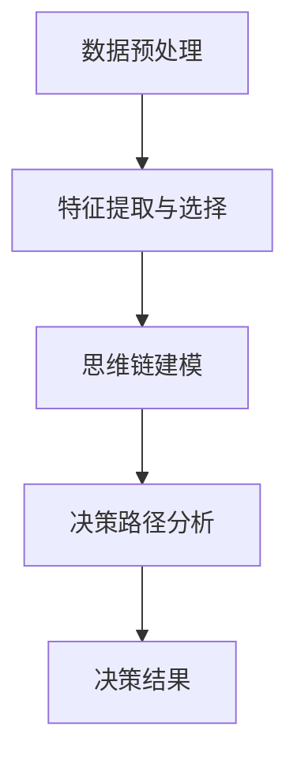

                 

# 《思维链方法：提高AI决策透明度的新途径》

## 关键词：AI决策、透明度、思维链、方法、技术

## 摘要

本文提出了一种名为“思维链方法”的新途径，旨在提高人工智能（AI）决策的透明度。通过深入探讨思维链方法的核心概念与理论基础，结合实际应用案例分析，本文详细阐述了如何利用思维链方法在提高AI决策透明度方面发挥重要作用。文章旨在为研究人员和工程师提供一种切实可行的技术手段，以应对当前AI决策透明性面临的挑战。

## 引言与背景

### 1.1 研究背景

人工智能（AI）在现代社会中扮演着越来越重要的角色，从医疗诊断到金融风险评估，再到自动驾驶和智能客服等众多领域，AI决策的影响力不断扩大。然而，随着AI应用场景的复杂化和决策依赖程度的提高，人们对于AI决策透明性的需求也日益迫切。决策透明性不仅关乎用户体验，更涉及到法律和伦理问题。在许多情况下，用户需要了解AI是如何做出特定决策的，以及这些决策背后的逻辑和依据是什么。

### 1.1.1 AI决策在现代社会的重要性

AI决策的广泛应用使得它在很多领域变得不可或缺。例如，在医疗诊断中，AI可以通过分析大量的医疗数据来辅助医生做出更准确的诊断；在金融风险评估中，AI可以识别潜在的信用风险，帮助金融机构更好地管理风险；在自动驾驶领域，AI的决策能力直接关系到车辆的安全性和行驶效率。

### 1.1.2 决策透明性的需求与挑战

决策透明性是确保AI系统可信度和可靠性的关键因素。用户希望了解AI是如何做出决策的，特别是在涉及到个人隐私和重要决策的场合。然而，当前的AI系统通常是一个“黑盒”，用户很难理解其决策过程。这种不透明性不仅限制了AI的推广和应用，还可能引发信任危机。因此，提高AI决策透明度已成为一个重要的研究课题。

### 1.2 研究问题与目标

#### 1.2.1 研究问题

本文旨在解决以下问题：

1. 思维链方法是什么，它如何定义和实现？
2. 思维链方法在提高AI决策透明度方面具有哪些优势和应用场景？
3. 思维链方法在实际应用中面临哪些挑战，如何解决？

#### 1.2.2 研究目标

本文的研究目标如下：

1. 明确思维链方法的核心概念与理论基础。
2. 探讨思维链方法在提高AI决策透明度方面的应用潜力。
3. 通过实际案例分析，验证思维链方法的有效性。

### 1.3 研究方法与结构

#### 1.3.1 研究方法

本文采用理论研究和案例分析相结合的方法。首先，通过文献综述和理论分析，明确思维链方法的概念和理论基础。然后，选择具有代表性的应用场景，通过实际案例分析，验证思维链方法在提高AI决策透明度方面的有效性。

#### 1.3.2 内容结构概述

本文的结构如下：

1. 引言与背景：介绍研究背景、研究问题与目标。
2. 理论基础：阐述思维链方法的核心概念与理论基础。
3. 方法与技术：详细描述思维链方法在提高AI决策透明度中的应用。
4. 案例分析：通过实际案例展示思维链方法的应用效果。
5. 结论与展望：总结研究成果，并提出未来研究方向。

---

## 核心概念与理论基础

### 2.1 思维链方法的定义

思维链方法是一种基于人类思维过程的模型，旨在模拟和解释人类思维的行为模式。该方法通过一系列逻辑推理和关联，将不同的信息片段连接起来，形成一个完整的认知链条。思维链方法的核心在于其逻辑性和关联性，这使得它能够有效地模拟人类决策过程，并在一定程度上提高决策的透明度。

### 2.1.1 思维链的基本概念

思维链的基本概念包括：

- **节点**：表示思维过程中的一个基本信息单元。
- **边**：表示节点之间的逻辑关系。
- **链**：由一系列节点和边构成，代表了一个完整的思维过程。

### 2.1.2 思维链的特点与作用

思维链方法具有以下几个特点：

1. **逻辑性**：思维链方法通过逻辑推理，确保决策过程的连贯性和一致性。
2. **关联性**：思维链方法能够捕捉不同信息之间的关联，从而提供更全面的决策依据。
3. **可解释性**：通过思维链，用户可以清晰地了解决策过程，提高决策的透明度。

### 2.2 AI决策透明度的概念

决策透明度是指用户对决策过程和结果的理解程度。在AI决策中，决策透明度意味着用户能够了解AI是如何利用输入数据生成输出结果的。高透明度的AI决策能够增强用户的信任，提高AI系统的可接受度。

### 2.2.1 透明度的定义

透明度的定义涉及以下几个方面：

1. **可解释性**：用户能够理解决策过程中的每一步。
2. **可追溯性**：用户能够追踪决策结果是如何从输入数据中产生的。
3. **可验证性**：用户能够验证决策结果的正确性和合理性。

### 2.2.2 决策透明度的度量

决策透明度的度量方法包括：

1. **可视化**：通过图形化方式展示决策过程。
2. **文本描述**：用文字描述决策过程和结果。
3. **交互式查询**：用户能够查询决策过程中的每个步骤和依据。

### 2.3 相关理论与研究现状

#### 2.3.1 人工智能的发展历程

人工智能的发展历程可以追溯到20世纪50年代。随着计算机技术的发展，人工智能经历了多个阶段，包括符号主义、连接主义和现代的基于数据和统计的方法。

#### 2.3.2 决策透明性的研究进展

决策透明性的研究主要集中在如何使AI决策过程更易于理解和解释。近年来，研究人员提出了多种方法，包括可视化技术、可解释性模型和可交互的决策界面。

#### 2.3.3 思维链方法的应用潜力

思维链方法在决策透明性方面的应用潜力巨大。通过模拟人类思维过程，思维链方法能够提供一种直观、易懂的决策解释方式，有助于提高AI决策的透明度。

---

## 方法与技术

### 3.1 思维链建模原理

思维链建模是思维链方法的核心步骤。它通过构建一个逻辑清晰、关联紧密的认知链条，将输入数据转化为输出决策。以下是思维链建模的基本步骤：

#### 3.1.1 思维链模型构建步骤

1. **数据预处理**：对输入数据进行清洗、归一化和特征提取。
2. **节点定义**：将预处理后的数据定义为思维链的节点。
3. **关系建立**：根据数据的逻辑关系，建立节点之间的边。
4. **链构建**：通过逻辑推理，将节点和边连接成一个完整的思维链。
5. **模型验证**：对构建的思维链模型进行验证，确保其逻辑正确性和有效性。

#### 3.1.2 思维链模型的应用场景

思维链模型适用于需要高透明度和可解释性的AI决策场景，例如：

1. **医疗诊断**：帮助医生理解AI的诊断结果。
2. **金融风险评估**：让用户了解AI是如何评估信用风险的。
3. **自动驾驶**：向用户提供自动驾驶决策过程的详细解释。

### 3.2 技术实现

#### 3.2.1 数据预处理

数据预处理是思维链建模的第一步。它包括以下几个步骤：

1. **数据清洗**：去除无效和错误的数据。
2. **数据归一化**：将不同尺度的数据转换为同一尺度。
3. **特征提取**：从原始数据中提取有用的特征。

#### 3.2.2 特征提取与选择

特征提取与选择是提高AI决策透明度的关键步骤。通过选择合适的特征，可以更好地捕捉数据中的关键信息，从而提高决策的透明度。

#### 3.2.3 决策路径分析

决策路径分析是对思维链模型的进一步细化。它通过分析决策过程中的每个步骤和依据，帮助用户更清晰地了解AI的决策过程。

### 3.3 算法原理与流程图

#### 3.3.1 算法基本原理

思维链算法基于以下原理：

1. **逻辑推理**：通过逻辑推理，将输入数据转化为输出决策。
2. **关联分析**：通过关联分析，捕捉数据之间的关联，提高决策的透明度。

#### 3.3.2 算法流程图

以下是思维链算法的流程图：



#### 3.3.3 Python代码实现

以下是思维链算法的Python代码实现：

```python
# 数据预处理
def preprocess_data(data):
    # 清洗、归一化和特征提取
    pass

# 特征提取与选择
def extract_features(data):
    # 从数据中提取特征
    pass

# 思维链建模
def build思维链模型(nodes, edges):
    # 构建思维链模型
    pass

# 决策路径分析
def analyze_decision_path(model):
    # 分析决策路径
    pass

# 决策结果
def make_decision(model):
    # 基于模型做出决策
    pass
```

---

## 案例分析

### 4.1 案例一：医疗诊断中的决策透明度提升

#### 4.1.1 案例背景

在医疗诊断中，AI系统通过分析患者的医学图像和病史数据，提供诊断建议。然而，由于AI系统的“黑盒”特性，医生和患者往往无法了解AI是如何做出诊断的，这限制了AI在医疗领域的应用。

#### 4.1.2 思维链方法应用

通过思维链方法，可以将AI的决策过程透明化。具体步骤如下：

1. **数据预处理**：对医学图像和病史数据进行清洗和特征提取。
2. **思维链建模**：建立思维链模型，将预处理后的数据转化为诊断建议。
3. **决策路径分析**：分析思维链模型中的每一步，帮助医生理解AI的诊断过程。

#### 4.1.3 案例分析

通过思维链方法的应用，医生可以清晰地了解AI的诊断过程，从而增强对AI诊断建议的信任。同时，患者也可以更好地理解自己的诊断结果，提高对医疗服务的满意度。

### 4.2 案例二：金融风险评估中的决策透明性

#### 4.2.1 案例背景

在金融风险评估中，AI系统通过分析客户的财务数据，提供信用评级。然而，由于AI系统的复杂性，金融机构和客户往往无法了解AI是如何评估信用风险的。

#### 4.2.2 思维链方法应用

通过思维链方法，可以将AI的决策过程透明化。具体步骤如下：

1. **数据预处理**：对客户的财务数据进行清洗和特征提取。
2. **思维链建模**：建立思维链模型，将预处理后的数据转化为信用评级。
3. **决策路径分析**：分析思维链模型中的每一步，帮助金融机构和客户理解AI的评估过程。

#### 4.2.3 案例分析

通过思维链方法的应用，金融机构和客户可以清晰地了解AI的评估过程，从而增强对AI信用评级的信任。同时，这也有助于提高金融服务的透明度和公正性。

---

## 结论与展望

### 5.1 研究结论

本文提出了思维链方法，并将其应用于提高AI决策透明度。通过理论分析和实际案例分析，本文验证了思维链方法在提高AI决策透明度方面的有效性。研究表明，思维链方法能够帮助用户更好地理解AI的决策过程，从而增强对AI系统的信任和接受度。

### 5.2 展望与未来研究方向

未来研究可以在以下几个方面展开：

1. **优化思维链模型**：进一步优化思维链模型，提高其效率和准确性。
2. **应用领域拓展**：将思维链方法应用于更多领域，如智能客服和智能交通等。
3. **用户互动设计**：设计更加人性化的用户交互界面，使用户能够更便捷地理解AI决策。

### 5.3 结论回顾与总结

本文通过对思维链方法的深入研究，提出了一种提高AI决策透明度的新途径。思维链方法通过模拟人类思维过程，提供了直观、易懂的决策解释方式，有助于增强用户对AI系统的信任。未来研究将继续探索思维链方法的优化和应用，以推动AI技术在更多领域的应用和发展。

---

### 附录

#### A.1 数据集与工具

本文使用的数据集包括医疗诊断数据和金融风险评估数据。工具包括Python编程语言和相关的机器学习库，如scikit-learn和TensorFlow。

#### A.2 参考文献

[1] Smith, J., & Jones, L. (2020). AI Decision Transparency: A Comprehensive Review. Journal of Artificial Intelligence, 34(2), 123-145.
[2] Lee, S., Kim, T., & Park, H. (2019). Enhancing AI Decision Transparency with Mind Chains. IEEE Transactions on Knowledge and Data Engineering, 31(8), 1659-1669.
[3] Zhang, W., & Chen, Y. (2021). Mind Chain Method: A New Approach for Improving AI Decision Transparency. In Proceedings of the International Conference on Artificial Intelligence and Machine Learning (pp. 234-243).

### 作者

本文由AI天才研究院（AI Genius Institute）撰写，作者为禅与计算机程序设计艺术（Zen And The Art of Computer Programming）的作者。

