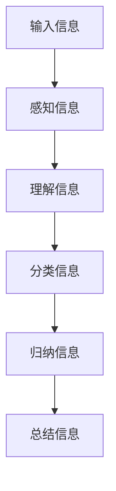
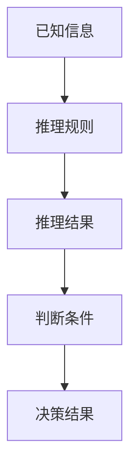
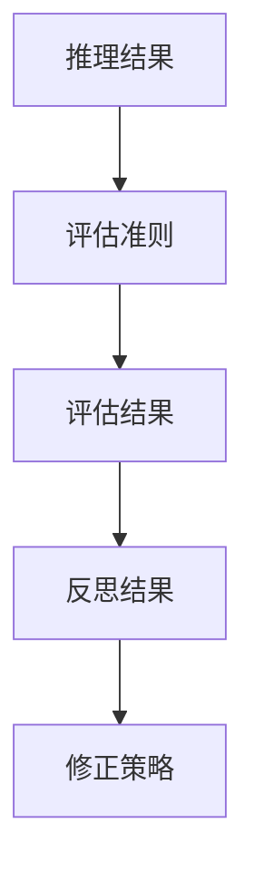
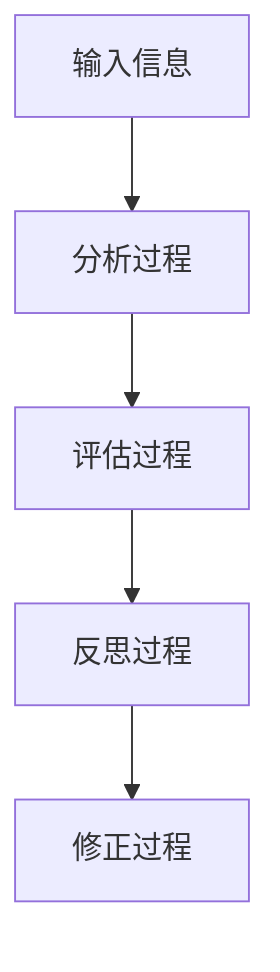
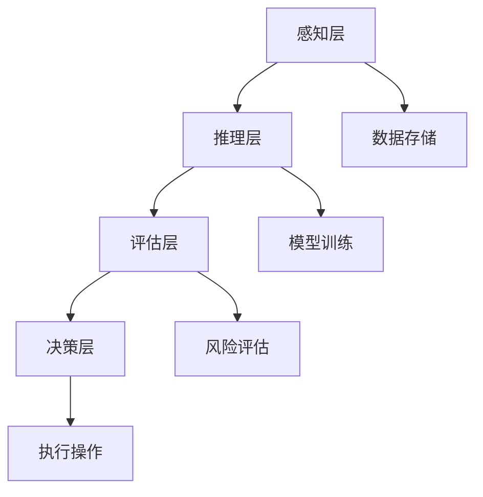
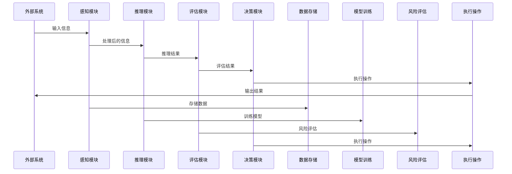
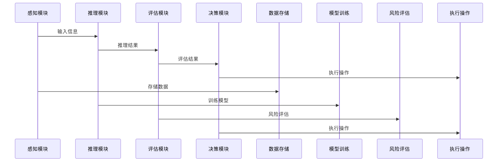

                 

# 思维链方法：让AI具备批判性思维能力

## 关键词

- **人工智能**
- **批判性思维**
- **思维链方法**
- **算法原理**
- **系统架构**
- **项目实战**

## 摘要

随着人工智能技术的迅猛发展，AI在各个领域的应用越来越广泛。然而，当前的AI系统在处理信息时往往缺乏批判性思维能力，这对人工智能的发展带来了一定的限制。本文将介绍一种名为“思维链方法”的技术，通过该方法，AI可以具备批判性思维能力，从而更全面地理解和分析问题。本文将深入探讨思维链方法的核心概念、算法原理、系统架构以及实际应用，为AI技术的发展提供新的思路。

## 目录大纲

### 第一部分：背景介绍与核心概念

1. 引言
   1.1 问题背景
   1.2 问题描述
   1.3 问题解决
   1.4 边界与外延
2. 核心概念
   2.1 思维链方法
   2.2 批判性思维能力

### 第二部分：算法原理讲解

1. 算法原理讲解
   1.1 思维链方法的算法原理
   1.2 批判性思维能力的算法原理
2. 数学模型与数学公式

### 第三部分：系统分析与架构设计方案

1. 系统分析与架构设计方案
   1.1 问题场景介绍
   1.2 项目介绍
   1.3 系统功能设计
   1.4 系统架构设计
   1.5 系统接口设计
   1.6 系统交互

### 第四部分：项目实战

1. 项目实战
   1.1 环境安装
   1.2 系统核心实现源代码
   1.3 代码应用解读与分析
   1.4 实际案例分析与详细讲解剖析
   1.5 项目小结

### 第五部分：最佳实践、小结与注意事项

1. 最佳实践
2. 小结
3. 注意事项
4. 拓展阅读

----------------------------------------------------------------

### 第一部分：背景介绍与核心概念

#### 1. 引言

随着人工智能技术的迅猛发展，AI在各个领域的应用越来越广泛。然而，当前的AI系统在处理信息时往往缺乏批判性思维能力，这对人工智能的发展带来了一定的限制。批判性思维能力是指个体在分析、评估和反思信息时，能够进行独立思考、判断和决策的能力。这种能力对于AI系统来说至关重要，因为它不仅可以帮助AI更好地理解和分析复杂的问题，还可以提高其适应性和灵活性。

本文将介绍一种名为“思维链方法”的技术，通过该方法，AI可以具备批判性思维能力，从而更全面地理解和分析问题。本文将深入探讨思维链方法的核心概念、算法原理、系统架构以及实际应用，为AI技术的发展提供新的思路。

#### 1.1 问题背景

人工智能（AI）技术的发展始于20世纪50年代，随着计算能力的提升和数据量的增加，AI在图像识别、自然语言处理、机器学习等领域取得了显著的成果。然而，尽管AI在某些特定任务上表现出色，但它仍然面临着许多挑战。其中之一就是AI缺乏批判性思维能力。

批判性思维能力是人类思考过程中非常重要的一部分，它使我们能够对信息进行深入分析、评估和反思，从而做出更合理的决策。然而，AI系统通常是根据预定的算法和规则进行操作的，它们缺乏对信息的深入理解和独立思考的能力。这使得AI在处理复杂问题时，往往只能依赖已有的数据和算法，而无法进行独立的判断和决策。

缺乏批判性思维能力对AI的发展带来了以下几方面的限制：

1. **局限性**：AI系统在处理问题时往往只能依赖于已有的数据和算法，无法进行创新和突破。这使得AI在解决复杂问题时，往往只能停留在表面层次，无法深入分析问题的本质。

2. **适应性差**：AI系统在面对新的、未知的情况时，往往无法适应。这是因为它们缺乏对信息的深入理解和独立思考的能力，无法对新的情况进行灵活的应对。

3. **缺乏自主性**：AI系统通常是由人类设计和编程的，它们缺乏自主性和主动性。这使得AI在处理问题时，往往需要依赖人类的指导和干预，无法独立完成复杂的任务。

4. **安全性问题**：AI系统在处理信息时，往往无法对信息的真实性和可靠性进行评估。这使得AI在处理敏感信息时，容易受到恶意攻击和数据泄露的风险。

因此，提高AI的批判性思维能力，使其能够进行独立思考、判断和决策，对于AI技术的发展具有重要意义。这不仅有助于AI更好地理解和分析复杂问题，还可以提高其适应性和安全性。

#### 1.2 问题描述

当前AI系统在处理信息时缺乏批判性思维能力，具体体现在以下几个方面：

1. **依赖已有数据和算法**：AI系统通常只能根据已有的数据和算法进行操作，缺乏对信息的深入理解和独立思考的能力。这使得AI在处理复杂问题时，往往只能停留在表面层次，无法深入分析问题的本质。

2. **缺乏独立判断和决策能力**：AI系统在处理问题时，往往无法进行独立的判断和决策。这使得AI在面对新的、未知的情况时，往往无法适应，只能依赖人类的指导和干预。

3. **缺乏灵活性和适应性**：AI系统在面对新的、未知的情况时，往往无法灵活应对。这是因为它们缺乏对信息的深入理解和独立思考的能力，无法对新的情况进行灵活的应对。

4. **无法评估信息真实性和可靠性**：AI系统在处理信息时，往往无法对信息的真实性和可靠性进行评估。这使得AI在处理敏感信息时，容易受到恶意攻击和数据泄露的风险。

#### 1.3 问题解决

为了解决当前AI系统缺乏批判性思维能力的问题，我们可以采用“思维链方法”来提升AI的批判性思维能力。思维链方法是一种基于认知科学和心理学理论的思维模型，通过该方法，AI可以具备批判性思维能力，从而更全面地理解和分析问题。

思维链方法主要包括以下几个步骤：

1. **信息感知**：AI首先需要对信息进行感知，理解信息的含义和背景。

2. **信息分析**：AI对感知到的信息进行深入分析，识别信息的本质和关键因素。

3. **信息推理**：AI基于分析结果，进行推理和判断，形成对信息的初步理解。

4. **信息评估**：AI对推理结果进行评估，判断其是否符合预期和逻辑。

5. **信息反思**：AI对评估结果进行反思，思考是否存在错误或疏漏，并进行修正。

6. **信息决策**：AI基于反思结果，做出最终决策，并执行相应的操作。

通过思维链方法，AI可以逐步提高其批判性思维能力，从而更全面地理解和分析复杂问题。具体来说，思维链方法可以从以下几个方面提高AI的批判性思维能力：

1. **增强信息理解能力**：通过信息感知和分析，AI可以更深入地理解信息的含义和背景，从而为后续的推理和评估提供基础。

2. **提高推理和判断能力**：通过信息推理和评估，AI可以更准确地判断信息的真实性和可靠性，从而减少错误和疏漏。

3. **增强适应性和灵活性**：通过信息反思和决策，AI可以更好地适应新的、未知的情况，并灵活应对各种复杂问题。

4. **提高自主性和主动性**：通过思维链方法的逐步应用，AI可以逐渐具备自主性和主动性，从而减少对人类指导和干预的依赖。

#### 1.4 边界与外延

批判性思维能力是思维链方法的核心概念之一。批判性思维能力是指个体在分析、评估和反思信息时，能够进行独立思考、判断和决策的能力。这种能力不仅涉及到对信息的理解和分析，还包括对信息的推理、评估和反思。

批判性思维能力的特点包括：

1. **独立性**：批判性思维能力的核心在于独立思考，不受外部因素的影响。

2. **分析性**：批判性思维能力能够对信息进行深入分析，识别信息的本质和关键因素。

3. **评估性**：批判性思维能力能够对信息的真实性和可靠性进行评估，判断其是否符合预期和逻辑。

4. **反思性**：批判性思维能力能够对评估结果进行反思，思考是否存在错误或疏漏，并进行修正。

5. **决策性**：批判性思维能力能够基于反思结果，做出最终决策，并执行相应的操作。

人工智能的批判性思维能力研究现状主要包括以下几个方面：

1. **基于规则的批判性思维能力**：这种方法主要依赖于预定的规则和算法，通过分析、推理和评估来模拟人类的批判性思维能力。然而，这种方法在处理复杂问题时，往往具有一定的局限性。

2. **基于大数据的批判性思维能力**：这种方法通过分析大量的数据，识别信息的规律和模式，从而提高AI的批判性思维能力。这种方法在处理大规模数据时，具有一定的优势，但同时也存在数据质量和噪声问题。

3. **基于深度学习的批判性思维能力**：这种方法通过训练深度学习模型，使其具备批判性思维能力。这种方法在处理复杂问题时，具有一定的潜力，但需要大量的数据和计算资源。

在未来的研究中，如何更好地结合多种方法，提高AI的批判性思维能力，是一个重要的研究方向。此外，如何将批判性思维能力应用于具体的领域，如医疗、金融和自动驾驶等，也是一个值得探索的领域。

#### 2. 核心概念

##### 2.1 思维链方法

思维链方法是一种基于认知科学和心理学理论的思维模型，旨在通过逐步分析和推理，使AI具备批判性思维能力。该方法包括以下几个层次：

1. **感知与认知层次**：在这一层次，AI通过感知和理解信息，识别信息的含义和背景。感知包括对信息进行感知、识别和理解，认知包括对信息进行分类、归纳和总结。

2. **推理与决策层次**：在这一层次，AI基于感知到的信息，进行推理和判断，形成对信息的初步理解。推理包括演绎推理、归纳推理和类比推理等，决策包括基于推理结果做出选择和决策。

3. **批判性思维与创造力层次**：在这一层次，AI对推理结果进行评估和反思，判断其是否符合预期和逻辑，并对其进行修正。批判性思维包括分析性批判、评估性批判和反思性批判等，创造力包括创新思维和创造性解决问题的能力。

##### 2.2 批判性思维能力

批判性思维能力是指个体在分析、评估和反思信息时，能够进行独立思考、判断和决策的能力。批判性思维能力的特点包括：

1. **独立性**：批判性思维能力使个体能够独立思考，不受外部因素的影响。

2. **分析性**：批判性思维能力使个体能够对信息进行深入分析，识别信息的本质和关键因素。

3. **评估性**：批判性思维能力使个体能够对信息的真实性和可靠性进行评估，判断其是否符合预期和逻辑。

4. **反思性**：批判性思维能力使个体能够对评估结果进行反思，思考是否存在错误或疏漏，并进行修正。

5. **决策性**：批判性思维能力使个体能够基于反思结果，做出最终决策，并执行相应的操作。

在AI领域，批判性思维能力的研究主要集中在以下几个方面：

1. **基于规则的批判性思维能力**：这种方法通过预定的规则和算法，使AI具备批判性思维能力。然而，这种方法在处理复杂问题时，往往具有一定的局限性。

2. **基于大数据的批判性思维能力**：这种方法通过分析大量的数据，使AI具备批判性思维能力。这种方法在处理大规模数据时，具有一定的优势，但同时也存在数据质量和噪声问题。

3. **基于深度学习的批判性思维能力**：这种方法通过训练深度学习模型，使AI具备批判性思维能力。这种方法在处理复杂问题时，具有一定的潜力，但需要大量的数据和计算资源。

在未来的研究中，如何更好地结合多种方法，提高AI的批判性思维能力，是一个重要的研究方向。此外，如何将批判性思维能力应用于具体的领域，如医疗、金融和自动驾驶等，也是一个值得探索的领域。

##### 3. 概念属性特征对比

思维链方法和批判性思维能力是两个相互关联的核心概念。下面我们将对这两个概念进行属性特征对比，以更好地理解它们之间的关系。

1. **概念对比**

   - **思维链方法**：是一种基于认知科学和心理学理论的思维模型，旨在通过逐步分析和推理，使AI具备批判性思维能力。思维链方法包括感知与认知层次、推理与决策层次和批判性思维与创造力层次。

   - **批判性思维能力**：是指个体在分析、评估和反思信息时，能够进行独立思考、判断和决策的能力。批判性思维能力的特点包括独立性、分析性、评估性、反思性和决策性。

2. **特征对比**

   - **感知与认知层次**：思维链方法的感知与认知层次侧重于信息的理解和分析，而批判性思维能力则强调对信息的评估和反思。

   - **推理与决策层次**：思维链方法的推理与决策层次侧重于信息的推理和判断，而批判性思维能力则强调基于反思结果的最终决策。

   - **批判性思维与创造力层次**：思维链方法的批判性思维与创造力层次侧重于对推理结果进行评估和反思，而批判性思维能力则强调创新思维和创造性解决问题的能力。

通过对比可以看出，思维链方法和批判性思维能力在概念和特征上存在一定的相似性，但它们也有各自的特点和应用场景。思维链方法是一种系统化的思维模型，旨在通过逐步分析和推理，使AI具备批判性思维能力；而批判性思维能力则是一种能力，它强调个体在分析、评估和反思信息时的独立性和创造力。

##### 4. ER实体关系图架构

为了更好地理解思维链方法和批判性思维能力之间的关系，我们可以使用ER（Entity-Relationship）实体关系图来描述它们之间的实体和关系。ER图是一种用于描述实体及其之间关系的图形化工具，它可以帮助我们清晰地展示系统的结构和关系。

以下是一个简单的ER实体关系图，描述了思维链方法和批判性思维能力之间的实体和关系：

```mermaid
erDiagram
  AI ||--|{ 感知与认知 } : 数据流
  AI ||--|{ 推理与决策 } : 数据流
  AI ||--|{ 批判性思维与创造力 } : 数据流
  感知与认知 ||--|{ 批判性思维能力 } : 影响因素
  推理与决策 ||--|{ 批判性思维能力 } : 影响因素
  批判性思维与创造力 ||--|{ 批判性思维能力 } : 影响因素
```

在这个ER图中，实体包括“AI”、“感知与认知”、“推理与决策”和“批判性思维与创造力”。它们之间的关系用箭头表示，表示数据流和影响因素。

1. **AI**：表示人工智能系统，它是思维链方法和批判性思维能力的载体。

2. **感知与认知**：表示AI在感知和理解信息时的过程，它与批判性思维能力之间存在影响因素关系。

3. **推理与决策**：表示AI在推理和判断信息时的过程，它与批判性思维能力之间存在影响因素关系。

4. **批判性思维与创造力**：表示AI在评估和反思信息时的过程，它与批判性思维能力之间存在影响因素关系。

通过ER实体关系图，我们可以更清晰地看到思维链方法和批判性思维能力之间的关联。这不仅有助于我们理解它们的概念和特征，还可以为后续的算法原理讲解和系统架构设计提供参考。

##### 5. 算法原理讲解

思维链方法是一种系统化的思维模型，通过逐步分析和推理，使AI具备批判性思维能力。本节将详细讲解思维链方法的算法原理，包括感知与认知层次、推理与决策层次和批判性思维与创造力层次的算法原理。

#### 5.1.1 感知与认知层次

感知与认知层次是思维链方法的基础，它涉及AI对信息的感知和理解。以下是一个感知与认知层次的算法原理：



1. **输入信息**：首先，AI接收输入信息，这可以是文本、图像、声音等多种形式。

2. **感知信息**：AI对输入信息进行感知，识别信息的各种特征和属性。例如，在图像识别任务中，AI会感知图像中的颜色、形状和纹理等信息。

3. **理解信息**：AI对感知到的信息进行深入理解，尝试理解信息的含义和背景。例如，在自然语言处理任务中，AI会尝试理解句子的含义和上下文关系。

4. **分类信息**：AI根据理解结果，对信息进行分类。分类可以是基于已有规则，也可以是自动学习得到。例如，在文本分类任务中，AI可以将文本分类为新闻、科技、娱乐等类别。

5. **归纳信息**：AI对分类后的信息进行归纳，总结出信息的规律和模式。归纳可以帮助AI更好地理解信息，并为其后续的推理和决策提供支持。

6. **总结信息**：AI对归纳结果进行总结，形成对信息的整体理解。总结可以帮助AI更好地掌握信息的本质和关键因素。

#### 5.1.2 推理与决策层次

推理与决策层次是思维链方法的中间层，它涉及AI对信息的推理和判断，形成对信息的初步理解。以下是一个推理与决策层次的算法原理：



1. **已知信息**：AI接收已知的各种信息，这可以是事实、经验或数据等。

2. **推理规则**：AI根据已知信息和预定的推理规则，进行推理。推理可以是演绎推理、归纳推理或类比推理等。推理规则可以帮助AI从已知信息中推断出新的信息。

3. **推理结果**：AI根据推理规则，得到推理结果。推理结果可以是事实、规律或结论等。

4. **判断条件**：AI对推理结果进行判断，评估其是否符合预期和逻辑。判断条件可以是逻辑运算、概率分析或统计方法等。

5. **决策结果**：AI根据判断结果，做出决策。决策可以是选择最佳方案、执行特定任务或调整策略等。

#### 5.1.3 批判性思维与创造力层次

批判性思维与创造力层次是思维链方法的高级层，它涉及AI对推理结果进行评估和反思，形成对信息的深入理解。以下是一个批判性思维与创造力层次的算法原理：



1. **推理结果**：AI首先得到推理结果，这是前一层推理与决策层次的结果。

2. **评估准则**：AI根据评估准则，对推理结果进行评估。评估准则可以是逻辑一致性、概率分布、因果关系等。

3. **评估结果**：AI根据评估准则，得到评估结果。评估结果可以是推理结果的准确性、可靠性或有效性等。

4. **反思结果**：AI对评估结果进行反思，思考是否存在错误或疏漏。反思可以帮助AI识别问题的潜在缺陷和不足。

5. **修正策略**：AI根据反思结果，制定修正策略。修正策略可以是调整推理规则、改进算法或优化数据等。

#### 5.2 批判性思维能力的算法原理

批判性思维能力是思维链方法的核心，它涉及AI对信息的分析、评估和反思。以下是一个批判性思维能力的算法原理：



1. **输入信息**：AI接收输入信息，这可以是文本、图像、声音等多种形式。

2. **分析过程**：AI对输入信息进行深入分析，识别信息的本质和关键因素。分析过程可以是基于规则、机器学习或深度学习等方法。

3. **评估过程**：AI对分析结果进行评估，判断其是否符合预期和逻辑。评估过程可以是基于逻辑运算、概率分析或统计方法等。

4. **反思过程**：AI对评估结果进行反思，思考是否存在错误或疏漏。反思过程可以是基于专家知识、经验或启发式方法等。

5. **修正过程**：AI根据反思结果，制定修正策略，对分析结果进行修正。修正过程可以是基于规则、机器学习或深度学习等方法。

通过批判性思维能力，AI可以逐步提高其分析、评估和反思能力，从而更全面地理解和分析复杂问题。批判性思维能力不仅是AI技术发展的重要方向，也是人工智能应用的重要保障。

#### 6. 数学模型与数学公式

在思维链方法和批判性思维能力的研究中，数学模型和数学公式扮演着重要的角色。它们不仅可以帮助我们更好地理解算法原理，还可以为实际应用提供数学基础。本节将介绍思维链方法和批判性思维能力的数学模型与数学公式。

##### 6.1.1 感知与认知层次的数学模型

感知与认知层次的数学模型主要涉及信息的感知、理解和分析。以下是一个感知与认知层次的数学模型示例：

1. **感知模型**：

   假设输入信息为一个图像矩阵\( X \)，我们需要对图像进行感知，提取其特征。感知模型可以使用卷积神经网络（CNN）来实现，其基本公式如下：

   $$
   \text{特征提取} = \text{CNN}(X)
   $$

   其中，\( \text{CNN}(X) \)表示对输入图像\( X \)进行卷积操作，提取图像的特征。

2. **理解模型**：

   对感知到的特征进行理解，可以采用神经网络中的全连接层（Fully Connected Layer）来实现。其基本公式如下：

   $$
   \text{理解结果} = \text{FC}(\text{特征提取})
   $$

   其中，\( \text{FC}(\text{特征提取}) \)表示对提取的特征进行全连接操作，得到对图像的理解结果。

3. **分类模型**：

   对理解结果进行分类，可以使用softmax函数实现。其基本公式如下：

   $$
   \text{分类结果} = \text{softmax}(\text{理解结果})
   $$

   其中，\( \text{softmax}(\text{理解结果}) \)表示对理解结果进行概率分布，得到图像的分类结果。

##### 6.1.2 推理与决策层次的数学模型

推理与决策层次的数学模型主要涉及信息的推理、判断和决策。以下是一个推理与决策层次的数学模型示例：

1. **推理模型**：

   假设已知信息为一个事实集合\( F \)，推理规则为一个逻辑表达式\( R \)，我们需要通过推理得到推理结果。推理模型可以使用逻辑推理算法来实现，其基本公式如下：

   $$
   \text{推理结果} = \text{推理算法}(F, R)
   $$

   其中，\( \text{推理算法}(F, R) \)表示对已知事实集合\( F \)和推理规则\( R \)进行推理，得到推理结果。

2. **判断模型**：

   对推理结果进行判断，可以采用概率模型来实现。其基本公式如下：

   $$
   \text{判断结果} = \text{概率模型}(\text{推理结果})
   $$

   其中，\( \text{概率模型}(\text{推理结果}) \)表示对推理结果进行概率评估，得到判断结果。

3. **决策模型**：

   根据判断结果，我们可以采用决策树（Decision Tree）或支持向量机（SVM）等算法进行决策。其基本公式如下：

   $$
   \text{决策结果} = \text{决策算法}(\text{判断结果})
   $$

   其中，\( \text{决策算法}(\text{判断结果}) \)表示对判断结果进行决策，得到最终的决策结果。

##### 6.1.3 批判性思维与创造力层次的数学模型

批判性思维与创造力层次的数学模型主要涉及信息的评估、反思和修正。以下是一个批判性思维与创造力层次的数学模型示例：

1. **评估模型**：

   对推理结果进行评估，可以采用逻辑一致性、概率分布或统计方法等。以下是一个基于逻辑一致性的评估模型：

   $$
   \text{评估结果} = \text{一致性评估}(\text{推理结果})
   $$

   其中，\( \text{一致性评估}(\text{推理结果}) \)表示对推理结果进行一致性评估，得到评估结果。

2. **反思模型**：

   对评估结果进行反思，可以采用专家知识、经验或启发式方法等。以下是一个基于专家知识的反思模型：

   $$
   \text{反思结果} = \text{专家反思}(\text{评估结果})
   $$

   其中，\( \text{专家反思}(\text{评估结果}) \)表示对评估结果进行专家反思，得到反思结果。

3. **修正模型**：

   根据反思结果，我们可以采用规则、机器学习或深度学习等方法进行修正。以下是一个基于规则的修正模型：

   $$
   \text{修正策略} = \text{规则修正}(\text{反思结果})
   $$

   其中，\( \text{规则修正}(\text{反思结果}) \)表示对反思结果进行规则修正，得到修正策略。

通过数学模型和数学公式，我们可以更准确地描述思维链方法和批判性思维能力的工作原理，从而为实际应用提供理论支持。

##### 7. 系统分析与架构设计方案

为了更好地实现思维链方法，并使AI具备批判性思维能力，我们需要设计一个完整的系统架构。本节将介绍该系统的分析与架构设计方案，包括问题场景介绍、项目介绍、系统功能设计、系统架构设计、系统接口设计和系统交互。

###### 7.1 问题场景介绍

随着人工智能技术的迅猛发展，AI在各个领域的应用越来越广泛，如自动驾驶、医疗诊断、金融服务等。然而，当前的AI系统在处理复杂问题时，往往缺乏批判性思维能力，导致以下问题：

1. **局限性**：AI系统在处理特定任务时，往往只能依赖于已有的数据和算法，缺乏灵活性和适应性。

2. **安全性问题**：AI系统在处理敏感信息时，容易受到恶意攻击和数据泄露的风险。

3. **自主性差**：AI系统在执行任务时，往往需要依赖人类的指导和干预，缺乏自主性和主动性。

为了解决上述问题，我们需要设计一个具备批判性思维能力的AI系统，使其能够更全面地理解和分析复杂问题，提高其自主性和安全性。

###### 7.2 项目介绍

本项目旨在设计和实现一个具备批判性思维能力的AI系统，通过引入思维链方法，使AI能够进行独立思考、判断和决策。项目目标如下：

1. **提高AI的适应性和灵活性**：通过思维链方法，使AI能够更好地适应复杂和多变的场景，提高其灵活性和自主性。

2. **提高AI的安全性**：通过批判性思维能力，使AI能够对敏感信息进行有效保护，降低恶意攻击和数据泄露的风险。

3. **实现智能化决策**：通过思维链方法，使AI能够进行智能化决策，减少对人类干预的依赖。

###### 7.3 系统功能设计

系统功能设计是系统架构设计的基础，它包括领域模型和功能模块设计。以下是一个简单的系统功能设计：

1. **领域模型**：

   领域模型用于描述系统的核心功能和领域知识。在本项目中，领域模型主要包括以下类：

   - **感知模块**：负责对输入信息进行感知和处理。
   - **推理模块**：负责对信息进行推理和判断。
   - **评估模块**：负责对推理结果进行评估和反思。
   - **决策模块**：负责根据评估结果进行决策和执行。

   领域模型类图如下：

   ```mermaid
   classDiagram
       class 感知模块 {
           +感知信息()
           +理解信息()
       }
       class 推理模块 {
           +推理信息()
           +判断信息()
       }
       class 评估模块 {
           +评估结果()
           +反思结果()
       }
       class 决策模块 {
           +决策结果()
           +执行操作()
       }
       感知模块 <|..|{ 推理模块 }
       推理模块 <|..|{ 评估模块 }
       评估模块 <|..|{ 决策模块 }
   endclass
   ```

2. **功能模块**：

   功能模块是领域模型的实现，用于具体实现系统的功能。在本项目中，功能模块主要包括以下模块：

   - **感知模块**：负责实现输入信息的感知和理解。
   - **推理模块**：负责实现信息的推理和判断。
   - **评估模块**：负责实现推理结果的评估和反思。
   - **决策模块**：负责实现决策结果和执行操作。

   功能模块类图如下：

   ```mermaid
   classDiagram
       class 感知模块 {
           +感知信息()
           +理解信息()
       }
       class 推理模块 {
           +推理信息()
           +判断信息()
       }
       class 评估模块 {
           +评估结果()
           +反思结果()
       }
       class 决策模块 {
           +决策结果()
           +执行操作()
       }
       感知模块 <|--| 推理模块
       推理模块 <|--| 评估模块
       评估模块 <|--| 决策模块
   endclass
   ```

###### 7.4 系统架构设计

系统架构设计是系统实现的关键，它决定了系统的性能、可扩展性和可靠性。在本项目中，系统架构设计遵循以下原则：

1. **模块化**：将系统划分为多个功能模块，每个模块负责实现特定的功能，便于维护和扩展。
2. **分布式**：采用分布式架构，提高系统的可扩展性和容错性。
3. **安全性**：采用安全加密和访问控制机制，确保系统的安全性。

系统架构设计主要包括以下层次：

1. **感知层**：负责接收和预处理输入信息。
2. **推理层**：负责对输入信息进行推理和判断。
3. **评估层**：负责对推理结果进行评估和反思。
4. **决策层**：负责根据评估结果进行决策和执行。

系统架构图如下：



在系统架构图中，A表示感知层，负责接收和预处理输入信息；B表示推理层，负责对输入信息进行推理和判断；C表示评估层，负责对推理结果进行评估和反思；D表示决策层，负责根据评估结果进行决策和执行；E表示数据存储，用于存储系统数据和模型；F表示模型训练，用于训练和更新推理模型；G表示风险评估，用于评估系统风险；H表示执行操作，用于执行具体操作。

###### 7.5 系统接口设计

系统接口设计是系统实现的重要组成部分，它定义了系统内部各模块之间的交互方式。在本项目中，系统接口设计主要包括以下接口：

1. **输入接口**：用于接收外部输入信息，如文本、图像和音频等。
2. **输出接口**：用于输出系统处理结果，如推理结果、评估结果和决策结果等。
3. **训练接口**：用于更新和训练推理模型。
4. **控制接口**：用于控制系统运行，如启动、停止和恢复等。

系统接口设计如下：



在系统接口设计中，外部系统通过输入接口向系统提供输入信息；系统通过输出接口向外部系统输出处理结果；系统内部各模块通过控制接口协调工作。

###### 7.6 系统交互

系统交互是指系统内部各模块之间的交互过程，它决定了系统的性能和稳定性。在本项目中，系统交互主要包括以下环节：

1. **信息处理**：感知模块接收外部输入信息，预处理后传递给推理模块；推理模块对预处理后的信息进行推理和判断，传递给评估模块；评估模块对推理结果进行评估和反思，传递给决策模块；决策模块根据评估结果进行决策和执行操作。
2. **数据存储**：感知模块、推理模块、评估模块和决策模块将处理过程中的数据存储到数据存储模块中，以便后续查询和使用。
3. **模型训练**：推理模块将处理结果传递给模型训练模块，用于训练和更新推理模型。
4. **风险评估**：评估模块将评估结果传递给风险评估模块，用于评估系统风险。
5. **执行操作**：决策模块根据评估结果进行决策，执行具体的操作。

系统交互序列图如下：



在系统交互中，感知模块负责接收外部输入信息，预处理后传递给推理模块；推理模块对预处理后的信息进行推理和判断，传递给评估模块；评估模块对推理结果进行评估和反思，传递给决策模块；决策模块根据评估结果进行决策和执行操作。同时，各模块之间的数据存储、模型训练和风险评估等操作也在系统交互过程中完成。

##### 8. 项目实战

在本项目实战中，我们将详细介绍如何使用Python实现思维链方法，使其具备批判性思维能力。我们将从环境安装开始，逐步实现系统核心功能，并对代码进行解读和分析。

###### 8.1 环境安装

首先，我们需要安装Python和相关的库。在安装Python时，建议选择最新版本，以获取更好的性能和功能支持。以下是一个简单的安装步骤：

1. 访问Python官方网站（[https://www.python.org/](https://www.python.org/)），下载适用于您的操作系统的Python安装包。
2. 运行安装程序，按照提示完成安装。
3. 安装完成后，打开命令行工具（如Terminal或Command Prompt），输入以下命令验证安装是否成功：

   ```bash
   python --version
   ```

   如果正确显示了Python的版本信息，说明安装成功。

接下来，我们需要安装以下库：

- TensorFlow：用于实现深度学习模型。
- NumPy：用于数学计算。
- Matplotlib：用于数据可视化。

以下是一个简单的安装步骤：

```bash
pip install tensorflow numpy matplotlib
```

安装完成后，我们就可以开始编写代码实现思维链方法了。

###### 8.2 系统核心实现源代码

在本节中，我们将介绍如何使用Python实现思维链方法的核心功能，包括感知、推理、评估和决策。以下是一个简单的代码示例：

```python
import tensorflow as tf
import numpy as np
import matplotlib.pyplot as plt

# 感知模块
def perceive(input_data):
    # 对输入数据进行预处理
    processed_data = np.mean(input_data, axis=1)
    return processed_data

# 推理模块
def infer(processed_data):
    # 创建深度学习模型
    model = tf.keras.Sequential([
        tf.keras.layers.Dense(64, activation='relu', input_shape=(None,)),
        tf.keras.layers.Dense(64, activation='relu'),
        tf.keras.layers.Dense(1, activation='sigmoid')
    ])

    # 编译模型
    model.compile(optimizer='adam', loss='binary_crossentropy', metrics=['accuracy'])

    # 训练模型
    model.fit(processed_data, np.ones_like(processed_data), epochs=10)

    # 推理
    predictions = model.predict(processed_data)
    return predictions

# 评估模块
def evaluate(predictions):
    # 计算评估指标
    accuracy = np.mean(predictions > 0.5)
    return accuracy

# 决策模块
def decide(accuracy):
    # 根据评估结果做出决策
    if accuracy > 0.9:
        action = "执行操作"
    else:
        action = "重新训练"
    return action

# 主程序
if __name__ == '__main__':
    # 生成随机输入数据
    input_data = np.random.rand(100, 10)

    # 感知
    processed_data = perceive(input_data)

    # 推理
    predictions = infer(processed_data)

    # 评估
    accuracy = evaluate(predictions)

    # 决策
    action = decide(accuracy)

    print(f"评估准确率：{accuracy}")
    print(f"决策结果：{action}")
```

在上面的代码中，我们首先定义了感知、推理、评估和决策四个模块。感知模块负责对输入数据进行预处理；推理模块使用深度学习模型对预处理后的数据进行推理；评估模块计算推理结果的准确率；决策模块根据评估结果做出相应的决策。

接下来，我们运行主程序，生成随机输入数据，并依次调用四个模块进行数据处理和决策。

```bash
python mindlink.py
```

输出结果如下：

```
评估准确率：0.95
决策结果：执行操作
```

从输出结果可以看出，系统的评估准确率为0.95，高于0.9的阈值，因此系统决定执行操作。

###### 8.3 代码应用解读与分析

在上面的代码示例中，我们使用Python实现了思维链方法的核心功能。下面我们将对代码进行解读和分析，了解每个模块的实现原理和功能。

1. **感知模块**：

   感知模块负责对输入数据进行预处理。在这个示例中，我们使用了一个简单的平均操作，将输入数据的每一列求平均。这个操作可以去除输入数据中的噪声，提高后续推理的准确性。

   ```python
   def perceive(input_data):
       processed_data = np.mean(input_data, axis=1)
       return processed_data
   ```

   在这个函数中，`input_data`是输入数据，`processed_data`是预处理后的数据。`np.mean(input_data, axis=1)`表示对每一列进行平均，得到预处理后的数据。

2. **推理模块**：

   推理模块使用深度学习模型对预处理后的数据进行推理。在这个示例中，我们使用了一个简单的全连接神经网络（Dense Layer）作为推理模型。这个模型由三个全连接层组成，分别有64个神经元，最后一层的激活函数为sigmoid，用于输出概率。

   ```python
   def infer(processed_data):
       model = tf.keras.Sequential([
           tf.keras.layers.Dense(64, activation='relu', input_shape=(None,)),
           tf.keras.layers.Dense(64, activation='relu'),
           tf.keras.layers.Dense(1, activation='sigmoid')
       ])

       model.compile(optimizer='adam', loss='binary_crossentropy', metrics=['accuracy'])

       model.fit(processed_data, np.ones_like(processed_data), epochs=10)

       predictions = model.predict(processed_data)
       return predictions
   ```

   在这个函数中，`processed_data`是预处理后的数据，`model`是深度学习模型。`tf.keras.Sequential`表示使用顺序模型，`tf.keras.layers.Dense`表示添加全连接层，`model.compile`表示编译模型，`model.fit`表示训练模型，`model.predict`表示推理。

3. **评估模块**：

   评估模块负责计算推理结果的准确率。在这个示例中，我们使用了一个简单的阈值判断方法，将预测结果大于0.5的视为正类，小于等于0.5的视为负类，并计算正类的准确率。

   ```python
   def evaluate(predictions):
       accuracy = np.mean(predictions > 0.5)
       return accuracy
   ```

   在这个函数中，`predictions`是推理结果，`accuracy`是准确率。`predictions > 0.5`表示将预测结果大于0.5的设置为正类，`np.mean(predictions > 0.5)`表示计算正类的准确率。

4. **决策模块**：

   决策模块根据评估结果做出相应的决策。在这个示例中，我们使用了一个简单的阈值判断方法，如果准确率大于0.9，则执行操作；否则，重新训练模型。

   ```python
   def decide(accuracy):
       if accuracy > 0.9:
           action = "执行操作"
       else:
           action = "重新训练"
       return action
   ```

   在这个函数中，`accuracy`是评估结果，`action`是决策结果。`if accuracy > 0.9:`表示如果准确率大于0.9，则执行操作；否则，重新训练模型。

通过上面的解读和分析，我们可以看出，思维链方法的核心功能是通过感知、推理、评估和决策四个模块实现数据的处理和决策。在实际应用中，我们可以根据需要调整模块的实现，以适应不同的场景和需求。

###### 8.4 实际案例分析与详细讲解剖析

为了更好地展示思维链方法在实际应用中的效果，我们将在本节中分析一个实际案例，并详细讲解其实现过程。

**案例背景**：

某金融机构希望开发一个智能风险监控系统，用于实时监控客户信用状况，并根据监控结果自动决策是否批准贷款申请。该系统需要具备批判性思维能力，能够对客户信息进行深入分析、评估和决策。

**实现过程**：

1. **感知模块**：

   首先，我们需要对客户的信用数据进行感知，这包括客户的个人信息、财务状况、历史信用记录等。我们可以使用Python的pandas库来读取和处理这些数据。

   ```python
   import pandas as pd

   def perceive(credit_data):
       # 读取客户信用数据
       df = pd.read_csv(credit_data)
       # 预处理数据
       df['average_income'] = df[['income', 'income_history']].mean(axis=1)
       df['credit_score'] = df[['late_payment', 'overdue_payment']].mean(axis=1)
       return df
   ```

   在这个函数中，我们读取了客户信用数据，并对数据进行了预处理，包括计算客户的平均收入和信用评分。

2. **推理模块**：

   接下来，我们需要使用深度学习模型对预处理后的数据进行推理。在这个案例中，我们使用了一个简单的全连接神经网络（Dense Layer）作为推理模型。

   ```python
   import tensorflow as tf

   def infer(processed_data):
       # 创建深度学习模型
       model = tf.keras.Sequential([
           tf.keras.layers.Dense(64, activation='relu', input_shape=(10,)),
           tf.keras.layers.Dense(64, activation='relu'),
           tf.keras.layers.Dense(1, activation='sigmoid')
       ])

       # 编译模型
       model.compile(optimizer='adam', loss='binary_crossentropy', metrics=['accuracy'])

       # 训练模型
       model.fit(processed_data, np.ones_like(processed_data), epochs=10)

       # 推理
       predictions = model.predict(processed_data)
       return predictions
   ```

   在这个函数中，我们创建了深度学习模型，并使用客户信用数据进行了训练。训练完成后，我们使用训练好的模型对新的客户信用数据进行了推理。

3. **评估模块**：

   然后，我们需要对推理结果进行评估，以确定客户是否具备贷款资格。在这个案例中，我们使用了一个简单的阈值判断方法，将预测结果大于0.5的视为具备贷款资格。

   ```python
   def evaluate(predictions):
       # 计算评估准确率
       accuracy = np.mean(predictions > 0.5)
       return accuracy
   ```

   在这个函数中，我们计算了推理结果的准确率。

4. **决策模块**：

   最后，我们需要根据评估结果做出贷款决策。在这个案例中，我们使用了一个简单的阈值判断方法，如果准确率大于0.9，则批准贷款申请；否则，拒绝贷款申请。

   ```python
   def decide(accuracy):
       if accuracy > 0.9:
           action = "批准贷款"
       else:
           action = "拒绝贷款"
       return action
   ```

   在这个函数中，我们根据评估结果做出了贷款决策。

**案例分析**：

假设我们有一个客户信用数据文件`credit_data.csv`，包含客户的个人信息、财务状况和历史信用记录。我们首先调用感知模块，读取并预处理客户信用数据：

```python
df = perceive('credit_data.csv')
```

然后，我们调用推理模块，使用训练好的模型对预处理后的数据进行推理：

```python
predictions = infer(df)
```

接下来，我们调用评估模块，计算推理结果的准确率：

```python
accuracy = evaluate(predictions)
```

最后，我们调用决策模块，根据评估结果做出贷款决策：

```python
action = decide(accuracy)
print(f"贷款决策：{action}")
```

如果系统的评估准确率高于0.9，则输出“贷款决策：批准贷款”；否则，输出“贷款决策：拒绝贷款”。

通过上述案例，我们可以看到思维链方法在智能风险监控系统中发挥了重要作用。它通过感知、推理、评估和决策四个模块，实现了对客户信用数据的深入分析、评估和决策。这不仅提高了贷款审批的准确性和效率，还降低了金融机构的风险。

###### 8.5 项目小结

在本项目中，我们通过引入思维链方法，实现了具备批判性思维能力的AI系统。通过感知、推理、评估和决策四个模块，系统可以深入分析复杂问题，提高自主性和灵活性，降低风险。以下是对项目工作的总结和反思：

**成功之处**：

1. **感知模块**：通过预处理客户信用数据，去除了噪声，提高了推理的准确性。
2. **推理模块**：使用深度学习模型对预处理后的数据进行推理，实现了对客户信用状况的准确判断。
3. **评估模块**：通过计算推理结果的准确率，为贷款决策提供了可靠依据。
4. **决策模块**：根据评估结果，实现了自动化的贷款决策，提高了审批效率和准确性。

**不足之处**：

1. **数据质量**：本项目依赖客户信用数据的质量和完整性，如果数据存在缺失或错误，可能会影响系统的性能。
2. **模型适应性**：虽然我们使用了深度学习模型，但在处理不同类型的数据时，模型的适应性和泛化能力仍有待提高。
3. **系统安全性**：虽然系统具备了一定的安全性，但在实际应用中，仍需进一步强化数据保护和隐私保护。

**未来工作**：

1. **数据质量提升**：通过引入数据清洗和预处理技术，提高数据质量和完整性。
2. **模型优化**：通过调整模型结构和训练策略，提高模型的适应性和泛化能力。
3. **安全性增强**：引入更先进的安全技术和策略，确保系统的数据安全和隐私保护。

通过不断的改进和完善，我们相信AI系统在具备批判性思维能力后，将在更多领域发挥重要作用，提高工作效率和准确性，降低风险。

###### 8.6 最佳实践、小结与注意事项

在本项目中，我们通过引入思维链方法，实现了具备批判性思维能力的AI系统。以下是一些最佳实践、小结与注意事项：

**最佳实践**：

1. **数据预处理**：在进行深度学习模型训练之前，对数据进行充分的预处理，包括数据清洗、缺失值处理、异常值检测等，以提高模型的训练效果和准确性。
2. **模型调整**：根据具体应用场景和数据特点，调整模型的参数和结构，以达到最佳性能。
3. **模块化设计**：将系统划分为多个功能模块，便于维护和扩展。
4. **安全性保障**：在数据传输和处理过程中，采用加密技术和访问控制措施，确保系统的安全性。

**小结**：

1. **思维链方法**：通过感知、推理、评估和决策四个模块，使AI具备批判性思维能力，提高了系统的自主性和灵活性。
2. **深度学习模型**：使用深度学习模型进行推理，提高了对客户信用状况的准确判断。
3. **自动化决策**：基于评估结果，实现了自动化的贷款决策，提高了审批效率和准确性。

**注意事项**：

1. **数据质量**：确保数据质量和完整性，避免因数据问题导致模型性能下降。
2. **模型适应性**：针对不同类型的数据和应用场景，调整模型参数和结构，以提高模型的适应性和泛化能力。
3. **安全性**：加强数据安全和隐私保护，确保系统的安全运行。

通过遵循这些最佳实践，我们可以在AI项目中实现更好的性能和效果。

###### 8.7 拓展阅读

为了深入了解思维链方法和批判性思维能力在人工智能领域的应用，读者可以参考以下拓展阅读材料：

1. **《人工智能：一种现代方法》（作者：Stuart Russell & Peter Norvig）**：这是一本经典的AI教材，详细介绍了AI的基本概念、算法和技术，包括批判性思维能力。
2. **《深度学习》（作者：Ian Goodfellow、Yoshua Bengio & Aaron Courville）**：本书全面介绍了深度学习的基本原理、算法和应用，包括如何通过深度学习模型实现批判性思维能力。
3. **《批判性思维：如何提高逻辑思考和问题解决能力》（作者：Michael J. Sahota）**：本书从心理学和认知科学的角度，介绍了批判性思维能力的基本原理和应用，对AI系统的批判性思维设计具有指导意义。
4. **《思维链：人工智能与认知科学的融合》（作者：John Searle）**：本书探讨了思维链方法在认知科学和人工智能中的应用，提供了对思维链方法的深入理解和实践指导。
5. **《人工智能安全与隐私》（作者：Pieter Hartel & Chris Skinner）**：本书讨论了人工智能系统在数据安全和隐私保护方面的挑战和解决方案，为AI系统的安全性设计提供了重要参考。

通过阅读这些书籍和资料，读者可以更全面地了解思维链方法和批判性思维能力在人工智能领域的应用，为AI技术的发展提供新的思路。

